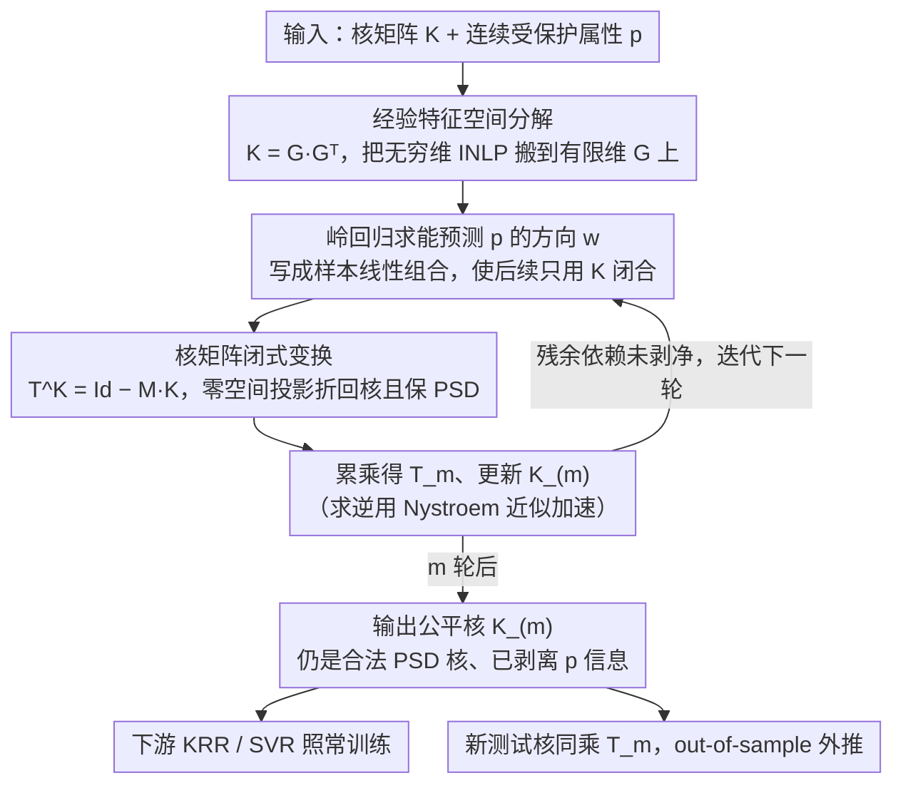

# Extending Fair Null-Space Projections for Continuous Attributes to Kernel Methods

**会议**: ICML 2026  
**arXiv**: [2511.03304](https://arxiv.org/abs/2511.03304)  
**代码**: https://github.com/Felix-St/FairKernelDecomposition (有)  
**领域**: AI安全 / 算法公平性 / 核方法  
**关键词**: 连续公平性、零空间投影、核方法、经验特征空间、SVR

## 一句话总结
本文把 Ravfogel 等人为线性模型设计的「迭代零空间投影 (INLP)」公平化方法搬到核方法上：通过在经验特征空间 (empirical feature space) 推导一个直接作用在核矩阵 $\mathbf{K}$ 上的闭式变换 $\mathbf{T}$，使得变换后的 $\mathbf{K}_{(m)}$ 仍是半正定核，但已被剥离了对连续受保护属性的预测信息，从而把任意基于核的算法（KRR、SVR）一键改造为「连续公平」版本，在 Crimes / ACSIncome / ACSTravelTime 上取得有竞争力或更优的 fairness–accuracy 帕累托。

## 研究背景与动机
**领域现状**：主流公平机器学习几乎都假设受保护属性 (protected attribute) 是离散的、目标也是离散的——比如「种族」分桶、「性别」二分类——并据此定义 Demographic Parity / Equalized Odds 等指标。但欧盟反歧视法律里明确写出的「年龄」本身就是连续量，「种族」在社科调查里通常以「黑人人口占比」这种连续值出现，把它们硬切成桶既不自然也会损失信息。「连续公平」(continuous fairness，即目标和受保护属性都连续) 因此是一个被忽视但实际中真正需要的设定。

**现有痛点**：处理连续公平的主流方法是把某个公平度量 (HGR、GDP、PF) 作为正则项或对抗约束嵌进优化目标——这类做法绑定特定度量、特定模型、特定优化器，换一个 fairness score 就要重设损失。另一条路线 INLP (Ravfogel 等 2020) 思路更优雅：迭代找出能预测受保护属性的方向，把数据投到它的零空间。INLP 是「模型无关 + 度量无关」的预处理方法，但目前只在线性模型或神经网络中间嵌入上验证过，**无法直接应用于核方法**：核诱导的特征空间往往是无穷维的（RBF 就是典型例子），不能朴素地存下特征向量去做投影。

**核心矛盾**：要把 INLP 的「先剥离信息、再喂给任何下游模型」这种解耦优势带到核方法（特别是回归任务上的 Kernel Ridge Regression / Support Vector Regression）里，必须找到一种**只通过 $n\times n$ 核矩阵 $\mathbf{K}$ 就能完成零空间投影**的方法——既要绕开无穷维特征空间，又要保证投影后的矩阵仍是合法核（半正定）以维持下游优化的凸性。

**本文目标**：(1) 推导一个直接作用于 $\mathbf{K}$ 的闭式变换，等价于在特征空间做零空间投影；(2) 证明变换保 PSD、可外推到测试点、可叠多次迭代；(3) 在真实「连续公平」数据集上验证其作为通用前处理工具的有效性。

**切入角度**：作者借助「经验特征空间 (empirical feature space)」这一经典工具——核矩阵 $\mathbf{K}=\mathbf{Q}\boldsymbol{\Lambda}\mathbf{Q}^\top = \mathbf{G}\mathbf{G}^\top$，其中 $\mathbf{G}\coloneq \mathbf{Q}\boldsymbol{\Lambda}^{1/2}$ 是一个 $n$ 维显式表示，几何上与训练集所张子空间等距同构。在 $\mathbf{G}$ 上做 INLP 是有限维操作，再把所有运算用核技巧重写回 $\mathbf{K}$ 上即可。

**核心 idea**：「在经验特征空间里做 INLP，然后把所有 $\mathbf{G}$ 上的投影代数等价地塞进核矩阵的一次右乘变换 $\mathbf{T}^{\mathbf{K}}=\mathrm{Id}-\mathbf{M}\mathbf{K}$」——这就是论文称之为 Fair Kernel Decomposition (FKD) 的方法。

## 方法详解

### 整体框架
本文要解决的是「INLP 这种迭代零空间投影只能在有限维特征上做，但核方法（尤其 RBF）的特征空间往往无穷维，没法显式存下来投影」的矛盾。FKD 的核心转换是：不去碰那个无穷维特征空间，而是借经验特征空间把核矩阵分解成 $\mathbf{K}=\mathbf{G}\mathbf{G}^\top$，在有限维的 $\mathbf{G}$ 上完成 INLP，再把所有投影代数等价地折回成对核矩阵 $\mathbf{K}$ 的一次右乘变换 $\mathbf{T}^{\mathbf{K}}=\mathrm{Id}-\mathbf{M}\mathbf{K}$。整套流程是「外层迭代、内层闭式更新」：每轮先拟合一个能预测受保护属性 $\mathbf{p}$ 的岭回归方向，构造其零空间投影，压缩成核变换并累乘进总变换 $\mathbf{T}_{(m)}$，输出一个被剥离了 $\mathbf{p}$ 信息、但仍是合法 PSD 核的 $\mathbf{K}_{(m)}$；下游任意核方法（KRR、SVR）拿它照常训练，新测试点用同一个 $\mathbf{T}_{(m)}$ 变换测试核即可外推。

### 关键设计

**1. 经验特征空间里的零空间投影：把无穷维上做不了的 INLP 换到有限维上做**

INLP 的标准套路是「迭代找出能预测受保护属性的方向、再把数据投到它的零空间」，但这一步对 RBF 这种无穷维核根本无从下手，因为你存不下特征向量。作者的破局点是经验特征空间：把 PSD 核矩阵特征分解为 $\mathbf{K}=\mathbf{Q}\boldsymbol{\Lambda}\mathbf{Q}^\top=\mathbf{G}\mathbf{G}^\top$，其中 $\mathbf{G}\coloneq\mathbf{Q}\boldsymbol{\Lambda}^{1/2}$ 是一个 $n$ 维显式表示，几何上与训练集所张子空间等距同构，且满足 $k(\mathbf{x}_i,\mathbf{x}_j)=\langle\mathbf{g}_i,\mathbf{g}_j\rangle$。于是 INLP 可以搬到这个有限维的 $\mathbf{G}$ 上跑：先用岭回归求方向 $\mathbf{w}=\mathbf{G}^\top(\mathbf{G}\mathbf{G}^\top+\tilde{\alpha}\mathrm{Id})^{-1}\mathbf{p}$——这种写法是关键，它把 $\mathbf{w}$ 表达成「样本的线性组合」，让后续运算可以只用 $\mathbf{K}$ 闭合；再做零空间投影 $\mathbf{P}^{\mathbf{G}}=\mathrm{Id}-\mathbf{w}(\mathbf{w}^\top\mathbf{w})^{-1}\mathbf{w}^\top$，多轮迭代即 $\mathbf{G}_{(m)}=\mathbf{G}_{(0)}\prod_{i=0}^{m-1}\mathbf{P}^{\mathbf{G}_{(i)}}$，Lemma 3.1 保证一连串投影的乘积仍是投影。之所以要迭代多轮，是因为单次投影只能消掉最显著的那个预测方向，残余的非线性依赖得靠多轮逐步剥净。

**2. 核矩阵闭式变换 $\mathbf{T}^{\mathbf{K}}=\mathrm{Id}-\mathbf{M}\mathbf{K}$：把投影折回核矩阵且保持半正定**

光在 $\mathbf{G}$ 上投影还不够，下游核方法吃的是核矩阵，必须把「投影后再求 $\mathbf{G}'{\mathbf{G}'}^\top$」这一整套折回到对核矩阵的操作，而且不能破坏半正定性（否则 SVR 的二次规划不再是凸的）。Theorem 3.2 给出的恰是这样一个一步到位的右乘：定义 $\tau_{\text{norm}}\coloneq(\mathbf{w}^\top\mathbf{w})^{-1}$、$\mathbf{M}\coloneq(\mathbf{K}_{(m)}+\tilde{\alpha}\mathrm{Id})^{-1}\mathbf{p}\,\tau_{\text{norm}}\,\mathbf{p}^\top(\mathbf{K}_{(m)}+\tilde{\alpha}\mathrm{Id})^{-1}$，则单轮更新为 $\mathbf{K}_{(m)}=\mathbf{K}_{(m-1)}(\mathrm{Id}-\mathbf{M}\mathbf{K}_{(m-1)})$，累积形式 $\mathbf{T}_m=\prod_{i=0}^{m-1}\mathbf{T}^{\mathbf{K}_{(i)}}$ 使得 $\mathbf{K}_{(m)}=\mathbf{K}_{(0)}\mathbf{T}_m$，同一个 $\mathbf{T}_m$ 直接作用在测试核上就自然完成了 out-of-sample extension。Corollary 3.3 证明这个变换保 PSD，所以输出「还是一个合法核」；而把形式定成右乘 $\mathrm{Id}-\mathbf{M}\mathbf{K}$ 而非更一般的相似变换，正是为了守住这条 PSD 性质。这套设计的妙处在于：所有「公平化」逻辑都封进了核矩阵预处理，下游既不改优化目标也不绑定某个 fairness score，因而是「模型无关 + 度量无关」的——这和 Pérez-Suay 等把 HSIC 塞进 KRR 目标的 KRR-FKL 路线截然不同；要扩展到多个受保护属性，也只需把 $\mathbf{p}\in\mathbb{R}^n$ 换成矩阵 $\mathbf{p}\in\mathbb{R}^{n\times l}$，理论无需重写。

**3. Nystroem 近似 + 工程实现：把每轮 $\mathcal{O}(n^3)$ 求逆压到可跑**

精确版每轮都要对 $n\times n$ 矩阵求逆，总复杂度 $\mathcal{O}(m\cdot n^3)$，在万级样本上就已经不友好。Algorithm 1 把每轮拆成维护 $\mathbf{B}=(\mathbf{K}_{(i-1)}+\tilde{\alpha}\mathrm{Id})^{-1}$、$\tau_{\text{norm}}=(\mathbf{p}^\top\mathbf{B}\mathbf{K}_{(i-1)}\mathbf{B}\mathbf{p})^{-1}$、$\mathbf{M}=\mathbf{B}\mathbf{p}\tau_{\text{norm}}\mathbf{p}^\top\mathbf{B}$、$\mathbf{T}^{\mathbf{K}_i}=\mathrm{Id}-\mathbf{M}\mathbf{K}_{(i-1)}$，瓶颈集中在 $\mathbf{B}$ 的求逆，于是用 Drineas & Mahoney 的 Nystroem 近似替换；此外不显式存储 $\mathbf{T}_{(i)}$、合理安排矩阵乘法顺序还能进一步省内存（细节在 Appendix C）。实验 §4.5 显示近似版的 fairness–accuracy 帕累托与精确版几乎重合，说明这层工程近似没有损失关键性质——但作者也坦诚 $\mathcal{O}(n^2)$ 的核矩阵存储本身仍然是大规模扩展的天花板，Nystroem 只解决了求逆时间而非存储。

### 损失函数 / 训练策略
方法本身不引入新损失；内层岭回归用现成闭式解。下游模型按各自标准目标训练（KRR：闭式；SVR：标准对偶 QP），公平化通过对核矩阵的预处理实现。超参主要是迭代数 $m$（控制剥离强度）和岭正则 $\tilde{\alpha}$（控制每轮去除信息的「粒度」）；RBF 带宽与 KRR/SVR 自身超参先在非公平基线上 grid-search 锁定。

## 实验关键数据

### 主实验
评估集是公平回归典型三件套：Communities & Crimes（预测 crime rate，保护属性 = 黑人人口占比）、ACSIncome (Montana，保护属性 = 年龄)、ACSTravelTime (Montana，保护属性 = 年龄)。预测精度用 MAE，公平性同时报告 HGR [DP]、GDP [DP] 和 PF [EO] 三种度量；所有结果 5 折交叉验证，结果以「MAE vs fairness」帕累托前沿形式呈现 (Figure 1)。基线包含 KRR-FKL (Pérez-Suay 2017，HSIC + KRR)、NN-HGR (Mary 2019)、以及预测均值的 dummy regressor。

| 数据集 | 公平度量 | 表现最佳方法 | 备注 |
|--------|---------|-------------|------|
| Crimes | HGR | NN-HGR / KRR-FKL（强正则区域）；SVR-FKD（弱正则区域略胜） | 三者在 GDP/PF 上差距更小 |
| Crimes | GDP / PF | SVR-FKD（弱正则区域明显领先） | 帕累托整体更靠左下 |
| ACSIncome | GDP（全线）| **SVR-FKD** 显著最佳 | KRR-FKD 被 KRR-FKL 压制，但两者都优于 NN-HGR |
| ACSTravelTime | 全部 3 个度量 | **只有 SVR-FKD** 在保持低 MAE 的同时拿到 fairness 改善；其它方法基本退化到 dummy 水平 | 凸显非线性投影的必要性 |

### 消融实验
| 配置 | 关键发现 | 说明 |
|------|---------|------|
| SVR-FKD vs SVR-INPL (线性投影 + 非线性 SVR，Fig. 3) | 同 $m$ 下 SVR-INPL 改善 fairness 慢得多；增大到 $m\in\{160,180,200\}$ 后 MAE 已涨但 fairness 停止改善 | 证明仅做线性零空间投影抓不住数据与受保护属性之间的非线性依赖；HGR / PF 上差距比 GDP 更显著 |
| 多保护属性 (Crimes：同时保护黑人 + 白人占比，Fig. 2a) | 「multi」相比只保护黑人占比的「single」对白人占比侧 fairness 帕累托更好，黑人占比侧几乎不变 | Theorem 3.2 自然支持 $\mathbf{p}\in\mathbb{R}^{n\times l}$，没有性能塌方 |
| 内层岭正则 $\tilde{\alpha}$ 扫描 (Crimes，Fig. 2b) | $\tilde{\alpha}$ 越大，每轮对 MAE 的伤害越大；小 $\tilde{\alpha}$ 对应「更精细地剥离信息」 | 建议小 $\tilde{\alpha}$ + 用 $m$ 调节剥离强度 |
| Nystroem 近似 (Crimes，Fig. 4) | 用不同比例的 component 做 inverse 近似，帕累托曲线与精确版定性一致 | 工程上可换来显著加速、不损失公平性能 |

### 关键发现
- SVR + FKD 是最强组合：在三个数据集上几乎都拿到帕累托前沿，作者推测 SVR 的 $\epsilon$-不敏感损失对预处理后核结构更稳健，KRR 在某些 fairness 度量上反而被 HSIC 路线 (KRR-FKL) 压制。
- 「需要非线性投影」这件事在 ACSTravelTime 上最明显——所有基线方法预测能力都坍缩到 dummy 水平，只有 FKD 还能同时压住 fairness 和 MAE，说明真实世界中受保护属性与目标的耦合往往是非线性的。
- 内层岭正则 $\tilde{\alpha}$ 的角色不是经典「防过拟合」而是「控制信息剥离粒度」，这一发现给后续调参提供了直觉：尽量小 $\tilde{\alpha}$ + 用 $m$ 当主旋钮。
- 多保护属性扩展几乎免费：只需把 $\mathbf{p}$ 维度提升，理论与算法不需要重写——这是「模型无关 + 度量无关 + 属性数无关」预处理范式的实际红利。

## 亮点与洞察
- 「经验特征空间 + INLP」这个组合是个干净的范式重组：经验特征空间是核学习里的老工具（Schölkopf 1999），INLP 是 NLP debiasing 里的老技巧（Ravfogel 2020），但把两者拼到「连续公平 + 回归 + 任意核」这个空缺设定上，需要 Theorem 3.2 把投影闭包成 PSD-保持的核变换，这一步是真正的非平凡贡献。
- 「预处理而非约束」的解耦思想可迁移：只要某个下游模型基于核矩阵，就可以直接拿 $\mathbf{K}_{(m)}$ 替换原核，无需改动训练代码——这跟把 fairness 作为损失项的主流做法是完全不同的工程承载方式，更容易嵌入既有 ML pipeline 和实现 pluggable 公平约束。
- $\mathbf{T}^{\mathbf{K}}=\mathrm{Id}-\mathbf{M}\mathbf{K}$ 这种「右乘一个鞍点结构」的形式本身值得记忆：保 PSD、能闭式叠迭代、能扩到多个属性、能用 Nystroem 加速。这一形式之于核方法上的「属性剥离」很可能像 INLP 之于 NLP embeddings 一样具有再使用价值。
- 关于 $\tilde{\alpha}$ 的解读颇有启发——它扮演的是「信息剥离 vs 信号保留」的旋钮，把「正则项」重新解读为「剥离力度调节器」，提示我们用经典工具时不能照搬经典直觉。

## 局限性 / 可改进方向
- 存储瓶颈仍在：$\mathcal{O}(n^2)$ 的核矩阵存储是核方法的本质天花板，Nystroem 只能解决 $\mathcal{O}(n^3)$ 的求逆时间。要把 FKD 上推到十万级以上样本，恐怕需要彻底走 Random Fourier Features 或直接在 Nystroem 的低秩表示里做投影。
- 实验设定相对保守：三个数据集都是经典 fairness 基准，但 Bao 等 2021 早已质疑过这类数据的合理性；样本量都不大（ACS 选了 Montana 这种小州以求计算可行），方法在大数据 + 真实任务上的实际可用性仍待验证。
- 公平度量评估对比受 hyper-param 影响巨大：不同 $m / \tilde{\alpha}$ 选择产生不同帕累托点，论文没有给出自动选 $m$ 的原则，留给用户调；与 NN-HGR 等不同范式方法的比较受架构选择影响较大，作者也在脚注中坦承。
- 仅考虑回归 + 连续受保护属性：作者明确把「分类 + 连续保护属性」「回归 + 离散保护属性」、Gaussian Processes、直接在特征空间做投影都留作未来工作；privacy 等其它「想抹除某种信息」的下游场景是潜在迁移方向。
- 与现代深度模型的衔接缺失：当下大量 ML 系统是端到端神经网络，本文方法直接作用于核矩阵，要想嵌入深度模型只能作用在中间表示并外接核——这一桥梁论文没有展开。

## 相关工作与启发
- **vs Ravfogel 2020 (INLP)**: 同样是「迭代找预测方向再投影」，本文把范围从线性模型 / 神经网络中间嵌入扩展到核诱导特征空间（含无穷维），核心新增是 Theorem 3.2 把投影压缩为 PSD-保持的核变换，且直接覆盖回归 + 连续属性。
- **vs Pérez-Suay 2017 (KRR-FKL)**: 他们用 HSIC 把独立性目标塞进 KRR 优化，是「修改优化目标」流派；本文是「预处理核矩阵」流派——模型/度量无关、可直接组合 SVR。实验上 KRR-FKD 不如 KRR-FKL，但 SVR-FKD 在多数设定下反超，说明预处理范式的红利在下游模型选择上有更高的灵活度。
- **vs Mary 2019 (NN-HGR)**: 神经网络 + HGR 上界正则化是当前连续公平的强基线，本文方法在 GDP 和 PF 度量、特别在中小数据上表现更好；且 FKD 不依赖梯度训练、不需选神经网络架构，工程上更稳健。
- **vs Tan 2020 (GP fair subspace)**: 都涉及子空间方法，但 Tan 是在假设空间中找对齐子空间，本文则直接对数据所在特征空间投影，几何含义更直观。
- 启发：把「预处理 + 闭式变换」抽象出来，可以套用到其它「想从核矩阵里抹掉某种信息」的任务上——隐私（抹掉身份特征）、领域泛化（抹掉域 ID）、解耦表示（抹掉某种 nuisance 因子）等。

## 评分
- 新颖性: ⭐⭐⭐⭐ 把 INLP 干净地扩到核方法的 closed-form + PSD 保持版本，是一篇技术上扎实的「填空」工作，不算颠覆但解决了一个真实空缺
- 实验充分度: ⭐⭐⭐⭐ 三数据集 × 三 fairness 度量 × 多种基线 + 多个消融（多属性、$\tilde{\alpha}$ 扫描、线性 vs 非线性投影对比、Nystroem 近似），覆盖了关心的所有维度，但数据集规模偏小
- 写作质量: ⭐⭐⭐⭐ 推导严谨、动机清晰、把社科视角下连续 fairness 的现实需求讲得很到位；附录补全了证明和实现细节
- 价值: ⭐⭐⭐⭐ 给「想在核方法上做连续公平」的从业者一个 pluggable、PSD-保持、可外推的工具；对 SVR 这一经典回归器尤其有价值，可立即落地到反歧视相关的真实预测任务

<!-- RELATED:START -->

## 相关论文

- [\[CVPR 2026\] Batman: Benign Knowledge Alignment Through Malicious Null Space in Federated Backdoor Attack](../../CVPR2026/ai_safety/batman_benign_knowledge_alignment_through_malicious_null_space_in_federated_back.md)
- [\[ICML 2026\] Position: Beyond Sensitive Attributes, ML Fairness Should Quantify Structural Injustice via Social Determinants](position_beyond_sensitive_attributes_ml_fairness_should_quantify_structural_inju.md)
- [\[ICML 2026\] Demystifying the Optimal Fair Classifier in Multi-Class Classification](demystifying_the_optimal_fair_classifier_in_multi-class_classification.md)
- [\[ICML 2026\] Fair Dataset Distillation via Cross-Group Barycenter Alignment](fair_dataset_distillation_via_cross-group_barycenter_alignment.md)
- [\[ICML 2026\] Fair Decisions from Calibrated Scores: Achieving Optimal Classification While Satisfying Sufficiency](fair_decisions_from_calibrated_scores_achieving_optimal_classification_while_sat.md)

<!-- RELATED:END -->
