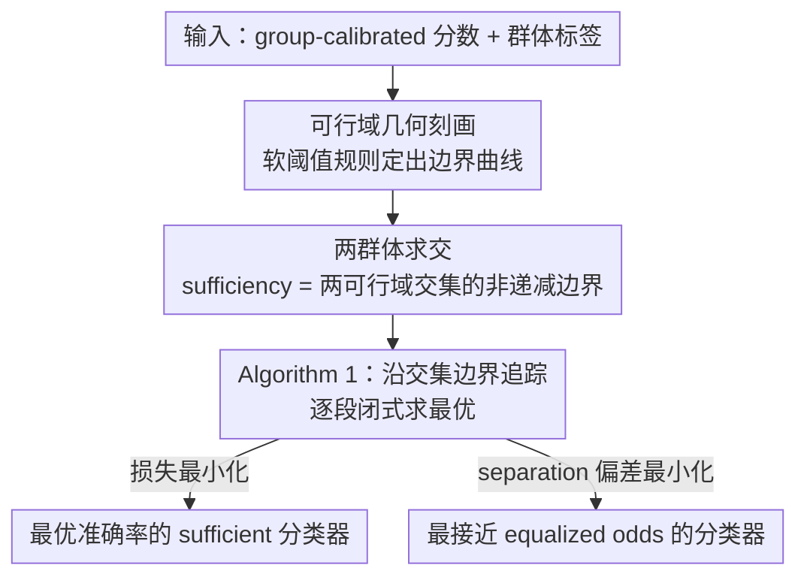

# Fair Decisions from Calibrated Scores: Achieving Optimal Classification While Satisfying Sufficiency

**会议**: ICML 2026  
**arXiv**: [2602.07285](https://arxiv.org/abs/2602.07285)  
**代码**: https://github.com/etambenger/fair-decisions-from-calibrated-scores (论文承诺将公开)  
**领域**: AI Safety / 算法公平性  
**关键词**: 算法公平、Sufficiency、Predictive Parity、Calibrated Scores、后处理

## 一句话总结
本文针对"即使分数在各群体上完全 group-calibrated，对其取单一阈值也会违反 sufficiency（predictive parity）"这一长期被忽视的痛点，给出有限离散分数下 sufficiency 约束最优二元分类器的**精确解**：通过对 $(\mathrm{PPV}, \mathrm{FOR})$ 可行域的几何刻画，得到一个只依赖分数和群体标签的后处理算法，并证明该算法同时可解"损失最小化"和"在 sufficiency 下最小化与 separation 的偏差"两类目标。

## 研究背景与动机

**领域现状**：算法公平性研究通常围绕三大互不相容的统计准则——independence（demographic parity）、separation（equalized odds）、sufficiency（predictive parity）展开。前两者的标准做法是后处理：训一个分数 $S$，再按群体阈值化或随机化（Hardt et al., 2016；Corbett-Davies et al., 2017）。一个被频繁引用的"良性结论"是：如果分数 $S$ 本身已经满足某个准则，那么任何后处理（例如单一阈值）都会保留该准则。

**现有痛点**：这条良性结论对 sufficiency **不成立**。即便 $S$ 是真条件概率 $P(Y=1\mid X,A)$（自然满足 sufficiency），对它取一个全局阈值得到的二元决策 $R$ 也几乎总会违反 predictive parity——这正是 COMPAS 累犯风险评分案例中"分数 calibrated、决策却偏差"的根本原因（Chouldechova, 2017；Canetti et al., 2019）。

**核心矛盾**：sufficiency 的等式 $P(Y=1\mid R,A)=P(Y=1\mid R)$ 是对**离散二元结果** $R$ 的群体条件分布约束，而单一阈值在不同群体上诱导出的 $\Pr(R=1\mid A=a)$ 不同，会破坏 PPV/FOR 在群体间的一致性。已有工作要么允许 abstention（Canetti et al., 2019），要么强假设分数连续且 full support（Baumann et al., 2022），要么只逼近 sufficiency（Celis et al., 2019；Delaney et al., 2024）。**没有一个方法**给出"有限离散 group-calibrated 分数下的精确最优 sufficient 分类器"。

**本文目标**：在最贴近实际部署的设定（分数有限离散、group-calibrated）下，回答三个问题——(i) 哪些 $(\mathrm{PPV},\mathrm{FOR})$ 对子是 sufficient 分类器可实现的？(ii) 在这些可行对子中，如何精确找到使期望损失最小的那一个？(iii) sufficiency 与 separation 不能同时严格满足，那么能否在严格满足 sufficiency 的前提下，把对 separation 的偏离压到最小？

**切入角度**：作者发现，给定一个群体内的分数分布，所有可由该分数构造的（可能随机化的）二元分类器，其 $(\mathrm{PPV},\mathrm{FOR})$ 对在二维平面上构成一个**带闭式描述的星凸（star-convex）区域** $\mathcal{C}$，其边界由"软阈值规则"取到。一旦把每个群体的可行域 $\mathcal{C}^a$ 几何化，sufficiency 就退化为"在交集 $\mathcal{C}^0\cap\mathcal{C}^1$ 中挑点"。

**核心 idea**：把"找最优 sufficient 分类器"重新表述为"沿可行域交集的二维曲线边界做一维优化"，并设计一个 $O(m^0+m^1)$ 段的边界追踪算法，用同一框架同时求解损失最小化和 separation 偏差最小化。

## 方法详解

### 整体框架
方法要解决的是：在分数已经 group-calibrated、但取阈值仍会违反 sufficiency 的设定下，精确求出满足 sufficiency 的最优二元分类器。核心思路是把决策规则的搜索搬到 $(\mathrm{PPV},\mathrm{FOR})$ 二维平面上——每个群体由其分数分布诱导出一块可行域 $\mathcal{C}^a$，sufficiency 等价于"在两群体可行域的交集里挑一个点"，于是问题从无穷维的随机化规则搜索退化为沿交集边界的一维优化。整套流程只需要 group-calibrated 分数和群体标签，是纯后处理。

### 关键设计

**1. $(\mathrm{PPV},\mathrm{FOR})$ 可行域的几何刻画：把无穷维规则搜索压成一条二维曲线**

单群体内，所有可由分数 $S$ 构造的（含随机化）二元规则 $R$ 都对应平面上一个点 $(p,q)=(\mathrm{PPV}(R),\mathrm{FOR}(R))$，本文给出这块可行域 $\mathcal{C}$ 的精确闭式。把分数按降序排 $s_1>\dots>s_m$，引入选择率 $\mu=P(R=1)$；由 calibration 与 Markov 链 $Y\!\leftrightarrow\! S\!\leftrightarrow\! R$ 可推出基础等式 $\pi=\mu p+(1-\mu)q$，几何上意味着"固定 $\mu$ 时所有 $(p,q)$ 落在过中心 $(\pi,\pi)$、斜率 $-\mu/(1-\mu)$ 的同一条直线上"。固定 $\mu$ 再最大化 $p$ 是一个以分数为系数的线性规划，恰好退化成 Dantzig (1957) 的分数背包贪心解：选最大的几个分数 bin、最后一个 bin 用随机化补齐——也就是软阈值规则 $P(R^\*=1\mid s_i)$ 仅在某个 $k^\*(\mu)$ 处取分数值。

代回基础等式得到边界的分段闭式 $p^\*(\mu)=s_k+c_k/\mu$（其中 $c_k=\sum_{i<k}P(s_i)(s_i-s_k)$），整条边界 $\partial\mathcal{C}$ 由 $m-1$ 段超曲线弧加两条直边构成，各弧端点正好是 $\mu_k=\sum_{i\le k}P(s_i)$ 对应的硬阈值。这一刻画之所以关键，是因为 $\mathcal{C}$ 关于中心 $(\pi,\pi)$ 星凸，任何内部点都能由边界点与 $(\pi,\pi)$ 的凸组合复现，所以最优解一定在边界上，搜索从无穷维规则空间缩到一条一维参数化曲线。

**2. 多群体 sufficiency = 两可行域交集的非递减边界**

sufficiency 要求两群体共享同一对 $(\mathrm{PPV},\mathrm{FOR})$，即 $p^0=p^1=p,\,q^0=q^1=q$，这正好翻译成几何条件 $(p,q)\in\mathcal{C}^0\cap\mathcal{C}^1$。每个 $\mathcal{C}^a$ 的非平凡边界都能写成非递减函数 $q^a(p)$（公式 (7)），交集边界则由逐点取大 $q(p)=\max\{q^0(p),q^1(p)\}$ 给出，仍是非递减曲线。把 $p$ 轴上由两群体 breakpoints $\{p_k^0\},\{p_l^1\}$ 共同细分出的区间记为 $J_{k,l}$，每段上 $q^0,q^1$ 都是有理函数，二者之差归结为一个二次函数 $\Phi_{k,l}(p)$ 的符号，每段内至多 2 个交点，因此哪个群体的边界"在上面"只会切换有限多次。

这个刻画顺带揭示了一个反直觉现象：交集边界上的最优点通常不对应任何群体的硬阈值规则（图 2 给出反例，连任一群体的 breakpoint 都不被边界经过），至少一个群体必须用随机化决策。这就从几何上解释了"为什么仅靠群体相关的硬阈值无法达到 sufficiency 最优"，并说明随机化是必需的。

**3. Algorithm 1：一次边界追踪同时求解两类目标**

有了交集边界，求最优分类器就退化成沿 $\partial(\mathcal{C}^0\cap\mathcal{C}^1)$ 遍历所有 $J_{k,l,i}$ 子段（按 $\Phi_{k,l}$ 的根再细分），在每段闭式求该段最优、最后取全局最优。算法维护当前 active group $a\in\{0,1\}$ 与索引 $(k,l)$，每段只花 $O(1)$，总段数约 $m^0+m^1$。关键是两类常被对立讨论的目标都能在每段内闭式求解：损失最小化时把 $\mu=(\pi-q)/(p-q)$ 代回期望损失得 $L=\pi\ell_{01}+\frac{\pi-q}{p-q}\bigl(\ell_{10}-p(\ell_{01}+\ell_{10})\bigr)$，对 $p$ 的一阶条件归为解二次方程；与 separation 偏差最小化时把 TV 距离展开得 $\Delta_{\mathrm{sep}}(R)=K\bigl(\frac{1-\mu}{p-\pi}-\frac{\mu(p-\pi)}{\pi(1-\pi)}\bigr)$，对 $p$ 求导非正、最小点同样落在边界且每段闭式。

因为两类目标共用同一份几何骨架，从业者可以显式画出两条最优曲线、按应用场景挑选，而不被某个事先指定的损失函数绑死——这也是把"准确率最优"与"最接近 equalized odds"统一进一个算法的意义。

### 损失函数 / 训练策略
方法是纯后处理：不重训打分模型、不需要原始特征，只用 group-calibrated 分数和群体标签即可输出决策规则 $P(R=1\mid S,A)$。当真实场景中 calibration 只是近似（如用 out-of-fold 预测做分箱标定）时，作者在附录 J 给出鲁棒性界，并在 ACS Income 上验证 predictive parity 违反量级很小（PPV gap $4.8\times 10^{-3}$）。

## 实验关键数据

### 主实验
| 数据集 | 设定 | Unconstrained Bayes 准确率 | 本文最优 sufficient 准确率 | 公平性结果 |
|--------|------|---------------------------|---------------------------|------------|
| FICO（白/黑，200 score bins） | 群体级 calibrated | 0.8819（PPV: 0.91 / 0.79；FOR: 0.20 / 0.13） | 0.8676 | 共同 PPV $=0.91$，共同 FOR $=0.23$，严格 sufficiency |
| COMPAS（白/黑，10 decile scores） | 用 pooled $P(Y=1\mid d)$ 当作 group-calibrated | —— | —— | 最优点落在 $\partial\mathcal{C}^1$ 的硬阈值 breakpoint（黑人组阈值 $\ge 5$），白人组必须随机化 |
| ACS Income（CA，性别） | logistic + out-of-fold 100-bin 校准 | 0.8190 | 0.8167 | mean PPV gap $4.8\times 10^{-3}$，mean FOR gap $3.7\times 10^{-3}$ |

### 消融 / 结构性观察
| 观察 | 结论 | 说明 |
|------|------|------|
| 最优点是否对应硬阈值 | FICO/COMPAS 都有至少一个群体必须随机化 | 验证了"sufficiency 最优解一般无法仅由硬阈值实现"的理论预言 |
| Loss-optimal vs $\Delta_{\mathrm{sep}}$-optimal | 图 2 左：两者重合；图 2 右：分离 | 两者在不同问题上可能落在边界不同位置，本文算法可同时给出供选择 |
| Calibration 近似时的 PPV/FOR 漂移 | ACS 上 $\sim 4\times 10^{-3}$ 级别 | 工程实践中可接受，且远小于附录 J 的最坏界 |

### 关键发现
- "几何视角"直接产出**结构性洞察**：交集边界几乎不与任何群体的硬阈值 breakpoint 重合，意味着任何不允许随机化或不允许群体相关规则的部署框架，**理论上就无法**达到 sufficiency 最优。
- 准确率代价**温和**：FICO 上从 0.8819 降到 0.8676、ACS 上从 0.8190 降到 0.8167，仅 $\sim 1\%$～$1.6\%$，因为 sufficiency 与准确率的不兼容性远弱于 separation 与准确率（这一结论本身也呼应了 Dwork et al., 2012）。
- 同一算法兼顾"准确率最优"与"separation 最接近"：在很多实例中两者吻合或接近，工程上可"先看两条曲线再决策"，无需 retrain。

## 亮点与洞察
- **把公平性问题翻译成 2D 几何**是本文最优雅的地方：一旦 $(\mathrm{PPV},\mathrm{FOR})$ 平面上画出 $\mathcal{C}^a$ 与交集，整套理论几乎"看图说话"，非常便于跟领域专家沟通——这种"几何先行、算法跟上"的范式可迁移到 separation 或 multi-group 设定。
- **软阈值的最优性**（Theorem 3.3）等价于分数背包贪心，提示我们：很多"看起来需要复杂优化"的公平后处理本质都是排序+边界搜索，复杂度低到可以在线部署。
- **承认随机化的不可避免**很关键。许多实际场景（信贷、保释）抗拒"对相同分数做随机决策"，但本文以几何证据说明：在多群体严格 sufficiency 下，**拒绝随机化等于拒绝最优**——这给政策讨论提供了硬约束。

## 局限与展望
- 群体数量增多时，多个 $\mathcal{C}^a$ 同时有非空交集的条件变得苛刻，**严格 sufficiency 可能无可行解**；作者建议未来研究在多群体下放松到 PPV/FOR 差距最小化。
- 假设分数 **group-calibrated**。虽然 multicalibration（Hébert-Johnson et al., 2018）和 isotonic/Platt scaling 可逼近，但实际中 calibration 误差会传导成 predictive parity 违反；附录 J 给出最坏界，但缺少在分布漂移、标签噪声下的系统评估。
- 实验偏"案例研究"，只跑了 FICO / COMPAS / ACS Income 三个数据集，未与 OxonFair（Delaney et al., 2024）等近期工具在统一基准上对比相对精度损失。
- 当前公式只覆盖二元 $A$；多于两组的扩展虽然作者声称"直接"，但 $\Phi_{k,l}$ 的多元推广和复杂度未给出。
- 决策结果是"群体相关 + 可能随机化"，在某些司法/伦理框架下可能不可接受，方法的可部署性需要结合具体监管讨论。

## 相关工作与启发
- **vs Canetti et al. (2019)**：他们通过引入"abstain"动作来满足 sufficiency；本文不需要弃权，直接在 $(\mathrm{PPV},\mathrm{FOR})$ 平面上找最优——更贴近实际部署（很多场景必须给出 0/1 决策）。
- **vs Baumann et al. (2022)**：同样追求无 abstain 的 sufficiency 后处理，但他们假设分数连续且 full support；本文恰恰针对**有限离散分数**，这正是 COMPAS 等真实评分系统的设定，因此可适用面显著扩大。
- **vs Hardt et al. (2016)（separation/equalized odds 后处理）**：那篇是 separation 后处理的"教科书答案"，本文则是 sufficiency 的对应版本，并额外给出"在 sufficiency 下最小化与 separation 距离"的折中——把两条传统对立路线拼成一个统一框架。
- **vs Zeng et al. (2022)（fair Bayes-optimal under predictive parity）**：他们只约束正决策的 PPV 相等；本文同时约束 PPV 和 FOR，覆盖完整的 predictive parity，理论更严。

## 评分
- 新颖性: ⭐⭐⭐⭐ 在最贴合实际的"有限离散 group-calibrated 分数"设定下首次给出 sufficiency 最优的精确解，并以几何视角统一了 loss / separation 两类目标。
- 实验充分度: ⭐⭐⭐ 三个经典案例够说明方法可用，但缺与 OxonFair / Zeng 2022 等基线的同基准定量比较。
- 写作质量: ⭐⭐⭐⭐⭐ 定义、定理、几何图、算法伪代码层层递进，几乎每个结论都有图示，可读性极高。
- 价值: ⭐⭐⭐⭐ 给出"为什么 calibrated 也不够"的清晰证明并解决之，对信贷、刑事司法、医疗等高 stakes 决策直接有指导意义。

<!-- RELATED:START -->

## 相关论文

- [\[ICML 2026\] Demystifying the Optimal Fair Classifier in Multi-Class Classification](demystifying_the_optimal_fair_classifier_in_multi-class_classification.md)
- [\[ICML 2026\] Fair Dataset Distillation via Cross-Group Barycenter Alignment](fair_dataset_distillation_via_cross-group_barycenter_alignment.md)
- [\[ICML 2026\] Extending Fair Null-Space Projections for Continuous Attributes to Kernel Methods](extending_fair_null-space_projections_for_continuous_attributes_to_kernel_method.md)
- [\[ICML 2026\] Fairness in Aggregation: Optimal Top-$k$ and Improved Full Ranking](fairness_in_aggregation_optimal_top-k_and_improved_full_ranking.md)
- [\[ICML 2026\] Optimal Transport under Group Fairness Constraints](optimal_transport_under_group_fairness_constraints.md)

<!-- RELATED:END -->
