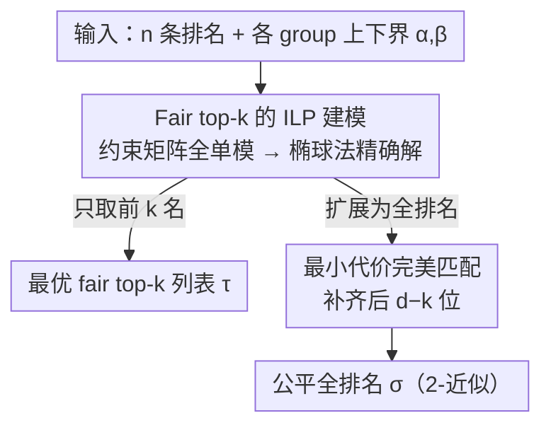

# Fairness in Aggregation: Optimal Top-$k$ and Improved Full Ranking

**会议**: ICML 2026  
**arXiv**: [2605.23265](https://arxiv.org/abs/2605.23265)  
**代码**: https://github.com/Aussiroth/Spearman-FRA  
**领域**: AI 安全 / 算法公平性  
**关键词**: 公平排名聚合, Spearman footrule, Top-k, 全单模矩阵, LP 松弛

## 一句话总结
在 Spearman footrule 距离下，把 ILP 的约束矩阵证成全单模，从而给出 fair top-$k$ 排名聚合的首个多项式时间最优算法；并以"先解 fair top-$k$，再用最小代价完美匹配补齐成全排列"的两步策略，把 fair (full) rank aggregation 的近似比从 3 改进到 2。

## 研究背景与动机

**领域现状**：排名聚合（rank aggregation）把多组偏好排序合成一份共识排名，是招聘、推荐、Web 搜索、元搜索等场景的核心原语。经典 metric 之一是 Spearman footrule，即两条排名的 rank-wise $L_1$ 距离 $F(\pi_1, \pi_2) = \sum_i |\pi_1(i) - \pi_2(i)|$；它和 Kendall-tau 至多差 2 倍 (Diaconis & Graham, 1977)，但计算上更友好，无约束情形可在多项式时间内求最优 (Dwork et al., WWW'01)。

**现有痛点**：无约束算法直接搬到带公平约束的场景会放大对弱势群体的代表性不足。已有 fair 版本只能做到 3-近似 (Wei et al., SIGMOD'22; Chakraborty et al., NeurIPS'22)：先给每个输入排名找一个最近的 fair 排名，再选总距离最小的——这是一个由三角不等式直接得到的 meta-algorithm，长期没人能突破。更糟的是，这个 3-近似只覆盖 full ranking，对于实际更关心的 top-$k$ 情形（招聘、推荐只看前 $k$ 个）也没有专门保证。

**核心矛盾**：fair 与 unconstrained 之间存在巨大的复杂度 gap——unconstrained 已经多项式可解，fair 却卡在 3-近似且看似无路可走。这个 gap 在 Wei et al. 中被明确列为 open problem。技术上的根本困难是：把问题写成 ILP 之后，标准 LP 松弛 + rounding 套路在公平约束下往往会破坏 minority protection / restricted dominance，造成约束违反。

**本文目标**：分解为两个子问题——(i) 给出 fair top-$k$ rank aggregation 的最优多项式算法；(ii) 给出 fair full rank aggregation 的更优近似比。

**切入角度**：与其在 LP 解上做 rounding（注定会违反公平约束），不如直接证明 LP 的约束矩阵是**全单模 (totally unimodular, TU)** 的——这样 LP 必然有整数最优解，用椭球法解 LP 就直接拿到 ILP 的最优。

**核心 idea**：fair top-$k$ 用"TU 结构 + 椭球法"求精确解；fair full ranking 用"先求 fair top-$k$ + 最小代价完美匹配扩展"的两步法，配合一个把 Spearman footrule 拆成左右位移的引理，把近似比拉到 2。

## 方法详解

### 整体框架

问题被拆成两个递进的子任务：先把"只关心前 $k$ 名"的 fair top-$k$ 排名聚合精确求解，再把这个 top-$k$ 解扩展成一个公平的全排名。形式上，$d$ 个候选被划分到 $g$ 个 group $G_1, \ldots, G_g$，每组给定比例下界 $\alpha_a$、上界 $\beta_a$，输入是 $n$ 条排名 $S \subseteq \mathcal{S}_d$。所谓 $(\bar\alpha, \bar\beta)$-$k$-fair，是要求输出前 $k$ 位里每个 group $G_a$ 出现的候选数落在 $[\lfloor \alpha_a k \rfloor, \lceil \beta_a k \rceil]$ 之间；目标则是最小化共识排名到所有输入排名的 Spearman footrule 距离之和。Fair top-$k$ 只输出含 $k$ 个候选的列表 $\tau$（$\tau$ 外候选按排在第 $k+1$ 位计代价，沿用 Fagin et al. 对 top-$k$ 距离的推广），fair full ranking 则输出 $d$ 个候选的全排名 $\sigma$。

### 关键设计

**1. Fair top-$k$ 的 ILP 建模与全单模性证明：让公平约束严格满足而非"近似满足"**

fair 组合优化的老大难是：写成 ILP 后做标准 LP 松弛 + rounding，公平约束往往在取整时被破坏（fair correlation clustering、fair $k$-clustering 都因此只能拿到带因子违反的解）。本文换了条路——不 rounding，而是直接证明 LP 松弛的约束矩阵本身是全单模 (TU) 的，这样 LP 的最优解天然是整数，用椭球法解 LP 就等于解出了 ILP 的精确最优。建模时用 $x_{ij} \in \{0,1\}$ 表示候选 $i$ 是否放在第 $j$ 位（$j \le k$），放置代价 $w_{ij} = \sum_{\pi \in S} |\pi(i) - j|$，约束是"每个候选至多占一个位置、每个位置恰好一个候选"加上每组的上下界 $\lfloor \alpha_a k \rfloor$ / $\lceil \beta_a k \rceil$。证 TU 用的是 Wolsey-Nemhauser 的等价刻画：对任意行集 $R$ 都要构造一个划分 $R = R_1 \cup R_2$ 让每列在两侧的元素和之差 $\le 1$；作者按行类型逐一安排——同一 group 的上界行与下界行属同侧从而互相抵消、位置约束统一进 $R_2$、候选约束按其所属 group 是否落在 $R$ 中决定归侧。TU 性正是把这个问题从困扰多年的 3-近似一步拉到精确解的关键 lever，因为它让公平约束被严格保住而不是被取整噪声打穿。

**2. 两步式 fair full rank aggregation：公平约束塞进 top-$k$，扩展退化成无约束匹配**

直接对全排名做"fair perfect matching"已被证 NP-hard（Appendix D），所以全排不能一步到位，本文把它拆成"先求 fair top-$k$、再补齐后 $d-k$ 位"两步。第一步并不直接用原始目标，而是让算法 $\mathcal{A}$ 解一个变体目标 $2 \sum_{\pi} \sum_{i \in D_\tau} (\pi(i) - \tau(i)) \cdot \mathbb{1}_{\tau(i) < \pi(i)}$——只统计 leftward displacement 再乘 2；由于这只改了目标系数、约束矩阵不变，TU 性原封不动，仍能多项式解出最优 fair top-$k$ 列表 $\tau$。第二步是一个"Minimum Cost Top-$k$ List Completion"子问题：固定 $\tau$ 不动，把剩下 $d-k$ 个候选填入第 $k+1, \ldots, d$ 位使整体目标最小，这等价于在 $2d$ 顶点的完全二部图上求最小代价完美匹配，$O(nd^2 + d^3)$ 可解。如此一来公平约束全集中在 top-$k$ 部分由 TU 精确处理，而"扩展到全排"退化成一个不带公平约束的匹配问题，两块都落在多项式可解范围内。

**3. 基于左右位移分解的 2-近似分析：把 footrule "半化"后对齐子算法目标**

要把已有 3-近似改进到 2，难点是直接给 $F(\pi,\sigma)$ 的 2 倍上界几乎无从下手。本文借 Mathieu-Mauras 的观察把它"半化"：Spearman footrule 恰等于向左位移总和的 2 倍（因为左右位移必然相等），即 $F(\pi,\sigma) = 2 \sum_i (\pi(i)-\sigma(i)) \mathbb{1}_{\sigma(i)<\pi(i)}$，于是只需分析 leftward displacement 这一半。设 $L, R$ 是输出 $\sigma$ 的前 $k$ / 后 $d-k$ 位元素集，$L^*, R^*$ 是最优解 $\sigma^*$ 的对应集合。前 $k$ 段靠算法 $\mathcal{A}$ 的最优性直接得 $\overleftarrow{\mathrm{Obj}}(\sigma_L) \le \overleftarrow{\mathrm{Obj}}(\sigma^*_{L^*})$；后 $d-k$ 段则构造一个对照排名 $\tilde\sigma$——把 $R \cap R^*$ 的元素抄到 $\sigma^*$ 中的位置，$R \setminus R^*$ 的元素（必落在 $L^*$）随意放置，由于它们在 $\tilde\sigma$ 里只会被往右挪、leftward displacement 只减不增，于是 $\overleftarrow{\mathrm{Obj}}(\sigma_R) \le \overleftarrow{\mathrm{Obj}}(\tilde\sigma_R) \le \mathrm{OPT}$。两段相加得 $\mathrm{Obj}(\sigma) \le \overleftarrow{\mathrm{Obj}}(\sigma^*_{L^*}) + \mathrm{OPT} \le 2\,\mathrm{OPT}$。这套位移分解还顺带给出"算法对 metric 选择鲁棒"的副产品——Spearman footrule 与 Kendall-tau 至多差 2 倍，直接推出 Kendall-tau 下的 4-近似。

### 损失函数 / 训练策略
本文是组合优化算法，无训练；最终运行靠 ellipsoid 法解 LP + Edmonds-Karp 求最小代价完美匹配，总复杂度多项式（实验里实际用 Gurobi 12.0.3 解 ILP）。

## 实验关键数据

### 主实验

数据集：(i) Movielens 子集——7 个用户对 268 部电影按 8 个 genre 分组的偏好排名；(ii) Fantasy Football——25 个专家对 57 名球员按所在 conference 分两组的 16 周排名。$\bar\alpha = \bar\beta$ 取各 group 在输入中的实际比例，作为"按比例公平"约束。

| 数据集 | 算法 | 与最优差距 | vs KT (Kendall-tau SOTA) | vs BFI (3-近似 SOTA) |
|--------|------|-----------|--------------------------|------------------------|
| Movielens | 本文 Algorithm 3 | 2%–3% | 低 5%–11% | 低 13%–15% |
| Football (week 4) | 本文 Algorithm 3 | ≤ 1% | 低 1%–2% | 低 5%–10% |

### 消融 / 鲁棒性实验

| 配置 | 数据集 | 结果 |
|------|--------|------|
| Algorithm 1（基础 2-近似） | Movielens | 比 BFI 好，但弱于 Algorithm 3 |
| Algorithm 3（取两个 2-近似算法的更优） | Movielens / Football | 实测全面胜出 |
| 换 metric 为 Kendall-tau（理论 4-近似） | Movielens | 仍比 BFI（3-近似）低 8%–10%，与 KT 相差 ≤ 2%，偶尔反超 |
| 换 metric 为 Kendall-tau | Football | 比 KT 至多差 2%，仍比 BFI 好 4%–10% |

### 关键发现
- 理论上是 2-近似，实测却始终 ≤ 3%（甚至 ≤ 1%）逼近最优——说明 2 这个常数远没有 tight，分析与实际还有可压缩空间。
- 双 2-近似算法取最优能稳定提升，说明两种算法的"坏 case"不重合，可低成本拿到额外收益。
- 该算法对距离度量鲁棒：用 Spearman 设计的算法在 Kendall-tau 上仍能胜过 BFI、接近 KT，说明"先 fair top-$k$ 后匹配补齐"的两步骨架对 $L_1$ 系 metric 普适。

## 亮点与洞察
- **用 TU 性绕开 fair LP rounding**：在 fair clustering / fair matching 文献里，fair 约束一直是 rounding 灾难，本文是第一个用全单模性把 fair 约束直接"嵌入" LP 整数最优解的工作，思路具有较强可迁移性。
- **目标函数微调保住 TU**：从精确目标切到"只数 leftward displacement"的目标，约束矩阵不变所以 TU 性原封不动，但新目标恰好和 2-近似分析中需要的不等式对齐——这是工程上很巧的"目标 hack"。
- **位移分解 + 子集对照排名**：把对手排名 $\sigma^*$ 的后 $k$ 部分按 $R \cap R^*$ / $R \setminus R^*$ 拆开论证，是一种把 fair 与 unconstrained 之间的损失"局部化"的好技巧，可借鉴到其它 metric 下的 fair 聚合分析。

## 局限与展望
- **2-近似常数还非 tight**：理论与实测之间有 10×–100× 的 gap，作者承认下界 / 更紧分析仍是 open。
- **公平定义偏弱**：只考虑 top-$k$ proportional fairness，未涵盖 block fairness、组重叠、属性不可见等更现实的设定。
- **metric 局限**：算法分析依赖 Spearman footrule 的左右位移对称性，Ulam、weighted Kendall 等其它 metric 暂未覆盖；4-近似 for Kendall-tau 还劣于 (Chakraborty et al., 2025b) 的 2-近似。
- **fair perfect matching NP-hard**：意味着完全端到端的"一步 fair 全排"路线被堵死，未来若想突破必须放松匹配的公平要求或换问题结构。

## 相关工作与启发
- **vs BFI (Chakraborty et al., NeurIPS'22 / Wei et al., SIGMOD'22)**：BFI 通过对每条输入排名求最近 fair 排名再选最优，得 3-近似；本文重新设计算法骨架，把近似比直接打到 2，是该方向首个理论突破。
- **vs KT (Chakraborty et al., 2025b)**：KT 是 Kendall-tau 下的 SOTA（18/7-近似，推论给出 Spearman 上的 36/7-近似），本文 Spearman 上严格更优；在 Kendall-tau 上本文算法虽是 4-近似但实测可与 KT 持平甚至略胜。
- **vs (Celis et al., NeurIPS'18) closest fair ranking**：他们求"对单条排名最近的 fair 排名"，本文则求"对一组排名的 fair 共识排名"——后者更难，但本文证明把前者作为 building block 不足以拿到好近似比。
- **启发**：TU 性 + ellipsoid 这套技术可迁移到其它"约束容易破 rounding"的 fair 组合优化（fair matroid intersection、fair flow），值得后续探索。

## 评分
- 新颖性: ⭐⭐⭐⭐ 用全单模性绕开 fair LP rounding 是该方向的新视角，且解决了 Wei et al. 留下的 open problem。
- 实验充分度: ⭐⭐⭐ 两个标准 fair RA 数据集 + 跨 metric 鲁棒性，覆盖足够；但都偏小（$d \le 268$），缺更大规模 stress test。
- 写作质量: ⭐⭐⭐⭐ 定义、定理、引理层次清楚，TU 证明的行划分构造写得很细致；不过对非组合优化读者门槛偏高。
- 价值: ⭐⭐⭐⭐ 理论上首个 fair top-$k$ 最优算法 + 全排近似比从 3 提到 2，是 fair ranking 文献的明确推进；实验也表明实测 gap 极小，能落地。

<!-- RELATED:START -->

## 相关论文

- [\[ICML 2026\] Optimal Transport under Group Fairness Constraints](optimal_transport_under_group_fairness_constraints.md)
- [\[CVPR 2026\] RankOOD: Class Ranking-based Out-of-Distribution Detection](../../CVPR2026/ai_safety/rankood_-_class_ranking-based_out-of-distribution_detection.md)
- [\[ICML 2026\] Demystifying the Optimal Fair Classifier in Multi-Class Classification](demystifying_the_optimal_fair_classifier_in_multi-class_classification.md)
- [\[ICML 2026\] Fair Decisions from Calibrated Scores: Achieving Optimal Classification While Satisfying Sufficiency](fair_decisions_from_calibrated_scores_achieving_optimal_classification_while_sat.md)
- [\[ICML 2026\] COPF: An Online Framework for Deployment-Stable Counterfactual Fairness in Evolving Graphs](copf_an_online_framework_for_deployment-stable_counterfactual_fairness_in_evolvi.md)

<!-- RELATED:END -->
