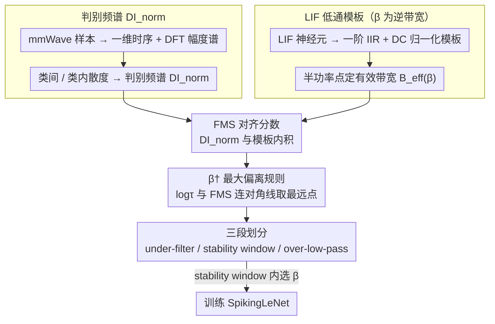

# Frequency Matching in Spiking Neural Networks for mmWave Sensing

**会议**: ICML 2026  
**arXiv**: [2605.09983](https://arxiv.org/abs/2605.09983)  
**代码**: [GitHub](https://github.com/yudi-mars/Soul)  
**领域**: 边缘感知 / 脉冲神经网络（SNN） / 无线感知  
**关键词**: LIF 神经元、IIR 低通滤波、毫米波感知、判别频谱、神经动力学-数据对齐

## 一句话总结
本文从「机制-数据对齐」角度证明 LIF 脉冲神经元等价于一个一阶 IIR 低通滤波器，并提出根据毫米波信号的判别频谱来设定膜衰减系数 $\beta$，使 SNN 在四个常用 mmWave 数据集上平均比 ANN 提高 6.22% 精度并降低 3.64× 理论能耗。

## 研究背景与动机
**领域现状**：毫米波雷达因隐私友好、抗光照、穿透性好，是边缘端做姿态、手势、活动识别的重要传感器。主流方案是 CNN / Transformer 等 ANN，靠堆深度和手工预处理拿到鲁棒性，能耗与延迟代价不低。

**现有痛点**：mmWave 信号天生稀疏、不规则、被多径与相位抖动产生的高频噪声严重污染；ANN 没有内置时间滤波偏置，要么先做手工低通预处理（连有用的高频判别信息也被砍掉），要么靠更深的网络硬拟合，能耗与延迟难以承受。

**核心矛盾**：判别信息常分布在「低-中频带」，而噪声集中在高频；现有 ANN/低通预处理都不能区分「有用的高频判别成分」与「真正的高频噪声」。已有 SNN 工作虽然展示了能效优势，但都是经验性 hyperparameter tuning，没人讲清楚「SNN 到底什么时候、为什么比 ANN 强」。

**本文目标**：从信号处理的角度回答两个问题——（1）SNN 在 mmWave 上的优势机理是什么；（2）膜衰减系数 $\beta$ 这一关键超参应当依据数据频谱怎样选。

**切入角度**：把 LIF 神经元的离散动力学线性化为一阶 IIR 低通滤波器，把它的截止频率与数据集判别频谱重合度直接量化，从而把「设 $\beta$」变成一个频域上的对齐问题。

**核心 idea**：让 LIF 的有效带宽 $B_{\text{eff}}(\beta)$ 去匹配 mmWave 数据的判别频谱 $\Omega^\star$——「频率匹配」就是 SNN 在这类任务上比 ANN 强的根本机理，也是 $\beta$ 的物理选择准则。

## 方法详解

### 整体框架
论文不动网络结构，而是给「LIF 神经元 + LeNet 风格 SNN」配上一套频域分析工具，回答「该把膜衰减系数 $\beta$ 设成多少」这个一直靠经验调的老问题。做法是把数据和神经元都搬到频域去比对：先用 DFT 量出每个 mmWave 数据集「判别信息长在哪些频率上」，再把 LIF 线性化成一个带宽由 $\beta$ 控制的低通滤波器，最后用一个对齐分数衡量「滤波器留下的频谱」和「判别频谱」的重合度，从而把 $\beta$ 的取值范围切成可解释的三段。

### 关键设计

**1. 判别频谱 $\mathrm{DI}_{\text{norm}}$：量出判别信息长在哪些频率上**

要谈「频率匹配」，先得有一把尺子说清楚「mmWave 数据的判别信息到底分布在什么频率」。论文对每个样本 $\mathbf{X}_i\in\mathbb{R}^{L\times C\times H\times W}$ 先把非时间维平均压成一维时序 $\mathbf{s}_i\in\mathbb{R}^L$，再做 sample-wise 去均值与一边 DFT 得到幅度谱 $A_i[k]$，然后按类别在每个频段估计类间散度 $S_B[k]=\sum_c\pi_c(\mu_c[k]-\bar\mu[k])^2$ 与类内散度 $S_W[k]=\sum_c\pi_c\,\mathrm{Var}_c[k]$，定义判别指数 $\mathrm{DI}(\omega_k)=S_B[k]/(S_W[k]+\varepsilon)$ 并在频域归一化成概率分布 $\mathrm{DI}_{\text{norm}}$。这是 Fisher 风格的线性可分性统计，能同时反映能量分布和类别可分性，因此它既描述了「数据真相」，又是后面连接数据与神经元机制的中介。

**2. LIF 低通模板：把 $\beta$ 变成一个干净的「逆带宽」旋钮**

光有数据频谱还不够，得说清楚 LIF 神经元本身是个什么滤波器。把 LIF 写成 $u_{t+1}=\beta u_t+(1-\beta)I_t-v_{\text{th}}O_t$ 并忽略 reset 项后，它就是一个一阶 IIR 滤波器，频响为 $H(\omega_k;\beta)=(1-\beta e^{-j\omega_k})^{-1}$。为了消掉整体幅度差异、只比较「形状」，论文定义 DC-归一化功率模板 $\tilde H(\omega_k;\beta)=(1-\beta)^2/[(1-\beta)^2+2\beta(1-\cos\omega_k)]$。Lemma 3.2 证明它满足 $\tilde H\in(0,1]$、$\tilde H(0;\beta)=1$、对 $\omega_k$ 不增、对 $\beta$ 也不增——即 $\beta$ 越大、通带越窄。再用半功率点 $\tilde H(\omega_c;\beta)=1/2$ 定义有效带宽 $B_{\text{eff}}(\beta)=\omega_c$，$\beta$ 于是从一个玄学超参变成了带宽的物理控制量：调 $\beta$ 就是在调神经元的截止频率。

**3. FMS 对齐分数与 $\beta^\dagger$ 最大偏离规则：不靠训练就把 $\beta$ 切成三段**

有了数据频谱和 LIF 模板，「频率匹配」就能直接量化：把两者内积得到对齐分数 $\mathrm{FMS}_{\text{avg}}(\beta)=\sum_{\omega_k}\mathrm{DI}_{\text{norm}}(\omega_k)\tilde H(\omega_k;\beta)\in[0,1]$，它的含义是「LIF 在当前 $\beta$ 下保留下来的判别频谱质量」。关键问题是 $\beta$ 一旦太大、通带太窄，连有用的高频判别成分都会被砍掉，论文用一个纯几何规则定位这个临界点：令 $\tau=(1-\beta)^{-1}$，对 $\log\tau$ 与 $\mathrm{FMS}_{\text{avg}}$ 都做 min-max 归一化得到 $(\phi_r,\psi_r)$，连接首末两端形成参考对角线 $\hat L$，取偏离这条线最远的点 $\beta^\dagger=\arg\max_r|\hat L(\phi_r)-\psi_r|$。Proposition 3.5 据此把 $\beta$ 划成三段：under-filter（$\beta\to 0$，噪声没压下去）、stability window（$0<\beta<\beta^\dagger$，精度峰值通常落在这里）、over-low-pass（$\beta\geq\beta^\dagger$，判别信息被一起砍掉）。妙处在于 $\beta^\dagger$ 只由数据频谱与神经动力学决定，不依赖任何标签精度——从业者不必再做昂贵的 dataset-specific accuracy sweep，照着频谱「画条线」就能拿到接近最优的 $\beta$。

### 一个完整示例
以 AOPHand 手势数据集为例走一遍：先对全体样本做 DFT，发现判别能量主要集中在低-中频带、高频几乎全是多径噪声，得到 $\mathrm{DI}_{\text{norm}}$；然后扫一组候选 $\beta$，对每个 $\beta$ 算出 LIF 的归一化带宽 $B_{\text{eff}}(\beta)$ 和对齐分数 $\mathrm{FMS}_{\text{avg}}(\beta)$；把 $\mathrm{FMS}_{\text{avg}}$ 对 $\log\tau$ 画出来、连参考对角线找最大偏离点，得到临界 $\beta^\dagger$。落在 $\beta^\dagger$ 之前的 stability window 里选 $\beta$ 去训练 SpikingLeNet，最终最佳精度对应的 $\beta^\ast$ 果然落在 $\beta^\dagger$ 左侧、精度从 LeNet 的 60.86% 提到 83.70%——整个过程没有为选 $\beta$ 做精度扫描，全靠频域对齐定位。

### 损失函数 / 训练策略
沿用 surrogate gradient 的标准 SNN 训练（细节在附录），骨架就是简单的 LeNet 风格 SpikingLeNet（≈4.19M 参数）；唯一额外步骤是按上述频率匹配方法事先为每个数据集选好 $\beta$。

## 实验关键数据

### 主实验：4 个 mmWave 数据集精度（%, 三种子均值）

| 模型 | AOPHand | mmFiT | Pantomime | MMActivity | #Params (M) |
|------|---------|-------|-----------|------------|-------------|
| LeNet | 60.86 | 62.36 | 61.83 | 59.17 | 4.19 |
| VGG9 | 74.39 | 69.36 | 72.63 | 70.00 | 31.6 |
| ResNet50 | 72.54 | 71.84 | 73.90 | 61.67 | 23.5 |
| GRU | 67.52 | 14.11 | 75.45 | 47.50 | 0.075 |
| CNN-GRU | 61.98 | 67.80 | 72.77 | 65.00 | 0.46 |
| ViT | 21.39 | 36.40 | 42.16 | 65.83 | 2.18 |
| **SpikingLeNet** | **83.70** | **73.67** | **78.31** | **75.00** | 4.19 |

### 主实验：每样本理论能耗（μJ）

| 模型 | AOPHand | mmFiT | Pantomime | MMActivity |
|------|---------|-------|-----------|------------|
| LeNet | 251.08 | 251.08 | 251.10 | 251.08 |
| VGG16 | 6017.25 | 6017.26 | 6017.34 | 6017.24 |
| RNN | 7.35 | 7.35 | 7.36 | 7.35 |
| **SpikingLeNet** | **2.53** | **2.04** | **2.44** | **1.45** |

### 消融与诊断

| 设置 | 关键观察 | 说明 |
|------|---------|------|
| 显式低通预处理 + LeNet vs SpikingLeNet | 加 filter 后 LeNet 改善但仍落后 SpikingLeNet | 硬截断频域只能抑制噪声，会同时砍掉高频判别信息；LIF 提供「软低通」更优 |
| $\beta$ sweep（图 4） | 精度随 $\beta$ 先升后降，峰值 $\beta^\ast<\beta^\dagger$ | 直接验证 Proposition 3.5 的 stability window 预测 |
| $T$ sweep | $T$ 小幅增加 → 精度提升然后饱和 | 温和的时间步主要起稳定预测作用，主要驱动来自 $\beta$ |
| t-SNE（图 3） | SNN 特征类间分离明显优于 ANN | 频率匹配带来的高频噪声抑制让特征空间更具判别性 |
| 多平台延迟 | Jetson GPU 上 ~4× 慢于 LeNet，Darwin3 上几乎追平 | 当前 GPU 把脉冲当稠密 kernel 跑；神经形态硬件才能兑现稀疏优势 |

### 关键发现
- 同样 LeNet 骨架的 SpikingLeNet 在 4 个数据集上平均比最强 ANN 高 6.22%，但参数量与 LeNet 相同——说明性能差异不是来自容量，而是来自 LIF 提供的时间频率偏置。
- 能耗上 SpikingLeNet 比次佳能效模型 RNN 还低 ~3.64×，比 VGG / ResNet 低两到三个数量级；只要硬件支持，这套方法对长开机边缘传感设备非常友好。
- 最佳 $\beta^\ast$ 始终在理论给出的 $\beta^\dagger$ 之前出现，且 $\mathrm{FMS}_{\text{avg}}$ 与精度高度相关，证明「频率匹配」假设在所有四个数据集上都成立。
- 现在 SNN 在 GPU 上看起来「不够快」的延迟瓶颈主要是系统层面的，把工作流放到 Darwin3 这种神经形态芯片上就能兑现「事件驱动 + 稀疏」的硬件优势。

## 亮点与洞察
- 把「为什么 SNN 在 mmWave 上比 ANN 好」从经验观察直接抬到了频域机制层面，并配上可证明的引理与命题，几乎不用谈算法新意就把现有 SNN-mmWave 工作的解释维度补齐。
- 把 $\beta$ 翻译成「逆带宽」并配上 $\beta^\dagger$ 的图解式选取规则，让从业者不再做昂贵的 sweep 就能拿到接近最优的 $\beta$，这种 mechanism-based 调参法可以推广到其他「LIF + 频率结构明显」的任务（脑电、惯性传感、雷达跟踪）。
- 把判别频谱 $\mathrm{DI}_{\text{norm}}$ 引入做「数据频谱画像」是个轻量但通用的工具，可以反过来检视各种网络的「频率偏置」是否与目标数据匹配——这对设计/挑选模型也是一个新视角。

## 局限与展望
- 框架完全建立在「LIF + 忽略 reset」的 IIR 线性化上；对带 hard reset、自适应 threshold 或多状态 spiking 神经元，频域分析需要重做。
- 实验全部在小型 LeNet 上做，未触碰深层 / 多分支 SNN，因此「频率匹配」是否仍是关键瓶颈、还是会被其他层级互动稀释，尚需在更大模型上验证。
- $\beta^\dagger$ 是离散候选集上的几何选择，依赖 sweep 的密度；最优 $\beta^\ast$ 仍需训练后才能确定，论文未给「无需任何训练样本上的最佳 $\beta$」的解析解。
- 论文把延迟问题归因为「系统级 artifact」，但实际部署中常需要给出可量化的硬件-算法 co-design 路径，仅给出 Darwin3 上一个 case 还不够。

## 相关工作与启发
- **vs Fang et al. (2025)**：作者把 Fang 等人提出的「LIF ≈ IIR 低通」结论从公式层面推进到「频谱-数据对齐」框架，第一次给出一个可直接用于调参的判据。
- **vs Arsalan et al. 2022/2023、Hu et al. 2025 等 SNN-mmWave 工作**：以前都强调能效或工程改进；本文以频域机制解释「为什么 SNN 适合 mmWave」，并给出可复用的设计原则。
- **vs 经典低通预处理**：传统硬截断频域会同时砍掉高频判别信息；LIF 的软低通在保留判别成分的同时压制噪声，这是「频率匹配 > 硬截断」的实验级证据。

## 评分
- 新颖性: ⭐⭐⭐⭐ 用频域机制解释 SNN 在 mmWave 上的优势，并给出可计算的 $\beta$ 选择规则，角度新颖。
- 实验充分度: ⭐⭐⭐⭐ 覆盖 4 个常用 mmWave 数据集 + 多平台延迟测试，但限于 LeNet 骨架。
- 写作质量: ⭐⭐⭐⭐ 引理与命题清晰，机制叙事完整。
- 价值: ⭐⭐⭐⭐ 对边缘端 SNN 部署具有直接调参指导意义，也为「机制-数据对齐」研究范式提供模板。

<!-- RELATED:START -->

## 相关论文

- [\[ICLR 2026\] Robust Spiking Neural Networks Against Adversarial Attacks](../../ICLR2026/ai_safety/robust_spiking_neural_networks_against_adversarial_attacks.md)
- [\[ICML 2026\] Singular Bayesian Neural Networks](singular_bayesian_neural_networks.md)
- [\[ICLR 2026\] Time Is All It Takes: Spike-Retiming Attacks on Event-Driven Spiking Neural Networks](../../ICLR2026/ai_safety/time_is_all_it_takes_spike-retiming_attacks_on_event-driven_spiking_neural_netwo.md)
- [\[AAAI 2026\] MPD-SGR: Robust Spiking Neural Networks with Membrane Potential Distribution-Driven Surrogate Gradient Regularization](../../AAAI2026/ai_safety/mpd-sgr_robust_spiking_neural_networks_with_membrane_potential_distribution-driv.md)
- [\[ICML 2026\] FedHPro: Federated Hyper-Prototype Learning via Gradient Matching](fedhpro_federated_hyper-prototype_learning_via_gradient_matching.md)

<!-- RELATED:END -->
