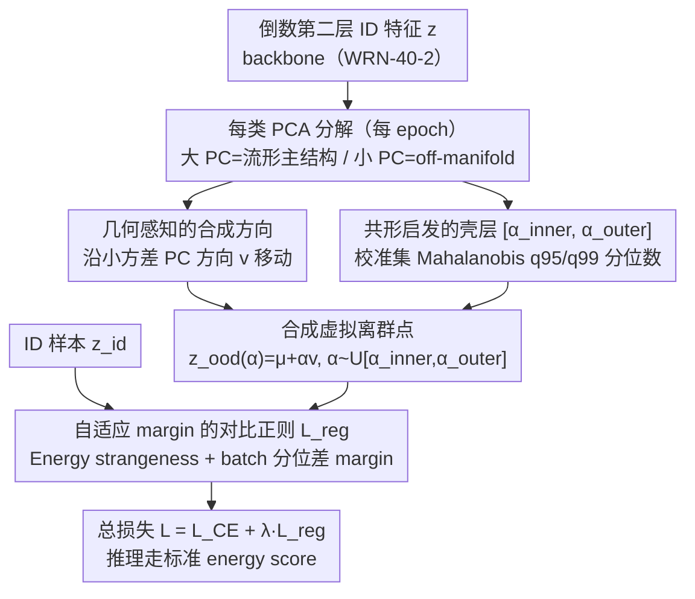

# Geometrically Constrained Outlier Synthesis

**会议**: ICML 2026  
**arXiv**: [2603.08413](https://arxiv.org/abs/2603.08413)  
**代码**: 无  
**领域**: AI 安全 / OOD 检测  
**关键词**: 虚拟离群点合成, 共形预测, 特征流形, 对比正则, 近域OOD

## 一句话总结
GCOS 在 ID 特征 PCA 的"小方差子空间"上沿几何 off-manifold 方向合成虚拟离群点，并用从校准集 Mahalanobis 分位数导出的"共形壳层" $[\alpha_\text{inner},\alpha_\text{outer}]$ 控制合成强度，配合自适应 margin 的对比正则损失训练，在 4 个 near-OOD 数据集上把平均 AUROC 从 VOS 的 86.21 提到 93.47。

## 研究背景与动机

**领域现状**：图像分类器在 OOD 输入上普遍过自信，主流缓解思路是 Outlier Exposure—在训练时构造"虚拟离群点"并通过能量正则把它们与 ID 推开。代表作 VOS 在每个类的特征空间拟合高斯，从尾部采样作为虚拟离群点。

**现有痛点**：VOS 这类方法把离群点建模成简单参数分布（如类条件高斯）外的样本，存在两个问题：(1) 真实异常常具有结构化、非高斯的特性，高斯尾部采样无法覆盖；(2) 若学到的特征空间几何不好，合成点可能落入 ID 区域或无意义的远区，损失正则的训练信号。

**核心矛盾**：合成离群点的"难度"很难拿捏—离 ID 太近则不可分，离得太远则过于平凡。VOS 用固定的概率密度阈值控制，但密度阈值对特征空间形状非常敏感，且整个流派几乎只在 far-OOD（与训练域语义无关）上评估，回避了实际中更危险的 **near-OOD**（同域内的未见细粒度类）。

**本文目标**：(1) 摆脱对预设参数分布的依赖，让合成点真正"贴着"学到的流形几何走；(2) 用一种可校准、不需要逐数据集调参的机制来控制合成点的"strangeness"；(3) 把评估重心转到 near-OOD。

**切入角度**：作者注意到，PCA 分解后特征空间的"大方差主成分"刻画了流形主结构，沿"小方差主成分"方向移动恰好就是 off-manifold 的、罕见但仍贴近数据中心的方向—这是一个天然的、由数据本身决定的几何先验。同时，共形预测 (Conformal Prediction, CP) 为"判断一个点有多 strange"提供了天然的分位数化语言：用 nonconformity score 的 $q_{95}$、$q_{99}$ 当阈值，可以无需调参地划出"难负样本带"。

**核心 idea**：用 PCA 小方差方向决定"往哪走"，用 CP 启发的 Mahalanobis 分位数壳层决定"走多远"，再用对比损失把这些几何感知的虚拟离群点推离 ID 特征。

## 方法详解

### 整体框架
GCOS 要解决的是"虚拟离群点该合成在哪、合成多远"这两个一直靠经验拍脑袋的问题。它把整套机制挂在分类层之前的倒数第二层特征 $\mathbf{z}\in\mathbb{R}^D$ 上，与 backbone 解耦（实验用 WRN-40-2，但不限）：每个 epoch 在校准集上为每类拟合一套子空间统计量并标定难度阈值，每个 batch 再据此沿几何方向采一批虚拟离群点，和分类损失一起回传。换句话说，它把"合成离群点"从一个生成任务，改写成了在 PCA 子空间里"往哪个方向走多远"的几何采样问题。

### 关键设计

**1. 几何感知的合成方向：用 PCA 小方差方向代替高斯尾部采样**

VOS 的痛点在于假设离群点服从类条件高斯的尾部，可真实异常往往是结构化、非高斯的，高斯尾巴根本盖不住。GCOS 换了个数据驱动的视角：对每类特征做特征分解 $(\mathbf{V}_\text{train},\boldsymbol{\Lambda}_\text{train})$，把累计解释方差 $\ge\eta$（默认 90%）的前 $K$ 个主成分当作刻画流形主结构的"大 PC"，剩下的"小 PC"方向就是天然的 off-manifold 方向——样本沿这些方向移动后"还在数据中心附近，但训练里几乎没见过"，正好命中 OOD 检测器最薄弱的盲区。合成方向 $v$ 取所有小 PC 的平均（average）或逐个小 PC 各合成一次（per direction），沿 $v$ 走 $\mathbf{z}_\text{ood}(\alpha)=\mu+\alpha v$，符号随机翻转支持双向。这样无需任何外部生成模型，靠 PCA 就给出了贴着流形几何的罕见方向，直接绕过了高斯假设瓶颈。

**2. 共形启发的壳层 $[\alpha_\text{inner},\alpha_\text{outer}]$：把"难度"标定成无需调参的分位数区间**

方向定了，还要回答"走多远"——离 ID 太近不可分，太远又太平凡，VOS 用的密度阈值对特征空间形状极敏感、得逐数据集调。GCOS 借共形预测的语言把这件事量化：在校准集上算 Mahalanobis nonconformity score $\mathcal{S}_{Mahal}(z,\mu,\{\lambda_i\},\{v_i\})=\sum_i\frac{((z-\mu)^Tv_i)^2}{\lambda_i+\epsilon}$，取它的 $q_{95}$、$q_{99}$ 分位数作为壳层目标。$\alpha_\text{inner}$ 定义为使 $\mathcal{S}(\mathbf{z}_\text{ood}(\alpha))=q_{95}$ 的最小 $\alpha$，$\alpha_\text{outer}$ 对应 $q_{99}$；由于 $\mathcal{S}$ 沿 $\alpha$ 单调，二分查找即可求解，最终在 $\alpha\sim\mathcal{U}[\alpha_\text{inner},\alpha_\text{outer}]$ 上均匀采样。之所以选 $q_{95}/q_{99}$，是因为它们对应假设检验里标准的 0.05、0.01 显著性水平，是个"原则性默认值"：这层壳一边排除"太像 ID"（< $q_{95}$）、一边排除"太平凡"（> $q_{99}$），把难负样本挖矿从启发式阈值升级成几何上可控的区间。作者也很坦诚——校准集参与了反馈循环、已违反 exchangeability，所以训练阶段只把 CP 当几何启发，并不声称享有覆盖保证。

**3. 自适应 margin 的对比正则损失 $\mathcal{L}_{reg}$：让推理用的 score 真正被拉开**

合成点造好了，得有损失把 ID 与 OOD 在推理所用的 score 下推开。GCOS 定义 $\mathcal{L}_{reg}=\mathbb{E}[\max(0,\mathcal{S}_\mathcal{L}(\mathbf{z}_{id}|\mathcal{M}_{y_{id}})-\min_k\mathcal{S}_\mathcal{L}(\mathbf{z}_{ood}|\mathcal{M}_k)+m)]$，并刻意做了"解耦"：合成阶段用 Mahalanobis 提供几何信息，而正则项里的 $\mathcal{S}_\mathcal{L}$ 用与推理一致的 Energy Strangeness Score $\mathcal{S}_\mathcal{L}(\mathbf{z})=\log\sum_i w_i\exp(h_\phi(\mathbf{z})_i)$，让"几何指路"和"推理一致"各司其职——消融里这个 hybrid 组合效果最好。margin $m$ 也不是定值：score 量纲会随 epoch 漂移，固定 margin 要么过松要么过紧，于是每个 batch 取正类得分的 95% 分位减 50% 分位当作 margin，既免调参又能随 score 分布自动收缩。这个用 batch 内分位差替代固定常数的小 trick，可迁移到任何 score 量纲漂移的 max-margin 场景。

### 损失函数 / 训练策略
总损失 $\mathcal{L}=\mathcal{L}_{CE}+\lambda\mathcal{L}_{reg}$，推理仍走标准 energy score 路径（Appendix D 给出 conformal hypothesis testing 的扩展）。为缓解校准集参与训练带来的交换性破坏，作者维护两个独立校准集：一个在线参与合成与正则，一个保留到最终用于推理时的 conformal hypothesis testing。PCA 大/小 PC 分界阈值 $\eta$ 默认 90%（敏感性见 Appendix J），$q_{95}/q_{99}$ 无需调。

## 实验关键数据

### 主实验
四个 near-OOD 数据集：Colored MNIST（颜色-数字关联打乱）、Stanford Dogs（未见犬种）、MVTec（同类缺陷件）、Retinopathy（其他眼科疾病 vs DR 五级）。Backbone 一律 WRN-40-2。

| 数据集 | 指标 | GCOS | VOS | NCIS (前 SOTA) | 提升 |
|--------|------|------|-----|---------------|------|
| C-MNIST | AUROC / FPR95 | **99.50 / 1.00** | 94.71 / 18.50 | 96.72 / 24.50 | +2.78 AUROC, −23.5 FPR95 |
| Dogs | AUROC / FPR95 | **99.55 / 0.00** | 99.25 / 5.00 | 99.35 / 10.00 | +0.20 AUROC, −10 FPR95 |
| MVTec | AUROC / FPR95 | 95.61 / 23.08 | 80.37 / 70.77 | **96.50 / 3.08** | 略输 NCIS，但远胜 VOS |
| Retinopathy | AUROC / FPR95 | **79.23 / 73.00** | 70.52 / 80.00 | 75.29 / 85.50 | +3.94 AUROC, −12.5 FPR95 |
| **平均 AUROC** | — | **93.47** | 86.21 | 91.97 | **+1.50 vs SOTA** |

### 消融实验
| 配置 | 平均 AUROC | 说明 |
|------|-----------|------|
| GCOS 完整版（Mahalanobis 合成 + Energy 正则） | 93.47 | 默认配置 |
| 改用 Mahalanobis 做正则（合成+正则同源） | 见 App. H | 解耦不如混合 |
| 改用 VOS 风格 uncertainty loss 替代 $\mathcal{L}_{reg}$ | 见 App. H | 验证合成策略本身有效 |
| 方向选择：average vs per direction（App. J） | — | per direction 更细但更贵 |
| 方差阈值 $\eta$（大/小 PC 分界） | App. J 鲁棒 | 对默认 90% 不敏感 |
| 无正则基线 | 84.64 | 4 数据集平均跌 ~9 AUROC |

### 关键发现
- 在 near-OOD 上，几何感知的合成 + 能量推理组合，相比 NCIS 这类基于扩散/normalizing flow 的重型合成方案，**轻量得多却更优**（GCOS 只算特征空间 PCA，NCIS 训练阶段要跑扩散模型）。
- C-MNIST 上 FPR95 从 18.5%（VOS）直降到 1.0%，说明对几何复杂、类形状差异大的特征空间，自适应 per-class 校准格外关键；MVTec 提升较小则说明该数据集决策面本就简单，标准方法已接近上限。
- UMAP 可视化（Fig. 2）显示 VOS 离群点散在类簇边界附近（容易压坏分类决策面），而 GCOS 离群点落在两个相邻类的"外侧"off-manifold 区域，**把决策面更紧地贴着数据 cluster 收缩**，这正是 near-OOD 鲁棒性的几何来源。

## 亮点与洞察
- 把"难负样本采样的强度"用 CP 的分位数语言形式化为 $q_{95}/q_{99}$ 壳层，第一次让 outlier synthesis 有了一个"原则性默认值"，免去逐数据集调阈值；同时坦诚把 CP 当 heuristic 用（训练阶段已破坏 exchangeability），不滥用统计承诺。
- "小方差 PC 方向 = off-manifold 罕见方向"这个观察简单但杀手锏：不需要任何额外生成模型，靠 PCA 这种 1933 年的工具就能给出比扩散/normalizing flow 更贴合流形的合成位置，可直接迁移到任何带特征 backbone 的检测/分割模型上做"训练时离群点暴露"。
- 自适应 margin 用 batch 内 score 分位差替代固定常数，是个非常可复用的小 trick：凡是用 max-margin / triplet 类损失且 score 量纲随训练漂移的场景（如度量学习、对比预训练）都可以借鉴。

## 局限与展望
- 作者承认：CP 的覆盖保证只在 post-hoc 推理时（Appendix D 的 conformal hypothesis testing）才严格成立，训练阶段只能算几何启发，所以 GCOS 严格说不是"可证 OOD"。
- 自己发现的局限：方法依赖类别可分的特征空间—对 long-tailed 或语义重叠严重的设定，PCA per-class 协方差估计本身就不稳，小方差方向意义会退化；且滚动队列 + epoch 级 PCA 的训练开销虽小于扩散合成，仍比 VOS 的纯高斯采样重。
- 评测集只有 4 个且规模偏小（C-MNIST、MVTec、Dogs、Retinopathy 均非 CIFAR/ImageNet 量级），缺少在主流 OpenOOD 大基准上的对比；且没公布代码，复现成本高。
- 改进方向：把"小方差 PC + 共形壳"与扩散/flow 合成做正交融合—前者保证几何贴流形、后者保证图像空间多样性；或把壳层从均匀分布换成 score 上的某种重要性采样，把训练梯度更多花在边界附近。

## 相关工作与启发
- **vs VOS (Du et al., 2022)**：VOS 用类条件高斯尾部采样得到虚拟离群点，假设强、不贴流形；GCOS 用 PCA 小方差方向 + 共形分位数壳替代，几何感知且无参数族假设。同样的能量推理协议下，GCOS 把 4 数据集平均 AUROC 从 86.21 提到 93.47。
- **vs Dream-OOD / NCIS (Du 2023; Doorenbos 2024)**：这两种方法在图像空间用扩散/normalizing flow 合成离群点，训练开销大。GCOS 直接在倒数第二层特征空间操作，无图像生成成本，平均 AUROC 反超 NCIS 1.50 点；仅在 MVTec 略输（96.50 vs 95.61）。
- **vs ViM (Wang et al., 2022)**：ViM 也利用了 PCA 零空间残差作为 OOD 分数，但只在推理时用、不改训练目标，得分 68.73；GCOS 把同一几何思路前移到训练阶段做正则，效果差距说明"几何感知合成 + 训练正则"比"几何感知推理"更能从根本上塑形特征空间。
- **启发**：这套"用 CP 分位数定义合成壳层"的思路有望迁移到其他需要 hard negative mining 的领域（对比学习、检索、metric learning），把 mining 难度的控制从启发式阈值升级到分布无关的分位数。

## 评分
- 新颖性: ⭐⭐⭐⭐ "PCA 小方差方向 + CP 分位数壳"的组合干净优雅，没人这么干过，但单独看每个组件都不算新。
- 实验充分度: ⭐⭐⭐ 只有 4 个中小规模数据集，没在 OpenOOD/CIFAR-ImageNet 主流基准上跑，消融也大量推到 Appendix。
- 写作质量: ⭐⭐⭐⭐ 动机链清楚，对 CP 与训练时使用的边界说明老实，公式和流程图配得好。
- 价值: ⭐⭐⭐⭐ 轻量、即插即用、平均 +7 AUROC 比 VOS，且把社区注意力从 far-OOD 拉到更现实的 near-OOD，对安全敏感应用（医疗影像、工业检测）实用性强。

<!-- RELATED:START -->

## 相关论文

- [\[CVPR 2026\] Image-based Outlier Synthesis With Training Data](../../CVPR2026/ai_safety/image-based_outlier_synthesis_with_training_data.md)
- [\[CVPR 2026\] RAVEN: Erasing Invisible Watermarks via Novel View Synthesis](../../CVPR2026/ai_safety/raven_erasing_invisible_watermarks_via_novel_view_synthesis.md)
- [\[ICML 2026\] VPD-100K: Towards Generalizable and Fine-grained Visual Privacy Protection](vpd-100k_towards_generalizable_and_fine-grained_visual_privacy_protection.md)
- [\[ICML 2026\] Extending Fair Null-Space Projections for Continuous Attributes to Kernel Methods](extending_fair_null-space_projections_for_continuous_attributes_to_kernel_method.md)
- [\[ICML 2026\] Position: Beyond Sensitive Attributes, ML Fairness Should Quantify Structural Injustice via Social Determinants](position_beyond_sensitive_attributes_ml_fairness_should_quantify_structural_inju.md)

<!-- RELATED:END -->
