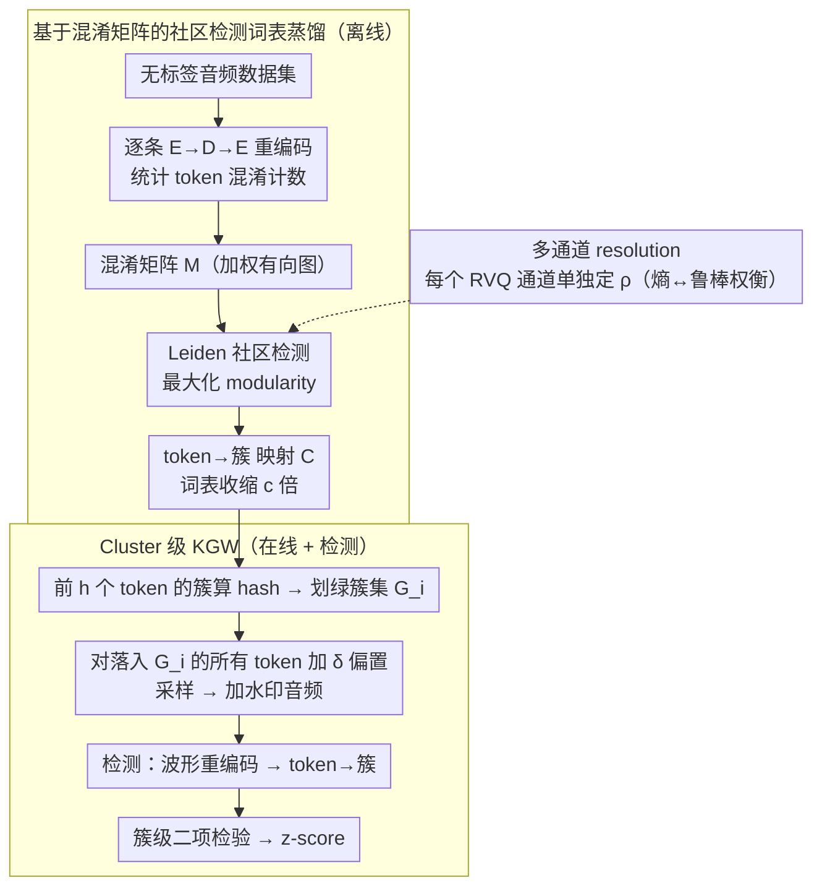

# Hidden in Plain Tokens: Simply Robust, Gradient-Free Watermark for Synthetic Audio

**会议**: ICML 2026  
**arXiv**: [2605.25967](https://arxiv.org/abs/2605.25967)  
**代码**: https://g-milis.github.io/projects/nograd-audio-wm.html (项目页 + 部分代码)  
**领域**: AI 安全 / 内容溯源 / 音频水印  
**关键词**: 自回归音频水印, KGW, 重编码鲁棒性, 词表社区检测, 梯度自由

## 一句话总结
针对自回归音频生成模型在 KGW 风格 token 水印下因"解码→重编码不幂等"导致水印信号指数级衰减的问题，作者用 codec 自身的混淆矩阵跑 Leiden 社区检测得到一个收缩后的"簇词表"，把水印的绿/红集合定义在簇而非 token 上，从而在完全梯度自由、黑盒访问 codec 的前提下把 $z$-score 的指数底从 $r$ 抬到 $r_{cl}>r$，detectability 相比基线和需要微调 codec 的 WMAR 普遍提升数个量级，且对 MP3、降噪、裁剪等扰动天然鲁棒。

## 研究背景与动机

**领域现状**：当前 LLM 文本生成的主流水印方案是 Kirchenbauer 等人的 KGW，把词表伪随机分成绿/红两半并对绿 token 加 $\delta$ logit 偏置，检测端只需统计绿 token 占比做二项检验。这种"采样阶段注入、统计阶段检测"的范式是训练自由的，对自回归大模型几乎零成本，因此被尝试搬到自回归音频模型（Moshi/Mimi、MusicGen/EnCodec 等）以解决合成音频被恶意滥用的溯源问题。

**现有痛点**：把 KGW 直接搬到音频会立刻翻车——音频 codec 的 encoder-decoder 并不幂等，把 token 序列 $x_{1:N}$ 解成波形再重新编码得到的 $y_{1:N}$ 与原 token 不一致，token match rate $r$ 远小于 1（文本接近 1，音频/图像可能只有 0.4 左右）。检测端用 $y$ 而非 $x$ 做统计，绿 token 计数大幅打折，水印信号在 hash 上下文长度 $h$ 越大时衰减越快。已有解法（WMAR、图像上的 Jovanović 等）选择微调 codec 让它接近幂等，但这放弃了"梯度自由 + 黑盒"的天然优势，需要昂贵训练且要白盒访问 codec。Wu 等基于 k-means 的免失真方案则牺牲了 detectability，比 KGW 基线还弱。

**核心矛盾**：水印 detectability 高度依赖 token 级匹配率 $r$，而连续模态的 codec 天生不满足 $r\approx 1$；想保住 token 级匹配就得改 codec，想保住"训练自由"就得忍受指数级信号衰减。

**本文目标**：在不动 codec 参数、仅黑盒查询 encoder/decoder 的条件下，把音频 KGW 的实际检测信号提到甚至超过需要微调 codec 的 WMAR。

**切入角度**：作者观察到重编码错误并不是均匀随机的，而是结构化的——一个 token 通常只会被混淆到一小撮"语义近邻"上。如果把这撮近邻打包成一个簇，并把水印规则建立在"簇是否落在绿集"而非"token 是否落在绿集"上，那么只要重编码后的 token 还落在同一簇里就算命中。这把指数底从 token 匹配率 $r$ 抬到了簇匹配率 $r_{cl}>r$。

**核心 idea**：用 codec 自身在数据集上的混淆计数构建一张 token 图，跑社区检测得到"语义簇词表"，KGW 的绿/红划分、上下文 hash 全都在簇级别做——一个 lookup 表就能完成、和原有自回归推理零冲突。

## 方法详解

### 整体框架
方法要解决的是"音频 codec 的解码-重编码不幂等让 token 级 KGW 水印信号指数衰减"这个核心问题。它的破局点是不再把水印规则绑死在 token 身份上，而是先离线把容易互相混淆的 token 聚成"簇"，再把整套 KGW 规则上移到簇这一层。整条流程拆成两个解耦阶段：离线阶段用 codec 自身的混淆统计蒸馏出一张 token→cluster 映射表，在线阶段直接复用标准 KGW 的采样-检测范式、只是把绿/红划分和 hash 上下文都换成簇粒度，从而在不动 codec 参数、只黑盒查询 encoder/decoder 的前提下保住信号。

### 关键设计

**1. 基于混淆矩阵的社区检测词表蒸馏：让聚类目标对齐水印检测目标**

痛点在于 token match rate $r$ 在音频上远小于 1（文本接近 1，音频可能只有 0.4 左右），而检测端用重编码后的 token 做统计，绿 token 计数被大幅打折。作者的关键观察是这种重编码错误不是均匀随机的，而是结构化的——一个 token 通常只会被混淆到一小撮"语义近邻"。于是离线阶段选一份无需标签的音频数据集，对每条音频跑 $E\to D\to E$ 两遍编码，记录原始 token $i$ 在重编码后被替换成哪些 token $j$，累计成混淆矩阵 $M\in\mathbb{N}^{|V|\times|V|}$。把 $M_{ij}$ 当成有向加权图的邻接矩阵跑 Leiden 社区检测最大化 modularity，恰好把"混淆主要发生在簇内"翻译成"簇内边权大、簇间边权小"，得到一个把 $|V|$ 压成 $c|V|$（$c\in(0,1)$）的多对一映射 $\mathcal{C}$，resolution 参数 $\rho$ 控制簇粒度。这样一来，原本要求"重编码后 token 完全一致"的命中条件松弛成"重编码后 token 落在同簇"，命中概率从 $r$ 提到 $r_{cl}>r$。之所以选 Leiden 而非常见的 k-means/语义 embedding 聚类，是因为后者没把"codec 实际会混淆什么"编码进去；用 codec 自己的混淆计数当邻接矩阵，相当于让聚类目标和水印检测目标对齐，这是把"梯度自由 + 黑盒"做实的关键。每个 RVQ 通道因 codebook 相互独立而单独聚类，也为后面的多尺度留了口子。

**2. Cluster 级 KGW：绿/红划分与 hash 上下文同步上移**

有了簇映射后，要让整条水印 pipeline 对重编码扰动不变，就得把 KGW 里两处依赖 token 身份的位置全搬到簇身份上。在线阶段，每个时间步用前 $h$ 个 token 的 cluster index（而非 token index）算 hash，划出绿 cluster 集 $G_i$，然后对所有"所属 cluster 落在 $G_i$"的 token 同时加 logit 偏置 $\delta$；检测端用同样规则把收到的波形重编码出 token、再映射成 cluster 序列做二项检验。这样"token 被混淆到同簇邻居"和"token 完美还原"对检测器而言无差别，推理时只多一次 cluster lookup、零额外计算。理论上这一步把基线期望 $z$-score 里的指数底从 $r$ 换成 $r_{cl}$：条件独立的 noisy channel 近似下，KGW 基线为 $\mathbb{E}[z|H_1]=\sqrt{N}\frac{g-\gamma}{\sqrt{\gamma(1-\gamma)}}r^{h+1}$，本文方法变成 $\mathbb{E}[z|H_1]=\sqrt{N}\frac{g-\gamma}{\sqrt{\gamma(1-\gamma)}}r_{cl}^{h+1}$。由于 $r_{cl}>r$ 且以 $h+1$ 次幂出现，提升被指数放大——这正是标题"hidden in plain tokens"的算法依据：不必改 codec，只需承认词表里早藏着冗余结构，且改造对 KGW 统计严格性零损害（同一组 cluster 在两端确定性一致）。

**3. 熵-密钥空间显式权衡与多通道 resolution：把鲁棒性预算和熵预算分到不同通道**

把词表压小确实能最大化 $r_{cl}$，但代价是丢生成熵、且 $h$-gram key 空间从 $|V|^h$ 缩到 $(c|V|)^h$，太小会让水印可被伪造。作者把这个代价写明白：要求 $(c|V|)^h\geq K_{\min}$ 以避免 key 冲突，必要时用 unwatermarked sampling deferral 兜底。缓解手段是利用 RVQ 多通道独立聚类的自由度，让某些通道走更细的 cluster（保熵）、某些通道走更粗的 cluster（保鲁棒），合成出多尺度水印。本文没追求 Pareto 最优，只用数据驱动启发式找一个"足够好的"$r_{cl}$；但正是把这个权衡显式化并提供每通道 resolution 这个工程旋钮，才让方法能真正部署到 Moshi / MusicGen 这种多通道 RVQ 模型上。

### 损失函数 / 训练策略
方法是完全 training-free 的：离线只跑一次社区检测算 $\mathcal{C}$；在线只在 logits 上加常数偏置 $\delta$，没有任何梯度。需要的超参是 KGW 原有的 $\gamma$（绿集占比）、$\delta$（logit 偏置）、$h$（上下文阶数），外加 Leiden 的 resolution $\rho$（每通道一份）。

## 实验关键数据

### 主实验
作者在 Moshi（Mimi codec，会话语音）和 MusicGen（EnCodec，音乐）两个自回归音频模型上各采 500 段音频，比较 Base（裸 KGW）、WMAR、WMAR (aug)（两种需微调 codec 的方案）和本文方法。质量指标用 FAD（VGGish/CLAP，越小越好）和 MOS（NISQA/DNSMOS，越大越好）。

| 数据集 | $h$ | 指标 | None | Base | WMAR | WMAR(aug) | Ours |
|---|---|---|---|---|---|---|---|
| Moshi/对话 | 0 | FAD-VGGish ↓ | 0.080 | 0.128 | 0.407 | 0.267 | **0.133** |
| Moshi/对话 | 1 | FAD-VGGish ↓ | 0.080 | 0.068 | 0.357 | 0.218 | **0.051** |
| Moshi/LibriSpeech | 0 | FAD-VGGish ↓ | 1.921 | 1.858 | 2.195 | 2.153 | **1.670** |
| Moshi/对话 | 1 | NISQA MOS ↑ | 3.54 | 3.56 | 3.37 | 3.54 | **3.58** |
| Moshi/LibriSpeech | 1 | NISQA MOS ↑ | 3.15 | 3.23 | 3.12 | 3.19 | 3.22 |

质量上本文方法和裸 Base 基本持平、有时甚至略好于无水印 None，说明 cluster 级偏置没破坏 codec 的可解码性；而 WMAR 系列因为微调过 codec，FAD 明显恶化。

### 鲁棒性 / 检测强度（Moshi）

| 攻击类型 | Transformation | Base $-\log p$ | WMAR | WMAR(aug) | **Ours** |
|---|---|---|---|---|---|
| 基线 | Identity | 8.51 | 17.44 | 13.72 | **42.47** |
| 信号 | Lowpass | 5.82 | 9.23 | 10.52 | **41.51** |
| 信号 | Smooth | 1.99 | 1.61 | 3.73 | **32.68** |
| 信号 | Noise | 2.23 | 0.61 | 8.01 | **20.59** |
| 压缩 | MP3 | 7.47 | 15.31 | 12.66 | **41.26** |
| 压缩 | EnCodec | 2.59 | 2.82 | 2.78 | **32.64** |
| 时域 | Crop | 1.51 | 1.27 | 1.51 | **16.48** |
| 时域 | Speedup | 1.52 | 1.20 | 1.35 | **26.49** |

无攻击下本文的 $-\log p$ 是 WMAR(aug) 的约 3 倍，是裸 Base 的近 5 倍；在所有 12 种攻击下也都把第二名甩开数倍到一个数量级，时域裁剪/变速这种典型对抗音频水印的攻击差距尤其大。论文的 Figure 3-5 在极低 FPR（$10^{-6}$ 量级）下画 TPR-FPR 曲线，本文方法是唯一能在该区间维持高 TPR 的方案。

### 关键发现
- 提升的来源完全是把指数底 $r$ 换成 $r_{cl}$：$h$ 越大（$h=2$ 时本文 vs Base 的 gap 比 $h=0$ 还大），因为 $r^{h+1}$ vs $r_{cl}^{h+1}$ 的差距被指数放大，正好和理论公式 (5)/(7) 吻合。
- 多通道差异化 resolution 是必须的：纯 token 级 KGW 在 RVQ 多通道上几乎不工作，而多尺度 cluster 让不同通道分别承担"高熵"和"高鲁棒"的角色。
- WMAR 即便微调 codec 仍然在时域攻击上崩盘，说明"让 codec 幂等"并不能解决 cropping/speedup 这种破坏序列对齐的攻击；而 cluster 级 hash 让上下文 token 即使被替换成近邻仍能算出同一个 key，从根本上对齐了攻击行为和聚类几何。

## 亮点与洞察
- 把"重编码错误是结构化的"这件经验观察直接量化为混淆矩阵→图→Leiden 社区，再正好对应 KGW 的"绿/红划分作用在 cluster 上"——三个看似不相关的对象（codec 行为、图聚类、统计水印）被一条干净的对偶关系串起来，是非常漂亮的"identify the right abstraction"。
- 完全梯度自由 + 黑盒，意味着这套方案对闭源 codec / API 部署友好，可以挂在不被允许重训的商用音频生成服务上做溯源——这是 WMAR 类方案做不到的部署性。
- 多通道差异化 resolution 的设计思路可迁移到任何 RVQ-based 多模态生成（图像 VQ-VAE、视频 token、多模态 SEED-LLaMA）：把"鲁棒性预算"和"熵预算"分配到不同 codebook 是个通用 trick。

## 局限与展望
- 论文承认没有刻画"$c$（压缩比）-$h$（上下文阶）-$\delta$（偏置）"三维空间的 Pareto 前沿，只给了一个数据驱动启发式，调参依赖经验。
- 条件独立假设在严格非滑动窗口 codec 下成立，但 Mimi/EnCodec 都是有重叠的 conv 结构，理论结果只是"近似成立"，对极端攻击下的 detectability 估计可能偏乐观。
- Cluster 词表是数据集相关的——换一个差异较大的音频分布（如非英语口语、极端音乐流派）需要重新跑社区检测；论文未给出"用 OOD 数据蒸馏的 cluster 直接迁移到 ID 数据"的实验。
- 还是 KGW 家族，对"重写攻击"（用另一个 LM 把生成内容全部 paraphrase/regenerate）这种从根本上换 token 分布的攻击没有保护，只是把"信号通道里的噪声"打掉了。

## 相关工作与启发
- **vs WMAR (Wu et al., 2025a,b)**：WMAR 微调 codec 让 $r\to 1$，本文不动 codec 而让 cluster 匹配率 $r_{cl}\to 1$，二者本质都是改 noisy channel 但代价不同——WMAR 牺牲训练成本和白盒访问，本文牺牲一点生成熵，且本文在质量和检测上同时更好。
- **vs 基于 k-means 的免失真音频水印 (Wu et al., 2025a)**：k-means 用语义 embedding 距离聚类，与 codec 实际混淆行为可能错位；本文用 codec 自身混淆图，目标对齐使 $r_{cl}$ 实际上更高。
- **vs 图像 token 水印 (Tong 2025 / Jovanović 2025)**：他们同样面对重编码错误，但都选了微调 codec 这条路；本文给的"社区检测 + cluster 级 KGW"是模态无关的，理论上可以直接搬到图像 VQ token、视频 token，这点值得后续工作验证。
- **vs 后处理音频水印 (San Roman 2024, Liu 2024)**：后处理方案在频域/波形域嵌入 payload，但 O'Reilly 2025a 表明现代神经 codec 能把这类水印彻底擦掉；本文把水印放在生成时的 token 分布层面，且利用 codec 的混淆结构而非对抗它，方向上更扎实。

## 评分
- 新颖性: ⭐⭐⭐⭐⭐ 把 codec 混淆矩阵作为图、跑社区检测得到 cluster 词表、再把 KGW 全局上移到 cluster 层——这套对偶关系干净、原创且 obvious-in-hindsight
- 实验充分度: ⭐⭐⭐⭐ 两个 codec 架构 × 三种 $h$ × 12 种攻击 × 4 种 baseline 的网格相当扎实，但缺 cluster 分布迁移性、重写攻击的消融
- 写作质量: ⭐⭐⭐⭐⭐ 理论从 $r^{h+1}$ 到 $r_{cl}^{h+1}$ 的推导一步到位，方法图 + 表格 + 公式分工清晰，是 KGW 系列论文里少见的"读完立刻知道为什么 work"
- 价值: ⭐⭐⭐⭐⭐ 在不动 codec、零训练成本下把音频水印推到新 SOTA，对实际部署溯源系统极具实用价值，且方法可直接迁移到任意 RVQ/VQ 多模态生成

<!-- RELATED:START -->

## 相关论文

- [\[AAAI 2026\] Robust Watermarking on Gradient Boosting Decision Trees](../../AAAI2026/ai_safety/robust_watermarking_on_gradient_boosting_decision_trees.md)
- [\[ICML 2026\] Flatness-Aware Stochastic Gradient Langevin Dynamics](flatness-aware_stochastic_gradient_langevin_dynamics.md)
- [\[ICML 2026\] FedHPro: Federated Hyper-Prototype Learning via Gradient Matching](fedhpro_federated_hyper-prototype_learning_via_gradient_matching.md)
- [\[ICML 2026\] Training-Free Coverless Multi-Image Steganography with Access Control](training-free_coverless_multi-image_steganography_with_access_control.md)
- [\[AAAI 2026\] MPD-SGR: Robust Spiking Neural Networks with Membrane Potential Distribution-Driven Surrogate Gradient Regularization](../../AAAI2026/ai_safety/mpd-sgr_robust_spiking_neural_networks_with_membrane_potential_distribution-driv.md)

<!-- RELATED:END -->
