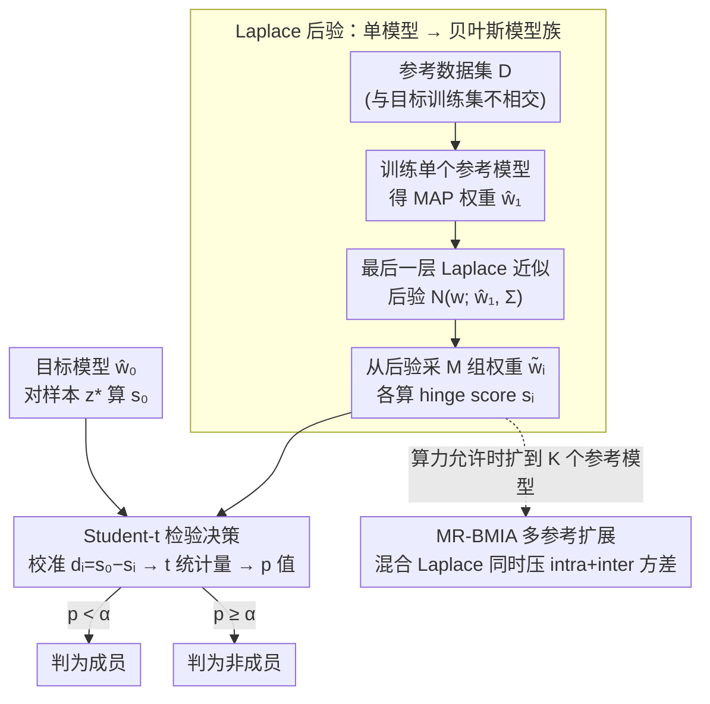

# How Does Bayesian Sampling Help Membership Inference Attacks?

**会议**: ICML 2026  
**arXiv**: [2503.07482](https://arxiv.org/abs/2503.07482)  
**代码**: https://github.com/zhenlong-liu/BMIA (有)  
**领域**: AI 安全 / 隐私攻击  
**关键词**: 成员推断攻击, 贝叶斯采样, Laplace 近似, 条件分布, 方差分解

## 一句话总结
本文提出 BMIA，把单个参考模型用 Laplace 后验展开成"虚拟模型族"，靠贝叶斯采样估计每个样本的条件 score 分布，在只训 1 个参考模型的预算下，在 CIFAR-100 等数据集上把低 FPR 区域 TPR 拉到比训 8 个参考模型的 LiRA 还高 54%。

## 研究背景与动机
**领域现状**：成员推断攻击 (MIA) 是衡量模型记忆训练样本程度的标准探针。当前最强一类是"条件攻击"——给每个样本 $z=(x,y)$ 估一个个性化阈值 $\tau_\alpha(x,y)$，再判定模型在该样本上的 score 是否异常高。Carlini 等人的 LiRA、Ye 等人的 Attack-R 都属于此类。

**现有痛点**：要估出条件分布，主流做法是**训几十甚至上百个 shadow model**，每个模型用不同子集训练，再把同一样本喂进所有 shadow 模型采样一组 score 来做高斯/经验分布拟合。在 ImageNet 上每个 shadow 模型要 580 GPU·min，跑 8 个就要 78 小时，对真实审计场景几乎不可行。

**核心矛盾**：条件攻击的力量来自"per-instance 不确定性建模"，但现有方法只能靠**外层重训**来获取这种不确定性，把计算成本和攻击力强绑在一起。

**本文目标**：用单个参考模型撑起条件分布估计，让低 FPR 区域的 TPR 不掉甚至反涨。

**切入角度**：作者注意到 score 在多 shadow 模型上的方差可以做**全方差分解**——分成"同一数据集下参数不同造成的 intra-model 方差"$\sigma^2_{\text{intra}}$ 和"不同数据集造成的 inter-model 方差"$\sigma^2_{\text{inter}}$。LiRA 实际上只通过外层重训消除 $\sigma^2_{\text{inter}}$，却没法处理 $\sigma^2_{\text{intra}}$。如果把参考模型权重当成 BNN 后验上的随机变量，从后验里多采几次权重就能直接捕捉 $\sigma^2_{\text{intra}}$，根本不用重训。

**核心 idea**：用 Laplace 后验把一个 MAP 参考模型升级成一族贝叶斯参考模型，用后验采样代替 shadow 训练来获取条件 score 分布。

## 方法详解

### 整体框架
BMIA 的攻击流水线：(1) 在和目标模型不相交的参考数据集 $\mathcal{D}$ 上训一个标准参考模型，拿到 MAP 权重 $\hat w_1$；(2) 在 $\hat w_1$ 周围用 Laplace 近似拟合一个高斯后验 $\mathcal{N}(w;\hat w_1,\Sigma)$；(3) 对每个待判样本 $z^*=(x^*,y^*)$，从该后验里采 $M$ 组权重 $\tilde w_i$，每组算一个 hinge score $s_i$；(4) 把目标模型 score $s_0$ 当作"待检随机变量"，与 $\{s_i\}$ 一起做单边单样本 $t$ 检验，输出 $p$ 值判定成员。整套流程**只训一次参考模型**，所有"扩样"开销都摊在矩阵乘法和采样上。

### 关键设计

**1. Laplace 后验把单模型变成贝叶斯模型族：用一个 MAP 参考模型撑起整条条件 score 分布**

条件攻击的力量来自 per-instance 不确定性建模，但现有方法只能靠外层重训几十上百个 shadow model 来获取，把计算成本和攻击力强绑在一起。BMIA 把这个开销搬到 inference 阶段：在 $\hat w_1$ 处做二阶 Taylor 展开，把后验近似为 $p(w\mid\mathcal{D})\approx\mathcal{N}(w;\hat w_1,\Sigma)$，$\Sigma=(-\nabla_w^2\mathcal{L}(\mathcal{D};w)|_{w=\hat w})^{-1}$；实现上只对最后一层做 LA，用 KFAC 或 Diagonal 近似 Hessian，先验精度由 marginal likelihood 最大化决定。从这个后验采 $M$ 个 $\tilde w_i$ 喂进 hinge score $s_{\text{hinge}}(x,y)=f(x)_y-\max_{y'\neq y}f(x)_{y'}$，就拿到一组同模型不同采样下的条件 score。LiRA 相当于 $M=1$、$K$ 较大；BMIA 反过来——单 $K$、大 $M$，把"训练成本"压成"前向推断成本"，而贝叶斯采样恰好保留了 hinge score 经验上近似正态的高斯前提。

**2. 基于 Student-$t$ 检验的条件 MIA 决策规则：把"score 大不大"形式化成假设检验**

传统方法用经验分位数或高斯尾估阈值，对 0.1% FPR 这种小样本极端尾部很不稳。BMIA 改用 $t$ 检验：定义校准 score $d_i=s_0-s_i$，在零假设 $H_0$（$z^*$ 非成员）下 $\mathbb{E}[d_i]=0$，可推出 $\operatorname{Var}(\bar d)=(1+\frac{1}{M})\sigma^2$，用样本方差 $\hat\sigma^2$ 估 $\sigma^2$，构造统计量 $t=\bar d/(\hat\sigma\sqrt{1+1/M})$ 服从自由度 $M-1$ 的 $t$ 分布，最终把 $p=1-F_t(t;M-1)<\alpha$ 作为攻击决策。$t$ 检验天然处理"样本方差未知 + 小样本"，正好契合"只采几十个权重"的场景，还把攻击力 $=1-\beta$ 直接等价成检验统计 power，便于和方差关联。

**3. 全方差分解与 MR-BMIA 多参考扩展：先讲清楚为什么有效，再指导资源该投哪**

用全方差律把 score 总方差拆成 $\operatorname{Var}(s)=\sigma^2_{\text{intra}}+\sigma^2_{\text{inter}}$——同一数据集下参数不同造成的 intra 方差，和不同数据集造成的 inter 方差。在 $K$ 个参考数据集、每个采 $M$ 次的设定下，目标 score 与均值差的方差为 $\operatorname{Var}(s_0-\bar s)=(1+\frac{1}{K})\sigma^2_{\text{inter}}+(1+\frac{1}{KM})\sigma^2_{\text{intra}}$。LiRA 等同 $M=1$，只能靠加大 $K$ 压方差；BMIA 在 $K=1$ 时通过加大 $M$ 把 $\sigma^2_{\text{intra}}$ 压成 $\frac{1}{M}$ 项，Theorem 3.2 进一步证明 $\beta(M')>\beta(M)$——更大的 $M$ 给出更紧的拒绝域、更高 TPR。多参考变体 MR-BMIA 则用 mixture-Laplace 同时压两项方差（Algorithm 2 的双层估计器，含 Welch–Satterthwaite 风格自由度 $v$ 修正）。这套分解的价值在于明确告诉攻击者：加 shadow 模型只能压 inter，加后验采样才能压 intra，于是哪个旋钮该投到哪一项一目了然。

### 损失函数 / 训练策略
没有特殊训练损失，攻击者只跑标准 SGD 训练参考模型（CIFAR-10 用 ResNet-50，CIFAR-100 用 DenseNet-121，ImageNet 用 ResNet-50，tabular 用 4 层 MLP，文本用 BERT/DistilBERT 微调），随后做后验拟合。所有数据按 20%/20%/40%/20% 切分给目标训练 / 目标测试 / 参考池 / QMIA 验证。

## 实验关键数据

### 主实验
评测在 CIFAR-10/100、ImageNet、Texas-100、Purchase-100 与 5 个文本数据集上做，主指标是 TPR@低 FPR 与训练时间。

| 数据集 | 指标 | BMIA (n=1) | LiRA (n=8) | 提升 / 节省 |
|--------|------|------------|------------|-------------|
| CIFAR-100 | TPR@FPR=1% | 35.75% | 23.20% | +54% TPR |
| CIFAR-100 | 训练时间 | 26.4 min | 211.5 min | 8× 加速 |
| CIFAR-10 | TPR@FPR=0.1% | 2.84% | 1.73% | +64% TPR |
| ImageNet | TPR@FPR=1% | 13.59% | 11.90% | 略优且 8× 快 |
| Texas-100 | TPR@FPR=1% | 11.81% | 8.63% | +37% TPR |

| 设定 | 数据集 | 方法 | TPR@FPR=1% |
|------|--------|------|------------|
| 单参考 | CIFAR-100 | RMIA | 10.08% |
| 单参考 | CIFAR-100 | QMIA | 15.26% |
| 单参考 | CIFAR-100 | **BMIA** | **35.75%** |
| 64 参考 | CIFAR-100 | LiRA | 43.33% |
| 64 参考 | CIFAR-100 | RMIA | 36.06% |
| 64 参考 | CIFAR-100 | **MR-BMIA** | **45.57%** |

### 消融实验
| 配置 | CIFAR-10 TPR@1% | 备注 |
|------|------------------|------|
| BMIA, $M=1$ | 接近 LiRA(n=1) | 退化成单 score 比较 |
| BMIA, $M$ 增大 | 单调上升 | 验证 Theorem 3.2 |
| Hessian = Diagonal | 与 KFAC 接近 | 轻量近似不掉点 |
| 架构 mismatch (target=ResNet-50, ref=ResNet-18) | BMIA 8.72% vs LiRA 8.16% | 跨架构仍领先 |

### 关键发现
- **方差分解被实验直接验证**：$M$ 越大 TPR 越高且推断时间几乎不变（采样并行化），说明性能增益确实来自压 $\sigma^2_{\text{intra}}$ 而非额外计算。
- **跨模态稳健**：图像、文本、tabular 三种模态 + ResNet/DenseNet/BERT/MLP 多种架构上 BMIA 均 SOTA 或并列 SOTA。
- **架构 mismatch 仍稳**：参考模型用 ResNet-18 攻击 ResNet-50 目标时 BMIA 在所有 FPR 区间都领先 LiRA，说明 Laplace 后验提供的不确定性比 shadow 模型集合更"通用"。
- **MR-BMIA 不是冗余**：当算力允许多参考时，MR-BMIA 同时压两个方差项，在 CIFAR-100 上把 TPR@1% 推到 45.57%，比 64-shadow LiRA 还高 2.2 个点。

## 亮点与洞察
- **把 BNN 后验当成"免费 shadow 模型生成器"**：单 MAP 模型 + Laplace 后验 ≈ 一族 shadow 模型，巧在 inference 阶段就能拿到不确定性，避免训练阶段的二次开销。
- **理论先于实证**：先用方差分解写清楚 "shadow 加 $K$ vs 采样加 $M$" 各自管哪一项方差，再设计 BMIA 和 MR-BMIA 精准对应，方法和理论闭环漂亮。
- **可迁移 trick**：用 $t$ 检验 + 校准 score $d_i=s_0-s_i$ 写成假设检验，比经验分位数稳，可直接迁移到其他基于 score 的攻防（如 OOD 检测、distribution shift）。
- **审计场景友好**：单参考模型 + 几十次后向采样的预算让 MIA 第一次有可能跑在真正的 production-size 模型上做隐私审计。

## 局限与展望
- 当前实现只做**最后一层** LA + KFAC/Diagonal Hessian，全网 LA 的成本与收益尚未充分分析；非凸/重尾损失下 Laplace 假设可能塌陷。
- Score 高斯近似是 $t$ 检验的前提，作者承认在非高斯 score (如长尾文本任务) 下需要额外校准（Appendix F.1）；面向 LLM-scale 时这一点会更脆。
- 防御策略（differential privacy、temperature scaling）下 BMIA 的实际收益没有展开评测，攻击者视角强、防御者视角弱。
- 未与 gradient-based / loss-trajectory MIA 正面对比，能否复合还需要后续工作。

## 相关工作与启发
- **vs LiRA (Carlini 2022)**: LiRA 训多个 shadow 模型用 Gaussian 拟合 score 分布，BMIA 训单模型用 Laplace 后验扩展，本文明确指出 LiRA 等价于 $M=1$，因此在低 $K$ 预算下必然输给 BMIA。
- **vs RMIA (Zarifzadeh 2024)**: RMIA 用样本对的 likelihood ratio，本文用样本内权重分布；BMIA 在单参考预算下 TPR 更高（CIFAR-100：35.75% vs 10.08%）。
- **vs QMIA (Bertran 2024)**: QMIA 训分位回归直接预测阈值，需要额外 quantile model 的超参搜索；BMIA 把分位估计转换为后验采样，省了二阶训练循环。
- **vs Attack-R (Ye 2022)**: Attack-R 用经验分位估阈值，要更多 shadow 才能稳；BMIA 用参数化 $t$ 分布写阈值，小样本即可估出。

## 评分
- 新颖性: ⭐⭐⭐⭐⭐ 用 Laplace 后验替代 shadow 训练在 MIA 领域是首个，方差分解视角也是新的。
- 实验充分度: ⭐⭐⭐⭐⭐ 三模态 + 多架构 + 单/多参考 + 架构 mismatch + Hessian 因子化全覆盖。
- 写作质量: ⭐⭐⭐⭐ 理论清晰、表格密集；少数地方实验图引用 (LABEL:) 未编译，可读性稍打折。
- 价值: ⭐⭐⭐⭐⭐ 把高保真 MIA 从"百卡级"打到"单卡级"，让真实模型隐私审计有了落地可能。

<!-- RELATED:START -->

## 相关论文

- [\[ICML 2026\] Singular Bayesian Neural Networks](singular_bayesian_neural_networks.md)
- [\[ICCV 2025\] Membership Inference Attacks with False Discovery Rate Control](../../ICCV2025/ai_safety/membership_inference_attacks_with_false_discovery_rate_control.md)
- [\[ICML 2026\] How Hard Can It Be? Hardness-Aware Multi-Objective Unlearning](how_hard_can_it_be_hardness-aware_multi-objective_unlearning.md)
- [\[AAAI 2026\] Privacy Auditing of Multi-Domain Graph Pre-Trained Model under Membership Inference Attack](../../AAAI2026/ai_safety/privacy_auditing_of_multi-domain_graph_pre-trained_model_under_membership_infere.md)
- [\[AAAI 2026\] Reference Recommendation based Membership Inference Attack against Hybrid-based Recommender Systems](../../AAAI2026/ai_safety/reference_recommendation_based_membership_inference_attack_against_hybrid-based_.md)

<!-- RELATED:END -->
