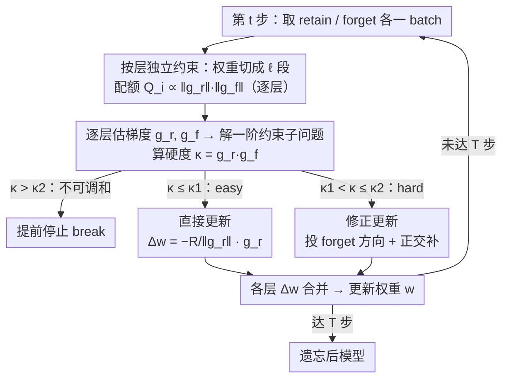

# How Hard Can It Be? Hardness-Aware Multi-Objective Unlearning

**会议**: ICML 2026  
**arXiv**: [2606.02119](https://arxiv.org/abs/2606.02119)  
**代码**: https://github.com/aoi3142/HAMU  
**领域**: AI 安全 / 机器遗忘  
**关键词**: machine unlearning, 多目标优化, 约束优化, 梯度点积, collateral forgetting

## 一句话总结
把"遗忘 vs 保留"的 trade-off 直接写成"每步带约束的一阶凸优化"问题，用 retain/forget 梯度的点积 $\kappa = \bm{g_r}\cdot\bm{g_f}$ 同时充当 hardness 度量、更新方向切换开关和提前停止条件，在 CIFAR-10/ResNet-20 与 Llama-2-7B/WaterDrum-TOFU 上比 GA、GDiff、SCRUB、KL 等基线更稳。

## 研究背景与动机

**领域现状**：机器遗忘 (machine unlearning) 想从已训练模型里抹掉某部分 forget data $D_f$ 的影响，同时尽量保住在 retain data $D_r$ 上的能力。主流做法是对 forget loss 做梯度上升 (GA、NPO)、对 retain loss 做微调 (FT)、或者把两者加权组合 (GDiff、KL、SCRUB)。

**现有痛点**：加权组合方法既不能保证 forget 真的被遗忘到"指定程度"，也不能保证 retain 不会被顺带破坏 (作者把这种"为遗忘付出的代价"称作 collateral forgetting)。换句话说，用户没法事先告诉算法"我至少要遗忘到 $Q$ 这个程度，然后请尽量少损失 retain"。

**核心矛盾**：两个目标本身是否冲突，取决于 $D_f$ 和 $D_r$ 的相似度——极端例子是 $D_f = D_r$，此时根本无法只忘前者不伤后者。但现有工作既没量化"有多冲突"，也没在算法里显式利用这个量。

**本文目标**：(1) 用一个可计算的标量度量"这次 unlearning 有多难"; (2) 给出一个能保证 forget 改善 $\geq Q$ 同时最小化 retain 退化的算法; (3) 当冲突已不可调和时主动停止。

**切入角度**：作者从一步梯度下降的一阶分析切入——在 $D_r$ 上走一小步会让 $D_f$ 上的损失变多少，完全由两个 batch 梯度的点积 $\nabla L(D_f)\cdot\nabla L(D_r)$ 的符号决定。点积越正，两个目标越绑死；点积越负，反而越好遗忘。

**核心 idea**：把 unlearning 每一步写成"在半径 $R$ 的局部邻域内，min retain 退化 s.t. forget 改善 $\geq Q$"的约束凸问题，闭式解里自然冒出 $\kappa = \bm{g_r}\cdot\bm{g_f}$ 当作硬度，并按 $\kappa$ 跨过阈值与否决定走"普通梯度下降"还是"投影到 forget 方向"的修正方向。

## 方法详解

### 整体框架
HAMU (Hardness-Aware Multi-objective Unlearning) 要解决的核心痛点是：加权式遗忘既不能保证 forget 被忘到指定程度，又会顺带破坏 retain。它的做法是把整段遗忘从"调权重"改写成 $T$ 步逐迭代的约束优化——每一步只看当前权重 $\bm{w}_t$ 与 retain/forget 各一个 batch，在权重的局部邻域里求一个带不等式约束的一阶凸子问题。每步先估计 batch 梯度 $\bar{\bm{g}}_{\bm{r}}, \bar{\bm{g}}_{\bm{f}}$ 及它们的点积 $\bar\kappa$，再拿 $\bar\kappa$ 对照两个理论阈值来决定本步是停止、走直接更新还是走修正更新，最后把 $\Delta\bm{w}$ 加到权重上。整个算法没有新参数，由一个凸子问题、两个对偶变体 (HAMU-Q / HAMU-U) 和一份按层并行的工程化构成。

### 关键设计

**1. 硬度度量 $\kappa$ 与一阶约束子问题：把"遗忘有多难"变成一个可计算的标量**

以往的"硬度"都是训练曲线、影响函数这类事后启发式，没法直接喂进算法。HAMU 的关键观察是：在 $\|\Delta\bm{w}\|\leq R$ 的信赖域内做一阶展开，retain 与 forget 的损失变化分别近似为 $\Delta L(D_r)\approx \bm{g_r}\cdot\Delta\bm{w}$、$\Delta L(D_f)\approx \bm{g_f}\cdot\Delta\bm{w}$，于是"这一步该怎么走"就被写成一个凸子问题 $\min\ \bm{g_r}\cdot\Delta\bm{w}\ \text{s.t.}\ \bm{g_f}\cdot\Delta\bm{w}\geq Q,\ \|\Delta\bm{w}\|\leq R$——即在保证 forget 至少改善 $Q$ 的前提下让 retain 退化最小。在可行条件 $Q\leq R\|\bm{g_f}\|$ 下它有闭式解，而最优代价 $F_r^*$（即不可避免的 retain 退化）关于梯度点积 $\kappa = \bm{g_r}\cdot\bm{g_f}$ 单调非减。这意味着 $\kappa$ 不是又一个启发式，而是理论上等价于"本步 retain 退化的最优下界"的硬度，且只需一次点积即可算出，开销可忽略。

**2. 按 $\kappa$ 切换的直接更新 vs 修正更新：让算法自己判断要不要混入遗忘方向**

现有方法要么死按加权梯度（在难区根本保证不了遗忘），要么死按梯度上升（在易区白白破坏 retain）。HAMU 用同一个 $\kappa$ 当开关在两种走法间自动切换。定义阈值 $\kappa_1 = -Q\|\bm{g_r}\|/R$：当 $\kappa \leq \kappa_1$（easy），直接沿 retain 负梯度走 $\Delta\bm{w} = -\tfrac{R}{\|\bm{g_r}\|}\bm{g_r}$ 就已经天然满足遗忘约束，等价于在 retain 上做 SGD；当 $\kappa > \kappa_1$（hard），这样走会违反 $\bm{g_f}\cdot\Delta\bm{w}\geq Q$，于是改用修正更新 $\Delta\bm{w}^* = \tfrac{Q}{\|\bm{g_f}\|^2}\bm{g_f} - \sqrt{R^2 - Q^2/\|\bm{g_f}\|^2}\,\tfrac{\bm{g_r}_\perp}{\|\bm{g_r}_\perp\|}$，其中 $\bm{g_r}_\perp$ 是 $\bm{g_r}$ 垂直于 $\bm{g_f}$ 的分量——几何上就是先沿遗忘方向投出刚好满足约束的最小一步，再把剩余预算花在最不伤 retain 的正交方向上。切换条件 $\kappa_1$ 完全由 $Q, R, \|\bm{g_r}\|$ 决定，不引入额外超参。

**3. 不可调和时的提前停止 $\kappa_2$ 与按层独立约束的并行化：知道何时该停、又能上大模型**

光会切换还不够：当 $D_f$ 与 $D_r$ 已经太像，任何一步都不可能既改善 forget 又不伤 retain，继续跑只是白白破坏 retain。HAMU 在原问题上再加一条 $\bm{g_r}\cdot\Delta\bm{w}\leq 0$（要求 retain 不退化），推出新的可行性边界 $\kappa_2 \triangleq \sqrt{(\|\bm{g_r}\|\|\bm{g_f}\|)^2 - Q^2\|\bm{g_r}\|^2/R^2}$——一旦 $\kappa > \kappa_2$ 即证明本步必然付出 collateral forgetting，直接 break，停止判据因此也有理论保证而非拍脑袋。另一方面，为了在 LLM 上跑得动并尊重"不同层敏感度不同"的事实，HAMU 把全局约束按层拆开：将 $\bm{w}$ 切成 $\ell$ 段，按 $Q_i = \tfrac{\|\bm{g_r}^{(i)}\|\|\bm{g_f}^{(i)}\|}{\sum_j\|\bm{g_r}^{(j)}\|\|\bm{g_f}^{(j)}\|}\cdot Q$ 把总配额 $Q$ 正比于各层梯度规模乘积地分给每层，每层独立解一次子问题。这既让遗忘配额自动倾斜到"更值得改"的层（消融显示显著优于均匀分配），也让各层可多 GPU 并行求解。

### 损失函数 / 训练策略
保持模型原本的交叉熵损失，不引入新的可学习参数。唯一可调超参是学习率 $\eta$，并隐式设 $R = \eta\|\bar{\bm{g}}_{\bm{r}}\|$。用户根据需求选 $Q$ (HAMU-Q) 或 $U$ (HAMU-U)；为满足一阶近似，作者建议梯度裁剪到 $\|\bm{g}\|_{\max}=1$ 并选 $Q < \eta$。HAMU-U 是对偶变体：把 forget 改善取负作目标、约束 retain 改善 $\geq U$，闭式解结构对称。

## 实验关键数据

### 主实验

CV 任务用 CIFAR-10 上预训练的 ResNet-20；LLM 任务用 Llama-2-7B-chat 在 WaterDrum-TOFU 上微调后做遗忘。基线包括 FT (retain 微调)、GA (forget 梯度上升)、GDiff (梯度差)、KL、SCRUB。指标用 $\Delta L_f$ (forget 改善，越大越好) 和 $-\Delta L_r$ (retain 改善，越大越好) 在 5 个 epoch 的轨迹。

| 场景 | 关键观察 | 结论 |
|------|---------|------|
| CIFAR-10, $\rho=0$ (easy) | HAMU/GDiff 同时正向改善两目标，GA/KL 拉低 retain，FT/SCRUB 拉低 forget | easy 区 HAMU 与 GDiff 都行 |
| CIFAR-10, $\rho=0.75$ (hard) | 只有 HAMU-Q/HAMU-U 还能在不伤另一目标的前提下取得可见改善，基线几乎都退化 | hard 区 HAMU 独占优势 |
| Llama-2-7B / 语义相似 TOFU | 平均 $\bar\kappa=6.1\times10^{-4}$ vs 语义不相似 $4.0\times10^{-4}$，HAMU-Q 仍同时改善两目标，多数基线退化到对角线 (随机退化) | 大模型场景结论一致 |

### 消融实验

| 配置 | 关键发现 | 说明 |
|------|---------|------|
| 完整 HAMU-Q | $\Delta L_f, -\Delta L_r$ 均显著正 | 标准 |
| 用全局约束代替层级约束 | $\Delta L_f, -\Delta L_r$ 在小 $Q$ 时反而为负 | 层级约束是 HAMU 大模型可用的关键 |
| 关闭 stopping criterion | 在 $\rho=0.5$ 跑 25 epoch 时 $-\Delta L_r$ 在某个 epoch 后开始下降 | $\kappa_2$ 停止条件确实在"转折点附近"触发 |
| 改变 $Q/\eta$ 大小 | $\Delta L_f$ vs $Q/\eta$ 接近完美线性 ($R^2=0.999$) | 一阶近似的层级版本与现实非常吻合 |

### 关键发现
- **$\kappa$ 与人为定义的硬度 (相似混合比 $\rho$) 的 Pearson 相关 0.994 (HAMU-Q) / 0.986 (HAMU-U)**，强证明 $\kappa$ 真的捕获了"$D_f$ 与 $D_r$ 有多像"。即使在不用 HAMU 的其它基线上，$\rho$ 越大、改善越差的趋势也成立——说明这是 unlearning 的内禀属性，不是 HAMU 自家定义的产物。
- **$Q/U$ 越大遗忘越快但 retain 越差**：用户能用同一个算法跑出 Pareto-front，不需要重训。
- **遗忘越往后越难**：$\bar\kappa$ 随 epoch 单调升，反映"可走的方向越来越少"，这是 $\kappa_2$ 停止条件存在的实际意义。
- **多数基线在 hard 区不可救药**：GA/KL 会把 retain 一起干掉，FT/SCRUB 干脆没遗忘任何东西——只有显式带约束的 HAMU 能两边都拿正。

## 亮点与洞察
- **把"多目标加权调参"换成"约束子问题"**：一个看似简单的视角切换，把"我希望遗忘多少"从需要 grid search 的隐式权重变成显式的、可解释的配额 $Q$。这种"约束化 vs 加权化"的换法在很多 trade-off 问题里都值得试。
- **$\kappa$ 一个量身兼三职**：硬度度量、更新方向切换、停止条件——而它只是个梯度点积。这种"用一个已存在的便宜量同时驱动多个决策"的做法，比堆 meta-network 优雅得多。
- **按层分配 $Q_i$ 正比 $\|\bm{g_r}^{(i)}\|\|\bm{g_f}^{(i)}\|$**：层级硬度自适应分配的做法直接可迁移到任何"跨层带预算"的场景 (例如混合精度量化的 layer-wise bit allocation、稀疏化的层级稀疏率等)。
- **修正更新的几何意义**：$\Delta\bm{w}^* = \tilde{\bm{g}}_f - \alpha\,\bm{g}_{r,\perp}/\|\bm{g}_{r,\perp}\|$ 实质是"先保证遗忘方向的最小投影，再用剩下的预算往 retain 退化最小的方向走"。这是带不等式约束的拉格朗日解的非常清爽的几何形态，值得收藏。

## 局限与展望
- **完全是一阶近似**：超大学习率或大 Hessian 特征值时近似误差不能忽略 (LLM 实验中 HAMU-U 会出现轻微违反约束的情形，作者只能用更小 $\eta$ 救)。二阶版本作者给出了但需要 Hessian，对大模型不实用。
- **stopping criterion 是 per-iteration 局部判据**：会"略晚于"实际转折点触发，作者只能建议用 $\bar\kappa > \bar\kappa_2 - \varepsilon$ 的软停止。能否给出全局意义上的最优停止仍未解决。
- **遗忘强度仍由用户事先指定 $Q$ 或 $U$**：如何把 "用户想达到的目标 forget 质量 (如 MIA 成功率 < x%)" 自动反推 $Q$，仍是开放问题。
- **batch 梯度估计 $\bar\kappa$ 的方差未严格分析**：作者只在 App.G.3 经验上说对 batch size 较 robust，缺少 concentration bound。

## 相关工作与启发
- **vs SCRUB / KL**：它们用加权或蒸馏类目标，无法在 hard 场景两边兼顾；HAMU 在 $\rho=0.75$ 仍能两边正向，这是直接的实证差。
- **vs GDiff**：在 easy 场景 GDiff 还能跟住，hard 场景立刻退化。本质区别是 GDiff 不知道"自己已经没救了"，HAMU 通过 $\kappa_2$ 主动停。
- **vs GA / NPO**：HAMU 的形式化也覆盖了 NPO 等其它 forget loss，只需替换 $\bm{g_f}$ 的定义即可，理论框架不变。
- **vs Newton-style certified unlearning (Bui et al. 2026 等)**：那一支需要凸性 + Hessian 求逆，根本无法上 LLM；HAMU 用一阶 + 局部 trust region 在大模型上是真的能跑。

## 评分
- 新颖性: ⭐⭐⭐⭐ 一阶凸约束化 unlearning 的视角清新，$\kappa$ 一身三职的设计精巧
- 实验充分度: ⭐⭐⭐⭐ CV + LLM 双场景，5 个基线，$\rho$ 扫描 + 消融 + $Q/U$ 扫描完整
- 写作质量: ⭐⭐⭐⭐ 理论 → 算法 → 工程并行化的链条清晰；图 1/图 2 的几何示意有效
- 价值: ⭐⭐⭐⭐ 给"如何在保证遗忘强度的同时不毁掉 retain"提供了可部署的实用算法，且开源

<!-- RELATED:START -->

## 相关论文

- [\[CVPR 2026\] Machine Unlearning via Adaptive Gradient Reweighting and Multi-stage Objective Optimization](../../CVPR2026/ai_safety/machine_unlearning_via_adaptive_gradient_reweighting_and_multi-stage_objective_o.md)
- [\[AAAI 2026\] Easy to Learn, Yet Hard to Forget: Towards Robust Unlearning Under Bias](../../AAAI2026/ai_safety/easy_to_learn_yet_hard_to_forget_towards_robust_unlearning_under_bias.md)
- [\[ICML 2026\] How Does Bayesian Sampling Help Membership Inference Attacks?](how_does_bayesian_sampling_help_membership_inference_attacks.md)
- [\[CVPR 2025\] MOS-Attack: A Scalable Multi-Objective Adversarial Attack Framework](../../CVPR2025/ai_safety/mos-attack_a_scalable_multi-objective_adversarial_attack_framework.md)
- [\[ICML 2026\] Flatness-Aware Stochastic Gradient Langevin Dynamics](flatness-aware_stochastic_gradient_langevin_dynamics.md)

<!-- RELATED:END -->
