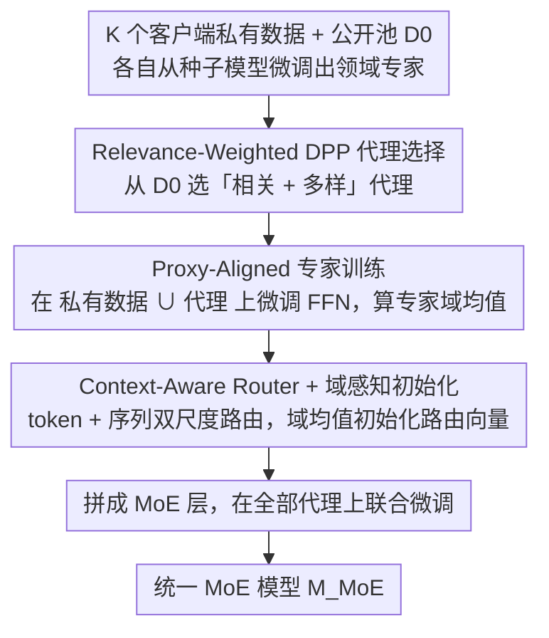

# MetaMoE: Diversity-Aware Proxy Selection for Privacy-Preserving Mixture-of-Experts Unification

**会议**: ICML 2026  
**arXiv**: [2605.14289](https://arxiv.org/abs/2605.14289)  
**代码**: [GitHub](https://github.com/ws-jiang/MetaMoE)  
**领域**: 隐私保护学习 / Mixture-of-Experts / 模型合并  
**关键词**: MoE 统一, 隐私保护, DPP 多样性, 代理数据, 路由训练

## 一句话总结
把多个客户端在私有数据上独立微调出的领域专家，无需共享私有数据就能合并成一个可部署的 MoE 模型——核心是用 relevance-weighted DPP 从公开数据里选「既相关又多样」的代理样本，先做 proxy-aligned 专家训练再训 context-aware router，从而对齐专家行为与代理监督，显著优于 FlexOlmo 等仅依赖相似度选代理的方法。

## 研究背景与动机

**领域现状**：基础模型时代下不同组织 / 用户常在各自私有数据上微调出领域专家；Branch-Train-Merge (BTM)、Model Soup、Branch-Train-MiX (BTX) 等模型合并方法尝试把这些专家融合成一个可部署模型，配合 Mixture-of-Experts 架构和 router 路由。

**现有痛点**：(1) BTM 输出 ensemble，没有统一模型，影响下游 SFT / RLHF；(2) Model Soup 直接平均权重，专家差异大时性能崩；(3) BTX 需要客户私有数据训 router，违反隐私约束；(4) FlexOlmo 用公共代理样本训 router，但代理仅按 similarity 选，结果代理高度冗余、覆盖窄，且专家只见过私有数据没见过代理，导致 routing-expert 行为错配。

**核心矛盾**：训 router 必须见到能代表各客户端域的数据，但客户端真实数据又不能离开；代理数据必须同时具备「与该客户端域相关」+「能覆盖该域的多种模式」两个性质，可这正好对应 DPP 的相关 + 多样化逻辑。

**本文目标**：(1) 给出形式化定义「隐私保护 MoE 统一」问题；(2) 提出 relevance + diversity 双重控制的代理选择算法；(3) 让专家在训练时就见到自己的代理，从而对齐 router 的训练分布；(4) 设计能利用 token + sequence 双尺度上下文的 router；(5) 给出形式化隐私分析。

**切入角度**：相似度选代理只关心「这条样本像不像私有域」，于是会反复挑出长得像的几条样本；DPP 通过 $\det$ 项天然产生「负相关」、避免相似样本共选——把客户特异 relevance 嵌入 DPP 核就能一举得到「相关 + 多样」。

**核心 idea**：在 DPP 核里乘上 client-specific relevance 形成 relevance-weighted DPP $\tilde{L}_{ij} = g(x_i, \mathcal{D}_p) \kappa(x_i, x_j) g(x_j, \mathcal{D}_p)$；用 greedy MAP 选 $m$ 个代理；再让专家在 $\mathcal{D}_p \cup \hat{\mathcal{D}}_p$ 上一起 fine-tune；最后训 context-aware router 把所有 FFN 合并成 MoE。

## 方法详解

### 整体框架
方法要解决的是：$K$ 个客户端各自在私有数据 $\{\mathcal{D}_p\}$ 上微调出一个领域专家，现在想在不交出任何私有数据的前提下，把它们合并成一个单一可部署的 MoE 模型。MetaMoE 的关键转换是用「公开数据里的代理样本」替代私有数据来训练 router——但代理必须既贴合客户域又彼此多样，否则 router 学不会正确路由。整个统一阶段分三步：先用 relevance-weighted DPP 从公开池为每个客户端选一批代理，再让专家在「私有数据 + 自己的代理」上一起微调 FFN（顺便算出每个专家的域均值表征），最后把所有专家的 FFN 拼成 MoE 层、用一个 context-aware router 在全部代理上联合微调得到 $\mathcal{M}_\text{MoE}$。

### 关键设计

**1. Relevance-Weighted DPP 代理选择：让代理「既相关又多样」**

router 要学会把输入路由到正确专家，就必须见到能代表各客户域的数据，可私有数据不能离开本地，于是只能从公开池 $\mathcal{D}_0$ 里挑代理。FlexOlmo 的做法是纯按相似度排序选 top-$m$，结果挑出的全是长得像的几条样本，t-SNE 图上挤成一团、覆盖面很窄。MetaMoE 的修法是把相关性嵌进 DPP 核：先在公开池上训一个二分类器 $g(x,\mathcal{D}_p)$ 区分 $\mathcal{D}_0$ 与 $\mathcal{D}_p$，其得分即 relevance $r$；再构造核 $\tilde{L}=\text{Diag}(r)\,L\,\text{Diag}(r)$，其中 $L_{ij}=\kappa(x_i,x_j)$ 是样本相似度。选子集的目标是

$$\hat{\mathcal{D}}_p = \arg\max_{|S|=m} \log\det(\tilde{L}_S) = 2\sum_{i\in S}\log r_i + \log\det(L_S),$$

第一项把代理拉向高 relevance、第二项的 $\det$ 天然惩罚相似样本共选从而强制多样。实现上先按 $r$ 取 top-$n$ 候选池，再用 greedy MAP + Cholesky 增量更新把复杂度从 $O(nm^3)$ 压到 $O(nm)$。这样选出的代理会在私域流形上铺开，覆盖更广的 routing 决策边界。

**2. Proxy-Aligned 专家训练：从源头消除 router 与专家的行为错配**

FlexOlmo 把专家和 router 的训练数据彻底割裂——专家只见私有数据、router 只见代理，于是「专家学到的输出分布」和「router 实际看到的输入分布」对不上，客户域差异越大路由错得越多。MetaMoE 的做法是让专家在微调阶段就同时见到私有数据与对应代理：每个客户端只 finetune 自己专家的 FFN sublayer，输入是 $\mathcal{D}_p \cup \hat{\mathcal{D}}_p$ 而非只有 $\mathcal{D}_p$，其余层全部冻结以保持和种子模型 $\mathcal{M}_0$ 的兼容、方便后续直接拼成 MoE。因为代理本就来自公开数据，这一步不引入额外隐私风险。训练完后对每层算一个 routing 表征作为该专家的「域均值」：

$$e_p^{(\ell)} = \frac{1}{|\mathcal{D}_p \cup \hat{\mathcal{D}}_p|} \sum_x \mathcal{M}_p^{(1:\ell)}(x).$$

让专家先见过代理，等于把 router 未来要面对的输入分布提前注入专家，从根上消掉这种错配。

**3. Context-Aware Router + 域感知初始化：避免表面相似 token 被错分**

纯 token-level 路由容易被字面相似度欺骗——比如「bank」可能指金融也可能指河岸，单看这个 token 无法判断该送给哪个专家。MetaMoE 让路由同时参考整句的 sequence-level 信息：每个 token 表征 $z_t^{(\ell)}$ 与序列均值 $z_x^{(\ell)}=\tfrac{1}{T}\sum_t z_t^{(\ell)}$ 做可学凸组合 $\tilde{z}_t^{(\ell)}=(1-\lambda)z_t^{(\ell)}+\lambda z_x^{(\ell)}$，再算路由分布

$$\pi^{(\ell)}(z_t^{(\ell)}) = \text{softmax}\big[\tilde{z}_t^{(\ell)\top} e_1^{(\ell)},\dots,\tilde{z}_t^{(\ell)\top} e_K^{(\ell)}\big].$$

其中路由向量 $e_p^{(\ell)}$ 直接用第 2 步算出的专家域均值初始化，相当于一开始就把「每个专家擅长什么」的强先验告诉 router，不必靠纯梯度从零摸索方向，对代理监督有限的场景尤其友好。

### 损失函数 / 训练策略
专家阶段用标准的下一 token / 分类损失；router 阶段在 $\bigcup_p \hat{\mathcal{D}}_p$ 上联合微调整个 MoE。隐私侧，所有客户端只一次性向服务器上传三类 artifact：(i) 代理样本在公开数据上的下标索引；(ii) 专家最终的 FFN 子层权重；(iii) 路由向量 $e_p^{(\ell)}$。论文随后形式化证明这三类都不泄露私有信息——核心在于路由向量是 $N$ 个样本的平均嵌入，私有泄露随 $N$ 增大按 $O(1/N)$ 衰减。

## 实验关键数据

### 主实验
在 CV（基于 ViT-B/32 的 Pets、Cars、CIFAR-100 等数据集）和 NLP（基于 LLM 的多任务 benchmark）上对比 BTM、Model Soup、BTX、FlexOlmo 等。论文 Figure 2 通过 t-SNE 可视化在 Pets 数据集上 random / FlexOlmo / MetaMoE 三种代理选择策略：MetaMoE 选出的代理点显著覆盖更广的私域流形。

| 方法 | CV 平均 acc | NLP 平均 acc | 隐私级别 | 是否单一可部署 |
|------|-------------|--------------|----------|----------------|
| BTM (ensemble) | 较高 | 较高 | 强 | 否（推理多专家） |
| Model Soup | 弱（专家异构时） | 弱 | 强 | 是 |
| BTX | 高 | 高 | 弱（需私有数据训 router） | 是 |
| FlexOlmo (similarity-only proxy) | 中高 | 中高 | 强 | 是 |
| **MetaMoE** | **最高** | **最高** | 强 | 是 |

（论文正文与附录展示完整结果；摘要明确指出在 CV 与 NLP 两类 benchmark 上 MetaMoE 一致优于最新 baseline。）

### 消融实验

| 配置 | 效果 |
|------|------|
| Full MetaMoE | 最优 |
| 去掉 diversity（退化为 FlexOlmo 风格 relevance-only） | 准确率明显下降，代理聚集 |
| 去掉 proxy-aligned 专家训练（专家只见私有数据） | router 与专家行为错配，路由错误率上升 |
| 去掉 context-aware blending（纯 token 路由） | 表面相似 token 被错分到错专家 |
| 去掉 routing vector 域感知初始化（随机初始化） | 收敛慢、最终精度下降 |

### 关键发现
- t-SNE 可视化清晰显示 FlexOlmo 选出的代理几乎挤成一团（窄覆盖），MetaMoE 选出的代理铺满私域流形——说明「相关 + 多样」是 router 学好的必要条件，而不只是「相关」。
- proxy-aligned 专家训练带来的提升与 router 设计相对独立，意味着「让专家见代理」这一步本身就是关键改动；即便配上 FlexOlmo 的简单 router 也能带来一阶收益。
- 上传的 artifact 只有「索引 + 权重 + 平均嵌入」，比 federated learning 每轮上传梯度暴露的私有信息更少；论文形式化证明随 $N$ 增大隐私泄露按 $O(1/N)$ 衰减。
- 代理选择只发生一次（不需要客户端轮询），通信复杂度比 FL 低一个量级。

## 亮点与洞察
- 把 DPP 与 client-specific relevance 融合是个非常自然但之前没人做的小创新，几行公式就把 router 监督质量从「相关」升级到「相关 + 多样」。
- 「proxy-aligned 专家训练」打破了「专家纯私 / router 纯代理」的传统割裂——把代理也当成专家训练数据可以一并消除 routing-expert 错配，思路可以迁移到任何跨域合并任务（多语种 LM、多模态适配）。
- routing vector 用专家域均值嵌入初始化，相当于把「每个专家是什么」直接告诉 router，无需依赖纯梯度找方向，对少数据场景非常友好。
- 隐私分析给出 mean embedding 泄露的具体上界 $O(1/N)$，为 mean-pooled embedding 类做隐私保护的更广泛应用提供了模板。

## 局限与展望
- relevance 分类器 $g(\cdot, \mathcal{D}_p)$ 本身需要在 $\mathcal{D}_0 \cup \mathcal{D}_p$ 上训练，会泄露一定 $\mathcal{D}_p$ 的统计信息（论文将其归为「公开数据上的分类器输出」，但严格意义下仍是私有信号）。
- DPP 是 $O(nm)$ greedy 近似而非全局最优，候选池上界 $n$ 是超参；当 $\mathcal{D}_0$ 远小于实际私域规模时代理可能仍不能覆盖私域。
- 仅在 ViT 和 LLM 的 FFN 层做实验，对 attention / cross-modal 专家是否同样有效未验证。
- $\lambda$ 在 context-aware router 中是单一标量，可能在多层 transformer 中不是最优 —— 不同层可能需要不同 token / sequence 平衡。

## 相关工作与启发
- **vs BTM / Model Soup / BTX**：BTM 不输出单模型；Model Soup 在异构专家上脆弱；BTX 需私有数据训 router；MetaMoE 既给出单模型，又只用公开代理，强于这三者。
- **vs FlexOlmo**：FlexOlmo 同样用公开代理，但代理只按 similarity 选 + 专家不见代理；MetaMoE 用 DPP 增加多样性 + proxy-aligned 训练 + 域感知 router 初始化，全面升级。
- **vs Federated Learning**：FL 要多轮梯度交换、易遭模型逆推攻击；本文一次性上传专家权重 + 索引 + mean embedding，通信少、攻击面小。
- **vs MoE 路由方法（Switch Transformer、top-k gating）**：本文 router 形式上仍是 top-k softmax，但通过域感知初始化 + sequence-blended context 让路由适应「专家分布异构 + 仅有代理监督」的特殊场景。

## 评分
- 新颖性: ⭐⭐⭐⭐ 把 DPP 多样性 + relevance 权重 + proxy-aligned 训练三件事系统组合到隐私保护 MoE 上是首创。
- 实验充分度: ⭐⭐⭐⭐ CV + NLP 两类 benchmark、多 baseline、可视化与消融都有。
- 写作质量: ⭐⭐⭐⭐ Algorithm 1 + 隐私分析逻辑顺，公式与图示清晰。
- 价值: ⭐⭐⭐⭐ 给隐私敏感的工业 MoE 部署提供了一个完整可复现的 pipeline，并附带正式的隐私保证。

<!-- RELATED:START -->

## 相关论文

- [\[CVPR 2026\] ReMoE: Region-Mixture Experts for Adversarially-Robust Vision Transformers](../../CVPR2026/ai_safety/remoe_region-mixture_experts_for_adversarially-robust_vision_transformers.md)
- [\[ICCV 2025\] FedVLA: Federated Vision-Language-Action Learning with Dual Gating Mixture-of-Experts for Robotic Manipulation](../../ICCV2025/ai_safety/fedvla_federated_vision-language-action_learning_with_dual_gating_mixture-of-exp.md)
- [\[ICML 2026\] Persuasive Privacy](persuasive_privacy.md)
- [\[ICCV 2025\] FedMeNF: Privacy-Preserving Federated Meta-Learning for Neural Fields](../../ICCV2025/ai_safety/fedmenf_privacy-preserving_federated_meta-learning_for_neural_fields.md)
- [\[ICLR 2026\] Membership Privacy Risks of Sharpness Aware Minimization](../../ICLR2026/ai_safety/sam_membership_privacy_risks.md)

<!-- RELATED:END -->
