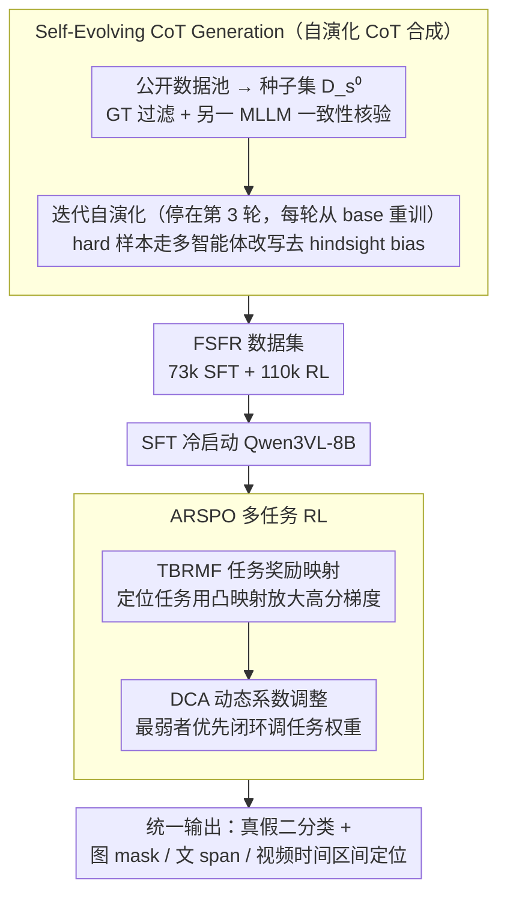

# OmniVL-Guard: Towards Unified Vision-Language Forgery Detection and Grounding via Balanced RL

**会议**: ICML 2026  
**arXiv**: [2602.10687](https://arxiv.org/abs/2602.10687)  
**代码**: https://github.com/shen8424/OmniVL-Guard (有)  
**领域**: AI安全 / 多模态伪造检测 / 强化学习 / VLM  
**关键词**: 伪造检测、Grounding、多任务RL、奖励整形、自演化CoT

## 一句话总结
本文针对"图/文/视频混合伪造同时检测+定位"这一统一任务，提出 OmniVL-Guard，用 Self-Evolving CoT 合成高质量冷启动数据 + ARSPO（非线性奖励映射 + 动态任务权重）解决多任务 RL 中"简单的真假分类抢走梯度、细粒度定位学不动"的难度偏置问题，在 In-Domain 上视频时序定位 tIoU +37.8、文本定位 F1 +22.9，并在四个 OOD benchmark 上做到零样本 SOTA。

## 研究背景与动机

**领域现状**：当前的伪造检测/篡改定位工作绝大多数是单模态（纯图、纯文、纯视频）或顶多双模态（图-文、视频-文），各自配一套专家模型；HAMMER、FKA-Owl、Fake-VLM、FakeSV-VLM 等代表性方法都只能"管一个口子"。

**现有痛点**：真实社交媒体上的虚假信息是图、文、视频高度交织的"全模态"内容，单/双模态检测器面对这种混合输入要么不能处理、要么无法同时给出"真假判定 + 篡改位置"，因而需要一个统一框架同时覆盖二分类与图/文/视频三种 grounding。但作者发现：直接用通用 MLLM（GPT-5/Gemini3/Seed1.6）零样本做这件事，二分类还能凑合到 73%，三个定位任务全部塌到 20-35（Table 1a）；直接 SFT 又因推理能力不足无法跨模态泛化。

**核心矛盾**：自然的选择是引入 RL（GRPO 一类）让 MLLM 自己探索推理路径，但作者通过实验+理论同时观察到一个"难度偏置"现象：二分类是判别题、奖励信号强且容易爬升；图/文/视频定位是回归/区间题、需要精细感知、奖励信号稀疏。GRPO 把所有任务平均一起优化时，二分类一路 +36%，图像定位反而退步 -0.1%——简单任务"绑架"了梯度更新方向。SAPO 等改进虽稍好但同样跑不动定位。

**本文目标**：拆成两个子问题——(1) 怎样为这种细粒度多模态推理任务造出高质量 CoT 冷启动数据；(2) 怎样设计一个新的 RL 目标，让简单任务不抢资源、难任务能持续受益。

**切入角度**：作者对 GRPO 类目标做了对参数 $\theta$ 的二阶展开（公式 4），把梯度变化率拆成"奖励映射敏感度 $g_k'(\cdot)$"和"任务难度敏感度 $H_k'(\theta,q,\tau)$"两项。难任务因停留在性能平台期，$H_k'$ 天然很小，所以即便归一化奖励到同尺度，简单任务仍主导"梯度加速度"。这条解析式直接给出补救方向：用一个**凸的、随性能上升斜率变陡的非线性奖励映射函数** $g_k(\cdot)$，把高分响应的梯度贡献放大，从而对冲难任务的 $H_k'$ 小所带来的衰减。

**核心 idea**：用"非线性奖励整形 + 动态任务权重"取代均匀加权 RL，让简单任务该收敛就收敛、难任务该被加权就被加权；并用自演化 CoT 合成出能真正解题（而非反推答案）的冷启动数据，避免 GT 注入式蒸馏带来的 hindsight bias。

## 方法详解

### 整体框架
模型吃进任意一段图/文/视频或它们的混合，要一次性吐出"真假二分类"和"对应模态上的篡改位置"——图像空间 mask（IoU 衡量）、文本 token 跨度（F1）、视频时间区间（tIoU）。作者把所有定位任务都统一成 MLLM 的文本输出（坐标 / token 跨度 / 时间区间），从而能用一个 Qwen3VL-8B 同时覆盖四个任务。落地分两块：离线先用 Self-Evolving CoT Generation 造出 FSFR 数据集（73k SFT 冷启动样本 + 110k RL 样本），再在 Qwen3VL-8B 上做 SFT 冷启动、然后跑 ARSPO 这套针对"难度偏置"的多任务 RL（其内部由 TBRMF 与 DCA 两个模块构成），最后在 In-Domain 与 OOD 上测。难点都集中在后两块——怎么造不带答案泄漏的 CoT，以及怎么让简单的二分类别把定位任务的梯度抢光。

### 关键设计

**1. Self-Evolving CoT Generation：用模型自己跑得通来代理 CoT 质量，绕开 hindsight bias**

冷启动数据是整套方法的地基，但造它有个两难（作者称为 *Efficiency-Bias Dilemma*）：闭源 MLLM 直接生成 CoT 质量太差，因为它们根本不懂法证级的细节；而把 GT 喂进去让模型补推理，又会让模型学会"从答案反推过程"，这种 hindsight bias 会污染后续 RL 的探索。作者的解法是四阶段自演化。先从公开数据池（FakeNewsCorpus、ForgeryNet、GenVideo、DGM4 等）汇总并划分出 $D_s/D_r/D_t$；再用 SOTA MLLM 集合 $\mathcal{M}=\{\text{Seed1.6-VL, Gemini3, ChatGPT5}\}$ 推理 $D_s$ 的一小撮，经"GT 过滤 + 另一个 MLLM 一致性核验"挑出 6.7k 种子集 $D_s^0$，SFT+RL 拿到 warm-up 策略 $\pi_0$。

之后进入迭代：第 $k$ 轮用 $\pi_{k-1}$ 给剩余样本生成 CoT，同样经 GT 过滤 + SOTA MLLM 校验后并入 $D_s^k$，关键是**每轮都从 base Qwen3VL-8B 重训**而不是接着上一轮练，以免分布漂移把数据带偏。对那些怎么都答错的 hard 样本，单独走 Multi-Agent Collaborative Hard-CoT Synthesis——第一个 MLLM 借 GT 生成 CoT，第二个 MLLM 当 "Refiner" 把答案痕迹改写成"假装不知道答案的自然推理"，第三个 MLLM 评分过滤。这一套的精髓是把"是否走对推理"和"是否得到正确答案"两个信号解耦：用"模型自己能跑通"代理推理质量，用第三方 MLLM 当裁判堵住答案泄漏。Table 5 显示三轮就饱和（$D_s^4$ 比 $D_s^3$ 几乎零增益），既论证了停在 $k=3$ 的合理性，也省下大量 MLLM 推理算力。

**2. Task-Based Reward Mapping Function（TBRMF）：用凸的奖励映射重塑梯度，对冲难任务**

这是 ARSPO 的理论核心，针对的痛点是 GRPO 把所有任务平均优化时简单的二分类一路爬升、定位任务原地踏步。作者没有停在现象层，而是把 GRPO 目标对参数 $\theta$ 做二阶展开，得到梯度加速度

$$\frac{d}{d\theta}\big(W_{i,t}(\theta)\hat{A}_{i,k}\big) = W'_{i,t}(\theta)\hat{A}_{i,k} + W_{i,t}(\theta)\cdot \frac{g_k'(H_k)}{G\sigma}\big[(G-1)-\hat{A}_{i,k}^2\big]\,H_k'(\theta,q,\tau)$$

这把每个任务的梯度变化率拆成两个因子相乘:奖励映射敏感度 $g_k'(\cdot)$ 和任务难度敏感度 $H_k'(\theta,q,\tau)$。难任务停在性能平台期、$H_k'$ 天然很小，所以哪怕把奖励归一化到同尺度，简单任务仍主导更新方向——这就是"难度偏置"的解析根因。补救方向也随之清晰：既然 $H_k'$ 改不了，那就在另一个因子 $g_k'$ 上动手。作者把奖励写成 $A_{i,k}=g_k(x_{i,k})$，由原始性能指标 $x_{i,k}$ 经映射 $g_k$ 得到，对容易的二分类取恒等映射 $g_k(x)=x$ 避免无谓放大，对三个细粒度定位任务取凸函数 $g_k(x)=e^{a_k x}$（$a=3$，Figure 4 网格扫出来的甜点）。凸映射在高性能区斜率更陡，把组内得分高、"接近正确但还差一点"的 response 的梯度显著拉大，等价于在奖励侧补偿 $H_k'$ 的衰减。这也解释了为什么 5.3 节单任务（无任务竞争）下指数映射依然碾压线性映射：ARSPO 的本质不是"平衡多任务"，而是"重塑梯度信号"。

**3. Dynamic Coefficient Adjustment（DCA）：闭环控制器按最弱者优先动态分配任务权重**

TBRMF 给的是静态的奖励曲线形状，但训练动态是会变的——某个任务可能先落后后追上、或追上后又退化，光靠静态形状管不住"水桶效应"。DCA 给系统补一个闭环控制器。先有 warm-up 阶段（$s<T_{warm}$）记录每个任务均值作为冻结 baseline $B_k$；之后每 $T$ 步评估两个量:总体相对增益 $\Delta_{\text{total},k}=(\mu_k-B_k)/B_k$ 看长期跟没跟上、近期变化 $\delta_{\text{recent}}=\mu_k-\mu_{\text{past}}$ 看短期趋势。然后按四档优先级调整全局权重 $l_{k,s}$：momentum 保护（还在上升期就不动）→ regression rescue（明显回退就乘 $\alpha_{\text{boost}}$ 抢救）→ high-performance decay（已达标就乘 $\alpha_{\text{decay}}$ 缓慢退场，下限为 1）→ laggard support（找出最落后的 $k_{\text{lag}}=\arg\min_k\Delta_{\text{total},k}$ 放大权重，上限 4），最后整体除以最小系数做 rescaling 再代入更新。整套逻辑只是四档启发式 + 一组阈值，没有任何梯度回传开销，却把权重资源持续倾斜到当前最卡壳的任务，与 TBRMF 形成"静态形状 + 动态权重"的双保险。

### 损失函数 / 训练策略
RL 目标在 GRPO 框架上嵌入 DCA 的动态系数 $l_{k,s}$：

$$\mathcal{J}_{\text{arspo}}(\theta)=\sum_{k=1}^{K}\frac{|\mathcal{D}_k|}{|\mathcal{D}|}\mathbb{E}_{q\sim\mathcal{D}_k,\{y_i\}\sim\pi_{\theta_{\text{old}}}}\left[\frac{l_{k,s}}{G}\sum_{i=1}^{G}\frac{1}{|y_i|}\sum_{t=1}^{|y_i|}f_{i,t}(r_{i,t}(\theta))\hat{A}_{i,k}\right]$$

优势 $\hat{A}_{i,k}=(A_{i,k}-\mu)/\sigma$ 仍按组内归一，但奖励 $A_{i,k}=g_k(x_{i,k})$ 已经过 TBRMF 的任务定制非线性映射。基座 Qwen3VL-8B 先用 $\text{FSFR}_{\text{sft}}$ SFT 冷启动，再用 $\text{FSFR}_{\text{rl}}$ 跑 ARSPO；warm-up 期间所有 $l_{k,s}=1$ 用来采集 baseline。

## 实验关键数据

### 主实验
In-Domain（自建 $D_t$ 测试集，约 700k 样本）：

| 数据集 / 任务 | 指标 | 本文 | 之前 SOTA | 提升 |
|--------|------|------|----------|------|
| Text 二分类 | ACC | 96.20 | 89.23 (Qwen3VL-235B) | +6.97 |
| Image 二分类 | ACC | 93.12 | 90.39 (Fake-VLM) | +2.73 |
| Video 二分类 | ACC | 98.58 | 98.81 (FakeSV-VLM) | -0.23 |
| Text-Image 二分类 | ACC | 75.52 | 72.08 (FKA-Owl) | +3.44 |
| Image 定位 | IoU | 54.26 | 48.53 (HAMMER) | +5.73 |
| Text 定位 | F1 | 63.78 | 40.86 (HAMMER) | +22.92 |
| Video 定位 | tIoU | 59.22 | 21.43 (Qwen3VL-235B) | +37.79 |

OOD 零样本（无任何二次微调）：ISOT 文本 93.69（vs 88.74）、CASIA2.0 图像 63.64（vs 60.88）、MMFakeBench 图文 79.38（vs 62.32）、FakeSV 文-视频 63.55（vs 61.22），四个 benchmark 全部领先。

### 消融实验

| 配置 | Img-Loc IoU | Text-Loc F1 | Vid-Loc tIoU | $\Delta$ AVG |
|------|---|---|---|---|
| SFT only | 51.08 | 44.67 | 33.08 | — |
| SFT + SAPO | 51.24 | 54.33 | 44.10 | +24.33 |
| + TBRMF | 53.21 | 61.37 | 49.38 | +26.42 |
| + DCA | 52.95 | 59.88 | 53.49 | +26.93 |
| Full（SFT+SAPO+TBRMF+DCA） | **54.26** | **63.78** | **59.22** | **+28.33** |

### 关键发现
- **TBRMF 的"重塑梯度"作用是本文最强信号**：在单任务设置下（没有任务间资源竞争），指数映射依然比线性映射在图像定位上提升 +4%、文本定位 +8%，说明 ARSPO 的价值不在于"平衡多任务"，而在于"放大高分样本的梯度贡献"——这也直接对应 4.1 节对 $g_k'(\cdot)$ 的理论分析。
- **奖励曲率超过 $a=3$ 反而退化**：Figure 4(a-b) 显示 $a$ 太大时性能下降，作者归因于"奖励过拟合"——过陡的映射把 aleatoric 噪声当成信号、模型陷入局部最优；$a=3$ 是信号放大与训练稳定的甜点。
- **自演化在第 3 轮即饱和**：Table 5 显示 $D_s^4$ vs $D_s^3$ 几乎所有指标变化都在 0.2 以内，论证了把自演化停在 $k=3$ 的合理性，也节省了大量 MLLM 推理算力。
- **GRPO/SAPO 的"难度偏置"被实验直接捕捉到**：Table 1(b) 中 SFT+GRPO 让二分类暴涨 +36%、Image-Loc 反而 -0.1%——这是一个非常直观的"简单任务抢梯度"案例，也是本文整套方法的最强动机。

## 亮点与洞察
- **从二阶梯度展开里读出"难度偏置"的根因**：作者没有停留在"实验观察到 GRPO 偏向简单任务"这层现象，而是把目标对 $\theta$ 求二阶，把梯度加速度精准拆成"奖励敏感 $g_k'$ × 难度敏感 $H_k'$"两个因子；这一步把"该怎么改 RL"的问题降维成"该怎么选 $g_k$"，使得后续 TBRMF 的指数映射有理论可循而非纯调参，这种推导路径可以迁移到任何多任务 GRPO 的难度不平衡场景。
- **Hindsight-Bias-Free 的 CoT 合成范式很值得复用**：在所有"用 LLM 蒸馏 CoT"的工作里，"把 GT 喂给模型然后让它推理"几乎是默认做法，但本文明确指出这会让模型学会"反推"而不是"演绎"，并用"Refiner MLLM 重写 CoT 隐藏答案痕迹 + 第三方 MLLM 当裁判"两步把这个 bias 消掉；这一思路对所有需要"过程监督"而非"结果监督"的任务（数学推理、定理证明、形式化验证）都直接可用。
- **DCA 的"水桶效应"控制器是个轻量好用的小工具**：仅需四档优先级 + 一组阈值就能动态调整任务权重、没有梯度回传开销；可作为任何多任务 RL 训练的即插即用模块。

## 局限与展望
- 作者承认的局限较少，主要集中在"OOD 仍有提升空间"和"模型规模 8B 不大"，但实际局限还包括：(1) 全套流程依赖三个闭源 SOTA MLLM 做"裁判 + 生成 + 改写"，复现成本极高，开源社区难以平替；(2) 自演化每轮都从 base Qwen3VL 重训以避免分布漂移，3 轮意味着 4 次完整 SFT+RL，总训练开销在论文里没明确给出；(3) TBRMF 对每个任务都需要手调 $a_k$，仅在图/文定位上扫了 $a=3$，对更细粒度的子任务（如不同篡改类型）是否需要进一步差异化没有讨论。
- 一个有意思的改进方向是把 DCA 的四档启发式替换为基于 bandit / meta-learning 的可学习控制器，让权重调整本身也成为可优化对象，可能比当前固定阈值更鲁棒；同时可以把 TBRMF 的 $a_k$ 做成在线自适应，按当前任务在 reward 直方图上的分位数动态调整曲率。

## 相关工作与启发
- **vs HAMMER / FKA-Owl / AMD（双模态图-文专家）**：他们专注于图-文双模态、用专门的检测头做定位；本文做的是图/文/视频三模态统一、且把所有定位任务都转化为 MLLM 的文本输出（坐标 / token 跨度 / 时间区间），优势在于零样本跨模态泛化、劣势在于推理延迟显著高于专家模型。
- **vs DeepSeek-R1 / GRPO / SAPO**：本文承接 DeepSeek-R1 的"SFT 冷启动 + RL 提升推理"范式，但指出 GRPO/SAPO 在多任务设定下的难度偏置问题，并通过 ARSPO 提供解法；可视为 GRPO 在"任务难度不均衡"场景下的一个重要补丁。
- **vs Fake-VLM / FakeSV-VLM**：单模态专家模型在自己任务上很强（Fake-VLM 图像 90.39、FakeSV-VLM 视频 98.81），本文在单模态上仅持平或微差（Video 二分类 -0.23），但跨模态、跨数据集时领先幅度显著，体现"统一模型"的边际价值。

## 评分
- 新颖性: ⭐⭐⭐⭐ 把"难度偏置"用二阶梯度公式精确归因，并用 TBRMF + DCA 给出有理有据的解法；自演化 CoT 中"Refiner 去 hindsight bias"也很有意思。
- 实验充分度: ⭐⭐⭐⭐⭐ 主表覆盖 4 种模态 × 7 个指标 + 4 个 OOD benchmark；消融拆开 SAPO/TBRMF/DCA 四种组合；并在单任务设定下二次验证 TBRMF 本质作用。
- 写作质量: ⭐⭐⭐⭐ 动机—理论—算法链条清晰，公式推导完整；只是 ARSPO 节里的 Algorithm 1 在正文需要反复跳到 Appendix 查阈值，可读性略受影响。
- 价值: ⭐⭐⭐⭐ 给"多模态全模态伪造检测"这件实际有用的事拿出了一个可工程化的统一方案，且 ARSPO 的难度偏置解法可被任意多任务 GRPO 训练复用。

<!-- RELATED:START -->

## 相关论文

- [\[CVPR 2026\] A Unified Perspective on Adversarial Membership Manipulation in Vision Models](../../CVPR2026/ai_safety/a_unified_perspective_on_adversarial_membership_manipulation_in_vision_models.md)
- [\[CVPR 2026\] TTP: Test-Time Padding for Adversarial Detection and Robust Adaptation on Vision-Language Models](../../CVPR2026/ai_safety/ttp_test-time_padding_for_adversarial_detection_and_robust_adaptation_on_vision-.md)
- [\[CVPR 2026\] Hierarchically Robust Zero-shot Vision-language Models](../../CVPR2026/ai_safety/hierarchically_robust_zero-shot_vision-language_models.md)
- [\[CVPR 2026\] SIF: Semantically In-Distribution Fingerprints for Large Vision-Language Models](../../CVPR2026/ai_safety/sif_semantically_in-distribution_fingerprints_for_large_vision-language_models.md)
- [\[CVPR 2026\] Omni-Fake: Benchmarking Unified Multimodal Social Media Deepfake Detection](../../CVPR2026/ai_safety/omni-fake_benchmarking_unified_multimodal_social_media_deepfake_detection.md)

<!-- RELATED:END -->
