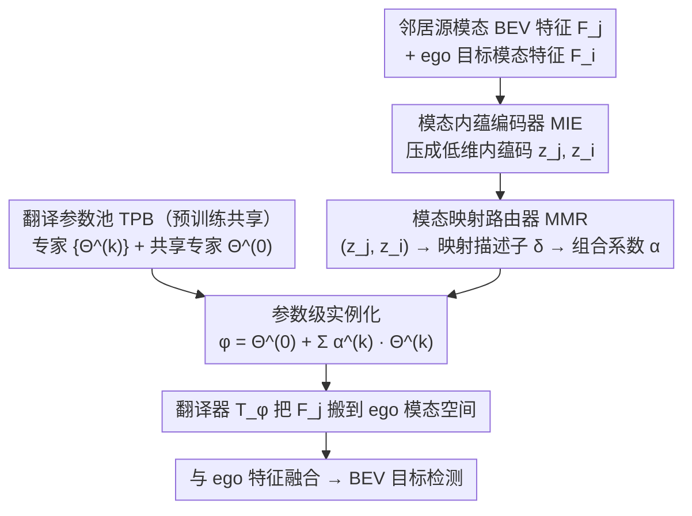

# One Model to Translate Them All: Universal Any-to-Any Translation for Heterogeneous Collaborative Perception

**会议**: ICML 2026  
**arXiv**: [2605.17907](https://arxiv.org/abs/2605.17907)  
**代码**: https://github.com/CheeryLeeyy/UniTrans (有)  
**领域**: 自动驾驶 / 协同感知 / 异构特征翻译  
**关键词**: 协同感知, 异构特征, 模态映射, 零样本翻译, 参数级 MoE

## 一句话总结
UniTrans 把"为每对车端模态训一个 adapter"的传统协同感知翻译范式，改写成"在一个模态内蕴空间里推断映射 → 通过 router 线性组合一组专家参数 → 当场实例化一个映射专属翻译器"，实现对未见过的新车型的零样本 BEV 特征翻译，在 OPV2V-H / DAIR-V2X 上平均 AP@0.7 较最强基线提升 ~7 / 3 个点，同时 GFLOPs / CPU 时间均低于 Classic MoE。

## 研究背景与动机

**领域现状**：基于中间特征共享（intermediate fusion）的协同感知是下一代自动驾驶的主流范式：每辆联网车把自己的 BEV 特征发给邻居，弥补单车视角的遮挡与远距离感知不足。但不同厂商的传感器配置、骨干网络、网络深度都不同，互发的 BEV 特征其实分布在异构的"模态子空间"里，直接喂给 ego 的 fusion 网络会被错误解读，反而降低性能。

**现有痛点**：解决异构性主要有两条路。**一对一适配**（MPDA、PnPDA、PolyInter）为每一种"源模态→目标模态"训一个专用 adapter，新模态出现就要新一轮训练；**两步适配**（HEAL、STAMP、NegoCollab）引入统一的协议空间作为中转站，但协议空间是预先定义或谈判出来的，碰到新模态往往要重新调整协议、再训所有映射。两类方法都依赖反复的联合训练或微调，而跨厂商的联合训练在模型与数据隐私约束下基本不可行。

**核心矛盾**：开放世界部署里模态在持续演化，但翻译器的训练范式还停留在"模态集合是封闭、训练是可重复"的假设上；这两个假设一旦打破，整套协同感知体系就难以扩展。

**本文目标**：预训一个通用模型，使其对任意新出现的"源→目标"模态对，都能在推理时**零样本**地给出一个合适的特征翻译器，不依赖任何额外训练或微调。

**切入角度**：作者观察到两点。(i) 中间特征同时纠缠了"场景内容"和"模态统计"，但只要把它们投到一个**模态内蕴的低维空间**，场景因素被压掉，新模态也能稳定地被定位、被比较，从而把"估计模态映射"这件难事从高维特征空间搬到一个小空间里完成。(ii) 与其训一个巨大的统一翻译器去硬扛所有映射，不如把映射分解到一组**可复用的专家参数**上，让一个 router 把"模态映射"翻译成"参数组合系数"，按需把专家线性合成出一个映射专属翻译器；这样推理时只跑一份合成后的翻译器，省掉了 Classic MoE 的多专家并行开销。

**核心 idea**：用「模态内蕴空间推断映射 + 映射条件下的参数组合实例化翻译器」替代「为每个模态对训一个 adapter / 维护一个协议空间」。

## 方法详解

### 整体框架

每个 agent 用自己的编码器产出 BEV 中间特征 $F_i \in \mathcal{F}_{m_i}$，邻居发来的特征经几何对齐后还停留在异构的源模态空间，必须先被翻译器 $\mathcal{T}_{\phi_{j\to i}}$ 搬到 ego 模态空间才能融合。UniTrans 要解决的是"如何对一个从没见过的源-目标模态对，当场拿到合适的翻译器参数 $\phi_{j\to i}$ 而不重新训练"。它的做法是把这件难事拆成两件容易的事：先用一个模态内蕴编码器把高维特征压成稳定可比的低维模态码，再让一个路由器根据这对模态码预测"组合系数"，把一池可复用的翻译专家参数线性合成出一个映射专属翻译器。训练分两阶段（先建内蕴空间、再学参数池和路由），推理时所有 agent 共享同一份参数池和路由器，遇到新模态直接组装，不需要任何微调。

### 关键设计

**1. 模态内蕴编码器 MIE：把"估计映射"从高维特征空间搬到稳定的低维空间**

直接在原始特征空间 $\mathcal{F}$ 里估计映射 $\Delta_{j\to i}:\mathcal{F}_{m_j}\to\mathcal{F}_{m_i}$ 是 ill-posed 的——单帧样本太稀疏、维度太高，而且特征里同时纠缠了场景内容和模态统计。MIE 的思路是抽取一批对场景不敏感、对模态敏感的统计量，把每个特征 $F \in \mathbb{R}^{C\times H\times W}$ 压成一个低维内蕴码 $z \in \mathbb{R}^d$：取一阶通道统计 $\mu(F), \sigma(F)$，再取池化特征的 Gram 描述子 $G(F)=\frac{1}{H'W'}\bar{F}\bar{F}^\top$，配一支全局响应分支 $r(F)$，最后用 MLP 融合成 $z = \psi_I([\mu(F), \sigma(F), r(F), \psi_G(G(F))])$。训练用 InfoNCE 对比损失 $\mathcal{L}_{\mathrm{IC}}$ 拉近同模态、推开异模态，再加一个轻量模态分类头的交叉熵 $\mathcal{L}_{\mathrm{IS}}$ 做辅助，合成 $\mathcal{L}_{\mathrm{stage1}} = \mathcal{L}_{\mathrm{IC}} + \lambda_{\mathrm{IS}} \mathcal{L}_{\mathrm{IS}}$。这样训练出的空间里，"同一模态不论场景如何变化都聚成一团、不同模态互相分开"，新模态只要少量样本就能落到一个一致的区域被定位——这是 UniTrans 第一个零样本能力来源。

**2. 翻译参数池 TPB：把单体翻译器分解成可复用的专家参数**

实测里"映射多样性"比"特征多样性"更难拟合：一个统一的单体翻译器在 LiDAR-Camera 这种巨大跨模态间隙下容易欠拟合。TPB 不去训一个能同时处理所有 $(m_j,m_i)$ 的庞大翻译器，而是把映射空间分解成一组可复用的专家参数 $\{\Theta^{(k)}\}_{k=1}^K$ 加一个共享专家 $\Theta^{(0)}$，每个 $\Theta^{(k)}$ 都是一套完整的翻译器主干参数（按 sparse Transformer 设计的 MCT 块），共享专家则吸收那些"映射无关"的翻译基元。每个专家专注一种翻译子模式，推理时按需混合——模态映射越复杂，这种分解相比单体翻译器的容量优势越明显，而且同一份参数池能服务全部新模态。

**3. 模态映射路由器 MMR + 参数级实例化：把"映射"翻译成"参数组合系数"**

给定一对内蕴码 $(z_j, z_i)$，MMR 先算出映射描述子 $\delta_{j\to i} = g(z_j, z_i)$，再输出组合系数 $\boldsymbol{\alpha}_{j\to i} = \mathrm{softmax}(h(\delta_{j\to i})) \in \mathbb{R}^K$，然后直接**在参数层面**把 TPB 合成成一个翻译器 $\phi_{j\to i} = \Theta^{(0)} + \sum_{k=1}^{K} \alpha^{(k)}_{j\to i}\, \Theta^{(k)}$。这与经典 MoE 的"多专家前向 + 加权输出"本质不同：UniTrans 是"加权参数 + 单次前向"，整次推理只跑一份合成后的翻译器，算力不随专家数线性增长，对车端实时推理友好。把"映射→翻译器"建模成路由系数预测，MMR 能学到一种跨映射可外推的规律——这是 UniTrans 第二个零样本能力来源。

### 损失函数 / 训练策略

整体训练严格切成两阶段。Stage 1 只动 MIE，目标是构建上面那个稳定的模态内蕴空间。Stage 2 冻住 MIE 与下游任务头，把梯度回传到 MMR 和 TPB，联合优化四项：任务损失 $\mathcal{L}_{\mathrm{task}}$；特征蒸馏损失 $\mathcal{L}_{\mathrm{feat}} = \|F_{j\to i} - F^{\star}_{j\to i}\|_2^2$，其中用 ego 编码器跑邻居原始观测得到的"理想 ego 域特征" $F^{\star}_{j\to i}=f^{\mathrm{enc}}_{m_i}(X_j)$ 当 teacher，给翻译器一个明确的"目标域长什么样"的监督；对路由向量的 InfoNCE $\mathcal{L}_{\mathrm{ctr}}$（同一映射标签拉近、不同映射推开）；以及 Switch 风格的负载均衡正则 $\mathcal{L}_r$，合成 $\mathcal{L}_{\mathrm{stage2}} = \mathcal{L}_{\mathrm{task}} + \lambda_{\mathrm{feat}}\mathcal{L}_{\mathrm{feat}} + \lambda_{\mathrm{ctr}}\mathcal{L}_{\mathrm{ctr}} + \lambda_r \mathcal{L}_r$。训练只能见到 $\mathcal{M}_{\mathrm{tr}}$ 中的模态与 $\mathcal{D}_{\mathrm{tr}}$ 中的场景，预留 6 种 emerging modality $\{m_7, m_{13}, m_{17}, m_{25}, m_{27}, m_{30}\}$ 完全留到推理评测，严格遵守"零样本"设定。

## 实验关键数据

### 主实验

在 OPV2V-H（仿真）和 DAIR-V2X（真实）两个基准上构造 30 种 LiDAR / Camera 模态组合（变换 PointPillars / SECOND / VoxelNet / LSS 等骨干与深度），划出 6 种 emerging 模态做 ego，邻居模态也从 emerging 集中采样，做严格 any-to-any 零样本翻译评测。

| 数据集 | 指标 | 本文 UniTrans | 最强基线 NegoCollab | 提升 |
|--------|------|--------------|---------------------|------|
| OPV2V-H 平均 | AP@0.5 / AP@0.7 | **0.716 / 0.605** | 0.662 / 0.538 | +5.4 / +6.7 pt |
| OPV2V-H m27 (相机 ego) | AP@0.5 / AP@0.7 | **0.497 / 0.243** | 0.468 / 0.206 | +2.9 / +3.7 pt |
| OPV2V-H m30 (相机 ego) | AP@0.5 / AP@0.7 | **0.406 / 0.202** | 0.355 / 0.188 | +5.1 / +1.4 pt |
| DAIR-V2X 平均 | AP@0.5 / AP@0.7 | **0.553 / 0.421** | 0.509 / 0.389 | +4.4 / +3.2 pt |

推理代价也明显更友好（OPV2V-H 测试集）：UniTrans 109.3 GFLOPs / 6.865 ms CPU / 53.76 ms CUDA，对比 Classic MoE（TopK=3）245.5 GFLOPs / 89.078 ms CPU / 141.352 ms CUDA，约 2× 算力节省。

### 消融实验

| 配置 | AP@0.5 / AP@0.7 | 说明 |
|------|-----------------|------|
| Full UniTrans | **0.716 / 0.605** | 完整模型 |
| w/o $\mathcal{L}_{\mathrm{IC}}$ | 0.685 / 0.575 | 去掉模态对比损失，内蕴空间不再聚类 |
| w/o $\mathcal{L}_{\mathrm{IS}}$ | 0.694 / 0.583 | 去掉模态分类辅助 |
| w/o $\mathcal{L}_{\mathrm{IC}} + \mathcal{L}_{\mathrm{IS}}$ | 0.662 / 0.540 | Stage 1 监督全砍，模态识别能力崩 |
| w/o $\mathcal{L}_{\mathrm{task}}$ | 0.691 / 0.579 | 缺下游任务监督 |
| w/o $\mathcal{L}_{\mathrm{feat}}$ | 0.653 / 0.531 | **最关键** —— 失去 ego-encoder 蒸馏的 teacher，翻译方向跑偏 |
| w/o $\mathcal{L}_{\mathrm{ctr}}$ | 见原表 | 路由向量不再按映射聚类 |

### 关键发现

- 蒸馏损失 $\mathcal{L}_{\mathrm{feat}}$ 是消融里掉点最猛的一项（AP@0.7 从 0.605 掉到 0.531），印证"用 ego encoder 跑邻居观测当 teacher"是这套零样本翻译能 work 的隐式关键——它给了翻译器一个明确的"ego 域应该长什么样"的监督信号。
- LiDAR ego（m7–m25）UniTrans 收益最稳定；Camera ego（m27、m30）所有方法都明显掉点，但 UniTrans 仍最强，说明模态内蕴空间在大跨模态间隙下还能稳健测量映射关系。
- Classic MoE 反而比一些两步法（如 PolyInter）只略好，说明**在高维特征上直接路由**很难学到"模态映射感知"的专家选择；UniTrans 把路由放到内蕴空间是关键。
- 真实数据集 DAIR-V2X 上提升幅度小于仿真，但相对排名不变，分布漂移下 mapping-conditioned instantiation 仍占优。

## 亮点与洞察

- **"在哪里推断映射"比"翻译器多复杂"更重要**：把模态映射推断从原始特征空间搬到内蕴空间这一步，独立解释了 OPV2V-H 上约 5 个 AP@0.7 的提升（w/o $\mathcal{L}_{\mathrm{IC}}+\mathcal{L}_{\mathrm{IS}}$ 的对比）。这是个能复用到其他"异构 backbone 对齐"问题（如联邦学习、跨设备模型互译）的思路。
- **参数级专家组合（不是经典 MoE）**：MoE 习惯"多个专家前向 + 加权输出"，UniTrans 改为"加权参数 + 单次前向"，在车端实时推理这种延迟敏感场景里把 MoE 的容量优势保留下来，又把推理代价压到与单体翻译器相当。
- **Teacher 设计很巧**：把"邻居观测过 ego 编码器"作为蒸馏 teacher（$F^\star_{j\to i}=f^\mathrm{enc}_{m_i}(X_j)$），等于借了 ego encoder 一只手帮翻译器明确"目标域长什么样"，绕开了"无 paired feature"的难题，可以推广到其他跨域特征对齐问题。
- 整套方案是真正的"训一次、撒出去用"——TPB+MMR+MIE 一次预训完成后，任何新厂商的新车型只要发来一帧特征，ego 就能就地组装出一个专属翻译器，对协同感知工程落地价值很大。

## 局限与展望

- 30 种模态全部由"骨干+深度"组合而来，本质上还是 LiDAR / Camera 两大家族里的变体；面对全新传感器（如 4D 雷达、热成像）时 MIE 的内蕴空间能不能仍然保持"同模态聚类、异模态分开"还需要验证。
- TPB 的专家数 $K$ 与每个专家的完整翻译器参数会显著影响显存（要存 $K+1$ 套完整 backbone 参数），论文未讨论参数预算受限场景下的退化曲线。
- 蒸馏 teacher $F^\star_{j\to i}=f^\mathrm{enc}_{m_i}(X_j)$ 要求训练时 ego 端能拿到邻居的原始观测 $X_j$，这在跨厂商场景里其实违反"数据隐私"假设；推理时不需要，但训练阶段的数据约束仍然是问题。
- 真实数据集 DAIR-V2X 上的绝对值（AP@0.7 = 0.421）距离生产部署要求仍偏低，主要瓶颈在 Camera-ego 场景，后续值得引入相机几何先验或多帧 BEV 历史来缓解。

## 相关工作与启发

- **vs MPDA / PnPDA / PolyInter（一对一适配）**：它们为每对模态训一个 adapter，新模态来就要新训练；UniTrans 用 TPB 把所有映射分解到一组共享专家上、用 MMR 在线组合，等价于"一份 adapter 模板 + 一份路由"统治所有新模态。
- **vs HEAL / STAMP / NegoCollab（协议空间）**：它们靠预定义/谈判出来的协议空间做中转，新模态可能不适配现有协议；UniTrans 不依赖协议空间，模态映射直接在数据驱动的内蕴空间里被估计。
- **vs Classic MoE**：经典 MoE 在高维特征上做路由 + 多专家并行输出，UniTrans 把路由放到低维内蕴空间，并改成参数级线性组合，单次前向更快，模态映射感知也更强。
- **启发**：这套"低维内蕴空间推断条件 + 参数池组合实例化"的模式很像 hyper-network 在条件生成、跨域适配里的早期想法，但 UniTrans 把它在协同感知这种工程感很强的场景里跑通了，并清晰地把"零样本能力"拆成内蕴空间泛化和路由器泛化两条；这种分解可以迁移到联邦学习的跨客户端模型互译、跨设备 perception 兼容性等场景。

## 评分
- 新颖性: ⭐⭐⭐⭐ 把异构协同感知从"训 adapter"重新表述成"内蕴空间路由 + 参数级 MoE 实例化"，思路 sharp，但每个零件（MIE 风格特征、参数级 MoE、Gram 统计、蒸馏 teacher）单看都有先例，新颖性主要在系统级组合。
- 实验充分度: ⭐⭐⭐⭐ 两个数据集 + 30 模态 + 6 模态留作零样本 + 路由 / 蒸馏 / 内蕴空间逐项消融 + GFLOPs / 时延 profiling，覆盖到位；不过缺少模态规模 K 的扫描和 4D 雷达等真正新家族传感器的验证。
- 写作质量: ⭐⭐⭐⭐ 公式与符号体系完整、模态划分 $\mathcal{M}_{\mathrm{tr}}/\mathcal{M}_{\mathrm{em}}$ 与场景划分 $\mathcal{D}_{\mathrm{tr}}/\mathcal{D}_{\mathrm{te}}$ 区分清晰，但部分推导稍繁复。
- 价值: ⭐⭐⭐⭐⭐ 直接戳到协同感知落地的真痛点（跨厂商不能联合训练 + 模态在持续演化），方案天然支持零样本接入新车型，对工程化部署价值很高。

<!-- RELATED:START -->

## 相关论文

- [\[CVPR 2026\] Detect Any AI-Counterfeited Text Image](../../CVPR2026/ai_safety/detect_any_ai-counterfeited_text_image.md)
- [\[ICML 2026\] Partitioning for Intrinsic Model Inversion Resistance in Collaborative Inference](partitioning_for_intrinsic_model_inversion_resistance_in_collaborative_inference.md)
- [\[ICLR 2026\] Co-LoRA: Collaborative Model Personalization on Heterogeneous Multi-Modal Clients](../../ICLR2026/ai_safety/co-lora_collaborative_model_personalization_on_heterogeneous_multi-modal_clients.md)
- [\[ICML 2025\] Can One Safety Loop Guard Them All? Agentic Guard Rails for Federated Computing](../../ICML2025/ai_safety/can_one_safety_loop_guard_them_all_agentic_guard_rails_for_federated_computing.md)
- [\[CVPR 2026\] All Vehicles Can Lie: Efficient Adversarial Defense in Fully Untrusted-Vehicle Collaborative Perception via Pseudo-Random Bayesian Inference](../../CVPR2026/ai_safety/all_vehicles_can_lie_efficient_adversarial_defense_in_fully_untrusted-vehicle_co.md)

<!-- RELATED:END -->
