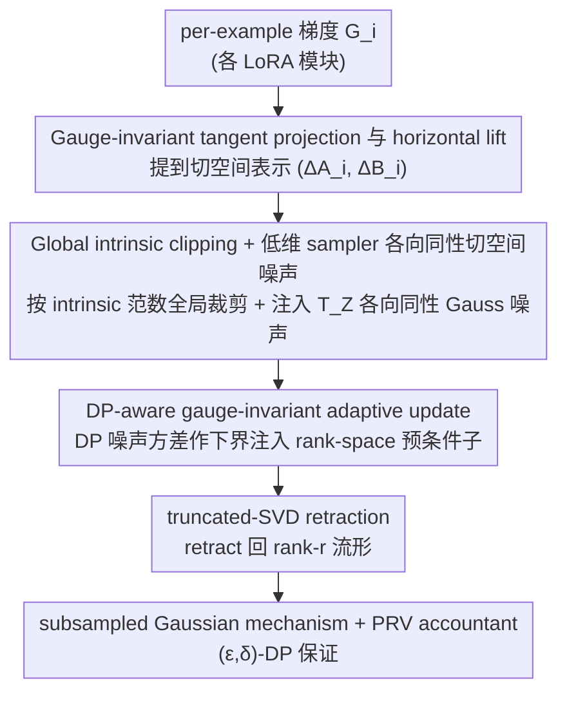

# PRISM: Gauge-Invariant Tangent-Space Differentially Private LoRA

**会议**: ICML2026 Oral  
**arXiv**: [2606.00944](https://arxiv.org/abs/2606.00944)  
**代码**: https://github.com/osu-srml/PRISM-DP-LoRA  
**领域**: AI 安全 / 差分隐私 / LoRA 微调  
**关键词**: 差分隐私, LoRA, gauge invariance, tangent space, DP-SGD

## 一句话总结
PRISM 把 DP-SGD 从 LoRA 的 $(A,B)$ 因子空间搬到 rank-$r$ 流形的切空间上做 clip+加噪+retract，从而获得 gauge invariant、无 bilinear 二阶噪声、且有闭式 $\sigma C/b\cdot\sqrt{r(m+n-r)}$ 内禀噪声能量的 DP-LoRA 机制。

## 研究背景与动机

**领域现状**：在私有数据上做 PEFT 时，最自然的做法是把 DP-SGD 直接叠到 LoRA 的低秩因子 $(A,B)$ 上（Yu et al. 2022; Liu et al. 2025; Xu et al. 2025），每步对 $g_A,g_B$ 拼接后做 per-example clip + Gaussian 注噪。

**现有痛点**：作者指出三个相互纠缠的问题。Issue I：LoRA 分解本身是 non-identifiable，对任意 $R\in\mathrm{GL}(r)$，$(A,B)$ 与 $(AR,BR^{-\top})$ 表示同一个 $Z=AB^\top$，但因子梯度按 $g_A R^{-\top}, g_B R$ 变换，clipping 范数因此随 gauge 漂移；简单的标量重参 $(A,B)\mapsto(cA,c^{-1}B)$ 就能让 $\|g_A\|_F^2+\|g_B\|_F^2$ 在 $c$ 上任意伸缩。Issue II：两侧都加噪后内禀更新出现 $\eta^2\xi_A\xi_B^\top$ 二阶项；即便忽略它，一阶 noise 能量为 $\tau^2(m\|B\|_F^2+n\|A\|_F^2)$，依然随 gauge 重参可放大到无界（Cor. 2.3）。Issue III：自适应优化器（Adam/AdamW、LoRA-specific invariant optimizers）会从含噪 moment 估计中"学到噪声"，并在 $r\times r$ 的 $M=A^\top A, N=B^\top B$ 上触发 ill-conditioning，反过来放大 DP 噪声。

**核心矛盾**：DP-SGD 是依赖参数化定义的随机机制，而 LoRA 中真正决定模型行为的是 intrinsic update $Z$；在 gauge-redundant 的因子上做 clip+noise，机制本身的随机分布就不是 $Z$ 的函数。

**本文目标**：设计一个 DP-LoRA 机制，使释放出的 intrinsic 更新满足 (i) 分布层面 gauge invariant；(ii) 在 intrinsic (tangent) 表示下加性、无 bilinear 噪声；(iii) 与 adaptive 优化、低秩数值流程兼容稳定。

**切入角度**：把 $Z\in\mathcal{M}_r$ 视为固定秩流形上的点，在其切空间 $T_Z\mathcal{M}_r$ 中直接做 clip 与 Gauss 加噪，再 retract 回流形；切空间的内积只依赖正交投影 $\Pi_A,\Pi_B$，天然 gauge invariant。

**核心 idea**：用 canonical horizontal lift 把每例梯度提到切空间表示 $(\Delta A_i,\Delta B_i)$，对所有 LoRA 模块汇总后做 global intrinsic norm clipping，再以 low-dim sampler 注入投影到 $T_Z\mathcal{M}_r$ 的各向同性 Gauss 噪声，最后通过 truncated-SVD retraction 回到 rank-$r$ 流形。

## 方法详解

### 整体框架
PRISM 要解决的核心毛病是：DP-SGD 是按参数化坐标定义的随机机制，可 LoRA 里真正决定模型行为的是 intrinsic 更新 $Z=AB^\top$，在 gauge 冗余的因子 $(A,B)$ 上做 clip+noise，释放出的随机分布根本不是 $Z$ 的函数。PRISM 的转法是把 $Z$ 看成固定秩流形 $\mathcal{M}_r$ 上的一点，把整套「clip→加噪→更新」从因子空间整体搬进它的切空间 $T_Z\mathcal{M}_r$ 里做：每个样本的梯度先提到切空间表示，按 intrinsic 范数全局裁剪，注入只活在切空间里的各向同性 Gauss 噪声，再经一个 DP-aware 的 gauge-invariant 自适应变换调好更新方向，最后 retract 回流形。每个迭代对所有 $L$ 个 LoRA 模块走一遍，整体对应一次 subsampled Gaussian mechanism，由 PRV accountant 组合出 $(\varepsilon,\delta)$-DP。

### 关键设计

**1. Gauge-invariant tangent projection 与 horizontal lift：把机制从因子坐标搬到切空间**

第一个痛点 Issue I 是 LoRA 分解 non-identifiable——对任意 $R\in\mathrm{GL}(r)$，$(A,B)$ 与 $(AR,BR^{-\top})$ 表示同一个 $Z$，但因子梯度会按 $g_A R^{-\top},g_B R$ 变换，clipping 范数随之漂移，光一个标量重参就能把 $\|g_A\|_F^2+\|g_B\|_F^2$ 任意伸缩。PRISM 用列空间正交投影 $\Pi_{A}=A(A^\top A)^\dagger A^\top$、$\Pi_B$ 定义切空间投影 $\mathcal{P}_{A,B}(G)=\Pi_A G+G\Pi_B-\Pi_A G\Pi_B$，即把 per-example 梯度剔除法向分量 $(I-\Pi_A)G(I-\Pi_B)$ 后投到切空间。关键在于 $\Pi_A,\Pi_B$ 这两个投影在 $(A,B)\mapsto(AR,BR^{-\top})$ 下完全不变，所以「把梯度提升到切空间」这一步本身就消灭了 clipping/noise 的 gauge 漂移。

光有投影还不够，切矩阵要表示回因子空间才能继续算。PRISM 用 canonical horizontal lift $\Delta A_i=g_{A,i}N^\dagger-\tfrac12\Pi_A(g_{A,i}N^\dagger)$ 与对称的 $\Delta B_i$，保证 $\Delta A_i B^\top+A\Delta B_i^\top=\mathcal{P}_{A,B}(G_i)$。其中那个看似多余的 $-\tfrac12\Pi_A(\cdot)$ 修正，是流形商空间里选 horizontal section 的标准技巧，目的是去掉因子空间冗余的水平方向，避免 lift 的非唯一性又把 gauge 信息偷偷带回机制。

**2. Global intrinsic clipping + 低维 sampler 的各向同性切空间噪声：去掉 bilinear 项与无界放大**

第二个痛点 Issue II 是两侧都加噪后内禀更新会冒出 $\eta^2\xi_A\xi_B^\top$ 这个二阶项，即便忽略它，一阶噪声能量 $\tau^2(m\|B\|_F^2+n\|A\|_F^2)$ 仍随 gauge 重参放大到无界（Cor. 2.3）。PRISM 在 intrinsic 度量下统一裁剪：单样本灵敏度用 $\|\Delta Z_{i,\ell}\|_F^2=\operatorname{tr}(\Delta A_{i,\ell}^\top\Delta A_{i,\ell}N_\ell)+\operatorname{tr}(\Delta B_{i,\ell}^\top\Delta B_{i,\ell}M_\ell)+2\operatorname{tr}((A_\ell^\top\Delta A_{i,\ell})(B_\ell^\top\Delta B_{i,\ell}))$ 度量，聚合成全局范数 $s_i=(\sum_\ell\|\Delta Z_{i,\ell}\|_F^2)^{1/2}$，所有模块共用一个裁剪系数 $\alpha_i=\min\{1,C/s_i\}$。

加噪这步本可以直接抽一个 $m\times n$ 的全 Gauss 再投影，但那样开销就不再是 LoRA 量级。PRISM 用低维 sampler $\Xi_A=(I-\Pi_A)\Omega_A N^{-1/2}$、$\Xi_B=\Omega_B M^{-1/2}$（$\Omega_A,\Omega_B$ 取 $\mathcal{N}(0,I)$，尺寸只有 $m\times r$ 和 $n\times r$）合成出与 $\mathcal{P}_{A,B}(\Xi)$ 同分布的噪声，Thm 3.1 证明它投影后正是切空间上的各向同性 Gauss，且能量有闭式 $\mathbb{E}\|\mathcal{P}_{A,B}(\Xi)\|_F^2=r(m+n-r)$。这条让 effective intrinsic noise $\mathcal{E}_Z^{\text{PRISM}}=\sigma C/b\cdot\sqrt{r(m+n-r)}$ 只依赖 $(\sigma,C,b)$ 和层维度、与 $\|A\|_F,\|B\|_F$ 彻底解耦——Cor. 2.3 那种无界放大就不再可能；而 retraction $\mathrm{Retr}_r$ 由 Prop. 3.2 保证只带来 $O(\eta^2)$ 的确定性失真，根本不存在 $\eta^2\xi_A\xi_B^\top$ 这种随机二阶项。

**3. DP-aware gauge-invariant adaptive update：防止自适应优化器「学到噪声」**

第三个痛点 Issue III 出在自适应优化器：Adam/AdamW 会从含噪 moment 估计里把噪声方差当成真信号去归一化，作者在 §2 论证 $\theta^+=\theta-\eta\mathsf{P}^{-1/2}\hat g$ 一旦 $\mathsf{P}$ 含噪，update 噪声协方差会被「白化」成 $\eta^2 I$，真信号被冲掉；同时 LoRA 的 $r\times r$ Gram 矩阵 $M=A^\top A,N=B^\top B$ 在 DP 噪声 + gauge drift 下极易接近奇异，$\|M^{\dagger/2}\|_2=1/\sqrt{\lambda_{\min}^+(M)}$ 随之爆炸。PRISM 在 update 进 retraction 前，把 DP 噪声方差当下界注入 rank-space 预条件子（Algorithm 1 第 13 行 + 式 (24)–(26) 的 invariant adaptive transform），得到 gauge-invariant 的方向 $(U_{A,\ell},U_{B,\ell})$。当真梯度被噪声淹没、预条件子退化到 $\mathsf{P}\approx\Sigma_\xi$ 的病态情形时，这个 floor 同时挡住了「白化」和「奇异爆炸」两个病。

### 损失函数 / 训练策略
目标函数仍是标准 LoRA 微调下的经验风险 $F(A,B)=\tfrac{1}{N}\sum_i\ell_i(W_0+AB^\top)$。隐私机制按 Poisson subsampling（采样率 $q=b/N$）+ per-iteration subsampled Gaussian + PRV accountant 组合给出 $(\varepsilon,\delta)$-DP（Thm 3.4）。Thm 3.3 表明每步增量 $\widehat{\Delta Z}_\ell$ 关于 gauge $R\in\mathrm{GL}(r)$ 同分布，retraction 是确定性 post-processing，因此整条轨迹也是 gauge 不变的。

## 实验关键数据

### 主实验
GLUE 8 任务 + Math-10K 4 任务（GSM8K / AQuA / MAWPS / SVAMP）共 12 个任务，$\delta=10^{-5}$，比较 FFA、Rite、AdamW、LoRA+、Lamb 与 PRISM 在 Non-DP / $\varepsilon=6$ / $\varepsilon=3$ 三档下的均值精度。

| 设置 | 方法 | Avg(12) | GSM8K | SVAMP | QQP |
|------|------|---------|-------|-------|-----|
| Non-DP | LoRA+ | 0.769 | 0.592 | 0.712 | 0.807 |
| Non-DP | PRISM | 0.737 | 0.552 | 0.693 | 0.797 |
| $\varepsilon=6$ | LoRA+ | 0.674 | 0.446 | 0.611 | 0.739 |
| $\varepsilon=6$ | **PRISM** | **0.690** | **0.469** | **0.626** | **0.770** |
| $\varepsilon=3$ | AdamW | 0.634 | 0.446 | 0.591 | 0.555 |
| $\varepsilon=3$ | **PRISM** | 最佳 Avg | 显著提升 | 显著提升 | 显著提升 |

### 消融 / 分析（理论闭式能量）
对比表 1 中三种 DP-LoRA 设计在 effective intrinsic noise $\mathcal{E}_Z$ 上的尺度。

| 方法 | 可训参数 | $\mathcal{E}_Z$ | (a) gauge-inv | (b) 无 bilinear | (c) LoRA-scale |
|------|---------|-----------------|---------------|-----------------|----------------|
| DP-LoRA (双侧) | $(m+n)r$ | **unbounded** | ✗ | ✗ | ✓ |
| One-side (冻 A) | $nr$ | $(\sigma C/b)\sqrt{n}\|A\|_F$ | ✗ | ✓ | ✓ |
| **PRISM** | $(m+n)r$ | $(\sigma C/b)\sqrt{r(m+n-r)}$ | **✓** | **✓** | **✓** |

### 关键发现
- DP 越紧（$\varepsilon$ 越小），PRISM 优势越显著：在 $\varepsilon\le 6$ 档普遍拿到最佳 Avg，且在多步推理任务（GSM8K/MAWPS/SVAMP）上对 baseline 拉开最大差距，说明 gauge-invariant intrinsic 噪声对"信号小于噪声"的私有场景特别关键。
- Non-DP 时 PRISM 并非最强（LoRA+ 0.769 vs PRISM 0.737），合理：tangent 投影 + retraction 在无噪场景反而引入了不必要的几何约束；说明 PRISM 的收益严格来自 DP 几何对齐而非更强的优化器。
- One-side（冻 $A$）能消掉 bilinear 项，却治不了 gauge-依赖：表 1 中 $\mathcal{E}_Z\propto\|A\|_F$，依然能被重参任意放缩；只有把 DP 机制搬进切空间才能彻底闭合。
- 低维 sampler 把 $m\times n$ 全 Gauss 替换为 $m\times r$ + $n\times r$ 的两块 $\Omega$，计算/显存保持 $O((m+n)r^2)$，与原 LoRA 同量级。

## 亮点与洞察
- **把 DP 机制从"参数"搬到"流形"**：DP-SGD 长期被默认绑在参数化坐标上，PRISM 指出真正应保护的是 intrinsic 对象 $Z$，把 clip/noise 全部搬进 $T_Z\mathcal{M}_r$。这是把 manifold optimization 思想用在 DP 上的清晰范例，思路可迁移到任何带 gauge 冗余的参数化（如 NTK reparam、tensor factorization、Stiefel/Grassmann 上的微调）。
- **闭式 effective intrinsic noise $\sqrt{r(m+n-r)}$**：罕见的"机制本身的噪声 scaling 可解析"，可直接用于设计 LoRA 秩 $r$ 时的隐私-效用平衡，等价于给出了 rank 维度上的 DP 代价计算公式。
- **horizontal lift 的 $-\tfrac12\Pi_A(\cdot)$ 这个小修正**：背后是流形商空间中选 horizontal section 的标准技巧，但用在 DP 上确保了 lift 与机制同时 gauge invariant，是从 differential geometry 工具箱里借出来的关键技巧。

## 局限与展望
- **Non-DP baseline 下牺牲了精度**：PRISM 在无噪场景下 Avg 落后 LoRA+ 约 3 个点，说明 retraction + tangent projection 在不需要 DP 的场合是负担；论文未给出"自动退化为标准 LoRA"的开关。
- **Theorem 3.1 的闭式只针对全列秩 $A,B$ 情形**：训练初期或秩塌陷时 $M=A^\top A$ 可能奇异，文中只用 $\dagger$ 与 DP-aware floor 兜底，鲁棒性还需更多实证。
- **仅在分类 + 算术推理任务上验证**：未在生成式长序列、多模态、RLHF 等 LoRA 主流应用上检验；且模型规模信息在主文较少，工业级 7B/70B 上的 wall-clock 与显存开销尚不明朗。
- **Algorithm 1 的 retraction 用 truncated SVD**：每次更新都有 $O((m+n)r^2)$ 的 SVD 代价，模块数 $L$ 大时常数因子不可忽视；若能用 polar-style 或 QR-based retraction 进一步降常数会更实用。

## 相关工作与启发
- **vs 朴素 DP-LoRA / DP-Adam-LoRA (Yu et al. 2022; Liu et al. 2025; Xu et al. 2025)**：他们把 DP-SGD 直接套到 $(A,B)$ 上，PRISM 形式化指出这违反 gauge 对称、并引入 bilinear 与 unbounded 一阶噪声；本文同等隐私预算下精度全面胜出。
- **vs One-side DP-LoRA (Sun et al. 2024, 冻一侧)**：One-side 砍掉了 bilinear 项，但仍随被冻因子的范数漂移；PRISM 通过切空间投影同时满足三条 desiderata。
- **vs 不变 LoRA 优化器 Rite (Yen et al. 2025)**：Rite 是确定性 invariant optimizer，解决的是优化轨迹的 gauge 不变；PRISM 强调随机机制（clip+noise）本身需要 gauge invariant，二者正交，PRISM 的 DP-aware adaptive transform 与 Rite 思想互补。
- **vs DP-aware Adam 变体 (Li et al. 2022/2023; Tang et al. 2024)**：那一脉关注 moment 估计在 DP 下的偏差校正，PRISM 把同一类问题放在低秩 $r\times r$ Gram 矩阵上处理，更切合 LoRA 数值结构。

## 评分
- 新颖性: ⭐⭐⭐⭐⭐ 首次把 fixed-rank manifold 的 tangent-space DP 机制完整落到 LoRA 上，并给出闭式 intrinsic noise 与三条 desiderata 的形式化
- 实验充分度: ⭐⭐⭐⭐ 12 个任务 × 3 个隐私档覆盖较广，但缺少大模型 / 生成式任务，且 Non-DP 退化未被解释
- 写作质量: ⭐⭐⭐⭐⭐ Issue I/II/III 三段式问题陈述清晰，定理-推论-命题闭环严谨，表 1 一图说尽设计目标
- 价值: ⭐⭐⭐⭐⭐ 给 DP-PEFT 提供了正确的几何起点，闭式 $\sqrt{r(m+n-r)}$ 直接可用于隐私-效用预算分配，未来 LoRA-style DP 工作的 baseline

<!-- RELATED:START -->

## 相关论文

- [\[NeurIPS 2025\] Mitigating Disparate Impact of Differentially Private Learning through Bounded Adaptive Clipping](../../NeurIPS2025/ai_safety/mitigating_disparate_impact_of_differentially_private_learning_through_bounded_a.md)
- [\[AAAI 2026\] An Improved Privacy and Utility Analysis of Differentially Private SGD with Bounded Domain and Smooth Losses](../../AAAI2026/ai_safety/an_improved_privacy_and_utility_analysis_of_differentially_p.md)
- [\[NeurIPS 2025\] Differentially Private High-dimensional Variable Selection via Integer Programming](../../NeurIPS2025/ai_safety/differentially_private_high-dimensional_variable_selection_via_integer_programmi.md)
- [\[ICML 2025\] Improving the Variance of Differentially Private Randomized Experiments through Clustering](../../ICML2025/ai_safety/improving_the_variance_of_differentially_private_randomized_experiments_through_.md)
- [\[NeurIPS 2025\] Differentially Private Bilevel Optimization: Efficient Algorithms with Near-Optimal Rates](../../NeurIPS2025/ai_safety/differentially_private_bilevel_optimization_efficient_algorithms_with_near-optim.md)

<!-- RELATED:END -->
