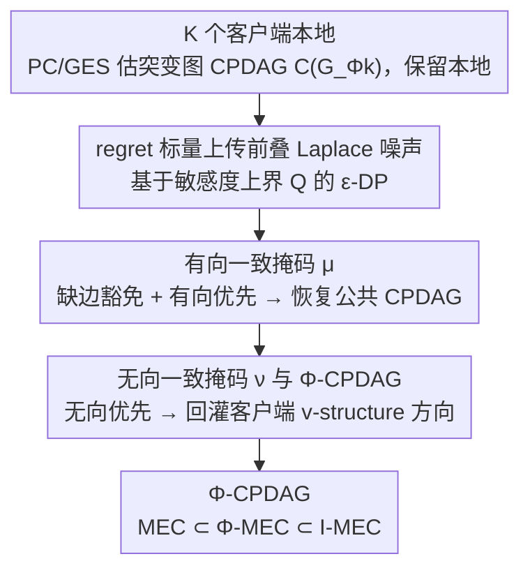

# Regret-Based Federated Causal Discovery with Unknown Interventions

**会议**: ICML 2026  
**arXiv**: [2512.23626](https://arxiv.org/abs/2512.23626)  
**代码**: https://github.com/CIPHOD/pyCIPHOD (有)  
**领域**: 因果推断 / 联邦学习 / 差分隐私  
**关键词**: 因果发现, 联邦学习, 未知干预, Φ-Markov 等价类, Regret, 差分隐私

## 一句话总结
本文提出 I-PERI：在客户端干预目标完全未知、且只能共享 regret 标量的联邦设置下，用"有向一致掩码 + 无向一致掩码"两阶段流程，恢复出一个比观测 MEC 更紧、比 I-MEC 更松的全新等价类 Φ-MEC，并通过 Laplace 噪声给出 ε-差分隐私保证。

## 研究背景与动机

**领域现状**：因果发现 (causal discovery) 的主流目标是从数据中恢复一个 CPDAG，作为底层因果 DAG 所在 Markov 等价类 (MEC) 的代表。当数据天然分布在多家医院/机构、不能集中时，**联邦因果发现 (FCD)** 把这一任务搬到"中心服务器 + 多客户端"架构上，PERI、FedDAG、FedCDH、NOTEARS-ADMM 等是代表方法。

**现有痛点**：几乎所有 FCD 方法都假设**所有客户端共享同一个因果模型、不存在干预**。但在真实场景里，不同医院的治疗方案、诊断标准、入组政策本身就构成客户端级的**结构性干预 (structural intervention)**——它们会移除掉因果图里某些入边，让客户端 CPDAG 之间出现真实的结构差异。把这种异质性当作噪声处理 ⇒ PERI 这类基于 regret 的方法**根本不收敛到真 CPDAG**。

**核心矛盾**：(1) 已有"带干预的因果发现"（如 Hauser & Bühlmann、Yang 等的 ℐ-MEC）都假定**干预目标已知**，而联邦场景下泄露干预目标本身就违反隐私；(2) 已有"未知干预 + 多环境"的工作（Jaber et al.、Squires et al.）则假定可以把数据集中起来直接对比 ⇒ 联邦场景下做不到。**未知干预 + 严格联邦 + 差分隐私三者并存的设置下，能识别的最紧等价类是什么？还没人回答过。**

**本文目标**：(i) 形式化"客户端级未知一般干预 + 联邦 + DP"这一设置下可识别的等价类；(ii) 给出一个只交换 regret 标量、不泄露客户端图的算法；(iii) 证明收敛性与差分隐私。

**切入角度**：作者观察到——干预虽然会**去掉边**让客户端图变稀疏，但当干预作用在一个 *shielded collider* 的父节点时，会**新生出 v-structure**。这意味着客户端的局部 CPDAG 反而暴露了一些观测数据无法定向的边方向。把"缺边带来的损失"和"新增定向带来的信息"分开对待，就能既不被干预误导、又能利用干预提供的方向信息。

**核心 idea**：把 PERI 的单一 regret 拆成两阶段——第一阶段用**有向一致掩码** (directed-consensus masking) 只惩罚"客户端有、server 无"的边，恢复公共 CPDAG；第二阶段用**无向一致掩码** (undirected-consensus masking) 把客户端因干预获得的方向信息回灌到 server CPDAG 上，最终收敛到一个新等价类 Φ-CPDAG。

## 方法详解

### 整体框架

I-PERI 要解决的问题是：$K$ 个客户端各持数据集 $\mathbb{D}^k$ 和一个**未知**的干预目标 $\Phi^k \subseteq \mathbb{V}$（仅假设至少一个客户端是纯观测的，即 $\exists k:\Phi^k=\emptyset$），既不能把数据汇总、也不能上传本地图，只能交换一个 regret 标量，却要在 server 端恢复尽可能紧的因果结构并附带差分隐私保证。作者的办法是把原版 PERI 的单一 regret 拆成两遍 GES 搜索：第一遍只惩罚"客户端有、server 缺"的边，把干预带来的稀疏化豁免掉，从而稳稳恢复出公共 CPDAG；第二遍反过来，让客户端因干预新生出的方向反向回灌进 server 的未定向边，把结构进一步精化到一个新等价类 Φ-CPDAG。客户端本地始终只用 PC/GES 估自己的突变图 (mutilated DAG) CPDAG $\mathcal{C}(G_{\Phi^k})$ 并保留在本地，每个 regret 上传前再叠一层 Laplace 噪声完成 $\epsilon$-DP。

### 关键设计

**1. 有向一致掩码：把干预造成的"缺边"从错误改判为豁免**

原版 PERI 的 regret 是 $L(H,\mathbb{D}^k)-L(\mathcal{C}(G),\mathbb{D}^k)$，它默认所有客户端共享同一张 $\mathcal{C}(G)$。可一旦存在干预，客户端的突变图 $\mathcal{C}(G_{\Phi^k})\ne\mathcal{C}(G)$，于是 regret 永远不归零、搜索根本不收敛——这正是第一阶段要拆掉的痛点。作者的做法是先用一个掩码算子 $\mu$ 把 server 候选图 $H$ 和客户端 CPDAG $\mathcal{C}(G_{\Phi^k})$ 合成一张新图，再在这张图上算 regret：$R_k(H)=L(\mu(H,\mathcal{C}(G_{\Phi^k})),\mathbb{D}^k)-L(\mathcal{C}(G_{\Phi^k}),\mathbb{D}^k)$。

$\mu$ 的规则有三条：两图都有的边保留；任一方没有的边在掩码里**也删掉**；一方有向另一方无向时按**有向**写入（"有向优先"）。这三条合起来恰好实现了"对干预区别对待"——客户端因干预缺的边不会再被计入 server 的损失（避免错误惩罚 PERI 处理不了的稀疏化），而"客户端有、server 没"的边仍会被惩罚（保证收敛到包含全部公共结构的 CPDAG）。这一改把"缺边"的语义从"判错"变成"免责"，使 Theorem 3.1 给出 $\hat{G}\to\mathcal{C}(G)$ 的渐近收敛保证（$n^k\to\infty$）。

**2. 无向一致掩码与 Φ-CPDAG：把干预当信息源反向利用**

第一阶段只能恢复到观测 CPDAG，干预其实还提供了额外的方向信息没被用上。关键观察是：干预虽然会去掉入边让图变稀疏，但当它作用在一个 shielded collider 的父节点上时，会**新生出 v-structure**，于是客户端的局部 CPDAG 反而暴露了观测数据无法定向的边。第二阶段就专门回收这部分信息——在第一阶段的 CPDAG 上再跑一遍 regret 搜索，只把掩码算子从 $\mu$ 换成 $\nu$，公式形式不变。

$\nu$ 相比 $\mu$ 只改一条规则：一方有向另一方无向时改按**无向**写入（"无向优先"，与第一阶段正好相反），缺边豁免则照旧沿用。直觉上，server 把"客户端因干预衍生出的新 v-structure 方向"视为权威，强制把自身对应的无向边定到那个方向。由此定义出的等价类 **Φ-MEC**，等价条件比普通 MEC 多一条：两图必须在 $\Phi$ 内某个干预下产生相同的新 v-structure（Theorem 3.2）。它不要求知道干预目标，却利用了干预引发的方向信息，因此恰好夹在"观测 MEC"和"干预目标已知的 ℐ-MEC"之间，是"联邦 + 未知干预 + 差分隐私"三约束下可识别的最紧等价类（Theorem 3.3 保证 I-PERI 渐近收敛到 Φ-CPDAG）。

**3. 基于 regret 敏感度上界的 ε-差分隐私机制**

FCD 文献长期只共享本地图或模型参数，这远超差分隐私可接受的泄露范围；I-PERI 既然只交换 regret 标量，就能用最简单的加噪方式补上 DP。Lemma 3.1 先界定 regret 的敏感度：当评分函数 $L$ 关于参数 $\theta$ 偏可微、$\|\theta\|\le M$、$P_k(x;\theta)\ge r$ 时，两个相差一条记录的数据集所诱导的 regret 之差有界 $\max_k|\hat{R}_k(G)-\hat{R}'_k(G)|\le(2M+1)\log r^2+\mathcal{O}(\log n/n)$。把该界记为 $Q$，每个客户端上传前叠加尺度 $\lambda=Q/\epsilon$ 的 i.i.d. Laplace 噪声，由 Laplace 机制即得 $\epsilon$-DP（Proposition 3.1）。而且即便对手拿到所有 regret 和最终 server 图，要反推出客户端图本身也是 NP-hard（Chickering et al. 2004），等于在不依赖加密的前提下提供了"信息论级"的隐私。

### 损失函数 / 训练策略

评分函数 $L$ 取 BIC（满足"一致且可分解"，保证 GES 风格的加边/减边搜索能收敛）。第一阶段在全 CPDAG 空间上优化 $\hat{G}=\arg\min_{H\in\mathcal{C}(\mathbb{G})}\max_k R_k^{\mu}(H)$；第二阶段把搜索空间收窄为"对第一阶段 CPDAG 的无向边赋方向得到的偏定向图"，目标改为 $\arg\min\max_k R_k^{\nu}$。两阶段都依赖假设 2.1——至少一个客户端持纯观测数据（$\Phi^k=\emptyset$）来锚定公共 DAG，而这条假设本身比"知道干预目标"弱得多。

## 实验关键数据

### 主实验

线性合成数据，DAG 由 Erdős-Rényi 模型生成（期望边数 = 节点数 $p$），客户端数据由线性 SEM + 加性高斯噪声 $V_i = \sum_{V_j \in Pa^G_i} w_{ji} V_j + N_i$ 生成；每个客户端含**单个结构干预**（除 1 个观测客户端外），干预人为偏向"在 shielded collider 上引发新 v-structure"。指标：SHD（越低越好）、F1（越高越好）。10 个随机种子平均。

| 节点数 $p$ | 指标 | I-PERI | PERI | NOTEARS-ADMM | FedDAG | FedCDH |
|------|------|------|------|------|------|------|
| 3 | SHD | **1.53 ± 1.16** | 3.16 | 1.64 | 3.01 | 2.27 |
| 4 | SHD | **2.87 ± 1.88** | 4.43 | 2.99 | 3.46 | 4.83 |
| 8 | SHD | **4.44 ± 3.04** | 8.40 | 8.44 | 6.68 | 14.86 |
| 10 | SHD | 9.85 | 11.75 | 13.70 | **9.04** | 25.97 |
| 20 | SHD | **27.8 ± 4.79** | 30.0 | 29.45 | 30.74 | 61.74 |
| 8 | F1 | **0.74** | 0.64 | 0.46 | 0.72 | 0.44 |

I-PERI 在 5 个变量规模中 4 次拿到最佳 SHD，唯一例外 $p=10$ 排第二；F1 在小图上优势尤其显著。Figure 7 显示 I-PERI 在 symlog 时间轴上比所有基线**低数个数量级**。

### 消融实验

| 配置 | 关键发现 | 说明 |
|------|---------|------|
| I-PERI 完整两阶段 | SHD 4.44（$p=8$） | 见上表 |
| 去掉第二阶段（≈ 改造版 PERI，仅 $\mu$ 掩码） | SHD 8.40 | 退化为只恢复观测 CPDAG，干预带来的额外方向全部丢失，错误率约 2× |
| 客户端本地用 GES 替代 PC | 趋势一致，I-PERI 仍优于全部基线（Appendix B） | 说明方法对本地发现算法不敏感 |
| 客户端样本数异质（500/1000/2000 随机分配） | I-PERI 仍稳定领先；NOTEARS-ADMM 因要求等样本量被排除 | 联邦异质性下鲁棒 |
| 非线性数据（Appendix B） | I-PERI 仍有效 | 证明方法本身不依赖线性 SEM |

### 关键发现

- **干预可以被"利用"而不是"容忍"**：去掉第二阶段后 SHD 直接翻倍，说明第二阶段贡献的"客户端 v-structure → server 定向"是性能跃迁的关键来源。
- **客户端 CPDAG 质量是上限**：作者特意只在"客户端 CPDAG F1 ≥ 0.85"的随机种子上做实验，因为本地图错一条，server 端就会沿着错的方向定向。
- **计算开销极低**：I-PERI 比 NOTEARS-ADMM / FedDAG 快数个数量级（symlog 时间轴），主要因为没有联合优化全图、只在 GES 搜索步上做局部 regret 通信。
- **DP 是"免费"加上去的**：方法本身只需要交换 regret 标量，加 Laplace 噪声后通信结构不变，没有显式 utility-privacy 折损实验，但理论给出了 $\lambda = Q/\epsilon$ 的明确量化。

## 亮点与洞察

- **Φ-MEC 这个等价类本身是新洞见**：把因果发现的可识别性谱系从"观测 MEC ⊂ ℐ-MEC"扩展为"MEC ⊂ Φ-MEC ⊂ ℐ-MEC"，明确刻画了"未知干预 + 隐私"约束下可达的最紧上界。这是把"工程约束"反过来当作"理论概念"来定义的好例子。
- **两阶段掩码的"双重否定"非常工整**：第一阶段"有向优先 + 缺边豁免"避免错误惩罚，第二阶段"无向优先 + 缺边豁免"强制采纳客户端方向；同一套 regret 框架靠改一条规则就完成"恢复 ↔ 精化"的角色转换，可读性极高。
- **可迁移 trick**：把客户端异质性建模为"干预"而非"噪声"的思路可以迁移到联邦图学习、联邦 RL（policy 差异 ≈ 干预）等任务；只交换标量 regret 的通信协议也适合任何"客户端模型不可见但能给打分"的场景。
- **理论与隐私并重**：在 FCD 文献几乎不谈 DP 的背景下，I-PERI 给出 Lemma 3.1 的 sensitivity 上界 + Proposition 3.1 的 ε-DP 证明，并顺手修正 PERI 原论文的一处小错。

## 局限与展望

- **依赖客户端 CPDAG 的准确性**：作者在实验里手动筛选"本地 F1 ≥ 0.85"的种子，否则误差会逐级放大到 server 端；样本少、客户端噪声大或本地算法不稳定的场景未充分验证。
- **假设 2.1 必须成立**：至少一个客户端是纯观测数据；若所有客户端都被干预，方法的收敛保证失效，且 Φ-MEC 的定义本身也需重新审视。
- **依然假设因果充分性 + faithfulness + 无选择偏倚**：现实医院数据里 latent confounder 与 selection bias 是常态，作者把"扩展到 latent variable 设置"留作未来工作。
- **干预只覆盖"结构干预"为主**：参数干预（仅改条件分布）被证明会让第二阶段退化为不增添方向；如果实际场景以参数干预为主，I-PERI 相对 PERI 没有额外收益。
- **DP-utility trade-off 缺乏实证曲线**：只给出理论尺度 $\lambda = Q/\epsilon$，没扫 $\epsilon$ 看 SHD 变化，工程上不太够用。

## 相关工作与启发

- **vs PERI (Mian et al., 2023)**：PERI 假设所有客户端共享同一个观测 DAG，I-PERI 用两阶段掩码把它推广到"未知客户端干预"，并修复了 PERI 原 sensitivity 证明中的一处错误；同时第二阶段是 PERI 完全没有的、利用干预的全新机制。
- **vs Hauser & Bühlmann (2012) / Yang et al. (2018) 的 ℐ-MEC**：他们要求知道每个干预的目标节点，得到的 ℐ-CPDAG 比 Φ-CPDAG 更紧；但联邦设定下泄露目标 = 泄露客户端隐私，I-PERI 牺牲一点识别能力换隐私可行性。
- **vs Jaber et al. (2020) / Li et al. (2023) 的多环境未知干预**：他们假设数据可以集中或客户端之间能任意比较干预正则；I-PERI 在更严格的"只允许标量 regret 通信"约束下完成同类任务。
- **vs FedDAG / NOTEARS-ADMM / FedCDH**：这些方法做联邦版的连续优化或分布式约束检验，假设客户端图同构、且基本不谈 DP；I-PERI 显式给 ε-DP 证明 + 直接处理干预异质性 + 计算速度数量级领先。
- **可迁移到的工作**：Time-series FCD（不同医院记录策略可视为干预）、Federated RL（不同 agent 策略差异 ≈ 干预）、跨机构遗传学数据（自然的 site-specific intervention）。

## 评分
- 新颖性: ⭐⭐⭐⭐⭐ Φ-MEC 是"未知干预 + 联邦 + 差分隐私"三约束下原创定义的新等价类，并配上闭式收敛证明，理论贡献清晰。
- 实验充分度: ⭐⭐⭐⭐ 多变量数、多客户端数、同/异质样本量、PC/GES 双本地算法、线性/非线性数据都覆盖了；但缺 ε-utility 扫描和真实医疗数据评估。
- 写作质量: ⭐⭐⭐⭐ 定义、定理与图示（masking 示意 + Φ-CPDAG 示例）配合得很紧凑，可读性高；公式记号略密、初读需对照 PERI 原文。
- 价值: ⭐⭐⭐⭐ 给联邦因果发现领域提供一个"既能用干预异质性、又不泄露干预目标、还自带 DP 证明"的可直接落地基线，对跨医院多中心研究有现实意义。

<!-- RELATED:START -->

## 相关论文

- [\[ICML 2026\] Angel or Demon: Investigating the Plasticity Interventions' Impact on Backdoor Threats in Deep Reinforcement Learning](angel_or_demon_investigating_the_plasticity_interventions_impact_on_backdoor_thr.md)
- [\[ICML 2026\] FedHPro: Federated Hyper-Prototype Learning via Gradient Matching](fedhpro_federated_hyper-prototype_learning_via_gradient_matching.md)
- [\[ICCV 2025\] FakeRadar: Probing Forgery Outliers to Detect Unknown Deepfake Videos](../../ICCV2025/ai_safety/fakeradar_probing_forgery_outliers_to_detect_unknown_deepfake_videos.md)
- [\[ICCV 2025\] Membership Inference Attacks with False Discovery Rate Control](../../ICCV2025/ai_safety/membership_inference_attacks_with_false_discovery_rate_control.md)
- [\[ICML 2025\] Avoiding Leakage Poisoning: Concept Interventions Under Distribution Shifts](../../ICML2025/ai_safety/avoiding_leakage_poisoning_concept_interventions_under_distribution_shifts.md)

<!-- RELATED:END -->
