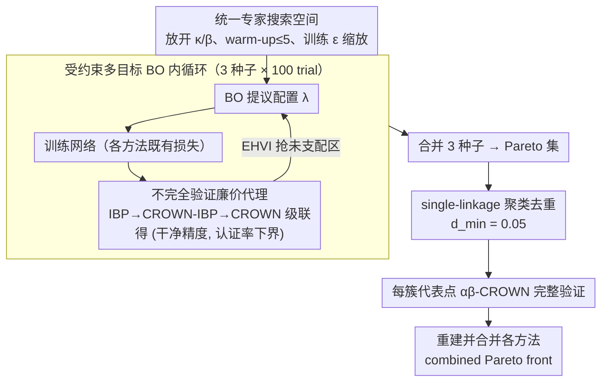

# Rethinking Evaluation Paradigms in IBP-based Certified Training

**会议**: ICML 2026  
**arXiv**: [2606.02134](https://arxiv.org/abs/2606.02134)  
**代码**: https://github.com/ada-research/CTRAIN  
**领域**: AI 安全 / 认证鲁棒训练 / 多目标超参优化  
**关键词**: 区间界传播, 认证训练, Pareto 前沿, 多目标贝叶斯优化, 鲁棒-精度 trade-off  

## 一句话总结
作者指出 IBP 类认证训练长期以"挑一个偏心配置"的方式相互比较是不公平的，提出用多目标贝叶斯超参搜索画出每种方法的 Pareto 前沿，证明既有 SOTA 普遍欠调优——CROWN-IBP 干净精度可再涨约 $6\%$、Tiny ImageNet 上 MTL-IBP 同时涨 $\sim2\%$ 干净精度和认证精度。

## 研究背景与动机

**领域现状**：在 $\ell_\infty$ 威胁模型下，认证训练 (certified training) 用不完全验证器（IBP / CROWN-IBP / SABR / MTL-IBP）在训练时上界化最坏情况损失，使得网络在事后用完整验证器（如 $\alpha\beta$-CROWN）上能拿到形式化的鲁棒证书。这类方法天然存在一个权衡参数（$\kappa$、$\tau$ 或 $\alpha$）调节"干净精度 vs 认证精度"。

**现有痛点**：从 Gowal 2019 到 De Palma 2024b，几乎所有论文都只在曲线上挑一个偏心点报数；最近的 CTBench (Mao 2025) 虽然做了网格搜索，却仍然把它当单目标问题，倾向于压认证精度。结果是不同论文报的点根本不在一个量级上，"谁是 SOTA"取决于挑的是哪一边。

**核心矛盾**：当目标本身是冲突的，挑一个配置去比就等于"先选立场再选证据"。IBP 类方法的真实能力体现在整条 Pareto 前沿上，但社区一直没有系统地把它画出来；这既无法揭示方法间互补性，也掩盖了大量欠调优空间。

**本文目标**：把认证训练评测从单点比较升级为 Pareto 前沿比较，并提供一套可复用、计算上能负担的多目标超参搜索协议。

**切入角度**：作者用多目标贝叶斯优化 + 期望超体积改进 (EHVI) 直接搜 Pareto 前沿；为了让搜索能在和单点调参相近的预算内跑完，他们把"代价昂贵的完整验证认证率"换成"廉价不完整验证率"作为代理目标，并把验证 timeout 从 $1000\,\text{s}$ 拉到 $100\,\text{s}$，最后再用完整验证把候选点逐一过一遍。

**核心 idea**：用受约束的多目标贝叶斯优化在「干净精度 / 认证精度」二维空间里搜 Pareto 集合，并用聚类去重后只对代表点做昂贵的完整验证——把同一搜索预算同时分给四种方法，得到一份方法-agnostic、可复现的"真 SOTA"地图。

## 方法详解

### 整体框架
评测协议由四块拼成。**第一块**是统一的搜索空间：每种方法（IBP / CROWN-IBP / SABR / MTL-IBP）都在一份"通用 + 方法特定"超参集合上搜索，包括学习率、$\ell_1$ 正则权重、Shi 2021 正则权重、warm-up / ramp-up 轮数、训练用 $\epsilon$ 缩放因子，再加方法专属的 $\kappa_{\text{start}} \ge \kappa_{\text{end}}$、$\beta$、$\tau$、$\alpha$ 以及 PGD 攻击步数与步长。**第二块**是受约束的多目标贝叶斯优化器：每个目标（干净精度、不完全认证精度）用独立的高斯过程建模，采集函数为 EHVI，搜索区域约束在感兴趣区间（如 CIFAR-10 $\epsilon=2/255$ 要求干净 $\ge 60\%$、认证 $\ge 40\%$），单种方法跑 3 个随机种子各 100 trial 合并前沿。**第三块**是廉价代理目标：训练完成后用 IBP→CROWN-IBP→CROWN 的级联不完全验证给出认证精度的欠估计，把昂贵的完整验证留到最后。**第四块**是 Pareto 前沿精修：用 single-linkage 聚类（$d_{\min}=0.05$）合并 Pareto 集中相邻点，每个簇随机抽一个用 $\alpha\beta$-CROWN（cutoff $1000\,\text{s}$）做完整验证，重组成最终前沿；多种方法的前沿再合并成"combined Pareto front"作为评测基准。

### 关键设计

**1. 统一的专家搜索空间：把先前被默认值掩盖的超参全放进来**

过去"老方法看起来不行"很大程度上是欠调优——文献只在自己验证过的少数配置附近调参，尤其把 $\kappa$ / $\beta$ 过渡当成 0、warm-up 顶多用 1 个 epoch。本文反其道而行，构造一个覆盖所有合理取值的搜索空间：放开 $\kappa_{\text{start}} \ge \kappa_{\text{end}}$ 两端、允许最多 5 个 warm-up epoch、允许训练 $\epsilon$ 大于评估 $\epsilon$、把 $\ell_1$ 正则和 Shi 2021 正则都纳入搜索，外加方法专属的 $\beta$ / $\tau$ / $\alpha$ 与 PGD 攻击步数步长。这块是整个"翻案"的根基：后续 fANOVA 重要性分析显示 $\kappa_{\text{start}}$ / $\kappa_{\text{end}}$ 和 warm-up 轮数在所有场景都是 trade-off 的主控变量——正因为把它们放开，CROWN-IBP 这种 2020 年的方法才在干净精度上多涨约 $6\%$。

**2. 多目标贝叶斯优化 + 受约束 EHVI：让两个目标各自长成应有的样子**

IBP 类方法天然带一个权衡参数，干净精度和认证精度是直接冲突的，于是"挑一个点去比"等于"先选立场再选证据"。本文索性不优化任何加权和，而是把目标写成向量 $\mathbf{f}(\boldsymbol{\theta})=(\text{acc}_{\text{clean}},\text{acc}_{\text{cert}})$，用两个独立高斯过程各自拟合，再用期望超体积改进（EHVI）去抢已发现前沿之外的未被支配区域：

$$\mathrm{EHVI}(\boldsymbol{\theta})=\mathbb{E}_{\mathbf{f}}\big[\max(0,\ \mathrm{HV}(P\cup\{\mathbf{f}\})-\mathrm{HV}(P))\big]$$

其中 $P$ 是当前 Pareto 前沿，同时加硬约束把"近似退化成对抗训练"的区域剔除，并对三个随机种子的前沿取并集消除局部陷阱。之所以必须用多目标 BO 而非标量化，是因为 IBP 的超参高度交互——$\kappa$ 和 warm-up 长度耦合、$\tau$ 和 PGD 步长耦合——任何加权求和都会把真前沿弯掉；让两个目标各自由 GP 建模、再由 Pareto 关系裁剪，才能露出真实可达的边界。

**3. 不完全验证作为认证精度的廉价代理：把搜索成本压进可负担区间**

完整验证是 $\mathcal{NP}$-complete，若每条 trial 都跑一遍完整认证，100 trial 的搜索预算根本动不了。本文的关键省钱手段是搜索阶段不算真认证率，而是按 IBP → CROWN-IBP → CROWN 级联调用——只在前一级宣告"未证明"时才上更强的方法——得到一个真完整认证率的可证下界 $\widehat{\text{acc}}_{\text{cert}}\le\text{acc}_{\text{cert}}$，BO 直接在这个下界上优化。这一招成立的前提是单调代理几乎不改变 Pareto 序：既然代理只是真值的一致欠估计，前沿的相对位置基本不变，于是只需对最终落在 Pareto 集上的少量代表点用 $\alpha\beta$-CROWN 完整验证一次即可。验证空闲时还能进一步把 cutoff 从 $1000\,\text{s}$ 降到 $100\,\text{s}$ 而前沿不变——仅 CIFAR-10（$\epsilon=2/255$）MTL-IBP 的总验证耗时就从 1311 小时降到 208 小时。

**4. single-linkage 聚类 + 完整验证精修：把验证预算花在刀刃上**

BO 倾向于在前沿曲线上密集采样，结果会冒出一堆彼此差距 $<0.5\%$ 的"几乎同性能"点，若不去重就把昂贵的完整验证预算全花在装饰性细节上。本文在二维目标空间用欧氏距离做 single-linkage 层次聚类，超参点 $i,j$ 在距离 $\le d_{\min}=0.05$ 时合并（Pareto 集大于 5 个点才启动聚类），每簇随机抽一个配置走完整 $\alpha\beta$-CROWN，再用真实认证精度重建前沿。这样既把验证成本压到与单点调参同量级，又保证最终曲线上每个点都基于完整验证的硬数字——多种方法的前沿合并成"combined Pareto front"后，才成为公平、可复现的评测基准。

### 损失函数 / 训练策略
训练侧不改各方法既有损失，只是把它们放进统一的外层搜索：IBP 的 $\kappa \cdot \mathcal{L} + (1-\kappa) \cdot \mathcal{L}_{\text{ver}}$、CROWN-IBP 额外用 $\beta$ 在 CROWN-IBP 与 IBP 上界间过渡、SABR 用 $\tau \epsilon$ 子区间 + ReLU shrinking、MTL-IBP 用 $\alpha \cdot \mathcal{L}_{\text{ver}} + (1-\alpha) \cdot \mathcal{L}_{\text{adv}}$；这些损失的权衡参数连同搜索空间（关键设计 1）一起交给多目标 BO 优化，而非沿用文献默认值。所有实验用 Shi 2021 的 CNN7 架构，BoTorch + Optuna 跑 EHVI，预算 3 种子 × 100 trial。

## 实验关键数据

### 主实验
在 CIFAR-10 ($\epsilon \in \{2/255, 8/255\}$) 和 Tiny ImageNet ($\epsilon = 1/255$) 上用 CNN7 比较四种方法，并与原始论文及 CTBench 对照。

| 数据集 | $\epsilon$ | 方法 | 干净 vs 既有 SOTA | 认证 vs 既有 SOTA |
|--------|-----------|------|--------------------|--------------------|
| CIFAR-10 | $2/255$ | SABR | $\ge +1\%$ | $\ge +1\%$ |
| CIFAR-10 | $2/255$ | CROWN-IBP | $\sim +6\%$ | 持平 |
| CIFAR-10 | $8/255$ | IBP | 显著抬升 | 与既有持平 |
| Tiny ImageNet | $1/255$ | MTL-IBP | $\sim +2\%$ | $\sim +2\%$ |
| Tiny ImageNet | $1/255$ | SABR | 略高于 MTL-IBP | 略低于 MTL-IBP |

合并 Pareto 前沿后作者发现：CIFAR-10 $2/255$ 上 SABR 与 MTL-IBP 互补、二者共同构成前沿；$8/255$ 上四种方法都贡献了点；Tiny ImageNet 上 SABR 主导"高干净"端、MTL-IBP 主导"高认证"端。这等于把"谁是 SOTA"改写成了"在你关心的 trade-off 区间里谁占优"。

### 消融实验

| 配置 | 关键指标 | 说明 |
|------|---------|------|
| 验证集调参 vs 测试集调参 | 前沿严格被支配 | 现有工作普遍直接在测试集上调，绝对值被高估 |
| 完整验证 cutoff $1000\,\text{s}$ → $100\,\text{s}$ | 前沿不变 | 计算成本可降一个数量级以上 |
| BO trial 数 $100 \to 50$ | 前沿明显退化 | 优化预算比验证 timeout 更敏感 |
| 去掉 $\kappa$ 过渡 (沿用近期工作) | IBP / CROWN-IBP 跌出前沿 | $\kappa_{\text{start}}, \kappa_{\text{end}}$ 在所有场景都是高重要性超参 |

### 关键发现
- fANOVA 重要性分析显示，IBP / CROWN-IBP 的 $\kappa$ 过渡是 trade-off 的主控变量；社区把它当默认 0 是导致"老方法看起来不行"的主因。
- SABR 的子选择比 $\tau$ 和 PGD 攻击参数主导其前沿位置；MTL-IBP 的 $\alpha$ 与训练/攻击 $\epsilon$ 缩放因子共同决定可达区域。
- 在 $8/255$ 这种大扰动半径下，四种方法殊途同归——这说明该区间的真瓶颈不在损失函数设计，而在 IBP 上界的固有松弛。
- "在测试集上调超参"是社区默认习惯，但验证集调参的 Pareto 前沿严格更差，先前文献的绝对数字带有泛化高估。

## 亮点与洞察
- 一个看似"方法论"的换骨手术，定量改写了过去 5 年的 SOTA 表：CROWN-IBP 这种 2020 年的方法只因 $\kappa$ 没调好就被边缘化，"算法进步"被严重高估。
- 用"廉价代理目标 + 聚类去重 + 末段完整验证"三段式把昂贵评估塞进 BO 内循环，是把多目标贝叶斯优化引入认证训练领域的关键工程动作，模板可迁移到任何"训练廉价、评估昂贵"的鲁棒性 / 公平性 benchmark。
- "方法互补性"被首次量化：实践中不该再问"用 SABR 还是 MTL-IBP"，而该问"目标在 trade-off 上的哪个区间"。

## 局限与展望
- 全部实验局限在 $\ell_\infty$ 威胁模型和 CNN7 架构，对 $\ell_2$、$\ell_1$ 或 Transformer 是否一致仍是开放问题。
- 协议本身计算量很大（每会议 3 种子 × 100 trial + 完整验证），即使作者用代理目标和聚类压缩，没有大集群的小组仍跑不动；这把"认证训练能不能公平评测"的门槛推到了少数实验室。
- 作者建议未来工作转向"廉价可验证"的训练目标，而非靠拉长完整验证 timeout 来多刷可证样本数——这其实是对 SABR / MTL-IBP 当前实践的隐性批评，但具体怎么把"易验证"写进损失，文中没给方案。

## 相关工作与启发
- **vs CTBench (Mao 2025)**: CTBench 用 250 次网格搜索做单目标比较，结论倾向于"认证精度高者赢"；本文用 300 次 BO 做多目标比较，揭示同一方法在 CTBench 下被低估的真前沿，且强调"方法互补"。
- **vs De Palma 2024b (MTL-IBP 原文)**: 原文为 MTL-IBP 挑一个偏认证的点报数；本文证明其在干净端同样能拿到先前未报的 $\sim 2\%$ Tiny ImageNet 增益，原文低估了自己。
- **vs Müller 2023 (SABR 原文)**: 原文在 CIFAR-10 $2/255$ 上的最佳点被本文同时在干净和认证上各超 $1\%$；同时表明 SABR 在大 $\epsilon$ 下并非全面最优。

## 评分
- 新颖性: ⭐⭐⭐⭐ 方法层面是把成熟的多目标 BO 套用过来，但"用 Pareto 前沿评测认证训练"是清晰的范式转换。
- 实验充分度: ⭐⭐⭐⭐⭐ 4 方法 × 3 benchmark × 多个 ablation，附带 fANOVA 重要性分析和 cutoff/budget 消融，证据链完整。
- 写作质量: ⭐⭐⭐⭐ 论述清晰，唯独"如何把搜索协议平民化"留得太轻。
- 价值: ⭐⭐⭐⭐⭐ 直接改写了认证训练 leaderboard，并给出可复用的开源工具 CTRAIN，社区影响面大。

<!-- RELATED:START -->

## 相关论文

- [\[AAAI 2026\] An Information Theoretic Evaluation Metric for Strong Unlearning](../../AAAI2026/ai_safety/an_information_theoretic_evaluation_metric_for_strong_unlearning.md)
- [\[CVPR 2026\] Towards Reliable Evaluation of Adversarial Robustness for Spiking Neural Networks](../../CVPR2026/ai_safety/towards_reliable_evaluation_of_adversarial_robustness_for_spiking_neural_network.md)
- [\[ICML 2026\] SORA: Free Second-Order Attacks in Fast Adversarial Training](sora_free_second-order_attacks_in_fast_adversarial_training.md)
- [\[ICML 2026\] Training-Free Coverless Multi-Image Steganography with Access Control](training-free_coverless_multi-image_steganography_with_access_control.md)
- [\[ICML 2026\] TimeGuard: Channel-wise Pool Training for Backdoor Defense in Time Series Forecasting](timeguard_channel-wise_pool_training_for_backdoor_defense_in_time_series_forecas.md)

<!-- RELATED:END -->
