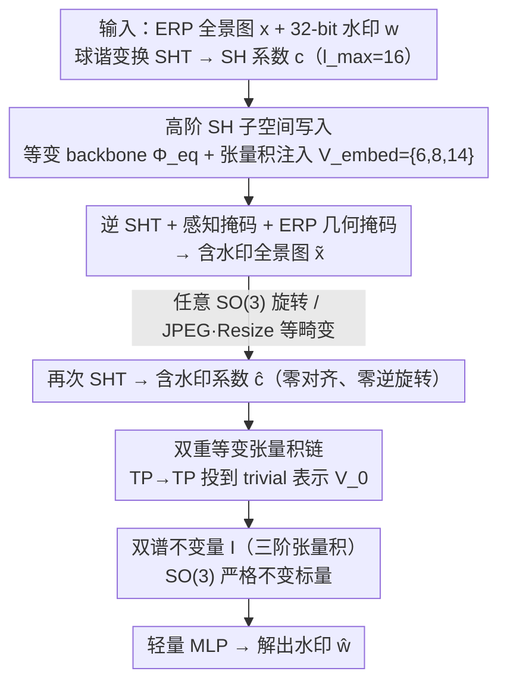

# Rotation-Invariant Spherical Watermarking via Third-Order SO(3) Representation Coupling

**会议**: ICML 2026  
**arXiv**: [2605.26702](https://arxiv.org/abs/2605.26702)  
**代码**: 论文中标注 "Code is available here"，arXiv 页待确认  
**领域**: AI 安全 / 数字水印 / 球面信号处理  
**关键词**: 全景图水印, SO(3) 等变, 球谐函数, 双谱不变量, 张量积耦合

## 一句话总结
TRIAD 把 360° 全景图当作球面信号，用三阶球谐系数张量积投影到 trivial 表示得到一个**理论可证 SO(3) 不变**的双谱标量，从而把水印藏在高阶 SH 系数里、再从这个不变量里读出来，在任意 3D 旋转下仍能保持近 100% 的比特准确率而不依赖数据增强。

## 研究背景与动机

**领域现状**：AIGC 让 360° 全景图（VR / Metaverse / World Model 训练数据）变得触手可及，迫切需要数字水印做版权追踪。现有深度水印方法 (StegaStamp / TrustMark / VINE / Robust-Wide 等) 几乎都建在 CNN 的平移等变假设上，靠数据增强来抵抗几何攻击。

**现有痛点**：全景图本质上是定义在球面 $\mathbb{S}^2$ 上的信号，用户观看时通过 HMD 转动头部就是对它施加一个 SO(3) 旋转。当全景图以等距柱状投影 (ERP) 表示时，球面上的一个 3D 旋转会在 ERP 平面上变成高度非线性、随纬度严重畸变的像素位移（极区拉伸 + 大范围纹理位移），平面 CNN 完全无法对齐。

**核心矛盾**：SO(3) 是连续无穷群，存在无穷多种旋转，任何有限增强样本都覆盖不全；靠"看过即记住"得到的鲁棒性既无理论保证、训练开销又大，遇到训练时未见的旋转角度立刻崩到随机猜测。同时，若想用 SH 系数中天然旋转不变的零阶 $c_0$ (DC 分量) 当载体，又会直接把全局亮度/色温改掉，肉眼立刻可见。

**本文目标**：在球面信号上构造一个**可证 SO(3) 不变**的水印框架——既要把水印藏在高阶（容量大、视觉隐蔽）的 SH 子空间，又要能从一个对旋转**严格不变**的标量里把它读回来。

**切入角度**：从 SO(3) 表示论出发。SH 系数 $c_l$ 在旋转下按 Wigner-D 矩阵分块变换 $c_l' = D^l(R) c_l$，不同 $l$ 不混合；二阶 power spectrum 虽然不变但"相位盲"，丢掉了方向信息；只有**三阶**张量积 $\mathcal{V}_{l_1} \otimes \mathcal{V}_{l_2} \otimes \mathcal{V}_{l_3}$ 投到 trivial 表示 $\mathcal{V}_0$ 时既严格不变又保留相位（即经典 bispectrum）。

**核心 idea**：用"高阶 SH 写入 + 三阶 bispectrum 读出"的非对称结构，把"信息容量"和"旋转不变"在数学上完全解耦——写在 equivariant 高阶子空间，读在 invariant 零阶标量。

## 方法详解

### 整体框架
TRIAD 把全景图水印从平面 CNN 问题搬到球面 SH 域来做：输入一张 $H \times 2H$ 的 ERP 全景图 $x$ 和 32 比特水印 $w \in \{0,1\}^{32}$，编码端先做球谐变换 (SHT) 升到 SH 系数 $c=\{c_l\}_{l=0}^{l_{\max}}$（默认 $l_{\max}=16$），把水印注入选定的高阶 SH 子空间后写回空域得到几乎看不出改动的 $\tilde{x}$；解码端**不做任何对齐或逆旋转**，再次 SHT 后直接从一个对 SO(3) 旋转严格不变的三阶标量里解出 $\hat{w}$。整套设计的核心是一个非对称结构——把信息**写在旋转敏感的高阶 equivariant 子空间**（容量大、视觉隐蔽），把信息**读在旋转不变的 trivial 零阶标量**（任意旋转下数值不变），从而在数学上把"容量"和"旋转不变"彻底解耦。

### 关键设计

**1. 三阶 SH 张量积构造可证不变的双谱标量：解决"高容量信息"与"旋转严格不变"无法兼得的矛盾**

水印藏在高阶 SH 系数里，但这些系数本身在旋转下会按 Wigner-D 矩阵变换 $c_l' = D^l(R)c_l$，必须找到一个把它们重新组合成旋转不变量的方式。最朴素的两个选择都不行：零阶 $c_0$ 天然不变，但它等于全局 DC 分量，改它就肉眼可见地拉偏亮度/色温；二阶 power spectrum 虽不变却是 phase-blind 的多对一映射，丢掉方向信息后容量上限极低。TRIAD 改用**三阶**张量积——对三个 SH 不可约表示做分解 $\mathcal{V}_{l_1} \otimes \mathcal{V}_{l_2} \otimes \mathcal{V}_{l_3} = \bigoplus_l \mathcal{V}_l$，只挑出 $l=0$ 的 trivial 分量，得到双谱标量

$$I = \sum_{l_i, m_i} C^{0,0}_{l_1 m_1\, l_2 m_2\, l_3 m_3}\, c_{l_1}^{m_1} c_{l_2}^{m_2} c_{l_3}^{m_3},$$

其中 $C^{0,0}_{\dots}$ 是由 Wigner 3-j 符号导出的 Clebsch-Gordan 耦合系数。Theorem 4.1（证明见附录 A.1）保证 $I(R\cdot f)=I(f)$ 对任意旋转 $R$ 成立，同时对高阶系数的扰动有非零响应——意味着水印改动确实能从 $I$ 里读回来。三阶耦合因此是**同时**保留相位、保持严格不变、又不动 DC 的最低阶构造，恰好把两个看似冲突的目标在表示论意义上同时满足。

**2. 高阶 SH 子空间写入 + 等变 backbone 注入：解决"载体频段选哪里才既隐蔽又抗攻击"**

写入端只在高阶子空间 $\mathcal{V}_{embed} = \bigoplus_{l \in \mathcal{L}_{embed}} \mathcal{V}_l$（$l>0$，默认 $\mathcal{L}_{embed}=\{6,8,14\}$）上操作。具体做法是先用一个 2 层 Gated Block 的 SO(3)-等变 backbone 提取结构化谱特征 $u = \Phi_{eq}(c)$，再通过参数化等变张量积把 32-bit 水印（当作 $\mathcal{V}_0$ 标量特征）注入这些不可约子空间 $\Delta u = \text{TP}_{\vartheta_1}(u, w)|_{\mathcal{V}_{embed}}$，靠 SH 基的正交性保证只动选定频段、不污染其他谐波；最后逆 SHT 回空域，叠加前再经感知掩码 $M_{perc}$ 和 ERP 几何掩码 $M_{geo}$ 调制：

$$\tilde{x} = x + M_{perc}(x) \odot M_{geo} \odot \Delta x.$$

频段为什么是中频组合 $\{6,8,14\}$？因为低阶 $l$（如 $\mathcal{V}_4$）做载体鲁棒性高但低频伪影刺眼，高阶 $l$（如 $\mathcal{V}_{16}$）隐蔽却易被 JPEG 压缩/抗锯齿衰减衰减掉。中频带是 fidelity-robustness 的甜点——既给三阶耦合足够多样的相位组合，又避开易被攻击削弱的极高频；几何掩码 $M_{geo}$ 还专门抑制 ERP 极区（畸变最严重处）的像素修改幅度。

**3. 解耦的非对称编解码 + 双重等变张量积链：解决解码端"零对齐也能在任意旋转下解码"**

解码端的目标是无需逆旋转、无需角度估计，直接在任意旋转后的全景图上抽出与训练时数值完全一致的不变标量。TRIAD 用两步链式等变张量积来近似那个三阶 bispectrum：先在等变子空间做二阶耦合 $h = \text{TP}_{\vartheta_2}(\hat{u}, \hat{u})|_{\mathcal{V}_{embed}}$，再耦合一次并**强行投到 trivial 表示** $z = \text{TP}_{\vartheta_3}(h, \hat{u})|_{\mathcal{V}_0}$，整体等价于一个参数化的 $\text{TP}(\hat{u},\hat{u},\hat{u})\to\mathcal{V}_0$，其中可学习参数 $\vartheta_2,\vartheta_3$ 自动挑出对水印最敏感的 CG 通道；得到的不变向量再过一个轻量 MLP 解出 $\hat{w}$。关键在于：只要最后一步严格投到 $\mathcal{V}_0$，无论中间网络多复杂，输出对 SO(3) 都数学上严格不变——这就是"零数据增强"也能近完美抗任意旋转的根本原因，把鲁棒性从数据/训练侧彻底搬到了架构/表示侧。

### 损失函数/训练策略
整个编解码端到端联合训练，损失为视觉保真项与水印恢复项的加权和

$$\mathcal{L}_{total} = \lambda_m \mathcal{L}_{MSE}(x, \tilde{x}) + \lambda_{bce} \mathcal{L}_{BCE}(w, \hat{w}),$$

其中 $\lambda_{bce}=10$ 固定，$\lambda_m$ 从 1 线性升到 20——训练初期先让网络学会把水印写进去（重 BCE）、后期再逐步收紧视觉保真约束，避免一开始就压死残差导致解不出水印。

## 实验关键数据

### 主实验：通用畸变与旋转鲁棒性
1 万张 panoContext + SUN360 全景训练、2 千张测试，分辨率 512×1024，水印长度 32 bit，与 6 个 SOTA baseline (StegaStamp / SepMark / TrustMark / EditGuard / Robust-Wide / VINE) 对比：

| 方法 | 容量 (bit) | PSNR ↑ | SSIM ↑ | JPEG | Resize | Gauss Noise | Median | Mixed |
|------|-----------|--------|--------|------|--------|-------------|--------|-------|
| StegaStamp | 100 | 27.96 | 0.8986 | 0.973 | 0.812 | 0.961 | 0.879 | 0.978 |
| TrustMark | 100 | 40.83 | 0.9968 | 0.993 | 1.000 | 0.986 | 0.984 | 0.979 |
| Robust-Wide | 64 | 41.65 | 0.9921 | 0.997 | 0.998 | 0.989 | **1.000** | 0.992 |
| VINE | 100 | 36.33 | 0.9865 | **1.000** | 1.000 | **1.000** | 0.965 | 0.986 |
| **TRIAD (本文)** | 32 | 39.22 | 0.9946 | 0.978 | **1.000** | 0.975 | **1.000** | 0.984 |

旋转鲁棒性（图 3，按测地距离 0°–180° 均匀采轴）：所有 baseline 在不加旋转增强时 bit acc 迅速塌到接近 50% 随机；加大量旋转增强后表现仍随角度强烈震荡，无法均匀覆盖 SO(3)。**TRIAD 在零增强条件下，全角度区间 bit acc 几乎全程贴在 100%**。

### 消融实验

| 配置 | PSNR / Bit Acc | 关键发现 |
|------|---------------|----------|
| $\mathcal{V}_{embed} = \mathcal{V}_4$ (单一低频) | 高 acc / 视觉差 | 低频伪影刺眼，PSNR 显著下降 |
| $\mathcal{V}_{embed} = \mathcal{V}_{16}$ (单一高频) | 高 PSNR / 低 acc | 高频被压缩/抗锯齿衰减，提取退化 |
| $\mathcal{V}_{embed} = \mathcal{V}_6 \oplus \mathcal{V}_8 \oplus \mathcal{V}_{14}$ (本文) | 39.22 / ≈100% | 中频多尺度直和兼顾鲁棒性与隐蔽性 |
| $l_{\max}=16$, $\{6,8,14\}$ | 39.22 / 1.000 | 默认配置，rotation bit acc=100% |
| $l_{\max}=24$, $\{6,8,14,16,20\}$ | 38.46 / 1.000 | 容量扩展，PSNR 略降但旋转不变性保持 |
| $l_{\max}=28$, $\{6,8,14,16,20,22\}$ | 37.19 / 1.000 | 过宽频带反而损 fidelity，确认 $l_{\max}=16$ 为甜点 |
| Power Spec, 2 阶, 16 bit | — / 92.4% | 二阶投影 phase-blind，多对一 |
| Power Spec, 2 阶, 32 bit | — / 61.3% | 容量超 16 bit 即无法收敛 |
| **Bispectrum, 3 阶, 64 bit** | — / **100%** | 三阶相位保留是高容量不变水印的关键 |

### 关键发现
- 三阶 bispectrum 对二阶 power spectrum 的优势是**结构性**的：power spectrum 是 many-to-one 的"相位盲"映射，capacity ≥ 16 bit 就训不动；bispectrum 因为保住相位，64 bit 仍可 100% 恢复。
- 旋转鲁棒性**不是训练训出来的**，而是架构保证的——decoder 最后一步硬性投到 $\mathcal{V}_0$，从数学上排除了"训不到的旋转角度"。
- 对未训过的非旋转畸变（JPEG / Resize / Noise / Blur / Median Filter）的鲁棒性也意外地强，作者从"低通衰减只会按频段平滑缩放、而 bispectral 是多系数乘积"给出代数解释，说明这是表示论结构带来的"白送"鲁棒性。

## 亮点与洞察
- **把鲁棒性从数据侧搬到表示侧**：augmentation 是经验性、有限的；通过"嵌入在 equivariant 子空间、提取在 invariant 子空间"的非对称设计，得到对连续无穷群 SO(3) 的可证不变。这套思路立刻可以迁移到点云水印、3D Gaussian Splatting、网格水印等任何带 SO(3) 对称的几何信号。
- **三阶 > 二阶**的论证非常硬核：power spectrum 长期是几何信号不变描述的默认选择，本文用"phase blindness 导致 capacity 上限低"作为反驳，把 bispectrum 从分子动力学/物理建模圈搬进了"信息隐藏"领域，开了一个新方向。
- **理论可证 + e3nn 工程实现**：方法不是纯理论玩具，整套等变张量积都用 e3nn 实现，CG 系数可调可学，工程上落地非常顺。

## 局限与展望
- **容量受限**：当前为了稳健只用中频带 $\{6,8,14\}$，实际 payload 卡在 64 bit；要扩到几百 bit 必须把更高频段拉进来，而高频本身脆弱，作者承认这是开放挑战。
- **只覆盖全局 SO(3) 不变**：对**局部** crop / 部分球面信号的水印仍不行（一旦切掉部分球面，三阶耦合系数 $I$ 数值就会被破坏），作者展望未来用局部等变子群解决。
- **未对抗 AI 编辑攻击**：实验主要在传统畸变 + 旋转，没有评估扩散模型重绘 / inpainting 等 AIGC 编辑攻击下的存活率；要真正落地 World Model 内容溯源，这块测试不可少。
- 没有公开 wall-clock 训练成本与 SHT 在 $l_{\max}=16$ 时的 GPU 内存占用（512×1024 + e3nn 张量积通常并不便宜），实际部署成本有待评估。

## 相关工作与启发
- **vs. StegaStamp / TrustMark / VINE 等平面 CNN 水印**：它们在 ERP 平面上用 CNN + 数据增强对抗几何变换；TRIAD 直接在球面 SH 域，靠 SO(3) 等变性硬保证旋转不变，零增强即近完美抗旋转。
- **vs. 360° VR 水印 (Liu et al. 2021，球面小波)**：同样意识到要在球面域做，但仍依赖经验同步策略，没有理论旋转不变保证。
- **vs. 3D 数据水印 (GuardSplat 等点云/Gaussian 水印)**：思路上都是利用几何不变性，但 3D 水印多用显著点 / SVD 等启发式，缺乏类似 SO(3) 表示论的统一框架；TRIAD 的 bispectrum 范式可平移过去。
- **vs. 经典 Power Spectrum 球谐描述子 (Kazhdan 2003)**：在 3D 形状检索里被广泛用作旋转不变描述，但用作水印载体会因相位盲撞顶；本文是首次系统论证"水印任务必须用三阶 bispectrum"。
- **启发**：这套"在等变子空间做信息嵌入、在 trivial 子空间做信息提取"的非对称模式，可以迁到 E(3) 等变分子设计（往等变特征里藏标识、从不变能量里读）、点云隐写、graph signal 水印等任意带紧致群对称性的场景。

## 评分
- 新颖性: ⭐⭐⭐⭐⭐ 把表示论的 bispectrum 严肃引入数字水印领域，"高阶嵌入 + trivial 提取"的非对称架构在不变水印里属首例。
- 实验充分度: ⭐⭐⭐⭐ 与 6 个 SOTA 主流方法在全角度旋转、8 类畸变、3 类消融全面对比；缺 AI 编辑攻击与训练成本数据。
- 写作质量: ⭐⭐⭐⭐ 理论与方法叙事清晰，Theorem 4.1 给出严格证明（附录），Method 段用代数语言精准；引言略偏重应用场景宣传。
- 价值: ⭐⭐⭐⭐⭐ 给 SO(3) 对称几何信号的水印问题提供首个"可证不变"框架，对 VR / World Model / 具身 AI 训练数据溯源有直接落地价值，方法论也可外溢到点云 / 3DGS / 分子等等变信号。

<!-- RELATED:START -->

## 相关论文

- [\[ICML 2026\] SORA: Free Second-Order Attacks in Fast Adversarial Training](sora_free_second-order_attacks_in_fast_adversarial_training.md)
- [\[CVPR 2026\] TIACam: Text-Anchored Invariant Feature Learning with Auto-Augmentation for Camera-Robust Zero-Watermarking](../../CVPR2026/ai_safety/tiacam_text-anchored_invariant_feature_learning_with_auto-augmentation_for_camer.md)
- [\[ICML 2026\] PRISM: Gauge-Invariant Tangent-Space Differentially Private LoRA](prism_gauge-invariant_tangent-space_differentially_private_lora.md)
- [\[AAAI 2026\] Robust Watermarking on Gradient Boosting Decision Trees](../../AAAI2026/ai_safety/robust_watermarking_on_gradient_boosting_decision_trees.md)
- [\[ICLR 2026\] Toward Enhancing Representation Learning in Federated Multi-Task Settings](../../ICLR2026/ai_safety/toward_enhancing_representation_learning_in_federated_multi-task_settings.md)

<!-- RELATED:END -->
