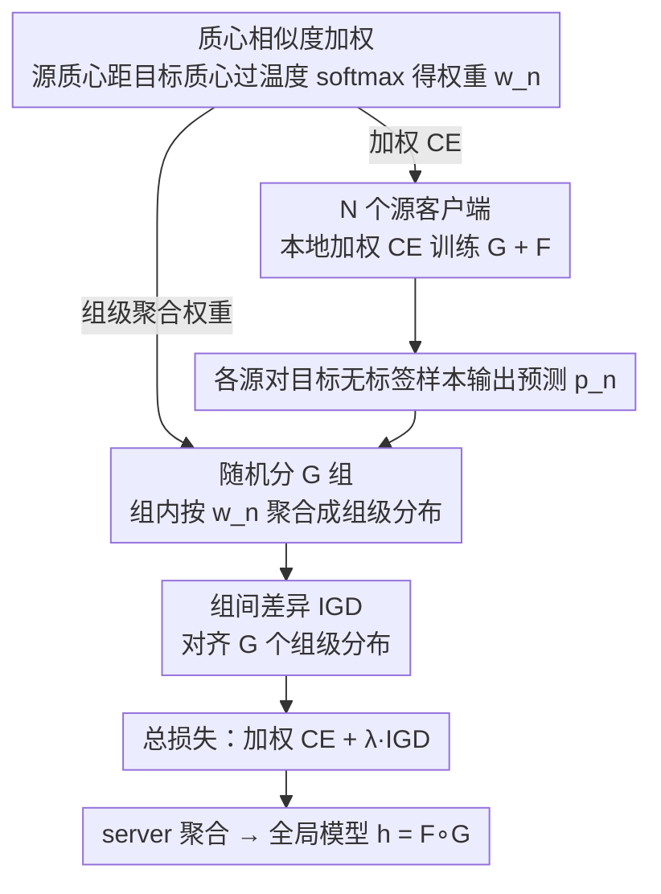

# Scaling Unsupervised Multi-Source Federated Domain Adaptation through Group-Wise Discrepancy Minimization

**会议**: ICML 2026  
**arXiv**: [2510.08150](https://arxiv.org/abs/2510.08150)  
**代码**: 论文未明示（推测 GitHub，需查作者主页）  
**领域**: 联邦学习 / 域适应 / 隐私保护机器学习  
**关键词**: 联邦域适应、多源域、群级差异、负迁移、Digit-18

## 一句话总结
针对现有联邦多源无监督域适应 (UMDA) 方法只能处理 2–6 个源、源数一多就训练不稳或算力爆掉的问题，作者提出 GALA：把所有源随机分成若干小组、组间对预测分布做差异最小化（把 $O(N^2)$ 的两两对齐压成线性），再叠一个基于质心+温度的相似度加权挑出真正贴近目标域的源——在新建的 Digit-18 (18 源) 基准上稳定收敛，且把基线一一推开。

## 研究背景与动机

**领域现状**：无监督多源域适应 (UMDA) 用多个有标签源域 $\{D_S^n\}_{n=1}^N$ 学一个模型迁移到无标签目标域 $D_T$。在隐私敏感场景 (医疗、金融) 下，数据不能集中，于是出现了联邦 / 去中心化 UMDA 方法，例如 FADA (Peng et al. 2020) 用对抗训练、FACT (Schrod et al. 2025) 用域间差异、KD3A (Feng et al. 2021) 用共识对齐。

**现有痛点**：(1) 大多数方法只在 2–6 个源域上验证；(2) FACT 虽可扩展但每步只对单一源对做对齐，源数一多就 **方差暴涨、收敛不稳定**；(3) KD3A 需要在 target 上对每个源做 per-domain 优化和散度计算，**算力随源数指数级增长**，到 10+ 源就基本跑不动；(4) 整个社区 **缺一个真正异构、源数足够多的 benchmark**——大家都靠"把同一数据集拆几份"假装多源，没法反映真实分布差异。

**核心矛盾**：跨源对齐的理想做法是两两计算 $\mathcal{H}\Delta\mathcal{H}$ 散度 $\sum_n w_n \frac{1}{2} d_{\mathcal{H}\Delta\mathcal{H}}(D_S^n, D_T)$，但这是 $O(N^2)$ 的；而退化到"每步一对"又方差太大。需要一个 **既保留全局对齐目标、又能线性扩展、还能动态权重排除负迁移源** 的算法。

**本文目标**：(i) 设计一个线性复杂度但低方差的多源差异最小化目标；(ii) 自动给每个源打权重让 target-near 的源主导训练，target-far 的源不拖后腿；(iii) 提供一个真实异构、源数充足的评测基准。

**切入角度**：作者从"群体而非个体"的角度出发——与其精确逼近所有两两差异，不如随机分组 + 组间预测分布对齐，相当于做一个 minibatch 版本的全局对齐估计；权重则借鉴对比学习的温度 softmax，根据"源中心距离 target 中心"的远近决定。

**核心 idea**：用 **Inter-Group Discrepancy (IGD)** 把 $O(N^2)$ 两两对齐压成 $O(N)$ 组级对齐，再用 **temperature-scaled centroid-based weighting** 动态选源——两个组件合起来叫 GALA (Grouping-based Adaptive Learning)。

## 方法详解

### 整体框架
GALA 要解决的是"源数一多就崩"的联邦 UMDA：$N$ 个源客户端各持有带标签的 $\{D_S^n\} = \{(x_i^n, y_i^n)\}_{i=1}^{K_n}$，target 客户端持有无标签的 $D_T = \{x_i^T\}_{i=1}^{K_T}$，每个源在本地训练特征提取器 $G$ + 分类器 $F$，server 聚合成全局 $h = F \circ G$。它的做法是把两件难事都搬到 target 端去做：一是用随机分组把原本 $O(N^2)$ 的跨源对齐换成线性复杂度的组级对齐，二是用质心相似度给每个源动态打权重，让贴近目标的源主导、噪声源退场。这两个创新都跟具体特征提取器解耦，因此可以套在任意 federated backbone 上。

### 关键设计

**1. Inter-Group Discrepancy (IGD)：把 $O(N^2)$ 的两两对齐压成线性又不让方差爆掉**

跨源对齐的黄金标准是把所有源的预测分布两两拉近，但这是 $O(N^2)$ 的，源数一多就跑不动；FACT 那种"每步只对一对源做对齐"虽然便宜，方差却大到收敛不稳。IGD 在这两个极端之间取折中：每个 mini-batch 把 $N$ 个源**随机划分成 $G$ 个互不相交的小组** $\mathcal{G}_1, \dots, \mathcal{G}_G$，每组先把组内所有源在目标无标签样本 $x^T$ 上的预测按权重聚合成一个组级分布 $\bar{p}_g(x^T) = \frac{\sum_{n \in \mathcal{G}_g} w_n p_n(x^T)}{\sum_{n \in \mathcal{G}_g} w_n}$，再让 loss 只对齐这 $G$ 个组级分布：$\mathcal{L}_{IGD} = \sum_{g \neq g'} D(\bar{p}_g, \bar{p}_{g'})$（$D$ 取 KL 或 L2）。因为组数 $G$ 是个小常数，对齐项相对 $N$ 从 $O(N^2)$ 降到 $O(1)$；又因为每组先把多个源平均了一遍，组级分布比单源预测稳得多，方差也压了下来。关键在于每个 round 都重新随机分组，于是在期望意义上组间对齐是全局两两对齐目标的无偏估计——相当于把 minibatch 的思想搬到了 domain 这一层。

**2. 温度可调的质心相似度加权：让靠近 target 的源主导、噪声源退场**

源数一多，里头难免混进跟目标域差很远的噪声源，固定均匀权重 $w_n = 1/N$ 会让它们拖低整体（负迁移）。GALA 的解法直接来自理论：论文 Corollary 3.1 的泛化界里有一项 $\sum_n w_n \frac{1}{2} d_{\mathcal{H}\Delta\mathcal{H}}(D_S^n, D_T)$，它要求权重 $w_n$ 跟"源-目标距离"成反比。落地时用特征空间的质心来近似这个 $\mathcal{H}$-散度：每个 round 算源质心 $c_n = \frac{1}{|D_S^n|}\sum_{x \in D_S^n} G(x)$ 和目标质心 $c_T = \frac{1}{|D_T|}\sum_{x \in D_T} G(x)$，用相似度 $\text{sim}(c_n, c_T)$（负距离或 cosine）过一个温度 softmax 得到归一化权重 $w_n = \frac{\exp(\text{sim}(c_n, c_T) / \tau)}{\sum_m \exp(\text{sim}(c_m, c_T) / \tau)}$。温度 $\tau$ 控制选择的锐度：$\tau \to 0$ 趋近 hard selection（只挑最近的源）、$\tau \to \infty$ 退化成均匀加权，中间值则在"聚焦近源"和"保留多样性"之间平滑过渡。质心可以在源客户端本地算好再上传，天然契合联邦不漏原始数据的约束。

**3. Digit-18 基准：补齐"真异构、源够多"的测试床（任务贡献）**

现有 federated UMDA 实验大多靠"把一个数据集复制几份再加噪声"伪造多源，根本暴露不出"源数多时方法会不会崩"。作者直接组装 18 个真实数字识别数据集（合成的 generated digits + 真实的 MNIST、SVHN、USPS、MNIST-M 等），每个客户端持有一个，任务统一成 10 类数字识别，评测时挑 1 个当 target、其余 17 个当源。这比 Digit-5 那种"5 个源全是数字"的小玩具异构得多，也正是用来检验 scalability 的关键场景。

### 损失函数 / 训练策略
总损失为 $\mathcal{L} = \sum_n w_n \mathcal{L}_{CE}(D_S^n) + \lambda \mathcal{L}_{IGD}$：每个源在本地最小化加权监督 CE，target 端用所有源的预测做 IGD 对齐，权重 $w_n$ 每 round 用质心相似度重算。优化器用 SGD/Adam，超参 $\lambda$ 和 $\tau$ 在小验证子集上 grid search。整个框架天然可并行——每个源独立本地训练，server 只做聚合 + IGD。

## 实验关键数据

### 主实验
论文在标准 UMDA benchmark (Digit-5, Office-Caltech10, DomainNet) 上和新提出的 Digit-18 上对比：

| Benchmark | 方法 | 关键观察 |
|---|---|---|
| Digit-5 (5 源) | FACT / KD3A / GALA | 三者性能接近，KD3A 略高，GALA 与之相当——验证 GALA 在低源数下不掉队 |
| Digit-18 (17 源 → 1 target) | FACT | **不收敛**，准确率在多个 target 上跌至随机猜测水平 |
| Digit-18 | KD3A | 随源数 exp 增长的计算成本让它在 17 源时**单 round 训练时间膨胀到不可行**（论文说"computationally infeasible"） |
| Digit-18 | GALA | 稳定收敛，平均准确率显著高于其他可跑通的基线 |
| Office-Caltech10 / DomainNet | GALA | 与 SOTA 持平或更高 |

### 消融实验

| 配置 | 关键指标变化 | 说明 |
|---|---|---|
| Full GALA (IGD + 加权) | 完整效果 | baseline |
| w/o IGD（直接用全 pairwise） | 计算量爆炸，源数大时无法跑完 | 验证 IGD 是 scalability 的关键 |
| w/o 加权（均匀 $w_n = 1/N$） | 性能下降，特别在 Digit-18 上明显 | 验证负迁移源在高源数下危害大 |
| 不同分组数 $G$ | 中等 $G$（如 3–4）效果最佳；$G$ 太小退化为全局平均，$G$ 太大退化为 FACT 风格高方差 | 验证组级粒度的折中价值 |
| 不同温度 $\tau$ | 太小 → 只挑一个源易过拟合；太大 → 退化均匀；中间值最稳 | 验证 soft selection 的必要性 |

### 关键发现
- 当源数从 5 涨到 17 时，FACT 直接不收敛（高方差），KD3A 训练时间指数增长——这两个对照实验是论文最有力的卖点。
- **质心加权对 high-diversity 源很关键**：Digit-18 里有合成数字这种 outlier，去掉加权后它们会拉低整体；加权后被自动压低权重。
- IGD 损失曲线比 FACT 更平滑，方差小到一个数量级以下（论文图示）。
- 在标准小源数 benchmark 上 GALA 没比 KD3A 强很多，但优势在于"可扩展且计算便宜"，这是工程价值。

## 亮点与洞察
- **"分组"是一个被低估的技巧**：在 UMDA 这种"两两对齐复杂度高"的问题里，用随机分组做无偏估计，相当于 minibatch 思想用到 domain 层面——这种 trick 可以迁移到任何 $O(N^2)$ 散度对齐目标（meta-learning、multi-task balancing 等）。
- **质心 + 温度 softmax 是个非常轻量的"自适应源选择"**：避免了 KD3A 那种昂贵的逐对计算，又比固定均匀权重灵活；对 federated 场景天然友好（质心可以本地算，不漏数据）。
- **Digit-18 数据集本身是社区贡献**：之前 UMDA 测试都太玩具，这个真异构基准会让后续工作必须证明自己能扩展。
- **理论 → 算法 → 实验闭环很扎实**：从 federated UMDA 的泛化界 (Corollary 3.1) 推出"权重要正比于源-目标距离的反比"，再用质心 softmax 实例化——动机和方法对齐得很好。

## 局限与展望
- **质心相似度是一个粗糙的 $\mathcal{H}$-散度近似**：当源分布是多模态或目标分布 cover 多个 mode 时，单一质心不够精细，可能需要用混合质心或聚类后再算。
- IGD 的随机分组虽然期望无偏，但**单 round 内的方差还是有**；分组数 $G$ 与 batch size 的相互作用没充分讨论。
- 只在数字识别、Office-Caltech、DomainNet 这种相对小规模数据集上验证，**没验证在大模型 / 高维特征（如 ResNet-50/ViT 提取的高维特征）上的表现**。
- 没考虑**通信效率**——每 round 上传 logits 和权重相关统计在 17 源场景已经不小；对真正大规模 federated（成百上千客户端）的通信成本未分析。
- 假设所有源域共享相同类空间（C-way classification），没扩展到 partial 或 open-set 场景。
- 论文没讨论隐私保护强度——质心其实泄露了源分布的二阶统计信息，可能不满足严格 DP 要求。

## 相关工作与启发
- **vs FACT (Schrod et al. 2025)**：FACT 也是用域间差异且声称 scalable，但每步只对单源对做对齐，方差高、收敛差；IGD 用分组聚合把方差压下来，质心加权又解决 FACT 没有的"源选择"问题。
- **vs KD3A (Feng et al. 2021)**：KD3A 是目前最强的 decentralized UMDA，但要在 target 端对每个源做 per-domain 散度计算，**复杂度 $O(N)$ 但常数大**；GALA 把 target 端计算压到 $O(G)$，能撑住 17+ 源。
- **vs FADA (Peng et al. 2020)**：第一篇 federated UMDA 用对抗训练，对抗目标在多源下训练不稳；GALA 用预测分布对齐避免对抗失稳。
- **vs MDMGB / SFDA (Wang et al. 2022)**：SFDA 也做源加权但用伪标签 + 信息最大化，性能不如 SOTA；GALA 的质心加权更轻量。

## 评分
- 新颖性: ⭐⭐⭐⭐ 用随机分组替代两两对齐是个干净的 idea，质心加权也是合理实例化；不是颠覆性创新但对一个被忽视的痛点给出有效解决方案。
- 实验充分度: ⭐⭐⭐⭐ 在标准 benchmark + 自建 Digit-18 都验证；缺一些在大模型 / 大类数 / 真实联邦部署上的实验。
- 写作质量: ⭐⭐⭐⭐ 问题动机和算法描述清楚；理论部分 (Corollary 3.1) 虽然不算自创但用得恰当。
- 价值: ⭐⭐⭐⭐ 第一次明确把"federated UMDA 的可扩展性"作为研究目标并给出可行方案，加上 Digit-18 基准，对 federated learning + DA 交叉社区有持续影响。

<!-- RELATED:START -->

## 相关论文

- [\[NeurIPS 2025\] Towards Unsupervised Open-Set Graph Domain Adaptation via Dual Reprogramming](../../NeurIPS2025/ai_safety/towards_unsupervised_open-set_graph_domain_adaptation_via_dual_reprogramming.md)
- [\[ICML 2026\] Fair Dataset Distillation via Cross-Group Barycenter Alignment](fair_dataset_distillation_via_cross-group_barycenter_alignment.md)
- [\[CVPR 2026\] LaSM: Layer-wise Scaling Mechanism for Defending Pop-up Attack on GUI Agents](../../CVPR2026/ai_safety/lasm_layer-wise_scaling_mechanism_for_defending_pop-up_attack_on_gui_agents.md)
- [\[ICML 2026\] TimeGuard: Channel-wise Pool Training for Backdoor Defense in Time Series Forecasting](timeguard_channel-wise_pool_training_for_backdoor_defense_in_time_series_forecas.md)
- [\[ICML 2026\] Optimal Transport under Group Fairness Constraints](optimal_transport_under_group_fairness_constraints.md)

<!-- RELATED:END -->
