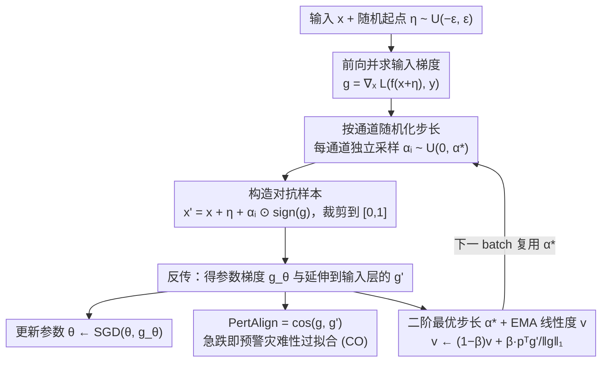

# SORA: Free Second-Order Attacks in Fast Adversarial Training

**会议**: ICML 2026  
**arXiv**: [2606.00738](https://arxiv.org/abs/2606.00738)  
**代码**: https://github.com/SecondOrderAT/SORA  
**领域**: AI安全 / 对抗训练  
**关键词**: 快速对抗训练, 灾难性过拟合, 二阶优化, 自适应步长, 鲁棒性  

## 一句话总结
本文从二阶视角重新审视单步对抗训练中的灾难性过拟合（CO），提出零成本曲率指标 PertAlign 来提前预警 CO，并据此推导出 SORA：一种用上一步反向传播梯度免费估计 Hessian、按通道随机化采样最优步长的自适应快速对抗训练算法，在 6 个数据集和 4 种架构上仅用同一组超参就稳定避免 CO 并刷新单步 AT 的鲁棒/干净精度 trade-off。

## 研究背景与动机
**领域现状**：对抗训练（AT）是抵御对抗样本最有效的防御手段，但多步 PGD-AT 的内层最大化需要多次反向传播，在大数据集和深网络上成本极高。Wong et al. (2020) 提出加随机起点的 FGSM-RS，把内层压缩到单步，让 fast adversarial training (FAT) 成为可行方案。

**现有痛点**：单步 AT 普遍存在灾难性过拟合 (CO)——训练若干 batch 后，对 PGD 的鲁棒精度突然崩到接近 0%，而 FGSM 精度反而上升甚至超过干净精度。已有缓解手段（GradAlign、NuAT、N-FGSM、ATAS、ELLE 等）要么需要昂贵的额外反传或正则项，要么超参与具体数据集/架构强绑定，在 PathMNIST、TissueMNIST 等较硬场景上反复失败，违背了 FAT 追求"低成本"的初衷。

**核心矛盾**：FGSM 用固定大小、固定方向的扰动反复打模型，使模型只在 $\epsilon$-球内某条窄路径上压损失，loss surface 沿这条线就变得高度非线性，作者把这种现象提炼为 **Epsilon Overfitting (EO)**——CO 的几何根源。要打破 EO，就需要在扰动幅度上引入多样性；要让多样性"对症下药"，就需要知道当前 loss surface 的局部曲率；但显式算 Hessian 又会破坏单步 AT 的成本优势。

**本文目标**：(1) 给出 CO 的几何刻画并证明扰动幅度多样性是化解 EO 的关键；(2) 设计一个能在单步 AT 内"免费"得到的曲率指标，用来既预警 CO 又指导 attack；(3) 在不引入额外反传、保持单步成本的前提下，给出一个对数据集与架构鲁棒、无需调参的快速 AT 方法。

**切入角度**：作者注意到反向传播对参数求导时，链式法则的第一层恰好就是 $\nabla_x \mathcal{L}(f_\theta(x+\delta), y)$；只要把这条梯度顺手"延伸一层"取出来，再与生成对抗样本时已经算过的 $\nabla_x \mathcal{L}(f_\theta(x'), y)$ 做余弦相似度，就能拿到一个零额外开销的曲率代理。

**核心 idea**：把 inner maximization 当作二阶问题，用上一 batch 已经算好的梯度去逼近 Hessian-vector product，从而推导一个解析的最优步长 $\alpha^*$，并按通道在 $[0, \alpha^*]$ 内均匀采样，同时打破 EO 与 CO。

## 方法详解

### 整体框架
SORA 把单步 AT 的"FGSM + 固定步长 $\alpha$"换成"FGSM 方向 + 自适应随机步长"。每个 batch 的训练流程是：(1) 加随机起点 $\eta \sim \mathcal{U}(-\epsilon, \epsilon)^d$；(2) 算 $g = \nabla_x \mathcal{L}(f_\theta(x+\eta), y)$；(3) 对每个像素通道独立从 $\mathcal{U}(0, \alpha^*)$ 采样步长 $\alpha_i$，构造 $x' = x + \eta + \alpha_i \odot \text{sign}(g)$ 并裁剪到 $[0,1]$；(4) 反传更新 $\theta$，同时把延伸到输入层的梯度 $g'$ 顺手保留；(5) 用 $g$ 与 $g'$ 沿符号方向 $p = \text{sign}(g)$ 的内积更新 EMA 线性度系数 $v$，并据此为下一个 batch 推导新的 $\alpha^*$。整个流程相比 FGSM-RS 没有额外反传，时间和显存开销可忽略。下图展示了这条"复用已有梯度做曲率感知"的单步训练回环，其中按通道随机化步长、二阶最优步长 $\alpha^*$+EMA、PertAlign 三个贡献节点都只消费现成的 $g$ 与 $g'$，不引入额外反传：

### 关键设计

**1. PertAlign：用一个零成本的余弦相似度，在 PGD 精度崩之前就预警灾难性过拟合**

GradAlign、ELLE 这些已有的 CO 指标都要单独再做一次反传，这违背了 fast AT"低成本"的初衷。本文注意到反向传播链式法则的第一层恰好就是 $\nabla_x\mathcal{L}$，于是把"生成对抗样本时已经算过的那条梯度"和"常规反传顺手延伸一层得到的那条梯度"拿来做余弦相似度，定义 $\text{PertAlign} = \cos\!\big(\nabla_x \mathcal{L}(f_\theta(x'), y),\ \nabla_x \mathcal{L}(f_\theta(x'+\delta), y)\big)$，其中 $x' = x + \eta$、$\delta = \alpha v$。论文证明 $1 - \text{PertAlign} \approx \tfrac{\alpha^2}{2}\|h_{\perp g}\|^2$，其中 $h = Hv/\|g\|$——也就是说这个指标直接捕获了 Hessian-vector product 在与梯度正交方向上的分量；CO 发生时这个分量爆炸，PertAlign 就从接近 1 急剧滑向 0。因为两条梯度都是现成的，整个度量**不需要任何额外前向或反向传播**，而且实测比 GradAlign、AAE、TRADES-KL 等指标都更早触发警报（Fig 3 里 PertAlign 在 batch 3775 就开始下滑，而 FGSM/PGD 精度要到 batch 3825 才肉眼可见分裂）。

**2. 二阶最优步长 $\alpha^*$ + EMA 线性度系数：不显式算 Hessian，却能给下一 batch 一个理论最优的攻击步长**

显式算 Hessian 在大模型上代价不可接受，但固定步长 $\alpha$ 又不够鲁棒。本文把 loss 沿方向 $v = \alpha\,\text{sign}(g)$ 做二阶展开 $\mathcal{L}(x+v) \approx \mathcal{L}(x) + v^T g + \tfrac{1}{2}v^T H v$，对 $\alpha$ 求导得到最优步长 $\alpha^* = \min\!\big(\alpha_{\max},\ \alpha_0 / (1 - p^T g'/\|g\|_1)\big)$，其中 $g' = g + \alpha H p$ 正好可以从上一 batch 反传时延伸出来的输入层梯度免费拿到。为了稳住这个估计，SORA 维护一个 EMA $v \leftarrow (1-\beta) v + \beta \cdot p^T g'/\|g\|_1$，跨 batch 复用——这一步利用了"权重每步只小幅变化、各 batch 又来自同分布"的假设，让二阶信息"essentially for free"。换句话说，它把上一 batch 已经算好的梯度当作本 batch Hessian-vector product 的代理，既绕开了显式 $H$ 的开销，又比经验调出来的固定 $\alpha$ 更对症。

**3. 按通道随机化步长：在最优步长之上再加一层扰动多样性，从根上治掉 Epsilon Overfitting**

作者在 Sec.3 把 CO 的根因归结为 EO——固定大幅扰动让 loss 只在一条窄路径上被压平。所以光有自适应 $\alpha^*$ 还不够，必须给扰动幅度引入多样性。SORA 不直接用 $\alpha^*$，而是对每个像素的每个通道独立采样 $\alpha_i \sim \mathcal{U}(0, \alpha^*)$，再构造 $x' = x + \eta + \alpha_i \odot \text{sign}(g)$。这样同一 batch 内不同样本看到的扰动幅度分布很广，整个 $\ell_\infty$ 球被更均匀地覆盖，FGSM 准确率不会再出现"在某些 $\epsilon$ 上飙升、在另一些 $\epsilon$ 上断崖"的 EO 印记。自适应 $\alpha^*$ 负责治标（防 CO），通道级随机化负责治本（防 EO），两者叠在一起才把单步 AT 从灾难性过拟合里救出来。

### 损失函数 / 训练策略
仍然是标准交叉熵 + SGD（动量 0.9、weight decay $5\times 10^{-4}$），全程使用单组超参 $\alpha_0 = 0.02$、$\beta = 0.05$、$\alpha_{\max} = 2\epsilon$、$\epsilon = 8/255$。EMA 系数 $v$ 初始化为 0.99；当模型处于 CO 临界点时 PertAlign 急跌、$v$ 下降，$\alpha^*$ 通过 $\alpha_0/(1-v)$ 自动放大，从而生成更强的对抗样本拉回鲁棒性；正常情况下 $\alpha^*$ 被 $\alpha_{\max}$ 截断，几乎和 FGSM-RS 等成本相同。

## 实验关键数据

### 主实验
论文在 CIFAR-10/100、TinyImageNet、ImageNet-100、PathMNIST、TissueMNIST 共 6 个数据集和 ResNet/PreActResNet/WideResNet/SENet/ViT 共 4 类架构上对比 15 个基线。下面是 PreActResNet-18、$\epsilon = 8/255$、AutoAttack 评估的代表性结果：

| 数据集 | 指标 | SORA | N-FGSM | AAER | FGSM |
|--------|------|------|--------|------|------|
| PathMNIST | Clean | **84.88** | 74.86 | 81.43 | 36.54 |
| PathMNIST | AutoAttack | **35.54** | 1.90 | 1.89 | 0.42 |
| ImageNet-100 | Clean | **57.26** | 49.38 | 48.26 | 15.98 |
| ImageNet-100 | AutoAttack | **18.56** | 15.52 | 17.18 | 0.00 |

SORA 是唯一在所有 6 个数据集 × 4 个架构组合上都能既避开 CO、又同时拿下最强鲁棒精度和最高干净精度的单步方法；在 PathMNIST 上把 AutoAttack 鲁棒性从所有基线的 < 2% 拉到 35.54%，差距尤其悬殊。

### 消融实验
| 配置 | Clean | FGSM | PGD-10 | 说明 |
|------|-------|------|--------|------|
| SORA (full) | 84.69 | 57.51 | **45.56** | 完整方法 |
| – Without Random Sampling | 85.67 | 58.89 | 45.35 | 去掉通道级随机化 |
| – Clamping Step-Size | 86.82 | 52.02 | 34.08 | 把自适应 $\alpha^*$ 钳到固定值 |
| – Without Optimal Step-Size | 89.93 | 28.30 | 17.23 | 退化为固定步长 FGSM-RS |

### 关键发现
- **自适应 $\alpha^*$ 是性能压舱石**：去掉它后 PGD-10 直接从 45.56% 掉到 17.23%，干净精度反而升至 89.93%——这恰好印证 EO 的特征"clean 看似没事，鲁棒性已崩"。
- **PertAlign 比 GradAlign / AAE / TRADES-KL / ELLE 都更早预警 CO**：在 CIFAR-10 上能提前约 50 个 batch 给出信号，足以让 SORA 自动放大 $\alpha^*$ 拉回训练。
- **超参跨域稳定**：6 个数据集、4 类架构全程同一组 $(\alpha_0, \beta, \alpha_{\max})$；而 GradAlign、N-FGSM、ATAS 等在 PathMNIST 上即便重新搜参也找不到既不 CO、又不在 CIFAR 上掉点的配置。
- **代价几乎为零**：PertAlign 和 $\alpha^*$ 都复用已有梯度，在 RTX 4090 上的 30 epoch 训练时间与 FGSM-RS 同档，显存几乎无增长。

## 亮点与洞察
- **把 inner maximization 当作二阶问题来解，但只付一阶的代价**：将反向传播链式法则中"顺手延伸一层到输入"的梯度复用为 Hessian-vector product 的代理，这是非常优雅的工程-理论结合，可迁移到任何需要曲率信息的训练流程（如 sharpness-aware minimization、二阶元学习）。
- **CO 被重新解释为 EO 的症状而非根因**：扰动幅度的多样性比方向多样性更关键，这一观察重塑了"为什么 random start 有用"的传统解释——不是随机化方向稳住训练，而是间接打破了固定 $\epsilon$ 上的局部过拟合。
- **PertAlign 作为通用诊断器**：它只依赖单步攻击中已经存在的两条梯度，可以直接挂在任何 fast AT 方法上做"CO 提前预警"，无需修改算法主体。
- **"延迟一拍"的二阶估计**：把上一 batch 的 $g'$ 用于本 batch 的 $\alpha^*$，看似粗糙却被实验证明足够稳定，这种"梯度时间错位"的复用思路在 large-batch 优化、分布式异步训练中也有借鉴价值。
- **per-channel 步长 vs per-sample 步长**：作者刻意选择 per-channel 而非 per-sample 随机化，让同一张图片不同通道的扰动都不一样，进一步放大 $\ell_\infty$ 球的覆盖率，这种"细粒度多样性"思路可迁到 patch attack、style transfer 等需要打破单一扰动模式的场景。

## 局限与展望
- 二阶推导假设权重和 batch 在两步之间变化很小，在学习率较大或 batch 极小时近似可能失效，文中也承认这是 EMA 平滑要解决的核心问题。
- 实验全部聚焦于 $\ell_\infty$ 威胁模型与图像分类，对 $\ell_2$、patch 攻击或 NLP、检测/分割任务上的迁移性未做验证。
- PertAlign 给的是"事后"信号，虽然比其他指标都早，但仍不是真正意义上的预测；理论上应当存在直接刻画 Hessian 谱性质的更强指标。
- SORA 与多步 PGD-AT 的鲁棒性仍有差距，论文把多步方法定位为"upper bound baseline"，并未试图弥合这道鸿沟。

## 相关工作与启发
- **vs GradAlign (Andriushchenko & Flammarion, 2020)**：两者都在度量 loss surface 的局部线性度，但 GradAlign 需要额外一次双反传（doubly-back-propagation）作为正则项，而 PertAlign 只复用已有梯度；SORA 把这个指标进一步用于动态调节步长，而非作为损失项罚出去。
- **vs N-FGSM (de Jorge et al., 2022)**：N-FGSM 增大随机噪声幅度、去掉裁剪来缓解 CO；SORA 用解析最优步长 + 通道级随机化，理论根基更清楚，且在 PathMNIST 等硬数据集上把 AutoAttack 从 1.9% 拉到 35.5%。
- **vs ATAS (Huang et al., 2022) / Zhao et al. (2025)**：同为自适应步长方法，但 ATAS 凭经验用梯度范数缩放，Zhao et al. 按样本相似度调节；SORA 第一次把步长选择问题显式建模为二阶最优化并给出闭式解。
- **vs Curvature regularization (Moosavi-Dezfooli et al., 2018; Ma et al., 2021)**：这些方法在 loss 函数上加曲率惩罚，多在多步 AT 框架下使用；SORA 把"曲率感知"完全融入 attack step-size 的选择，因而保住了 fast AT 的成本预算。
- **vs Free AT (Shafahi et al., 2019)**：Free AT 把对抗梯度直接当成参数梯度来同步更新模型，从而省下额外反传；SORA 借鉴了同样的"梯度复用"哲学，但把它扩展到曲率估计而不止是参数更新，因而能同时拿到鲁棒性 + CO 防护两个好处。
- **vs ELLE (Rocamora et al., 2024)**：ELLE 显式鼓励 loss surface 的局部线性度作为正则项；SORA 不再强迫 loss surface 必须线性，而是让 attack 主动追踪当前曲率，对 loss landscape 的形状没有先验偏置，因此在 ViT 等结构上仍能保持鲁棒。
- **vs AAER (Lin et al., 2024)**：AAER 把"异常对抗样本"识别出来后用正则项压制；SORA 则通过自适应 $\alpha^*$ 直接让 attack 走到真正的局部最大值 (NAE)，从根上避免了 AAE 的产生，因而不需要额外正则。

<!-- RELATED:START -->

## 相关论文

- [\[CVPR 2026\] Mitigating Error Amplification in Fast Adversarial Training](../../CVPR2026/ai_safety/mitigating_error_amplification_in_fast_adversarial_training.md)
- [\[ICML 2026\] Training-Free Coverless Multi-Image Steganography with Access Control](training-free_coverless_multi-image_steganography_with_access_control.md)
- [\[ICML 2026\] Rotation-Invariant Spherical Watermarking via Third-Order SO(3) Representation Coupling](rotation-invariant_spherical_watermarking_via_third-order_so3_representation_cou.md)
- [\[ECCV 2024\] Preventing Catastrophic Overfitting in Fast Adversarial Training: A Bi-level Optimization Perspective](../../ECCV2024/ai_safety/preventing_catastrophic_overfitting_in_fast_adversarial_training_a_bi-level_opti.md)
- [\[NeurIPS 2025\] Distributional Adversarial Attacks and Training in Deep Hedging](../../NeurIPS2025/ai_safety/distributional_adversarial_attacks_and_training_in_deep_hedging.md)

<!-- RELATED:END -->
