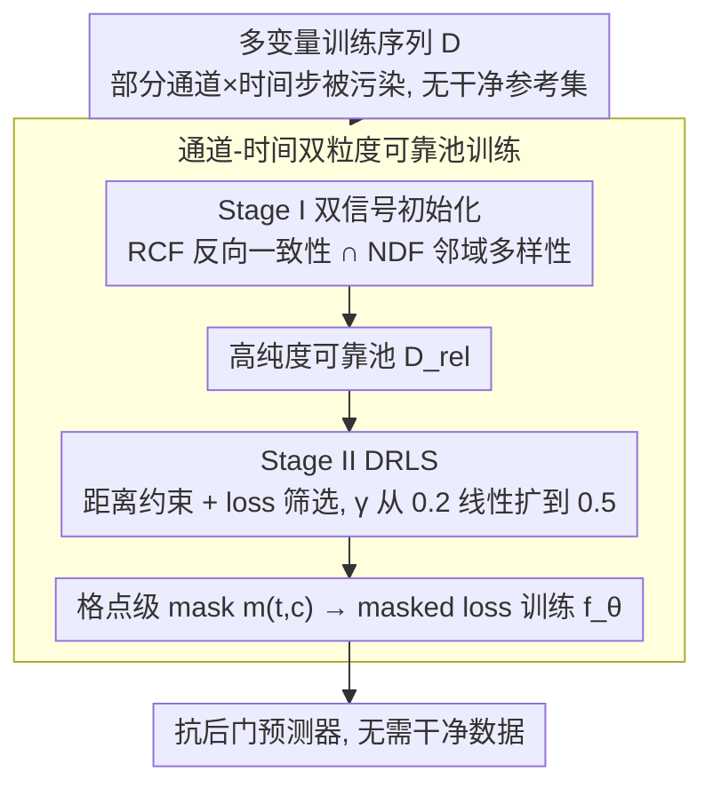

# TimeGuard: Channel-wise Pool Training for Backdoor Defense in Time Series Forecasting

**会议**: ICML 2026  
**arXiv**: [2605.22365](https://arxiv.org/abs/2605.22365)  
**代码**: https://github.com/qducnguyen/TimeGuard  
**领域**: AI 安全 / 后门防御 / 时间序列预测  
**关键词**: 时间序列预测、后门攻击、训练阶段防御、通道级训练、可信机器学习

## 一句话总结
TimeGuard 把多变量时间序列预测里的后门防御从"丢掉整条窗口"重构成"按通道+按时间步"的可靠样本池训练，先用反向一致性 (RCF) + 邻域多样性 (NDF) 交集初始化高纯度池子，再用距离正则的损失筛选 (DRLS) 渐进扩池，在不依赖任何干净数据的前提下把对 BackTime 等 SOTA 攻击的 $\text{MAE}_{\text{P}}$ 提到最强基线 PDB 的 1.96 倍。

## 研究背景与动机

**领域现状**：时间序列预测 (TSF) 已经在交通、气象、电力等关键场景大规模部署，但 Lin 2024 的 BackTime 等攻击已经证明 TSF 模型同样容易被后门注入——攻击者只需要污染训练序列里**一小部分通道、一小段时间窗**，就能在测试时用触发模式劫持预测输出。然而对应的防御几乎是空白：成熟的后门防御主要针对分类（Spectral、ABL、Fine-pruning、NAD、STRIP 等），直接套到 TSF 上从未被系统评估过。

**现有痛点**：作者首先做了一件该领域第一次有人做的事——把 13 个分类侧的代表性防御搬到 TSF 上系统跑一遍，覆盖训练前/训练中/训练后/推理时四个阶段。结果非常难看：样本级过滤类（Spectral / TED / TED++）的 FDER 只在 0.5 附近徘徊，等于完全没起作用；纯损失分离类（ABL / ESTI）平均 FDER 0.497，poisoned 样本的 loss 在前几个 epoch 就和 clean 样本无法区分；推理时检测类（STRIP / TeCo / IBD-PSC）AUROC 普遍只有 0.55，还把延迟从 2 秒拖到 200+ 秒，根本无法上线。仅有的"勉强能用"的 Fine-pruning、NAD、PDB 都要求一份可信干净子集——这在 TSF 场景里非常昂贵。

**核心矛盾**：作者把失败归结为 TSF 独有的两个性质。(1) **数据缠绕 (data entanglement)**：多变量序列既有通道结构又有时间依赖，攻击往往只动一部分通道，但分类侧防御按"整窗"做决定，多数干净通道把信号稀释了——所谓 *channel-level signal dilution*。(2) **任务形态漂移 (task-formulation shift)**：TSF 是连续值回归 + 滑动重叠窗口，poisoned 窗口可以靠拟合很快把 loss 压下来，损失分布迅速塌缩——所谓 *training-loss degeneration*。这两个性质同时破坏了"按样本过滤"和"按 loss 区分"两类主流防御。

**本文目标**：在不假设有干净子集的前提下，给训练阶段做一个对通道粒度敏感、且不依赖损失单一信号的可靠样本选择机制。

**切入角度**：作者从两个观察切入。其一，TSF 后门只规定 history → future 这个**单向**依赖，对反向 future → history 没有保护，因而训练一个 backcaster 可以利用这种"方向不对称"放大干净/中毒样本的差异。其二，作者用 NTK 风格的核回归证了一个 backdoor 成功边界（Theorem 4.1），结论是**成功的 TSF 后门必然要求 poisoned 输入窗口在特征空间里"扎堆"**——这意味着 poisoned 样本会表现出**异常小的邻域距离**。

**核心 idea**：把训练改成**通道×时间**两级粒度的"可靠池训练 (channel-wise pool training)"，用反向一致性 + 邻域多样性双信号初始化高纯度池子，再用"邻域多样性约束的 loss 选择"渐进扩池——既绕开了"按样本过滤"的稀释，又给"按 loss 筛选"加了 distance 正则，避免高度相关的 poisoned 窗口在中后期被重新吸进来。

## 方法详解

### 整体框架
TimeGuard 要解决的是：没有任何干净参考子集时，怎么在训练阶段把被污染的"通道×时间步"挑出来不让它们带坏模型。它的关键转变是不再把一条窗口当作不可分的整体来取舍，而是对每个通道单独维护一个可靠样本池，用一张细粒度 mask 决定每个格点是否参与训练，再分两阶段把这个池子从"小而纯"逐步养成"大而准"。

具体地，设训练集 $\mathcal{D}=\{(\mathbf{X}_{t,h}, \mathbf{X}_{t,f})\}$，样本由 $L_{\text{in}} \times C$ 的历史窗口和 $L_{\text{out}} \times C$ 的未来窗口构成。引入二元 mask $m_{t,c} \in \{0,1\}$ 决定"通道 $c$ 在时刻 $t$ 这一格"是否进入训练，预测器 $f_\theta$ 在 masked loss 上学习：

$$\mathcal{L}_{\text{def}}(\theta;m) = \frac{1}{\sum_{t,c} m_{t,c}} \sum_{t,c} m_{t,c} \, \ell(f_\theta^{(c)}(\mathbf{X}_{t,h}), \mathbf{x}_{t,f}^{(c)})$$

整条 pipeline 分两阶段：Stage I（前 $T_1=10$ epoch）用 RCF ∩ NDF 初始化一个保守但高精度的池子；Stage II（后 $T_2=90$ epoch）用 DRLS 边训边把池子的比例 $\gamma$ 从 $\alpha=0.2$ 线性扩到 $\beta=0.5$。全程不需要干净参考数据，也不改动预测网络结构。

### 关键设计

**1. 通道-时间双粒度的可靠池训练：把"整窗取舍"细化到格点，对齐 TSF 攻击的稀疏性**

分类侧防御失效的根源是 channel-level signal dilution——BackTime 这类攻击的通道污染率 $\eta_S$ 默认只有 0.3，按整窗做决定时，要么把窗口里大量干净通道一起扔掉（伤 $\text{MAE}_{\text{C}}$），要么为了保住它们而留下含毒通道（伤 $\text{MAE}_{\text{P}}$），左右为难。TimeGuard 的对策是把可靠/不可靠的二分细化到"时刻 $t$ × 通道 $c$"的网格级 mask $m_{t,c}$：对每个通道 $c$ 单独维护一份可靠池 $\mathcal{D}^{(c)}_{\text{rel}}$，所有筛选准则（RCF / NDF / DRLS）都在通道内独立做，最终训练用上面那条 masked loss 只在被选中的格点上累加。这样攻击只动了少数通道时，同窗的大多数干净通道照样参与训练。消融里把它改回 sample-level（"w/o Channel-wise"）后 FDER 从 0.868 直接塌到 0.478，几乎等于没防御，说明这是攻防尺度对齐的第一性设计。

**2. Stage I 双信号初始化：反向一致性与邻域多样性各管一路，取交集得高纯度池**

训练早期最怕 poisoned 样本被吸进池子反复强化，所以 Stage I 要的是一个保守但高精度的起点。TimeGuard 用两个相互独立的信号取交集，相当于让样本同时通过两台不相关的测谎仪。其一是 **RCF（反向一致性过滤）**：另训一个与 $f_\theta$ 同架构的 backcaster $b_\phi$ 做反向重建，把翻转的未来窗口预测翻转的历史窗口，损失为 $\mathcal{L}_{\text{rcf}}(\mathbf{x}_t) = \ell(b_\phi(\text{Flip}(\mathbf{X}_{t,f})), \text{Flip}(\mathbf{x}_{t,h}))$，取反向 loss 低的 $\alpha$ 分位以下样本进 $\mathcal{D}_{\text{RCF}}$——它利用的是"后门只规定正向 history→future 依赖、对反向 future→history 没有约束"这一不对称性，poisoned 窗口在反向上往往重建得更差。其二是 **NDF（邻域多样性过滤）**：用 Gaussian 加权 Pearson 相关定义窗口间距离 $d_\omega(\mathbf{x}_i,\mathbf{x}_j)=1-r_\omega(\mathbf{x}_i,\mathbf{x}_j)$，其中权重 $\omega_\tau=\exp(-(\tau-L_{\text{in}})^2/(2\sigma^2))$ 把注意力压在历史-未来交界处，对每个样本算 $K$ 近邻平均距离 $S(\mathbf{x}_i)$，取邻域距离 top-$\alpha$（即最"孤立")的样本进 $\mathcal{D}_{\text{NDF}}$。这一步的依据来自 Theorem 4.1，它给出 TSF 后门成功的核回归上界 $\|\hat y(\mathbf{x})-T(\mathbf{x})\|_2 \le \frac{N_{\text{bg}} M \varepsilon}{N_p \exp(-\gamma \sigma_p^2(\mathbf{x}))} + L_T \sigma_p(\mathbf{x})$，要让攻击成立就必须让 poisoned 输入窗口在特征空间里扎堆（$\sigma_p$ 小），因此 poisoned 样本天然落在"邻域距离异常小"那一端，被 NDF 排除在外。最终可靠池取交集 $\mathcal{D}_{\text{rel}} = \mathcal{D}_{\text{RCF}} \cap \mathcal{D}_{\text{NDF}}$，一个走 loss、一个走几何结构，互不相关，池子精度大幅提升。

**3. Stage II 的 DRLS：用距离约束兜住会塌缩的 loss 信号，再渐进扩池**

进入 Stage II 后单靠 loss 区分会退化——这正是 TSF 的 task-formulation shift：连续值回归 + 滑动重叠窗口让 poisoned 窗口的 loss 很快逼近 clean，纯 loss 筛会把 poisoned 样本重新吸回。DRLS（距离正则的损失筛选）给 loss 加了一道前置几何约束。它先用 $\mathcal{D}_{\text{unrel}}$（而非全集 $\mathcal{D}$）作参考邻居算邻域距离——随着池子扩大，$\mathcal{D}_{\text{unrel}}$ 越来越富集 poisoned 样本，邻域信号反而更锐利，形成自增强的良性循环。然后两步过滤：先从 $\mathcal{D}$ 取邻域距离 top $100\pi\gamma\%$（$\pi \ge 1$）得到候选集 $\mathcal{D}_{\text{NDF}}^{\text{cand}}$，再在候选集内取 loss 最低的 $\gamma|\mathcal{D}|$ 个进 $\mathcal{D}_{\text{DRLS}}$，等价于把 loss 阈值 $\Gamma_{\text{DRLS}}$ 设在候选集 loss 的 $1/\pi$ 分位；扩池比例 $\gamma$ 随 epoch 线性从 $\alpha$ 涨到 $\beta$，在保住 clean 精度的同时让"必须先通过邻域筛"这道闸始终生效。消融里 "w/o DRLS"（Stage II 退化成纯 loss 筛）使 FDER 从 0.868 掉到 0.607、$\text{MAE}_{\text{P}}$ 从 104.7 掉到 76.4，是所有组件里最关键的一项。

### 损失函数 / 训练策略
预测器 $f_\theta$ 用 Adam 优化，Stage I 训 $T_1=10$ epoch、Stage II 训 $T_2=90$ epoch，backcaster $b_\phi$ 额外训 $T_b=10$ epoch；超参 $\alpha=0.2$、$\beta=0.5$，$\pi \in \{1.25, 1.5\}$、$K \in \{20, 32\}$ 网格搜索，所有组件都在通道内独立计算。

## 实验关键数据

数据集：PEMS03（交通）、Weather、ETTm1；预测模型：SimpleTM、FEDformer、TimesNet；攻击：Random、FreqBack-TSF、BackTime；指标：$\text{MAE}_{\text{C}}$ ↓（干净精度）、$\text{MAE}_{\text{P}}$ ↑（被劫持时的远离程度）、FDER ↑（综合度量，作者自己提的）。

### 主实验

PEMS03 上对 13 个分类侧防御的全方位比较（三模型平均）：

| 防御方法 | $\text{MAE}_{\text{C}}$ ↓ (Random / BackTime) | $\text{MAE}_{\text{P}}$ ↑ (Random / BackTime) | FDER ↑ (Random / BackTime) |
|----------|-------|-------|-------|
| No Defense | 17.634 / 17.607 | 17.772 / 14.201 | – / – |
| Fine-pruning (要干净数据) | 19.020 / 18.686 | 31.643 / 19.736 | 0.633 / 0.623 |
| PDB (前 SOTA, 要干净数据) | 18.630 / 18.967 | 54.690 / 22.397 | 0.693 / 0.639 |
| **TimeGuard (无需干净数据)** | **17.928 / 18.048** | **104.677 / 39.303** | **0.868 / 0.808** |

跨数据集的 BackTime 比较：

| 数据集 | 方法 | $\text{MAE}_{\text{C}}$ ↓ | $\text{MAE}_{\text{P}}$ ↑ | FDER ↑ |
|--------|------|--------|--------|--------|
| PEMS03 | PDB / **TimeGuard** | 18.97 / **18.05** | 22.40 / **39.30** | 0.639 / **0.808** |
| Weather | PDB / **TimeGuard** | 11.73 / **10.72** | 56.44 / **66.53** | 0.827 / **0.874** |
| ETTm1 | PDB / **TimeGuard** | 1.274 / 1.268 | 1.422 / **1.443** | 0.648 / **0.652** |

整体：相对 PDB 平均 1.96 倍 $\text{MAE}_{\text{P}}$ 提升、6.09% $\text{MAE}_{\text{C}}$ 下降，跨 3 个数据集 FDER 全部 > 0.65。在 Weather 上甚至比 No Defense 还低 3.02% $\text{MAE}_{\text{C}}$，说明邻域距离筛选有一定正则化效果。

### 消融实验（PEMS03, 三模型平均）

| 配置 | $\text{MAE}_{\text{C}}$ ↓ (Random / BackTime) | $\text{MAE}_{\text{P}}$ ↑ (Random / BackTime) | FDER ↑ (Random / BackTime) |
|------|-------|-------|-------|
| **Full TimeGuard** | 17.93 / 18.05 | **104.68** / **39.30** | **0.868** / **0.808** |
| w/o Channel-wise | 18.32 / 19.07 | 16.15 / 14.93 | 0.478 / 0.507 |
| w/o NDF | 18.58 / 18.42 | 104.46 / 38.35 | 0.853 / 0.795 |
| w/o RCF | 18.06 / 18.61 | 104.41 / 39.61 | 0.865 / 0.796 |
| w/o NDF + RCF | 18.34 / 18.27 | 91.78 / 38.56 | 0.852 / 0.799 |
| w/o DRLS | 19.75 / 20.08 | 76.44 / 22.92 | 0.607 / 0.586 |

### 关键发现
- **通道粒度是第一性的**：去掉通道-时间双粒度（"w/o Channel-wise"）让 FDER 几乎归零（0.49），印证了 channel-level signal dilution 是分类侧防御失效的最大根源。
- **DRLS 比 Stage I 双过滤更关键**：去掉 NDF/RCF 任一项 FDER 仅下降 1–2%，但去掉 DRLS 直接掉到 0.61——这说明长期对抗 loss 退化比启动时的池子纯度更难。
- **效率可接受**：训练时间 1.58 倍于 vanilla（PEMS03 三模型平均 3372 秒 vs 2134 秒），和 PDB（3073 秒）同量级，远小于 ESTI（9054 秒）；推理时**零额外开销**。
- **抗自适应攻击**：作者构造的 worst-case 自适应攻击（同时用 backcaster 做正则 + 显式压制 poisoned 样本相关性）反而把攻击效果做差了（$\text{MAE}_{\text{P}}$ 15.34 vs 原版 14.20）；TimeGuard 在此场景下 FDER 仍有 0.744，验证了 Theorem 4.1 的论断——poisoned 样本必须扎堆才能起效，强行打散就攻击不动了。
- **LLM 预测器迁移**：在 LLM-based forecaster 上同样有效，$\text{MAE}_{\text{P}}$ 至少提升 5.14 倍，$\text{MAE}_{\text{C}}$ 变化仅 3.8%。极端的 $\eta_S=1.0$ 全通道污染下 FDER 仍有 0.748。

## 亮点与洞察
- **"按通道+按时间步"训练范式**是本文最有迁移价值的贡献：任何"攻击只影响子集维度而损失在所有维度上聚合"的场景（多任务防御、多模态防御、稀疏后门检测）都可以照搬这套"细粒度 mask + masked loss"思路。
- **用 backcaster 做反向一致性检验**很巧妙：它把"攻击者必须保证正向 history → future 触发，但对反向 future → history 没有约束"这个 TSF 后门的不可对称性翻译成了可计算的 loss 信号，且 backcaster 只训 10 epoch 就够用，开销很小。
- **NTK 上界 → 几何先验**这条链很漂亮：Theorem 4.1 把"成功后门必然要 poisoned 输入扎堆"从经验观察提升到理论结论，进而把"邻域距离异常小"作为不依赖 loss 的旁路检测信号——这种"用攻击成立的必要条件做防御"的思路在其他后门设置里也有潜在应用。
- **DRLS 用 $\mathcal{D}_{\text{unrel}}$ 而不是全集做邻居参考**：一个小细节但关键——随着池子扩大，$\mathcal{D}_{\text{unrel}}$ 中 poisoned 比例上升，邻域信号反而更锐利，构成一个自我增强的良性循环。

## 局限与展望
- 作者承认的局限：训练时间仍有约 1.58 倍开销；适用于训练阶段，不能保护已经部署好的"黑盒"模型；推理时检测在 TSF 仍是开放问题。
- 自己发现的局限：(1) Theorem 4.1 依赖核回归近似，对深度非线性模型只是定性指引；(2) 全部实验都在 $L_{\text{in}}=L_{\text{out}}=12$ 这一短窗设置上，长 horizon (96, 192, 720) 下邻域距离是否仍能区分 poisoned 样本还未充分验证；(3) Gaussian 加权 Pearson 距离的 $\sigma=2$ 是固定的，对采样率差异极大的数据集可能需要重新调；(4) 当攻击只污染单一通道时，按通道独立做邻域筛选会失去"跨通道一致性"这条潜在信号。
- 改进思路：把 RCF 的 backcaster 换成更轻量的频域反向重建可能进一步降本；在 DRLS 里引入跨通道的协调机制（例如同一时刻多通道 mask 的耦合约束）可能进一步抗强攻击；把 Theorem 4.1 推广到 Transformer 类预测器、给出更紧的非线性版本。

## 相关工作与启发
- **vs BackTime (Lin et al., 2024)**：BackTime 是攻击侧的最强基线（GNN 触发器生成器），TimeGuard 正是为它而设计的防御；本文用 BackTime 自己揭示的"sparse channel poisoning"性质反过来构造防御，比把分类侧防御搬过来更对症。
- **vs PDB (Wei et al., 2024)**：PDB 是分类后门里的最强 in-training 防御，要求一份干净子集，且把后门视为"模型容量过剩"问题。TimeGuard 不要任何干净数据，且把视角从模型侧转到数据池侧，最终 $\text{MAE}_{\text{P}}$ 提升 1.96×。
- **vs ABL / ESTI**：两者依赖 early-loss 分离，本文 Figure 3 直接展示了在 TSF 上这个分离信号几秒钟就崩了；TimeGuard 用 DRLS 做"distance × loss"复合判据正面破解了这一退化。
- **vs Spectral / TED / TED++**：这些方法做样本级 embedding 分布检测，被 channel-level signal dilution 直接打败；TimeGuard 通过通道粒度把它们的判据"还原"到正确尺度上重新可用。

## 评分
- 新颖性: ⭐⭐⭐⭐⭐ TSF 后门防御的第一次系统评估 + 首个不依赖干净数据的 in-training 方法 + 通道-时间双粒度训练范式 + NTK 上界推出的几何先验。
- 实验充分度: ⭐⭐⭐⭐⭐ 3 数据集 × 3 预测器 × 3 攻击 + 13 防御对比 + 详尽消融 + 自适应攻击 + LLM 预测器迁移 + 全通道污染极端情形。
- 写作质量: ⭐⭐⭐⭐ 故事线非常清晰（systematic eval → 两个失败模式 → 双信号 → 两阶段方法），公式表格 self-contained；少数符号（masked loss、DRLS 阈值定义）排版偏密。
- 价值: ⭐⭐⭐⭐⭐ 几乎是 TSF 后门防御方向当前唯一能"开箱即用、无需干净数据、还有理论指引"的方案，对开放权重的时间序列基础模型部署具有直接的工程价值。

<!-- RELATED:START -->

## 相关论文

- [\[ICML 2026\] Exposing Vulnerabilities in Explanation for Time Series Classifiers via Dual-Target Adversarial Attack](exposing_vulnerabilities_in_explanation_for_time_series_classifiers_via_dual-tar.md)
- [\[CVPR 2026\] Logit-Margin Repulsion for Backdoor Defense](../../CVPR2026/ai_safety/logit-margin_repulsion_for_backdoor_defense.md)
- [\[ICML 2025\] TIMING: Temporality-Aware Integrated Gradients for Time Series Explanation](../../ICML2025/ai_safety/timing_temporality-aware_integrated_gradients_for_time_series_explanation.md)
- [\[CVPR 2026\] Eliminate Distance Differences Induced by Backdoor Attacks: Layer-Selective Training and Clipping to Mask Backdoor Models](../../CVPR2026/ai_safety/eliminate_distance_differences_induced_by_backdoor_attacks_layer-selective_train.md)
- [\[ICML 2026\] Scaling Unsupervised Multi-Source Federated Domain Adaptation through Group-Wise Discrepancy Minimization](scaling_unsupervised_multi-source_federated_domain_adaptation_through_group-wise.md)

<!-- RELATED:END -->
