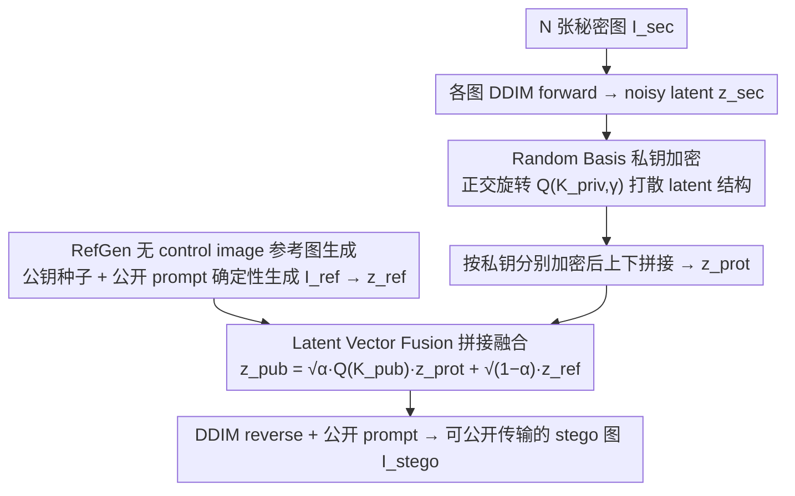

# Training-Free Coverless Multi-Image Steganography with Access Control

**会议**: ICML 2026  
**arXiv**: [2603.09390](https://arxiv.org/abs/2603.09390)  
**代码**: https://github.com/Minyeol/MIDAS  
**领域**: AI 安全 / 信息隐藏 / 扩散模型  
**关键词**: 无载体隐写、多图隐写、访问控制、扩散模型、Random Basis

## 一句话总结
提出 MIDAS，一种基于预训练扩散模型的 training-free 无载体多图隐写框架，用 Random Basis 正交随机基替代传统 Noise Flip 实现按私钥的细粒度访问控制，配合 Latent Vector Fusion 消除拼接边界，在不传输任何与秘密相关的附加信息的前提下实现多图隐藏 + 抗隐写分析。

## 研究背景与动机

**领域现状**：图像隐写主流分两路。**Modification-based**（如 Baluja, HiNet, DeepMIH, IIS, AIS）把秘密图像直接编码到 cover 图像的像素/小波系数上，质量很高但 cover 一旦泄露就被隐写分析轻易识破；**Coverless Image Steganography (CIS)** 则用生成模型直接合成 stego 图像（不存在被改动的 cover），天然抗隐写分析，CRoSS / DiffStega / DStyleStego 是代表性的 training-free CIS 方案。

**现有痛点**：现有 training-free CIS 方法几乎都不支持 access control，把它们朴素扩展到多图场景会出现两类失效——(1) 单图设计被强行复制 N 份后**重建质量崩塌**；(2) 把 N 个秘密的 noisy latent 直接 concat，扩散逆过程**无法平滑跨边界**，stego 图像会出现一道明显的拼接缝（论文 Fig.1 显示 DiffStega* / CRoSS* 都有这个问题）。更严重的是，即便 DiffStega 用错的 K_priv 也能解出大致能看的图像，**完全没有 access control 安全性**。

**核心矛盾**：CIS 想"训练免费 + 多图 + 访问控制 + 不传辅助信息"四个能力同时具备。已有工作要么训练成本高（Chen 2025、Qin 2025 自训生成器），要么需要为每次通信传额外的与秘密相关的 side information（DStyleStego、HIS），要么访问控制保证不住——四个条件没有任何方法能全占。

**本文目标**：在公开扩散模型上构造一个真正的 training-free 多图访问控制 CIS：(a) N 个秘密图像融合到 1 张 stego，(b) 只有持有正确 K_priv_i 的用户能恢复第 i 张，错 key 必须解出"无意义"图像，(c) 不传输任何与秘密相关的附加信息，(d) 抗隐写分析。

**切入角度**：作者观察到，过往的私钥机制 Noise Flip 用的是 $M_d = \text{diag}(e), e\in\{-1,1\}^d$ 这种简单对角符号翻转矩阵——它的搜索空间太规整，且对 noisy latent 内部的结构残留信息抑制不充分。如果换成**用 seed 派生的随机正交基** $Q_d(\mathcal{K},\gamma)$，既保持可逆性（$Q^T Q = I$ 完美还原），又能从信息论角度证明信息泄漏率 $R_L$ 随强度 $\gamma\to 1$ 趋于零。

**核心 idea**：用 seed-driven 随机正交矩阵 (Random Basis) 加密 + 共享 reference latent 的 Latent Vector Fusion 替代朴素 concat，从而把"加密"和"消拼接缝"两件事统一在同一个数学结构里。

## 方法详解

### 整体框架
MIDAS 要解决的是"在一张生成图里同时藏 N 张秘密图、还要按私钥分别授权解出"这件事，难点在于既不能训练新模型、又不能泄漏任何与秘密相关的辅助信息。它的做法是把整套机制都搬进预训练 Stable Diffusion v1.5 的 latent 空间（$C\times H\times W$），把"加密"和"消拼接缝"两件事统一成对 latent 向量施加正交矩阵。发送端把每张秘密图先反演成 noisy latent、用各自私钥加密后拼接，再整体融合进一张确定性生成的参考 latent，最后渲染成可公开传输的 stego 图像；接收端逆着这条路、只有持正确私钥的那一段才能解回有意义的图像。

### 关键设计

**1. Random Basis 私钥加密：用正交旋转替代符号翻转，给出可证泄漏界**

痛点在于过去 DiffStega 的私钥机制 Noise Flip 用的是对角符号翻转矩阵 $M_d = \text{diag}(e),\, e\in\{-1,1\}^d$——搜索空间只有 $2^d$，而且它只翻正负号、根本打乱不了 latent 内部的空间结构，noisy latent 里残留的秘密图轮廓仍然可被恢复。MIDAS 把它换成由种子派生的随机正交矩阵：对任意 d 维 latent $\mathbf{z}$，加密为 $\mathbf{z}_{enc} = M_d \mathbf{z}$，其中 $M_d = Q_d(\mathcal{K},\gamma)$ 由私钥种子 $\mathcal{K}$ 和强度 $\gamma$ 确定性派生（$\gamma$ 控制被旋转影响的元素比例，其余元素保持恒等）。因为是正交矩阵，解密只需转置 $\mathbf{z} = M_d^T \mathbf{z}_{enc}$ 就能完美还原，不损失任何重建质量。它之所以更安全，是真正的高维旋转把 latent 的空间相关性彻底打散了；论文进一步用信息论证明了 Theorem 3.1：信息泄漏率 $R_L \approx O\!\left(\frac{-\log\Delta+\log m}{m} + (1-\gamma)(-\log\Delta+1)\right)$，在 $m\approx 10^6$（512×512×3 图像）、$\Delta\approx 10^{-7}$（float32 精度）下第一项可忽略、第二项随 $\gamma\to 1$ 趋零——实测 $\gamma=0.4$ 时错 key 解出的图像就已经退化到不可辨认。

**2. Latent Vector Fusion 拼接融合：在整张 latent 上再旋一次，把拼接缝抹掉**

把 N 个加密后的子 latent 直接 concat 成 $\mathbf{z}_{prot}$ 再走 DDIM reverse，会留下一道明显的拼接缝：noisy latent 即便经过 DDIM forward 仍保留秘密图的残留结构（引 Greenberg 2025），扩散模型没法跨子段边界平滑去噪。MIDAS 的对策是在拼好的整张 latent 上再施一层**全局**正交变换、并掺入一张自然图像先验：$\mathbf{z}_{pub} = \sqrt{\alpha}\, M_D \mathbf{z}_{prot} + \sqrt{1-\alpha}\, \mathbf{z}_{ref}$，其中 $M_D = Q_D(\mathcal{K}_{pub}, \gamma_{fuse})$ 作用在整个 $D = C\times H\times W$ 维度上、把各子段的空间信息整体打散从而破坏边界，$\mathbf{z}_{ref}$ 是参考图像对应的 noisy latent、按 $\sqrt{1-\alpha}$ 权重注入"这是一张自然图"的先验。接收端做严格逆变换 $\hat{\mathbf{z}}_{prot} = M_D^T\!\left(\frac{\tilde{\mathbf{z}}_{pub} - \sqrt{1-\alpha}\,\mathbf{z}_{ref}}{\sqrt{\alpha}}\right)$ 即可还原。正是这一步把 stego 图像的视觉质量从拼接崩塌拉回到 SOTA。

**3. RefGen 无 control image 的参考图生成：参考图完全由公开资源确定性复现**

上一步需要的参考 latent $\mathbf{z}_{ref}$ 不能直接传——DiffStega 走的是 ControlNet + OpenPose / 分割图那条路，可那张 control image 一旦公开传输，本身就泄漏了秘密图的结构。MIDAS 干脆把 ControlNet 这条路径砍掉：用一个独立预训练扩散模型（论文用 PicX_real）以公钥 $\mathcal{K}_{pub}$ 作初始高斯噪声种子、公开 prompt $\mathcal{P}_{pub}$ 作条件跑确定性采样得到参考图 $I_{ref}$，再 forward 一次得 $\mathbf{z}_{ref}$。由于扩散在固定种子下完全可复现，发送端和接收端各自本地就能生成同一份 $I_{ref}$，整个流程不需要传任何与秘密相关的辅助信息。这样一来，"高质量条件生成"和"嵌入秘密信息"两个角色就全交给了 Random Basis + Latent Vector Fusion，密码学上更干净。

### 一个完整示例
以 $N=2$ 为例走一遍闭环。发送端把 2 张秘密图 $I_{sec}^1, I_{sec}^2$ 各自下采样后做 DDIM forward，得到 noisy latent $\mathbf{z}_{sec}^i\in\mathbb{R}^{C\times H/2\times W}$（$N_1=2, N_2=1$）；分别用私钥 $\mathcal{K}_{priv}^1, \mathcal{K}_{priv}^2$ 经 Random Basis 加密成 $\mathbf{z}_{prot}^i$，上下拼接成整张 $\mathbf{z}_{prot}\in\mathbb{R}^{C\times H\times W}$；再用公钥 $\mathcal{K}_{pub}$ 做 Latent Vector Fusion 把它和 RefGen 生成的 $\mathbf{z}_{ref}$ 混合成 $\mathbf{z}_{pub}$；最后 DDIM reverse + 公开 prompt $\mathcal{P}_{pub}$ 渲染出 stego 图 $I_{stego}$ 发出。接收端拿到（可能被信道污染的）$\tilde{I}_{stego}$ 后，DDIM inversion 回 $\tilde{\mathbf{z}}_{pub}$，用公钥逆 Latent Vector Fusion 拿回 $\hat{\mathbf{z}}_{prot}$，再用自己手里的私钥（比如 $\mathcal{K}_{priv}^1$）解码——只有第 1 段会解出有意义的 latent、第 2 段是噪声；整张 joint denoise 后再切分、VAE decode，就只拿回 $\hat{I}_{sec}^1$。没有正确私钥的人，每一段都解成噪声。

### 损失函数 / 训练策略
**完全 training-free**，不更新任何模型参数。整套流程跑在 SD v1.5 + EDICT 精确反演 + DDIM 采样器上；可调超参只有 $\gamma_{priv}, \gamma_{fuse}, \alpha$ 三个。Reconstruction Stage 在 DDIM backward 时采用 joint denoise（对完整 latent 一次性去噪后再切分），实测优于"先切分再分别去噪"。

## 实验关键数据

### 主实验
数据集：Stego260 (Yu 2023) + UniStega (Yang 2024)，主表 $N=2$。指标分四组：stego 质量 (MANIQA↑)、stego 多样性（与秘密图相似度，PSNR↓/SSIM↓/LPIPS↑/CLIP Score↑）、正确 key 重建质量、错 key 重建质量（PSNR↓/SSIM↓/LPIPS↑ 表示越差越安全）。

| 设定 | 方法 | MANIQA↑ | Stego-PSNR↓ | CLIP↑ | 正确 key 重建 PSNR↑ | 错 key 重建 PSNR↓ |
|---|---|---|---|---|---|---|
| N=2 | CRoSS* | 0.406 | 15.55 | 26.07 | 17.61 | 15.27 |
| N=2 | DiffStega* | 0.399 | 17.07 | 26.95 | 21.91 | 18.14 |
| N=2 | **MIDAS** | **0.434** | **9.89** | **30.13** | **23.90** | **9.96** |
| N=4 | CRoSS* | 0.418 | 13.45 | 24.60 | 13.19 | 12.73 |
| N=4 | DiffStega* | 0.364 | 16.16 | 27.37 | 19.23 | 17.53 |
| N=4 | **MIDAS** | **0.479** | **9.00** | **30.17** | **22.28** | **9.40** |

注意 N=4 时 MIDAS 的 stego 质量 (MANIQA 0.479) 反而比 N=2 (0.434) 还略高，而 CRoSS*/DiffStega* 随 N 上升明显下滑——**多图扩展性**才是 MIDAS 的核心优势。同时正确 key 与错 key 重建之间出现 ~14 dB 的 PSNR 鸿沟（23.9 vs 9.96），是真正可用的 access control 强度。

### 鲁棒性 & 抗隐写分析

| 干扰 | IIS | AIS | CRoSS* | DiffStega* | **MIDAS** |
|---|---|---|---|---|---|
| Clean (PSNR↑) | 41.36 | 30.77 | 17.61 | 21.91 | **23.90** |
| Gaussian noise σ=5 | 12.44 | 14.65 | 16.30 | 20.08 | **20.05** |
| JPEG Q=70 | 10.05 | 9.44 | 16.93 | **20.42** | 19.92 |
| Gaussian blur σ=2 | 10.68 | 10.00 | 15.63 | 19.38 | **19.69** |

modification-based 方法 (IIS/AIS) 在 clean 设置下数据漂亮，但加任何信道噪声就崩到 10 dB 出头；MIDAS 在三类常见干扰下都保持 ~20 dB。

**抗隐写分析**（XuNet / SiaStegNet 训练在 cover-stego 对上）：IIS/AIS 检出率 >90%（修改痕迹明显），CRoSS*/DiffStega* >85%（artefact 暴露），MIDAS 的检出率比所有 baseline 低约 20%——直接逼近随机猜测水平。

### 关键发现
- **Random Basis vs Noise Flip**：Appendix D.1 消融显示同一框架下 Random Basis 在 stego 质量和重建质量上都显著优于 Noise Flip，验证了"正交旋转 > 符号翻转"。
- **Latent Vector Fusion 是消拼接缝的命门**：去掉这一步直接退化成 DiffStega* 的拼接缝问题，stego 质量崩塌。
- **$\gamma_{priv}=0.4$ 已足够安全**：理论分析的 $(1-\gamma)$ 项虽不为零，但实测此时错 key 重建质量已掉到 10 dB 左右，信息已不可恢复。
- **N=8 极端容量**：Appendix C.3 验证 MIDAS 在 8 图共享 1 张 stego 时仍保持可用，是 scalable 的。

## 亮点与洞察
- **把"加密"和"消拼接缝"统一在正交矩阵代数下**：Random Basis 既做 access control 又做空间打散，Latent Vector Fusion 在整张 latent 上又施一次正交变换并融入参考图像——两个机制共享同一个数学骨架 $Q_d(\mathcal{K},\gamma)$，工程上极优雅。
- **信息论 + 高维概率给出可证泄漏界**：Theorem 3.1 给出 $R_L$ 随 $\gamma$ 和维度 $m$ 的渐近形式，让"隐写到底安不安全"这件事不再只看实验曲线，而是有可解释的 scaling 行为。
- **彻底砍掉 ControlNet 依赖**：之前 DiffStega 需要公开传输 control image，这本身就是泄漏。MIDAS 的"公开资源完全确定性生成 + 私钥仅用作正交矩阵 seed"是一种更"密码学纯净"的设计哲学。
- **可迁移到任何 latent 生成模型**：方法只依赖 (a) 有 forward/backward 的扩散模型，(b) latent 空间为欧氏向量。Stable Diffusion v1.5 是举例，换成 SD3 / Flux 应该直接可用，且无需重训。

## 局限与展望
- **作者承认**：DDIM inversion + EDICT 推理延迟较高，未来需要做 sampling acceleration（few-step diffusion / consistency model）。
- **assumption**：N1·N2 = N 要求把秘密图像数限定在能切成规整网格的数（N=2, 4, 8, …），任意 N 需要更灵活的 patch packing 方案。
- **公开 prompt $\mathcal{P}_{pub}$ 选取的影响**：实验中用 target caption，若 $\mathcal{P}_{pub}$ 与秘密图像内容语义冲突太大，CRoSS*/DiffStega* 会崩；MIDAS 似乎更稳，但论文没系统量化 $\mathcal{P}_{pub}$ 失配下的退化。
- **改进方向**：Theorem 3.1 给的是上界，能否反过来推导信息论意义上的"完全保密 $\gamma^*$"？另外 Latent Vector Fusion 中的 $\alpha$ 现在是固定超参，按 timestep 调度可能更好。

## 相关工作与启发
- **vs CRoSS (Yu 2023)**：CRoSS 单图，私钥是 prompt，私钥要每次会话传输；MIDAS 私钥是 seed（短）+ 多图 + 不传额外信息。
- **vs DiffStega (Yang 2024)**：DiffStega 用 ControlNet + Noise Flip + 控制图；MIDAS 移除 ControlNet、把 Noise Flip 升级为 Random Basis、加入 Latent Vector Fusion 解决多图拼接，且具备真正的 access control。
- **vs HIS (Xu 2025)**：HIS 用 CRoSS 生成 stego 再做 modification-based 多图隐写，每次仍要传秘密相关 side info；MIDAS 完全 coverless 且不传 side info。
- **vs IIS / AIS (Zhou 2025)**：modification-based 多图访问控制方案，clean 设置 PSNR 高但抗隐写分析能力弱、抗信道噪声差；MIDAS 用 coverless + diffusion 路线把两个 trade-off 都翻过来。

## 评分
- 新颖性: ⭐⭐⭐⭐ Random Basis + Latent Vector Fusion 的组合在 CIS 领域是干净的新设计，信息论分析也合理。
- 实验充分度: ⭐⭐⭐⭐ 两个数据集 × N∈{1,2,4,8} × 多个 baseline × 鲁棒性 × 抗隐写分析 × 消融，覆盖较完整。
- 写作质量: ⭐⭐⭐⭐ 动机层层递进、表 1 一眼能看出方法定位、定理陈述清楚。
- 价值: ⭐⭐⭐⭐ training-free + 多图 + 访问控制 + 不传 side info 四个条件第一次被同时满足，在多用户隐私通信场景有直接落地价值。

<!-- RELATED:START -->

## 相关论文

- [\[CVPR 2026\] One-to-More: High-Fidelity Training-Free Anomaly Generation with Attention Control](../../CVPR2026/ai_safety/one-to-more_high-fidelity_training-free_anomaly_generation_with_attention_control.md)
- [\[CVPR 2026\] GVIS: Generative Vector Image Steganography](../../CVPR2026/ai_safety/gvis_generative_vector_image_steganography.md)
- [\[ICML 2026\] SORA: Free Second-Order Attacks in Fast Adversarial Training](sora_free_second-order_attacks_in_fast_adversarial_training.md)
- [\[CVPR 2026\] Image-based Outlier Synthesis With Training Data](../../CVPR2026/ai_safety/image-based_outlier_synthesis_with_training_data.md)
- [\[ICML 2026\] Rethinking Evaluation Paradigms in IBP-based Certified Training](rethinking_evaluation_paradigms_in_ibp-based_certified_training.md)

<!-- RELATED:END -->
