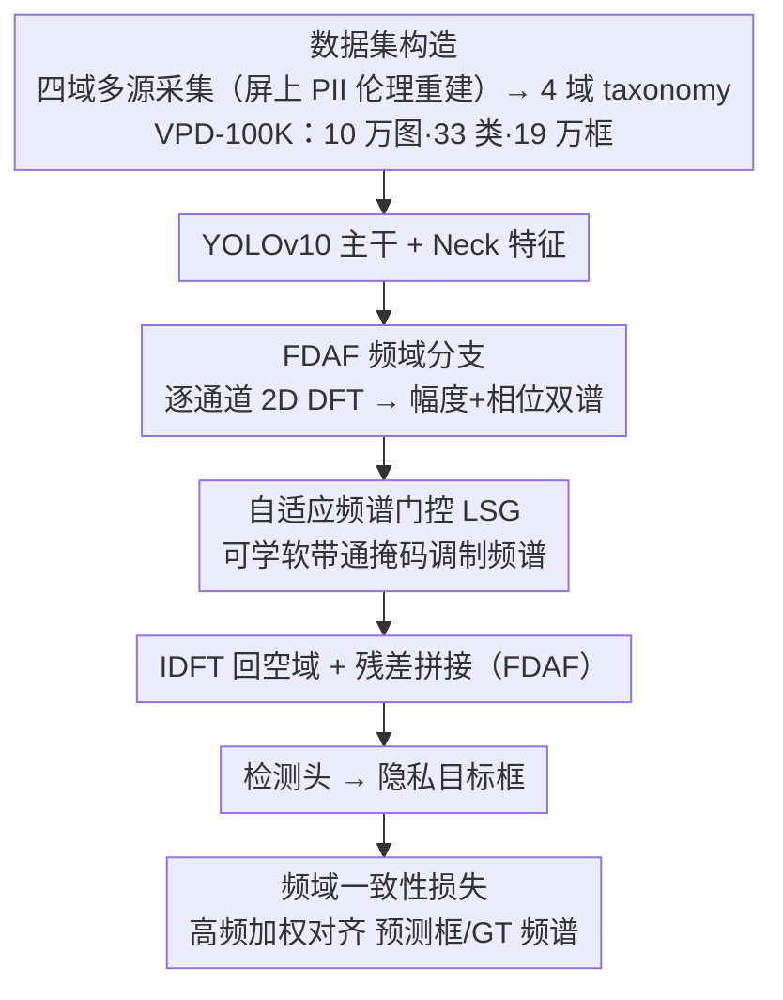

# VPD-100K: Towards Generalizable and Fine-grained Visual Privacy Protection

**会议**: ICML 2026  
**arXiv**: [2605.10229](https://arxiv.org/abs/2605.10229)  
**代码**: https://vpd-100k.github.io/  
**领域**: AI 安全 / 视觉隐私保护 / 目标检测  
**关键词**: 隐私检测, 数据集, 频域注意力, YOLO, 直播流

## 一句话总结
作者构造了 10 万张图、33 个细粒度类别、19 万+ 实例的大规模视觉隐私数据集 VPD-100K（覆盖人脸/屏上 PII/物理证件/位置标记四大域），并提出三件套频域增强模块（FDAF + 自适应频谱门控 + 频域一致性损失）插入 YOLOv10 的 Neck，使 YOLOv10-L 在 VPD-100K 上 AP 从 53.8 涨到 58.6（+4.8），同时在 7.51ms 延迟下稳定跑直播流。

## 研究背景与动机

**领域现状**：视觉隐私检测是直播 / 屏幕共享 / VLog 时代的刚需——需要在画面里实时识别人脸、身份证、密码框、街道标牌等敏感信息。现有工作分两派：图像级敏感度预测（粗粒度，无定位）和目标级标识检测（精准但数据集小）。

**现有痛点**：现有隐私数据集的问题被作者总结成"三宗罪"——(1) **规模小**：PrivacyAlert 6.8K、BIV-Priv 0.7K、DIPA 1.5K，远不够训大模型；(2) **类目粗**：只标"person / other people"这种粗 tag，区分不了"成年人室内"vs"儿童户外"；(3) **域窄**：几乎所有数据集都忽略了**屏上 PII**（邮箱、密码、验证码、聊天记录），而这才是现代数字生活中最严重的泄漏源。同时多数数据集链接失效、不释放。

**核心矛盾**：隐私数据天然受伦理约束——你不可能合法地收集 10 万张真人的银行卡照片做训练。所以"想要大规模 + 想要真实分布"在合规层面是冲突的，导致数据稀缺。

**本文目标**：(1) 给社区一个**真正可用、规模到 10 万、覆盖屏上 PII**的隐私检测数据集，且全公开；(2) 针对"屏上小字、模糊人脸、低对比敏感对象"这种空间特征不强但频域特征显著的目标，设计一套轻量级频域增强模块；(3) 用一套统一框架同时支持图像与直播视频两种场景，跑 130+ FPS。

**切入角度**：用伦理可控的"场景重建"代替真实数据采集——例如团队用内部账号登录模拟银行、接验证码，自己截屏，得到像素级精确但不侵犯任何真人隐私的屏上 PII 样本；同时频域上，文字、人脸边缘等隐私目标在高频分量上有强信号，但被空域 YOLO 平均化掉了，**显式建模频域**能补这块短板。

**核心 idea**：数据上"taxonomy-driven 多源聚合 + 伦理场景重建"凑齐 4 域 33 类；方法上"空间 + 频域双流"——FDAF 把特征做 DFT 后用 IDFT 重组，自适应频谱门控当作可学习的"软带通滤波器"，再用频域一致性 loss 拉齐预测框与 GT 框的频域分布。

## 方法详解

### 整体框架
论文有两个独立但配套的贡献，合起来回答"隐私检测缺数据、缺对小屏字/模糊脸的细粒度感知"这个问题。数据侧用一套 4 域 taxonomy 把多源样本聚成 10 万张图、33 类、19 万+ 框的 VPD-100K，其中最关键的屏上 PII 用"伦理重建"采集。模型侧不动 YOLOv10 主干，只在 Neck 中部插一条频域分支（FDAF + 自适应频谱门控 + 频域一致性损失），让网络在空域之外多一条"看高频细节"的通路，整体仍是端到端 YOLO 训练。

### 关键设计

**1. 数据集构造：用伦理重建 + 4 域 taxonomy 补齐"规模小 / 类目粗 / 缺屏上 PII"三大空白**

现有隐私数据集要么几千张样本、要么只标"person"这种粗 tag、要么干脆忽略邮箱密码验证码这类屏上 PII，而屏上 PII 恰恰是最难合法采集的——你不可能去抓真用户的银行卡和验证码。本文对四个域各用一套合规策略凑齐分布：人脸取 WIDER FACE 子集 + 视频快照，并补"室内儿童脸"这类细粒度属性；屏上 PII 由研究团队**用内部账号模拟**真实数字交互（登模拟银行、接验证码、聊天）再截屏，既拿到真实软件界面的像素级表现，又完全不沾真人 PII；物理标识符用 MIDV-500 证件库 + 定向爬取火车票快递单；位置指示符抓室外街景标注门店招牌。最终 100K 张图、一半在 1080p 以上、190K+ 框且通过伦理审查。Table 1/2 量化了优势：规模约为次大数据集 PrivacyAlert 的 15×、类别数约为 DIPA2 的 1.5×，类别分布变异系数（CV，标准差/均值，越小越均衡）1.47 远好于 DIPA2 的 2.50。"内部账号模拟"是这套数据真正破壁的地方——它在"合法"和"真实"这对天然冲突里找到折中，并借显式四分法强制覆盖到杀伤力最大却被普遍忽略的屏上 PII。

**2. FDAF：在 Neck 上加一条频域分支，把空域里被平均化的高频细节捞回来**

验证码占图不到 10%、远景证件这类目标空间特征很弱，在空域卷积里会被周围纹理平均掉，但文字的横竖笔画在频谱上对应明显的水平/垂直高频分量。FDAF（Frequency-Domain Attention Fusion）就让网络多一条能直接"看到"这些高频信号的通路：对 Neck 输出特征 $X \in \mathbb{R}^{C \times H \times W}$ 每通道独立做 2D DFT $F_c(u,v) = \sum_{h,w} X_c(h,w) e^{-j2\pi(uh/H + vw/W)}$ 得到幅度+相位双谱，经下面的频谱门控调制后再 IDFT 回空域 $Y_{spa} = \mathcal{R}(\text{IDFT}(\tilde{F}))$，最后残差拼接回原特征 $I_{out} = \text{Conv}_{1\times 1}(\text{Concat}(I, Y_{spa})) + I$。残差设计保证频域分支只做增量补充而不破坏原有空域表征。Table 5 显示单加 FDAF 就把 AP 从 46.3 抬到 48.5（+2.2）。

**3. 自适应频谱门控（LSG）+ 频域一致性损失：让网络学会选频带、并按频域对齐边界**

直接放大所有高频会把噪声一起放大，所以需要一个可学的"软带通滤波器"决定保留/抑制哪些频带。LSG（Adaptive Spectral Gating）定义可学权重张量 $W_{gate} \in \mathbb{R}^{C \times H \times W}$，经 Sigmoid 后与频谱逐元素相乘 $\tilde{F}_c(u,v) = F_c(u,v) \odot \sigma(W_{gate}(u,v))$，相当于通道-频带联合软掩码，让网络自动学到"文字目标多激活水平/垂直频带、人脸多激活径向频带"。配套的频域一致性损失把这种频域感知接到监督信号上：$\mathcal{L}_{freq} = \frac{1}{N}\sum_i \|W \odot (\mathcal{F}(P_i) - \mathcal{F}(T_i))\|_2^2$，让预测框 $P_i$ 内部的频谱贴近 GT 框 $T_i$ 内部的频谱，其中权重 $W(r) = 1 + \lambda r$ 随频率半径 $r$ 增大，**越高频惩罚越重**，逼模型优先匹配边界细节。它作为 boundary-aware 正则项汇入总 loss $\mathcal{L}_{total} = \mathcal{L}_{yolo} + 0.05 \cdot \mathcal{L}_{freq}$，权重 0.05 小到不会盖过主 loss 却足以收紧边界——消融里 AP75（高 IoU 指标，最吃边界精度）从 53.9 涨到 54.6 正是这一项的功劳。

### 损失函数 / 训练策略
总损失为 $\mathcal{L}_{total} = \mathcal{L}_{box} + \mathcal{L}_{cls} + \mathcal{L}_{dfl} + 0.05 \cdot \mathcal{L}_{freq}$，前三项是 YOLOv10 原生回归/分类/DFL 损失，第四项是频域一致性正则；频率权重 $w(r) = 1 + \lambda r$ 的 $\lambda$ 默认设到让高频权重显著大于低频。基座取 YOLOv10-S/L，在 VPD-100K 训练集上全量微调，14 个 baseline 都用同一套数据微调以保公平。

## 实验关键数据

### 主实验
图像测试集上 15 个检测器的对比（精选关键行）：

| 模型 | AP | AP50 | AP75 | APS | APM | APL | Latency (ms) | F1 |
|------|-----|------|------|-----|-----|-----|--------------|------|
| Grounding-DINO | 48.1 | 65.8 | 62.6 | 30.4 | 51.3 | 62.3 | 119.5 | 0.68 |
| YOLOv8-L | 52.6 | 68.3 | 59.1 | 32.6 | 58.5 | 67.3 | 14.76 | 0.72 |
| YOLOv9-L | 53.4 | 68.6 | 57.9 | 33.9 | 59.1 | 70.3 | 7.73 | 0.73 |
| YOLOv10-L | 53.8 | 69.6 | 58.4 | 33.6 | 59.8 | 70.8 | 7.42 | 0.73 |
| **YOLOv10-S + FEM** | 52.1 | 67.1 | 54.6 | 30.1 | 55.6 | 64.3 | 2.71 | 0.71 |
| **YOLOv10-L + FEM** | **58.6** | **73.4** | **61.3** | **36.5** | **62.3** | 70.6 | 7.51 | **0.81** |

主要收益：AP +4.8（53.8→58.6），AP50 +3.8，APS（小目标，对应验证码这类）+2.9，F1 直接拉到 0.81 显著领先所有 baseline。

直播视频测试集上 YOLOv10-L + FEM 也是最优 AP 57.7，延迟 7.51ms 折算 ~133 FPS，满足直播实时性。

### 消融实验
Table 5（基座 YOLOv10-S）：

| 配置 | FDAF | LSG | $\mathcal{L}_{freq}$ | AP | AP50 | AP75 | APS |
|------|------|-----|----------|-----|------|------|-----|
| Base | - | - | - | 46.3 | 62.7 | 51.3 | 26.1 |
| +FDAF | ✓ | - | - | 48.5 | 64.2 | 52.8 | 27.5 |
| +LSG | ✓ | ✓ | - | 50.9 | 65.8 | 53.9 | 29.2 |
| Full | ✓ | ✓ | ✓ | **52.1** | **67.1** | **54.6** | **30.1** |

三件套贡献分别为 +2.2 / +2.4 / +1.2，叠加 +5.8 AP。

### 关键发现
- **LSG 对小目标贡献最大**：从 27.5 → 29.2 APS，提升 +1.7p 在小目标上尤其明显，验证"自适应频带选择能放大文字笔画特征"。
- **频域 loss 主攻高 IoU**：AP75 是高 IoU 指标，最容易被边界精度影响，$\mathcal{L}_{freq}$ 让 AP75 从 53.9 涨到 54.6 验证了它确实在调边界。
- **轻量插件，延迟几乎不变**：YOLOv10-S 加完三件套延迟从 2.53 涨到 2.71ms（+7%），却换来 AP +5.8，参数/算力代价极小。
- **用户研究 90% 正面**：Likert 量表 20 位参与者 90% 同意 taxonomy 完整、对实时直播有用且能降低隐私焦虑。
- **OOD 泛化好**：在真实直播平台的视频上（手持抖动、屏幕共享）也能检出收据 PII 和分享屏上的敏感信息，说明 VPD-100K 足够多样能撑住分布偏移。

## 亮点与洞察
- "伦理重建"屏上 PII 这个数据采集思路是真正的破壁——它绕开了直接采集真用户数据的法律红线，同时给模型提供像素级真实分布。这套方法论可以推广到医学影像（用合规的临床合作机构）、车牌识别等所有受 PII 法规约束的领域。
- 把"频域增强"做成一个**可插拔的 Neck 中部模块**而不是改 backbone，意味着可以无缝迁移到 YOLOv11 / DETR 系列 / 任何用 FPN/Neck 的检测器，工程价值大。
- $\beta = 0.05$ 这种"小权重 auxiliary loss"调参 trick 反映出作者经验老到——频域 loss 信号强、若 $\beta$ 大会盖过主 loss 把模型训歪，找这个 sweet spot 是关键。
- "frequency consistency" 的思路（让 pred 与 GT 在频域对齐）天然适合任何"细节匹配"任务——医学影像分割边界、字符 OCR、超分辨率，都可以借这个 loss。

## 局限与展望
- 数据集长尾严重，passport 等稀有类别样本极少，模型对长尾类别的真实性能（vs F1 平均）未深入剖析。
- 屏上 PII 是团队"模拟"的，软件界面分布偏向团队熟悉的产品（银行 APP、聊天工具），对小众界面（如海外平台、专业软件）泛化未测。
- 频域分支虽轻量，但 DFT 在大特征图上仍是 $O(HW \log HW)$，对 4K 输入未必依然这么便宜，作者没给高分辨率的 cost-benefit 曲线。
- LSG 的权重 $W_{gate}$ 是空间-频率双维度的，参数量 = $C \times H \times W$，在不同输入尺寸下需要 resize 或重训。
- 隐私检测只是第一步，**检测后如何安全脱敏**（模糊？打码？区域擦除？）以及如何与下游直播管线集成（每 N 帧 vs 每帧），论文都没涉及，实际落地还有距离。

## 相关工作与启发
- **vs DIPA / DIPA2 / BIV-Priv**：现有数据集的"放大版+精细版"，规模 ~15×、类别 ~1.5×、新增屏上 PII 整个域。
- **vs PrivacyAlert / SensitivAlert**：那些是图像级粗 tag，VPD-100K 是 object-level 细粒度框，能直接驱动检测/脱敏 pipeline。
- **vs 通用检测 YOLOv10 / DETR**：通用检测器在小屏字、低对比目标上表现差是因为它们针对自然物体优化，FEM 用频域补齐"细粒度边界"短板。
- **vs Tree-Ring / 频域水印**：那些用频域做生成模型水印，VPD 把频域用在判别检测，但理念相通——频域信号在低对比/小目标场景下信噪比反而高于空域。

## 评分
- 新颖性: ⭐⭐⭐⭐ — 数据集贡献突出（屏上 PII 整域 + 伦理重建方法论是真创新），频域三件套属于经典思路的合理组合而非范式级原创。
- 实验充分度: ⭐⭐⭐⭐ — 14 个 baseline + 图像/视频双场景 + 完整消融 + 用户研究 + OOD 实测，已经相当扎实；缺更细的长尾分析与高分辨率成本曲线。
- 写作质量: ⭐⭐⭐⭐ — 痛点-方案对照很清楚，Table 1/2 一眼看清数据集优势；方法部分公式干净但有点拖沓。
- 价值: ⭐⭐⭐⭐⭐ — 在 GDPR / CCPA 时代，一个真正可用、合规、覆盖屏上 PII 的 10 万级公开隐私数据集本身就是行业刚需，模型只是 bonus。

<!-- RELATED:START -->

## 相关论文

- [\[AAAI 2026\] Fine-Grained DINO Tuning with Dual Supervision for Face Forgery Detection](../../AAAI2026/ai_safety/fine-grained_dino_tuning_with_dual_supervision_for_face_forgery_detection.md)
- [\[CVPR 2026\] DiffusionFF: A Diffusion-based Framework for Joint Face Forgery Detection and Fine-Grained Artifact Localization](../../CVPR2026/ai_safety/diffusionff_a_diffusion-based_framework_for_joint_face_forgery_detection_and_fin.md)
- [\[ECCV 2024\] SkyMask: Attack-Agnostic Robust Federated Learning with Fine-Grained Learnable Masks](../../ECCV2024/ai_safety/skymask_attack-agnostic_robust_federated_learning_with_fine-grained_learnable_ma.md)
- [\[ICML 2026\] Persuasive Privacy](persuasive_privacy.md)
- [\[CVPR 2026\] Protego: User-Centric Pose-Invariant Privacy Protection Against Face Recognition-Induced Digital Footprint Exposure](../../CVPR2026/ai_safety/protego_user-centric_pose-invariant_privacy_protection_against_face_recognition-.md)

<!-- RELATED:END -->
