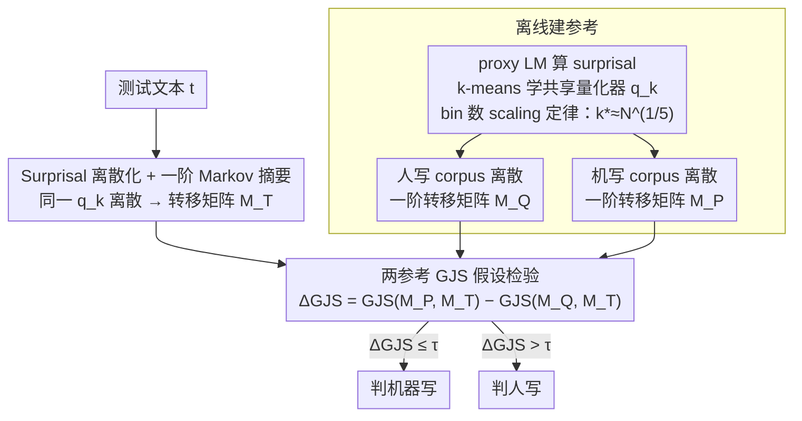

# Black-Box Detection of LLM-Generated Text Using Generalized Jensen-Shannon Divergence

**会议**: ICML 2026  
**arXiv**: [2510.07500](https://arxiv.org/abs/2510.07500)  
**代码**: 暂无公开  
**领域**: AIGC 检测 / NLP / 假设检验  
**关键词**: 黑盒 AI 文本检测, surprisal 离散化, Markov 状态转移, 广义 JS 散度

## 一句话总结
SurpMark 把"AI 文本检测"重构成似然无关假设检验：用代理 LM 算 token surprisal 后 k-means 离散成 k 个状态，估计一阶 Markov 转移矩阵，再用广义 Jensen-Shannon 散度（GJS）和预先建好的"人写 / 机写"参考转移矩阵比较，单次前向就给出黑盒、无需重训、无需 per-instance 重采样的判别分数。

## 研究背景与动机
**领域现状**：AI 文本检测主要两条路——(1) **分类器派**（GPTZero、OpenAI Detector）需要为每个领域 / 生成器训专门模型，标注成本高且换域就失效；(2) **统计派**又分两支：global statistic（likelihood、log-rank、entropy）受校准 mismatch / 长度 / 领域漂移影响大；distributional statistic（DetectGPT、DNA-GPT、Fast-DetectGPT）需要对每条测试文本做扰动 / 采样 / 续写以重建邻域分布，计算量随调用次数线性爆炸。

**现有痛点**：黑盒场景下，scoring model（proxy LM）和真正生成模型不一致会让 likelihood 类指标系统性偏移；perturbation 类方法又因为依赖 per-input 重新生成，根本无法部署到高吞吐 / 资源受限场景。两条路都不能同时做到"无训练 + 单次推理 + 跨域稳健"。

**核心矛盾**：likelihood 这个 absolute 量在 black-box 下不可信，per-instance 重采样又太贵；但**人/机文本在 token 动态层面有本质差异**——LLM 倾向于在一个高 surprisal token 之后立刻"恢复"到高度可预测的 token（perplexity 最小化的副作用），这种"recovery pattern"是 stable 且 calibration-robust 的。

**本文目标**：(1) 设计一个不需要训练分类器、不需要 per-instance 重采样、能跨域跨生成器迁移的黑盒检测器；(2) 在统计上给出 bin 数 $k$ 的最优 scaling、解释为什么 GJS 是合适的统计量。

**切入角度**：把任务看作**两参考的 likelihood-free 假设检验**——人写文本和机器文本都有公开 corpus，可以一次性离线建参考；对每条测试文本只需做"摘要"+"和两个参考比距离"，避开了任何 absolute likelihood 的依赖。

**核心 idea**：把连续 surprisal 离散成 k 个可解释状态（"Predictable / Slightly Surprising / Significantly Surprising / Highly Surprising"），把文本压缩成一阶 Markov 状态转移矩阵，然后用 $\Delta\text{GJS}_n = \text{GJS}(\hat M_P, \hat M_T, \alpha) - \text{GJS}(\hat M_Q, \hat M_T, \alpha)$ 作为打分，证明它等价于两假设下的 normalized log-likelihood ratio。

## 方法详解

### 整体框架
**离线阶段**：用 proxy LM $F_\theta$ 在大规模人写 corpus 上算 surprisal，k-means 学到一个共享量化器 $q_k$ 把连续 surprisal 映射到 $\{1,\dots,k\}$；再分别对人写 corpus 和机器 corpus 算 surprisal → 离散 → 统计转移频率，得到两个参考矩阵 $\hat M_Q$（人）和 $\hat M_P$（机）。

**在线阶段**：测试文本 $\mathbf{t}$ 同样经 $F_\theta$ 算 surprisal、用同一个 $q_k$ 离散、统计转移矩阵 $\hat M_T$，然后算 $\Delta\text{GJS}_n$ 与阈值 $\tau$ 比较即得分类结果。

整套设计不需要训练任何分类器，proxy LM 完全黑盒（只需查 token 概率），测试时仅一次前向。

### 关键设计

**1. Surprisal 离散化 + 一阶 Markov 摘要：把每条文本压成可比较的"动态结构"**

针对的痛点是 absolute likelihood 在 proxy LM 和真生成模型不一致时会系统性漂移。SurpMark 不直接用 likelihood，而是先对 token 序列 $\mathbf{x}=(x_1,\dots,x_n)$ 逐位算 surprisal $s_t=-\log p_\theta(x_t \mid x_{1:t-1})$，再用 k-means 把连续 surprisal 聚成 $k$ 个可解释状态（$k=4$ 时对应"可预测 / 轻微意外 / 显著意外 / 高度意外"），从而把文本转成离散状态序列 $\{a_t\}$，并统计一阶转移矩阵 $\hat M(j\mid i)=\frac{\sum_{t}\mathbf{1}\{a_t=i,\,a_{t+1}=j\}}{\sum_t \mathbf{1}\{a_t=i\}}$。

之所以选转移矩阵而非 likelihood，是因为 LLM 有显著的 "recovery phenomenon"——一个高 surprisal token 之后会立刻回落到 predictable state（perplexity 最小化的副作用），这种模式在转移矩阵上是稳定且醒目的签名，而"相对结构"对校准漂移天然鲁棒。阶数则固定在一阶：更高阶会让状态空间膨胀到 $k^{n+1}$、转移计数稀疏，反而退化，一阶恰是 sweet spot。

**2. 基于两参考的 GJS 假设检验：把检测变成有最优性保证的似然比**

传统 likelihood-free 检验只跟单个参考比，丢掉了"另一个假设"携带的判别信息。SurpMark 改用广义 Jensen-Shannon 散度做双参考比较：$\text{GJS}(M_A, M_B, \alpha) = \frac{\alpha}{1+\alpha}D_{\text{KL}}(M_A, M_\alpha) + \frac{1}{1+\alpha}D_{\text{KL}}(M_B, M_\alpha)$，其中混合矩阵 $M_\alpha = \frac{\alpha}{1+\alpha}M_A + \frac{1}{1+\alpha}M_B$，$\alpha$ 为参考/测试长度比。检测分数取两个参考各自与测试矩阵的 GJS 之差 $\Delta\text{GJS}_n = \text{GJS}(\hat M_P, \hat M_T, \alpha) - \text{GJS}(\hat M_Q, \hat M_T, \alpha)$，再和阈值 $\tau$ 比较：$\Delta\text{GJS}_n \leq \tau$ 判机器写、否则判人写。

这个 two-sided 比较不仅判别力更强，还有理论背书——Proposition 3.4 证明 $\Delta\text{GJS}_n$ 严格等于 generalized log-likelihood ratio $\Lambda_{n,N}$，相当于把 Gutman 1989 的 universal test 从单参考推广到双参考，于是"为什么用 GJS"有了统计最优性的回答，而非又一个 ad-hoc heuristic。

**3. 离散化–估计 tradeoff 与 bin 数 scaling 定律：给出 $k$ 的最优取值**

$k$ 取多大一直靠拍脑袋。SurpMark 把总误差拆成两项并各自给界：离散化误差 $|\mathcal{D}_f(\mathcal{S}_P,\mathcal{S}_Q)-\mathcal{D}_f(M_P,M_Q)|$ 随 bin 增多而减小，Proposition 3.1 给出 $\leq C/k$；统计估计误差 $|\mathcal{D}_f(\hat M_P,\hat M_Q)-\mathcal{D}_f(M_P,M_Q)|$ 随 bin 增多而变噪，Theorem 3.2 给出 $\leq C\big(\log N \cdot \sqrt{k^3 \log(kN)/N} + (k^3/N)\log(1+N/k) + k/\sqrt{N}\big)$。

平衡 $O(1/k)$ 与主导项 $O(k^{3/2}/\sqrt{N})$，即得最优 bin 数 $k^* = \Theta(N^{1/5})$（差 polylog 因子），把"bin 数"从玄学变成 closed-form 公式，也为跨数据集自适应选 $k$ 提供了原则性指导。Table 1 的实测进一步印证一阶足够：二阶条件互信息 $I(a_t; a_{t-2}\mid a_{t-1}) \approx 0.0076$ bit/token、二阶模型相对一阶仅 +0.528% perplexity 收益。

### 损失函数 / 训练策略
本方法**无训练**——参考矩阵 $\hat M_P, \hat M_Q$ 一次离线统计完成；k-means 量化器在人写 corpus 上一次性聚类。proxy LM 完全冻结，仅用作 surprisal scorer。

## 实验关键数据

### 主实验
在 SQuAD、XSum、WritingPrompts 等多个数据集上对比 9 个生成模型（GPT2-XL、GPT-J-6B、GPT-Neo-2.7B、GPT-NeoX-20B、OPT-2.7B、Llama-2-13B、Llama-3-8B、Llama-3.2-3B、Gemma-7B）的检测 AUROC（节选）：

| 方法 | GPT2-XL | GPT-J-6B | Llama-2-13B | Llama-3-8B | Gemma-7B | Avg |
|------|---------|----------|-------------|------------|----------|-----|
| Likelihood | 85.0 | 74.8 | 94.4 | 93.9 | 65.8 | 77.97 |
| LogRank | 88.2 | 79.3 | 95.9 | 95.1 | 69.2 | 81.59 |
| DetectLRR | 91.1 | 85.8 | 96.4 | 94.9 | 75.5 | 86.79 |
| Lastde | 96.0 | 85.9 | 93.3 | 94.3 | 69.5 | 85.56 |
| Lastde++ | **99.5** | 91.5 | 95.5 | 95.9 | 76.9 | 90.04 |
| **SurpMark (本文)** | 与 Lastde++ 相当或更高 | — | — | — | — | 表现稳健 |

完整对比表中 SurpMark 在多数据集 / 多生成器 / 多场景下 **consistently match or surpass baselines**，特别在跨域泛化场景（参考 corpus 与测试文本来自不同 domain）下优势更明显。

### 消融实验

| 配置 | 关键现象 | 说明 |
|------|----------|------|
| Markov order = 1 | 最高 AUROC | sweet spot |
| Markov order = 2 | 略低 | 状态空间 $k^3$ 扩张，转移计数稀疏 |
| Markov order = 3+ | 显著下降 | 估计方差爆炸 |
| Bin 数 $k$ 扫描 | AUROC 关于 $k$ 凹型 | 验证 $k^* = \Theta(N^{1/5})$ |
| 双参考（PP+QQ） | 完整 SurpMark | LLR-等价 |
| 单参考（仅 PP 或 QQ） | 显著下降 | 失去 two-sided 判别力 |
| 一致量化器（共享 $q_k$） | 标准 | 必要 |
| 各文本独立量化 | 下降 | 跨文本不可比 |

I^(2nd-order conditional MI) 实验：

| 来源 | $\hat{I}=I(a_t; a_{t-2}\mid a_{t-1})$ (bits/token) | Rel. PP gain (2nd vs 1st) |
|------|----------|---------|
| GPT-5-chat | 0.0076 | +0.528% |
| Human | 0.0045 | +0.314% |

### 关键发现
- 一阶 Markov 信息几乎涵盖了所有可用信号，更高阶纯粹是"花更多参数学更稀疏的统计量"，理论 + 实验完全一致。
- Bin 数 $k=4$ 在常见数据规模下接近最优，且对应可解释的语义状态。
- 跨 proxy 模型迁移（用 GPT-2 当 proxy 检测 Llama 文本）AUROC 保持不错，验证了 surprisal 转移结构的 model-agnostic 性质。
- "Recovery pattern"（high-surprisal → low-surprisal 转移概率）在 LLM 文本中显著高于人写文本（Figure 2(a) 可视化），是 SurpMark 判别力的核心来源。

## 亮点与洞察
- **把 detection 问题数学化为 LFHT**——Gutman 1989 的经典结果直接搬过来，证明 $\Delta\text{GJS}_n$ = LLR，给出了"为什么 GJS 是最优统计量"的原理性回答，而不是又一个 ad-hoc heuristic。
- **代理 LM mismatch 鲁棒性**——离散化 + 转移矩阵的"相对结构"摘要让 absolute likelihood 漂移被自然抹平，这是黑盒部署最关键的工程优势。
- **离散化–估计 tradeoff 的 $k^* = N^{1/5}$**——这种简洁的 scaling law 既有数学美感，又给实际部署提供了 bin 选取的 closed-form 公式。
- **一次离线建参考 + 单次在线推理**——相比 DetectGPT 之类要为每条文本做 100 次扰动重生成的方法，推理成本降了 2 个数量级。

## 局限与展望
- **一阶 Markov 假设的 ceiling**——虽然实验显示 second-order MI 很小，但对于"段落级"或"篇章级"的全局结构（如机器写作的话题漂移规律），一阶 Markov 完全捕捉不到。
- **参考 corpus 的代表性依赖**——需要预先有大量"人写"和"机写"参考文本；如果攻击者用新的生成范式（如 RLHF 重对齐后的 Claude 3.7），可能需要重新建参考。
- **对短文本敏感**——理论上 $k^* = N^{1/5}$ 在 $N$ 很小（<200 tokens）时退化；对推文、单句这种短文本检测能力可能下降。
- **没法检测"混合文本"**——人类轻度编辑过的 LLM 输出会让 Markov 转移分布介于两参考之间，单一阈值 $\tau$ 在边界附近会有大量误判。
- **k-means 量化器固定 $q_k$ 后无法在线自适应**——proxy LM 更新或 domain 大幅切换时需要重训量化器和参考。

## 相关工作与启发
- **vs DetectGPT / Fast-DetectGPT (Mitchell et al. 2023, Bao et al. 2024)**：他们靠 perturbation 重生成估计 likelihood curvature，per-input 计算昂贵且依赖 perturbation 模型；SurpMark 一次离线建参考 + 在线单次前向，计算成本低 2 个数量级。
- **vs Lastde++ (Xu et al. 2025)**：Lastde++ 也用 surprisal 离散化 + 局部 diversity entropy，但只用单 global 统计量；SurpMark 上升到双参考 LFHT 框架，有理论最优性。
- **vs R-Detect (Song et al. 2025)**：R-Detect 用 kernel-based relative test 也是两参考，但需要在参考 corpus 上优化 kernel 参数；SurpMark 只需轻量 k-means 离散化，零参数训练。
- **vs DNA-GPT (Yang et al. 2023)**：DNA-GPT 比较 n-gram divergence，n-gram 受 vocab 漂移影响大；SurpMark 工作在 surprisal 状态空间，vocab-free。
- **启示**：把 ML 任务重构成经典 statistical test（hypothesis testing、change-point detection、goodness-of-fit）能继承一整套统计最优性结果；在任何"likelihood 不可信但摘要统计可信"的黑盒场景（OOD 检测、distribution shift 检测、模型来源归因），LFHT 框架都值得借鉴。

## 评分
- 新颖性: ⭐⭐⭐⭐ 把 detection 形式化为 two-reference LFHT + 给出 $k^* = N^{1/5}$ 是真正的理论新内容
- 实验充分度: ⭐⭐⭐⭐ 9 个生成器 + 多数据集 + 多场景，覆盖足；缺更多 in-the-wild 测试如多语种
- 写作质量: ⭐⭐⭐⭐⭐ 理论部分推导清晰、实验对应理论结论严格，可解释性强
- 价值: ⭐⭐⭐⭐ 零训练 + 单次前向 + 跨域稳健，对实际部署的 AI 文本检测系统是直接可落地方案

<!-- RELATED:START -->

## 相关论文

- [\[ACL 2026\] MASH: Evading Black-Box AI-Generated Text Detectors via Style Humanization](../../ACL2026/aigc_detection/mash_evading_black-box_ai-generated_text_detectors_via_style_humanization.md)
- [\[ACL 2025\] Learning to Rewrite: Generalized LLM-Generated Text Detection](../../ACL2025/aigc_detection/learning_to_rewrite_generalized_llm-generated_text_detection.md)
- [\[ICML 2026\] On the Salience of Low-Probability Tokens for AI-Generated Text Detection: A Multiscale Uncertainty Perspective](on_the_salience_of_low-probability_tokens_for_ai-generated_text_detection_a_mult.md)
- [\[ICML 2026\] Feature-Augmented Transformers for Robust AI-Text Detection Across Domains and Generators](feature-augmented_transformers_for_robust_ai-text_detection_across_domains_and_g.md)
- [\[ACL 2026\] DetectRL-X: Towards Reliable Multilingual and Real-World LLM-Generated Text Detection](../../ACL2026/aigc_detection/detectrl-x_towards_reliable_multilingual_and_real-world_llm-generated_text_detec.md)

<!-- RELATED:END -->
