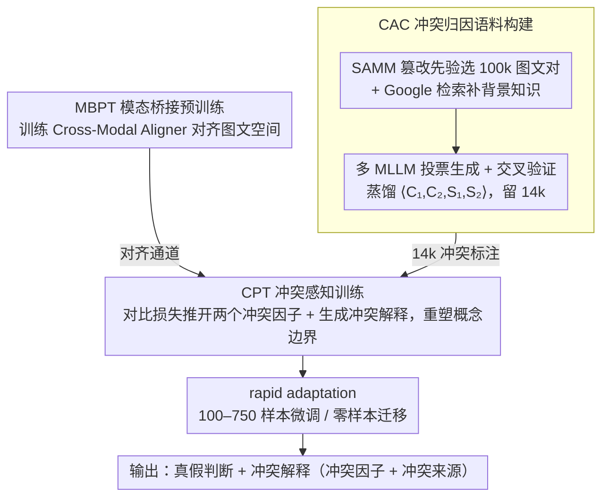

# CORE: Conflict-Oriented Reasoning for General Multimodal Manipulation Detection

**会议**: ICML 2026  
**arXiv**: [2606.03066](https://arxiv.org/abs/2606.03066)  
**代码**: https://github.com/shen8424/CORE  
**领域**: AIGC检测 / 多模态虚假信息 / MLLM推理  
**关键词**: 冲突推理, 多模态伪造检测, MLLM微调, 概念边界, 少样本泛化

## 一句话总结
作者把"多模态假新闻检测"重新定义为"显式捕获模态间或与世界知识之间的冲突"任务，构建了带细粒度冲突标注的 14k 语料 CAC，并提出 CORE 框架通过冲突感知训练（CPT）重塑 MLLM 的概念边界，使其在 DGM4、MDSM、MMFakeBench、NewsCLIPpings 四个数据集上以 100–750 个样本就大幅超过专用 SOTA。

## 研究背景与动机
**领域现状**：当前多模态假新闻检测主流是为每一类伪造（人脸属性篡改、整图替换、整文捏造、entity 替换）专门设计模型与训练范式，例如 HAMMER、ASAP 走对比+细粒度定位，RamDG 接外部知识库专攻名人新闻，SNIFFER、FKA-Owl、MMD-Agent、AMD 则在 MLLM 上各自堆专门的两阶段微调或多步推理。

**现有痛点**：这些方案与具体伪造模式绑死。生成模型迭代远快于数据收集和模型重训，遇到训练集没见过的新型篡改时性能急剧滑坡，作者把它叫做"数据依赖 + 设计刚性"。

**核心矛盾**：人识别假新闻并不靠"见过这一类"，而是靠"激活世界知识 → 找出内部矛盾"。比如"特朗普赢得足球奖"违反了"特朗普=政客"这一常识。现有判别式模型恰恰没有显式建模这种冲突，只是在隐式拟合像素层伪影。

**本文目标**：把通用检测能力拆成两件事 —— (i) 拥有世界知识，(ii) 把概念清晰地放进表征空间，使冲突可见。

**切入角度**：作者先做了两个验证性实验。Table 1 显示 MLLM 在 200 题世界知识基准上拿 96 ACC，而 CLIP/ALBEF 类只有 41，说明知识其实已经在 MLLM 里；但 t-SNE + 线性分类显示 Qwen2.5VL-3B 区分"美国总统 vs 足球奖项"只有 61 ACC，"美国总统 vs 英国首相"只有 53 ACC —— 概念边界是糊的。所以瓶颈不是知识缺失，而是概念边界缺失。

**核心 idea**：用一份带"冲突因子 + 冲突来源"标注的语料显式监督 MLLM 把冲突概念在表征空间里推开，从而把"判别特定伪造模式"换成"判别一切伪造背后共享的冲突结构"，进而获得对未见伪造类型的少样本/零样本泛化。

## 方法详解

### 整体框架
CORE 要解决的是"专用伪造检测器换个生成器就崩"，它的破局点是把任务从"识别某类篡改"换成"显式说出图文/常识间的矛盾"。围绕这个目标，作者先用多个 MLLM 投票蒸馏出一份带冲突标注的语料 CAC，再训一个轻量 Cross-Modal Aligner 把视觉与语言空间桥接好，最后用冲突感知训练把 MLLM 的概念边界重塑清晰；部署时只需 100–750 个目标域样本做 rapid adaptation，甚至零样本迁移。输入是一对 $(I, T)$ 图文新闻，输出是真假判断加自然语言冲突解释（冲突因子 + 冲突来源），backbone 实例化为 Qwen2.5VL-3B 与 Gemma3-4B 两套。

### 关键设计

**1. Conflict Attribution Corpus（CAC）：把"假新闻"标签拆成可定位的冲突监督**

模型要学冲突推理，前提是有人告诉它"矛盾具体是什么、来自哪儿"，但这种细粒度标注既难标又容易带单一模型的偏见。作者的做法是构一条"专家池 + 交叉验证"的流水线：从带篡改区域和篡改类型先验的 SAMM 数据集里挑 100k 对 $(I, T)$ 作底，用 Google Search API 拉对应实体的背景知识，再把图、文、篡改先验、背景知识喂给一个从 $\{$GPT-4o, Gemini2.5-Pro, Qwen3-VL-Plus$\}$ 随机抽的 MLLM 生成自然语言冲突解释，交叉给另外两个 MLLM 验真；通过后再随机选一个 MLLM 把解释蒸馏成结构化的 $\langle C_1, C_2, S_1, S_2 \rangle$（两个冲突因子 + 两个冲突来源），由剩下两个 MLLM 复审。最终留下 14k 样本，冲突来源分布为 29.98% 文本 / 36.86% 图像 / 33.16% 世界知识。来源刻意做成三分类且分布均衡，是为了强迫监督同时覆盖跨模态冲突与外部知识冲突，避免模型把"冲突"窄化成单纯的图文不一致；多模型投票则把任一 MLLM 的世界知识偏见摊薄。

**2. Modality Bridging Pre-Training（MBPT）+ Cross-Modal Aligner：先消模态 gap 再谈重塑概念**

CAC 里的冲突标注**统一以文本形式**给出，但其中很多冲突的来源其实在图像里（如"图像里的特朗普 vs 文本里的足球奖"）——要让模型据此判断，就得把这些"写成文本、实则源于视觉"的描述映射回视觉空间，否则监督信号会被模态 gap 稀释掉。为此作者引入一个轻量 Cross-Modal Aligner，实现为一层 cross-attention：文本特征作 Query、视觉特征序列作 Key/Value，输出文本引导的视觉特征；再用一个专门的预训练阶段（MBPT）锻造它的对齐能力——在 50k FineHARD 样本上用 SigLIP 式对比损失把正样本的图文特征拉近、难负样本推远，并配一个"图中是否含某物体"的 VQA 辅助任务保住语言能力。这一步只做"对齐"、不碰冲突监督，相当于把后续冲突推理要走的通道先铺通，让 CPT 重塑概念边界时不必再绕过模态鸿沟。

**3. Conflict-Perception Training（CPT）：用冲突监督重塑概念几何**

作者的验证实验发现 MLLM 其实"知道"世界知识（200 题知识基准拿 96 ACC），但概念边界是糊的（区分"美国总统 vs 足球奖项"的线性可分只有 61 ACC），直接接判别头只会让模型继续走"找像素纹理"的捷径。CPT 的思路是同时拟合"真假判定 + 冲突解释生成"。它对每个样本里标注的两个冲突因子 $C_1, C_2$ 取全局表征 $\mathbf{z}_1, \mathbf{z}_2$（若某因子来源是图像，就过 MBPT 训好的 Cross-Modal Aligner 取视觉特征，否则保留文本特征），用一个 conflict-aware 对比损失 $\mathcal{L}_{cacl}$ 把 $\mathbf{z}_1, \mathbf{z}_2$ 在语义空间里**推远**——这正是"建立清晰概念边界"的核心，因为伪造样本的本质就是两个本该一致的概念互相矛盾。CPT 总目标写成 $\mathcal{L}_{\text{CPT}} = \mathcal{L}_{cacl} + \mathcal{L}_{cr}$，其中 $\mathcal{L}_{cr}$ 是让模型生成"真/假 + 因为 $C_1$（来自 $S_1$）与 $C_2$（来自 $S_2$）冲突"这一解释的语言建模损失。这等价于强迫模型在喊出"假"之前先复述一遍"矛盾是什么、来自哪一模态"，把决策路径锁死在冲突推理上而非纹理捷径上。训练完成后 t-SNE（论文 Fig. 2b）显示原本混叠的"总统 vs 足球奖"被推开到几乎线性可分，定性印证了概念几何被重塑。

### 损失函数 / 训练策略
CORE 分两个训练阶段、各有损失，并非一个总目标。**MBPT 阶段** $\mathcal{L}_{mbpt} = \mathcal{L}_{cl} + \mathcal{L}_{o2vqa}$：$\mathcal{L}_{cl}$ 是 SigLIP 式的图文对比对齐损失（在 50k FineHARD 样本上把正样本的文本特征与对齐器抽出的视觉特征拉近、负样本推远），$\mathcal{L}_{o2vqa}$ 是一个"图中是否含某物体"的 VQA 辅助生成损失，用来保住模型原有的语言能力、辅助细粒度多模态理解。**CPT 阶段** $\mathcal{L}_{cpt} = \mathcal{L}_{cacl} + \mathcal{L}_{cr}$：$\mathcal{L}_{cacl}$ 把同一样本里的两个冲突因子表征推远以建立概念边界，$\mathcal{L}_{cr}$ 是生成"真假 + 冲突解释"的语言建模损失。**Rapid adaptation 阶段**则只构造一句"这条新闻真还是假"的指令、按语言生成损失 $\mathcal{L}_{ra}$ 做少样本微调，不为具体伪造类型做任何专门设计；零样本场景直接以 CPT 后的 checkpoint 推理，凭借冲突推理迁移到 DGM4、MMFakeBench 等域外数据。

## 实验关键数据

### 主实验
四个数据集（DGM4、MDSM、MMFakeBench、NewsCLIPpings）下，用 100–750（MMFakeBench 100–350）个目标域样本做适配，对比包括 235B 级别的 Qwen3VL、27B 的 Gemma3、HAMMER/HAMMER++/RamDG/FKA-Owl/AMD 等专用方案。

| 数据集 | 样本数 | CORE$_\text{Qwen}$ | 之前最佳基线 | 提升 |
|--------|--------|--------------------|--------------|------|
| DGM4 | 750 | 65.4 | 60.8 (Gemma3-4B) | +4.6 |
| MDSM | 750 | 74.5 | 63.0 (Gemma3-4B) | +11.5 |
| MMFakeBench | 350 | 79.4 | 68.3 (HAMMER++) | +11.1 |
| NewsCLIPpings | 750 | 71.0 | 61.4 (Gemma3-4B) | +9.6 |
| DGM4 | 100 | 59.7 | 51.6 (Qwen3VL-235B) | +8.1 |
| MMFakeBench | 100 | 73.5 | 61.1 (Gemma3-4B) | +12.4 |

CORE$_\text{Gemma}$ 在 MDSM 750 样本下进一步刷到 82.0。值得注意的是 235B 级 zero-shot MLLM（Qwen3VL-235B、Gemma3-27B、LLaMA3.2-90B、SeedVL-1.5）在所有数据集上都被 3B/4B 级 CORE 显著反超 —— 说明问题不在参数量而在概念边界。

### 消融实验
论文给出的关键消融可整理如下：

| 配置 | MMFakeBench-350 ACC | 说明 |
|------|---------------------|------|
| CORE$_\text{Qwen}$ Full | 79.4 | 完整 CAC + MBPT + CPT |
| w/o CPT | ~66.5 | 退化到只做对齐的 Qwen2.5VL，与基线相当 |
| w/o source 监督 | 中等下降 | 模型分不清冲突来自哪一模态，跨模态冲突最受损 |
| w/o factor 监督 | 中等下降 | 只能输出"假"标签，泛化到新伪造时不稳 |
| w/o MBPT | 明显下降 | 跨模态对齐缺失导致 CPT 监督信号被稀释 |

### 关键发现
- 概念边界比参数量重要：3B 的 CORE 全面压过 235B 级 zero-shot MLLM，说明假新闻检测的瓶颈是"对自己的知识有没有清晰边界"，不是"知道多少"。
- 冲突来源监督是泛化关键：去掉 source 监督后跨模态冲突类样本（NewsCLIPpings 一类的图文实体替换）掉点最猛，说明显式建模"冲突从哪儿来"逼模型学到模态对齐先验。
- 在最低样本量下优势最大：MMFakeBench 100 样本时 CORE 比最强基线高 +12.4，说明冲突推理是真正的"先验"，而不是另一种过拟合捷径。
- t-SNE 直接可视化：训练前"美国总统 vs 足球奖项"完全混叠（线性可分仅 61），CORE 训练后两簇明显分离，定性印证 CPT 的概念几何重塑。

## 亮点与洞察
- 把"伪造检测"翻译成"冲突推理"：这是范式级别的换框，定位很像 DeepFake 检测领域的 chain-of-thought 时刻 —— 不再追像素伪影，而是追语义/常识矛盾，自动获得对未见生成器的鲁棒性。
- 用三个 MLLM 投票生成 + 复审 CAC：这种 "expert pool + cross-validation" 流水线可以直接搬到其他"难标的细粒度推理类语料"上，比如医疗诊断解释、法律证据冲突。
- 概念边界 vs 概念知识的拆分非常清晰：Table 1 + t-SNE 这一对实验把"MLLM 知道但说不清"的痛点量化了，给后续 MLLM 微调研究提供了一个可复用的诊断协议。
- view-agnostic 的少样本设定：100 样本就能在四个差异极大的数据集上稳定起飞，说明 CPT 学到的是任务无关的"冲突感知 prior"，rapid adaptation 只需要校准"什么算冲突"的阈值。

## 局限与展望
- 14k CAC 仍偏小且依赖 SAMM 的篡改先验，对完全合成（如端到端 diffusion 生成的整图整文）样本的覆盖度未知；CAC 自身是 MLLM 生成的，可能继承 GPT-4o/Gemini 的世界知识偏差。
- 实验未报告对抗鲁棒性 —— 攻击者只要在生成时显式抹除"常识矛盾"（比如把"特朗普 + 足球"换成"足球运动员 + 足球奖"），CORE 的优势可能被削弱。
- 只评估了 3B/4B MLLM；冲突推理是否随 backbone 规模继续 scale、以及与 R1 类显式 CoT 推理的叠加效果尚未验证。
- 冲突来源仅三分类（文本/图像/世界知识），对于音频/视频/时间一致性这类多模态扩展需要重新设计标注 schema。

## 相关工作与启发
- **vs HAMMER / HAMMER++**：他们用对比 + 细粒度定位模块专攻图文不一致，CORE 不设专门定位头而是用 MLLM 的语言端直接输出冲突解释，从单一冲突类型扩到通用冲突，少样本时显著占优（DGM4-750 +7.5 ACC）。
- **vs FKA-Owl**：FKA-Owl 在 MLLM 上接外部知识库专打"常识谬误"，CORE 直接利用 MLLM 自带知识，仅通过 CPT 重塑概念边界 —— 不依赖检索就实现了同类能力，且在四个数据集上全面反超 FKA-Owl 10+ 个点。
- **vs MMD-Agent / AMD**：这两者堆"多步推理 + 区域坐标 + 篡改类型"等强先验，CORE 只保留冲突因子/来源这一层最抽象的监督，反而泛化更好，说明在 MLLM 之上"少即是多" —— 任务相关的强结构反而限制了 backbone 的迁移性。
- **vs zero-shot 大 MLLM (235B 级)**：Qwen3VL-235B、Gemma3-27B 在 DGM4 上停留在 50 ACC 附近，CORE-3B 直接拉到 65+，提示我们 MLLM 的"假新闻检测能力"主要被概念边界而非参数量瓶颈。

## 评分
- 新颖性: ⭐⭐⭐⭐⭐ "用显式冲突监督重塑 MLLM 概念边界"是该任务上少见的范式级换框。
- 实验充分度: ⭐⭐⭐⭐ 四个数据集 × 多样本量 + 多 backbone 对比，对抗与生成式整图样本的覆盖稍弱。
- 写作质量: ⭐⭐⭐⭐ 动机三段式（知识 vs 边界）非常清晰，方法节内部子标题层级略乱。
- 价值: ⭐⭐⭐⭐⭐ 范式 + 数据集双重产出，CAC 本身就足以成为子社区基准。

<!-- RELATED:START -->

## 相关论文

- [\[NeurIPS 2025\] ASCIIBench: Evaluating Language-Model-Based Understanding of Visually-Oriented Text](../../NeurIPS2025/aigc_detection/asciibench_evaluating_language-model-based_understanding_of_visually-oriented_te.md)
- [\[NeurIPS 2025\] Reasoning Compiler: LLM-Guided Optimizations for Efficient Model Serving](../../NeurIPS2025/aigc_detection/reasoning_compiler_llm-guided_optimizations_for_efficient_model_serving.md)
- [\[ICML 2026\] Black-Box Detection of LLM-Generated Text Using Generalized Jensen-Shannon Divergence](black-box_detection_of_llm-generated_text_using_generalized_jensen-shannon_diver.md)
- [\[ICML 2026\] Feature-Augmented Transformers for Robust AI-Text Detection Across Domains and Generators](feature-augmented_transformers_for_robust_ai-text_detection_across_domains_and_g.md)
- [\[ICML 2026\] On the Salience of Low-Probability Tokens for AI-Generated Text Detection: A Multiscale Uncertainty Perspective](on_the_salience_of_low-probability_tokens_for_ai-generated_text_detection_a_mult.md)

<!-- RELATED:END -->
