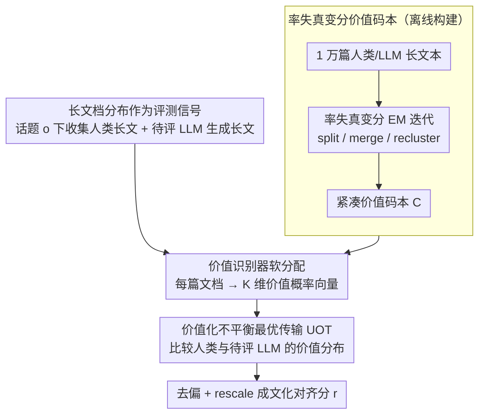

# Distributional Open-Ended Evaluation of LLM Cultural Value Alignment Based on Value Codebook

**会议**: ICML 2026  
**arXiv**: [2604.06210](https://arxiv.org/abs/2604.06210)  
**代码**: 无  
**领域**: LLM对齐 / 文化价值评估  
**关键词**: 文化对齐, 价值评估, 价值码本, 率失真, 不平衡最优传输

## 一句话总结
DOVE 用率失真变分优化从 1 万篇人类文本中自动构造紧凑的"价值码本"，再用不平衡最优传输度量人类与 LLM 长文本在价值空间上的分布差异，从而在 12 个 LLM 上把"评测—下游任务"相关性从基线 ≤24% 拉到 31.56%。

## 研究背景与动机

**领域现状**：现有 LLM 文化价值评测要么直接套用社会科学问卷（WVS、Hofstede），要么用人工/LLM 写好的多选题让模型从几个选项中挑一个最贴近某文化的答案；少数生成式工作也只在开放回答里抽抽关键词或让 LLM 当裁判打分。

**现有痛点**：作者把这一类工作收敛到一个统一槽点 —— **C³ challenge**（Construct / Composition / Context 三道鸿沟）：(1) Construct gap：判别式选择题只能查"价值知识"，模型答对不代表它真有那种价值倾向，且对选项框架、社会期望偏差非常敏感；(2) Composition gap：把题目分数平均成一个总分会把"同文化内部子群体的异质性"完全抹平；(3) Context gap：约束式选题与 LLM 真实部署时的开放式长文本生成场景严重错位。

**核心矛盾**：要忠实地刻画"一个 LLM 在面对某文化时表达出的价值倾向"，本质上是在比较两个**长文本分布**（人类写的 vs. LLM 写的）。但长文本里既有价值信号、也有大量价值无关的内容，传统问卷做不到、词袋/规则做不准、纯 LLM-as-judge 又不稳定。

**本文目标**：构造一个不依赖预定义价值体系、不依赖选项框架的开放式分布级评测框架，能同时填上 C³ 三个 gap，并在下游真实任务上有更强的预测效力。

**切入角度**：作者借社会科学里"coding"的传统 —— 把长文档压缩到一组离散的"价值码"上，把它当作 lossy compression 问题，于是可以用 **率失真理论** + **VQ-VAE 风格的变分优化**自动学一个价值码本；分布比较则用**不平衡最优传输（UOT）**，既保留几何结构，又能容忍子群体导致的质量不匹配。

**核心 idea**：把"评 LLM 文化对齐"重写成"在自动学到的价值码本上比较两个分布的 UOT 距离"。

## 方法详解

### 整体框架
DOVE 要回答的核心问题是"一个 LLM 在某文化语境下表达出的价值倾向，到底有多接近真人"，它把这件事翻译成一个分布比较问题。给定目标文化 $\bm g$（如日本）和待评 LLM $p_{\bm\theta}$，它先收集该文化的人类长文本 $\hat p^{\bm g}(\bm x)$ 和 LLM 在相同话题 $\bm o$ 上生成的长文本 $p_{\bm\theta}(\bm x|\bm o)$，再在一组自动学到的紧凑**价值码本** $\mathcal{\bm C}=(\bm c_1,\dots,\bm c_K)$ 上把每篇文档投影成 $K$ 维价值概率向量，最后用不平衡最优传输度量人类侧分布 $\bm a^{\bm g}$ 与 LLM 侧分布 $\bm a^{\bm\theta}$ 的距离并 rescale 成对齐分。整套流程不微调任何 LLM 参数，价值识别器 $q_{\bm\omega}$ 和重构器 $p_{\bm\phi}$ 都是黑盒调用，码本则通过 ICL + 变分 EM 迭代得到。

### 关键设计

**1. 率失真变分价值码本：把"用什么价值体系"这道难题交给数据**

传统价值评测要么绑死 Schwartz/Hofstede 等先验体系（带进研究者偏差），要么纯靠 LLM 抽关键词（噪声大、容易复述价值无关语义），这正是 Construct gap 的根源。DOVE 的做法是把"文档 $\bm x$ → 价值码序列 $\bm s$"看成一次有损压缩，把码本当作 VQ-VAE 的离散 latent，让一个紧凑、信息量大、低冗余的价值码集合从无标签长文本里自动浮现，作为后续比较的公共"坐标系"。

具体先推一个 ELBO：$\mathbb E_{\hat p(\bm x)}[\log p(\bm x|\mathcal{\bm C})] \ge \mathbb E_{\hat p(\bm x)}\{\mathbb E_{q_{\bm\omega}}[\log p(\bm x|\bm s,\mathcal{\bm C})] - \mathrm{KL}[q_{\bm\omega}\|p(\bm s|\mathcal{\bm C})]\}$，再叠加率失真正则得到最终目标（Eq. 3），它由三项构成：信息保留项 $-\log p_{\bm\phi}(\bm x|\bm s,\mathcal{\bm C})$ 保证码能还原原文、单文档码熵项 $-\beta_1 H_q(\bm s|\bm x,\mathcal{\bm C})$ 鼓励一篇文档多用几个码避免独占、先验熵项 $\beta_2 H_q(\bm s|\mathcal{\bm C})$ 鼓励所有码被均匀使用。把"信息保留"和"冗余减少"这样显式写进目标，码本就被逼着既不丢价值信号又不堆冗余维度。求解用 Variational EM 风格的黑盒优化：每一轮先采 $N_1$ 组码 $\bm s_j$ 估出码本得分 $\mathcal S(\mathcal{\bm C}^{t-1})$，再按三类原子动作刷新码本（Algorithm 1）——某码使用计数 $n_k$ 过高且失真持续大时做 **Extension**（split 成更细的码）、低使用率的码做 **Merge**（与最近邻合并）、整体做 **re-creation**（重聚类生成新码）。投影侧的价值识别器 $q_{\bm\omega}$ 先从文档抽 $M'$ 条自然语言价值短语 $\bm v$，再按 $q_{\bm\omega}(z=k|\bm x,\mathcal{\bm C})=\frac{1}{M'}\sum_j \mathrm{softmax}_{\mathcal{\bm C}}[\mathrm{sim}(\bm e_{\bm v_j},\bm e_{\bm c_k})/\sigma^2]$ 做软分配而非 hard arg-max，从而压住单点指派带来的噪声。

**2. 价值化不平衡最优传输度量：让分布形状而非均值说话**

填平 Construct gap 后还有 Composition gap——把每题分数取平均（WVS/CDEval 的做法）会把"同一文化里不同子群体的价值分歧"压成一个均值，恰恰丢掉了最该保留的分布形状。DOVE 把 $K$ 个价值码当作传输空间的中心点，用不平衡最优传输（UOT）比较 $\bm a^{\bm g}$ 与 $\bm a^{\bm\theta}$，目标为 $\mathcal D_{\mathrm{UOT}}(\hat p^{\bm g},p_{\bm\theta})=\min_{\bm\pi\ge 0}\sum_{i,j}[D_{i,j}\bm\pi_{i,j}+\epsilon\bm\pi_{i,j}(\log\bm\pi_{i,j}-1)]+\gamma\mathrm{KL}[\bm\pi\bm 1\|\bm a^{\bm g}]+\gamma\mathrm{KL}[\bm\pi^T\bm 1\|\bm a^{\bm\theta}]$。之所以用 UOT 而不用 KL 或标准 OT：KL 会被零质量项卡死，而 UOT 允许两边总质量不严格一致，正好契合"LLM 与真人的价值分布可能在某些码上有结构性缺位"的现实，同时保留 Wasserstein 的几何性质。

代价矩阵 $D_{i,j}$ 的设计是这一步的点睛处：它不只算价值码之间的语义距离 $\rho(\bm c_i,\bm c_j)$，还乘上一个**共现折扣** $1-\mathbb E[\min(\bm a_i,\bm a_j)]/(\mathbb E[\max(\bm a_i,\bm a_j)]+\epsilon_2)$——两个价值在人类文档里越常一起出现，它们之间的运输成本就越低。这符合"语义近、且常并存的价值之间互相替换是合理的"这一直觉，避免了纯语义 OT 因为很多价值词面不近却常并存而高估文化差异。求解用 Unbalanced Sinkhorn 迭代，最后做 debias 把分布自身的"基线距离"减掉 $\mathcal D_{\mathrm{UOT}}\leftarrow \hat{\mathcal D}_{\mathrm{UOT}}(\hat p^{\bm g},p_{\bm\theta})-\tfrac12\hat{\mathcal D}_{\mathrm{UOT}}(\hat p^{\bm g},\hat p^{\bm g})-\tfrac12\hat{\mathcal D}_{\mathrm{UOT}}(p_{\bm\theta},p_{\bm\theta})$，再 rescale 成 $r=(0.1-\mathcal D_{\mathrm{UOT}})\times 10$ 作为最终对齐分。

**3. 长文档分布作为评测信号：让媒介与部署场景对齐**

第三道 Context gap 来自评测载体本身：约束选项加平均打分天然限制了价值表达的丰富度，也与 LLM 实际部署的开放生成场景严重错位，而短答 QA 又捕获不到价值的分布式特性。DOVE 干脆放弃多选题和 Likert 量表，以话题 $\bm o$（如"金钱在生活中的作用"）为条件，让被评 LLM 自由生成 essay/blog 等长文本 $\bm x\sim p_{\bm\theta}(\bm x|\bm o)$，再去比较人类 vs LLM 写出的长文本分布——这与心理学里"作文反映人格"的观察一致，长文本比短答案承载更稳定的价值信号，也让评测信号、表达媒介、部署场景第一次对齐。为支撑这一设计，作者构建了 **DOVE Set**：覆盖 KR/JP/CN/US 四种文化、824 个 value-oriented 话题、15,213 篇平均 1,034 token 的人类长文档，并经人工筛除重复、噪声与价值无关样本。

### 损失函数 / 训练策略
DOVE 不更新任何 LLM 参数。$q_{\bm\omega}$ 用 GPT-5.2，$p_{\bm\phi}$ 用 GPT-4.1 nano，嵌入用 OpenAI text-embedding-3-large。码本优化是一个 Variational EM 风格的迭代：固定 $\mathcal{\bm C}^{t-1}$ 估计 $\mathcal S(\mathcal{\bm C}^{t-1})$，再按 split/merge/recluster 三类原子动作得到 $\mathcal{\bm C}^t$，直到分数收敛或达到 $T=10$ 轮。超参 $N_1=3,N_2=1,\beta_1=0.3,\beta_2=0.08,\tau_1=1.0$；训练语料含人类与 GPT-4o/DeepSeek-v3.1/Llama-4-Maverick 生成的混合文档共 $N=10,676$ 篇。

## 实验关键数据

### 主实验（效度对比）

| 方法 | $\Delta^{\bm g}\uparrow$ Value Priming | $\delta_{\text{con}}$ Convergent | $\delta_{\text{dis}}\uparrow$ Discriminant | 下游任务平均相关性 $\uparrow$ |
|------|---:|---:|---:|---:|
| WVS | 0.08% | -9.76% | 0.98% | 16.20% |
| GOQA | -1.56% | -17.95% | -2.05% | -13.05% |
| CDEval | 0.76% | -14.40% | 1.79% | 23.56% |
| NormAd | 4.25% | -1.57% | -23.70% | 0.90% |
| NaVAB | -1.15% | 4.43% | -88.00% | -20.77% |
| **DOVE** | **5.60%** | **6.00%** | 0.89% | **31.56%** |

DOVE 在跨 12 个 LLM × 4 种文化的设置下，下游"文化有害内容检测"任务（KOLD / HateXplain 等 5 个数据集）的预测相关性达到 31.56%，是次优 CDEval 的 1.3 倍；多个基线甚至给出负相关，说明它们的评测结果对真实部署几乎没有指示意义。

### 消融与可靠性

| 维度 | DOVE 表现 | 说明 |
|------|----------|------|
| 采样可靠性（Cronbach α） | 高 | 每文化 500 篇即稳定 |
| Test–retest 稳定性 | 高 | 三次独立运行分数一致 |
| 模板不变性 | 高 | 改 prompt 模板分数稳定，优于 WVS / NormAd |
| 话题数鲁棒性 | 300 题即超过所有基线 | 远比 LLM benchmark 通常需要的大规模题目高效 |
| 码本大小敏感性 | $\mathcal S(\mathcal{\bm C})$ 与效度正相关 | 小码本容量不足、大码本冗余拖累，印证 R1+R2 设计 |

### 关键发现
- 所有约束式方法（WVS/GOQA/CDEval/NormAd）的 convergent validity 都是负数 —— 说明它们彼此之间的打分都互相矛盾，问卷/多选题在"测同一个东西"这件事上根本没达成一致；DOVE 才把这一项拉到正区间。
- NaVAB 的 discriminant validity 跌到 -88%，作者归因于它依赖人写好的参考陈述，无法分辨文化相似度结构；这恰好说明"开放生成 + 自动码本"相对"开放生成 + 预定义参考"的本质优势。
- Value priming 实验（给模型注入某种文化 ICL 后看分数能否随之上升）里只有 DOVE 与 NormAd 给出显著正向 $\Delta^{\bm g}$，且 DOVE 在反向文化 $\bm g^-$ 上给出最大负向 $\Delta^{\bm g^-}=-5.38\%$，方向性最干净。

## 亮点与洞察
- 把"评测设计"问题重写成"率失真有损压缩 + 最优传输"问题，是这篇最让人"啊哈"的地方 —— 它直接借了表示学习里非常成熟的两套工具，绕开了"该用什么价值体系"这一社会科学里没法收敛的争吵。
- "共现折扣"的代价矩阵设计很巧：仅靠语义相似度的 OT 会高估文化差异（因为很多价值在词面上不近但在人写作里常并存），把数据驱动的共现引入 cost，让度量更贴近真实"文化语义几何"，这一 trick 可迁移到任何需要"概念分布"对比的评测里（如 persona / style 评估）。
- 不微调 LLM、纯 ICL + 变分 EM 完成码本学习，让整个 pipeline 可以无缝切换底层 LLM；这意味着随着 LLM 升级，DOVE 的"评测器"自动跟着升级，不需重新设计基准。

## 局限与展望
- 评测仍重度依赖 GPT-5.2 / GPT-4.1 nano / OpenAI 嵌入这条工具链，码本里隐含的"价值视角"难免带闭源 LLM 自身偏差，与"评 LLM 文化对齐"的目标存在循环风险。
- 仅覆盖 KR/JP/CN/US 四种"国家级"文化粒度，对次文化、跨地域亚群体的捕获能力没有直接验证；UOT 虽支持子群体异质性，但当前 DOVE Set 的 824 话题主要按"国家"采样。
- 下游"预测有效性"以仇恨/有害文本检测为代理任务，与"价值对齐"并非等价；若换成创作偏好、规劝伦理等其他下游，31.56% 的相关性能否复现仍待验证。
- 改进方向：把码本扩展为多层级（universal → cultural → sub-group），并用 contrastive 目标显式约束跨文化码区分度；同时把 $q_{\bm\omega}$ 换成开源小模型以打破"闭源 LLM 评测闭源 LLM"的循环。

## 相关工作与启发
- **vs WVS / GOQA / CDEval**：他们用问卷/多选题测"价值知识"，DOVE 用长文本分布测"价值倾向"；在 12 个 LLM 上 DOVE 的下游相关性比这三者高 8–44 pp，根本差异在评测载体而非细节调参。
- **vs NaVAB**：同样走开放生成路线，但 NaVAB 用人写参考陈述判分，受参考偏差严重（discriminant validity -88%）；DOVE 用自学码本，把"参考"从人写陈述抽象成数据驱动的码集合。
- **vs LLM-as-a-judge 风格的生成式评测（Shi 2024, Mushtaq 2025）**：那类方法直接让 LLM 给开放回答打分，可靠性受裁判模型情绪/框架影响；DOVE 把"裁判判断"拆成"识别价值码 + 计算分布距离"两步，每一步都用率失真目标约束，可解释、可复现。
- 启发：任何"模型行为与人类参考行为是否一致"的评测（人格、风格、安全、专业领域 alignment 等）都可以套用"自学离散码 + OT 比分布"这一范式，比单一聚合分更能反映人群分布结构。

## 评分
- 新颖性: ⭐⭐⭐⭐⭐ 用率失真 + UOT 把价值评测的三道 gap 一次性框死，方法论上很干净。
- 实验充分度: ⭐⭐⭐⭐ 12 个 LLM × 4 文化 × 5 个基线 + 三类可靠性 + 码本可视化，配 15K 文档数据集，覆盖面充分；缺一点"码本质量人类盲评"。
- 写作质量: ⭐⭐⭐⭐⭐ C³ 框架立得稳，公式推导和算法伪码一气呵成，读完能复现整个 pipeline。
- 价值: ⭐⭐⭐⭐⭐ 提供一套真正可扩展的 LLM 文化对齐评测框架，且 DOVE Set 本身就是稀缺资源，对 alignment 社区有直接推动力。

<!-- RELATED:START -->

## 相关论文

- [\[NeurIPS 2025\] Can LLMs Write Faithfully? An Agent-Based Evaluation of LLM-generated Islamic Content](../../NeurIPS2025/aigc_detection/can_llms_write_faithfully_an_agent-based_evaluation_of_llm-generated_islamic_con.md)
- [\[CVPR 2025\] SGC-Net: Stratified Granular Comparison Network for Open-Vocabulary HOI Detection](../../CVPR2025/aigc_detection/sgc-net_stratified_granular_comparison_network_for_open-vocabulary_hoi_detection.md)
- [\[ICML 2026\] Black-Box Detection of LLM-Generated Text Using Generalized Jensen-Shannon Divergence](black-box_detection_of_llm-generated_text_using_generalized_jensen-shannon_diver.md)
- [\[ACL 2026\] Temporal Flattening in LLM-Generated Text: Comparing Human and LLM Writing Trajectories](../../ACL2026/aigc_detection/temporal_flattening_in_llm-generated_text_comparing_human_and_llm_writing_trajec.md)
- [\[AAAI 2026\] Optimized Algorithms for Text Clustering with LLM-Generated Constraints](../../AAAI2026/aigc_detection/optimized_algorithms_for_text_clustering_with_llm-generated_constraints.md)

<!-- RELATED:END -->
