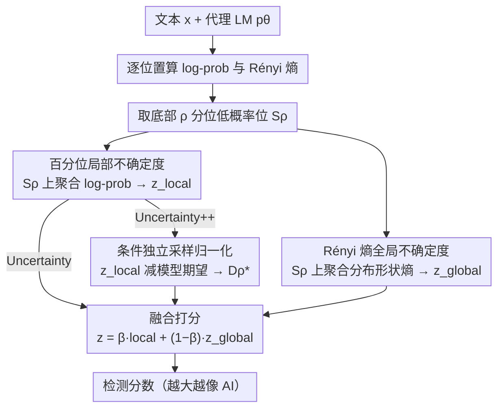

# On the Salience of Low-Probability Tokens for AI-Generated Text Detection: A Multiscale Uncertainty Perspective

**会议**: ICML 2026  
**arXiv**: [2606.02158](https://arxiv.org/abs/2606.02158)  
**代码**: https://github.com/guoyikai2000/Uncertainty-AIGT  
**领域**: AIGC 检测 / 统计式 AI 文本检测 / 零样本检测  
**关键词**: AIGT 检测, 低概率 token, Rényi 熵, 多尺度不确定性, 条件独立采样

## 一句话总结
针对零样本 AI 生成文本检测里"高频 boilerplate 稀释信号"和"单点概率脆弱"两大痼疾，作者提出 Uncertainty / Uncertainty++ 检测器：只在每段文本底部 $\rho$ 分位的低概率 token 上聚合 log-prob，并叠加同一组位置上的 Rényi 熵作为分布形状信号，再在 12 个生成器、7 个数据集上把平均 AUROC 从 Lastde 的 86.49 推到 88.74，且在改写 / 改解码这类扰动下显著更稳。

## 研究背景与动机

**领域现状**：当前的 AI 文本检测主流分三家——水印（generation 时埋签名）、fine-tune 判别器（在标注语料上训分类头）、统计式（用代理 LM 算 token 级 likelihood 再聚合）。水印对绝大多数公开 LLM 失灵，fine-tune 跨生成器跨域泛化差且贵；统计式因为"效率 + 泛化"两个好处，仍然是零样本场景的事实标准，代表方法包括 Likelihood / LogRank / DetectGPT / DetectLRR / Fast-DetectGPT / Lastde 等。

**现有痛点**：统计式方法当前卡在两个具体问题上。
第一是 **boilerplate dominance**：把所有 token 的 $\log p_\theta(x_i \mid x_{<i})$ 不加区分地平均，会被人和 LLM 共享的高概率套话（"propose an efficient framework"、"in this paper we"）稀释——这些 token 在两类文本上得分都很高，对分类毫无贡献却拉走平均，导致人写文本被误判为 AI。
第二是 **brittle point estimates**：把每个位置的整个条件分布坍缩成"实际 token 的那个概率"这一个标量，丢掉了分布形状信息；只要做个改写或换个 decoding 策略，这个点估计就被推得很远，决策直接翻转。

**核心矛盾**：boilerplate 之所以稀释信号，是因为它分布在分布的头部（高概率区域）；点估计之所以脆弱，是因为它只看一个采样实现而非整个分布。前者要求"挑出真正有区分度的位置"，后者要求"用分布级特征而非点特征"。一个自然的猜测是：判别性信号集中在低概率 token 上，且应该用分布级别的不确定度量（熵）而非单点 log-prob 来描述。

**本文目标**：在不重训、零样本的前提下，造一个既扛 boilerplate 又扛改写的统计检测器。

**切入角度**：作者验证了 "Low-Probability Discriminability" 假设——在 XSum + LLaMA3-8B + GPT-J 上，把底部 $\rho=0.15$ 的低概率位置和顶部高概率位置分开统计，前者上 Human–AI LogRank gap 是 1.59（vs 高概率位的 0.45，3.5×），概率比 AI/Human 为 9.69× vs 1.38×。这意味着低概率位置上的统计信号是高概率位的近一个数量级，值得专门聚合。

**核心 idea**：只在低概率分位上聚合两个互补信号——局部 log-prob 均值（反映 token 实际有多"惊讶"）+ 全局 Rényi 熵均值（反映该位置整个分布的形状），融合成一个统一 score，必要时再用条件独立采样做归一化拿到 Uncertainty++。

## 方法详解

### 整体框架

方法要解决的是"全序列平均把判别信号稀释、单点 log-prob 又太脆弱"这一对老问题。做法是给任意文本 $\mathbf{x}=\{x_i\}_{i=0}^{n-1}$ 配一个 proxy / source LM $p_\theta$，先在每个位置上同时读出"实际 token 的对数概率"和"整个条件分布的 Rényi 熵"，再只挑序列内概率最低的那一小撮位置，在这撮位置上把局部 log-prob 信号和全局熵信号加权融成一个标量分，分越大越像 AI；Uncertainty++ 则把局部信号换成条件独立采样归一化后的版本以求更稳。

### 关键设计

**1. 百分位局部不确定度：把平均池缩到低概率位以抑制 boilerplate 稀释**

痛点在于把所有 token 的 $\log p_\theta(x_i\mid x_{<i})$ 不分青红皂白地平均，会被人和 LLM 共享的高概率套话拉走。作者因此定义百分位聚合算子 $\mathcal{Q}_\rho(\{y_i\}) = \frac{1}{|\mathcal{S}_\rho|}\sum_{i \in \mathcal{S}_\rho} y_i$，其中 $\mathcal{S}_\rho$ 是按实际概率值排序后底部 $\rho$ 分位的位置集合，把它作用到 token 级 log-prob 上得到局部信号 $z_\text{local} = \mathcal{Q}_\rho(\{\log p_\theta(x_i \mid x_{<i})\}_{i=1}^{n-1})$。这么做有效，是因为判别力恰恰藏在"AI 在该选低概率词时并不真选得那么低"这一不对称里：Proposition 3.2 指出 $\mathcal{Q}_\rho$ 是凹算子，Jensen 不等式给出 $\mathbb{E}\,\mathcal{Q}_\rho \le \mathcal{Q}_\rho(\mathbb{E})$；Proposition 3.3 进一步实证发现 AI 文本上归一化后的 Percentile Discrepancy $D_\rho^* = 2.18$ 远大于 Jensen 下界 $\tilde{D}_\rho^* = 1.34$ 和全序列基线 $D_1^* = 1.43$，而人写文本上三者都 $\approx 0$。正是这种只在 AI 文本上出现的"Jensen 放大不对称"，让低概率聚合比 Fast-DetectGPT 多挖出一截信号。$\rho$ 越小信号越纯但方差越大，默认取 0.15 作平衡点。

**2. 基于 Rényi 熵的全局不确定度：用分布形状代替单点采样以扛改写**

第二个痛点是把整个条件分布坍缩成"实际 token 那一个概率"会丢掉分布形状，一旦改写或换 decoding 就被推翻。对策是改用 $\alpha$ 阶 Rényi 熵 $H_\alpha(p) = \frac{1}{1-\alpha}\log\sum_{v \in \mathcal{V}} p(v)^\alpha$ 来刻画该位置整个分布的不确定度，并同样只在低概率集合 $\mathcal{S}_\rho$ 上平均：$z_\text{global} = \frac{1}{|\mathcal{S}_\rho|}\sum_{i \in \mathcal{S}_\rho} H_\alpha(p_\theta(\cdot \mid x_{<i}))$。它扛扰动是有解析依据的：Proposition 3.4 证明在多项式扰动 $p \to p/\gamma$ 下，log-prob 会精确变 $\log\gamma$ 并随 $\gamma\to\infty$ 无界增长，而 Rényi 熵的变化在低概率位置（$p_\theta(x_i)\le\tau$ 且 $\tau\le(S_\alpha/2)^{1/\alpha}$）上有界为 $O(\tau^{\min(\alpha,1)})$，即便 $\gamma$ 不断升高仍有界。阶数 $\alpha$ 在这里是一个旋钮——$\alpha<1$ 更重视分布尾部、$\alpha>1$ 更重视头部，构成 vocabulary 维度上的选择性偏置，与 token 维度上的低概率筛选正交互补；把 $\mathcal{Q}_\rho$ 同样套到熵上还顺带让局部和全局两路共享同一个 $\rho$，简化系统。

**3. 条件独立采样归一化：把局部信号对齐到模型自身期望得到 Uncertainty++**

局部 log-prob 的绝对值会随文本长度和领域漂移，不便跨样本比较。作者借鉴 Fast-DetectGPT 的"实际 vs 期望"思路，把 $z_\text{local}$ 减掉它在模型自己分布下的期望：在每个位置用原始 prefix $x_{<i}$（而非已采样 token）独立采 $\tilde{x}_i \sim p_\theta(\cdot \mid x_{<i})$，定义 Percentile Discrepancy $D_\rho = z_\text{local} - \mathbb{E}\,\mathcal{Q}_\rho(\{\log p_\theta(\tilde{x}_i \mid x_{<i})\})$ 及其归一化版 $D_\rho^* = D_\rho / \sqrt{\mathrm{Var}\,\mathcal{Q}_\rho(\{\log p_\theta(\tilde{x}_i \mid x_{<i})\})}$，实际用 $m$ 个独立 Monte Carlo 样本估计均值与方差。AI 文本的实际 log-prob 显著高于其分布期望（$D_\rho^*\gg 0$），人写文本则贴着期望走（$D_\rho^*\approx 0$），这种归一化既吃到分位筛选的判别增益又保留稳定性。最终 Uncertainty++ 分数把归一化后的局部信号与全局熵信号融合：$z_{++} = \beta D_\rho^* + (1-\beta) z_\text{global}$（基础版 Uncertainty 则直接用 $z_\text{local}$ 替换 $D_\rho^*$）。

### 损失函数 / 训练策略

整个方法是 training-free 的零样本检测器，不涉及参数训练。所有调参（百分位 $\rho$、Rényi 阶 $\alpha$、融合权重 $\beta$、采样数 $m$）在验证集上做 grid search，论文 Section 4 的 Figure 3 给出敏感性曲线。

## 实验关键数据

### 主实验

| 方法 | 平均 AUROC（12 source models × 3 datasets, black-box） | 类别 |
|------|------|------|
| Likelihood | 71.33 | 概率法基线 |
| LogRank | 74.83 | 概率法基线 |
| DetectLRR | 80.28 | 概率法 SOTA |
| Lastde | 86.49 | 概率法此前最强 |
| **Uncertainty (本文)** | **88.74** | **概率法新 SOTA**，相对 Lastde +2.25 |
| DetectGPT | 70.94 | 采样法基线 |
| DetectNPR | 略高于 DetectGPT | 采样法基线 |

12 个生成器横向看，本文在 GPT-2、GPT-Neo-2.7B、Llama2-13B、Gemma-7B、Phi-2、GPT-4-Turbo 上都拿到了最佳或并列最佳（在 Llama3-8B 上略输 Likelihood，因为 Likelihood 在该模型上已经 99.57，被天花板效应主导）。

### 消融与稳健性

| 配置 | 现象 | 含义 |
|------|---------|------|
| 全量平均 ($\rho = 1$) | 退化到接近 Fast-DetectGPT | 验证"分位筛选"本身贡献了核心增益 |
| 关掉 $z_\text{global}$（只留 local） | 对改写 / 换 decoding 显著掉点 | Rényi 熵确实承担了"扛扰动"角色 |
| 关掉 $z_\text{local}$（只留 global） | 简单数据集上掉点更多 | 局部 log-prob 仍是主判别信号 |
| Uncertainty → Uncertainty++ | 跨域 / 跨生成器更稳，AUROC 进一步小幅提升 | 条件独立采样归一化吸收了文本长度 / 领域偏差 |
| 改变 $\rho$ | 太小 → 方差大，太大 → 信号弱，0.10–0.20 区间最佳 | 与"低概率 token 携带强信号"假设一致 |
| 改变 $\alpha$ | $\alpha < 1$ 强调尾部、和分位筛选互补效果最好 | 印证分布形状信号需要 vocab 维度的尾部偏置 |

### 关键发现

- 在 XSum + LLaMA3 + GPT-J 上量化的"低概率位 vs 高概率位"判别力对比（LogRank gap 1.59 vs 0.45、prob ratio 9.69× vs 1.38×）是整篇论文最强证据——这种 3.5× 到 7× 的差距说明传统全序列平均是在主动"自残"。
- Jensen 放大效应只在 AI 文本上出现（$D_\rho^* > \tilde{D}_\rho^*$），在人写文本上三类 discrepancy 都贴 0，意味着低概率聚合不是单纯加噪，而是抓住了一个 class-conditional 的不对称信号——这是机制层面的解释，比"实验更好看"更有说服力。
- Rényi 熵的鲁棒性界 $O(\tau^{\min(\alpha,1)})$ 给出了"为什么改写攻不动检测"的解析答案——log-prob 对乘性扰动是线性放大，熵在低概率位上是高阶小量，这种 separation 在统计检测领域是稀缺的理论结论。

## 亮点与洞察

- 整篇文章把一个朴素直觉（"看低概率词更靠谱"）做成了带凹算子 + Jensen 不等式 + Rényi 熵扰动界的完整刻画，从假设、实证、理论、实验四层都给了证据，论证密度远超同类统计检测论文。
- "用熵替代点估计"这个 idea 不止对 AI 文本检测有用，可以迁移到任何依赖 LM token-level 信号的下游：membership inference、训练数据污染检测、低概率事件采样评估，都可以套同样的"局部分位 + 全局熵"框架。
- $\rho$ + $\alpha$ + $\beta$ 这三个超参分别控制 token 维度筛选、vocab 维度偏置、信号融合权重，几何上构成一个清晰的设计空间——后续工作可以按"自动调 $\rho$ 或 $\alpha$ 适应不同生成器"这条路继续做。

## 局限与展望

- 全部实验仍是英文为主，缺少跨语种验证；低概率 token 的判别力是否在中、日、阿拉伯语等 morphologically-rich 语言上同样成立没有给出经验答案。
- 方法依赖 proxy / source LM 输出完整 vocabulary 上的 softmax 分布以计算 Rényi 熵——对于只暴露 top-k logprob 的商业 API（如某些 OpenAI 模型的最新限制），实施会受限，作者没讨论如何用 top-k 近似熵。
- $\rho$、$\alpha$、$\beta$ 三个超参的最优值随生成器 / 数据集略有漂移，论文用 grid search 而非自动适配；如果部署到未知生成器面前，需要少量样本做校准。
- 对最强 adaptive attacker（直接知道检测器只看低概率位，故意把低概率词重新填成高概率词）的鲁棒性没有评估，仅做了通用改写 / decoding 扰动；这一类 white-box 对抗可能是后续 follow-up 的核心战场。

## 相关工作与启发

- **vs Fast-DetectGPT（Bao et al. 2024）**：Fast-DetectGPT 是本文 normalization 的直接前身——同样用条件独立采样估计 $\mathbb{E}\log p$，但在全序列上平均；本文相当于把它的"信号源"从整段切到低概率分位，再叠加 Rényi 熵作为正交补充。
- **vs Lastde**：Lastde 在 12 模型上达到 86.49 AUROC，是此前概率法最强；本文用同样 black-box 设置稳定超过 2.25 个点，主要差距来自"低概率聚合 + 分布形状信号"两个 axis 的协同。
- **vs DetectGPT / DetectNPR（采样法）**：采样法靠多次扰动测概率曲率，开销大且对 paraphrase 不太鲁棒；本文证明只需单次 forward + 一次条件采样就能拿到更好的鲁棒性。
- **vs 水印 / fine-tune 检测器**：本文不要任何生成阶段的合作，也不要任何标注训练，纯走 zero-shot 路线，部署成本最低；适合"想检测但拿不到模型权重 / 也没法改 generation pipeline"的场景，比如学术不端 / 媒体溯源。

<!-- RELATED:START -->

## 相关论文

- [\[ICML 2026\] Feature-Augmented Transformers for Robust AI-Text Detection Across Domains and Generators](feature-augmented_transformers_for_robust_ai-text_detection_across_domains_and_g.md)
- [\[ICML 2026\] Black-Box Detection of LLM-Generated Text Using Generalized Jensen-Shannon Divergence](black-box_detection_of_llm-generated_text_using_generalized_jensen-shannon_diver.md)
- [\[ACL 2025\] Low-Perplexity LLM-Generated Sequences and Where To Find Them](../../ACL2025/aigc_detection/low-perplexity_llm-generated_sequences_and_where_to_find_them.md)
- [\[ACL 2026\] C-ReD: A Comprehensive Chinese Benchmark for AI-Generated Text Detection Derived from Real-World Prompts](../../ACL2026/aigc_detection/c-red_a_comprehensive_chinese_benchmark_for_ai-generated_text_detection_derived_.md)
- [\[CVPR 2026\] Quality-Aware Calibration for AI-Generated Image Detection in the Wild](../../CVPR2026/aigc_detection/quality-aware_calibration_for_ai-generated_image_detection_in_the_wild.md)

<!-- RELATED:END -->
