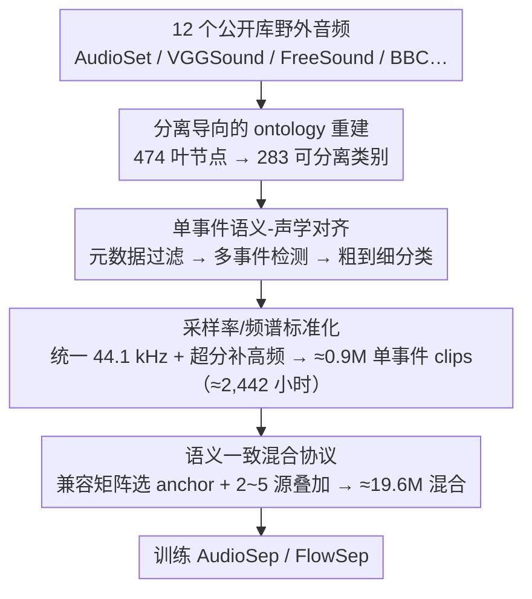

# A Semantically Consistent Dataset for Data-Efficient Query-Based Universal Sound Separation

**会议**: ICML 2026  
**arXiv**: [2601.22599](https://arxiv.org/abs/2601.22599)  
**代码**: https://cslikai.cn/Hive  
**领域**: 音频语音 / 通用声音分离  
**关键词**: 通用声音分离、音频数据集、语义一致混合、数据高效、单事件挖掘  

## 一句话总结
这篇论文提出 Hive，一个通过单事件净化和语义一致混合构造的通用声音分离数据集，用约 2.4k 小时高纯度源音频让 AudioSep、FlowSep 在多项分离指标上接近甚至超过百万小时级训练的系统。

## 研究背景与动机
**领域现状**：Query-based Universal Sound Separation 希望根据文本、音频或视觉提示，从复杂混合声中分离任意目标声音。已有路线大致分成两类：AudioSep 这类判别式方法直接估计目标信号，FlowSep、SAM-Audio 这类生成式方法借助分布建模或统一提示接口生成目标声源。

**现有痛点**：许多方法依赖 AudioSet、VGGSound 等大规模野外音频。规模虽大，但这些数据往往只有弱标签，一个“雨声”片段里可能长期伴随风声、车流或说话声。模型在这种监督下很容易把共现背景也学成目标类别的一部分，于是分离结果里残留干扰或生成不属于目标的背景纹理。

**核心矛盾**：通用声音分离既需要开放类别覆盖，又需要干净、可定位的监督信号。单纯扩大数据和模型规模能缓解一部分问题，却会把弱标签和共现偏差一同放大，训练成本也越来越高。

**本文目标**：作者想回答一个更数据中心的问题：如果先把训练源音频净化为高纯度单事件，再按语义合理的方式合成混合声，是否可以用小得多的数据量训练出有竞争力的通用声音分离模型？

**切入角度**：论文没有提出新的分离网络，而是把瓶颈定位到数据生成过程本身。它将“源事件是否单一”和“混合事件是否合理”拆成两个独立质量轴，分别用多模态模型辅助清洗和语义兼容矩阵控制。

**核心 idea**：用高纯度单事件挖掘加语义一致混合，替代从弱标注野外音频中随机拼接训练样本。

## 方法详解
Hive 的方法重点是一个离线数据构建流水线：先从多个公开音频库中抽取候选片段，再把它们对齐到一个更适合分离任务的标签体系，最后根据语义兼容关系合成多声源混合。这个流程的目标不是让数据“更大”，而是让每条监督样本更可信。

### 整体框架
输入是 AudioSet、VGGSound、FreeSound、BBC Sound Effects 等 12 个公开来源中的野外音频。输出包括两层数据：约 0.9M 个高纯度单事件 clips，总时长约 2,442 小时；以及由这些 clips 合成的 19.6M 条训练/验证/测试混合样本，总混合时长约 22.4k 小时。

流水线分为三步。第一步重建 ontology，把 AudioSet 474 个叶节点压缩成 283 个更可分离的事件类别，删除“室内”“乡村”“MP4”这类环境或格式标签。第二步进行单事件语义-声学对齐，用元数据过滤、多事件检测和粗到细分类组合起来，尽量保证每段音频只有一个明确前景事件。第三步做采样率和频谱标准化，把来源不同的片段统一到 44.1 kHz，并用超分辨率模型补足低采样率音频的高频细节。

在合成阶段，论文不再随机混音，而是构造一个事件类别之间的二值语义兼容矩阵。每个混合样本先选一个 anchor event，再逐步添加与已选事件两两兼容的其他声源，声源数量为 2 到 5。所有源片段会做长度、响度和 SNR 规范化，再按加性混合模型叠加。

### 关键设计

**1. 分离导向的 ontology 重建：先把弱标注标签空间收成可分离的事件类别**

通用声音分离要求目标类别彼此互斥、声学上可辨，但直接拿来用的 AudioSet ontology 有 474 个叶节点，语义重叠多、粒度过细，标签本身就含糊——模型再强也只能学到模糊监督。作者因此对标签空间做一次人工专家校验的重建：把同义或声学高度重叠的标签合并（动作描述 “Drum beat” 并入实体 “Drum”），把声学区别很弱的细粒度生物声（“Fowl”“Coo”）上收为父类，并删除描述环境（“indoor”“countryside”）、文件格式（“MP4”）和抽象属性的不可定位标签，最终得到 283 个面向「可分离前景事件」的叶节点。标签先变干净，后续清洗和分离模型才有一个互斥、可辨的监督目标。

**2. 单事件语义-声学对齐：把野外片段筛到只剩一个前景事件并打准标签**

野外音频的原始标签弱、事件共现严重，照单全收只会把噪声一路传到分离模型。这一步从 12 个公开库（AudioSet、VGGSound、FreeSound、BBC Sound Effects 等）汇集音频后做粗到细的过滤：先丢弃多标签样本，再用多模态大模型 Qwen3-Omni 做零样本二分类，剔除未标注的共现或瞬时干扰；随后用 audio-tag 判别模型预测粗粒度父类，再让 Qwen3-Omni 在候选子类集合里细分到叶节点。这样安排是让判别模型负责稳健粗筛、多模态大模型负责语义细分，分工互补能压低长尾类别的误配；整条流水线离线一次性跑完，产出约 0.9M 个高纯度单事件 clips、共约 2,442 小时。

**3. 语义一致混合协议：用兼容矩阵约束合成，避免荒诞组合带偏模型**

源音频再干净，随机混音也会造出不自然的组合（水生动物配城市车流），给模型灌入错误的上下文先验。作者为此构造一个二值语义兼容矩阵 $M \in \{0,1\}^{N \times N}$ 记录哪两类事件可以自然共现：每条混合先采一个声源数 $C \in \{2,\dots,5\}$，选定一个 anchor event，再逐步只添加与已选所有事件两两兼容的声源，保证整组 pairwise 兼容；选好的源做时长（训练 4s、测试 10s）与响度（RMS=0.1）规范、干扰源 SNR 从 $[-5,5]$ dB 采样，最后按加性模型叠加，合成约 19.6M 条混合样本。语义约束让模型在真实可共现的复杂场景里学分离，而不是被荒诞组合扰乱——消融里同样的源音频换成随机混合，AudioSep 的 SDR 直接掉 1.0 dB，正是这条协议在起作用。

### 损失函数 / 训练策略
论文主要贡献是数据集和构建协议，训练分离模型时沿用已有 AudioSep 与 FlowSep 的原始架构和超参。AudioSep 使用 AdamW、batch size 64、初始学习率 $10^{-3}$，验证 plateau 后衰减；FlowSep 使用 $5 \times 10^{-5}$ 的固定学习率。两者都在 Hive 上训练约 3M steps，并统一把评测输出重采样到 44.1 kHz。

## 实验关键数据

### 主实验
Hive 的主结果分两层：一是在 Hive 自身 test set 上验证高密度语义一致混合的难度，二是在第三方 benchmark 上验证外部分布泛化。

| 数据集 / 场景 | 指标 | 本文 | 关键对比 | 提升或结论 |
|--------|------|------|----------|------|
| Hive test | AudioSep(Hive) SDR / SI-SDR | 5.67 / 5.02 | AudioSep 原版 2.37 / 1.58 | 小规模高纯度数据显著优于原始大规模弱标注训练 |
| Hive test | AudioSep(Hive) MUSHRA | 68.4 | SAM-Audio 62.6, AudioSep 原版 60.9 | 感知质量接近或超过百万小时级 baseline |
| Hive test | FlowSep(Hive) MUSHRA | 61.8 | FlowSep 原版 54.7 | 生成式分离也从 Hive 中获益 |
| USS-Bench | AudioSep(Hive) SDR / OQ | 2.29 / 3.56 | AudioSep 原版 -1.86 / 2.97 | OOD 场景中去共现监督更有效 |
| MUSDB18-HQ | AudioSep(Hive) SDR | 1.36 | AudioSep 原版 -1.01 | 音乐分离也得到泛化收益 |
| VGGClean_eval | FlowSep(Hive) OQ | 3.18 | FlowSep 原版 2.99 | 参考无关质量提升，说明不只是过拟合 Hive |

### 消融实验
| 配置 | 关键指标 | 说明 |
|------|---------|------|
| 一致性混合 AudioSep | SDR 4.12, SI-SDR 3.37, CLAP-T 0.29 | 在 175k 混合样本上训练，使用语义兼容矩阵 |
| 随机混合 AudioSep | SDR 3.12, SI-SDR 2.35, CLAP-T 0.24 | 源音频相同但取消语义兼容，SDR 低 1.0 dB |
| 一致性混合 FlowSep | LPAPS 4.24, CLAP-T 0.17, OQ 2.79 | 生成式模型也从合理混合中受益 |
| 随机混合 FlowSep | LPAPS 4.35, CLAP-T 0.13, OQ 2.64 | 感知和语义指标均下降 |
| AudioSep 原版 shortcut gap | co-occ. 1.65 vs decorr. 3.06, gap -1.41 dB | 原始训练更依赖共现捷径 |
| AudioSep(Hive) shortcut gap | co-occ. 5.48 vs decorr. 5.87, gap -0.39 dB | Hive 显著降低对干扰共现关系的依赖 |

### 关键发现
- 源纯度和语义一致性是互补因素：只净化源音频已经有帮助，但合理混合能进一步改善分离、感知和语义指标。
- Hive 的数据效率非常突出：约 2.4k 小时源音频训练的模型，在若干指标上接近或超过使用 14.1k 小时甚至百万小时数据训练的系统。
- 训练规模仍然有用，但前提是监督信号干净；从 175k 扩到 17.5M samples 时，AudioSep 的 SDR 继续提升 1.55 dB，说明 Hive 没有很快饱和。

## 亮点与洞察
- 数据问题定位很准：论文没有把残余干扰归咎于网络结构，而是把弱标签、共现和随机混合拆开验证，说明 USS 的瓶颈很可能在训练监督本身。
- 语义一致混合是可复用的 dataset trick：类似思路可以迁移到视觉-音频、视频声源分离或事件检测，只要能构造类别兼容矩阵，就能减少荒诞负样本带来的偏差。
- shortcut paired evaluation 很有价值：固定 target、source count 和 SNR，只改变干扰源的统计共现关系，比单纯看平均 SDR 更能证明模型是否在依赖背景捷径。

## 局限与展望
- Hive 仍是合成混合，缺少房间脉冲响应、真实录音空间结构和设备噪声，部署到真实声场时可能遇到 domain gap。
- 清洗和兼容矩阵依赖 Qwen3-Omni 等多模态大模型，可能继承其类别偏见，尤其是中尾部类别和含糊声音事件。
- 论文主要训练 AudioSep/FlowSep，没有系统探索更大或更新的 unified audio foundation model 在 Hive 上的 scaling law。
- 后续可以加入真实 RIR 增强、tail-class-aware sampling、LLM relabel bias audit，以及自然录制的高密度 USS benchmark。

## 相关工作与启发
- **vs AudioSep / CLIPSep**: 这些方法主要从模型和大规模弱标注数据出发，Hive 则强调清洗后的单事件监督；优势是数据效率高，劣势是构建流程更复杂。
- **vs SAM-Audio**: SAM-Audio 代表百万小时级统一音频模型，Hive 显示小规模高纯度数据可以缩小质量差距，但还没有替代大模型的多模态提示能力。
- **vs Scaper / FUSS**: Scaper 和 FUSS 更像受控混合工具或数据集，Hive 的差异在于它主动解决野外来源的上游源纯化与语义兼容混合。
- **启发**: 对许多 foundation model 任务来说，“高信息密度监督”可能比盲目扩大弱标注数据更划算；可以把类似的纯化-合成协议用于视频事件、机器人多模态感知或医学弱标注数据。

## 评分
- 新颖性: ⭐⭐⭐⭐☆ 数据集论文的新意主要在纯化和语义混合协议的组合，不是模型结构突破。
- 实验充分度: ⭐⭐⭐⭐⭐ 覆盖 Hive、第三方 benchmark、semantic consistency、shortcut、scale 多个维度，证据链完整。
- 写作质量: ⭐⭐⭐⭐☆ 叙事清楚，表格丰富，但附录和指标较多，快速阅读需要筛选重点。
- 价值: ⭐⭐⭐⭐⭐ 对通用声音分离和音频 foundation model 训练都很有实践价值，尤其适合资源有限团队复现。

<!-- RELATED:START -->

## 相关论文

- [\[AAAI 2026\] USE: A Unified Model for Universal Sound Separation and Extraction](../../AAAI2026/audio_speech/use_a_unified_model_for_universal_sound_separation_and_extraction.md)
- [\[ICML 2026\] Multimodal Fusion via Self-Consistent Task-Gradient Fields](multimodal_fusion_via_self-consistent_task-gradient_fields.md)
- [\[ICML 2026\] Algorithmic Recourse of In-Context Learning for Tabular Data](algorithmic_recourse_of_in-context_learning_for_tabular_data.md)
- [\[ACL 2026\] Data-efficient Targeted Token-level Preference Optimization for LLM-based Text-to-Speech](../../ACL2026/audio_speech/data-efficient_targeted_token-level_preference_optimization_for_llm-based_text-t.md)
- [\[CVPR 2026\] How Far Can We Go With Synthetic Data for Audio-Visual Sound Source Localization?](../../CVPR2026/audio_speech/how_far_can_we_go_with_synthetic_data_for_audio-visual_sound_source_localization.md)

<!-- RELATED:END -->
