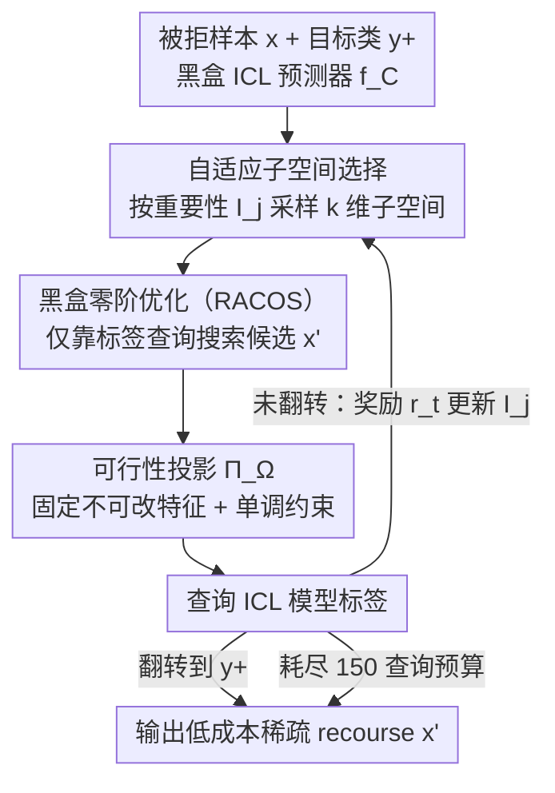

# Algorithmic Recourse of In-Context Learning for Tabular Data

**会议**: ICML 2026  
**arXiv**: [2605.31272](https://arxiv.org/abs/2605.31272)  
**代码**: 无公开代码  
**领域**: 可解释性 / 表格数据 / 算法追索  
**关键词**: 表格数据ICL、算法追索、黑盒优化、反事实解释、可行动性  

## 一句话总结
这篇论文首次系统研究表格数据 in-context learning 场景下的算法追索问题，证明 ICL 诱导的动态决策规则仍可定义可界定的 recourse，并提出 ASR-ICL 用自适应子空间零阶优化在黑盒 ICL 模型上生成低成本、稀疏且可行动的反事实修改。

## 研究背景与动机
**领域现状**：算法追索通常用于贷款、司法、医疗等高风险表格决策系统，目标不是解释模型为什么拒绝某个样本，而是告诉用户怎样改变可行动特征才能得到更有利的预测。经典方法默认存在一个训练完成后固定的分类器，因此可以围绕这个固定决策边界做梯度优化、整数规划或图搜索。

**现有痛点**：表格预测正在被 TabPFN、TabICL 以及通用 LLM 的 in-context learning 改写。ICL 不显式训练一个固定模型，而是在推理时根据上下文样例临时诱导预测器；同一个用户样本面对不同 demonstration set 时，实际决策规则可能不同。这样一来，传统 recourse 里的“固定模型”“稳定边界”“可访问梯度”等假设都不再成立。

**核心矛盾**：高风险表格任务需要给用户稳定、可行动、低成本的修改建议，但 ICL 决策规则是上下文条件化的黑盒函数。论文要回答的不是简单地把已有 counterfactual 方法套到 LLM 上，而是先确认这种动态预测器是否仍然有可定义的 recourse，再设计能在有限查询预算下工作的实际算法。

**本文目标**：作者把问题拆成两个层次：理论上，在可分析的线性 self-attention ICL 设置中证明 recourse 的可行性、成本上界和随上下文规模增长的收敛行为；实践上，在只有黑盒查询、特征混合连续/离散、且存在可行动约束的表格任务中生成有效 recourse。

**切入角度**：理论分析显示，测试时上下文样例数越多，ICL 诱导的 recourse 越接近经典线性模型 recourse，但成本上界仍受特征维度影响。这个观察直接启发了方法设计：如果不能改变预训练上下文长度，就应该在推理时把搜索压缩到少量关键特征上。

**核心 idea**：用“自适应选择小子空间 + 零阶黑盒优化”替代全维搜索，让 ICL 表格模型的 recourse 同时满足有效性、低查询量和稀疏可解释性。

## 方法详解

### 整体框架
论文要解决的是：当表格分类器不再是一个训练后固定的模型，而是 in-context learning 在推理时根据上下文样例临时诱导出来的黑盒预测器 $f_{\mathcal{C}}$ 时，怎样还能给被拒绝的用户一份低成本、可执行的修改建议。作者把它拆成两层：理论上把 ICL 预测器写成依赖上下文集合 $\mathcal{C}$ 的函数，在可解析的线性 self-attention 设置里证明 recourse 仍然存在并给出成本上界；算法上把这个理论启发落成一个只靠标签查询工作的搜索器 ASR-ICL（Adaptive Subspace Recourse for In-Context Learning）。整套流程围绕一个不利样本 $x$ 反复抽取少量可变特征、在子空间里做零阶搜索、投影回可行集再查询模型，直到翻转预测或耗尽查询预算。

下图是推理时 ASR-ICL 的搜索回环（理论那一层是它的可行性基础，不在流程图里）：

### 关键设计

**1. 上下文化 recourse 的理论定义：先证明动态预测器仍有 recourse**

传统 recourse 默认背后有一个固定决策边界，可以围着它做梯度优化；而 ICL 的边界随 demonstration 变化，套用旧方法就只剩经验启发。作者因此先在 ICL 预测器上定义候选 $x'$ 的有效性，再用线性 self-attention 把最优扰动解出来。这个扰动 $\delta^*_{\mathrm{ICL}}$ 由当前样本分数、上下文经验协方差 $S$ 和预训练有效协方差 $\Gamma$ 共同决定，并不是固定权重模型的简单复刻。更重要的是，他们给出高概率成本上界——其中含一项 $\sqrt{\ln(2d/\delta)/M}$，说明当测试 demonstration 数 $M$ 增大、训练上下文长度 $N$ 增大时 $S$ 逼近真实协方差，ICL recourse 会向经典线性模型 recourse 收敛，但维度 $d$ 越高就越难稳定。这一条既证明了「在 ICL 下做 recourse 是有意义的」，也直接暗示了算法该往哪走：既然不能改预训练上下文长度，就该在推理时把搜索压到少量特征上。

**2. 自适应子空间选择：把全维搜索压成稀疏搜索**

高维表格里盲目地在所有特征上做零阶优化既费查询又会改到一堆无关属性，而表格 recourse 本身通常只需要动少数几个可行动特征。作者给每个特征维护一个重要性分数 $I_j$，按 $p_{\mathrm{sel}}(j) \propto \exp(I_j)$ 采样出一个大小为 $k$ 的子空间，只在这几维上搜索。每完成一次局部搜索，就用该子空间带来的负目标值奖励 $r_t$ 反过来更新重要性 $I_j \leftarrow (1-\alpha)I_j + \alpha\, r_t / |S_t|$——能压低目标的特征下一轮被选中的概率更高。这样搜索会自动收敛到少数真正有用的特征上，既砍掉查询量，也让最终建议稀疏、人能看懂能执行。

**3. 黑盒零阶优化与可行性投影：贴合「只能查标签 + 有不可改属性」的部署约束**

真实 ICL 服务往往只回一个预测标签，拿不到梯度、logit 或内部状态，而表格数据里又有年龄、性别、孕次这类不可改特征。作者把目标写成只依赖标签查询的形式 $L_{\mathrm{pr}}(x,x')=(1-\mathbb{I}[\hat{y}(x')=y^+])+\lambda\, c(x,x')$：第一项奖励候选被预测为目标类 $y^+$，第二项用成本 $c(x,x')$ 惩罚修改幅度。内层用 RACOS 这种零阶优化器同时处理连续区间和离散网格，每个候选在送去查询前先经过投影 $\Pi_{\Omega}$，强制固定不可变特征、遵守单调等可行动约束。这样算法不依赖任何白盒访问，生成的修改也天然落在现实可执行的范围内。

### 损失函数 / 训练策略
ASR-ICL 不训练任何预测模型，全部动作发生在推理时的黑盒搜索里。优化目标即上面的 $L_{\mathrm{pr}}$，由「翻转到目标类」的奖励项和「成本」惩罚项 $c(x,x')$ 组成，后者同时惩罚连续特征的归一化变化和离散特征的改动。默认配置为：子空间大小 $\min(5,\lceil\sqrt{d}\rceil)$，重要性平滑系数 $\alpha=0.5$，总查询预算 150，内层零阶优化器为 RACOS。二分类朝有利标签生成 recourse，多分类朝指定的最优类别生成 recourse。

## 实验关键数据

### 主实验
论文在 Australian Credit、COMPAS、Diabetes 三个二分类表格任务上比较 ASR-ICL 和经典 trained-model recourse 方法。ICL 结果使用 32-shot context；表中成本越低越好。

| 模型 / 方法 | Australian Credit 有效率 / 成本 | COMPAS 有效率 / 成本 | Diabetes 有效率 / 成本 | 结论 |
|-------------|----------------------------------|-----------------------|-------------------------|------|
| MLP + DiCE | 1.00 / 8.96 | 1.00 / 7.51 | 1.00 / 5.02 | 有效率高，但修改代价明显偏大 |
| Linear + AR | 0.82 / 1.76 | 0.94 / 3.44 | 0.72 / 1.52 | 成本低，但经常找不到有效 recourse |
| Linear + FACE | 1.00 / 6.18 | 1.00 / 6.51 | 1.00 / 5.13 | 有效率稳定，成本仍较高 |
| TabPFN-2.5 + ASR-ICL | 1.00 / 3.83 | 1.00 / 2.76 | 1.00 / 2.78 | 在黑盒 ICL 下保持满有效率且成本更低 |
| TabICL + ASR-ICL | 1.00 / 4.47 | 0.81 / 3.44 | 1.00 / 2.80 | 专用表格 ICL 总体稳定，COMPAS 较难 |
| Qwen3-8B + ASR-ICL | 0.87 / 2.94 | 0.99 / 2.55 | 0.84 / 1.50 | 通用 LLM 也能生成低成本 recourse |
| LLaMA-3.2-3B + ASR-ICL | 1.00 / 2.99 | 1.00 / 2.43 | 0.98 / 1.67 | 多个开源 LLM 上成本约为 2 到 3 |
| GPT-4o + ASR-ICL | 0.99 / 4.75 | 0.78 / 3.62 | 0.71 / 4.31 | 闭源模型在部分数据集有效率较低，说明预测边界噪声会影响 recourse |

### 消融实验
论文用 Full ZO 作为非自适应全空间零阶优化基线，对比 ASR-ICL 的查询效率和成本。下表摘取 Australian Credit 与 Corporate Rating 上的代表性结果。

| 配置 | Australian Credit 有效率 / 成本 / 查询 | Corporate Rating 有效率 / 成本 / 查询 | 说明 |
|------|------------------------------------------|------------------------------------------|------|
| Full ZO + TabPFN-2.5 | 1.00 / 12.88 / 144.28 | 1.00 / 15.44 / 149.45 | 全维搜索接近用满预算，成本很高 |
| ASR-ICL + TabPFN-2.5 | 1.00 / 3.83 / 27.01 | 0.98 / 4.79 / 111.71 | 自适应子空间显著降低二分类成本和查询量 |
| Full ZO + Qwen3-4B | 1.00 / 12.03 / 150.00 | 0.95 / 17.42 / 150.00 | 通用 LLM 上全维搜索几乎总是耗尽预算 |
| ASR-ICL + Qwen3-4B | 0.79 / 3.01 / 56.01 | 0.94 / 3.54 / 117.32 | 成本大幅下降，复杂任务上有效率仍主要受模型预测质量限制 |
| Full ZO + GPT-4o | 0.97 / 11.82 / 150.00 | 0.77 / 14.18 / 150.00 | 高查询成本下仍不一定获得更好有效率 |
| ASR-ICL + GPT-4o | 0.99 / 4.75 / 49.04 | 0.72 / 4.87 / 40.29 | 用少得多的查询取得相近有效率和更低成本 |

### 关键发现
- 上下文样例数增加时，recourse 有效率更稳定，平均成本下降，和理论中 ICL recourse 向经典线性 recourse 收敛的趋势一致。
- 多分类任务上，TabPFN 和 TabICL 在 Corporate Rating、Student Performance 上接近满有效率；通用 LLM 在 Student Performance 上明显更不稳定，说明复杂类别边界对 ICL 表格预测质量更敏感。
- 自适应子空间是主要贡献：它不仅减少查询，还把搜索集中到少数特征上，使 recourse 更稀疏。Diabetes 个案中 ASR-ICL 只改 Glucose 和 BMI，而 DiCE 会改到不可行动属性。

## 亮点与洞察
- 论文没有直接把 counterfactual explanation 套到 LLM，而是先问“ICL 的动态模型是否仍有 recourse”这个基础问题。这个问题设置很干净，也让理论和算法之间有真实连接。
- ASR-ICL 的核心设计很务实：既承认黑盒 ICL 只能查询标签，又利用表格 recourse 天然稀疏的特点，把难题从全维优化变成自适应小子空间搜索。
- 理论上界中的维度项给出了一个有用启发：在 ICL 模型固定、上下文预算有限时，降低有效搜索维度可能比盲目增加零阶迭代更关键。这个思路可以迁移到黑盒 LLM 工具调用、医疗表格决策和风控策略解释。

## 局限与展望
- 理论部分基于线性回归和单层线性 self-attention，和真实 TabPFN、TabICL、通用 LLM 的机制仍有距离；它更像解释趋势的理想化模型，而不是完整刻画真实 ICL。
- 实验主要评估能否翻转模型预测和修改成本，没有做人类可执行性、长期稳定性或因果有效性的用户研究。对高风险场景而言，只满足 feature constraint 还不等于现实可行动。
- ASR-ICL 仍依赖大量黑盒查询。虽然比 Full ZO 少很多，但对付费 API 或严格审计系统而言，几十到上百次查询仍可能昂贵或触发风控。
- 后续可以把自适应子空间和因果约束、领域规则、置信度估计结合起来，让 recourse 不只翻转标签，还能提高跨上下文、跨模型的稳健性。

## 相关工作与启发
- **vs DiCE**: DiCE 通过优化生成多样 counterfactual，适合固定模型且可使用更丰富反馈；ASR-ICL 面向上下文条件化黑盒 ICL，只依赖标签查询，更适合无法访问梯度的服务化模型。
- **vs Actionable Recourse**: AR 在白盒线性模型下能给出低成本甚至可认证的动作，但有效率受模型假设限制；本文把“低成本动作”扩展到 ICL 预测器，不过牺牲了全局最优认证。
- **vs FACE**: FACE 沿数据流形搜索，强调可行路径；ASR-ICL 强调子空间稀疏搜索和查询效率。两者未来可以结合，用 manifold graph 限制 ASR-ICL 的候选区域。
- **vs TabPFN / TabICL**: TabPFN 和 TabICL 关注表格 ICL 预测准确率，本文关注这些预测器部署后如何给被拒绝个体提供可行动修改建议，是从性能到责任机制的一步延伸。

## 评分
- 新颖性: ⭐⭐⭐⭐⭐ 首次把算法追索系统性放到表格 ICL 的动态决策规则下，并给出理论和算法闭环。
- 实验充分度: ⭐⭐⭐⭐ 覆盖多个数据集、专用表格模型和通用 LLM，也有多分类、查询效率和鲁棒性分析，但缺少真实用户/因果有效性验证。
- 写作质量: ⭐⭐⭐⭐ 问题动机和方法链条清晰，理论到算法的连接自然；部分实验表格较密，需要读者自行消化模型差异。
- 价值: ⭐⭐⭐⭐⭐ 对高风险表格 ICL 部署很有现实意义，也为黑盒 LLM 决策系统的 recourse 研究提供了可复用框架。

<!-- RELATED:START -->

## 相关论文

- [\[ACL 2026\] Multimodal In-Context Learning for ASR of Low-Resource Languages](../../ACL2026/audio_speech/multimodal_in-context_learning_for_asr_of_low-resource_languages.md)
- [\[ICML 2026\] A Semantically Consistent Dataset for Data-Efficient Query-Based Universal Sound Separation](a_semantically_consistent_dataset_for_data-efficient_query-based_universal_sound.md)
- [\[ICML 2026\] Multiple Choice Learning of Low-Rank Adapters for Language Modeling](multiple_choice_learning_of_low-rank_adapters_for_language_modeling.md)
- [\[ACL 2026\] DRInQ: Evaluating Conversational Implicature with Controlled Context Variation](../../ACL2026/audio_speech/drinq_evaluating_conversational_implicature_with_controlled_context_variation.md)
- [\[ICML 2026\] Group Cognition Learning: Making Everything Better Through Governed Two-Stage Agents Collaboration](group_cognition_learning_making_everything_better_through_governed_two-stage_age.md)

<!-- RELATED:END -->
