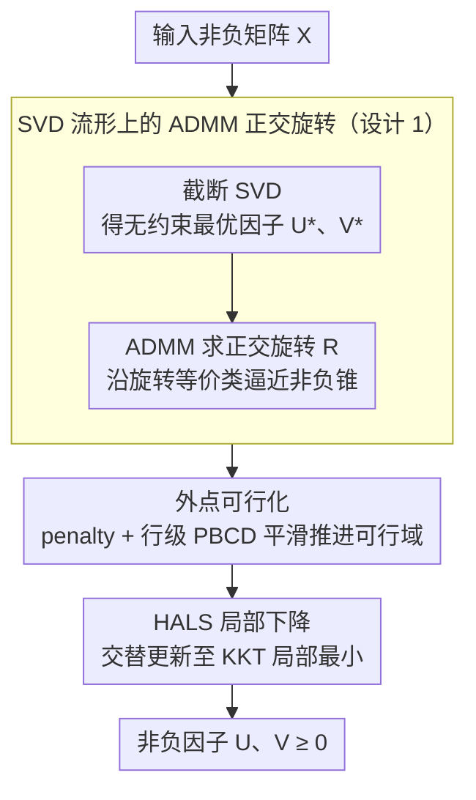

# An Exterior Method for Nonnegative Matrix Factorization

**会议**: ICML2026  
**arXiv**: [2605.19325](https://arxiv.org/abs/2605.19325)  
**代码**: https://github.com/roychowdhuryresearch/eNMF  
**领域**: 优化  
**关键词**: 非负矩阵分解、外点方法、ADMM、正交旋转、HALS  

## 一句话总结
这篇论文提出 eNMF，把 NMF 从“始终待在非负正交锥内部优化”改成“先从无约束 SVD 最优解的旋转等价类外部逼近非负锥，再可行化并下降”，在合成、文本、音频、图像和推荐数据上比 9 类 NMF baseline 更快达到更低重构误差。

## 研究背景与动机
**领域现状**：非负矩阵分解希望把非负矩阵 $X$ 近似为 $UV^\top$，其中 $U,V\geq0$，因子具有稀疏、可解释和部件化的特点，长期用于主题建模、音频分离、图像理解、推荐系统和可解释表示学习。主流算法通常从非负初始化出发，在优化过程中持续投影或约束 $U,V$ 非负，例如 multiplicative updates、HALS、NNLS/ADMM 类交替优化等。

**现有痛点**：NMF 是非凸问题，内部可行方法虽然始终满足非负约束，但很容易在非负锥内部缓慢爬行，陷入平坦区域或次优 stationary point。更关键的是，这些方法没有充分利用无约束低秩近似的全局最优结构；SVD 给出的低秩解虽然可能含负值，但它与许多等价因子之间存在旋转自由度。

**核心矛盾**：NMF 的重构目标与非负约束之间存在张力。若只从可行域内部出发，算法可能早早被约束几何卡住；若完全忽略非负性，无约束 SVD 又不可直接作为可解释 NMF 因子。本文的核心问题是：能否先利用无约束全局最优解的低误差优势，再以几何方式把它推向非负正交锥。

**本文目标**：作者希望重新审视 NMF 的基本优化路径，提出一个 exterior-to-interior 框架，使算法从非负锥外部靠近高质量可行解，并系统比较该策略在重构误差、速度、局部最小值等价性和下游任务上的效果。

**切入角度**：论文利用低秩因子的旋转不变性：若 $X\approx U^\star {V^\star}^\top$，则 $(U^\star R,V^\star R)$ 在正交 $R$ 下保持同样的无约束重构误差。于是问题变成寻找一个旋转 $R$，让两个因子尽可能接近非负正交锥。

**核心 idea**：不要从非负初始化在锥内部慢慢下降，而是从 SVD 全局低秩解的旋转流形出发，先找到离非负锥最近的外部点，再通过可行化和 HALS 进入局部最小值。

## 方法详解

### 整体框架
eNMF 要解的还是标准 Frobenius NMF 目标 $\min_{U,V\geq0}\frac12\|X-UV^\top\|_F^2$，但它换掉了进入可行域的路径：传统方法从非负初始化在锥内部慢慢爬，eNMF 则先抓住无约束截断 SVD 的全局低秩最优解，利用低秩因子的旋转不变性，在 SVD 因子的旋转等价类上找一个离非负锥最近的外部点，再把它推进可行域并用成熟下降器收尾。整条流水线分三段：截断 SVD 给出无约束最优因子，ADMM 求一个让负元素最少的正交旋转，外点 penalty 把旋转后的因子可行化，最后 HALS 在可行域内下降到 KKT 局部最小值。关键不是发明新目标，而是把最难的初始化与进入可行域这一步做对。

### 关键设计

**1. SVD 流形上的 ADMM 正交旋转：把初始化变成低维 Procrustes 问题**

算法先算截断 SVD $X\approx U\Sigma V^\top$，令 $U^\star=U\Sigma^{1/2}$、$V^\star=V\Sigma^{1/2}$。这一步的关键观察是：任意正交矩阵 $R$ 都让 $(U^\star R)(V^\star R)^\top$ 保持不变，所以整个流形 $\mathcal{Y}^\star=\{(U^\star R,V^\star R)\mid R^\top R=I\}$ 上的因子都享有 SVD 的全局最低重构误差，差别只在离非负锥的远近。于是 NMF 的初始化被转写成一个寻找最优旋转的低维问题：把 $U^\star$、$V^\star$ 竖直拼成 $W$，求解 $\min_{Z,R}\sum_{ij}h(Z_{ij})$，约束 $Z=WR$ 且 $R^\top R=I$，其中 $h(q)=\max(0,-q)$ 只惩罚负元素。

求解用 ADMM 交替更新 $Z$、$R$ 和乘子 $Y$：$Z$ 的每个元素有分段闭式解，$R$ 退化成正交 Procrustes 形式、通过 $W^\top B$ 的 SVD 得到。这样做之所以划算，是因为它直接吃下了无约束最优解的旋转等价类——一旦这个流形与非负锥相交，eNMF 只靠旋转就能到达全局 NMF 最优，完全绕开漫长的约束优化；即便不相交，旋转也已把因子摆到离锥最近的位置，给后续步骤一个极强的 warm start。

**2. 外点可行化而非直接投影：连续地推进可行域**

旋转后的因子通常已经很接近非负锥，但可能还剩少量负元素。最朴素的做法是把负数直接截成 0，可这会突然改变因子几何，把旋转阶段辛苦得到的低误差结构破坏掉。eNMF 改用外点 penalty 让因子平滑地走进可行域：最小化 $\frac12\|X-UV^\top\|_F^2+\delta_u\sum h(U_{ij})+\delta_v\sum h(V_{ij})$，负元素被 penalty 主导、持续向正方向移动，非负元素则按行做 projected block coordinate descent。每行的步长由局部二次结构给出闭式解，再投影回非负区间，因此每步都廉价且方向明确。相比固定步长，这种行级最优步长显著缩短了可行化时间。

**3. HALS 局部下降与 KKT 验证：用稳定内核收尾**

可行化结束时，因子往往已经贴近一个 KKT stationary point，剩下的工作就是标准 NMF descent。eNMF 不另起炉灶，而是直接接上成熟的 HALS 做最后的交替列/行更新，并用 KKT 最优性条件判断是否收敛。整条伪代码因此是：SVD 初始化 → 正交旋转 → 负元素更新与 PBCD 可行化 → HALS 下降。这种分工的意义在于，eNMF 只负责把别人做不好的初始化和进入可行域问题解决到位，下降这件已经被反复打磨的事就交给 HALS，既省力又稳。论文也指出，只要能拿到对应的无约束低秩起点，这套外点思想还能迁移到其他 NMF 距离或 matrix completion 变体。

## 实验关键数据

### 主实验
论文比较了 eNMF 与 9 类 NMF baseline，并对 baseline 做 9 种初始化 sweep 后取最好结果。主要协议包括 equal-time reconstruction error 和 equal-error runtime。

| 数据集 / 设置 | 指标 | 本文 | 之前SOTA / 最强基线 | 提升 |
|---------------|------|------|---------------------|------|
| Synthetic, SNR 80dB, $r=500$ | 达到 SVD 全局最小的时间 | 106.33s | HALS 1812.0s，AO-ADMM 596.2s，NMF-ADMM 3093.7s | 对 AO-ADMM 约 5.6x，更快于多数方法 16x 以上 |
| Synthetic, SNR 20dB, $r=50$ | equal-error runtime | 176s | AO-ADMM 966.2s，HALS 3010.6s | 约 5.5x / 17.1x 更快 |
| Face, $r=20$ | equal-error runtime | 246.4s | AO-ADMM 291.47s，HALS 333.19s | 相比最近竞争者约 15.5% 更快 |
| Verb, $r=100$ | equal-error runtime | 14.66s | AO-ADMM 18.54s，HALS 23.16s | 约 20.9% / 36.7% 更快 |
| Audio, $r=100$ | equal-error runtime | 107.74s | AO-ADMM 143.29s，HALS 158.38s | 约 24.8% / 32.0% 更快 |
| 下游任务 | 表示质量 | Face +5.7 到 +10.3 点，AudioMNIST +8.5 到 +12.5 点，MovieLens RMSE 降低约 7-12% | 各任务最强 baseline | 不只重构好，下游特征也更强 |

### 消融实验
论文的关键分析集中在算法阶段、几何交点和后处理策略上。下面表格概括了最能说明 eNMF 机制的消融/分析结果。

| 配置 | 关键指标 | 说明 |
|------|---------|------|
| 只需 SVD + ADMM 旋转的合成设置 | Feasibility + Descent 时间为 0 | 在所有 synthetic settings 中，旋转后已达到无约束全局最小；总时间由 SVD 与 ADMM 解释 |
| 旋转点直接投影 + descent | equal-error 更慢、equal-time 误差更高 | 作者报告 proposed feasibility-attainment + HALS 比 direct projection 更稳定 |
| 固定步长可行化 | 慢于闭式行步长 PBCD | Eqs. (10)-(11) 的行级最优步长减少可行化时间 |
| Audio 高秩 $r\in\{40,80,100\}$ | 旋转流形与非负锥相交 | eNMF 基本通过 rotation step 触达无约束全局最小，因此比内部约束 solver 快 |
| 400+ NMF 设置的局部最小值比较 | 99% 情况不同算法趋向等价因子 | 多数解只差 permutation / scaling / rotation，eNMF 的优势主要是更快到达同一几何解 |

### 关键发现
- eNMF 的速度优势来自强 warm start，而不只是某个更快的内层更新。合成数据中，SVD 流形与非负锥相交时，算法几乎不用可行化/下降就能到达全局 NMF 解。
- 真实数据更非凸，流形不总与非负锥相交，但 eNMF 仍能给出更低 equal-time 重构误差，并在 equal-error 协议下最快达到目标误差。
- 下游任务结果说明，eNMF 的因子不仅重构误差低，也更适合分类和推荐等实际任务；这对 NMF 作为特征提取工具很重要。

## 亮点与洞察
- 论文最有启发的点是“从外部进入非负锥”。传统 NMF 方法把非负性当作每一步必须满足的硬约束，而 eNMF 先保留无约束低秩最优的几何优势，再有控制地处理非负性。
- ADMM 旋转步骤把 NMF 初始化问题转成了一个低维正交 Procrustes 风格问题。相比随机初始化或 NNDSVD，这个初始化更直接地利用了 SVD 解所在的等价流形。
- 等价局部最小值分析很有价值。它表明许多 NMF 算法最终可能走向相同或等价的因子，只是速度不同；这解释了为什么“跑足够久大家都差不多”，也凸显了初始化路径的实际意义。
- 这套方法可能迁移到其他“无约束解容易、约束解困难”的矩阵分解问题，例如带稀疏、正交、单调或 simplex 约束的可解释分解。

## 局限与展望
- eNMF 仍然是启发式非凸算法，不提供全局最优保证；ADMM 旋转问题本身也是非凸的，尽管实验证明很稳定。
- 算法依赖高质量低秩子空间，SVD 初始化在超大稀疏或流式数据中可能成为瓶颈；作者也把在线 NMF 作为未来方向。
- 实验覆盖很多 baseline，但不少细节结果在 appendix；主文中直接可见的表格偏重 runtime，读者需要结合附录才能完整比较每个算法的误差。
- 外点进入可行域的思想对 Frobenius NMF 很自然，但迁移到 KL、IS divergence 或带缺失矩阵补全时，具体 penalty、步长和收敛准则还需要更系统验证。

## 相关工作与启发
- **vs Lee-Seung multiplicative updates**: 传统乘法更新始终保持非负，简单但慢；eNMF 放弃“全程内部可行”，用外点 warm start 避免长时间内部爬行。
- **vs HALS / A-HALS**: HALS 是成熟的局部下降器，本文并不否定它，而是把 HALS 放到最后阶段；优势来自 HALS 前的 SVD 旋转和可行化初始化。
- **vs AO-ADMM / NMF-ADMM**: ADMM baseline 在可行域内解 NNLS 或整体目标，eNMF 的 ADMM 则用于正交旋转无约束因子，角色不同，也更靠近低维几何核心。
- **vs Vavasis / R1D**: 早期工作已经注意到 exact NMF 与无约束因子之间存在变换关系，但 eNMF 把这个想法实现成可运行的 rank-$r$ exterior framework，并做了系统实验。

## 评分
- 新颖性: ⭐⭐⭐⭐⭐ 从外部旋转 SVD 流形进入非负锥的视角很鲜明，也解释了 NMF 优化几何。
- 实验充分度: ⭐⭐⭐⭐⭐ 9 类 baseline、9 初始化 sweep、合成/真实/下游任务和等价局部最小值分析都比较完整。
- 写作质量: ⭐⭐⭐⭐☆ 方法叙述清楚，实验信息量大；但部分表格和关键 ablation 分散在附录，主文阅读成本较高。
- 价值: ⭐⭐⭐⭐⭐ 对 NMF、可解释矩阵分解和约束优化初始化都有直接实用价值。

<!-- RELATED:START -->

## 相关论文

- [\[NeurIPS 2025\] Latent Space Factorization in LoRA](../../NeurIPS2025/audio_speech/latent_space_factorization_in_lora.md)
- [\[ACL 2026\] Temporal Contrastive Decoding: A Training-Free Method for Large Audio-Language Models](../../ACL2026/audio_speech/temporal_contrastive_decoding_a_training-free_method_for_large_audio-language_mo.md)
- [\[ICML 2026\] Attend to Anything: Foundation Model for Unified Human Attention Modeling](attend_to_anything_foundation_model_for_unified_human_attention_modeling.md)
- [\[ICML 2026\] NAACA: Training-Free NeuroAuditory Attentive Cognitive Architecture with Oscillatory Working Memory for Salience-Driven Attention Gating](naaca_training-free_neuroauditory_attentive_cognitive_architecture_with_oscillat.md)
- [\[ICML 2026\] MusicDET: Zero-Shot AI-Generated Music Detection](musicdet_zero-shot_ai-generated_music_detection.md)

<!-- RELATED:END -->
