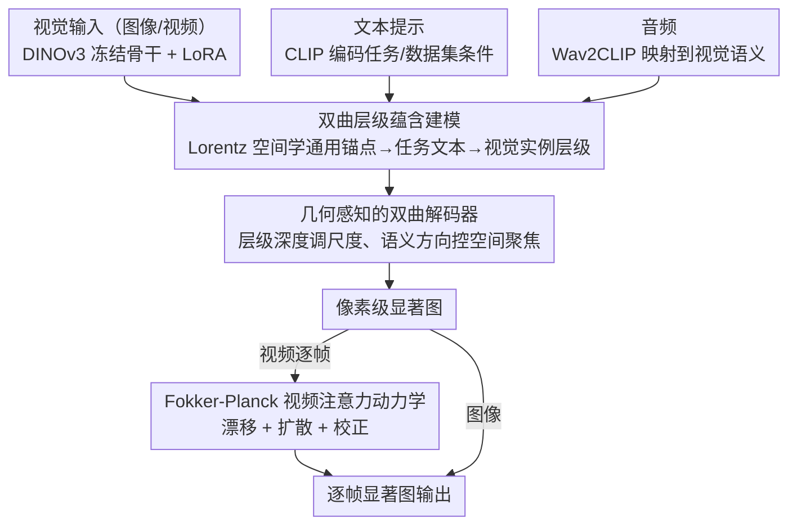

# Attend to Anything: Foundation Model for Unified Human Attention Modeling

**会议**: ICML2026  
**arXiv**: [2606.03540](https://arxiv.org/abs/2606.03540)  
**代码**: https://github.com/wz-zhao/Attend-to-Anything  
**领域**: 人体理解 / 注意力建模  
**关键词**: 人类注意力, 视觉显著性, 双曲表示, Fokker-Planck动力学, 多模态基础模型  

## 一句话总结
AAM把图像、视频和音视频显著性预测统一为一个带文本条件、双曲层级约束和Fokker-Planck时间动力学的注意力基础模型，在16个基准上整体优于专用模型，并把视频推理速度提升到约111 FPS。

## 研究背景与动机
**领域现状**：人类注意力建模通常被拆成图像显著性、视频显著性、音视频注意力等多个分支，每个分支有自己的数据集、模型结构和训练协议。图像方法多依赖CNN或Transformer预测静态显著图，视频方法再叠加光流、3D卷积或时序Transformer，音视频方法则用额外的声音分支捕捉说话人、声源或事件线索。

**现有痛点**：这种任务拆分让模型在单个数据集内可以刷高指标，却难以跨场景泛化。论文指出，已有模型即使扩大容量和数据规模，在跨数据集测试时仍可能出现大幅性能下降，说明瓶颈不只是训练样本不足，而是问题定义本身把同一套人类认知机制切成了互不相通的局部任务。

**核心矛盾**：人类注意力具有统一的认知过程，但当前建模方式把场景差异、任务意图和模态差异当成了孤立的统计偏差。模型需要同时表达“通用注意力先验”和“特定任务条件”，还要把静态图像和动态视频放进同一个可推理框架，而不是为每种输入形式单独搭一个分支。

**本文目标**：作者希望构建一个可跨图像、视频、音视频任务复用的注意力基础模型。它需要支持文本条件控制、跨数据集泛化、任意长度视频逐帧预测，以及在不牺牲精度的情况下减少固定窗口视频模型的冗余计算。

**切入角度**：论文把注意力差异解释为从“通用注意力”到“具体任务注意力”的层级蕴含关系，并用双曲空间来承载这种一般到具体的结构。同时，它把视频中注意力随时间的变化看作概率密度的输运、扩散和校正过程，用Fokker-Planck方程连接静态显著图和动态注意力。

**核心 idea**：用双曲层级语义来统一场景和任务条件，用物理启发的时间动力学来统一图像与视频注意力，从而把碎片化的显著性预测改写成一个多模态条件基础模型。

## 方法详解

### 整体框架
AAM想解决的是显著性预测被切成图像、视频、音视频多个互不相通分支的问题，做法是把这些任务都映射到同一个带文本条件的注意力空间，再用层级几何和时间动力学把它们粘在一起。视觉输入由冻结的DINOv3骨干提取特征并通过LoRA适配，文本提示由CLIP编码来描述数据集或任务的认知条件，音频由Wav2CLIP编码后映射到视觉语义空间；视觉与文本表示被提升到Lorentz双曲空间学习层级关系，双曲解码器据此把条件转回像素级显著图，视频则额外进入Fokker-Planck动力学模块做逐帧时间演化，最后用显著性损失加双曲蕴含损失联合训练。

### 关键设计

**1. 双曲层级蕴含建模：把数据集与任务差异表示成一般到具体的认知层级**

不同数据集和任务在已有方法里通常被当成互相独立的统计域，各配一套参数，结果是容量再大也难跨场景泛化。AAM把这个痛点重述成层级关系：在Lorentz双曲空间中学习偏序 $z_{img} \preceq z_{txt} \preceq z_{anc}$，其中 $z_{anc}$ 是所有任务共享的通用注意力锚点，$z_{txt}$ 是某个任务或数据集的文本条件，$z_{img}$ 是具体视觉实例。通过双曲蕴含锥约束，文本条件必须落在通用锚点允许的锥形区域内，视觉实例又要落在文本条件的锥内，从而强制“通用注意力→任务注意力→实例注意力”这条由抽象到具体的链条。之所以选双曲空间而非欧氏拼接，是因为双曲体积随半径指数增长，天然适合承载这种树状层级语义，让条件之间的从属关系而不是孤立类别标签被显式编码。

**2. 几何感知的双曲解码器：用层级深度和语义方向直接驱动尺度与空间聚焦**

光把文本当普通条件向量拼进视觉特征，模型很难区分“泛化任务描述”和“精细场景意图”。这里改成让几何量直接参与解码：文本点到原点的双曲距离代表条件的专门化深度，据此选多尺度算子权重 $w_k=\mathrm{softmax}_k(-d_L(z_{txt},\mu_k))$，越具体的条件越偏向精细尺度；同时视觉实例相对文本条件的测地方向 $\Delta$ 被用来算空间聚焦权重，告诉解码器该强调画面里哪些位置。这样层级深度对应尺度调制、语义偏移方向对应空间聚焦，更贴近人类注意力随任务目标收缩或扩展的行为，而不是把所有条件混成一个不可解释的向量。

**3. Fokker-Planck视频注意力动力学：把逐帧显著图的时间演化写成概率密度输运**

固定窗口的视频模型一次吃多帧却只输出末帧，计算冗余高且无法做任意长度逐帧预测。AAM把视频注意力分布 $u_t$ 看成定义在空间域上的概率密度，其时间变化由漂移、扩散、校正三项组成：漂移项用双向时间自注意力在全时间域聚合证据，让注意力跟随运动目标迁移；扩散项用二阶中心差分平滑高频噪声，维持时间连续性；校正项像Kalman增益一样在动态预测和当前帧观测 $u_t^{obs}$ 之间自适应折中，避免错误被一路传播放大。把时间一致性拆成这三个有物理含义的动作，既比堆叠时序Transformer更可解释，也让逐帧任意长度推理成为模型结构本身的一部分，是后面111 FPS高吞吐的来源。

### 损失函数 / 训练策略
训练数据是Attention-1.75M，包含8个图像数据集、4个视频数据集和6个音视频数据集，总计超过175万个人类注视实例。训练采用分阶段策略：先在图像和视频数据上训练，并以自由观看数据 warm-start 通用注意力锚点；10个epoch后再加入音视频数据。视觉骨干保持冻结，只通过LoRA和任务头做适配。

总损失由传统显著性预测损失和层级蕴含损失组成，形式为 $L_{total}=L_{KLD}-L_{CC}-L_{SIM}+L_{HAE}$。其中 $L_{HAE}$ 同时约束锚点到文本、文本到图像的蕴含关系，避免模型只追求像素指标而忽略认知条件层级。音视频融合使用相关性门控交叉注意力，只有当音频线索与视觉语义对齐时才强化音频贡献。

## 实验关键数据

### 主实验
论文在16个图像、视频和音视频注意力基准上评估AAM。下表摘取代表性结果，可以看到AAM不是只在单一数据集领先，而是在自然图像、网页、电商、视频和音视频场景中都能取得稳定提升。

| 任务/数据集 | 指标 | 本文AAM | 之前强基线 | 提升 |
|--------|------|------|----------|------|
| MIT1003图像显著性 | CC ↑ | 0.831 | SUM 0.768 | +0.063 |
| CAT2000图像显著性 | SIM ↑ | 0.769 | SUM 0.754 | +0.015 |
| SALICON图像显著性 | KLD ↓ | 0.163 | SUM 0.192 | -0.029 |
| DIEM音视频注意力 | CC ↑ | 0.710 | TAVDiff 0.670 | +0.040 |
| ETMD音视频注意力 | NSS ↑ | 3.66 | CASP 3.34 | +0.32 |
| DHF1K视频注意力 | NSS ↑ | 3.272 | MSFF-Net 3.066 | +0.206 |
| Hollywood2视频注意力 | SIM ↑ | 0.599 | VSSM 0.583 | +0.016 |
| UCF视频注意力 | CC ↑ | 0.736 | VSSM 0.705 | +0.031 |

### 消融实验
论文的消融覆盖联合训练、骨干网络、时间模块和双曲组件。原文以图形式汇总平均结果，下表按作者报告的趋势整理关键结论。

| 配置 | 关键指标 | 说明 |
|------|---------|------|
| 单数据集训练 | 跨数据集泛化明显较弱 | 只学习局部数据分布，无法表达统一注意力层级 |
| 图像联合训练 | 图像平均结果提升 | 共享层级条件后，跨自然图像、网页和电商场景更稳 |
| 全多模态联合训练 | 图像、视频、音视频均有稳定增益 | 音视频数据加入后没有破坏已有任务，说明条件建模缓解了模态冲突 |
| 去掉时间模块 | 视频平均结果下降 | 逐帧静态预测缺少时间输运与平滑 |
| 标准时间自注意力 | 好于无时间模块但弱于FPD | 能聚合帧间信息，但缺少扩散和校正的结构约束 |
| FPD时间模块 | 视频消融最优 | 漂移、扩散、校正共同提升动态稳定性 |
| 去掉双曲学习 | 复杂层级场景下降明显 | 普通条件特征难以表达一般到具体的认知关系 |
| 双曲损失 + 双曲解码器 | 双曲组件消融最优 | 既约束表示结构，又把几何关系注入像素解码 |

### 效率对比
视频推理效率是本文的重要卖点。AAM采用逐帧预测和FPD演化，而不是固定窗口多帧输入后只输出末帧。

| 方法 | Backbone | 输入长度 | FPS | 可训练参数 |
|------|----------|----------|-----|-----------|
| TASED | 3D Conv | 固定窗口 | 17 | 82M |
| STSANet | Video Swin | 固定窗口 | 28 | 643M |
| TMFI-Net | Video Swin | 固定窗口 | 30 | 234M |
| AAM | DINOv3 | 任意长度 | 111 | 21.4M |

### 关键发现
- 跨任务平均增益比较均衡：论文报告图像、音视频、视频任务的平均指标提升分别约为5.2%、5.8%和6.0%，说明统一建模没有只偏向某一类输入。
- FPD带来的收益不只体现在精度，也体现在吞吐率。与固定窗口方法相比，AAM把视频推理速度提高到111 FPS，同时可训练参数仅21.4M。
- 条件归纳实验显示，正确任务条件明显优于泛化条件，泛化条件又优于错误条件；多种改写提示的CC标准差低于0.01，说明模型主要响应语义而非表面措辞。
- 提示粒度从通用到具体时，部分任务继续受益，但动态和强任务驱动数据集会较早平台化，反映主导任务上下文已经足以决定主要注视模式。

## 亮点与洞察
- 这篇论文最有价值的地方是把显著性预测从“数据集专用回归器”改写成“认知条件下的统一注意力过程”。这种重表述比单纯堆大模型更重要，因为它解释了为什么容量增加仍无法解决跨场景泛化。
- 双曲空间不是装饰性选择，而是与“通用注意力到具体任务注意力”的层级假设直接对应。它让文本条件的抽象程度、视觉实例的专门化程度和解码尺度之间产生可解释联系。
- Fokker-Planck模块把视频显著性的时间一致性拆成漂移、扩散和校正三个动作，既保留物理直觉，又可以落到神经网络实现。这个思路也可迁移到视频分割、动态深度估计和逐帧风险预测等需要连续时间平滑的任务。
- Attention-1.75M的统一整理同样关键。没有跨图像、视频、音视频的标准化语料，双曲条件和多模态联合训练很难验证其泛化价值。

## 局限与展望
- 论文的“基础模型”主要体现在注意力建模任务族内部，尚未证明它能直接迁移到更广泛的人机交互、驾驶决策或机器人策略学习中。
- 文本条件多来自数据集协议和任务描述，真实应用中用户意图可能更模糊、更长尾，也可能与视觉证据冲突，需要更系统的开放文本鲁棒性测试。
- FPD虽然可解释且高效，但其扩散、漂移和校正仍是离散神经模块近似，和真实眼动中的神经机制之间还有距离。
- 实验覆盖16个基准，但消融表中不少结果以平均曲线或图示呈现，若能提供完整数值表、跨域零样本矩阵和失败案例分析，会更便于复现和判断边界。
- 后续可以把AAM输出作为下游模型的注意力先验，例如为VLM区域提问、视频摘要、机器人主动感知提供可解释的注视引导。

## 相关工作与启发
- **vs UNISAL**: UNISAL较早尝试统一图像和视频显著性，但仍更多依赖特定任务训练和普通时序建模。AAM进一步引入文本条件、双曲层级约束和音视频数据，把统一范围扩展到更多场景。
- **vs SUM**: SUM通过联合训练和部分参数隔离缓解跨数据集差异，本文则把差异解释为认知条件层级，不需要把每个数据集都当成独立统计域来处理。
- **vs TAVDiff/CASP等音视频显著性模型**: 这些方法专注音频线索和视觉线索融合，AAM保留音视频融合能力，但把它放入统一的文本条件和视觉注意力基础模型中，因此能同时处理纯图像、视频和音视频任务。
- **vs 普通Video Swin/3D Conv视频模型**: 传统视频模型用固定窗口捕捉时序上下文，计算重且输出受窗口限制。FPD把时间变化写成概率分布演化，使逐帧任意长度推理成为模型结构的一部分。

## 评分
- 新颖性: ⭐⭐⭐⭐⭐ 把双曲层级语义和Fokker-Planck动力学同时用于统一人类注意力建模，问题重表述很强。
- 实验充分度: ⭐⭐⭐⭐⭐ 覆盖16个基准、三类模态、效率对比和多组归纳消融，证据链较完整。
- 写作质量: ⭐⭐⭐⭐ 方法动机和概念叙事清晰，但部分附录数值和消融图的信息密度较高，读者需要来回对照。
- 价值: ⭐⭐⭐⭐⭐ 对显著性预测、认知启发视觉模型和下游主动感知都有启发，是一个有清晰统一范式的工作。

<!-- RELATED:START -->

## 相关论文

- [\[ICLR 2026\] Human Behavior Atlas: Benchmarking Unified Psychological and Social Behavior Understanding](../../ICLR2026/audio_speech/human_behavior_atlas_benchmarking_unified_psychological_and_social_behavior_unde.md)
- [\[AAAI 2026\] USE: A Unified Model for Universal Sound Separation and Extraction](../../AAAI2026/audio_speech/use_a_unified_model_for_universal_sound_separation_and_extraction.md)
- [\[ICLR 2026\] Pay Attention to CTC: Fast and Robust Pseudo-Labelling for Unified Speech Recognition](../../ICLR2026/audio_speech/pay_attention_to_ctc_fast_and_robust_pseudo-labelling_for_unified_speech_recogni.md)
- [\[AAAI 2026\] DualSpeechLM: Towards Unified Speech Understanding and Generation via Dual Speech Token Modeling](../../AAAI2026/audio_speech/dualspeechlm_towards_unified_speech_understanding_and_generation_via_dual_speech.md)
- [\[ACL 2026\] UniSonate: A Unified Model for Speech, Music, and Sound Effect Generation with Text Instructions](../../ACL2026/audio_speech/unisonate_a_unified_model_for_speech_music_and_sound_effect_generation_with_text.md)

<!-- RELATED:END -->
