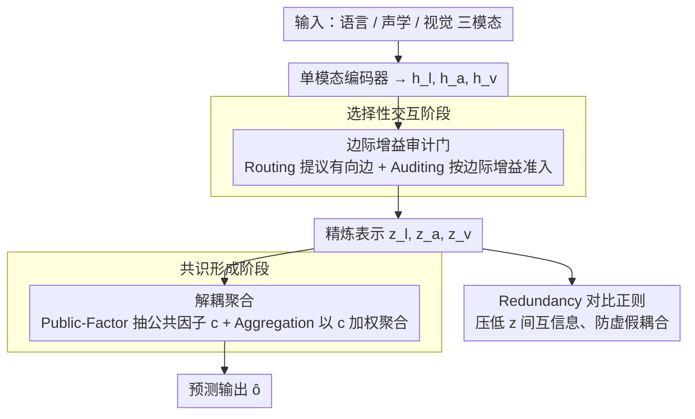

# Group Cognition Learning: Making Everything Better Through Governed Two-Stage Agents Collaboration

**会议**: ICML 2026  
**arXiv**: [2605.00370](https://arxiv.org/abs/2605.00370)  
**代码**: 无  
**领域**: 多模态情感分析 / 意图识别  
**关键词**: 多模态融合, 模态主导, 虚假耦合, 边际增益门控, 路由审计

## 一句话总结
针对集中式多模态融合带来的"模态主导"和"虚假模态耦合"两个痼疾，GCL 把多模态学习重写为**两阶段四 agent 的协议化协作**：第一阶段由 Routing/Auditing agent 用边际预测增益逐样本决定哪些跨模态交流被允许，第二阶段由 Public-Factor/Aggregation agent 把共享语义与私有特化解耦后再聚合，在 MOSI/MOSEI/MIntRec 上拿到 SOTA。

## 研究背景与动机
**领域现状**：多模态学习（语言 + 声学 + 视觉）目前的主流是**集中式融合**——要么 TFN/LMF 的张量积，要么 MulT 的跨模 attention，要么基于 BERT 的端到端微调。代表性进步线路是表示结构化（MISA、FDMER、ConFede 用 shared/private 分解）和优化干预（CGGM、MCIS 重新平衡梯度）。

**现有痛点**：所有这些方法都隐含一个假设——只要 task loss 在端到端反传，最优的交互模式会自然涌现。但实际上：(1) 梯度倾向于沿着"最容易降 loss 的那条模态路径"集中，弱模态被欠训练，模型对噪声极脆弱；(2) 端到端融合会奖励任何 cross-modal 相关，包括偶然性的——这就把不该耦合的模态死死绑在一起，导致分布外性能急剧下降。

**核心矛盾**：交互学习和表示学习耦合在了同一个 loss 里，没有任何**显式信号**区分"这次交互有用"和"这次交互冗余"。Routing/MoE 类工作引入了适应性，但仍然没有审计层来质问"这条边到底带来多少 marginal gain"。

**本文目标**：(1) 让 cross-modal 信息流的拓扑变成可观测、可监督的对象；(2) 用一个显式的 redundancy 控制项杀掉虚假耦合；(3) 让聚合阶段不再让某个强模态"通吃"，而是依赖 sample-wise 共享语义来加权。

**切入角度**：作者把 LLM-agent 那套"分工 + 治理"的隐喻搬到多模态融合上——与其让一个黑盒网络自由耦合三个模态，不如把交互过程拆成"提议路由 → 审计准入 → 抽取公共因子 → 加权聚合"四个明确职责，每个 agent 都被它自己的辅助 loss 监督。

**核心 idea**：用"边际预测增益"作为交互准入的硬指标，配合 redundancy contrastive penalty，把端到端融合改造成两阶段可审计协议。

## 方法详解

### 整体框架
GCL 想解决的是端到端融合里"交互学习"和"表示学习"挤在同一个 loss 里、谁也说不清哪次跨模态交流是有用的这个老问题。它的做法是把融合拆成一个有治理的两阶段协议：三个模态 $m\in\{l,a,v\}$ 的样本各自过 encoder 得到 $h_m$ 后，先进入"选择性交互"阶段——由 Routing 和 Auditing 两个 agent 共同决定哪些跨模态消息被允许流过，得到精炼表示 $z_n$；再进入"共识形成"阶段——由 Public-Factor 和 Aggregation 两个 agent 先蒸馏出共享语义、再以它为条件加权聚合，输出预测 $\hat o$。四个 agent 各自被一个辅助目标监督，整套系统用 task / local / public / gain alignment / redundancy 五项联合训练。

### 关键设计

**1. 边际增益审计门：用「值不值得交流」而非「想不想交流」来开边**

针对的痛点是 router/MoE 类方法只问"激活哪条路径"、从不问"激活这条路径到底有没有用"，于是噪声边也会被端到端梯度奖励。GCL 把准入做成一次可监督的审计：训练时定义一条 teacher gain $\Delta_{m\to n}=\ell_\tau(q_n^\tau(h_n),y)-\ell_\tau(q_n^\tau(\tilde h_n^m),y)$，其中 $\tilde h_n^m=h_n+\phi_{m\to n}(h_n,u_{m\to n})$ 是把消息 $u_{m\to n}$ 融进去后的暂态——这等于直接量出"加这条边后 task loss 降了多少"。推理时没有标签，所以再训一个增益预测器 $\hat\Delta_{m\to n}=g_g^{m\to n}(h_n,u_{m\to n})$ 来替代。最终的门把"想交流"和"值得交流"相乘：$\alpha_{m\to n}=\text{softmax}_{j}(\rho_{j\to n})_{j=m}\cdot\sigma_\kappa(\tilde\Delta_{m\to n})$，其中 $\rho_{m\to n}$ 是 Routing Agent 给每条有向边打的 logit；门控信息以 residual 形式注入 $z_n=h_n+\sum_{m\neq n}\alpha_{m\to n}\cdot\phi_{m\to n}(h_n,u_{m\to n})$。

之所以有效，是因为增益对齐 loss $\mathcal L_{\text{gain}}=-\sum_n\sum_{m\neq n}\alpha_{m\to n}\,\text{stopgrad}(\Delta_{m\to n})$ 会鼓励正增益边打开、负增益边关闭，而 stopgrad 又防止 teacher gain 被反传污染。这一招同时拿到两件好处：训练时有 ground-truth 监督信号，推理时只用学到的预测器、不增加任何 inference 成本。

**2. 解耦聚合：先抽公共因子，再让弱模态在「已知共识」下补充私有信息**

针对的痛点是传统融合算子（直接 concat）会让共享语义和私有特征纠缠，强模态 dominate 之后弱模态 $z_a/z_v$ 基本就废了。GCL 用一个置换不变算子（symmetric attention 或 global pool + MLP）$c=g_p(z_l,z_a,z_v)$ 把跨模态共享语义显式抽成 public factor，并加辅助监督 $\mathcal L_{\text{pub}}=\mathbb E\,\ell_\tau(g_\tau^c(c),y)$ 保证 $c$ 自己就能预测。随后 Aggregation Agent 以 $c$ 为 context，让每个模态生成 proposal $r_m=\eta_m(z_m,c)$ 和未归一分数 $s_m=g_a^m(z_m,c)$，做 $\pi_m=\text{softmax}(\{s_m\}_m)$ 得到 sample-wise 权重，最终 $\hat o=g_\tau(\sum_m\pi_m r_m,c)$。

把 $c$ 显式拎出来再用它调制每模态权重 $\pi_m$，等价于让模型先回答"在共识里我们已经知道了什么"，再问"这个模态私有信息还能额外贡献多少"。这种条件化避免了对共享信息的重复计数，也让弱模态的 incremental info 不会被强模态淹没。

**3. Redundancy 对比正则：控制流过来之后还能不能保留模态独特性**

针对的痛点是门控 $\alpha$ 只管信息的"流量"，却不管信息流过来之后所有模态是不是收敛到了同一个表示——routing 学到了边，仍可能制造虚假耦合。$\mathcal L_{\text{red}}$ 是一股反向力：用对称 InfoNCE 风格的对齐分数 $\mathcal L_{\text{red}}=\sum_{m<n}D(z_m,z_n)$，最小化它就要求精炼表示之间互信息低、彼此正交。消融能直接看到它的作用——去掉这一项后 MOSI 上 MAE 从 $0.685$ 涨到 $0.703$，HSIC/CKA 这类耦合诊断指标也急剧恶化。

### 损失函数 / 训练策略
总目标 $\mathcal L_{\text{total}} = \mathcal L_{\text{task}} + \lambda_{\text{loc}}\mathcal L_{\text{loc}} + \lambda_{\text{pub}}\mathcal L_{\text{pub}} + \lambda_{\text{gain}}\mathcal L_{\text{gain}} + \lambda_{\text{red}}\mathcal L_{\text{red}}$。其中 $\mathcal L_{\text{loc}}=\sum_m\mathbb E\,\ell_\tau(q_m^\tau(h_m),y)$ 单独监督每个单模态头，保证 teacher gain 估计可靠。优化用 Adam，batch 128，weight decay $1\text{e-}4$，patience 6，单卡 A100。

## 实验关键数据

### 主实验

| 数据集 | 指标 | GCL | 最强 baseline (TSDA) | 提升 |
|--------|------|------|----------|------|
| CMU-MOSI | MAE↓ | **0.685** | 0.695 | $-0.010$ |
| CMU-MOSI | Acc-2 | **86.79** | 86.3 | $+0.49$ |
| CMU-MOSI | Acc-7 | **49.06** | 48.6 | $+0.46$ |
| CMU-MOSEI | MAE↓ | **0.520** | 0.529 | $-0.009$ |
| CMU-MOSEI | Acc-2 | **86.78** | 86.3 | $+0.48$ |
| MIntRec | Acc | **72.74** | 72.59 | $+0.15$ |
| MIntRec | F1 | **70.95** | 70.68 | $+0.27$ |

### 消融实验

| 配置 | MOSI MAE | MOSI Acc-7 | 说明 |
|------|---------|------------|------|
| Full GCL | 0.685 | 49.06 | 完整模型 |
| w/o Routing Agent | 0.694 | 48.55 | 没有拓扑提议 |
| w/o Auditing Agent | 0.699 | 48.00 | 没有增益门控 |
| **Full exchange**（不审计、全开） | 0.721 | 46.10 | 比"只用语言"(0.714) 还差 |
| w/o Public-Factor Agent | 0.702 | 47.85 | 共享语义崩溃 |
| Uniform $\pi_m$ | 0.698 | 48.05 | 没了样本自适应权重 |
| w/o $\mathcal L_{\text{red}}$ | 0.703 | 47.70 | HSIC/CKA 急剧恶化 |
| **only $\mathcal L_{\text{task}}$** | 0.712 | 46.70 | 所有治理项都拿掉 → 退化 |

### 关键发现
- **不加治理的全开融合 (0.721) 比只用语言模态 (0.714) 更差**——这是文章最有冲击力的实证：盲目地"多模态融合"反而伤害性能，因为信噪比被噪声拉低。这一条直接证伪了"接更多模态总归不会更差"的隐含信仰。
- **效率惊喜**：GCL 117.56M 参数、每 epoch 20.06s，比 ConFede (256.98M, 40.12s) 减一半，比 EMOE (143.5M, 26.80s) 训练时间少 25%。"分工 + 治理"在工程上反而比"堆 MoE / 堆 expert"更轻。
- **噪声鲁棒性**：在 MOSI 上注入 $\sigma\in[0,20]$ 的高斯噪声，GCL 衰减曲线明显比 baseline 平缓，说明 auditing 门确实能在 SNR 下降时主动关掉脏信号。
- **Audited Selectivity 实验**（Fig 3）：GCL 占据 high-PGR、moderate-AR 象限（正增益比率高、激活率不浪费），而 NoAudit/Uniform/全开变体都在 high-AR low-PGR 那一片——也就是它们沟通很多但都没用。

## 亮点与洞察
- **把"边际增益"做成 loss**：把因果效应里的 $do(\cdot)$ 思想搬进多模态融合，让"这次交互值不值得做"变成可学习量，而不是靠端到端梯度玄学涌现。这一招理论上可以拓展到任意 graph-structured 网络的边激活。
- **Teacher gain + stopgrad 训练 / Student gain 推理**：典型的"训练时用 oracle 监督、推理时用学习器"，没有牺牲 inference 速度还多了一个 supervised 信号。这个 trick 在 distillation、actor-critic、verifier-guided generation 里都能复用。
- **Full exchange 比 unimodal 还差**：这条实验结论本身就值得被反复引用，等于在用数据驳斥多模态社区"模态越多越好"的默认假设。
- **Public factor 作为路由 context**：把"共享语义"显式做成路由的条件输入，等价于先回答"我们在共识里已经知道了什么"再问"私有信息还能贡献什么"，避免重复计数共享信息。

## 局限与展望
- 论文领域被标为 audio_speech，但其实是多模态情感分析 + 意图识别——所谓"声学"只是三个模态之一，对纯语音/ASR 任务没有任何评估。
- Teacher gain 的估计依赖单步残差 $\tilde h_n^m=h_n+\phi(\cdot)$ 的近似，多步深层交互的 marginal effect 没考虑；扩展到长 chain 或 N>3 个模态时组合爆炸严重。
- 主要 benchmark MOSI/MOSEI/MIntRec 规模都偏小（千~万样本），没在大规模视觉-语言数据集（如 LAION 子集、AudioSet）上验证。
- 缺少与 LLM-based 多模态方法（如 VideoLLaMA、Qwen-Audio）对比，无法判断在 LLM 时代 GCL 这种轻量协议是否还有相对优势。

## 相关工作与启发
- **vs MISA / FDMER（disentanglement 系）**: 它们也分 shared/private，但 disentangle 是在表示层、靠 reconstruction 损失约束；GCL 把 shared 这件事提到聚合层并和路由耦合，且 gain alignment 显式监督边的有用性。
- **vs CGGM / MCIS（梯度平衡系）**: 它们在反传时改梯度大小来平衡模态贡献；GCL 在前向就用 $\alpha$ 控制信息能否流过，相当于在源头治理，理论上更干净。
- **vs EMOE / Mixture-of-Experts**: 二者都引入 routing，但 MoE 不审计 expert 输出；GCL 的 Auditing Agent 等价于给每个 expert 安一个"必要性检查器"，参数更少效果更好。
- **启发**：把"边/expert 的预测增益"做成可监督量这一招可以直接迁移到 GNN 的边预测、retrieval-augmented LLM 的 doc 选择、tool-use agent 的 tool 选择——任何"是否激活一条信息路径"的决策都可以套上 GCL 的 teacher-gain 框架。

## 评分
- 新颖性: ⭐⭐⭐⭐ 把"边际增益审计"显式做成多模态融合的治理协议是一个有原创性的角度
- 实验充分度: ⭐⭐⭐ benchmark 都是小规模情感/意图，缺大规模 / LLM 时代对手
- 写作质量: ⭐⭐⭐⭐ 把四个 agent 的职责、损失、监督讲得很清楚，消融全面
- 价值: ⭐⭐⭐⭐ "Full exchange 比单模态还差"+"轻量化超越 MoE" 两条实证有跨子领域价值

<!-- RELATED:START -->

## 相关论文

- [\[ICML 2026\] Two-Dimensional Quantization for Geometry-Aware Audio Coding](two-dimensional_quantization_for_geometry-aware_audio_coding.md)
- [\[ICCV 2025\] Everything is a Video: Unifying Modalities through Next-Frame Prediction](../../ICCV2025/audio_speech/everything_is_a_video_unifying_modalities_through_next-frame_prediction.md)
- [\[ICML 2026\] SafeSearch: Automated Red-Teaming of LLM-Based Search Agents](safesearch_automated_red-teaming_of_llm-based_search_agents.md)
- [\[ICML 2026\] The Silent Thought: Modeling Internal Cognition in Full-Duplex Spoken Dialogue Models via Latent Reasoning](the_silent_thought_modeling_internal_cognition_in_full-duplex_spoken_dialogue_mo.md)
- [\[ICML 2026\] Algorithmic Recourse of In-Context Learning for Tabular Data](algorithmic_recourse_of_in-context_learning_for_tabular_data.md)

<!-- RELATED:END -->
