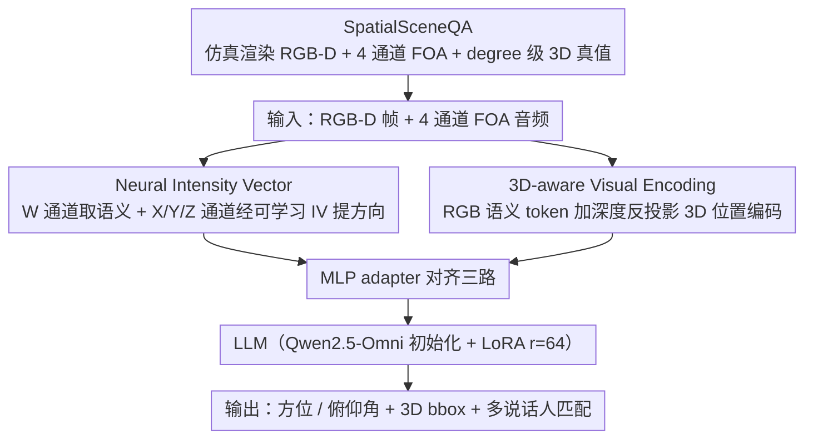

# JAEGER: Joint 3D Audio-Visual Grounding and Reasoning in Simulated Physical Environments

**会议**: ICML 2026  
**arXiv**: [2602.18527](https://arxiv.org/abs/2602.18527)  
**代码**: https://github.com/liuzhan22/JAEGER  
**领域**: 多模态VLM / 音频语音 / 3D视觉  
**关键词**: 空间音频, FOA, RGB-D, 3D 视觉接地, 音视频 LLM

## 一句话总结
JAEGER 在 Qwen2.5-Omni 基础上用 LoRA 适配出一个端到端的 3D 音视频大模型，通过 RGB-D 深度位置编码 + 一阶 Ambisonics (FOA) 双路音频 + 新提出的 Neural Intensity Vector，将传统 AV-LLM 从「2D RGB + 单声道」扩展到「3D 几何 + 多通道空间音频」，并配套发布了 61k 样本的 SpatialSceneQA 仿真基准。

## 研究背景与动机

**领域现状**：当前主流的音视频大模型 (AV-LLM) 如 Qwen2.5-Omni、VideoLLaMA 2 几乎全部基于「RGB 视频 + 单声道音频」的 2D 设定，把空间结构和方向性声学完全留作隐式信息。3D 视觉接地最近虽然热门，但大多数工作只单独处理视觉侧（点云、RGB-D + 3D 位置编码）或音频侧（双耳编码器、强度矢量），缺乏统一范式。

**现有痛点**：第一，**模态维度不匹配**——单声道音频原则上无法做声源定向，RGB 视频缺尺度信息无法回归 3D box，两个模态各自欠 1 维。第二，已有的跨模态尝试要么像 Hear You Are 假设单声源且只有 RGB 全景图，无法测重叠源鲁棒性和深度感知接地；要么像 SAVVY 用级联管线靠传统信号处理做 DoA，阻断了端到端学习。第三，可用数据稀缺，STARSS23 等真实多通道数据集没有对齐深度。

**核心矛盾**：要做真正的 3D 物理推理，必须同时拥有**度量级几何**（深度 + 相机内外参）和**方向级声学**（多通道空间音频），而经典的 STFT-based intensity vector 在强混响和重叠声源下会退化，传统几何分支又依赖外部 3D 分割器，两端都不是端到端可学习的。

**本文目标**：(i) 在统一 AV-LLM 框架内端到端做 DoA 估计、3D box 接地、多说话人音视匹配；(ii) 设计在混响/重叠条件下也鲁棒的空间音频表示；(iii) 提供带 degree 级方位俯仰真值的大规模仿真数据。

**切入角度**：仿真链路 Habitat-Sim + SoundSpaces 2.0 + Hunyuan3D-1.0 已经成熟，可以同步渲染 RGB-D + FOA + 精确 3D 真值；而 Classical IV 的物理形式 $I'_C = F_W^* \odot F_C$ 完全可以推广到 latent 空间，让神经网络学一个比 STFT 更鲁棒的「intensity vector」。

**核心 idea**：用「Neural IV (CNN 编码的可学习 FOA 强度矢量) + 深度反投影的 3D 正弦位置编码」两件事，把 AV-LLM 从 2D 升到 3D，端到端联合训练。

## 方法详解

### 整体框架
JAEGER 的输入是同步采集的 RGB-D 帧 + 4 通道 FOA 音频（含 W/X/Y/Z 四个通道），输出是自然语言 + 结构化 3D 信息（azimuth、elevation 角，3D bbox `bbox(c, x, y, z, sx, sy, sz)`，多说话人匹配标签 Left/Center/Right）。整体走「Visual Stream + Audio Stream → MLP 投影 → LLM（Qwen2.5-Omni 初始化 + LoRA r=64）」。Visual Stream 把 RGB 语义 token 与从深度反投影出来的 3D 正弦位置编码做 element-wise 加；Audio Stream 走双路：W 通道提语义内容，X/Y/Z 通道经 Classical IV 或 Neural IV 提空间方向线索；两路与 visual 一起被 MLP adapter 对齐后送进 LLM。任务相关地选择性微调：仅训音频侧做 DoA，仅训视觉侧做 grounding，全部模态投影 + LoRA 一起训做 joint reasoning。

### 关键设计

**1. Neural Intensity Vector（Neural IV，本文核心新颖点）：让网络替 STFT 在混响/重叠声源下学方向**

经典做法靠 STFT-based Classical IV 提空间方向，但它依赖固定的频谱变换，一旦强混响或多声源重叠，复谱互谱 $F_W^* \odot F_C$ 里的噪声会被放大，方向估计就退化。JAEGER 的办法是把这套物理结构整体抬进 latent 空间、把固定变换换成可学习模块：先用 data2vec 风格的 7 层 1D-CNN（kernel `(10,3,3,3,3,2,2)`、stride `(5,2,2,2,2,2,2)`、50 Hz 帧率）把每个 FOA 通道编码成 latent，得到全向通道 $f_W$ 和三个方向通道 $f_C,\ C \in \{X,Y,Z\}$。然后保留 Classical IV 「omni × directional 元素积」这一物理上正确的强度矢量骨架，把复共轭乘法换成 latent Hadamard 积 $h_C = f_W \odot f_C$，再拼接过两层 MLP 输出最终方向表示：

$$\mathbf{v}_{\text{NIV}} = \text{Linear}(\text{ReLU}(\text{Linear}(\text{Concat}(h_X, h_Y, h_Z)))).$$

这样既没丢掉声学第一性原理给出的强度矢量结构，又让 CNN 在数据驱动下学到比固定 STFT 更稳的方向 embedding——实验里它正是在重叠源和跨场景泛化这些「难场景」上把误差拉开的。

**2. 3D-aware Visual Encoding：用深度反投影 + 3D 正弦位置编码把视觉 token 接地到度量空间**

单目 RGB 缺乏度量尺度，直接让 LLM 回归 3D box center 误差很大，所以要把「这一格 token 对应物理世界哪个位置」显式喂给模型。具体做法是用相机内参把每个像素 $(u,v)$ 连同深度 $D_{uv}$ 反投影为度量 3D 点 $P_{uv} = D_{uv} \cdot K^{-1} [u, v, 1]^\top$，得到与 RGB 同分辨率的点云 $P \in \mathbb{R}^{H\times W\times 3}$，再用 adaptive average pooling 对齐到 visual feature 的分辨率 $h\times w\times c$。三个坐标轴 $\alpha \in \{x,y,z\}$ 各占 $\lfloor c/3 \rfloor$ 通道，按正弦公式 $\text{PE}(\alpha, 2j) = \sin(\alpha / 10000^{2j/\lfloor c/3 \rfloor})$ 编码后拼成 $F_{3D}$，最后与语义 token 逐元素相加 $\tilde F_{\text{visual}} = F_{\text{visual}} + F_{3D}$。有了这组度量坐标先验，bbox 中心回归就从「凭空猜尺度」变成「在已知坐标系里查询」，3D IoU 和 visual offset 都因此改善。

**3. SpatialSceneQA：61k 仿真音视联合基准，作为方法的一部分被构建**

真实多通道数据集如 STARSS23 既没有对齐深度、规模又小，没法支撑端到端的 3D 音视训练，所以作者干脆用成熟仿真链路造一份带 degree 级真值的数据。流程分三步：用 SoundSpaces 2.0 在 HM3D 网格上做双向路径追踪渲染房间脉冲响应，FOA 信号由干语音卷积 RIR 得到 $A_c^{(r)}(t) = R_c(\cdot;\mathbf{s},\mathbf{r},\theta) * A^{(s)}(t)$，干语音取自 LibriSpeech，源-接收器距离限定 1–4 m、强制同房间、留 0.5 m 障碍物余量；用 Habitat-Sim 渲染同步的 RGB-D 和语义掩码；再用 Hunyuan3D-1.0 生成 120 个落地音箱 mesh 插入场景，以语义图 ≥500 像素（1920×1080）的可见性约束过滤遮挡。划分上特意做了两层防泄漏：按 HM3D 场景级切 130/15/36 的 train/val/test 避免房间几何泄漏，音箱 mesh 单独按 96/12/12 切以测对未见几何的泛化；每个场景插入 1–3 个 candidate，强制模型靠几何接地而非物体类别走捷径。最终覆盖 5 类任务：单源 DoA、重叠源 DoA、3D 视觉接地、单源多说话人匹配、重叠源多说话人匹配。

### 损失函数 / 训练策略
- LLM 全部走 LoRA（r=64, α=128, dropout 0.05），Qwen2.5-Omni 权重初始化视觉编码器/单声道音频分支/LLM decoder；Neural IV 与新的 audio adapter 随机初始化。
- 任务相关选择性微调：A/B（DoA）只训音频编码器 + Neural IV + projector；C（视觉接地）只训视觉编码器 + projector；D/E（联合推理）训所有模态编码器 + projector。
- A100 40GB，batch 1–3，3k–6k 步；cosine lr scheduler + 2.5k 步线性 warm-up；峰值 lr $1\times 10^{-5}$，weight decay 0.05。

## 实验关键数据

### 主实验

| 模型 | 模态 | Audio DoA $\downarrow$ | Overlap DoA $\downarrow$ | 3D IoU $\uparrow$ | Visual Offset $\downarrow$ | 1-spk Acc $\uparrow$ | 2-spk Acc $\uparrow$ |
|------|------|------------------------|--------------------------|-------------------|----------------------------|---------------------|---------------------|
| Random | – | 90° | 90° | 0.00 | $\infty$ | 45.6 | 47.4 |
| Qwen2.5-Omni (zero-shot) | RGB + Mono | – | – | 0.00 | 2.40 m | 35.8 | 44.0 |
| BAT (5 ep) | Binaural | 2.16° | 19.09° | – | – | – | – |
| Qwen3-VL-8B (zero-shot) | RGB | – | – | 0.01 | 1.11 m | – | – |
| N3D-VLM (zero-shot) | RGB-D | – | – | 0.00 | 2.04 m | – | – |
| **JAEGER (Classical IV)** | RGB-D + FOA | 2.95° | 6.44° | 0.32 | 0.16 m | 99.5 | 98.6 |
| **JAEGER (Neural IV)** | RGB-D + FOA | **2.21°** | **4.11°** | **0.32** | **0.16 m** | **99.5** | **99.2** |

DoA 用 Median Angular Error（°），joint reasoning 是 3 选 1 分类用 Accuracy。最关键观察：单源 DoA 上 Neural IV 与 BAT 持平（2.21° vs 2.16°），**但重叠源上从 19.09° 砍到 4.11°，差距近 5×**；joint reasoning 上 2D AV-LLM 即使 fine-tune 也只能在 ~35–45% 徘徊，JAEGER 直接到 99.2%。

### 消融实验

| 配置 | 1-spk Acc | 2-spk Acc | 说明 |
|------|-----------|-----------|------|
| Ours (Neural IV) | 99.5 | 99.2 | 完整模型 |
| Ours (Classical IV) | 99.5 | 98.6 | 换回 STFT-based IV，重叠场景掉 0.6 |
| Ours (Neural) w/o Depth | 96.9 | 94.9 | 去掉 3D PE，掉 2.6 / 4.3 |
| Ours (Classical) w/o Depth | 99.2 | 98.7 | 同上，Classical 路径对 depth 不太敏感 |
| Ours w/o FOA Encoder | 43.8 | 47.6 | **去掉 FOA → 崩到 random** |
| Ours w/o Depth & FOA | 43.8 | 45.7 | 双去 → random |

跨场景泛化（MAE °，Cross-evaluation）：

| 训练 \ 测试 | Classical Single | Classical Overlap | Neural Single | Neural Overlap |
|--------------|-------------------|--------------------|----------------|-----------------|
| 训 Single | 2.95° | **18.35°** | 2.21° | **14.91°** |
| 训 Overlap | **19.25°** | 6.44° | **14.85°** | 4.11° |

Neural IV 在所有「训-测错配」格子里都比 Classical 更稳（14.85° vs 19.25°），说明它学到了更内在的方向 cue。

3D-aware Encoding 消融（Task C）：加 depth 后 Mean 3D IoU 从 0.29 → 0.32，Median Visual Offset 从 0.18 m → 0.16 m。

### 关键发现
- **FOA 编码器是 joint reasoning 的命门**：去掉直接掉到 random（43.8%），即使有 RGB-D 和 LoRA fine-tune 都救不回——证明单声道输入根本无法做空间消歧，论文的"必须显式 3D"论点有强经验支撑。
- **Neural IV 的收益主要在「难场景」**：单源时和 Classical IV 几乎打平（99.5 vs 99.5），但重叠源、跨场景泛化上稳定优于 Classical（4.11° vs 6.44°，14.91° vs 18.35°），说明可学习 spatial encoder 的价值在 SNR/混响恶化时才放大。
- **Depth 对 Neural 路径影响 > Classical 路径**：Neural w/o depth 在 2-spk 上掉 4.3 个点，Classical 只掉 -0.1；猜测原因是 Neural IV 提供的方向更精，反而对 depth 缺失更敏感（一个轴的精度撑不起另一个轴的模糊）。

## 亮点与洞察
- **把物理公式抬到 latent 空间是个可复用的设计**：Classical IV 的核心结构 $F_W^* \odot F_C$ 是从声学第一性原理推出来的，作者没有抛弃这个结构，而是把 STFT 换成 CNN、把复共轭乘法换成 latent Hadamard，整个 Neural IV 长得像「物理先验 + 数据驱动」混血——这种「保留物理算子骨架，只把固定变换替换成可学习模块」的范式在很多信号处理 → 神经化的场景都可以借鉴（雷达、声呐、超声波）。
- **仿真链路工程化**：HM3D + SoundSpaces 2.0 + Hunyuan3D-1.0 + LibriSpeech 这一套是真正能产 degree 级真值的最低代价路径，作者把场景级 split、可见性约束（500 像素）、几何泛化 split（96/12/12 音箱 mesh）等细节都处理得很扎实，让基准本身的 train-test 干净度有保证。
- **「2D AV-LLM 即使 fine-tune 也不行」是个强叙事**：让 Qwen2.5-Omni 在自家数据上微调（默认会假设这能救场）依然崩到 random，是把「3D 模态不可省」从直觉论证升级到了反事实经验论证，写法很值得学。

## 局限与展望
- **完全仿真，没有真实声学验证**：作者自己承认 SoundSpaces 2.0 的 RIR 渲染（双向路径追踪 + HRTF）与真实麦克风阵列/RGB-D 传感器在同步、校准、噪声特性上都有差距，迁移到真实采集可能掉点严重；缺一个 STARSS23 之类真实集上的 zero-shot 评测会更说服力。
- **场景设定相对受控**：源-接收器强制同房间且距离 1–4 m、500 像素可见性下限、最多 3 个 candidate loudspeaker——重度遮挡、跨房间、远距离（>4 m）、>3 个 candidate 的情况都没测，这些恰恰是真实 embodied 场景常见的难点。
- **任务粒度有限**：当前 task 是静态单帧 + 静态声源；动态轨迹、声源移动、说话人转头、长时序推理（如「先听到谁说话再走过去」）这些 embodied 真实需求都还没覆盖；SAVVY 有动态轨迹任务可以对位扩展。
- **Neural IV 的「物理可解释性」可以再挖**：作者只验证了 end-to-end 性能，但 $h_C = f_W \odot f_C$ 这个 latent intensity 在网络里到底学到了什么方向 embedding？做 probing / 可视化能让物理学家也信任这个模块。

## 相关工作与启发
- **vs Hear You Are (Ryu et al., 2026)**: 它配 panoramic RGB + 双耳，但单源假设 + 无深度，无法测 overlap-robust 和深度感知接地；JAEGER 直接上 RGB-D + 4 通道 FOA + ≥2 candidate 的重叠源设定。
- **vs SAVVY (Chen et al., 2025)**: 同样融 RGB-D + 多通道音频，但走 cascaded pipeline + 传统 DSP 做 DoA，无法端到端；JAEGER 把 DoA 内化到 LLM token，端到端可微，joint reasoning 能跑到 99.2%。
- **vs BAT (Zheng et al., 2024)**: 双耳 + HRTF，单源精度 2.16° 略优于 JAEGER 的 2.21°，但 BAT 的双耳表示在重叠源（19.09°）和跨设备/HRTF 泛化上是结构性弱项；JAEGER 走硬件无关的 FOA + Neural IV 更通用。
- **vs N3D-VLM (Wang et al., 2025)**: N3D-VLM 是纯视觉 3D 接地路径，证明 RGB-D + 3D PE 能让 LLM 直接出 3D bbox；JAEGER 几乎照搬这套视觉前端，把它和音频路径融起来——说明 3D 视觉接地的最佳实践已经基本收敛，下一步就是加模态。
- **vs Tang et al. (2024)**: 把 Classical IV 注入 auditory LLM 做定位条件语音处理，JAEGER 沿用其 IV 思路但把 STFT 换成 CNN，并扩展到全模态 LLM。

## 评分
- 新颖性: ⭐⭐⭐⭐ Neural IV 是把经典 IV 神经化的清晰增量；3D-aware 视觉编码沿用 N3D-VLM；SpatialSceneQA 基准是工程贡献。整体是「正确路径 + 干净执行」型论文。
- 实验充分度: ⭐⭐⭐⭐ 主表 + 跨场景泛化矩阵 + depth/FOA/IV 三向消融都做了，"去掉 FOA 直接到 random"这一拳很有说服力；扣分在于纯仿真无真实声学迁移。
- 写作质量: ⭐⭐⭐⭐ 动机—痛点—公式—消融的因果链清晰，Classical IV → Neural IV 的物理对照表 + 图 2 把 contribution 讲得很直观。
- 价值: ⭐⭐⭐⭐ 数据集 + 端到端 3D AV-LLM 范式 + 代码模型全开源，对 embodied AI 和空间音视频领域是一块可直接复用的基础设施。

<!-- RELATED:START -->

## 相关论文

- [\[ICML 2026\] Probing Cross-modal Information Hubs in Audio-Visual LLMs](probing_cross-modal_information_hubs_in_audio-visual_llms.md)
- [\[ICML 2026\] Multimodal Fact-Level Attribution for Verifiable Reasoning](multimodal_fact-level_attribution_for_verifiable_reasoning.md)
- [\[ACL 2026\] Analyzing Reasoning Shifts in Audio Deepfake Detection under Adversarial Attacks: The Reasoning Tax versus Shield Bifurcation](../../ACL2026/audio_speech/analyzing_reasoning_shifts_in_audio_deepfake_detection_under_adversarial_attacks.md)
- [\[ICML 2025\] Teaching Physical Awareness to LLMs through Sounds](../../ICML2025/audio_speech/teaching_physical_awareness_to_llms_through_sounds.md)
- [\[CVPR 2026\] EgoAVU: Egocentric Audio-Visual Understanding](../../CVPR2026/audio_speech/egoavu_egocentric_audio-visual_understanding.md)

<!-- RELATED:END -->
