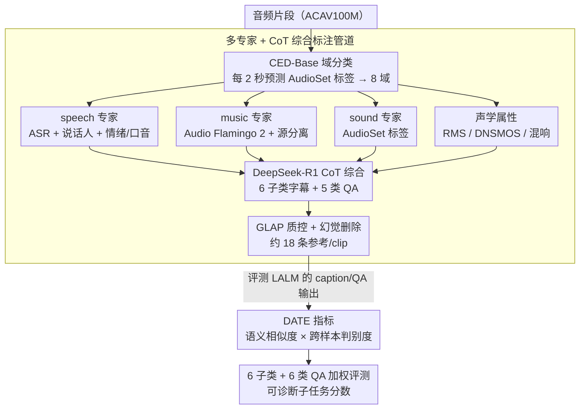

# MECAT: A Multi-Experts Constructed Benchmark for Fine-Grained Audio Understanding Tasks

**会议**: ICML 2026  
**arXiv**: [2507.23511](https://arxiv.org/abs/2507.23511)  
**代码**: https://github.com/xiaomi-research/mecat  
**领域**: 音频-语言理解 / 评测基准  
**关键词**: 细粒度音频理解, 多专家流水线, 开放式 QA, 区分性评估指标 DATE, ACAV100M

## 一句话总结
MECAT 用「多专家模型 + CoT 大模型推理」构造了 20k 条多视角细粒度音频字幕与 10 万条开放式 QA，并提出 DATE 指标（语义相似度 × 跨样本可区分度的调和平均），首次能稳定区分泛泛而谈与细节准确的音频模型输出。

## 研究背景与动机

**领域现状**：大型音频-语言模型（LALM）从封闭式分类/ASR 转向开放式音频字幕和 QA。代表评测有 AudioCaps、Clotho（人工标注字幕）、ClothoAQA、MMAU（QA）；指标主流是 BLEU/CIDEr/SPICE（词面匹配）、FENSE（嵌入相似度）、LLM-as-judge。

**现有痛点**：(1) 数据上——人工字幕只写事件级粗描述（「狗在叫」），AutoACD / LPMusicCaps 等用 LLM 自动标但输入元数据本身就粗，granularity 没解决；QA 多为 yes/no 或多选，无法测开放式生成。(2) 数据源高度同质——大量 benchmark 都来自 AudioSet，「一音多用」严重，模型泛化能力被高估。(3) 指标上——词面匹配惩罚同义改写；嵌入相似度仍区分不出「狗在叫人在说话」（generic）与「公园里一只兴奋的狗发出短促吠叫，旁边有人聊天」（detailed）这两种输出的好坏；LLM-as-judge 区分力够但贵、慢、对 prompt 敏感。

**核心矛盾**：要评估 LALM 是否真正听懂音频，需要 (a) 多视角且细粒度的参考标注，让模型有空间表达细节差异；(b) 一个能奖励「细节准确」并惩罚「泛泛而谈」的可扩展指标。两者目前都缺。

**本文目标**：(i) 构造一个数据源新颖、域覆盖全、字幕粒度细的音频 caption + QA 基准；(ii) 设计一个不依赖 LLM judge、却比 FENSE 更具区分力的开放式生成评估指标；(iii) 系统评测当前 SOTA LALM，揭示其细粒度感知能力的真实瓶颈。

**切入角度**：作者观察到——既然单个 LLM 自动标注容易出粗描述，那不如先用一整套领域专家模型（speech / music / sound events / 声学属性各一组专家）抽取结构化分析，再让 LLM 用 CoT 综合所有专家证据写出多视角描述；评估指标则在 Sentence-BERT 嵌入基础上加上「TF-IDF 加权」与「跨样本排名得分」，单边的相似度变成「相对其他样本是否更匹配」的判别问题。

**核心 idea**：用「多专家管道生成 + 分系统/内容/无关三大类多视角字幕」喂数据，用「TF-IDF 加权嵌入 × 跨样本判别力」造 DATE 指标，让评测从「平均看像不像」变成「能不能把这条样本和其它样本拉开距离」。

## 方法详解

### 整体框架
MECAT 想回答一个问题：怎样才能判断一个音频模型是真听懂了细节，还是只会写「狗在叫、有人说话」这种通用句。它把这件事拆成两半——一半是造一批「细到能让模型有空间露馅」的参考数据，另一半是设计一个「能把泛泛而谈和细节准确拉开分」的指标。数据侧用一套领域专家模型先把音频里能结构化的属性全抽出来，再让大模型做 CoT 推理综合成多视角字幕与 QA；评测侧则在语义相似度之外再加一层跨样本判别，构成 DATE 指标。

### 关键设计

**1. 多专家 + CoT 综合的标注管道：让 LLM 看证据而不是看原始音频**

直接让一个 LLM 听 raw audio 写字幕，结果往往是「一只狗在叫，有人说话」这类对谁都成立的通用句——granularity 上不去的根因就在这里。MECAT 的思路是先把音频里「能被专门模型测准」的属性结构化抽出来，再把这些证据喂给 LLM 推理。流程是：先用 CED-Base 在每 2 秒窗预测 AudioSet 标签确定域分类（silence/speech/music/sound 四纯 + 四混合共八域）；speech 域走 ASR + 说话人分离 + 性别/年龄/情绪/口音属性识别；music 域走 Audio Flamingo 2 全局描述 + 属性 + vocal/instrument 源分离（分离出的 vocal 再回流到 speech 管道复用）；sound 域直接用 AudioSet 标签；声学属性管道则统一抽 RMS、DNSMOS/NISQA2、混响时间。DeepSeek-R1 拿到所有专家输出加元数据，按规则化 prompt 做 CoT 推理，输出 6 子类字幕（systemic long/short、speech、music、sound、acoustic）和 5 类 QA，每条带置信度。当 LLM 手里握着 ASR 转录、情绪标签、tempo、混响时间这些硬证据时，CoT 推出的字幕会自然带上细节，而不是回退到模板句。质控上用 GLAP 算 audio-caption 余弦相似度，要求正确配对的相似度比 6 个随机字幕的平均值高出阈值 6 才保留，再叠加置信度阈值、域一致性校验和幻觉删除，最终每个 clip 得到约 18 条参考字幕。

**2. DATE 指标：单样本语义相似度 × 跨样本可区分度的调和平均**

FENSE 这类嵌入相似度指标有个老毛病：「一只狗在叫」对所有狗音频都拿高分，generic 和 detailed 的输出几乎同分，根本排不出好坏；而 LLM-as-judge 虽然区分得开却又贵又慢。DATE 的做法是把「这条描述好不好」从绝对相似度改造成「相对其他样本是不是更匹配」的判别问题。它先做 TF-IDF 加权的 Sentence-BERT 嵌入，句向量 $\mathbf{v}_T=\sum_t (\text{TF}_{emb}(t,T)\cdot\text{IDF}_{emb}(t))\cdot E(t)$，让稀有、有区分性的词权重更大；单样本相似度就是 $S_{sim,i}=\cos(\mathbf{v}_{cand},\mathbf{v}_{ref})$。关键的第二项是构造跨样本相似度矩阵 $\mathcal{M}$，对样本 $i$ 看它的对角元 $M_{i,i}$ 在第 $i$ 行所有候选分里的排名 $r_i$，转成可区分度 $S_{dis,i}=1-r_i/N$——也就是这条字幕是不是在它对应的那条音频上比对别的音频更匹配。两项取调和平均得 $\text{DATE}_i=\frac{2\cdot S_{sim,i}\cdot S_{dis,i}}{S_{sim,i}+S_{dis,i}}\in[0,1]$。引入跨样本排名后，generic 描述因为「对每条音频都模糊地像」必然吃到很低的判别分，调和平均又强迫两项都高才能拿高分，于是通用模板答案被系统性地压下去。

**3. 6 子类字幕 + 6 类 QA 的加权评测：把「细粒度」拆成可诊断的子任务**

一个总分容易被某个强项洗白，看不出模型到底栽在哪。MECAT 把细粒度拆成可独立测、可加权聚合的子任务。字幕侧 $\text{Score}_{Cap}=0.4\cdot S_{Systemic}+0.4\cdot S_{Content\text{-}Specific}+0.2\cdot S_{Content\text{-}Unrelated}$，其中 $S_{Systemic}=0.8\cdot S_{Long}+0.2\cdot S_{Short}$，$S_{Content\text{-}Specific}=0.6\cdot S_{Speech}+0.3\cdot S_{Music}+0.1\cdot S_{Sound}$，权重粗略反映 ACAV100M 的内容分布；敏感度分析显示即使改动这些权重，模型排名依然稳定（Kendall's $\tau=0.92$）。QA 侧分 Perception（DP）、Analysis（SC、QAS）、Reasoning（ER、IJ、AC）六类，等权平均 $\text{Score}_{QA}=(S_{DP}+S_{SC}+S_{QAS}+S_{ER}+S_{IJ}+S_{AC})/6$。每个内容子类还按「纯」和「混合」域分别评估（如 speech 在纯域 S00 与混合域 SM0/SMA），专门测复杂声学场景下的鲁棒性。这样拆开后，模型在 long 描述 vs short、纯音 vs 混音、感知 vs 推理上的差距能被直接读出来，给后续改进提供精确的诊断信号。

### 损失函数 / 训练策略
非训练论文，无 loss。评测时所有 LALM 通过 huggingface 接口或官方推理脚本生成 caption / QA 答复，用 DATE 计算分数。

## 实验关键数据

### 主实验
评测多家 SOTA LALM 在 MECAT-Caption 上的 DATE (%) 表现（Table 2 部分摘录）：

| 模型 | Systemic Long | Speech (Pure) | Music (Pure) | Sound (Pure) | $\text{Score}_{Cap}$ |
|---|---|---|---|---|---|
| Caption-Only baseline | 较低 | 较低 | 较低 | 较低 | 较低 |
| 主流 LALM（如 Audio Flamingo / Qwen-Audio 等）| 见原表 | 见原表 | 见原表 | 见原表 | 见原表 |

（原文 Table 2 列出 caption-only / 通用 LALM / MiMo-Audio 等十余模型在 12 个细粒度维度上的得分，整体结论：所有模型在 systemic long、混合域、sound-pure 上都明显比 short 与 speech-pure 差，揭示细粒度差距远比传统 benchmark 显示的大。）

### 消融实验（指标 / 权重）

| 配置 | 现象 |
|---|---|
| 单用相似度（FENSE） | generic vs detailed 输出几乎同分，模型排名混乱 |
| 单用跨样本判别 | 短句机会大，惩罚详细描述 |
| **DATE (调和平均)** | 模型排名与 LLM-as-judge 高度一致，CDF 曲线在 caption / QA 两边的可区分性最优 |
| 字幕权重 $(0.4,0.4,0.2)$ 改 $(0.5,0.3,0.2)$ 等 | Kendall's $\tau=0.92$，模型排名稳定 |
| Content-Specific 内权重 0.6/0.3/0.1 | 按 ACAV100M 内容分布调整，排名同样稳定 |

### 关键发现
- 现有 LALM 在 systemic long caption 上得分普遍最低，说明它们能识别声音却无法把多事件组织成有上下文的长描述；这是 fine-grained 评测最容易暴露的弱点。
- 混合域（如 SMA：speech + music + sound）相比纯域得分掉很多，说明 LALM 在「多源混合声学场景」下的细节捕捉远未成熟。
- DATE 与 LLM-as-judge 的 CDF 距离明显大于 FENSE 与 LLM-as-judge 的距离，证明在不付出 LLM 成本的前提下 DATE 已能逼近 judge 的区分力。

## 亮点与洞察
- 「多专家 + CoT 综合」标注管道是个非常可迁移的设计模式：在任何领域，先用一组小而专的模型把可结构化的属性抽出来再让 LLM 综合，比让 LLM 直接看 raw modality 写描述更可靠；这套思路也适用于视频、医学影像等其它评测构造。
- DATE 的「单样本相似度 × 跨样本判别度」是评估开放式生成的一个普适新范式——把「这条好不好」从绝对得分转成「相对其他更匹配」，天然抑制了通用模板答案。
- 6 子类字幕设计中显式让模型在「该域不存在时也要说出来」（如纯音乐片段的 speech caption 应回答「无人说话」）是个聪明的细节，把幻觉的代价直接编进了参考标注。

## 局限与展望
- 数据来源仍是单一 ACAV100M，虽然换了源但生态多样性仍有上限；多源混合数据集（YouTube/Podcast/Movie）会更鲁棒。
- 音频片段限制在 10s 以内，无法评测真实长音频（podcast、讲座）下的理解能力。
- DATE 依赖 Sentence-BERT 嵌入做语义近似，对中文/小语种和专业术语场景可能需要替换 embedding。
- 评测中涉及厂商利益冲突披露（部分作者来自小米，旗下 MiMo-Audio 参与评测）；外部独立复现很重要。

## 相关工作与启发
- **vs AudioCaps / Clotho**：粗事件级 vs 多视角细粒度，参考字幕从 1 条扩到 18 条/clip，词汇丰富度大幅提升。
- **vs LPMusicCaps / AutoACD（LLM 自动标注）**：单纯 LLM 看粗元数据写字幕仍会产生通用描述；MECAT 用专家管道喂结构化证据让 CoT 真正能写细节。
- **vs MMAU（多选 QA）**：MMAU 是封闭式多选，本工作走开放式生成 + DATE 评估，能测「生成能力」而非「猜答能力」。
- **vs FENSE**：FENSE 是音频字幕的嵌入相似度指标，但实验显示其对 generic vs detailed 输出区分力不足；DATE 通过跨样本判别项补足。

## 评分
- 新颖性: ⭐⭐⭐⭐ 多专家管道 + DATE 指标都是开放式音频评测里第一次系统结合的方案。
- 实验充分度: ⭐⭐⭐⭐ 评测十余 SOTA LALM、做了权重敏感性分析、提供 CDF 区分度可视化，但模型选择多偏「通用 LALM」，专注于音乐或医疗音频的窄域模型未覆盖。
- 写作质量: ⭐⭐⭐⭐ 任务定义清楚、公式与流程图（Fig 1）易懂；DATE 的设计动机讲得很有说服力。
- 价值: ⭐⭐⭐⭐⭐ 为开放式音频理解评测提供了新的「数据 + 指标」双标准，DATE 思想可直接迁移到其它多模态开放生成评估。

<!-- RELATED:START -->

## 相关论文

- [\[ACL 2026\] Towards Fine-Grained and Multi-Granular Contrastive Language-Speech Pre-training](../../ACL2026/audio_speech/towards_fine-grained_and_multi-granular_contrastive_language-speech_pre-training.md)
- [\[CVPR 2026\] AMUSE: Audio-Visual Benchmark and Alignment Framework for Agentic Multi-Speaker Understanding](../../CVPR2026/audio_speech/amuse_audio-visual_benchmark_and_alignment_framework_for_agentic_multi-speaker_u.md)
- [\[ACL 2026\] SegTune: Structured and Fine-Grained Control for Song Generation](../../ACL2026/audio_speech/segtune_structured_and_fine-grained_control_for_song_generation.md)
- [\[CVPR 2026\] FoleyDirector: Fine-Grained Temporal Steering for Video-to-Audio Generation via Structured Scripts](../../CVPR2026/audio_speech/foleydirector_fine-grained_temporal_steering_for_video-to-audio_generation_via_s.md)
- [\[ICLR 2026\] MMSU: A Massive Multi-task Spoken Language Understanding and Reasoning Benchmark](../../ICLR2026/audio_speech/mmsu_a_massive_multi-task_spoken_language_understanding_and_reasoning_benchmark.md)

<!-- RELATED:END -->
