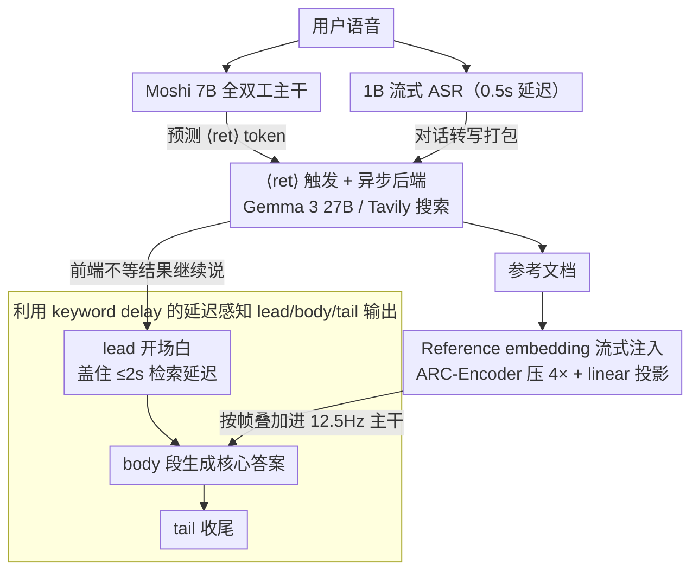

# MoshiRAG: Asynchronous Knowledge Retrieval for Full-Duplex Speech Language Models

**会议**: ICML 2026  
**arXiv**: [2604.12928](https://arxiv.org/abs/2604.12928)  
**代码**: https://github.com/kyutai-labs/moshi-rag (有)  
**领域**: 对话系统 / 全双工语音 / 检索增强  
**关键词**: full-duplex、speech LM、RAG、Moshi、异步检索、keyword delay

## 一句话总结
MoshiRAG 在 Moshi 这一全双工语音模型里加入一个特殊的 ⟨ret⟩ 触发 token，让模型边说边异步调用 LLM/搜索后端去取参考文档，利用"开口到关键词出现"的自然 keyword delay 把 2 秒以内的检索延迟完全藏起来，从而在 LlamaQ/WebQ/TriviaQA/HaluEval 上把语音模型的事实性拉到 GPT-4o Audio 量级，同时保留全双工实时性。

## 研究背景与动机
**领域现状**：现代语音对话从级联 ASR-Dialogue-TTS 走向端到端语音 LM，其中 full-duplex 模型（Moshi、dGSLM 后继者）能"边听边说"，最接近真人对话；turn-based 模型（GLM-4-Voice、Freeze-Omni 等）只能轮流听说。

**现有痛点**：（1）原生语音 LM 训练数据远少于文本 LM，事实性远低于同尺寸文本模型；（2）单纯放大模型可让事实性提升，但全双工要求实时推理，参数量不能随便堆；（3）已有 RAG 工作几乎都基于 turn-based 设置，因为传统 RAG 流程会插一段同步等待时间，与"边听边说"硬冲突。

**核心矛盾**：事实性需要外部知识 → 需要 RAG → RAG 引入延迟 → 破坏全双工。要么牺牲事实性，要么牺牲实时性。

**本文目标**：（1）让 Moshi 自主判断"何时需要外部知识"；（2）触发检索时不打断语音流；（3）后端可热插拔，无需重训。

**切入角度**：作者观察到一个被忽视的时间结构——"开口（TTFAT）到关键词出现（KD）"之间有可观的 keyword delay，对很多模型这一段超过 3 秒；只要检索能在这段空隙里完成（目标 ≤2 秒），就可以"在说漂亮的开场白时把答案查出来"。

**核心 idea**：用一个 ⟨ret⟩ 触发 token + 异步后端 + 在 lead 段后注入 reference embedding，把 RAG 的同步阻塞改造成全双工可用的"边说边查"。

## 方法详解

### 整体框架
MoshiRAG 要解决的是"全双工语音模型一边说话、一边把外部知识查回来却不卡顿"。它把传统 RAG 的同步阻塞拆成"前端实时、后端慢思考"两层：前端是基于 Moshi 7B 的全双工模型，吃用户语音 token 和自己上一步的文本/语音 token，并多出一个特殊的 ⟨ret⟩ 触发 token；旁边挂一个 1B 流式 ASR（0.5 秒延迟）把用户语音转写成文字、一个可热插拔的异步后端（Gemma 3 27B 阅读上下文给参考，或 Tavily 搜索引擎）。一旦 Moshi 吐出 ⟨ret⟩，系统就把对话转写丢给后端，前端不等结果、继续说一段不依赖知识的开场白维持语音流；等参考文档回来后，再经一层 reference encoder 投影成 embedding 按帧叠加进主干，让模型在正式答案段里自然地"接住"检索到的知识。

### 关键设计

**1. ⟨ret⟩ 触发 token + 异步后端：把同步 RAG 改成事件驱动的 tool call**

直接同步调用 RAG 会让"边听边说"中断，所以痛点是"谁来决定何时查、查的时候怎么不停"。MoshiRAG 在 Moshi 的 RQ-Transformer 输出词表里加入特殊 token ⟨ret⟩，训练数据里把每个 RAG-enabled 回合的"lead 段第一个文本 token 之前那一格"替换成 ⟨ret⟩，靠 TTS 的强制对齐来精确定位。推理时模型一旦预测出 ⟨ret⟩，系统就把 ASR 拿到的用户转写加上模型自己的转写打包发给后端（LLM-based 或 Tavily 均可），前端则完全不等结果继续运行——整个调用是异步的。这样"何时需要外部知识"的控制权交给了模型自身，而前端实时性与后端慢思考被彻底解耦，正是这个 token 让 RAG 从阻塞流程变成不打断语音的事件触发。

**2. 利用 keyword delay 的延迟感知数据合成：让开场白学会盖住检索延迟**

这套方案的物理基础是 keyword delay：从开口（TTFAT）到关键词出现往往有 3 秒以上空隙，只要数据里有大量"开场白长度足以盖住 2 秒检索"的样本，模型就能学会在说开场白时把答案查完。作者用三个 Gemma 3 27B 角色 LLM（用户/Moshi/参考，严格隔离信息访问权限以防泄漏）合成约 1.9M 条对话（474k QA 类 + 5.5k 专家域），把每个 RAG-enabled 回合结构化成 (lead, body, tail) 三段：lead 是"我帮你查一下…"这类泛用开场白，body 是接到 reference 后生成的核心答案，tail 是收尾。训练时模拟检索延迟，以 80% 概率取 $d'\sim\mathcal{U}(1.0,\,d_{\text{lead}}-1.0)$、20% fallback 取 $d'\sim\mathcal{U}(0,\,d_{\text{lead}})$，保证 body 开始前至少留 1 秒缓冲。没有这套显式 lead/body/tail 标注和 $d'$ 采样，模型在 inference 时就会强行接 reference 导致语音错位；有了它，这条"开场白要够长"的时间约束才被真正学进权重。

**3. Reference embedding 流式注入：用最轻的接口把变长文本焊进 12.5 Hz 主干**

直接 prepend reference 会占满上下文、还破坏 Moshi 的 12.5 Hz 流式特性，因此注入方式必须既不挤占语音 token、又能跟音频帧对齐。MoshiRAG 先用一个预训练的 ARC-Encoder 把 reference 压短 4 倍，再过一层可训练 linear 投影得到 $h_i^{\text{ref}}=\text{proj}(\text{emb}_i^{\text{ref}})$；从 ⟨ret⟩ 之后 $d/f_r$ 步开始，按帧把它加到 temporal Transformer 输入上，即 $h_i'=h_i+h_{i-(i_{\text{ret}}+d/f_r)}^{\text{ref}}$，持续 $l$ 步后结束。训练时还以 0.2 概率整条 dropout reference，让模型在"没拿到 reference"时也鲁棒。相加注入加上长度压缩，是把文本知识嵌进语音生成里最省的接口。

### 损失函数 / 训练策略
基础 loss 沿用 Moshi 原始的文本/语音 token next-token prediction；reference text encoder 冻结，linear 投影和 dropout vector 可学；学习率 $2\times 10^{-6}$、batch=32、100k 更新；输入做窗长 80ms、$-65$ dBFS 阈值的简单 VAD 静音清理。

## 实验关键数据

### 主实验

| 模型 | LlamaQ | WebQ | TriviaQA | HaluEval | TTFAT(s) | KD(s) | E2EKD(s) |
|------|--------|------|----------|----------|-------|----|-------|
| GPT-4o Audio | 88.4 | 81.0 | 90.6 | 68.7 | — | 5.5 | — |
| GLM-4-Voice 9B | 64.7 | 32.2 | 39.1 | 21.2 | 0.3 | 4.2 | 4.4 |
| Freeze-Omni 7B | 72.0 | 44.7 | 53.9 | 14.0 | — | — | — |
| **MoshiRAG (resp.)** | 接近 GPT-4o Audio | 显著领先公开 speech LM | 同上 | 同上 | 较小 | 后端 ≤ 2s | 控制在可对话区间 |

论文 Table 1 用颜色深浅显示 MoshiRAG 在四个 QA 基准上的 ref（检索质量）与 resp（最终回答）都明显高于其他公开 speech LM，与非 full-duplex 的强基线接近；同时 FLOPs/sec 远低于参数量更大的 GLM-4-Voice。

### 消融实验

| 配置 | 关键观察 | 说明 |
|------|---------|------|
| Search 后端（Tavily） vs LLM 后端（Gemma 3 27B） | 后端无需重训即可热插拔；准确率上 LLM 后端通常更高，但 search 后端可拿实时网页信息 | 验证"模块化、可替换"目标 |
| 不同 reference encoder（含 ARC-Encoder/Qwen 等） | ARC-Encoder 在压长 4× 时质量与延迟折中最好（Appendix B.1） | 长度压缩是吃满 12.5 Hz 主干的关键 |
| 不使用 lead/body/tail 结构 | 检索结果到达时段错位、回答出现停顿/接续不自然 | 证明结构化数据是延迟掩藏的核心 |
| 数学推理（域外） | 通过"语音 → LLM tool call"的形式解决简单数学题 | 显示这套框架可推广到 tool use，不只是 QA |

### 关键发现
- E2EKD 这一被忽略的时间窗（普遍 >3 秒）是把同步 RAG 改造成异步 RAG 的物理依据，只要后端控制在 ~2 秒，整个流程对用户透明。
- 把"语音 LM 的事实性"问题不靠扩参数而靠外接知识源解决，这套思路让 7B Moshi 不动主干就追上甚至超过若干 9B/9B+ 的同类。
- 全双工 + tool use 的早期形态：模型实际把 LLM/搜索引擎当外脑用，提示了未来 voice agent 的体系结构。

## 亮点与洞察
- 把"keyword delay"从一个被吐槽的延迟指标重新定义成"可利用的时间预算"，这种视角转换是整个工作的灵魂——属于"看到大家都看见但没人用过的间隙"。
- ⟨ret⟩ 这种"模型自己发起 tool call"的设计，把 LLM 世界已经成熟的 function calling 范式优雅迁移到了语音模型领域。
- reference embedding 直接按帧加到 temporal Transformer 输入上，而不是像文本 LLM 那样"prompt 拼接"，这是充分尊重 12.5 Hz 流式约束的硬件感知设计。
- 数据合成里用三角色 LLM（user/Moshi/reference）严格隔离信息访问权限以避免泄漏，是合成对话数据的好范式。

## 局限与展望
- 训练完全依赖合成对话+多通道 TTS 合成语音，与真实人类对话在 disfluency、口音、噪声分布上仍有差距。
- ⟨ret⟩ 触发是"硬决策"，没有明确的 confidence/cost 机制；当后端不可用或返回失败时只能依赖 dropout 训练的鲁棒性兜底。
- 评测仍集中在单轮 QA，对真实多轮、对话中策略性引用知识的能力（如澄清问题再查、纠错重查）评估有限。
- 模型语言只覆盖英文 Moshi，离多语言 voice assistant 的目标还远。

## 相关工作与启发
- **vs StreamRAG / KAME**: StreamRAG 仅限非 full-duplex 设置；KAME 支持 full-duplex 但用固定间隔 LLM 调用，浪费算力；MoshiRAG 是"按需触发"的事件驱动 RAG，效率与体验都更好。
- **vs Moshi**: 直接继承 Moshi 的 RQ-Transformer + dual-channel，只加一个 token 和一层 reference 投影就拿到事实性大幅提升，是对原 Moshi 最经济的扩展。
- **vs Chain-of-Thought for audio**: CoT 路线提升的是推理；MoshiRAG 提升的是知识外接；两者完全正交、未来可叠加。

## 评分
- 新颖性: ⭐⭐⭐⭐ 第一个 full-duplex + RAG 系统，关键是"利用 keyword delay"的全新视角；技术零件大多复用现成模块。
- 实验充分度: ⭐⭐⭐⭐ 覆盖四个 QA 基准、两类后端、多种 reference encoder，并展示了 tool-use 推理；缺真实人类多轮对话基准。
- 写作质量: ⭐⭐⭐⭐⭐ 把延迟相关的术语（TTFAT/KD/E2EKD/Retrieval delay）讲得非常清楚，时序图也直观；属于把工程动机讲透的范本。
- 价值: ⭐⭐⭐⭐⭐ 直接打开 voice agent 的 tool-use 大门，工业上可直接复用 Moshi + Tavily 这套搭法，价值巨大。

<!-- RELATED:START -->

## 相关论文

- [\[ICML 2026\] The Silent Thought: Modeling Internal Cognition in Full-Duplex Spoken Dialogue Models via Latent Reasoning](the_silent_thought_modeling_internal_cognition_in_full-duplex_spoken_dialogue_mo.md)
- [\[ACL 2026\] MTR-DuplexBench: Towards a Comprehensive Evaluation of Multi-Round Conversations for Full-Duplex Speech Language Models](../../ACL2026/audio_speech/mtr-duplexbench_towards_a_comprehensive_evaluation_of_multi-round_conversations_.md)
- [\[ACL 2026\] Full-Duplex-Bench-v2: A Multi-Turn Evaluation Framework for Duplex Dialogue Systems with an Automated Examiner](../../ACL2026/audio_speech/full-duplex-bench-v2_a_multi-turn_evaluation_framework_for_duplex_dialogue_syste.md)
- [\[ACL 2026\] How Tokenization Limits Phonological Knowledge Representation in Language Models and How to Improve Them](../../ACL2026/audio_speech/how_tokenization_limits_phonological_knowledge_representation_in_language_models.md)
- [\[ICML 2026\] Towards Understanding Modality Interaction in Multimodal Language Models via Partial Information Decomposition](towards_understanding_modality_interaction_in_multimodal_language_models_via_par.md)

<!-- RELATED:END -->
