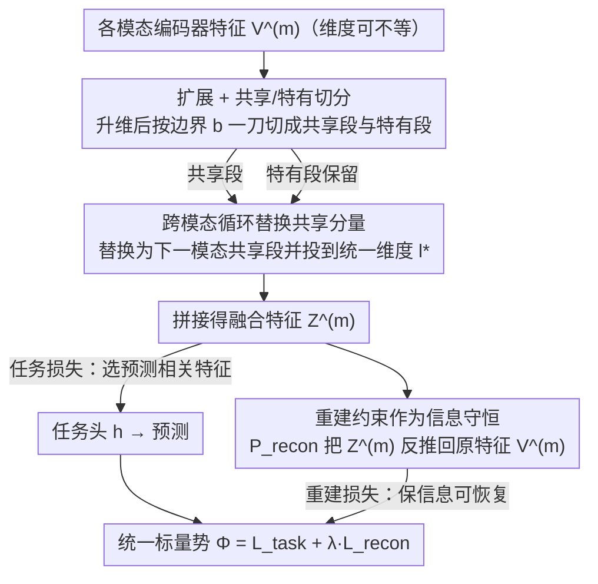

# Multimodal Fusion via Self-Consistent Task-Gradient Fields

**会议**: ICML 2026  
**arXiv**: [2410.15475](https://arxiv.org/abs/2410.15475)  
**代码**: 待确认  
**领域**: 多模态VLM / 多模态融合 / 优化  
**关键词**: 自洽场, 任务梯度, 多模态融合, 自编码器, 缺失模态

## 一句话总结
SCFAE 把多模态融合块改写成一个"任务损失 + 重建损失"组成的自洽场（Self-Consistent Field），通过把每个模态特征拆成"共享/特有"子空间并在模态间循环替换共享分量，让任务梯度干净地反传给各个编码器，从而在不等长输入、模态冲突、模态缺失三种场景下都比强耦合或重正则化的融合方法更稳健。

## 研究背景与动机

**领域现状**：当前多模态融合主流分两派——耦合型（Coupled，如 Cross-Attention、Coupled Mamba、AdaMMS）激进地把各模态特征混在一起做联合表示；解耦型（Decoupled，如 MISA、DrFuse、DLF）通过互信息最小化、对比损失、正交约束等辅助目标把特征拆分到独立子空间。

**现有痛点**：作者把视角从"表示质量"转移到了"梯度通路"。耦合融合让多个编码器在前向上变成函数依赖，缺失任一模态都会让共享梯度通路塌掉，剩下的编码器随之失效；解耦融合则用辅助 loss 拽编码器参数，这些次级目标常常和主任务梯度方向不一致，相当于在编码器肩膀上同时挂两个互相打架的拉力。再加上几乎所有耦合设计都要求模态在融合前对齐到相同维度，长序列模态（视频 4096 维 vs 图像 128 维）必须先压缩才能进融合块，又把可用信息直接砍掉。

**核心矛盾**：融合块同时承担"信息耦合器"和"梯度分发器"两个角色，而既有方法在追求表示质量时破坏了反馈回路 —— 编码器收到的梯度要么被纠缠成一团（耦合），要么被辅助损失拽偏（解耦），结果是"融合再花哨也救不回来一开始就没被提取出来的信息"（信息守恒原理，Jiang et al. 2023）。

**本文目标**：设计一个融合模块，必须同时满足两条 —— (i) 保留清晰的优化通路，让任务梯度直接反馈给每个特征提取器；(ii) 把模态特有信息隔离到独立子空间，最小化模态间互信息，从而对缺失输入保持鲁棒。

**切入角度**：作者借用计算化学/电化学里的 Self-Consistent Field（自洽场，特别是 Poisson–Nernst–Planck 方程）做类比 —— SCF 描述了一个"场依赖于系统状态、状态又被场反塑"的反馈回路，多个力（漂移 drift、扩散 diffusion）通过共享同一个标量势函数 $\Phi$ 而保持相干，不会互相打架。把多模态特征类比为"粒子分布"，任务损失就是把特征推向预测相关区域的 drift force，重建损失则是维持特征可分离性的 diffusion force，两者共享一个统一目标函数。

**核心 idea**：用"任务损失 + 重建损失"两个分量构成单一标量势 $\Phi = L_{\mathrm{task}} + \lambda L_{\mathrm{recon}}$，配合"扩展→拆分共享/特有→跨模态循环替换共享分量→重建回原特征"的自编码器结构，让特征组织通过同一个目标的梯度自然涌现，而不是用辅助 loss 强行规定。

## 方法详解

### 整体框架
SCFAE 想解决的是"融合块在追求表示质量时会破坏任务梯度反馈回路"这件事，做法是把融合改写成一个由"任务损失 + 重建损失"组成的单标量势 $\Phi = L_{\mathrm{task}} + \lambda L_{\mathrm{recon}}$，让特征的共享/特有组织通过同一个目标的梯度自然涌现，而不靠辅助 loss 强行规定。它是一个即插即用的融合块 $g(\cdot)$，前置编码器 $f^{(m)}$ 和后置任务头 $h$ 都不动；给 $M$ 个维度可不相等的模态特征 $\{V_i^{(m)} \in \mathbb{R}^{l^{(m)}}\}$，每模态额外学四个 SwiGLU + Linear 的映射网络（扩展、共享、特有、重建）。一条特征先被扩展再切成共享段和特有段，共享段在模态间循环互换后拼回融合特征喂给任务头，同时重建映射要把融合特征反推回原始编码器输出——任务损失通过交换链路把跨模态一致信号挤进共享段，重建损失则保证没有任何模态信息被偷偷丢弃。

### 关键设计

**1. 扩展 + 共享/特有切分：给解耦腾出几何冗余空间**

先用 $\mathbf{P}_{\mathrm{expand}}^{(m)}$ 把每模态特征 $V_i^{(m)}$ 投到 $n l^{(m)}$ 的更高维空间，再按预先指定的边界 $b^{(m)}$ 一刀切成共享段 $\hat Z_{i,\mathrm{shared}}^{(m)} \in \mathbb{R}^{b^{(m)}}$ 和特有段 $\hat Z_{i,\mathrm{specific}}^{(m)} \in \mathbb{R}^{n l^{(m)} - b^{(m)}}$。痛点在于：如果不扩展直接拆，两段会在原表示空间里抢容量，解耦不干净。扩展提供的"几何冗余空间"让共享/特有可以彼此让位。更关键的是边界 $b^{(m)}$ 是结构化超参（默认均匀 $b = 0.5$）而非学习目标——把"分配多少容量给共享、多少给特有"从优化目标里抽出来变成结构先验，省掉了"用 loss 决定怎么切"的优化冲突，这正是整个 SCF 框架不需要辅助 loss 的前提。

**2. 跨模态循环替换共享分量：用"换了还能用"逼出真正一致的信号**

令 $k = (m+1) \bmod M$，把模态 $m$ 的共享段替换为下一模态 $k$ 的共享段，再投影到统一维度 $l^*$（取所有模态维度的最小值）；特有段则保留自己投回原维度 $l^{(m)}$，最终拼接得 $Z_i^{(m)} = [Z_{i,\mathrm{specific}}^{(m)}; Z_{i,\mathrm{shared}}^{(m)}]$。这一步是"自洽"的核心：每个模态被另一个模态的共享证据重组后还得过任务头不掉点，等于强制"只有当 A、B 的共享段都真的捕捉到跨模态一致信息时，互换才不伤害预测"。任务梯度沿这条交换链路反传时，会自然把真正一致的跨模态模式推到共享段、把模态特有噪声推到特有段，全程不需要任何互信息估计或对比损失。形式上它把 SCF 抽象 $\phi = \mathcal{F}[c],\ \partial c / \partial t = \mathcal{G}[\phi]$ 实例化进了融合块——共享分量既是被使用的"场"，又是被任务损失反塑的"状态"，形成闭环。

**3. 重建约束作为信息守恒：只管可恢复、不抢梯度方向**

每模态再学一个映射 $\mathbf{P}_{\mathrm{recon}}^{(m)}$ 把重组后的 $Z_i^{(m)}$ 投回原编码器输出 $V_i^{(m)}$，损失取余弦相似度 $\mathcal{L}_{\mathrm{recon}} = \sum_{m=1}^M \mathrm{Sim}(V_i^{(m)}, \mathbf{P}_{\mathrm{recon}}^{(m)} Z_i^{(m)})$。作者把它定位成"扩散力"，类比 PNP 方程里维持浓度梯度、防止粒子全塌缩到电极的扩散项——它不规定特征该怎么解耦，只规定"全部信息必须能被反推回来"，于是网络无法靠扔掉某个难模态来作弊达成分离，trivial solution 被从根上堵死。它和互信息下界、对比损失这类辅助监督的本质区别在于：重建只约束"信息可恢复性"这条物理性质，不在语义对齐方向上跟任务损失抢梯度，所以两个梯度在共享势函数 $\Phi$ 下天然相容、不会互相抵消。

### 损失函数 / 训练策略
完整目标为单标量势 $\Phi = L_{\mathrm{task}} + \lambda L_{\mathrm{recon}}$：$L_{\mathrm{task}}$ 主要塑造共享子空间（决定哪些跨模态信号有助预测），$L_{\mathrm{recon}}$ 主要组织特有子空间（保证模态独有信息不被丢弃）。两个超参分别是扩展系数 $n$（实验显示 $n \geq 2$ 就够）和共享边界比例 $b$（默认 $b^{(m)} = 0.5$ 均匀分配）。训练使用 PyTorch + Apex O1，单卡 RTX 4090。

## 实验关键数据

### 主实验：三类典型挑战场景

| 数据集 | 任务 / 挑战 | 指标 | 之前 SOTA (AdaMMS) | SCFAE | 提升 |
|--------|------------|------|--------------------|-------|------|
| ActivityNet 128-128 | 等长图–视频检索 | mAP@10 | 0.358 | **0.363** | +0.5 |
| ActivityNet 4096-128 | **不等长**图–视频检索 | mAP@10 | 0.360 | **0.367** | +0.7 |
| FakeAVCeleb (Audio only) | 音视频深伪检测 / **信号冲突** | ACC | 93.45 | **95.74** | +2.29 |
| FakeAVCeleb (Visual only) | 同上 | ACC | 93.10 | **95.35** | +2.25 |
| FakeAVCeleb (AV, AUC) | 同上 | AUC | 98.25 | **98.70** | +0.45 |
| CMU-MOSEI (所有 7 种缺失组合平均) | 情感分析 / **缺失模态** | ACC/F1 | 80.1/80.8 | **80.3/81.1** | +0.2/+0.3 |
| CMU-MOSEI 仅 {a} | 仅有音频时 | ACC/F1 | 67.2/69.0 | **69.3/71.0** | +2.1/+2.0 |

不等长场景增益比等长更大，验证"重建约束保住了被维度对齐丢掉的视频信息"；FakeAVCeleb 单模态分类大涨证明 SCFAE 没有破坏单模态可分性；MOSEI 仅音频/视觉场景下 SCFAE 优势最大，说明它没有让弱模态被强势的 text 模态"梯度劫持"。

### 关键消融：编码器是否被融合训练损伤（Tab. 6，FakeAVCeleb）

衡量"联合训练后单独 probe 每个编码器掉了多少点"（$\Delta$ 越接近 0 越好）：

| Fusion 策略 (VideoMAE V2-S + WavLM-B) | Audio Δ ACC | Visual Δ ACC | Audio Δ AUC | Visual Δ AUC |
|---|---|---|---|---|
| Cross-Attention (4 层) | -0.42 | -7.54 | -0.28 | -10.08 |
| Mutual Info. Min. | -0.85 | -3.10 | -0.61 | -3.92 |
| Contrastive Constraints | -1.12 | -2.63 | -0.74 | -2.80 |
| **SCFAE (Ours)** | **-0.08** | **-0.88** | **-0.04** | **-0.83** |

在 DINOv3+AudioMAE 和 R(2+1)D+ResNetSE 两套骨干上趋势完全一致 —— Cross-Attention 把 Visual encoder 砍掉将近 10 个点 ACC，而 SCFAE 只掉不到 1 个点。这张表是全文最有力的证据，直接证明了"梯度通路保护"假设。

### 关键发现
- **耦合 Cross-Attention 是编码器质量的头号杀手**：在所有三种骨干组合下都让 Visual encoder 单独 probe 时掉 6–12 个 AUC；而带辅助 loss 的解耦方法（MI Min / Contrastive）虽好一些但仍掉 3–6 个点，SCFAE 把损伤压到 <1 个点。
- **不等长输入反成 SCFAE 优势**：从等长 128-128 切到不等长 4096-128，几乎所有 baseline 都没明显增益甚至小幅下滑，只有 SCFAE 系列从 0.363→0.367 持续涨点，说明"不强制对齐 + 重建保信息"确实能利用上长序列的额外信号。
- **MOSEI 仅音频/视觉场景增益最大**：在 text 模态缺失时，SCFAE 比次优 baseline 高 2 个点 ACC/F1；而所有模态都在时只领先 0.2 个点 —— 这说明 SCFAE 的好处主要不在"强模态都在"的舒适区，而在"非主导模态需要独立扛事"的极端场景。
- **超参不敏感**：扩展因子 $n \geq 2$ 即饱和，边界 $b = 0.5$ 即可，没有针对每个数据集大费周章调参，从工程上比依赖温度系数/损失权重的对比损失方法更省心。

## 亮点与洞察
- **把"梯度通路"提升为一等公民**：以往多模态融合论文都在卷"表示更纯/对齐更好"，本文把视角拨回更上游 —— 融合块不仅是信息耦合器，更是梯度分发器。这个视角直接解释了"为什么很多复杂融合方法反而比简单 Concat 还要拉胯单模态可分性"。
- **用物理类比把约束写在结构上而非 loss 上**：SCF/PNP 给出的设计哲学是"不同优化力共享同一个势函数 $\Phi$"。这意味着重建项不是"额外的辅助监督"，而是和任务损失同源 —— 因此不会出现 gradient cancellation。这条思路可以迁移到任何"主任务 + 辅助正则"打架的场景（例如对比学习 + 分类、对抗训练 + 重建）。
- **循环替换共享分量是一个被严重低估的 trick**：相比于显式互信息估计或对比 loss，"把模态 A 的共享段替换为模态 B 的然后还要能完成任务"是一种结构性约束，强迫共享段真的捕捉跨模态一致信号，但完全不需要额外的负样本采样或温度调参。
- **可迁移性**：SCFAE 不动编码器，只是个十几行参数的融合块，能即插即用到任何"专用 encoder + 融合 + 任务头"的经典 pipeline，特别适合医学影像、异步传感器、解释性要求高的场景。

## 局限与展望
- 文章方法部分主要在三个相对中等规模的 benchmark 上验证，没有在大规模 foundation model（如 ImageBind、CLIP 规模训练）上做端到端实验，扩展到亿级样本时 SCF 的收敛动力学是否仍稳定还有待验证。
- 边界 $b^{(m)}$ 默认均匀 0.5，但模态信息含量天然不均（如 MOSEI 里 text >> audio），均匀分配可能不是最优；作者没系统讨论"按模态信息容量自适应分配 $b^{(m)}$"。
- 循环替换 $k = (m+1) \bmod M$ 是一种最简单的环形排列，模态数 $M$ 大时（如 5+ 模态）这种链式自洽是否还能保持收敛、是否需要全连接式替换是开放问题。
- 重建用余弦相似度，对幅度信息不敏感；在某些幅度本身就是信号的任务（如功率谱、距离回归）上可能需要替换为 L2 或对比型重建。

## 相关工作与启发
- **vs Cross-Attention / Coupled Mamba**: 它们通过显式跨模态注意力强行让特征互相依赖，本文反过来 —— 共享段被替换是为了"只有真正一致的跨模态信号才能存活"，而不是让模态间互相纠缠。优势是单模态可分性几乎不损失（Tab. 6 直接证据）。
- **vs MISA / DrFuse / DLF（带辅助 loss 的解耦）**: 它们用互信息最小化或正交约束做解耦，本文用"重建作为信息守恒"，关键区别是后者只约束物理可恢复性、不规定语义方向，因此和任务损失天然相容。优势是没有 gradient conflict，劣势是"什么样的共享是有用的"完全交给任务头自己学，可能不如显式 InfoMin 解释性强。
- **vs Perceiver / ImageBind 等端到端基础模型**: 那类方法直接喂原始输入到统一 Transformer，把 extraction 和 fusion 混在一起，无法满足 Eq.(1) 的两阶段优化结构。SCFAE 选择的是"老派 extract → fuse → predict"路线，定位互补 —— 适合已有强专用 encoder（医学影像 CNN）、模态异步、需要可解释模态贡献的场景。
- **vs MMIN / IMDer 等缺失模态补全方法**: 那类方法显式建模缺失模态的生成/补全，SCFAE 不补全，而是通过重建力把非主导模态"始终保持组织化"，使其在测试时被单独使用也仍能扛事。两条路线可以叠加：SCFAE 提供鲁棒底盘 + 上层用 MMIN 类补全做精细化。

## 评分
- 新颖性: ⭐⭐⭐⭐ 用 SCF / PNP 物理类比重新表述多模态融合是一个新视角，跨模态循环替换共享分量也是少见的结构化解耦设计，但每个单独组件（共享/特有切分、重建约束、自编码融合）都能在文献中找到原型。
- 实验充分度: ⭐⭐⭐⭐ 覆盖三种典型挑战场景（不等长、冲突、缺失），主表 baseline 数量充足，Tab. 6 的编码器损伤实验是非常硬核且少见的诊断性证据。但没在大规模 foundation 模型规模上验证。
- 写作质量: ⭐⭐⭐⭐ 动机叙事清晰（"融合块是梯度分发器"这条主线贯穿全文），SCF / PNP 类比让人耳目一新；公式和图能配合阅读，缺点是部分 OCR 后的数学符号在文中混乱，可读性受影响。
- 价值: ⭐⭐⭐⭐ 把"梯度通路保护"这条容易被忽视的设计原则讲透了，且方法本身参数极少、即插即用、超参不敏感，工程友好度高，适合作为后续多模态融合工作的对照基线。

<!-- RELATED:START -->

## 相关论文

- [\[ICLR 2026\] Scalable Multilingual Multimodal Machine Translation with Speech-Text Fusion](../../ICLR2026/audio_speech/scalable_multilingual_multimodal_machine_translation_with_speech-text_fusion.md)
- [\[ICML 2026\] A Semantically Consistent Dataset for Data-Efficient Query-Based Universal Sound Separation](a_semantically_consistent_dataset_for_data-efficient_query-based_universal_sound.md)
- [\[ICML 2026\] Sparse Tokens Suffice: Jailbreaking Audio Language Models via Token-Aware Gradient Optimization](sparse_tokens_suffice_jailbreaking_audio_language_models_via_token-aware_gradien.md)
- [\[AAAI 2026\] PSA-MF: Personality-Sentiment Aligned Multi-Level Fusion for Multimodal Sentiment Analysis](../../AAAI2026/audio_speech/psa-mf_personality-sentiment_aligned_multi-level_fusion_for_multimodal_sentiment.md)
- [\[NeurIPS 2025\] Resounding Acoustic Fields with Reciprocity](../../NeurIPS2025/audio_speech/resounding_acoustic_fields_with_reciprocity.md)

<!-- RELATED:END -->
