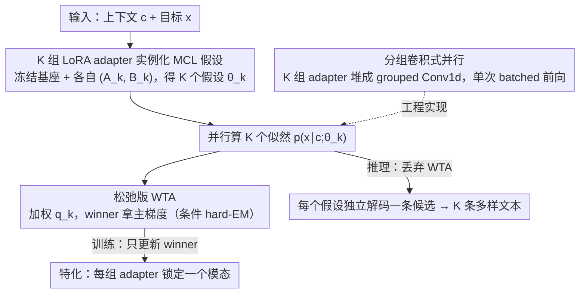

# Multiple Choice Learning of Low-Rank Adapters for Language Modeling

**会议**: ICML 2026  
**arXiv**: [2507.10419](https://arxiv.org/abs/2507.10419)  
**代码**: https://github.com/Victorletzelter/LoRA-MCL (有)  
**领域**: LLM效率 / PEFT / 多样性解码  
**关键词**: LoRA、Multiple Choice Learning、Winner-Takes-All、多样性生成、混合分布

## 一句话总结
本文提出 LoRA-MCL，把 Multiple Choice Learning 的"赢者通吃"训练范式搬进 LoRA 微调：把 $K$ 组低秩 adapter 当作 $K$ 个相互竞争的假设，让每条训练样本只更新最合适的那组 adapter，从而让单一基座模型在一次前向里就能产生多条覆盖条件分布不同模态的多样合理文本，在音频/图像描述与机器翻译上同时刷新质量–多样性帕累托前沿。

## 研究背景与动机

**领域现状**：在音频/图像描述、机器翻译等"一对多"任务里，给定上下文 $c$ 的目标分布 $p(x\mid c)$ 通常是多模态的（同一张图可有英/法两种描述、同一段音频可有不同事件命名）。当前大模型几乎都用极大似然（MLE / teacher forcing）做 next-token 训练，配合 Beam Search、Diverse Beam Search（DBS）、nucleus sampling 等解码策略，在推理时"人为"撑出多样性。

**现有痛点**：MLE 对混合分布 $p(x)=\sum_k p(z_k)p(x\mid z_k)$ 的极小化会塌缩到加权平均，而不是恢复各模态；推理侧的 DBS 需要手调多样性惩罚 $\lambda$，且常常在多样性和质量之间二选一；TTA、温度采样等技巧要么不稳定要么会破坏可读性。

**核心矛盾**：训练目标本身没有"模态"概念，所有多样性补丁都在推理时事后弥补，治标不治本。要让模型"天然"输出多种合理候选，多样性必须写进训练目标里。

**本文目标**：（1）把多假设训练范式 Multiple Choice Learning（MCL）搬到 next-token 语言建模上；（2）解决 MCL 在大模型上的两大死结——多头参数量爆炸、训练塌缩到单一假设；（3）从理论上证明这种训练能恢复混合分布的模态而不是塌成平均；（4）在真实大模型上验证质量–多样性权衡。

**切入角度**：作者注意到 MCL 经典做法是"共享骨干 + 多输出头"，但 LLM 的 lm_head（如 Qwen2-Audio 约 6.4 亿参数）拷贝 $K$ 份完全不现实；而 LoRA 恰好提供了"廉价复制一份模型"的能力——只需在每层多加一组秩 $r$ 的 $A_k, B_k$ adapter，所有假设共享冻结基座。

**核心 idea**：用 $K$ 组 LoRA adapter 替代 $K$ 个输出头，配上松弛版 Winner-Takes-All 损失，让每组 adapter 自动特化到目标分布的一个模态。

## 方法详解

### 整体框架
LoRA-MCL 要解决的核心问题是：怎样让单个 LLM 在训练阶段就把目标分布的多个模态拆开，而不是塌缩成加权平均。它的做法是把 Multiple Choice Learning 的"多假设竞争"思想嫁接到 LoRA——在每个启用 LoRA 的层 $\ell$ 准备 $K$ 组适配器 $\{(A_\ell^k, B_\ell^k)\}_{k=1}^K$，冻结基座参数 $\theta$，于是第 $k$ 个"假设模型"就是 $\theta_k = \theta \cup \{(A_\ell^k, B_\ell^k)\}_\ell$。训练时对所有 $K$ 个假设并行算似然 $p(x\mid c;\theta_k)$，再用 Winner-Takes-All（WTA）损失只把梯度回传给最合适的那个假设，整个过程等价于一个条件 hard-EM：E 步选 winner $k^\star=\arg\max_k p(x\mid c;\theta_k)$，M 步只更新 $\theta_{k^\star}$。推理时丢掉 WTA，让每个假设独立解一条候选，一次前向就吐出 $K$ 条覆盖不同模态的文本。

### 关键设计

**1. 用 K 组 LoRA adapter 实例化 MCL 假设：绕开 lm_head 复制不下的死结**

MCL 经典实现是"共享 backbone + 复制 $K$ 个输出头"，但 LLM 的 lm_head 动辄上亿参数（Qwen2-Audio 约 6.4 亿），拷 $K$ 份根本不现实，从头训新 head 又会破坏预训练知识。本文的关键观察是：LoRA 的低秩残差通道天然就是个"廉价的模型分身"——只要在每层多挂一组秩 $r$ 矩阵 $(A_\ell^k, B_\ell^k)$，基座语义完全不丢，adapter 只负责提供模态特化的方向。这样 $K$ 个假设的额外参数量只有约 $K \times L \times 2dr$，相对基座 $|\theta|$ 可忽略。训练目标直接把 MCL 的 WTA 损失套到 next-token 建模上：$\mathcal{L}^{\mathrm{WTA}} = -\mathbb{E}_{c,x}[\max_{k}\log p(x\mid c;\theta_k)]$，其中 $\log p(x\mid c;\theta_k)=\sum_t \log p(x_t\mid x_{<t},c;\theta_k)$。它为什么有效有理论保证（Prop. 1）：当数据来自有限混合且模型表达力足够时，LoRA-MCL 等价于条件 hard-EM，最优损失收敛到给定潜在主题 $z$ 后的条件熵 $\mathcal{H}(x\mid c,z)$，严格不大于 MLE 最优；同时给出下界 $\min \mathcal{L}(\theta) - \log K \le \min \mathcal{L}^{\mathrm{WTA}}(\theta)$，精确刻画了多假设能带来多少信息增益。

**2. 松弛版 WTA：用 Relaxed-WTA 与 Annealed-MCL 解决训练塌缩**

硬 WTA 有个致命工程坑——训练初期某个假设碰巧偏好一点，winner 就越赢越多，其余假设永远拿不到梯度，最终所有假设退化成一个。本文的解法是软化 WTA，给所有假设都留一丝梯度：把 $\max$ 换成归一化加权和 $\mathcal{L}^{\mathrm{WTA}} = -\mathbb{E}_{c,x}[\sum_k q_k \log p(x\mid c;\theta_k)]$。作者给出两种 $\{q_k\}$ 的实例化。Relaxed-WTA 让 winner 拿 $q_{k^\star}=1-\varepsilon$、其余每个均分 $\varepsilon/(K-1)$（$\varepsilon$ 是固定小量，实验常取 0.05–0.1），简单稳定，但 $\varepsilon$ 过大会让假设趋同、丢多样性。Annealed-MCL 则用温度软分配 $q_k(x,c;\uptau)=p(x\mid c;\theta_k)^{1/\uptau}/Z$，温度按 $\uptau(t)=\uptau(0)\rho^t$（$\rho<1$）从大到小退火：高温阶段所有假设几乎均匀更新、避免早期塌缩，低温阶段平滑收敛到硬 WTA、拿到更纯的特化，代价是多一个温度调度超参。两种方案各有适用区间，作者按数据集与 $K$ 选最优。

**3. 分组卷积式并行：把 K 次前向压成单次 batched 前向**

朴素实现要顺序跑 $K$ 个假设、$K$ 次前向，训练时间直接线性放大 $K$ 倍——这正是 MCL 长期被诟病、推不到大模型规模的原因。本文借助 PyTorch 的分组卷积把多假设 LoRA 折叠进一次 batched 操作：把输入沿 batch 维复制 $K$ 份，再把 $K$ 组 $(A_\ell^k, B_\ell^k)$ 堆成一个张量，等价于在 LoRA 路径上跑 `nn.Conv1d` 的 grouped variant（groups=$K$），让每组输入只跟自己那组权重做矩阵乘，而冻结基座的前向天然共享。由于 $r \ll d$，参数侧增量微乎其微，额外开销基本只是激活随 $K$ 倍增。这一步是让 LoRA-MCL 训练成本对齐普通 LoRA、而不是 $K\times$ LoRA 的关键工程基础——没有它，7B–8B 规模上的实验根本跑不起来。

### 损失函数 / 训练策略
最终训练目标为松弛 WTA：$\mathcal{L}^{\mathrm{WTA}}(\theta_1,\dots,\theta_K)=-\mathbb{E}_{c,x}\big[\sum_{k=1}^{K} q_k \log p(x\mid c;\theta_k)\big]$。LoRA 配置上，作者在所有 Transformer 层的 $Q,K,V$ 与 FFN 升降维矩阵都注入 adapter，秩 $r=8$、scaling $\alpha=8$（视觉版 $\alpha=32$），LoRA 数 $K\in\{3,5,7\}$；Qwen2-Audio 上 1 epoch（AudioCaps）或 10 epoch（Clotho），LLaVA-1.6 上 1 epoch。推理时不需要 WTA，每个假设独立解一条候选；MAP 解码（greedy/Beam Search/DBS）时为保证算力公平，LoRA-MLE 用 beam size $B$ 时 LoRA-MCL 每个假设只用 $B/K$。

## 实验关键数据

### 主实验

| 数据集 | 指标 | LoRA-MLE 最佳 | LoRA-MoE 最佳 | LoRA-MCL ($K=3$, BS=1) | 提升 |
|--------|------|---------------|----------------|------------------------|------|
| TextCaps (图像描述) | SPIDEr ↑ | 0.915 (DBS λ=1.0) | 0.926 (DBS λ=1.0) | **0.955** | +0.029 |
| TextCaps | mBLEU-4 ↓ | 0.416 | 0.421 | 0.520 | 比 DBS 高（差） |
| AudioCaps (音频描述) | 测试 loss ↓ | 2.181 ($r=8{\times}5$) | – | **1.999** ($K=5$) | −0.18 |
| Clotho | 测试 loss ↓ | 2.812 ($r=8$) | – | **2.612** ($K=7$) | −0.20 |
| 合成双语图像描述 (法语) | SPIDEr ↑ | 0.411 | – | **0.464** | +0.053 |
| 合成双语图像描述 (法语) | mBLEU-4 ↓ | 0.138 | – | **0.027** | −0.111 |

注：图像描述场景下 LoRA-MCL 比 DBS 的多样性略弱（mBLEU-4 高一点），但 SPIDEr/CIDEr 优势更大；作者也指出可以将 DBS 与 LoRA-MCL 叠加以同时拿到两种好处。

### 消融与 K 扫描

| $K$（LoRA-MCL，$\varepsilon=0.05$） | AudioCaps 测试 loss ↓ | Clotho 测试 loss ↓ |
|---|---|---|
| LoRA-MLE 单假设 ($r=8$) | 2.203 | 2.812 |
| LoRA-MLE ($r=8\times3$，参数等量) | 2.195 | 2.868 |
| LoRA-MLE ($r=8\times7$，参数等量) | 2.182 | 2.935 |
| LoRA-MCL，$K=3$ | 2.063 | 2.663 |
| LoRA-MCL，$K=5$ | 1.999 | 2.643 |
| LoRA-MCL，$K=7$ | **1.932** | **2.612** |

### 关键发现
- **MCL 收益不来自参数量**：把 LoRA-MLE 的秩等比放大到 $r=8K$，AudioCaps 测试 loss 几乎不动（2.18→2.18），而 LoRA-MCL 在相同总参数下稳降 0.2 以上，说明增益完全来自"多假设特化"而非"模型变大"。
- **$K$ 越大 loss 单调下降**：Prop. 1 给出下界 $\min\mathcal{L}-\log K$，理论上随 $K$ 增大空间变大；实验里 loss 单调下降到 $K=7$ 仍未饱和，与理论一致。
- **双语合成实验观察到强特化**：让一半样本翻成法语后训 $K=2$ 的 LoRA-MCL，winner 在法语样本上 ~89% 落在 head 1、英语样本上 ~97% 落在 head 2；MLE 则塌缩到偏英语的"平均策略"，法语下甚至进入重复循环。这把 Prop. 1 关于"恢复混合模态"的理论直接可视化了。
- **toy Markov chain 实验**：两路 Markov chain 混合下，MLE 收敛到加权平均转移矩阵 $\bar P$，LoRA-MCL 两个假设分别恢复出两条原始转移矩阵，验证证明里 (9) 式的塌缩公式。

## 亮点与洞察
- **把 LoRA 当作"廉价 MCL head"是一个极其漂亮的范式迁移**：MCL 苦于多头爆炸十年，LoRA 提供的低秩残差通道天然能做"轻量化模型分身"，作者只是把两者拼起来，但拼得非常对路——既绕开了 lm_head 复制不下的工程死结，也保住了预训练知识。
- **理论与实验的耦合很扎实**：Prop. 1 不只是"看起来对"，它给出条件熵下界、与 hard-EM 等价性，并通过 toy Markov chain 把"MLE 塌缩到加权平均"和"MCL 恢复模态"做成定量公式 (9) + 可视化，又用双语合成图像描述把同样的现象搬到 LLM 里，是论文级"理论-toy-真实"的标准范例。
- **分组卷积并行是真正落地用的关键工程**：MCL 长期被诟病训练慢 $K$ 倍，作者用 PyTorch 现成的 grouped Conv1d 把多假设 LoRA 折叠成单次 batched 前向，几乎让 LoRA-MCL 训练成本对齐普通 LoRA，是 7B–8B 模型上能跑通的硬门槛。
- **可迁移性强**：这套"K 个 LoRA + 松弛 WTA"的训练范式可以无痛挪到任何 PEFT 友好的 base model 上——多语种翻译里学习语言特化、对齐里学习不同 reward 偏好、code 生成里学习不同实现风格，都是显而易见的延伸方向。

## 局限与展望
- 作者承认：Relaxed-WTA 的 $\varepsilon$、Annealed-MCL 的温度调度都是固定超参，过大会让假设趋同丢多样性，未来可考虑按数据分布自适应调整。
- 实验上 LoRA-MCL 的多样性（mBLEU-4）在图像描述里仍略输给 DBS+LoRA-MLE，说明纯靠训练侧拿多样性还没"吃干净"，作者也提到可以与 DBS 叠加。
- 假设数 $K$ 是先验给定的：实际任务的"真实模态数"未知，$K$ 设少了无法覆盖、$K$ 设多了空 head 浪费，缺一个数据驱动的 $K$ 选择机制。
- 实验全部停留在 fine-tuning 阶段，作者把"扩展到预训练"列为未来工作；如果能在大规模预训练里以低代价注入"多假设"先验，可能改变现有 LLM 的单一塌缩失败模式。
- 与近期 LoRA 变体（如 LoRA+、DoRA、AdaLoRA）的组合性未做系统实验，结合后能否再降参数/再升多样性是开放问题。

## 相关工作与启发
- **vs 经典 MCL（Lee 2016 / Rupprecht 2017）**：经典 MCL 用共享 backbone + 多 head + 硬 WTA；本文用共享 base + 多 LoRA + 松弛 WTA，把范式落到 LLM 这一最难复用 head 的场景里，并补齐了塌缩 + 训练时间两个老问题的工程解。
- **vs LoRA-MoE（Wu 2024 / Li 2024）**：MoE 也是"多 LoRA"，但训练目标仍是 MLE，靠路由 gating 在样本间做 expert 选择，关注计算稀疏性，专家间常有冗余、多样性弱；LoRA-MCL 训练目标本身就是赢者通吃，明确鼓励 expert 特化到目标分布的一个模态。论文实验里 LoRA-MoE 输给 LoRA-MCL（SPIDEr 0.926 vs 0.955）支持了这一区分。
- **vs Diverse Beam Search / TTA**：DBS 和 TTA 都是"推理时硬加多样性"，多样性来源是惩罚项 $\lambda$ 或输入扰动，与训练目标解耦；LoRA-MCL 把多样性来源前移到训练数据本身的多模态先验里，推理时只是把已学到的模态读出来，因此质量–多样性帕累托前沿更优。
- **对 PEFT 社区的启发**：LoRA 一直被当作"参数高效复制"，本文揭示了它的另一种用法——"参数高效的多假设承载"，这条思路天然能扩到多任务、多风格、多 reward 等所有"一份模型 + 多种行为"的需求。

## 评分
- 新颖性: ⭐⭐⭐⭐ 把 MCL 嫁接到 LoRA 是"显然但没人做过"，组合本身简单但角度对路，理论上还给出严格等价性与紧界。
- 实验充分度: ⭐⭐⭐⭐ 覆盖 toy Markov chain + 音频/图像描述 + 机器翻译 + 双语合成数据，扫了 $K\in\{1,3,5,7\}$ 与两种松弛策略，量化 + 定性都齐全；但缺与 LoRA+/DoRA/AdaLoRA 等近期 LoRA 变体的组合实验。
- 写作质量: ⭐⭐⭐⭐ 动机推导清晰，Prop. 1 与 toy 实验呼应得很好，工程细节（grouped Conv1d）写得能复现。
- 价值: ⭐⭐⭐⭐ 直接给 LLM 微调阶段提供了"训练就多样"的范式，比推理侧解码 trick 更根本；对所有需要多候选输出（描述、翻译、对齐、code）的任务都有直接落地空间。

<!-- RELATED:START -->

## 相关论文

- [\[ACL 2026\] Multimodal In-Context Learning for ASR of Low-Resource Languages](../../ACL2026/audio_speech/multimodal_in-context_learning_for_asr_of_low-resource_languages.md)
- [\[ICML 2026\] Algorithmic Recourse of In-Context Learning for Tabular Data](algorithmic_recourse_of_in-context_learning_for_tabular_data.md)
- [\[ICLR 2026\] TASTE: Text-Aligned Speech Tokenization and Embedding for Spoken Language Modeling](../../ICLR2026/audio_speech/taste_text-aligned_speech_tokenization_and_embedding_for_spoken_language_modelin.md)
- [\[ICML 2025\] FLAM: Frame-Wise Language-Audio Modeling](../../ICML2025/audio_speech/flam_frame-wise_language-audio_modeling.md)
- [\[NeurIPS 2025\] A Multi-Task Benchmark for Abusive Language Detection in Low-Resource Settings](../../NeurIPS2025/audio_speech/a_multitask_benchmark_for_abusive_language_detection_in_lowr.md)

<!-- RELATED:END -->
