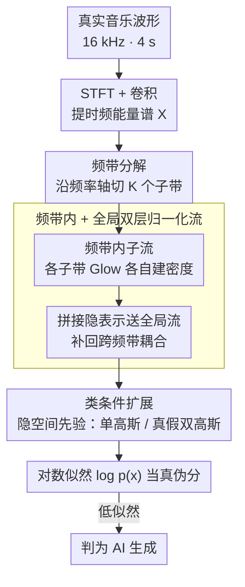

# MusicDET: Zero-Shot AI-Generated Music Detection

**会议**: ICML 2026  
**arXiv**: [2605.18072](https://arxiv.org/abs/2605.18072)  
**代码**: https://github.com/Chaolei98/MusicDET (有)  
**领域**: AI 安全 / AI 生成内容检测 / 音频伪造  
**关键词**: AI 生成音乐检测, 零样本检测, 归一化流, 频带分解, 似然估计

## 一句话总结
MusicDET 把"AI 生成音乐检测"重新定义为只用真实音乐训练的零样本问题，用频带分解 + 频带内归一化流 + 全局归一化流学习真实音乐能量谱的概率分布，把似然值当作"真伪分"，在 FakeMusicCaps / SONICS 的跨生成器评测下把平均 EER 从 ~17% 干到 4.51%（零样本）/ 0.89%（带类别条件先验）。

## 研究背景与动机
**领域现状**：AI 生成音乐（AIGM）正在快速渗透创作和发行环节，但作为反向取证的检测方向却落后于生成端。现有 AIGM 检测器（SpecTTTra、AASIST、MERT/W2V2-AASIST、WPT 等）大多沿用语音 deepfake 的判别式做法——同时拿真假样本训练一个二分类器，专门去抓特定生成器留下的伪影。

**现有痛点**：这种判别式范式在闭集（训练 / 测试用同一个生成器）下精度很高，但只要把测试集换成训练时没见过的生成器，EER 就会暴跌到 30%+。MusicGen → MusicLDM、Suno V3 → Udio 130 这种跨族迁移基本不能打，而新生成器还在不断涌现，给每个生成器单独训一个检测器在工程上不现实。

**核心矛盾**：判别式检测把"伪造"建模成"某个生成器留下的特定伪影分布"，本质上是在学一个生成器指纹库；可"真实音乐"是一个稳定且共享的目标，"伪造"却是一个开放、不断扩张的集合。用稳定分布的差集去近似开放集合，必然 OOD 泛化崩盘。语音 deepfake 检测器又依赖 voice conversion / TTS 的 low-level 线索，搬到旋律 / 和声 / 音色 / 节奏更复杂的音乐上水土不服。

**本文目标**：拆成两个子问题。① 在训练集里**完全不放任何生成样本**的前提下做检测（更接近真实部署）；② 给一个对生成器无关、能稳定迁移到任何未见生成器的统一框架。

**切入角度**：作者从音乐家的判别经验出发——专家比普通听众更容易识破 AI 音乐，是因为他们对"真实音乐听起来该是什么样"有更强的先验。把这个直觉数学化：用归一化流为真实音乐建一个精确可计算的概率密度 $p_X(x)$，伪造样本天然落在低似然区域。

**核心 idea**：用频带分解 + 频带内归一化流 + 全局归一化流，在时频能量谱上对真实音乐做单类密度估计，把对数似然 $\log p_X(x)$ 当作真伪判别分。

## 方法详解

### 整体框架
MusicDET 要解决的是"不看任何伪造样本，也能稳定识破任意未见生成器"的检测问题，做法是把它转成对真实音乐的单类密度估计：从一段 16 kHz、4 s 的波形抽出时频能量谱，用归一化流为真实音乐学一个精确可算的概率密度 $p_X(x)$，推理时直接拿对数似然 $\log p_X(x)$ 当真伪分，低似然即判为 AI 生成。为了让密度估计在音乐这种高度非平稳的频谱上站得住，框架把能量谱沿频率轴切成若干子带，先用频带内的子流各自建密度，再用一个全局流把跨频带的耦合补回来。

### 关键设计

**1. 频带分解：让似然估计不被混合统计拖崩**

音乐的频谱在频率轴上高度非平稳——低频塞着节奏脉冲和基频，高频塞着音色细节和瞬态，两者的统计量差异极大。若用单个流去硬拟合整张能量谱，密度被这种多模态混合拖得不稳，算出的 $\log p_X$ 方差大、判别力弱。MusicDET 把谱图沿频率轴切成 $K_b$ 个子带 $X = [X^{\text{low}}, X^{\text{high}}, \dots]$（默认 2 个，低频管节奏/基频、高频管音色/泛音），每个子带交给一个独立子流去建密度，相当于把"一个复杂多模态分布 → 单流"的硬问题分解成"多个相对单峰的子分布 → 多个子流"。要强调的是分带本身并不假设频带间独立，跨频带的依赖被刻意留给下一层全局流处理，这样既贴合音乐的物理先验，又让每个子流面对一个数值上更好估计的目标。

**2. 频带内 + 全局双层归一化流：兼顾子带细节与跨带结构**

单一流没法同时抓好"子带内的精细规律"和"频带之间的全局耦合"，MusicDET 用双层结构做折中。第一层是 Glow-style 子流 $f_\theta^{\text{band}}: x^{\text{band}} \leftrightarrow h_K^{\text{band}}$，每个子流由 $K$ 步 flow 组成、每步含 ActNorm + 可逆 $1\times1$ 卷积 + 仿射耦合层，专抓频带内规律（如低频和声的平滑演化）；第二层把各子带隐表示 $h_K^{\text{band}}$ 拼接后送进全局流 $f_\theta^{\text{global}}$，投影到隐空间高斯先验 $p_Z(z) = \mathcal{N}(\mu_{\text{real}}, I)$，专抓跨频带耦合（如基频与谐波的对齐）。整条变换是双射，雅可比行列式可解析计算，于是数据似然能用 change-of-variables 精确写出：

$$\log p_X(x) = \log p_Z(f_\theta(x)) + \sum_j \log \left| \det J_{f_j} \right|$$

正是这个"可逆 + 雅可比可算"的性质让 $\log p_X(x)$ 能直接当真伪分用，而双层划分在表达力（多模态）和可处理性之间取得了比单流更稳的密度估计。

**3. 类条件扩展：用同一套流统一零样本与监督设置**

当确实能拿到伪造样本时，MusicDET 不动 backbone，只把隐空间先验从单高斯换成类条件双高斯 $p_{Z|Y}(z|y) = \mathcal{N}(\mu_y, I)$，把真假两类分别推向 $\mu_{\text{real}} = 5$ 和 $\mu_{\text{fake}} = -5$，训练改为最小化条件 NLL $-\mathbb{E}[\log p_{X|Y}(x|y)]$。流参数 $\theta$ 在两类间完全共享，类别信息只通过先验均值注入；推理时**只算** $\log p_X(x \mid y=\text{real})$，于是即便训练见过的 AI 样本，在隐空间也被压到 $\mu_{\text{fake}}$ 附近，自然落进真实先验的低似然区。这样零样本设置就退化成单先验密度估计、监督设置只是加了一个类条件先验，全程保持"它是检测器而非分类器"的纯净性，也绕开了判别式 baseline 对特定生成器伪影过拟合的老毛病。

### 损失函数 / 训练策略
零样本设置：最小化真实音乐的 NLL，$\min_\theta \mathbb{E}_{x \sim \mathcal{D}_{\text{real}}}[-\log p_X(x)]$；类条件设置：最小化条件 NLL，$\min_\theta \mathbb{E}_{(x,y) \sim \mathcal{D}_{\text{train}}}[-\log p_{X|Y}(x|y)]$。10 epoch，Adam，lr $5 \times 10^{-4}$，batch 64，每个子带 flow 步数 $K = 2$，频带数 2，先验均值 $\mu_{\text{real}} = 5$。训练时配合 SpecAugment 做时频遮挡增广。单卡 RTX 4090 即可。

## 实验关键数据

### 主实验
两个数据集都采用跨生成器评测：训练子集和测试子集来自不同 AI 生成器，平均 EER 越低越好。

**FakeMusicCaps（5 个 TTM 生成器跨子集平均 EER）**：

| 方法 | 零样本 | MusicGen | MusicLDM | AudioLDM2 | Stable Audio | Mustango | 平均 EER ↓ |
|------|--------|----------|----------|-----------|--------------|----------|-------------|
| AASIST | ✗ | 31.13 | 32.91 | 28.04 | 33.64 | 37.93 | 32.73 |
| W2V2-AASIST† (全量微调) | ✗ | 7.78 | 20.87 | 2.87 | 6.66 | 19.13 | 11.46 |
| WPT-W2V2-AASIST | ✗ | 10.84 | 27.31 | 4.62 | 10.44 | 34.84 | 17.61 |
| SpecTTTra-α | ✗ | 11.60 | 31.45 | 7.24 | 10.29 | 27.56 | 17.63 |
| **MusicDET (零样本)** | ✓ | **5.64** | **6.55** | **2.36** | **3.82** | **4.18** | **4.51** |
| **Class-Conditional MusicDET** | ✗ | 1.67 | 0.15 | 0.22 | 2.40 | 0.04 | **0.89** |

零样本 MusicDET 在不看任何伪造样本的前提下，比拿全部生成器数据全量微调的 W2V2-AASIST†（11.46）还低 ~7 个点，跨生成器优势压倒性。

**SONICS（Suno / Udio 5 个子集平均 EER）**：

| 方法 | 零样本 | Suno V2 | Suno V3 | Suno V3.5 | Udio 32 | Udio 130 | 平均 EER ↓ |
|------|--------|---------|---------|-----------|---------|----------|-------------|
| W2V2-AASIST† | ✗ | 16.20 | 0.37 | 0.47 | 24.97 | 21.70 | 12.74 |
| Spec-ViT | ✗ | 0.43 | 0.50 | 0.44 | 3.80 | 1.00 | 1.23 |
| SpecTTTra-α | ✗ | 0.70 | 1.34 | 0.93 | 7.83 | 2.50 | 2.66 |
| **MusicDET (零样本)** | ✓ | 2.80 | 3.20 | 2.93 | 2.73 | 2.80 | **2.89** |
| **Class-Conditional MusicDET** | ✗ | 0.00 | 0.00 | 0.00 | 0.00 | 0.00 | **0.00** |

类条件版本在 SONICS 上把伪造样本完全压死（5 个子集全 0 EER）。零样本版本虽然不是最低，但**各列方差极小**（2.73–3.20），说明对生成器选择高度不敏感，这才是跨生成器场景真正需要的属性——Spec-ViT 平均 1.23 是因为某些子集刷得极低，但其他模型在跨生成器混淆矩阵上离对角线一远就崩。

### 消融实验
**效率对比（Table 3，FakeMusicCaps 训练）**：

| 配置 | 推理速度 (M/S) ↑ | FLOPs (G) ↓ | 显存 (GB) ↓ | 参数 (M) ↓ | EER (%) ↓ |
|------|------------------|--------------|--------------|-------------|-----------|
| MERT-AASIST† | 173 | 73.20 | 3.68 | 315.88 | 15.64 |
| WPT-W2V2-AASIST | 140 | 76.29 | 1.33 | 0.69 | 17.61 |
| SpecTTTra-α | 810 | 2.85 | 0.33 | 16.83 | 17.63 |
| **MusicDET** | 516 | 4.09 | **0.11** | **8.13** | **4.51** |

**Leave-one-subdomain-out（Table 4）**：训练时分别去掉 jazz 或 piano，测试看子域泛化。jazz 平均 EER 2.5%，piano 4.1%，说明模型学到的"真实音乐先验"覆盖到了未见风格。

### 关键发现
- **频带数 + flow 深度都不是越大越好**：超参分析显示频带数 2、$K=2$ 时性能最好，再大反而过拟合或不稳；
- **先验均值 $\mu_{\text{real}}$ 影响很关键**：在 $\mu_{\text{real}} = 5$ 处取得最优，太小判别力不够，太大数值不稳；
- **跨生成器混淆矩阵**：判别式 baseline（W2V2/MERT-AASIST、SpecTTTra-α）的对角线很低但远对角元素 EER 高达 30–48%，类条件 MusicDET 整张矩阵都接近 0，把跨生成器迁移的"伪影库"问题彻底绕开了；
- **跨任务迁移**：在 ASVspoof2019LA 和 CtrSVDD 上同样有效，说明"用归一化流学真实分布"的思路可以推广到语音反欺骗、歌声欺骗检测等更广的音频取证任务。

## 亮点与洞察
- **问题重构远比方法本身更有价值**：从"AIGM 判别"到"零样本 AIGM 检测"，本质上把开集泛化的负担从模型转移到了问题定义上——只学真实分布意味着对任何未见生成器都自动免疫。这种重构思路可以原样搬到 deepfake 视频、AI 图片、AI 文本等所有"生成器多样、真实样本相对统一"的检测场景。
- **频带分解 + 双层流的因式分解很优雅**：把高度多模态的音乐分布拆成"频带内子分布 × 全局耦合"，既保留了密度估计的精确性，又减轻了单流去硬拟合复杂分布的不稳定。这个"按物理结构分子空间 + 子流 + 全局流"的模板在视频时序异常、多模态联合密度估计里都能复用。
- **类条件先验把判别式和生成式做了优雅统一**：流网络共享，只在隐空间均值上注入类别，零样本退化成单先验、监督升级成双先验。这种"backbone 不变、prior 注入"的范式比直接拼判别 head 干净得多，也避免了 head 对生成器伪影过拟合。
- **效率比预期好**：参数量 8.13 M、显存 0.11 GB、推理 516 M/S，对部署友好，比全量微调 W2V2 这类 300 M+ 参数的方案优势明显。

## 局限与展望
- **作者承认的局限**：当前只在 16 kHz、4 s 短片段上验证，对长时音乐结构（小节级、乐句级一致性）建模不足；高质量、人类难辨的 AI 音乐（如最新 Suno V4+ 或人工后期混音版本）尚未充分测试。
- **方法上的隐忧**：① 先验均值 $\mu_{\text{real}}, \mu_{\text{fake}}$ 是经验设定（5 / -5），缺乏理论指导，换数据集可能需要重调；② 归一化流要求严格双射，对输入分布平稳性有较高要求，遇到极端风格（实验音乐、噪声音乐、混音残响）可能似然崩塌；③ 类条件版本在 SONICS 全 0 EER 看起来很完美，但也提示可能对 Suno / Udio 的统计指纹过拟合，遇到真正新颖的生成方式（如扩散 + 流匹配混合）能否保持还需要验证。
- **改进方向**：① 把全局流换成自回归流以捕捉长时依赖；② 引入条件似然 $p(x | \text{genre}, \text{instrument})$ 做更细粒度的真实先验；③ 把"真实音乐似然"和"语义对齐分"（如 CLAP 文本-音频相似度）做后融合，对抗"音色真实但内容混乱"的高质量伪造。

## 相关工作与启发
- **vs SpecTTTra (Rahman et al., 2025)**：SpecTTTra 是典型的判别式方法，靠 spectrogram + transformer 拟合伪影；在 SONICS 单子集训练时（含伪造样本）EER 可以做到 0.7%，但跨子集就到 17.63%。本文用零样本 + 流密度估计，跨生成器平均 EER 4.51%，劣势是单生成器内部精度不一定最优，优势是真正"换一个生成器就能用"。
- **vs WPT-W2V2-AASIST (Xie et al., 2026)**：WPT 通过小波 prompt 调优在 W2V2 上学跨域不变特征，更靠特征对齐；MusicDET 不学不变特征，直接学"真实分布"，路线完全不同，在 FakeMusicCaps 上 4.51 vs 17.61。
- **vs Rudolph et al. 2021 / Hirschorn & Avidan 2023 (视觉异常检测中的归一化流)**：视觉异常检测多用流建模预训练特征，输入分布相对单峰；本文首次把流应用到 AIGM 检测，关键差异是"频带分解 + 双层流"应对音乐的多模态频域分布——直接搬视觉做法效果有限。
- **vs 语音 deepfake 检测（AASIST、W2V2-AASIST 等）**：语音方案依赖 voice conversion / TTS 的 low-level 线索，迁移到音乐效果差；本文专门面向音乐的频带物理特性设计，跨任务测试也显示该思路对 ASVspoof 和 CtrSVDD 同样有效，反而比专门设计的语音方法更具通用性。

## 评分
- 新颖性: ⭐⭐⭐⭐⭐ 首次把"零样本 AIGM 检测"作为正式任务提出，频带分解 + 双层归一化流在音频取证里是新组合
- 实验充分度: ⭐⭐⭐⭐ FakeMusicCaps / SONICS 双数据集 + 跨生成器混淆矩阵 + 跨任务迁移（ASVspoof / CtrSVDD）+ 效率分析，覆盖面广；缺长时音乐和最新生成器评测
- 写作质量: ⭐⭐⭐⭐ 动机讲得清楚，公式和算法描述简洁，类条件扩展那段把"检测器 vs 分类器"边界说得很明白
- 价值: ⭐⭐⭐⭐⭐ 问题重构本身就是价值——告诉社区"开集 AIGM 检测应该走密度估计，而不是无止境追新生成器伪影"，方法轻量易复现，工业部署友好

<!-- RELATED:START -->

## 相关论文

- [\[ICML 2026\] Polyphonia: Zero-Shot Timbre Transfer in Polyphonic Music with Acoustic-Informed Attention Calibration](polyphonia_zero-shot_timbre_transfer_in_polyphonic_music_with_acoustic-informed_.md)
- [\[ACL 2025\] Double Entendre: Robust Audio-Based AI-Generated Lyrics Detection via Multi-View Fusion](../../ACL2025/audio_speech/double_entendre_robust_audio-based_ai-generated_lyrics_detection_via_multi-view_.md)
- [\[ACL 2025\] ControlSpeech: Towards Simultaneous and Independent Zero-shot Speaker Cloning and Zero-shot Language Style Control](../../ACL2025/audio_speech/controlspeech_zero_shot.md)
- [\[ACL 2025\] Zero-Shot Text-to-Speech for Vietnamese](../../ACL2025/audio_speech/zero-shot_text-to-speech_for_vietnamese.md)
- [\[ACL 2026\] ReStyle-TTS: Relative and Continuous Style Control for Zero-Shot Speech Synthesis](../../ACL2026/audio_speech/restyle-tts_relative_and_continuous_style_control_for_zero-shot_speech_synthesis.md)

<!-- RELATED:END -->
