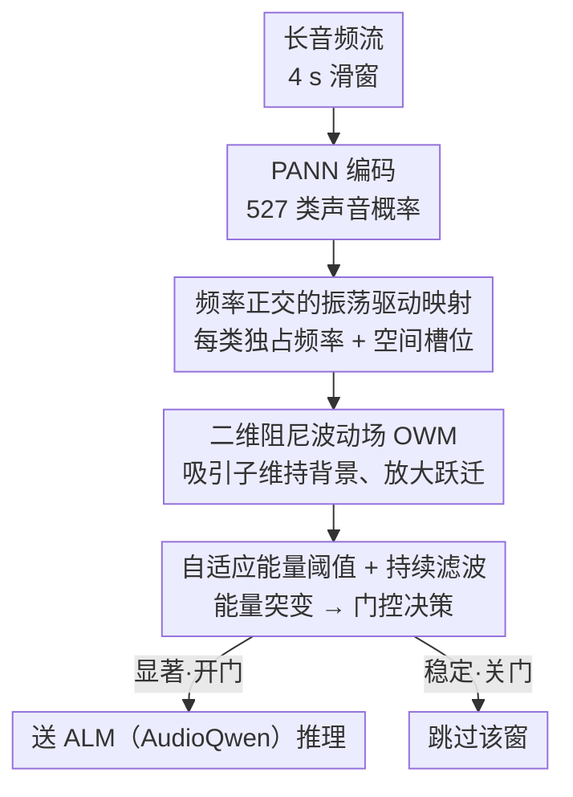

# NAACA: Training-Free NeuroAuditory Attentive Cognitive Architecture with Oscillatory Working Memory for Salience-Driven Attention Gating

**会议**: ICML 2026  
**arXiv**: [2605.13651](https://arxiv.org/abs/2605.13651)  
**代码**: https://github.com/zjyuan1208/NAACA-Oscillatory-Working-Memory (有)  
**领域**: 音频语言模型 / 神经启发架构 / 注意力分配  
**关键词**: 听觉显著性、振荡工作记忆、训练无关门控、ALM 长音频理解

## 一句话总结
用一套受皮层振荡启发的二维波动场（OWM）做实时显著性检测，给 Audio Language Model 在长音频上当一个"训练无关的注意力门"，只把真正显著的窗口送进 ALM，从而在 XD-Violence 上把 AP 从 53.5% 拉到 70.6%，同时减少约 40% 的 ALM 调用。

## 研究背景与动机

**领域现状**：Audio Language Models（如 AudioQwen）已经能对短音频做开放词表的语义理解，是把语音、环境声接入到多模态推理的关键模块。在街景监控、生物声学等长时音频场景里，业界通常的做法是把流切成滑窗逐段送进 ALM，或者干脆把整段塞进 transformer 让它自己挑重点。

**现有痛点**：长流推理出现"注意力稀释"——背景声占据绝大多数 token 预算，真正稀有但关键的事件（枪声、求救、突发欢呼）反而被淹没。文章给的 demo 里，把 60 s 切成 4 个 15 s 窗喂进去，末段的风笛 onset 完全被漏掉；只有把最后 15 s 调到最前面，模型才"看见"它。穷举式短窗推理虽然能 cover 所有显著点，但 ALM 调用成本飙升，工业上跑不起。

**核心矛盾**：感知召回率与计算预算之间存在 trade-off。要么烧 GPU 不停调 ALM，要么少调但漏掉稀有事件。传统的统计型 drift detector（如 Rabanser 系列）或表征型方法又需要长期历史样本和大量 overhead，难以做到在线、无监督、可部署。

**本文目标**：构造一个不需要训练、不依赖历史标签、能在线判断"什么时候该叫醒 ALM"的轻量门控模块。

**切入角度**：作者从认知神经科学借灵感——大脑用注意力门控过滤稳定背景、放大显著刺激；皮层 working memory 由 attractor 状态维持，振荡动态参与编码与维持的解耦（β 维持、γ 编码）。这暗示显著性可以从"状态跃迁"中读出，而不需要训一个专门的分类器。

**核心 idea**：把 PANN 编码器输出的 527 类概率作为不同频率的正弦驱动信号，注入一张 $64 \times 64$ 的二维阻尼波动场（OWM），用全局能量相对自适应阈值的突变作为"显著事件"信号，从而把 ALM 的注意力门控问题转化为一个生物物理可解释的振荡能量检测问题。

## 方法详解

### 整体框架
NAACA 要解决的是"长音频流里背景声淹没稀有关键事件、但又不能无脑穷举调 ALM"的两难。它的做法是在 ALM 前面插一个完全无参数的物理门控：把每个 4 s 滑窗经 PANN 编码成 527 类声音概率，再把这组概率当作驱动信号注入一张二维阻尼波动场（OWM），让"什么时候该叫醒 ALM"退化成"波动场总能量什么时候突变"。整条链路里只有 PANN 和 ALM 是预训练权重，OWM 本身一个可学习参数都没有。

### 关键设计

**1. 频率正交的振荡驱动映射：把概率向量变成可分离的振荡身份**

门控要工作的前提是能从一帧帧概率里读出"分布变了"，难点在于 527 个类别如果混在一起，单看能量根本分不清是哪类在动。NAACA 的做法是给每一类同时分配一个独占频率和一块独占空间槽位：第 $i$ 类的载波频率 $f_i = f_{\min} + i (f_{\max} - f_{\min}) / (C-1)$ 线性铺在 $[51, 1200]$ Hz 上，瞬时振幅直接取该类概率 $a_i(t)$，并且只在自己的空间 patch $\Omega_i$ 上有非零驱动，写成 $S_i(x,t) = a_i(t) \sin(\omega_i t)\, \mathbf{1}_{\Omega_i}(x)$；$64\times64=4096$ 个格点按行优先确定性切给 527 类（每类约 7-8 格），不需要学。这样"哪个类活跃"在频域（不同 $\omega_i$ 的阻尼响应不同）和空间（不同 $\Omega_i$）上都可分，一旦输入在类别间跃迁就会同时扰动多个空间位置的相位关系、引发全局能量瞬态；比起学一个分类头，换编码器时只要重算频率和格点分配，迁移成本几乎为零。

**2. 二维阻尼波动场作为工作记忆：用吸引子动力学维持背景、放大跃迁**

仅有驱动信号还不够，需要一个能"记住稳定背景、对变化敏感"的载体，这正是 OWM 充当工作记忆的角色。它是一张 2D 速度-压强场，压强 $p(x,y,t)$ 存当前听觉状态、速度 $\mathbf{v}$ 控制相邻格点的横向传播，遵循一阶系统 $\partial_t p + k^p p = -c^2(x,y)\,\nabla\!\cdot\!\mathbf{v} + S$ 与 $\partial_t \mathbf{v} + k^v \mathbf{v} = -\nabla p$，以时间步 $\Delta t = 0.01$ 离散演化。波速场刻意设计成条纹状 $c(x,y)=c(y)$（深浅蓝交错），靠 Bragg-matched 周期性产生慢传播相干模式，让"维持型"低频与"编码型"高频在相位上耦合，论文的 Theorem 2.4 证明这种条纹结构正是显著性灵敏度的最优解。稳态下场会自然形成"声音类别 → 空间共振位置"的吸引子，类似皮层的拓扑组织：输入分布平稳时能量振幅自然稳定，只有类别真正切换才会引发全局能量重排，于是"什么变了"的判断被推到一个生物物理量上，省去了训练任何 detector。

**3. 自适应能量阈值 + 持续滤波：把能量突变翻译成稳健的门控决策**

最后一步是把连续的能量信号变成开/关门的二值决策，关键在于背景噪声水平因城市、时段而剧烈漂移，静态阈值必然失灵。NAACA 在长度 $W=20$ 的滑动窗内估计 energy-derived drift 的均值 $\mu$ 与标准差 $\sigma$，用自适应阈值 $T_{\text{adapt}} = \mu + 2\sigma(1 + \alpha\cdot\text{trend})$ 做判定，其中 trend 因子对漂移趋势加权——若近期能量一直在缓涨说明背景整体在变，就相应抬高阈值避免误触；最终门控 = 阈值穿越叠加多帧持续性滤波，以抑制单点假警报。正因为阈值是相对统计量，系统才能在性质迥异的 XD-Violence 和 USoW 上都稳定工作（中位数门控率分别为 0.597 与 0.650）。

### 损失函数 / 训练策略
NAACA 完全 training-free——PANN 与 AudioQwen 都是冻结预训练，OWM 没有任何可训练参数，所有"超参"（频率范围 51-1200 Hz、阻尼 $k^p=k^v=10$、网格 $64\times64$、滑动窗 $W=20$、阈值倍数 2）都是基于 Theorem 2.1/2.4 的灵敏度分析直接给的。没有梯度下降、没有标签，只有一次性的几何/物理参数设置。

## 实验关键数据

### 主实验
在 XD-Violence 的纯音频赛道（500 测试样本）上和监督音频模型、监督视频模型、零样本视频模型对比：

| 方法 | 模态 | 训练 | AP (%) |
|------|------|------|--------|
| AudioQwen (exhaustive) | 音频 | 否 | 53.50 |
| Random 4 s 段 | 音频 | 否 | 60.44 |
| HL-Net (监督) | 音频 | 是 | 60.50 |
| AVadCLIP (监督) | 音频 | 是 | 52.51 |
| Holmes-VAU (监督) | 视频 | 是 | 87.68 |
| TRACE (含 cross-attn 适配) | 视频 | 部分 | 83.67 |
| **NAACA (本文)** | 音频 | 否 | **70.60** |

NAACA 在不训练的前提下，比所有监督音频基线都高，比 Random 4 s 高 10.16 个百分点（说明 OWM 选段确实有效，不仅仅是输入变短的功劳），离监督视频方法仍有差距但这是模态固有的 audio-only 上限。

### 消融实验

| 配置 | XD-Violence AP | Time Sent Ratio | 说明 |
|------|---------------|-----------------|------|
| AudioQwen exhaustive | 53.50 | 1.00 | 完整滑窗推理基线 |
| Random 4 s (同段数) | 60.44 | $\approx$ 0.6 | 隔离"短输入"贡献 |
| NAACA full | 70.60 | 0.597 | OWM 选段 |
| NAACA on USoW | (定性) | 0.650 | 跨数据集一致性 |

"短输入"本身贡献 $+6.94$ AP，OWM 显著性选择再贡献 $+10.16$ AP；OWM 检出的 drift 点与 ground-truth 事件帧重叠率 61.1%，说明确实选到了关键时刻。

### 关键发现
- OWM 选段在 ALM 调用降低约 40%（57 次 → 34 次每 60 s 片段）的同时把 AP 拉高 17.1 个点，直接外推 Pareto 前沿。
- $p$-field 的 FFT 谱分析显示，稳态背景期主要是 β 段 (15-30 Hz) 振荡（对应维持），drift 后部分 example 切到 γ 段 (30-50 Hz)（对应编码），与皮层 working memory 的频带分工一致，提供了模型可解释性证据。
- 在 USoW 的定性案例里 OWM 能区分三类 drift：完全新事件（车引擎、风笛）、子类切换（hi-hat 出入）、对短暂停顿的鲁棒性（婴儿哭间隙不会被切成多事件）——说明它捕捉的是"分布变化"而非"音量变化"。

## 亮点与洞察
- 用一张物理仿真级别的波动场代替"训一个 detector"是个非常优雅的反直觉操作：作者通过 Bragg 条纹的最优性定理把波速场参数化压到只剩条纹周期一个自由度，让整个 OWM 退化成几乎零超参，泛化到新编码器只需重算频率分配。
- "salience ≠ loudness, salience = context change" 这个认知科学命题被翻译成"系统总能量相对自适应阈值的瞬态"，给后续做 LLM 注意力门控提供了一个跨模态可借鉴的统一抽象：只要能把输入流编码成 OWM 那样的"准 attractor 动力系统"，就能用能量突变当显著性信号。
- 跑分提升来自于"少处理"而不是"更聪明地处理"，这对 streaming 部署特别友好——它告诉社区 long-context 不一定要靠扩 context window 解决，也可以靠"先门控再喂"。

## 局限与展望
- 性能天花板被 PANN + AudioQwen 锁死，PANN 训自 AudioSet 标签集，遇到稀奇专业领域（医疗鸟鸣、机械故障声）会失灵，需要换更强的预训练编码器。
- 硬门控会丢边界上下文，对长程因果推理可能不利；作者建议未来用 KV-cache 调制做"软门控"，但需要白盒访问 ALM。
- 当前评测主要是异常检测 AP + 时间精度，缺 SpeechIQ 风格的下游问答、指令跟随任务，不知道 OWM 留下的窗对真正的多轮推理够不够用。
- 实验只覆盖 XD-Violence（剧情片音频）和 USoW（城市声），都偏短中长度（60 s 级），真正小时级流的稳定性尚未验证。

## 相关工作与启发
- **vs Rabanser 等统计 drift detector**: 他们需要长期历史样本估计参考分布，NAACA 只需 20 帧滑动统计就能算阈值，更适合开放式部署，但理论保证较弱（没有形式化的 false-alarm rate）。
- **vs AVadCLIP / HL-Net 监督方法**: 这些方法靠领域标注 fine-tune，迁移到新场景要重新标注；NAACA training-free，迁移成本 = 0，但代价是天花板被预训练 ALM 决定。
- **vs MA-LMM 等 KV-cache 长视频方法**: 都是为了打破 transformer context 瓶颈，但 MA-LMM 在 latent 里做压缩，NAACA 在输入层做物理门控，二者其实可以叠加。
- 启发：把"显著性 = 物理系统瞬态"这个想法迁到视频/文本流上是个开放问题——比如能不能用 LLM hidden state 的能量当 token-level salience 信号，给 RAG 检索器/agent 做事件触发？

## 评分
- 新颖性: ⭐⭐⭐⭐⭐ 把 cortical wave 仿真直接当 detector 用，机制层面极少人这样做
- 实验充分度: ⭐⭐⭐⭐ XD-Violence + USoW 双数据集 + 定量定性 + 谱分析，已经很扎实，缺 SpeechIQ 风格下游任务
- 写作质量: ⭐⭐⭐⭐⭐ 有 4 条 theorem 把直觉做成了形式化保证，故事线（认知动机 → 物理建模 → 显著性检测）非常清晰
- 价值: ⭐⭐⭐⭐ 给"长音频 LLM 部署"提供了一个可立刻接入的轻量门控件，对工业链路很实用

<!-- RELATED:START -->

## 相关论文

- [\[ACL 2026\] Temporal Contrastive Decoding: A Training-Free Method for Large Audio-Language Models](../../ACL2026/audio_speech/temporal_contrastive_decoding_a_training-free_method_for_large_audio-language_mo.md)
- [\[ICML 2026\] Polyphonia: Zero-Shot Timbre Transfer in Polyphonic Music with Acoustic-Informed Attention Calibration](polyphonia_zero-shot_timbre_transfer_in_polyphonic_music_with_acoustic-informed_.md)
- [\[ICML 2026\] Attend to Anything: Foundation Model for Unified Human Attention Modeling](attend_to_anything_foundation_model_for_unified_human_attention_modeling.md)
- [\[ICLR 2026\] Dynamic Parameter Memory: Temporary LoRA-Enhanced LLM for Long-Sequence Emotion Recognition in Conversation](../../ICLR2026/audio_speech/dynamic_parameter_memory_temporary_lora-enhanced_llm_for_long-sequence_emotion_r.md)
- [\[CVPR 2026\] Multi-speaker Attention Alignment for Multimodal Social Interaction](../../CVPR2026/audio_speech/multi-speaker_attention_alignment_for_multimodal_social_interaction.md)

<!-- RELATED:END -->
