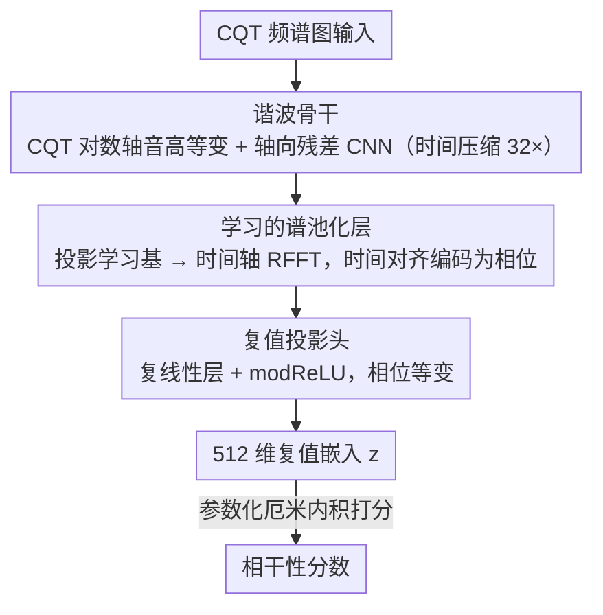

# PhaLar: Phasors for Learned Musical Audio Representations

**会议**: ICML 2026  
**arXiv**: [2605.03929](https://arxiv.org/abs/2605.03929)  
**代码**: 待确认  
**领域**: 音频 / 音乐信息检索  
**关键词**: 相位等变性, 复数值神经网络, 音频相干性, 茎检索, 对比学习

## 一句话总结
PhaLar 通过把音频特征投影到复平面并利用相位等变性——核心是用 FFT 把时间对齐编码为相位旋转——在音乐茎检索任务上相对 SOTA 提升 70%、参数仅为对手 44%、训练 7× 加速；从"相位不变"到"相位等变"是建筑哲学的根本转变。

## 研究背景与动机

**领域现状**：现有音频表示学习从计算机视觉范式继承——把频谱图视为二维图像用 CNN / ViT 处理，采用全局平均池化（GAP）实现平移不变性。CLAP、CDPAM 等基础模型在语义相似性任务上表现良好。

**现有痛点**：平移不变性对语义分类有益（识别"吉他"存在），但对结构相干性任务有害。音乐**茎检索**（给鼓 + 贝斯混音，找时间和谐波上匹配的缺失声部）需要精准时间对齐。GAP 丢弃时间顺序，使完全错位的节奏被映射到相同隐表示——即便两段含相同乐器也会完全不连贯。

**核心矛盾**：语义相似性和结构相干性建立在完全不同的几何基础上。基础模型被设计为"结构盲"——对识别"摇滚歌曲"有用，对评估两段音频是否在时间上对齐毫无用处。

**本文目标**：设计一种**显式保留时间对齐信息**而非丢弃它的表示学习框架；同时保持参数效率和训练速度。

**切入角度**：傅里叶移位定理——**时域时间平移对应频域相位旋转**。如果能利用这个物理性质，把时间关系编码为相位角，就能在复平面上进行相干性评估。

**核心 idea**：从实值幅度特征切到复值相位器表示——通过学习的谱池化层应用 FFT 把时间维度映射到频域，然后用相位等变的复值神经网络处理这些复值特征，使相位信息被自然保留而非销毁。

## 方法详解

### 整体框架
PhaLar 要解决的是"两段音乐茎在时间和谐波上是否对齐"，而传统做法用全局平均池化把时间顺序抹掉了。它的破局点是傅里叶移位定理——时域平移等于频域相位旋转——于是整条管线不再追求"丢掉时间得不变性"，而是把时间对齐编码进相位、再用一套对相位敏感的复值网络去读它。具体分三段：先用轻量 CNN 从 CQT 频谱图抽音调特征，再用一个学习的谱池化层沿时间维做 FFT 把时间位置转成相位角，最后让复值头在复平面上比对两段音频的对齐度，输出 512 维复值嵌入算相干性分数。

### 关键设计

**1. 谐波骨干：用 CQT 的对数间距把"音高平移"变成卷积能复用的线性平移**

茎检索的第一步是抽出音调感知的特征，但音乐里同一个音程（比如"大三度"）出现在不同调上，如果用普通频谱图，卷积核得为每个调性单独学一套变体，既费参数又学不到通用规律。骨干因此用 CQT 频谱图作输入——CQT 的频率轴是对数间距的，音高平移在这个坐标下就是纯粹的线性平移，同一个卷积核能跨所有调识别相同音程，相当于把"音高等变性"作为归纳偏置硬编码进网络。骨干本身是 10 层轴向残差 CNN，每层拆成三种卷积：频率方向 $3 \times 1$、时间方向 $1 \times 3$、逐点 $1 \times 1$，把谐波处理和时间处理解耦开来降低计算量；每隔一层用步长卷积压缩时间，总共压 32×。

**2. 学习的谱池化层：把时间信息转成相位旋转而非丢弃它**

这是替代 GAP 的核心模块，目标是保住时间对齐信息。它先把骨干输出 $X \in \mathbb{R}^{B \times H \times F \times T'}$ 的通道维和频率维展平成 $\bar{X} \in \mathbb{R}^{B \times (HF) \times T'}$，投影到学习基 $W_{\text{proj}} \in \mathbb{R}^{(HF) \times D}$ 得到 $Z_{\text{time}} = \bar{X} W_{\text{proj}} \in \mathbb{R}^{B \times T' \times D}$——跨所有频率一起投影是为了让每个语义通道同时编码音程结构和绝对频率位置。关键一步是对时间轴做 RFFT：$S = \text{rfft}(Z_{\text{time}}) \in \mathbb{C}^{B \times C \times D}$（$C = \lfloor T'/2 \rfloor + 1$），再截断/填充到固定 $C = 8$，得到 $D \times C = 640$ 个复值的定长嵌入。傅里叶移位定理在这里起作用——时域上的时间移位会变成 $S$ 里相位角 $\angle S_{c, d}$ 的旋转，于是"两段音频差了多少时间"被显式写进了相位，时间对齐问题就转化成了复平面上的几何关系。换个角度看，这一层学到的就是一张调制谱：经典调制分析作用在原始频谱上，而这里作用在学到的语义特征上。

**3. 复值投影头：用相位等变保证对齐信息一路传到分数**

光把相位编码出来还不够，后续网络若是普通实值 MLP，相位会被立刻破坏，所以这个头全程在复域里走，并且满足相位等变性 $f(x \cdot e^{i\theta}) = f(x) \cdot e^{i\theta}$——输入整体旋转一个相位，输出也跟着旋转同样的相位，对齐信息因此不会被中途吃掉。它由两个复线性层组成，中间夹复 RMSNorm 和 modReLU 激活，最终投到 512 维复值向量 $z \in \mathbb{C}^{512}$。两段音频的相干性用参数化厄米内积算：$s(z_x, z_y) = \Re(z_x^H W z_y)$，其中 $W \in \mathbb{C}^{D \times D}$ 是可学习复权矩阵——复权让模型能施加一个可学习的相位旋转去"对齐"两个茎，从而容忍"懒散"节奏这类微时间偏差；取实部是把复值对齐塌缩成一个标量分数，同时仍保留对相位的敏感度。这里特意不在最后加饱和非线性，好让高能瞬变（如鼓点）对分数贡献更大。推理时再对称化 $s_{\text{comm}} = \frac{s(z_x, z_y) + s(z_y, z_x)}{2}$，保证检索任务里 $x$ 配 $y$ 和 $y$ 配 $x$ 给出一致分数。

## 实验关键数据

### 主实验（音乐茎检索精度）

| 数据集 | K | PhaLar (2.3M) | COCOLA (5.2M) | 相对提升 |
|--------|---|-------------|-------------|---------|
| MoisesDB | 8 | 86.79% | 75.81% | +14.3% |
| MoisesDB | 16 | 81.49% | 64.44% | +26.4% |
| MoisesDB | 64 | **70.87%** | 41.84% | **+69.2%** |
| Slakh2100 | 8 | 87.69% | 79.33% | +10.5% |
| Slakh2100 | 16 | 83.28% | 71.58% | +16.3% |
| Slakh2100 | 64 | 72.37% | 55.84% | +29.5% |
| ChocoChorales | 64 | 98.61% | 89.34% | +10.3% |

PhaLar 在所有数据集建立新 SOTA，参数仅为 COCOLA 的 44%。**MoisesDB K=64**（最难设置）+69%——相位编码在高 K 值下优势最明显（K 大时干扰项调性相似）。

### 消融实验（MoisesDB K=64）

| 配置 | 精度 ↑ | 下降 |
|------|--------|------|
| PhaLar 完整 | 70.87% | — |
| w/o 谱池化（GAP + 实 MLP） | 51.97% | -18.9 |
| w/o 相位等变（仅幅度 + 实 MLP） | 60.59% | -10.3 |
| w/o 相位等变（复余弦相似度） | 61.93% | -8.94 |
| w/o 不定 $W$（PSD 约束） | 67.85% | -3.02 |
| w/o 严格音高等变（Mel 频谱图） | 69.21% | -1.66 |

### 关键发现
- **相位信息必不可少**：仅用幅度下降 10.3%，证明相对相位角对检测音乐相干性至关重要。
- **权矩阵不定性有益**：相比 PSD 约束下降 3%——不定度量空间允许模型捕捉破坏干涉（负相似度分数指示反相位对齐）。
- **CQT 优于 Mel**：CQT 严格对数间距相对 Mel 近似间距提供更强的音高等变性偏差。
- **人类相干性判断最高关联**：22 名参与者 880 评分中 PhaLar Pearson 0.387、Spearman 0.414，显著高于所有基线（CLAP 接近随机）。
- **零样本节拍追踪**：合成不同 BPM 节拍器计算相似度，GTZAN F1 = 0.627——证实模型把"对齐"线性化为几何原语（相位旋转）。
- **参数效率**：50 GPU 小时训练完成（vs COCOLA 340 小时），7× 加速。

## 亮点与洞察
- **从相位不变到相位等变的范式转变**：根本性的建筑哲学改变。传统模型追求平移不变性以求语义鲁棒，PhaLar 反其道而行——显式保留时间结构。这洞察可延伸到雷达 / MRI 时间序列等领域。
- **从实值幅度到复值相位器的优雅映射**：傅里叶移位定理把时间对齐问题转化为几何旋转问题；标准 FFT 自动处理相位信息——复值神经网络在判别任务（非生成）上的罕见成功应用。
- **相位等变性的可解释性**：模型在复平面学到两类特征——"旋转"特征绕原点完整旋转捕捉周期性节奏结构；"仅幅度"特征在限制范围内振荡代表调性 / 情绪等时间无关属性。

## 局限与展望
- 依赖 RFFT 的周期性假设，对非周期性速度变化（rubato / ritardando）性能下降。
- 在持续琶音垫或无关周期性的乐器上表现受限。
- 对重压缩或有损音频格式敏感（破坏输入频谱细粒度幅度信息）。
- 训练数据偏向西方流行音乐，"相干性"几何观念可能不符合微时间偏差是风格特征的文化背景。

## 相关工作与启发
- **vs COCOLA**（Ciranni 2025）：都针对音乐相干性，但 COCOLA 仍用 GAP 丢弃时间信息；PhaLar 通过 CQT 骨干的音高等变性 + 复值头的相位等变性实现更深层结构感知，参数效率也更高。
- **vs 基础模型 CLAP / CDPAM**：为语义分类优化，对任务完全失明；即便给 MERT（95M）装上 PhaLar 的谱池化 + CVNN 头也只达 46%（vs PhaLar 71%）——架构端到端一致性比改进聚合层更关键。
- **vs FAD / ViSQOL**：基于特征的传统指标度量边际分布相似性，忽略条件性要求（茎是否适配特定混音）；PhaLar 作为参考感知指标避免这些局限。

## 评分
- 新颖性: ⭐⭐⭐⭐⭐  从相位不变到相位等变的根本性范式转换；FFT 物理性质与复值学习巧妙结合；CVNN 在判别音频任务的罕见创新。
- 实验充分度: ⭐⭐⭐⭐⭐  三个多源数据集 + 与语义 / 感知基线对比 + 人类听力测试 + 零样本节拍 + 和弦线性探针 + 全面消融。
- 写作质量: ⭐⭐⭐⭐⭐  逻辑链清晰，动机阐述充分，图表准确；多个小节专项分析学习特征可解释性；局限讨论坦诚。
- 价值: ⭐⭐⭐⭐⭐  69% 相对提升 SOTA；相位等变框架对雷达 / 医学影像 / 时间序列等涉及复值信号的领域都有启发。

<!-- RELATED:START -->

## 相关论文

- [\[ACL 2026\] MSU-Bench: Musical Score Understanding Benchmark](../../ACL2026/audio_speech/musical_score_understanding_benchmark_evaluating_large_language_models39_compreh.md)
- [\[ICML 2026\] Towards Streaming Synchronized Spatial Audio Generation via Autoregressive Diffusion Transformer](towards_streaming_synchronized_spatial_audio_generation_via_autoregressive_diffu.md)
- [\[NeurIPS 2025\] Perceptually Aligning Representations of Music via Noise-Augmented Autoencoders](../../NeurIPS2025/audio_speech/perceptually_aligning_representations_of_music_via_noise-augmented_autoencoders.md)
- [\[ACL 2026\] FC-TTS: Style and Timbre Control in Zero-Shot Text-to-Speech with Disentangled Speech Representations](../../ACL2026/audio_speech/fc-tts_style_and_timbre_control_in_zero-shot_text-to-speech_with_disentangled_sp.md)
- [\[ICCV 2025\] Zero-AVSR: Zero-Shot Audio-Visual Speech Recognition with LLMs by Learning Language-Agnostic Speech Representations](../../ICCV2025/audio_speech/zero-avsr_zero-shot_audio-visual_speech_recognition_with_llms_by_learning_langua.md)

<!-- RELATED:END -->
