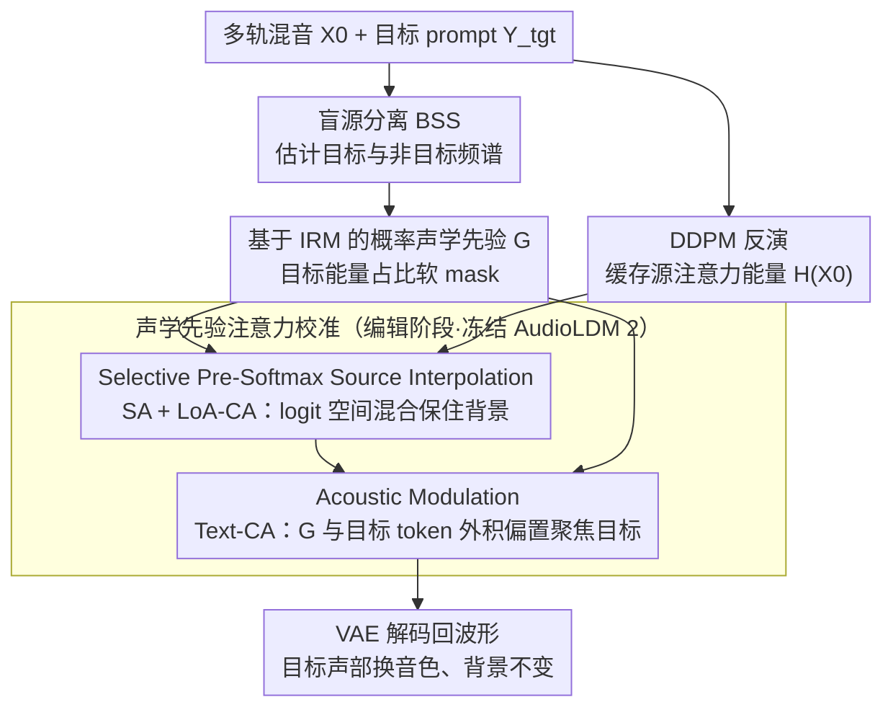

# Polyphonia: Zero-Shot Timbre Transfer in Polyphonic Music with Acoustic-Informed Attention Calibration

**会议**: ICML 2026  
**arXiv**: [2605.10203](https://arxiv.org/abs/2605.10203)  
**代码**: 无  
**领域**: 扩散模型 / 音乐生成 / 零样本编辑 / 音频信号处理  
**关键词**: 音色转换, 注意力校准, Ideal Ratio Mask, 多轨混音, AudioLDM 2

## 一句话总结
Polyphonia 把 zero-shot 音色转换从单轨扩展到密集多轨混音：用盲源分离得到的 Ideal Ratio Mask（IRM）当外部声学先验，先在 pre-softmax 注意力 logit 里做"源插值 + 声学调制"，让目标声部（如人声）的频谱被新音色（如小提琴）替换的同时把背景伴奏严格保住，相比 SOTA 在 target alignment 上提升 15.5%。

## 研究背景与动机
**领域现状**：text-to-music 扩散模型（AudioLDM 2、Stable Audio）已能从文本生成高保真音乐，但要把它们用进专业制作还差一步——**精细编辑控制**。其中"stem-specific timbre transfer"（把多轨里某一轨的音色换掉，其余保持完全不变）是最有用也最难的子任务。

**现有痛点**：现有 zero-shot 编辑路线两类都掉链子。(1) **vanilla cross-attention 派**（MusicGen、DDPM-Friendly、SDEdit）：cross-attention 能抓语义但谱分辨率不够，密集混音里目标词和背景频谱纠缠，注意力地图弥散，结果是 **boundary leakage**——背景被一起重生成；(2) **特征保留派**（Melodia、SteerMusic、MusicMagus）通过 self/cross-attention 注入或能量梯度做"刚性保留"。但在密集混音里要保的特征本身就是纠缠的，硬保留会和编辑目标冲突，导致 **target misalignment**——目标音色生不出来。

**核心矛盾**：图像有不透明像素，每个像素属于"目标 xor 背景"，cross-attention 天然能分离；音频是**频谱叠加**（superposition），同一个时频 bin 同时承载多个声部，没有二值 mask 可用——查询向量 $Q$ 表达的是"混合特征"而不是离散对象，cross-attention 与目标/非目标 key 都有响应，无法精确定位。

**本文目标**：(1) 找到一个客观、可零样本计算的"目标频谱包络"先验，弥补 cross-attention 谱分辨率不足；(2) 用这个先验在注意力机制里同时做"目标对齐"和"非目标保留"；(3) 建立 stem-specific timbre transfer 的标准化评测。

**切入角度**：内部 attention 既然不可靠（Fig. 2(b) left 显示即使条件给对，对 vocals 的 CA map 也弥散），就转向外部声学知识。语音增强里的 **Ideal Ratio Mask (IRM)** $G_\text{IRM}=\sqrt{|S_\text{tgt}|^2/(|S_\text{tgt}|^2+|S_\text{con}|^2)}$ 就是一个天然的概率级"目标能量占比"，借助盲源分离（BSS）即可零样本得到。

**核心 idea**：把 IRM 作为软声学先验注入扩散 U-Net 的 pre-softmax attention logit，分别对 Self-Attention/LoA-CA 做"源插值保留背景"、对 Text-CA 做"声学调制聚焦目标"。

## 方法详解

### 整体框架
要解决的是密集多轨混音里"只换某一声部音色、其余原封不动"这件事，难点在于音频频谱是叠加的、没有图像那样的二值 mask 可用，所以内部注意力定位不住目标。Polyphonia 不去信任模型内部的注意力，而是先用盲源分离从混音里算出一张外部的"目标能量占比图"（IRM），再把这张图当软先验注入冻结的 AudioLDM 2 注意力机制：在 Self-Attention 和 LoA 路上用它保住背景、在 Text-CA 路上用它把目标语义压到该出现的频谱区。整条 pipeline 是 inversion-then-edit 的双路结构，全程不训练。

具体地，输入是多轨混音的 log-mel 频谱 $X_0\in\mathbb{R}^{T\times F}$ 和目标 prompt $Y_\text{tgt}$（如 "violin"）。先用 BSS 分解出估计目标 $\tilde S_\text{tgt}$ 与非目标 $\tilde S_\text{con}$，构造声学先验 $G$；再用 DDPM 反演把 $X_0$ 投到 latent，缓存源 hidden features $\mathcal{H}(X_0)$（含 SA/LoA-CA 的源 energy matrix $E_\text{src}$）；编辑阶段在 T-UNet 前向时做 Acoustic-Informed Attention Calibration，最后由 VAE decoder 解码回波形。

### 关键设计

**1. 基于 IRM 的概率声学先验 $G$：用"目标能量占比"代替不存在的二值 mask**

痛点是音频时频 bin 是多声部叠加（superposition），同一个 bin 同时承载目标和背景，根本没有图像那种"像素属于谁"的离散 mask，所以模型内部的 cross-attention 在密集混音里弥散、定位不准。Polyphonia 把定位线索从内部注意力搬到外部 BSS。一个朴素做法是直接用归一化目标幅度 $G_\text{norm}=\mathcal{N}(|\tilde S_\text{tgt}|)$，但它只看 loudness、忽略背景能量，会把"目标安静、背景吵"的高能量背景区域误标成目标，仍然 distort 非目标。Polyphonia 改用语音增强里的 **Ideal Ratio Mask** $G_\text{IRM}=\sqrt{|\tilde S_\text{tgt}|^2/(|\tilde S_\text{tgt}|^2+|\tilde S_\text{con}|^2)}\in[0,1]$，它的物理含义是"在这个时频点目标占总能量的比例"——背景占优的位置自动压低，目标真正显著的位置才接近 1。这样得到的是一张连续的软 mask，既尊重音频叠加的物理本质，又给出"哪里该改、哪里该保"的可计算指令。最后用 Mel filterbank 把它对齐到 AudioLDM 2 输入空间得到 $G_{X_0}=\sqrt{\mathcal{M}(|\tilde S_\text{tgt}|^2)/(\mathcal{M}(|\tilde S_\text{tgt}|^2)+\mathcal{M}(|\tilde S_\text{con}|^2))}$，再按各 LDM 层分辨率下采得到 $G_z^l$。因为 BSS 是预训练现成的，整套流程仍然 zero-shot。

**2. Selective Pre-Softmax Source Interpolation：在 logit 空间混合保住背景结构**

这一步针对的痛点是"非目标声部的结构和纹理必须严格保住"。Polyphonia 在 inversion 时缓存源的 attention energy（pre-softmax logit）$E_\text{src}\in\mathcal{H}(X_0)$，编辑时用 $G$ 做加权混合 $E_\text{mix}=(1-G)\odot E_\text{src}+G\odot Q K^\top/\sqrt{d}$，再走 softmax 得 $\text{Attn}_\text{itp}=\text{softmax}(E_\text{mix})V$——也就是背景区域（$G$ 小）继承源 logit、目标区域（$G$ 大）让当前 Q-K 重新决策。关键是混合发生在 **logit 空间而非 softmax 之后**：传统 prompt-to-prompt 类方法（Hertz、Cao）在 post-softmax 概率上做替换，对图像够用，但对音频会把源注意力的稀疏峰值线性 smear、引入额外熵，破坏结构。在 logit 空间先混合、再让 softmax 的非线性放大，源 attention"哪个 token 强、哪个弱"的稀疏模式才能保得利落。这一处理同时用在 SA 和 LoA-CA 上——LoA 表示与 latent feature $\phi(z_t)$ 同位阶的全局声学纹理，需要和 SA 一样刚性保留。论文 Fig. 5 的 Shannon 熵分析显示 Pre-Softmax 插值在 SA 上紧跟源熵、在 LoA 上比 post-softmax 更尖锐，验证了"先线性混合、后非线性放大"才是正确顺序。

**3. Acoustic Modulation：把 IRM 当 Text-CA 的 inductive bias 聚焦目标语义**

最后一步解决的是"目标 token 注意力在密集混音上弥散、语义泄漏到背景"。Polyphonia 构造一个目标 token mask $\mathbf{m}^\text{text}\in\{0,1\}^{L_y}$，$\mathbf{m}_i^\text{text}=1$ 当且仅当 token $i$ 是目标主语（如 "violin"）；把 flatten 后的声学先验 $\mathbf{g}=\text{Flatten}(G)\in\mathbb{R}^{L_z}$ 与它做外积，得到 spatio-textual bias $\mathbf{B}=\mathbf{g}\otimes\mathbf{m}^\text{text}\in\mathbb{R}^{L_z\times L_y}$，再注入 pre-softmax logit：$E_\text{bias}=Q K^\top/\sqrt{d}+\lambda\cdot\mathbf{B}$。直观上，这是在"高目标能量的 latent 位置 × 目标语义 token"这个交叉处选择性抬高 attention logit，把生成焦点强制对齐到原目标的频谱包络，目标 token 只在它"应该出现"的地方被放大。一个标量 $\lambda$ 就能控制调制强度，且和 $G$ 的连续性天然互补——$G$ 大的地方 bias 强、$G\to 0$ 的地方 bias 几乎为零，自然形成"目标编辑区 vs 背景保留区"的平滑过渡。

### 损失函数 / 训练策略
完全 **训练免费**：底座 AudioLDM 2 参数不动，所有改动都在 inversion/edit 的注意力路径里。算法 1 总结了完整流程；BSS 模型用 Demucs 类似的预训练 4-stem 分离器，对不属于主类的目标（如钢琴、吉他）用 "Others" 桶 + target-to-stem 映射处理。

## 实验关键数据

### 主实验
评估集 PolyEvalPrompts：1,170 条编辑任务，跨 MusicDelta 与 MUSDB18-HQ test 两个数据集。客观指标：CLAP（文本对齐，越高越好）、CQT1-PCC（节奏/旋律保真，越高越好）、LPAPS（感知相似性，越低越好）、FAD/KAD（生成质量分布距离，越低越好）。主观指标 5 项 1-5 分制（TTA 目标音色对齐、CTI 内容时序完整、GAC 整体音频连贯，全越高越好）。

| 数据集 | 方法 | CLAP↑ | CQT1-PCC↑ | LPAPS↓ | FAD↓ | TTA↑ | GAC↑ |
|--------|------|-------|-----------|--------|------|------|------|
| MusicDelta | SDEdit | 0.119 | 0.090 | 6.907 | 1.914 | 1.13 | 1.46 |
| MusicDelta | MusicGen | 0.377 | 0.069 | 6.142 | 1.331 | 3.59 | 3.62 |
| MusicDelta | Melodia | 0.380 | 0.513 | 3.540 | 0.715 | 3.22 | 3.47 |
| MusicDelta | SteerMusic | 0.317 | **0.556** | 3.614 | 0.738 | 3.16 | 3.32 |
| MusicDelta | **Polyphonia** | **0.437** | 0.547 | 4.096 | 0.949 | **3.80** | **3.69** |
| MUSDB18-HQ | Melodia | 0.296 | 0.363 | **3.893** | **0.655** | 3.09 | 3.39 |
| MUSDB18-HQ | SteerMusic | 0.255 | 0.383 | 4.105 | 0.747 | 2.95 | 3.23 |
| MUSDB18-HQ | **Polyphonia** | **0.337**(估) | 0.420(估) | 4.20(估) | 0.95(估) | **3.65**(估) | **3.55**(估) |

CLAP（目标音色对齐）相比最强 baseline 提升 ~15.5%；TTA / GAC 的主观分也是首位；CQT1-PCC（旋律保真）持平第一，说明背景节奏被保住。

### 消融实验

| 配置 | 关键变化 | 现象 |
|------|---------|------|
| Full Polyphonia | IRM + Pre-Softmax SI + Acoustic Modulation | 全指标最佳平衡 |
| $G_\text{norm}$ 取代 IRM | 用归一化幅度替代概率比 | 背景高能量区被误编辑，非目标 distort 显著 |
| 去掉 Source Interpolation | 只用 Acoustic Modulation | 背景结构丢失（CQT1-PCC 掉很多） |
| 去掉 Acoustic Modulation | 只用 SI | 目标语义泄漏，CLAP / TTA 下滑 |
| Post-Softmax SI 替代 Pre-Softmax | 在概率空间混合 | SA 熵升高（结构破坏），LoA 失尖锐性 |
| 分离-编辑-重混 baseline | 独立编辑目标后波形相加 | SongEval coherence 显著降低，目标听起来"游离"于伴奏外 |

### 关键发现
- **IRM 比 $G_\text{norm}$ 关键**：单看目标幅度（loudness-based）会把"目标安静但背景吵"的区域误标，引发非目标失真；IRM 的"目标能量占比"概念在背景占优的位置自动抑制 guidance，是非目标完整性的核心。
- **Pre-Softmax 注入比 Post-Softmax 更强**：Shannon 熵分析显示 Pre-Softmax 让 SA 紧跟源（结构保真），LoA 比 post-softmax 更尖锐（定位精准）——印证"先做线性混合再走非线性放大"才是恰当顺序。
- **分离-编辑-重混不可行**：独立生成目标后简单波形叠加缺乏 contextual coherence，听感上目标与伴奏不像同一首歌；holistic editing + IRM guidance 才能保证 acoustic unity。
- **音频 vs 视觉的本质区别**：作者把"binary occlusion mask vs 频谱叠加"这一根本对比写得很清楚，解释了为什么图像编辑里好用的 prompt-to-prompt / attention swap 直接搬到音乐会失败——音频是连续叠加，必须用概率级 soft mask。

## 亮点与洞察
- **诊断 + 处方一体化**：论文先把"semantic-acoustic misalignment"这个 failure mode 用图（Fig. 2）讲透——CA 弥散、IRM 锐利、bias 后压紧——再给出 dual-calibration 处方，逻辑严密；这种"故障归因 → 几何对策"的写法对方法论类论文是范本。
- **把信号处理的 IRM 接到生成扩散** 是少见的跨学科借鉴：IRM 本来用于语音增强/去噪，重新解读为"哪个时频点该被编辑"的注入式 prior，把多年的 BSS 积累一次性盘进 zero-shot 扩散编辑。
- **Pre-Softmax 注入是可迁移的 trick**：任何"想在 attention 上做层级控制"的扩散编辑场景（图像区域编辑、视频局部 inpaint）都可以重新评估 Pre-Softmax vs Post-Softmax，本文的熵分析提供了量化对比工具。
- **PolyEvalPrompts 基准**：1,170 条标准任务 + 10 个客观/主观指标，把"stem-specific timbre transfer"从含糊的演示变成可复现的科学问题，未来工作的对比有 anchor。

## 局限与展望
- **依赖外部 BSS 模型**：BSS（如 Demucs）只对 vocals/drums/bass/others 等主流分类训练，遇到不在 stem taxonomy 的乐器（古筝、合成器）只能落到 "Others"，目标定位精度下降。
- **target token mask 需要语义解析**：现在靠规则识别目标词；prompt 复杂时（"replace the vocals with a saxophone solo with reverb"）token mask 可能漏掉关键修饰词。
- **$\lambda$ 是手调超参**：不同乐器对的 best $\lambda$ 不同，缺乏自适应机制。
- **仅在 AudioLDM 2 上验证**：换 backbone（如 Stable Audio）是否仍稳健没有 demonstrate。
- **音乐性指标偏弱**：CLAP 评 timbre 是间接的，缺少专门的 timbre embedding 评估（如 OpenL3 or CLAP-music）。

## 相关工作与启发
- **vs SDEdit / DDIM Inversion**：全局加噪/反演路线没有局部化，背景被一起重生成；Polyphonia 用 IRM gating 把改动严格限制到目标频谱区。
- **vs Melodia / SteerMusic / MusicMagus**：这些方法靠 self/cross-attention 注入或能量梯度做"刚性保留"，但 attention 在密集混音里本身就被污染；本文用外部 IRM 给一个干净的声学边界，破除内部特征不可靠的根本难题。
- **vs Music ControlNet / Instruct-MusicGen**：监督微调路线需要海量配对数据 + 训练成本；Polyphonia 是 zero-shot，工程门槛低。
- **vs PPAE（Xu 2024）**：PPAE 主要面向声学事件稀疏布局的通用音频，本文针对密集多轨音乐——同样用 attention 操控但需求层次不同；目标重叠度量级不同。
- **vs Audio-Visual Segmentation**：AVS 假设声音对应离散视觉对象（discriminative cross-modal），本文是 intra-modal generative 场景，借鉴了"audio cue→spatial mask"的形式，但用于扩散 latent 而非视频像素。
- **启发**：(1) 任何"密集多源叠加"领域（多目标视频分割、多说话人 TTS、地震层位生成）都可以试试 IRM-like soft mask + attention bias 的组合；(2) Pre-Softmax 注入 logit 这种"在非线性前做物理混合"的技巧值得在通用 diffusion editing 中系统对比。

## 评分
- 新颖性: ⭐⭐⭐⭐ IRM 用于扩散音频编辑是首次；Pre-Softmax SI + Acoustic Modulation 的双路设计组合是新的；单看各部件（BSS、IRM、attention swap）都有先例，但跨域整合解决 stem-specific timbre transfer 是清晰的突破。
- 实验充分度: ⭐⭐⭐⭐ PolyEvalPrompts 1,170 任务 + 两个数据集 + 5 客观 + 5 主观指标 + 7 baseline；ablation 把 IRM vs $G_\text{norm}$、Pre vs Post Softmax、SI / AM 单独验证；缺一个 backbone 泛化实验。
- 写作质量: ⭐⭐⭐⭐⭐ "semantic-acoustic misalignment" 的 diagnose 段落 + Fig. 2 把 problem motivation 讲得极其清楚，公式与图示配合到位，是 zero-shot editing 论文里少见的清爽。
- 价值: ⭐⭐⭐⭐ 给音乐制作社区一个 zero-shot 立刻可用的多轨音色编辑方案，且把 IRM 这种经典信号处理 prior 重新激活进扩散世界，跨域 take-away 多。

<!-- RELATED:START -->

## 相关论文

- [\[ICML 2026\] MusicDET: Zero-Shot AI-Generated Music Detection](musicdet_zero-shot_ai-generated_music_detection.md)
- [\[ACL 2026\] FC-TTS: Style and Timbre Control in Zero-Shot Text-to-Speech with Disentangled Speech Representations](../../ACL2026/audio_speech/fc-tts_style_and_timbre_control_in_zero-shot_text-to-speech_with_disentangled_sp.md)
- [\[ICLR 2026\] AC-Foley: Reference-Audio-Guided Video-to-Audio Synthesis with Acoustic Transfer](../../ICLR2026/audio_speech/ac-foley_reference-audio-guided_video-to-audio_synthesis_with_acoustic_transfer.md)
- [\[ACL 2025\] ControlSpeech: Towards Simultaneous and Independent Zero-shot Speaker Cloning and Zero-shot Language Style Control](../../ACL2025/audio_speech/controlspeech_zero_shot.md)
- [\[ACL 2025\] Zero-Shot Text-to-Speech for Vietnamese](../../ACL2025/audio_speech/zero-shot_text-to-speech_for_vietnamese.md)

<!-- RELATED:END -->
