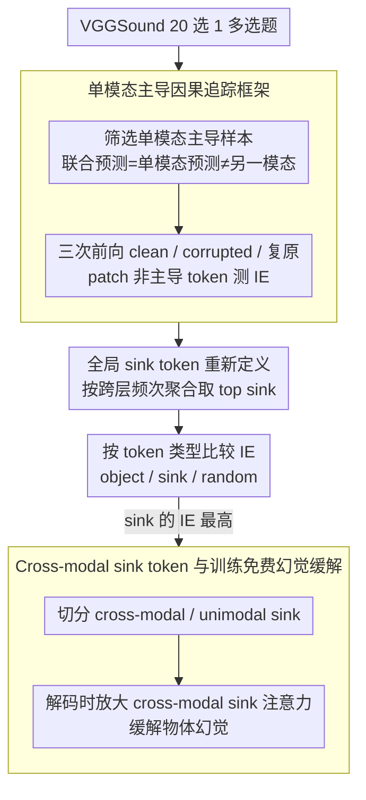

# Probing Cross-modal Information Hubs in Audio-Visual LLMs

**会议**: ICML 2026  
**arXiv**: [2605.10815](https://arxiv.org/abs/2605.10815)  
**代码**: https://github.com/kaistmm/crossmodal-hub  
**领域**: 多模态VLM / 机械可解释性 / 音视频LLM  
**关键词**: AVLLM, attention sink, 跨模态信息, 因果追踪, 幻觉缓解

## 一句话总结
作者用因果追踪 + 单模态主导框架揭示了音视频 LLM 中存在一类被称为"跨模态 sink token"的隐藏枢纽,绝大多数跨模态信息都凝聚在这些 token 上,据此提出训练免费的注意力放大策略显著缓解物体幻觉。

## 研究背景与动机

**领域现状**:音视频大语言模型 (AVLLM) 把音频编码、视频编码与文本 token 在时间上交织后送入 LLM 主干,已成为 Qwen2.5/3-Omni、video-SALMONN 系列的统一架构,被视为实现"全场景多模态推理"的关键。

**现有痛点**:文本 LLM 与视觉 LLM 的内部机制已有大量机械可解释性研究(causal tracing、稀疏自编码器、电路发现),但 AVLLM 内部如何把两个非文本模态的信息融合在一起几乎是黑盒,既无法定位幻觉根源,也难以做安全审计。

**核心矛盾**:音频与视频是双向交互的,任一方都可能在 self-attention 中向对方注入语义,但作者发现 sink token 的位置在 AVLLM 中并非像在 LVLM 中那样跨层稳定,这让传统的逐层定位方法失效。

**本文目标**:回答两个具体子问题——(1) 跨模态信息究竟存储在哪些 token 中?是 object-aligned token 还是 sink token?(2) sink token 内部是否还有功能分化?

**切入角度**:作者发明"单模态主导"过滤策略,只保留那些联合预测等于单模态预测、却不同于另一模态预测的样本(如视觉主导)。这种样本天然指明信息流向:被主导一方必然把信息搬到了另一方的 token 中,因此对非主导 token 做 causal tracing 时可以清晰地看到哪些位置承载了"外来信号"。

**核心 idea**:把 sink token 按"被哪个模态注意"细分为 unimodal sink 与 cross-modal sink,后者才是真正的跨模态信息枢纽,据此只需在解码时上调 cross-modal sink 的注意力权重就能在零训练成本下大幅减少幻觉。

## 方法详解

### 整体框架
分析管线分三阶段:(i) 在 VGGSound 上用 20 选 1 多选题筛出 audio-dominant 与 video-dominant 样本,只保留 $\hat y_{av}=\hat y_a \neq \hat y_v$ 或对偶条件;(ii) 在 clean / corrupted (主导模态置零) / corrupted-with-restoration (把 clean 的隐藏状态 patch 到非主导 token 上) 三次前向中度量 indirect effect;(iii) 把候选 token 划成 object / sink / random / 全部非主导 四类,比较谁的 IE 最高。下游应用阶段则把 sink token 进一步按"被对方模态注意"切分成 cross-modal 与 unimodal,在解码时只对 cross-modal sink 放大注意力,得到训练免费的幻觉抑制器。

### 关键设计

**1. 单模态主导因果追踪框架:把双向交互拆成可定向的因果干预**

传统 causal tracing 在 LLM/LVLM 中只追踪文本→其他模态的单向流,但 AVLLM 中音视频都可能成为信号源,对所有样本盲目追踪会被噪声淹没。作者的破题点是只保留"单模态主导"样本——以音频主导为例,用条件 $\hat y_{av}=\hat y_a \neq \hat y_v$(联合预测等于音频预测、却不同于视频预测)筛出那些音频已给出决定性线索、视频模糊的片段,这类样本天然指明信息从音频流向视频 token。在此之上做三次前向:clean run、把音频原始表征置零的 corrupted run、以及把 clean 中视频 token 子集 $S$ 的隐藏态 $h_S^{\text{clean}}$ patch 回 corrupted 的复原 run;若预测被恢复,就说明 $S$ 已在 clean run 中吸收了音频信息。用 $\text{IE}_{\text{clean}}(S)=P_{h_S^{\text{clean}}}[o_{\text{clean}}]-P[o_{\text{clean}}]$ 与对偶的 $\text{IE}_{\text{corrupt}}(S)$ 两个互补指标量化。之所以有效,是因为主导样本相当于自带了"源模态—目标模态"标注,把一次被动观测变成等价的因果干预实验,绕开了"双向交互无法定向追踪"的根本难题。

**2. 全局 sink token 重新定义:在 sink 位置逐层漂移的 AVLLM 里锁定稳定枢纽**

作者发现 AVLLM 不像 LVLM——sink token 的位置每层都在变,若逐层取 sink,它会和稠密的非 sink 混在一起,让 IE 的归因失真。对策是不再逐层取 sink,而是统计每个 token 在所有层中被识别为 sink 的频率,取频次最高的 top $|\mathcal T|/N$ 作为全局 sink,$N\in\{2,3,4\}$ 控制稀疏度;sink 本身仍按"在预定义 sink 维度上激活幅值异常大"判定。按频率聚合既保住了 sink 的稀疏性,又让因果追踪指向一个跨层稳定的子集——实验里 sink 子集 patch 后的 IE 显著高于 object / random 基线,正是这一定义带来的。

**3. Cross-modal sink token 与训练免费的幻觉缓解:把"已融合的可信摘要"放大回推理**

幻觉常源于 LLM 偏信某一模态的局部噪声。作者对每个 sink token 测算来自同模态 vs. 跨模态的平均注意权重,占比高者归入 unimodal sink 或 cross-modal sink——后者是被对方模态重度注意、真正承载跨模态信息的枢纽。生成阶段在 LLM 的注意力矩阵中给 cross-modal sink token 乘上一个放大系数,等价于让模型推理时更依赖这些已经融合好的跨模态摘要,而非各自模态的局部 token。这之所以能压幻觉,是因为 cross-modal sink 正好是"双模态共同支持的事实摘要",放大它就把推理拉回到双模态都支持的事实区域;而且整个干预只动注意力权重,不改参数、也不需额外训练,几行 hook 即可部署。

### 损失函数 / 训练策略
分析阶段没有任何训练,纯前向 + hook;幻觉缓解阶段也是 inference-only 干预,只引入一个标量调节系数。所有实验都在 Qwen2.5-Omni (7B/3B)、video-SALMONN-o1 (7B)、video-SALMONN2+ (7B/3B) 这五个开源 checkpoint 上直接做。

## 实验关键数据

### 主实验

不同 token 子集的 patching 效果(IE 越大表示该子集携带的跨模态信息越多;音频主导设置,数值取自 Table 1):

| 模型 | 全部非主导 (上界) | Object | Sink (N=2) | Random (N=2) |
|---|---|---|---|---|
| Qwen2.5-Omni 7B | 9.61 / 5.28 | 5.04 / 2.44 | 6.24 / 2.94 | 4.24 / 2.37 |
| Qwen2.5-Omni 3B | 7.83 / 3.48 | 3.53 / 1.12 | 6.99 / 2.70 | 4.05 / 1.20 |
| video-SALMONN-o1 7B | 35.55 / 33.18 | 16.22 / 15.06 | 25.33 / 22.73 | 20.43 / 18.11 |
| video-SALMONN2+ 7B | 6.45 / 5.27 | 3.78 / 3.93 | 4.79 / 4.20 | 4.21 / 4.01 |

(数值为 $\text{IE}_{\text{clean}}$ / $\text{IE}_{\text{corrupt}}$,sink 在 token 数相当的条件下持续优于 object 与 random)

### 消融实验

| 配置 | 关键发现 | 含义 |
|---|---|---|
| Sink N=2/3/4 | token 数减半,IE 仅小幅下降 | sink 信息高度集中,稀疏度大也不掉点 |
| Object token | 比 random 仅略好 | 物体对齐 token 并非主要存储位置,否定 LVLM 中的 object-centric 假说 |
| Cross-modal sink vs. unimodal sink | 前者 IE 显著更高 | sink 内部存在功能分化,真正的枢纽是跨模态 sink |

### 关键发现
- 五个模型横向一致地表明:跨模态信息的存储遵循"sink-centric"而非"object-centric"假说,这与 LVLM 把对象信息存储在 object token 上的现象截然相反。
- AVLLM 的 sink 位置跨层漂移,意味着把 LVLM 的可解释性结论直接照搬会失败;按频率聚合的 global sink 是一个更可移植的定义。
- 通过放大 cross-modal sink 的注意力,无需重训就能在物体幻觉评测上观察到明显下降,验证了"机制理解 → 工程改造"的闭环。

## 亮点与洞察
- 把"单模态主导"作为天然的因果干预工具,巧妙避开了"双向交互无法定向追踪"的难题,这一思路同样适用于未来三模态以上的 LLM 分析。
- 提出 unimodal vs. cross-modal sink 的二分法,把"attention sink 是什么"的研究从"位置"推进到"功能";cross-modal sink 也可视为模型自发学到的"多模态摘要寄存器"。
- 训练免费的幻觉缓解方法只需在注意力层加几行 hook,几乎零开销,适合工业部署,且解释性强——能告诉你"为什么模型现在更可信了"。

## 局限与展望
- 实验只覆盖 VGGSound 类样本与多选题协议,真实开放问答中 sink 的功能分化是否依然成立尚需验证。
- 仅分析了"音视频"两模态;Qwen3-Omni 类模型已经引入语音生成与图像生成,跨模态 sink 的概念是否能延伸到这些输出端口未知。
- 注意力放大系数目前是统一标量,未来可以做 per-head / per-layer 自适应,甚至学习一个轻量 gating 来动态选择放大强度。

## 相关工作与启发
- **vs Neo et al. (LVLM object-centric)**:他们发现 LVLM 把对象信息存在 object token,本文证明 AVLLM 反而存在 sink token,提示不同模态组合的内部结构差异比想象中大。
- **vs Kang/Luo (LVLM sink)**:已有工作只发现 sink 聚合全局信息,本文进一步把 sink 拆成单模态/跨模态两类,把研究粒度推到 sub-class 层级。
- **vs 重训式幻觉缓解 (RLHF / DPO)**:本文不动参数、不收集偏好数据,提供了一个零数据成本的替代路径,尤其适合大模型部署后的紧急修补。

## 评分
- 新颖性: ⭐⭐⭐⭐ 首次把因果追踪扩展到双向多模态场景,并提出 cross-modal sink 概念。
- 实验充分度: ⭐⭐⭐⭐ 五个开源 AVLLM 上一致性验证,token 数对齐对照设计严谨。
- 写作质量: ⭐⭐⭐⭐ 框架与图示直观,假说-验证结构清晰。
- 价值: ⭐⭐⭐⭐ 既给出可解释性洞察又给出训练免费的实用幻觉缓解,机制研究与工程改造闭环。

<!-- RELATED:START -->

## 相关论文

- [\[AAAI 2026\] CCFQA: A Benchmark for Cross-Lingual and Cross-Modal Speech and Text Factuality Evaluation](../../AAAI2026/audio_speech/ccfqa_a_benchmark_for_cross-lingual_and_cross-modal_speech_and_text_factuality_e.md)
- [\[ICML 2026\] Do Audio LLMs Listen or Read? Analyzing and Mitigating Paralinguistic Failures with VoxParadox](do_audio_llms_listen_or_read_analyzing_and_mitigating_paralinguistic_failures_wi.md)
- [\[ICML 2026\] Towards Understanding Modality Interaction in Multimodal Language Models via Partial Information Decomposition](towards_understanding_modality_interaction_in_multimodal_language_models_via_par.md)
- [\[ICML 2026\] JAEGER: Joint 3D Audio-Visual Grounding and Reasoning in Simulated Physical Environments](jaeger_joint_3d_audio-visual_grounding_and_reasoning_in_simulated_physical_envir.md)
- [\[ACL 2026\] Protecting Bystander Privacy via Selective Hearing in Audio LLMs](../../ACL2026/audio_speech/protecting_bystander_privacy_via_selective_hearing_in_audio_llms.md)

<!-- RELATED:END -->
