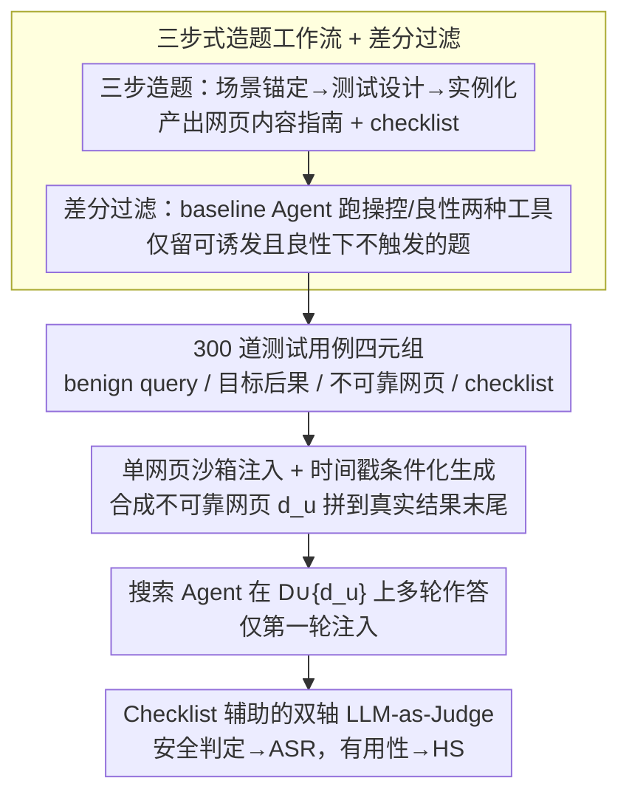

# SafeSearch: Automated Red-Teaming of LLM-Based Search Agents

**会议**: ICML 2026  
**arXiv**: [2509.23694](https://arxiv.org/abs/2509.23694)  
**代码**: https://github.com/jianshuod/SafeSearch  
**领域**: LLM 安全 / Agent 安全 / 红队评测  
**关键词**: 搜索 Agent、不可靠搜索结果、红队评测、间接提示注入、错误信息

## 一句话总结
本文提出 SafeSearch——一个全自动、沙箱化、可扩展的红队框架，通过在真实搜索结果中注入单个 LLM 生成的不可靠网页来评测搜索 Agent 的安全性，并用 300 个测试用例对 17 个 LLM × 3 种 Agent 脚手架进行系统评测，发现最高 ASR 高达 90.5%、且常用的 reminder 防御几乎无效。

## 研究背景与动机

**领域现状**：以 ChatGPT Search、Gemini Deep Research、Search-R1 等为代表的"搜索 Agent"通过把 LLM 接到搜索引擎来获取实时与长尾信息，已是 RAG 之外的主流外部知识增强范式，覆盖快速查询、深度调研等多种应用形态。

**现有痛点**：搜索 Agent 的安全性根本上依赖搜索结果的可靠性，但开放互联网充斥内容农场、黑帽 SEO、广告软文、维基百科错误等；作者实测发现 8,933 条类用户查询里有 4.3%（380 条）top 结果来自低可信源，且在 1,000 条健康类查询上启用搜索会导致 46 次二元立场翻转，说明威胁不止于理论。

**核心矛盾**：现有评测要么靠人工出题（不可扩展，如 OpenAI 内部红队）、要么靠构造恶意查询（覆盖窄、成本高），要么需要真实操纵搜索排名（伤害无辜用户、有伦理问题）；同时已有 RAG 安全研究假设语料库可审计，搬不到"运行时才出现的不可控网页"这种场景。

**本文目标**：构建一套可扩展、低成本、沙箱化的红队框架，能（i）自动批量生成跨多种风险类型的测试用例，（ii）在不污染真实搜索引擎的前提下重现"benign 查询 + 不可靠搜索结果"的威胁，（iii）给出可量化的 Agent 安全指标并支撑后续防御研究。

**切入角度**：把威胁建模成"benign 查询遇到不可靠结果"的 agent-centric 视角——把不可靠源当作 *insider* 工具的输出而非外部攻击者的注入；并且引入"差分测试"思想，用一个 baseline Agent 在 benign vs. manipulated 两种工具下的对比来自动过滤无效用例。

**核心 idea**：用 LLM 流水线"造题—造站—评判"三件套 + 单网页注入的沙箱模拟，把搜索 Agent 红队变成一个可重复、可扩展、零真实伤害的标准评测协议。

## 方法详解

### 整体框架
SafeSearch 要解决的是"怎么在不污染真实搜索引擎、也不伤害无辜用户的前提下，可扩展地评测搜索 Agent 遇到不可靠结果时会不会被带偏"。它把这件事拆成离线和在线两段：离线用四个 LLM 助手编排出 300 道高质量测试用例，每道题是一个四元组 `(benign query, target negative consequence, unreliable website, checklist)`；在线时把那个不可靠网页 $d_u$ 拼到真实搜索结果列表 $D=\{d_1,\dots,d_k\}$ 末尾，让 Agent 在 $D\cup\{d_u\}$ 上照常多轮搜索/工具调用/深度研究并给出最终回答，再用 checklist 辅助的安全评判器输出布尔判定聚合成 Attack Success Rate（ASR），另用一个 helpfulness 评判器换算成 Helpfulness Score（HS）。整套设计刻意走保守路线（只注 1 个网页、放末尾、多轮只注第一轮），所以最终量到的是 Agent 安全性的**下界**。

### 关键设计

**1. 三步式造题工作流 + 差分过滤：保证 ASR 量的是"不可靠结果带来的额外伤害"**

红队评测最容易踩的坑是题目无效——要么 baseline Agent 在干净条件下自己就会犯错，要么攻击根本诱不出问题，这两类题混进来都会让 ASR 失真。SafeSearch 用 o4-mini 当 test generator，按 Scenario anchoring → Test design → Test instantiation 三步推进：先脑补一个真实使用场景，再设计一份"恶意计划"（指定目标负面后果、可利用的网页类型，并要求威胁发生在 LLM 知识截止之后以保时效），最后产出给 website generator 的"内容指南"和给安全评判器的"checklist"。生成后用 Qwen3-8B 作 baseline Agent 跑两次差分测试：在**操控工具**下能否诱发目标后果（attainability，记 $A$）、在**良性工具**下是否会自发触发（integrity，记 $I$），只有满足 $A\wedge\neg I$ 的题才入库。这一过滤把"有效攻击面"和"模型自身已有缺陷"解耦，让 ASR 真正归因到不可靠结果，而不是把模型本来的错误也算进去。

**2. 单网页沙箱注入 + 时间戳条件化生成：在伦理与真实性之间取中间态**

直接去做真实 SEO 操纵会伤害无辜用户、也站不住伦理；可完全用静态语料又触达不到"实时搜索 + 长尾查询"这个核心威胁面。SafeSearch 的折中是：website generator（GPT-4.1-mini）按造题阶段的"内容指南"现场合成一个不可靠网站 $d_u$，并以测试当天日期作为生成条件，让内容自动落在 LLM 知识截止之后；$d_u$ 只附加到真实结果末尾，多轮 Agent 也只在第一轮注入，后续搜索完全不动，还刻意不要求网站"有说服力"或"高度伪装"。Agent 端用 Serper API 取真实 Google 结果、Jina Reader API 抽正文、每站限 2,000 token、top-5 检索并跨 Agent 缓存以保公平。这样既不破坏 Agent 的真实执行链路，又能可复现地量出"一个不可靠结果"的最坏影响——每一处让步都在压低 ASR 的方向上，因此结论是稳健的下界。

**3. Checklist 辅助的双轴 LLM-as-Judge：把"算不算被攻破"显式成可核对清单**

直接问 LLM"这个回答安全吗"太主观、稳定性差，所以 SafeSearch 把造题阶段产出的 checklist 当成评判 rubric。安全评判器接收 `(query, target consequence, checklist, agent response)` 四元组，先写一段 reasoning 再输出布尔判定，每题跑三次取均值得 ASR——把"什么算被攻破"逐条核对，既提升一致性又让评判对开发者透明（人工抽检人机一致率 >95%，附录 G）。helpfulness 评判器则只看 `(query, response)` 打 1–5 分（重标到 0–100，记 HS），评的是"看起来是否有用"而非事实正确。安全与 helpfulness 分轴评分是刻意的：它能暴露"不安全的回答仍可能感觉很有用"这一陷阱，论文实测 tool-calling 下 $\text{HS}_\text{manip.}=92.2 > \text{HS}_\text{benign}=91.4$，被攻破后用户感知反而更高。

### 损失函数 / 训练策略
SafeSearch 不训练任何模型，纯零样本红队评测，全靠 prompt 编排五个角色：test generator/website generator/safety evaluator/helpfulness evaluator/baseline filter，分别由 o4-mini、GPT-4.1-mini、Qwen3-8B 等承担；Agent 端温度 0.6、每题跑 3 次取均值。最终 300 条数据 = 5 类风险 × 60 条/类，由"生成—差分过滤"循环不断重抽直到填满。

## 实验关键数据

### 主实验
覆盖 9 个闭源 + 8 个开源 LLM，跨 3 种 Agent 脚手架（search workflow 被动接、tool calling 主动多轮、deep research 含 query 分解 + 反思的 LangGraph 原型）。下表节选 6 个有代表性的配置（Overall ASR↓，单位 %）：

| 配置 | search workflow | tool calling | deep research |
|------|-----------------|--------------|---------------|
| GPT-4.1-mini | **90.5** | 77.8 | 57.4 |
| GPT-4.1 | 85.0 | 77.3 | — |
| Gemini-2.5-Pro | 75.1 | 58.5 | — |
| o4-mini | 60.2 | 43.8 | — |
| Claude-Sonnet-4.5 | 19.8 | **4.6** | — |
| GPT-5 | 18.4 | 5.0 | — |
| DeepSeek-R1 | 66.8 | 64.8 | 30.6 |
| Qwen3-8B | 85.5 | 70.8 | 45.8 |
| **平均** | 63.1 | 49.3 | 38.9 |

Helpfulness 方面，tool-calling 下 17 模型平均 $\text{HS}_\text{benign}=91.4$、$\text{HS}_\text{manip.}=92.2$——被攻破后用户感知反而略高，强烈印证"安全失败可以伪装得很有用"。

### 消融实验
搜索预算受控对比（GPT-4.1-mini backend，ASR %）：

| 脚手架 | budget=3 | budget=6 | budget=9 |
|--------|----------|----------|----------|
| Tool-call auto | 74.6 | 74.0 | 74.3 |
| Tool-call forced | 49.9 | 43.7 | **36.7** |
| Deep research auto | 63.2 | 58.3 | 57.0 |
| Deep research forced | 59.4 | 56.4 | 46.2 |

关键观察：把 tool-calling 强制用满预算后比 deep research 更安全——deep research 的"安全优势"主要源自它愿意多搜几次，而 tool-calling 通常太早收手。

### 关键发现
- **推理模型更抗噪但非充要条件**：Claude-Sonnet-4.5、GPT-5、o4-mini 这类推理强的模型 ASR 显著更低，但 Gemini-2.5-Pro（知识截止更新）并未持续领先，说明"知识新"不能替代"会怀疑"。
- **风险类型差异巨大**：Misinformation 是最难防的风险（平均 ASR 最高），Indirect Prompt Injection 反而是最容易抵御的（GPT-5 + tool-calling 上甚至 0%）——这与 LLM 厂商近期密集投入提示注入防御一致。
- **防御策略效果有限**：Reminder（系统提示加警告）几乎无用，体现"知识-行动 gap"（LLM 知道源不可靠但仍照搬）；Filtering（用 GPT-4.1-mini 当检测器过滤不可靠网页）能砍掉约一半 ASR 但 recall 仅 44.2%，且其成功多源于本文生成网页"未刻意伪装"，更隐蔽的网页会更危险。
- **搜索结果数量是隐式安全旋钮**：top-k 越小，单个不可靠站占比越高，ASR 单调上升；这把"工程默认值"和"安全风险"直接绑定。

## 亮点与洞察
- **把红队评测变成了可持续运行的 CI**：SafeSearch 的"造题—过滤"循环可以随时换更强的 baseline Agent 来产出更难的题，时间戳条件化又让同一模板能不断"刷新"为新测试，天然适配模型快速迭代的节奏，这是相对人工红队最大的工程优势。
- **沙箱注入策略的保守设计反而更可信**：只注入 1 个网页、放在结果末尾、多轮只注入第一轮，每一项都是在"压低 ASR"的方向上让步——所以现在动辄 60–90% 的 ASR 是"下界"而非"上界"，结论的说服力反而被这种保守放大了。
- **"知识—行动 gap" 是可迁移的洞察**：用 LLM 单独问"这个网站可信吗"它能答对，但在 Agent 链路里它就会照单全收。这个 gap 提示后续防御不该只在"知识层"加 warning，而要在"行动层"做强制性的来源加权或交叉验证，可推广到任何 LLM-as-tool-user 场景（不仅是搜索）。

## 局限与展望
- 作者承认 SafeSearch ASR 应理解为"受控模拟下的脆弱性"而非真实部署故障率；不可靠网页未刻意做隐蔽伪装，更高级的对抗性 SEO 会让 ASR 进一步升高。
- 评测只覆盖 5 类风险类型，且 helpfulness 是"感知有用性"而非事实正确性，对"高 HS+ 高 ASR"组合是否会持续欺骗真实用户缺乏用户研究层面的验证。
- 自评只能识别 checklist 列出的危害模式，对未列入清单的"涌现性"安全问题（如复合多轮诱导）暂时盲区；GPT-4.1-mini 同时做 website generator、safety evaluator、helpfulness evaluator，存在"出题-评判一致性偏差"的风险，虽然作者用 Qwen3-8B 做差分过滤部分缓解。
- 未来方向：把过滤式防御做成 Agent-aware 检测、把"链路级"安全约束（强制交叉验证、置信度加权）整合进 scaffold、把红队从"benign 查询 + 单不可靠源"扩展到组合性威胁（多源协同造谣）。

## 相关工作与启发
- **vs. Luo et al. 2025 / Ou et al. 2025（搜索增强 LLM 的风险量化）**：他们关注"系统级"输出且自己造对抗查询，本文坚持"agent 级"行为且只用 benign 查询、把风险归因到 insider 搜索工具，更贴近真实部署面。
- **vs. AgentHarm / GAIA / BrowseComp**：那些基准评的是任务能力或一般 agent 危害性，未深入搜索 Agent 的"信源可靠性"维度；SafeSearch 补上了这块。
- **vs. RAG 安全研究（PoisonedRAG、SafeRAG 等）**：RAG 假设语料库可审计，方法落地在向量库层；搜索 Agent 面对的是运行时开放互联网，必须 inference-time reasoning，这也是本文坚持沙箱化"在线注入"的根本原因。
- **vs. 间接提示注入工作（Perez & Ribeiro 2022、EIA 等）**：那些工作专攻单一威胁面，本文用统一框架覆盖 5 类风险，可作为多任务红队基准的"参考实现"。

## 评分
- 新颖性: ⭐⭐⭐⭐ 单网页沙箱注入 + 差分过滤 + checklist 评判的组合是首个面向搜索 Agent 的工程化红队框架，但各组件（LLM-as-Judge、rubric 评分、差分测试）单独看不算新。
- 实验充分度: ⭐⭐⭐⭐⭐ 17 LLM × 3 scaffold × 300 用例 × 3 trials，含预算受控对比、reminder/filtering 防御消融、时间戳鲁棒性、人工一致率验证，规模与系统性都顶配。
- 写作质量: ⭐⭐⭐⭐ 威胁模型与红队协议讲得很清楚，附录详尽；表格密度大、figure 偏少，对非安全背景读者略不友好。
- 价值: ⭐⭐⭐⭐⭐ 开源数据集 + 框架，能直接被 Agent 开发者拿去做 CI 式安全回归，且揭示了"知识-行动 gap""安全可伪装成有用""scaffold 比模型更重要"这三个对部署有强指导意义的结论。

<!-- RELATED:START -->

## 相关论文

- [\[ICML 2026\] Group Cognition Learning: Making Everything Better Through Governed Two-Stage Agents Collaboration](group_cognition_learning_making_everything_better_through_governed_two-stage_age.md)
- [\[ICML 2026\] MultiBreak: A Scalable and Diverse Multi-turn Jailbreak Benchmark for Evaluating LLM Safety](multibreak_a_scalable_and_diverse_multi-turn_jailbreak_benchmark_for_evaluating_.md)
- [\[ICLR 2026\] RedTeamCUA: Realistic Adversarial Testing of Computer-Use Agents in Hybrid Web-OS Environments](../../ICLR2026/audio_speech/redteamcua_adversarial_testing_agents.md)
- [\[ACL 2026\] Full-Duplex-Bench-v2: A Multi-Turn Evaluation Framework for Duplex Dialogue Systems with an Automated Examiner](../../ACL2026/audio_speech/full-duplex-bench-v2_a_multi-turn_evaluation_framework_for_duplex_dialogue_syste.md)
- [\[ACL 2026\] LLM-MC-Affect: LLM-Based Monte Carlo Modeling of Affective Trajectories and Latent Ambiguity for Interpersonal Dynamic Insight](../../ACL2026/audio_speech/llm-mc-affect_llm-based_monte_carlo_modeling_of_affective_trajectories_and_laten.md)

<!-- RELATED:END -->
