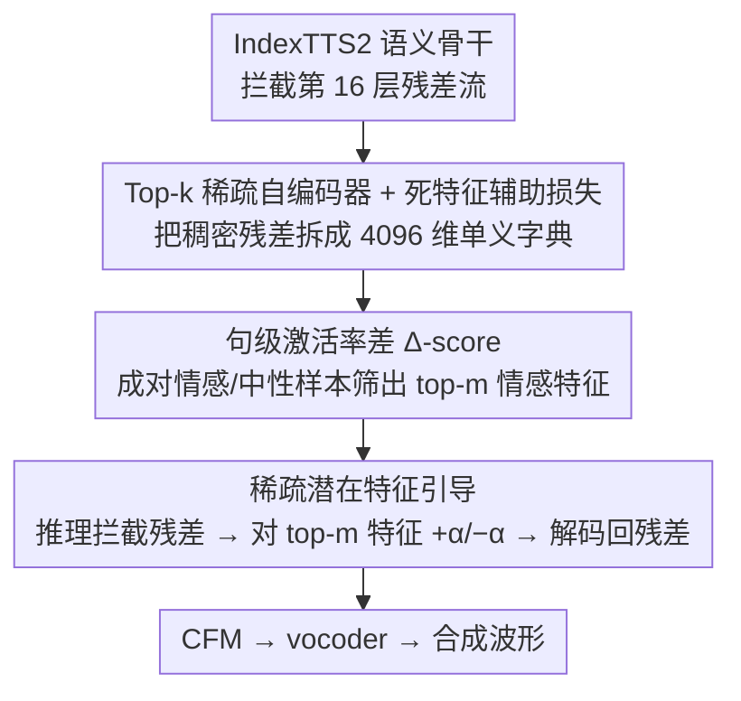

# Sparse Autoencoders for Interpretable Emotion Control in Text-to-Speech

**会议**: ICML 2026  
**arXiv**: [2606.01479](https://arxiv.org/abs/2606.01479)  
**代码**: 有 (GitHub-Demo 链接)  
**领域**: 音频/语音 (TTS 可控生成 + 可解释性)  
**关键词**: 稀疏自编码器, 情感可控 TTS, 激活引导, 语义骨干, 可解释性

## 一句话总结
作者在 LLM-based TTS（IndexTTS2）的语义骨干残差流上训练 Top-k 稀疏自编码器（SAE），用"句级激活率差"挑出少量与目标情感强相关的稀疏潜在特征，推理时只对这几个特征做加/减干预，就能在不动主干参数的前提下实现可解释的双向情感诱导与抑制，效果优于全局均值差引导和现有 TTS 基线。

## 研究背景与动机
**领域现状**：LLM-based TTS（CosyVoice、Spark-TTS、IndexTTS2 等）通过把大语言模型嵌进生成管线，已能合成相当自然且富表现力的语音；情感可控性成为面向有声书、HCI 等应用的关键能力。

**现有痛点**：现有情感 TTS 主要走两条路。一是 label/prompt 条件式（EmoVoice、VALL-E-X 等），把情感建模成几个离散类，**抹平细粒度差异且无法连续调强**；二是参考音频迁移式（Spark-TTS 等），效果好但**要找合适的 reference 且不可调**。两者都不具内在可解释性。最近 Xie et al. 2025 引入激活引导（activation steering）做训练免费的情感控制，但在**扩散 Transformer 的声学阶段**用一根稠密的均值差方向做全局平移。

**核心矛盾**：情感表达是由 pitch、能量、prosody 等**多个声学因子协调而成**的多维现象；用一条稠密全局方向只能捕捉整体偏移，**既损失了"哪一维度负责什么"的可解释性，也限制了模块化控制**。同时 prior 工作都干预下游声学模块，对**自回归语义骨干内部**情感如何编码缺乏研究。

**本文目标**：(1) 判断情感相关变化能否被分解为语义骨干里的稀疏潜在特征；(2) 找出与具体情感对齐的小子集；(3) 用它做双向（induction / suppression）情感控制。

**切入角度**：作者把 SAE 这一在 LLM 可解释性社区已被验证的"polysemantic → 稀疏 monosemantic"工具搬到 TTS 语义骨干的残差流上，从而把情感分析从"声学实现层"前移到"语义生成层"。

**核心 idea**：用 Top-k SAE 把语义骨干残差激活拆成 4096 维稀疏字典，按"该特征在目标情感样本中触发的句级频率 vs 配对中性样本中触发的句级频率"挑 top-m 个情感特征，推理时把它们的激活值整体 +α 或 -α，即可沿一束可解释的稀疏方向引导情感。

## 方法详解

### 整体框架
这套方法要解决的是"如何在不动 TTS 主干的前提下，对自回归语义骨干内部的情感表达做可解释、可调强的双向控制"。作者把整条 IndexTTS2 管线保持原样（文本/参考音频生成语义 token，再经 CFM 与 vocoder 合成波形），只在语义骨干第 16 层 pre-LayerNorm 的残差流上挂一个旁路 SAE：离线阶段用 decode-phase 的隐藏态训出一个 1280→4096→1280 的 Top-k 自编码器，把稠密残差拆成稀疏可解释字典；推理时拦截每步残差，编码成稀疏潜活后只对预选的情感特征做加减、再解码回残差空间送给下游。整个 SAE 仅 ~10.5M 参数（fp32 约 40MB），一次性单卡 H100 训 3 万步即可，对主干完全可插拔。

### 关键设计

**1. Top-k 稀疏自编码器 + 死特征辅助损失：把多义残差打散成单义方向**

情感是 pitch、能量、prosody 多个声学因子协调出来的，但语义骨干的残差是稠密多义的，直接干预无法说清"动了哪一维"。作者用 Top-k SAE 把残差 $x\in\mathbb{R}^d$ 投到 $n=4096$ 维过完备字典上、只保留 $k=32$ 个活值：编码 $z=\mathrm{Top}_k(\mathrm{ReLU}(W_{\text{enc}}(x-b_{\text{pre}})+b_{\text{enc}}))$ 强制特征为"解释输入"互相竞争，解码 $\hat{x}=W_{\text{dec}}z + b_{\text{pre}}$ 做线性重建，使每个解码器列 $d_j$ 对应残差空间里的一条语义方向，主损失为 $\mathcal{L}_{\text{rec}}=\|x-\hat{x}\|_2^2$。这种 token 级稀疏加字典级竞争，正是把 polysemantic 神经元拆成单义方向的关键。

过完备字典容易出现大量"死特征"，若放着不管，后续按选择度排序时会有一堆噪声特征污染候选池。作者于是另选一批长期不激活的潜变量 $\tilde{z}$ 去拟合主路径解释不掉的残差 $(x-\hat{x})$，得到辅助损失 $\mathcal{L}_{\text{aux}}=\|(x-\hat{x})-W_{\text{dec}}\tilde{z}\|_2^2$，逼沉睡特征"复活"吃住残差，总损失 $\mathcal{L}=\mathcal{L}_{\text{rec}}+\lambda_{\text{aux}}\mathcal{L}_{\text{aux}}$，从而把 4096 维字典的实际利用率撑起来。

**2. 句级激活率差（Δ-score）：从 4096 个特征里挑出真正管情感的那几个**

字典里只有少数方向与某情感相关，得有个稳定准则把它们筛出来。作者固定文本和说话人 timbre、只换情感参考，生成成对的情感样本与中性样本，然后不看 token 级峰值、而是先把激活折叠成"整句是否触发"的二值指示 $\mathbf{1}_i^{(e)}(u)=\mathbb{1}[\exists t,\ a_{i,t}^{(e)}(u)>0]$，算出句级触发率 $r_i^{(e)}$，最后取配对差 $\Delta_i^{(e)}=\frac{1}{|\mathcal{D}|}\sum_u (\mathbf{1}_i^{(e)}(u)-\mathbf{1}_i^{(\text{neutral})}(u))$ 作为选择度，按它排序取 top-$m$（实验 $m=6$）。anger 的 top-6 特征 $\Delta=1$，即"在所有 anger 样本里触发、在所有配对中性样本里都不触发"，区分度极强。

之所以用句级频率而非单 token 峰值，是因为情感表达贯穿整句、而单 token 峰值常被瞬时噪声主导；之所以用配对差而非绝对频率，是为了天然滤掉那些"全局高频但与情感无关"的常驻特征。这个看似简单的选择度构造直接决定了后续干预的可解释性与稳定性，也是把通用 SAE 选择准则按 TTS 语义骨干特性做最小适配的工程要点。

**3. 稀疏潜在特征引导：沿一束可解释方向做双向、连续的情感平移**

挑出特征后，控制本身要做到可解释、可逆、强度可调，且不碰主干。在线性重建近似 $x \approx b_{\text{pre}}+\sum_j a_j(x)\,d_j$ 下，作者只对 $j\in\mathcal{F}_e$ 的活值做 $a_j^{\text{new}}=a_j+\alpha_e$，等价于残差被直接平移 $x_{l,t}^{\text{new}}\approx x_{l,t}+\alpha_e \sum_{j\in\mathcal{F}_e} d_j$，上线时的"组合方向"就是 top-6 特征等权和的解码方向。$\alpha_e>0$ 诱导目标情感、$\alpha_e<0$ 抑制，所有 token 共用同一 $\mathcal{F}_e$ 与 $\alpha_e$（时不变），也自然能推广到 token 相关的 $\alpha_e$。

相比 Global Steering 那根稠密均值差，沿 $\sum_{j\in\mathcal{F}_e} d_j$ 平移把"全局情感偏移"显式拆成几条各自对应可观测声学属性（pitch、能量、谱亮度）的稀疏方向，既可解释又便于模块化——实验里单独干预 Latent #24 就能显著抬高 F0（+23.11 Hz）、RMS 能量（+0.00435），而持续时间无显著变化。配上连续的 $\alpha_e$，等于给了情感一个有物理意义的"强度旋钮"，且整套干预不改主干、可即插即用。

### 损失函数 / 训练策略
SAE 训练损失为 $\mathcal{L}=\mathcal{L}_{\text{rec}}+\lambda_{\text{aux}}\mathcal{L}_{\text{aux}}$，解码器列约束为单位范数；训练数据是 56,000 条情感受控 TTS 生成的 layer-16 decode-phase 残差（7 情感 × 20 timbre × 400 文本），单 H100、3 万步。情感选择度分析另外用 43,408 条匹配 text-speaker 的生成样本估计 $\Delta_i^{(e)}$。

## 实验关键数据

### 主实验：双向情感引导（Table 1，3 情感 × 9 指标节选）

| 设置 | 情感 | 指标 | VALL-E-X | Spark-TTS | EmoVoice | CosyVoice | Random SAE | Global Steering | **SAE-Emotion (本文)** |
|------|------|------|----------|-----------|----------|-----------|------------|-----------------|------------------------|
| Induction (Neutral→Anger) | Anger | Emo-SIM↑ | 0.831 | 0.857 | 0.806 | 0.813 | 0.892 | 0.910 | **0.912** |
| Induction (Neutral→Anger) | Anger | WER↓ | 3.1 | 2.7 | 4.1 | 3.9 | 1.4 | **0.1** | 0.3 |
| Induction (Neutral→Happiness) | Happiness | Emo-SIM↑ | 0.697 | 0.770 | 0.728 | 0.712 | 0.813 | 0.879 | **0.885** |
| Induction (Neutral→Sadness) | Sadness | Emo-SIM↑ | 0.869 | 0.907 | 0.850 | 0.799 | 0.858 | 0.876 | **0.880** |
| Suppression (Anger→Neutral) | Anger | Emo-SIM(vs Neutral)↑ | – | – | – | – | 0.841 | 0.915 | **0.939** |
| Suppression (Happiness→Neutral) | Happiness | Emo-SIM↑ | – | – | – | – | 0.886 | 0.920 | **0.924** |
| Suppression (Sadness→Neutral) | Sadness | Emo-SIM↑ | – | – | – | – | 0.939 | 0.933 | **0.941** |

诱导侧 Emo-SIM 三情感全部最高或并列第一，WER 普遍 ≤ 0.3；抑制侧三情感 Emo-SIM 也全部最高，验证了**同一套稀疏特征同时支持加/减双向控制**。

### 人评与消融（Table 2 + 选择度/随机对比）

| 配置 | EMOS↑ | NMOS↑ | 说明 |
|------|-------|-------|------|
| **SAE-Emotion (top-6 by Δ)** | **3.22** | **3.49** | 完整方法 |
| Global Steering（稠密均值差） | 3.10 | 3.38 | 去掉"稀疏分解"，回退到一根全局方向 |
| Random SAE（随机 6 特征） | 1.82 | 3.22 | 去掉"按选择度挑选"，验证选择度的作用 |

20 位 raters 0–5 分盲听：SAE-Emotion 在感知情感准确度 EMOS 上明显优于 Global Steering 与 Random SAE，NMOS 也最高，说明稀疏分解既不伤自然度也带来更精准的情感感知。

### 关键发现
- **情感在 SAE 字典里是稀疏组织的**：anger vs neutral 的选择度分布以 0 为中心、仅一条稀薄的正向尾巴形成情感特征簇；happiness、sadness 呈相似的重尾，跨情感一致。
- **单个潜变量映射到可观测声学属性**：仅干预 Latent #24 即显著抬高 F0 (+23.11 Hz, p=1.07e-4)、RMS 能量、谱质心，且持续时间不变，说明 SAE 把"pitch / brightness / energy"等声学因子大致解耦到不同方向。
- **选择度 > 随机**：Random SAE 的 EMOS 仅 1.82，远低于 SAE-Emotion 的 3.22，证明性能来自"挑对特征"而非"稀疏本身"。
- **稀疏分解 > 稠密全局**：在三情感诱导与抑制上 SAE-Emotion Emo-SIM 全面 ≥ Global Steering，且 EMOS +0.12，说明把全局偏移分解成可解释稀疏方向带来真实增益。
- **可校准的强度连续控制**：对 happiness rank-1 特征做 α∈{-60, 0, +60} 扫描，生成样本在情感原型空间向真实 happiness 参考连续靠拢，提示 α 是一个有物理意义的"情感强度旋钮"。

## 亮点与洞察
- **把 SAE 从 LLM 可解释性平移到 TTS 语义骨干**：以前 SAE 在 TTS 上的应用集中在声学自编码器层（分析 pitch / timbre），本文首次把它放到自回归 LLM 骨干的残差流，把可解释性从"声学实现"前移到"高层语义/情感结构"，对未来音频生成模型的可解释性方法论是一个清晰的位置升级。
- **句级激活率配对差是个简单但关键的工程 trick**：把"逐 token 峰值"换成"整句是否触发的频率差"，既符合"情感贯穿整句"的物理直觉，又天然过滤了高频常驻特征；这种把通用 SAE 选择准则"按下游任务特性"做最小化适配的思路，可迁移到任何需要从 SAE 字典里挑稳定语义特征的场景。
- **稀疏组合方向作为可插拔控制接口**：$\alpha_e \sum_{j\in\mathcal{F}_e} d_j$ 形式把"双向、连续、可解释、不改主干"四个属性同时打包成一束加性残差扰动，这正是 LLM 引导研究里最值钱的"控制旋钮"模式在 TTS 上的实例化，可直接复用到音色控制、口音控制、语速控制等任意"沿稀疏方向走"的属性。

## 局限与展望
- 作者承认：SAE 训练要海量激活的存储与算力，全文分析只在单一骨干（IndexTTS2）上做，跨架构泛化仅在附录里小规模验证；语音情感表达本身高维主观，"代表性特征"分析覆盖不到全字典。
- 自己发现：(1) top-m 与 α 都是 per-emotion 经验调出来的（$m=6$、α∈{-60,…,+60}），缺一个原则性的"用多少特征 / 多大强度"自动校准；(2) 实验只覆盖 anger / happiness / sadness 三情感，七情感数据里的 disgust / fear / surprise 没在主表，复合情感、强度连续谱、跨语言情感是否依然稀疏组织未知；(3) 句级激活率把 token 级时序结构完全压平，对"句中情感切换"或"非平稳情感"场景会丢信息——这与作者最后提到的 token 相关 $\alpha_e$ 留白互相对应。
- 改进思路：把 $m$ 与 $\alpha$ 改成由情感原型空间里的目标位移自动求解（凸/最小二乘）；把句级触发率换成滑动窗触发率以保留时序；把单情感稀疏方向做组合得到"复合情感坐标系"，并研究情感方向与其他可控属性（口音、语速）之间的正交性。

## 相关工作与启发
- **vs Global Steering / Activation Engineering（Xie et al. 2025）**：他们在扩散 Transformer 声学阶段做单一稠密均值差引导；本文在自回归语义骨干上做稀疏分解 + 多方向加性引导。优势是可解释性（每条方向对应可观测声学属性）、双向控制更稳；劣势是要先离线训 SAE，且方向数 $m$ 需经验调。
- **vs Label/Prompt-based TTS（EmoVoice、VALL-E-X、CosyVoice）**：他们靠外部条件信号控制情感，离散且不可调；本文提供连续 α 旋钮且不改主干，但需要可访问中间激活、对纯黑盒 API 模型不适用。
- **vs Reference-based TTS（Spark-TTS）**：他们靠参考音频迁移情感，效果好但要选合适样本、不可调；本文不依赖运行时参考，且方向可逆（同一组特征可诱导也可抑制）。
- **vs Acoustic-SAE 工作（Paek et al. 2025）**：他们把 SAE 用在声学自编码器层、解读 pitch/timbre/amplitude；本文把 SAE 上移到语义骨干，关注的是"高层情感"而非"声学实现"，两条路线互补，提示"全栈 SAE"（声学 + 语义双 SAE 联合分析）是值得探索的方向。

## 评分
- 新颖性: ⭐⭐⭐⭐ 第一次把 Top-k SAE 用到 LLM-based TTS 自回归语义骨干，并提出句级激活率配对差作为情感选择度，方法层面在 TTS 可控生成里属于明确的新视角。
- 实验充分度: ⭐⭐⭐⭐ 三情感双向控制对比四个 TTS 基线 + 两个 steering 基线 + 20 人盲听 + 单特征声学量化（F0/RMS/centroid）+ 校准扫描，覆盖较全；扣分项是只在单一骨干、未上 disgust/fear/surprise 主表。
- 写作质量: ⭐⭐⭐⭐ 结构清晰，从"为什么情感不是单一方向"逐步推到"sparse 组合方向"，公式与图表配合到位；少量地方（如 m 的选择）解释不足。
- 价值: ⭐⭐⭐⭐ 给 LLM-based TTS 提供了即插即用、不动主干、可解释、双向、强度连续的情感控制接口，对可控语音生成与 TTS 可解释性社区都有直接借鉴价值。

<!-- RELATED:START -->

## 相关论文

- [\[NeurIPS 2025\] From Black Box to Biomarker: Sparse Autoencoders for Interpreting Speech Models of Parkinson's Disease](../../NeurIPS2025/audio_speech/from_black_box_to_biomarker_sparse_autoencoders_for_interpreting_speech_models_o.md)
- [\[ICML 2026\] Position: Towards Responsible Evaluation for Text-to-Speech](position_towards_responsible_evaluation_for_text-to-speech.md)
- [\[ICLR 2026\] Scaling Speech Tokenizers with Diffusion Autoencoders](../../ICLR2026/audio_speech/scaling_speech_tokenizers_with_diffusion_autoencoders.md)
- [\[ACL 2026\] FC-TTS: Style and Timbre Control in Zero-Shot Text-to-Speech with Disentangled Speech Representations](../../ACL2026/audio_speech/fc-tts_style_and_timbre_control_in_zero-shot_text-to-speech_with_disentangled_sp.md)
- [\[ICML 2026\] Sparse Tokens Suffice: Jailbreaking Audio Language Models via Token-Aware Gradient Optimization](sparse_tokens_suffice_jailbreaking_audio_language_models_via_token-aware_gradien.md)

<!-- RELATED:END -->
