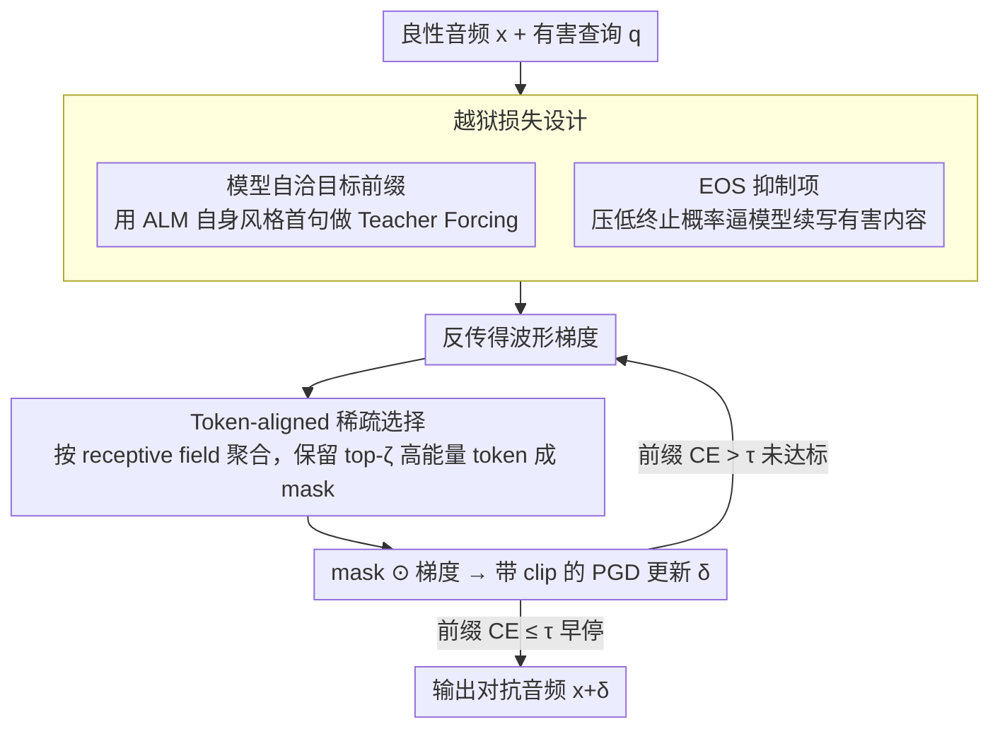

# Sparse Tokens Suffice: Jailbreaking Audio Language Models via Token-Aware Gradient Optimization

**会议**: ICML 2026  
**arXiv**: [2605.04700](https://arxiv.org/abs/2605.04700)  
**代码**: 未公开  
**领域**: 音频语音 / AI 安全  
**关键词**: 音频语言模型, 越狱攻击, 稀疏优化, 梯度异质性, 对抗扰动

## 一句话总结
本文发现音频语言模型 (ALM) 越狱优化中的波形梯度高度集中在少数 token 上，提出 TAGO 在每步只更新 top-$\zeta$ 高能量 token 对应的波形区段，在 Qwen3-Omni 上仅保留 25% token 就能维持 86% 的 LLM-judge 越狱成功率 (vs 全量 token 的 87%)。

## 研究背景与动机
**领域现状**：音频语言模型 (ALM, 如 Qwen-Omni / LLaMA-Omni) 把语音直接送入 LLM 主干生成自然语言回复，已在人机交互中广泛部署；其安全性面临与文本 LLM 类似的越狱威胁。现有 ALM 越狱攻击 (SpeechGuard / AdvWave) 仿照文本侧 GCG 思路，以"目标前缀 + Teacher Forcing 交叉熵"为损失，对整段波形做稠密的 PGD 更新。

**现有痛点**：音频波形维度极高 (每秒上万样本点)，对整条波形稠密更新既慢、又因为信号冗余 (大段静音 / 元音稳态区) 而浪费梯度预算。已有工作在 Qwen3-Omni 这类安全对齐较强的模型上 ASR$_l$ 普遍跌到 45% 以下 (AdvWave 70%/45%)，说明稠密优化既不高效也不够强。

**核心矛盾**：作者从优化信号的"结构"层面拆解这一问题——稠密更新隐含假设是梯度能量在 token 上均匀分布，但 ALM 的 audio token 由前端卷积/下采样产生，每个 token 对应一段 receptive field，不同 token 对越狱前缀概率的影响差异巨大。如果梯度高度集中，那么把更新均摊到所有 token 上反而稀释了真正有效的方向。

**本文目标**：(1) 量化 ALM 越狱优化中 token 级梯度的非均匀程度；(2) 设计一个在优化过程中就强制 token 级稀疏的越狱算法；(3) 验证"先稠密优化、后剪枝"是否等价 (后续证明并不等价)。

**切入角度**：在每一步把波形梯度按 token 的 receptive field 聚合，得到 token-aligned gradient energy $\tilde{g}_i^{(k)}$；用 coefficient of variation、top-$q$ mass、$q_\alpha$ 三个度量刻画其分布。Qwen3-Omni 实测显示，top 16% 的 audio token 就承担了 90% 的梯度能量 (sum 视角下 CV=2.74, $q_{0.9}=9.64$ / 平均 60 个 token)。

**核心 idea**：用 token-aware 的稀疏 mask 把每步梯度只施加在 top-$\zeta$ 高能量 token 的 receptive field 上，其余位置 mask 为 0；同时配合"模型自洽前缀模板" + EOS 抑制项，把"前缀对齐"这一对齐捷径系统性地绕过。

## 方法详解

### 整体框架
TAGO 要解决的是"如何在高维音频波形上更高效地搜出越狱扰动"。它的做法是把白盒 ALM 的越狱优化从"对整段波形稠密 PGD"改成"每步只更新少数高能量 token 对应的波形区段"：每次迭代先反传得到波形梯度，按各 audio token 的 receptive field 聚合成 token 级能量，只保留 top-$\zeta$ token 形成二值 mask 后再做带 clip 的 PGD 更新，同时用模型自洽前缀和 EOS 抑制项把对齐捷径堵死，当前缀交叉熵降到阈值即提前停。输入是良性音频 $x\in\mathbb{R}^L$、固定文本 prompt、有害查询 $q$ 和保留比 $\zeta$，输出是对抗音频 $x+\delta$，使 ALM 回复以目标前缀 $r_{1:m}$ 开头并继续生成有害内容。

### 关键设计

**1. Token-aligned 稀疏选择：把扰动预算集中到真正有效的 token**

稠密 PGD 隐含假设梯度能量在 token 间均匀分布，但作者实测发现前 16% 的 audio token 就承担了 90% 的梯度能量，均摊更新等于把预算浪费在静音、元音稳态等低能量区段上，反而稀释了有效方向的步长。TAGO 的应对是把前端 $\Phi(\cdot)$ 产生的每个 pre-attention audio token $\Phi_i(x)$ 映射到唯一波形区间 $\mathcal{R}(i)\subseteq\{1,\dots,L\}$，定义样本级能量 $g^{(k)}(s)=([\nabla_\delta\mathcal{L}]_s)^2$ 与 token 级能量 $\tilde{g}_i^{(k)}=\sum_{s\in\mathcal{R}(i)}g^{(k)}(s)$，按 $\tilde{g}_i^{(k)}$ 选出 top 索引集 $\mathcal{S}^{(k)}$ 并构造 mask $M^{(k)}=\mathbf{1}_{\cup_{i\in\mathcal{S}^{(k)}}\mathcal{R}(i)}$，更新规则为 $\delta^{(k+1)}=\mathrm{Clip}_{[-\epsilon,\epsilon]}(\delta^{(k)}-\eta(M^{(k)}\odot\nabla_\delta\mathcal{L}))$。关键是 mask 每步重选而非一次定死——高能量 token 会随优化轨迹漂移，动态选择才能跟住"早期有效、后期失效"的 token，这也是它远胜事后剪枝的原因。

**2. 模型自洽目标前缀：让 Teacher Forcing 不再把模型拉出分布**

GCG 式越狱常对所有 harmful query 硬塞"Sure, here is..."这种统一前缀，但不同 ALM 回复风格差异很大 (Qwen-Omni vs LLaMA-Omni)，强行对齐一个分布外的前缀会让 CE loss 崎岖、优化变难。TAGO 改用模型自己的风格：先拿一小批良性 prompt 询问目标 ALM，抽取其回复首句作为带占位符的模板 $\mathsf{Prefix}(\cdot)$，对任意有害查询 $q$ 实例化为 $r_{1:m}(q)=\mathsf{Prefix}(q)$ 再做 Teacher Forcing。这样"前缀对齐"被压在模型已经熟悉的输出流形上，CE loss 更平滑、更容易快速降到阈值 $\tau$ 以下而触发早停。

**3. EOS 抑制项：堵住"前缀像越狱、后面戛然而止"的假阳性**

安全对齐有个捷径——模型被迫吐出目标前缀后立刻输出 `<|im_end|>` 把生成切断，看上去越狱了实则没生成任何有害内容。作者引 Qi et al. 2025 指出对齐主要靠"前几个 token 的分布塑形 + 提前终止"实现，于是在损失里显式加一项 $\mathcal{L}_{\mathrm{eos}}=p_\theta(\mathrm{EOS}\mid h_m)$ ($h_m$ 为吐完前缀后的解码上下文) 把 EOS 概率压低，逼模型把有害内容真正续写出来。最终目标函数为 $\mathcal{L}=\frac{1}{m}\sum_{i=1}^m\mathcal{L}_{\mathrm{CE}}(r_i,p_\theta(\cdot\mid h_{i-1}))+\lambda\|\delta\|_2^2+\lambda_{\mathrm{eos}}\mathcal{L}_{\mathrm{eos}}$，三项分别负责前缀对齐、扰动能量约束和反提前终止。

### 损失函数 / 训练策略
优化用带 $\ell_\infty$ clip 的 PGD。早停准则是前缀 CE term $\leq\tau(\rho)=-\log\rho$，即认为前缀已被高置信度对齐就立即停止以省迭代；主实验取 $\rho=0.9$ 对应 $\tau\approx 0.105$。token 保留比扫 $\zeta\in\{1.0,0.75,0.5,0.25\}$，威胁模型为白盒、仅扰动波形、文本 prompt 固定。

## 实验关键数据

### 主实验
在 AdvBench-50 上 (每 query 用 Google TTS 合成 2 个 speaker，共 100 条样本)，对比三个 ALM：

| 模型 | 方法 | ASR$_r$ (%) | ASR$_l$ (%) |
|------|------|-------------|-------------|
| Qwen3-Omni | Direct | 0 | 0 |
| Qwen3-Omni | SpeechGuard | 100 | 42 |
| Qwen3-Omni | AdvWave | 70 | 45 |
| Qwen3-Omni | Post-hoc prune ($\zeta=0.25$) | 9 | 1 |
| Qwen3-Omni | TAGO ($\zeta=1.0$) | 100 | **87** |
| Qwen3-Omni | TAGO ($\zeta=0.25$) | 99 | **86** |
| Qwen2.5-Omni | AdvWave | 36 | 4 |
| Qwen2.5-Omni | TAGO ($\zeta=0.25$) | 97 | 53 |
| LLaMA-Omni | AdvWave | 100 | 68 |
| LLaMA-Omni | TAGO ($\zeta=0.25$) | 100 | 72 |

HarmBench 上同样保持优势 (Qwen3-Omni: Direct 4.5 → TAGO $\zeta=1.0$ 76.5 → $\zeta=0.25$ 70.0 ASR$_l$)。

### 消融实验
TAGO 对 $\zeta$ 与早停 $\rho$ 的敏感性 (Qwen3-Omni)：

| 配置 | ASR$_l$ (%) | 平均迭代数 | 说明 |
|------|-------------|------------|------|
| $\zeta=1.0,\rho=0.9$ | 87 | 256.64 | 稠密基线 |
| $\zeta=0.25,\rho=0.9$ | 86 | 323.16 | 仅 25% token，迭代 +25.92% 即可补回 |
| $\zeta=1.0,\rho=0.7$ | 32 | 75.39 | 早停过松，前缀对齐不足 |
| Post-hoc prune $\zeta=0.25$ | 1 | — | 先稠密优化后再剪 — 完全失败 |

SNR 度量下 TAGO ($\zeta=0.25,\rho=0.9$) 在 Qwen3-Omni / Qwen2.5-Omni / LLaMA-Omni 上分别为 20.65 / 21.83 / 22.45 dB，扰动能量适中。

### 关键发现
- **梯度异质性是普适规律**：Qwen3-Omni 上 sum-gradient 的 CV 高达 2.74，top 10% token 占 91.52% 能量，$q_{0.9}=9.64/60$；这是 TAGO 全部立论基础。
- **稀疏必须在线施加**：post-hoc prune 在 $\zeta=0.25$ 下 ASR$_l$ 只剩 1% (vs TAGO 86%)，说明优化轨迹本身被稀疏 mask 重新塑形，并非可事后近似的小扰动；这一对比是论文最有力的反例。
- **迭代数仅线性微增**：$\zeta$ 从 1.0 降到 0.25 只多用 25.92% 迭代而非 4x，说明 top-$\zeta$ token 真的承载了大部分有效优化方向，不是简单的"少做就慢做"。
- **安全对齐强弱跨模型差异显著**：Qwen3-Omni / Qwen2.5-Omni 直攻几乎 0 (强对齐)，LLaMA-Omni 直攻就有 49% ASR$_l$ (弱对齐)；TAGO 把三者都拉到 70%+。

## 亮点与洞察
- **从优化结构而非攻击 trick 出发**：把"波形稠密更新"质疑成"是否必要"，配上严谨的 CV / top-$q$ mass / $q_\alpha$ 三件套度量，让 sparsity 不只是 engineering trick 而是优化层面的事实陈述。
- **Token-as-analysis-unit 抽象巧妙**：直接用 pre-attention audio token 而非 self-attention 后的表示作为分析单元，避免 self-attention 把时间局部性打散，receptive field 概念可直接迁移到任何 conv/downsample 前端的模态 (如视频帧 patch、点云体素)，对未来跨模态攻击/防御研究有方法论价值。
- **EOS 抑制点破了对齐的真实弱点**：把 Qi et al. 2025 关于"对齐主要塑造前几个 token + 终止"的观察具体化为一个可优化目标，是一个可复用到文本 LLM 越狱的 trick (现有 GCG 多数只优化前缀 CE 不显式压 EOS)。

## 局限与展望
- **白盒假设强**：需要访问 ALM 完整参数与梯度，对闭源 API 服务不直接适用；作者未讨论 token 级梯度统计能否通过查询近似 (例如用 logits 估计)。
- **依赖 receptive field 已知**：前端 $\mathcal{R}(i)$ 是固定的 deterministic 映射，但对带可变下采样率或动态分块的 ALM (如未来的端到端语音 LM) 该映射可能更复杂。
- **token 选择是 hard top-k**：可能 miss 掉跨多个中等能量 token 协同生效的情况；可考虑 soft/learned mask 或 group sparsity。
- **防御侧未充分讨论**：既然作者倡议未来安全对齐"利用 token 级梯度异质性"，但具体的防御方案 (如对高能量 token 区段做对齐 augmentation) 仍是 open question。

## 相关工作与启发
- **vs SpeechGuard / AdvWave**: 二者都做稠密波形 (或 suffix 段) 更新，本文核心区别是把更新限制到 token-receptive-field 子集；在 Qwen3-Omni 等强对齐 ALM 上 ASR$_l$ 从 42/45 跃升到 86，证明 sparsity 不是 trade-off 而是 free lunch。
- **vs Weighted-sampling 音频对抗攻击 (Liu et al. 2020)**: 都基于"波形重要性不均"但前者按静态预估的重要性采样，本文按每步动态梯度能量选择并配合 Teacher Forcing 越狱目标，是 dynamic vs static、attack on ASR vs jailbreak ALM 的双重升级。
- **vs GCG (Zou et al. 2023) 文本 LLM 越狱**: TAGO 把"梯度集中在少量 token"的现象从离散 token-level greedy 搬到了连续波形 + receptive field 聚合，可视为 GCG 在连续模态下的"梯度稀疏"对应物，思路可反哺图像/视频对抗攻击 (patch-level top-k 梯度选择)。

## 评分
- 新颖性: ⭐⭐⭐⭐ 首次系统量化 ALM 越狱梯度的 token 级异质性，并把 in-optimization sparsity 作为攻击 lever；EOS 抑制和模型自洽前缀虽属增量但组合得当。
- 实验充分度: ⭐⭐⭐⭐ 覆盖 3 个 ALM、2 个 benchmark、$\zeta\times\rho$ 双维敏感性、post-hoc prune 反例、SNR 量化扰动，证据链完整。
- 写作质量: ⭐⭐⭐⭐ 把度量/算法/公式组织得清楚，Algorithm 1 + 公式 13 一目了然；可读性高但 figure 信息密度偏低。
- 价值: ⭐⭐⭐⭐ 直接挑战"稠密优化"基线、给防御侧指出明确方向 (高能 token 区段安全增强)；对音频/多模态 LLM 安全研究有实用启发。

<!-- RELATED:START -->

## 相关论文

- [\[ACL 2026\] Data-efficient Targeted Token-level Preference Optimization for LLM-based Text-to-Speech](../../ACL2026/audio_speech/data-efficient_targeted_token-level_preference_optimization_for_llm-based_text-t.md)
- [\[ICML 2026\] Multimodal Fusion via Self-Consistent Task-Gradient Fields](multimodal_fusion_via_self-consistent_task-gradient_fields.md)
- [\[ACL 2025\] Analyzing and Mitigating Inconsistency in Discrete Audio Tokens for Neural Codec Language Models](../../ACL2025/audio_speech/audio_token_consistency.md)
- [\[ICML 2026\] Two-Dimensional Quantization for Geometry-Aware Audio Coding](two-dimensional_quantization_for_geometry-aware_audio_coding.md)
- [\[ICML 2026\] Sparse Autoencoders for Interpretable Emotion Control in Text-to-Speech](sparse_autoencoders_for_interpretable_emotion_control_in_text-to-speech.md)

<!-- RELATED:END -->
