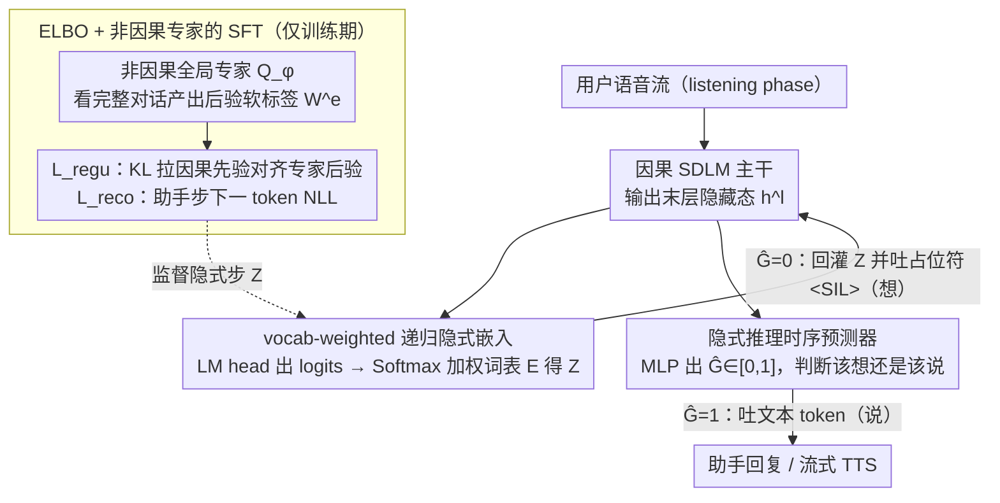

# The Silent Thought: Modeling Internal Cognition in Full-Duplex Spoken Dialogue Models via Latent Reasoning

**会议**: ICML 2026  
**arXiv**: [2603.17837](https://arxiv.org/abs/2603.17837)  
**代码**: 待确认  
**领域**: 语音对话 / Full-duplex SDLM / 隐式推理  
**关键词**: 全双工语音对话, 隐式思考, ELBO, 边听边想, 变分推断

## 一句话总结
本文提出 FLAIR：让全双工口语对话模型（SDLM）在"听用户说话"的同时，把通常用来填 `<SIL>` 的步骤改成连续的隐式推理——通过一个 ELBO 训练目标 + 非因果"全局专家"提供后验，让因果 LLM 学会用一串嵌入向量"边听边想"，从而显著提升问答质量却不引入任何推理延迟。

## 研究背景与动机
**领域现状**：全双工 SDLM（如 Moshi、SALMONN-omni）把"听"和"说"做成两条并发流，模型每个时间步必须输出某个文本 token；用户说话期间，标准做法就是反复输出 `<SIL>` 占位符把文本流凑齐到与音频流等长。

**现有痛点**：这种"听的时候只输出哨兵 token"等于把 listening window 的算力完全浪费了。一个直接的替代是把 NLP 里的 CoT 搬过来——在听用户讲话时同步生成显式文本思考链。但语音流是**因果**的：思考不能领先于尚未说完的话；而且用户可能在任意时刻说完，模型若被锁在一条预定的文本思考链里，要中断它再切到回答会带来明显的状态管理延迟。

**核心矛盾**：高质量推理需要"花步数想"，但全双工的实时性又要求**因果 + 零额外延迟 + 无显式 CoT 标注**——三个约束同时卡死了显式思考方案。

**本文目标**：在不破坏因果性、不增加推理延迟、不要求额外推理数据集的前提下，让模型在 listening phase 里持续进行某种"思考"，并把这些思考转化为后续回复质量的提升。

**切入角度**：作者放弃"思考必须以离散 token 显式呈现"这个前提，转而把"内部认知"建模成一条随用户输入持续演化的**连续隐变量轨迹**——既然没有真值标签，那就用变分推断（ELBO）+ 一个非因果的"全局专家"作为后验提供者。

**核心 idea**：用 ELBO 把"边听边想"形式化成隐变量建模问题，让因果 SDLM 通过 KL 散度对齐一个看过完整对话的非因果专家的后验分布，从而把全局推理能力内化为流式听取阶段的隐式 prior。

## 方法详解

### 整体框架
FLAIR 只动全双工 SDLM 在 listening phase 的输入：常规做法是用户讲话时往文本流反复写 `<SIL>` 把两条流凑齐，FLAIR 改成往这些位置喂一段随用户输入持续演化的**隐式推理嵌入** $Z$，让本来空转的 token slot 真正在"想"。训练时额外挂一个非因果"全局专家"$Q_\phi$，它能看完整段对话（用户音频 $X$ + 助手文本嵌入 $H^{txt}$）给出每步理想隐式嵌入当软标签，因果 LLM $P_\theta$ 通过 KL 把这套全局后验内化掉；推理时专家被丢弃，只剩因果 LLM 加一个时序头自主切换"想"与"说"，整套机制逐步对齐、无 chunk、无推理时额外计算。

### 关键设计

**1. vocab-weighted 递归隐式嵌入：让"软思想"留在词表语义流形上**

隐式步要用什么向量喂回 LLM 下一步的输入，是这条路线最容易踩坑的地方。Coconut 类做法直接把上一步隐藏态 $h^l_{t-1}$ 回灌，但隐藏态空间和输入嵌入空间分布并不一致，回灌会引入 train/test mismatch。FLAIR 改成先过 LM head 得到文本 logits $y^{txt}_{t-1}$，再在词表嵌入矩阵 $E \in \mathbb{R}^{|V|\times d}$ 上做 softmax 加权平均 $Z_{t-1} = \text{Softmax}(y^{txt}_{t-1}) E$，于是"隐式思想"始终是一个活在词表 embedding 张成空间里的"软词"。这样既把搜索约束在模型已学过的语义空间里规避错配，又附带可解释性——任意时刻都能对 $Z_{t-1}$ 做 argmax 看模型此刻"软词"在想什么。

**2. ELBO + 非因果专家的 SFT：给没有真值的隐式步造监督信号**

隐式步没有 CoT 真值标注，没法像普通 SFT 那样用 teacher forcing。FLAIR 把目标改写成条件 ELBO：

$$\log P_\theta(Y^{txt}|X) \geq \mathbb{E}_{q_\phi(Z|X,Y^{txt})}[\log P_\theta(Y^{txt}|Z,X)] - \text{KL}[q_\phi(Z|X,Y^{txt}) \,\|\, P_\theta(Z|X)]$$

第一项落地成**条件重建损失** $\mathcal{L}_{reco}$，只在助手说话步用 teacher forcing 算下一文本 token 的 NLL；第二项落地成**变分正则** $\mathcal{L}_{regu}$，只在用户说话步把因果 LLM 预测的 vocab 分布拉向专家给出的 stop-gradient 分布 $W^e_t$。这里专家 $Q_\phi$ 是非因果 encoder，能用未来信息把后验估到位，相当于把"理想隐式标签"建模成由它估的近似后验——这一步绕开了构造 CoT 数据集，也避开了 RL/重采样的不稳定性，同时保住了 teacher forcing 的训练效率；而且 ELBO 与后续 RL post-training 正交，可叠加而不冲突。

**3. 隐式推理时序预测器：把"何时开口"做成模型内生行为**

全双工系统必须自主决定何时起停发声（turn-taking / barge-in），FLAIR 没用外部 VAD 或规则，而是把这件事直接绑到隐式步上。它把最后隐藏态 $h^l$ 过一个 MLP 得到 $\hat{G}_t \in [0,1]$，用 BCE 损失 $\mathcal{L}_{time} = -\sum_t [G_t \log \hat{G}_t + (1-G_t)\log(1-\hat{G}_t)]$ 监督（$G_t \in \{0,1\}$ 标记当前步是助手说话还是用户说话）。推理时 $\hat{G}_t=1$ 就正常吐文本 token，$\hat{G}_t=0$ 就走 vocab-weighted 嵌入回灌并往语音侧吐 `<SIL>`。这样"想完了就开始说"成了模型自己学出来的行为，latency 不会被一条预定的显式 CoT 链锁死。

### 损失函数 / 训练策略
总损失 $\mathcal{L}_{elbo} = \mathcal{L}_{reco} + \alpha \cdot \mathcal{L}_{regu} + \beta \cdot \mathcal{L}_{time}$。训练分三段：(i) Pre-training：常规 full-duplex 形式（仍输出 `<SIL>`）做 speech continuation 预训；(ii) Latent Reasoning SFT 两子阶段：先只用 $\mathcal{L}_{reco}$ 让专家学会产出像样的隐式标签，再用完整 $\mathcal{L}_{elbo}$ 联合训因果 LLM + 专家；(iii) Speech Synthesizing SFT：冻结主干，单独训流式 TTS 模块（CosyVoice 2 flow-matching）。数据是合成的 530k 小时语音延续 + 70k 小时指令 QA + 20k 小时 ASR-QA。

## 实验关键数据

### 主实验（QA benchmarks，从 Table 1 摘核心对比）

| 数据集 | 指标 | FLAIR w/o thk | FLAIR w/ thk | 提升 | 备注 |
|--------|------|---------------|--------------|------|------|
| LlamaQ | Acc % | 73.0 | **78.0** | +5.0 | 全双工最佳 |
| TriviaQA | Acc % | 54.4 | 56.2 | +1.8 | — |
| SDQA | Acc % | 3.80 | 3.85 | +0.05 | GPT-Score |
| AlpacaEval | GPT | 3.80 | 3.85 | +0.05 | 开放问答 |
| CommonEval | GPT | 3.54 | 3.65 | +0.11 | 真人录音 |
| OpenbookQA | Acc % | 72.9 | 74.2 | +1.3 | 多选 |
| **MMSU** | Acc % | 50.2 | **56.2** | **+6.0** | 推理类涨幅最大 |

对比 Moshi（54.5 LlamaQ）、SALMONN-omni（73.6 LlamaQ）、Freeze-Omni 等全双工 baseline，FLAIR w/ thk 在 LlamaQ / MMSU / OpenbookQA 等多数任务上达成全双工 SOTA；与 Kimi-Audio、Baichuan-Audio 等半双工大模型可比甚至超出。

### 对话动态实验（Table 2 Impatient 数据集 + Table 3 Full-Duplex-Bench）

| 配置 | E2E? | Turn-taking lat. ↓ | Barge-in lat. ↓ | Barge-in succ. ↑ | MOS ↑ |
|------|------|--------------------|------------------|-------------------|-------|
| Moshi | ✓ | — | 0.81 | 55.1 | 3.9 |
| ORISE | ✓ | 0.43 | 0.61 | 96.8 | 4.2 |
| FLAIR w/o thk | ✓ | 0.33 | 0.49 | 100 | 4.3 |
| FLAIR w/ thk | ✓ | 0.39 | 0.46 | **100** | 4.3 |

加入隐式推理后 turn-taking latency 从 0.33s 略升到 0.39s，barge-in latency 反而更低（0.46s），成功率维持 100%。在 Full-Duplex-Bench 上 TOR 与 GPT-4o 分数同样未退化（barge-in GPT-4o 从 4.08 升到 4.22）。

### 关键发现
- **推理越重的任务越受益**：MMSU +6.0、LlamaQ +5.0；而以事实抽取为主的 WebQ 仅 +1.3 甚至略降，验证隐式步真的在做"reasoning"而不是噪声扰动。
- **不增加推理延迟**：listening phase 本来就要等用户说完，把这些 token slot 改成隐式步是"零开销"的算力回收；turn-taking latency 仅微增 0.06s 在容差内。
- **t-SNE 可视化（Fig. 3）**：用户音频嵌入、目标文本嵌入、隐式推理嵌入投到 2D 时，隐式嵌入恰好沿"feasible 流形"从音频簇向文本簇延伸，形成一条"桥"——说明隐式步在做的事更像 cross-modal alignment + planning，而不是简单的特征复读。
- **专家失明 → 整套塌缩**：消融（Appendix E 提及）表明非因果专家是 ELBO 信号源，专家若退化为因果会让 $\mathcal{L}_{regu}$ 失去拉力，隐式步退化为对静默 token 的拟合。

## 亮点与洞察
- **把 ELBO 当 SFT 的"隐式 CoT 标签生成器"**：以前 Coconut/CODI 类隐式推理方法要么依赖额外重采样要么 RL 训练昂贵，FLAIR 用一个非因果专家 + KL 对齐就把"想啥"的监督做到 teacher forcing 级别效率，可迁移到任何"训练时有未来信息、推理时只有过去信息"的场景（如同传翻译、低延迟流式 ASR 重排）。
- **vocab-weighted 嵌入回灌**：相比 raw hidden state 回灌，这个细节既保住可解释性又规避 train/test 嵌入空间错配，是隐式推理工程实现里被低估的关键。
- **时序预测头 = 模型自主轮换"想"与"说"**：把"何时该说话"做成可学习的内生信号，本质上是把 VAD/turn-taking 决策吸收进了同一个 LLM forward，这是真正"边听边想边说"的统一架构雏形。
- **思想可迁移**：把"内部认知是隐变量"这个抽象搬到任何流式 + 等待时间被浪费的任务上——比如 robot policy 的"observation idle frames"也可以加 latent thinking、视频生成的间隔帧可以做隐式 plan。

## 局限与展望
- **依赖专家收敛**：两阶段 SFT 强依赖第一阶段专家先学到像样的隐式分布；如果专家容量/数据不够，第二阶段 KL 会拉错方向，论文未给出失败模式的诊断曲线。
- **可解释性只到 argmax**：虽然能把隐式嵌入 argmax 成"软词"看，但 listening 期间一长串"软词"是否能被人类阅读、是否真的对应可命名的思考片段，论文未提供定性分析（只有 t-SNE）。
- **训练数据全合成**：530k+70k+20k 小时几乎全是 TTS 合成的英文助理风格语料，跨语种、跨说话人口音、噪声场景的泛化未深测；CommonEval 上虽是真人，但任务窄。
- **回报随任务变化大**：WebQ 这种事实抽取受益小，提示"隐式步"机制并非任意任务都有正收益；后续值得加 task router 根据问题类型门控开关 thk。

## 相关工作与启发
- **vs Coconut / CODI**：同样做"hidden state 回灌"，FLAIR 改成 vocab-weighted 软嵌入 + ELBO 监督，监督信号更稳；且首次落到 SDLM 流式场景。
- **vs STITCH（"think-while-talking"）**：STITCH 是把 chunk 拆开在 speak 阶段插显式 CoT chunk；FLAIR 把思考完全藏进 listen 阶段、保持因果零延迟，二者其实可正交叠加。
- **vs SHANKS / Arora et al.（streaming CoT in SDLM）**：SHANKS 等用显式 CoT，要么得自建 CoT 数据集、要么破坏因果；FLAIR 用 ELBO 绕开 CoT 标注是其方法学上的核心差异。
- **vs Moshi / Freeze-Omni / SALMONN-omni**：基础架构都是"流式编码器 + LLM + 流式 TTS"，FLAIR 只改 listening phase 的输入语义，几乎可即插即用迁移到这些已有 SDLM。

## 评分
- 新颖性: ⭐⭐⭐⭐⭐ 首次把 latent reasoning 引入语音 LLM，ELBO + 全局专家这套形式化是干净的原创组合。
- 实验充分度: ⭐⭐⭐⭐ 覆盖 9 个 QA benchmark + 2 套对话动态评测 + t-SNE 可视化，但消融细节多放 Appendix、未给隐式步长度敏感性主表。
- 写作质量: ⭐⭐⭐⭐⭐ 动机—公式—架构图—实验闭环清晰，ELBO 推导逻辑直接对应实现损失项。
- 价值: ⭐⭐⭐⭐⭐ 给"全双工模型 listening 算力浪费"这个长期被默认接受的浪费提供了一个零延迟解法，对实时语音 agent 是范式级别的改造。

<!-- RELATED:START -->

## 相关论文

- [\[ICML 2026\] MoshiRAG: Asynchronous Knowledge Retrieval for Full-Duplex Speech Language Models](moshirag_asynchronous_knowledge_retrieval_for_full-duplex_speech_language_models.md)
- [\[ACL 2026\] Full-Duplex-Bench-v2: A Multi-Turn Evaluation Framework for Duplex Dialogue Systems with an Automated Examiner](../../ACL2026/audio_speech/full-duplex-bench-v2_a_multi-turn_evaluation_framework_for_duplex_dialogue_syste.md)
- [\[ACL 2026\] SDiaReward: Modeling and Benchmarking Spoken Dialogue Rewards with Modality and Colloquialness](../../ACL2026/audio_speech/sdiareward_modeling_and_benchmarking_spoken_dialogue_rewards_with_modality_and_c.md)
- [\[ICML 2025\] Aligning Spoken Dialogue Models from User Interactions](../../ICML2025/audio_speech/aligning_spoken_dialogue_models_from_user_interactions.md)
- [\[ACL 2026\] MTR-DuplexBench: Towards a Comprehensive Evaluation of Multi-Round Conversations for Full-Duplex Speech Language Models](../../ACL2026/audio_speech/mtr-duplexbench_towards_a_comprehensive_evaluation_of_multi-round_conversations_.md)

<!-- RELATED:END -->
