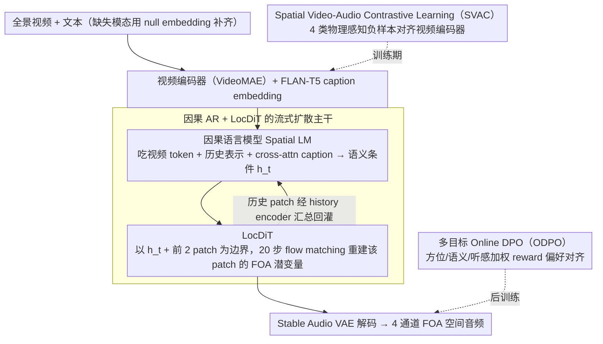

# Towards Streaming Synchronized Spatial Audio Generation via Autoregressive Diffusion Transformer

**会议**: ICML 2026  
**arXiv**: [2605.30940](https://arxiv.org/abs/2605.30940)  
**代码**: 无（仅 demo 页：https://swanaigc.github.io/#swansphere）  
**领域**: 多模态生成 / 空间音频 / 自回归扩散  
**关键词**: 空间音频生成、First-Order Ambisonics、流式生成、自回归扩散、对比学习

## 一句话总结
SwanSphere 提出"因果 AR 语言模型 + 局部 DiT（LocDiT）"的两阶段流式架构，从全景视频或文本生成一阶 Ambisonics（FOA）四通道空间音频，配合 SVAC 物理感知对比学习与三目标 ODPO，把首块延迟压到 0.21s 的同时在 FD/KL/角度误差上全面超越级联与端到端基线。

## 研究背景与动机

**领域现状**：VR/AR 与全景视频对"声画方位一致"的沉浸感要求越来越高，研究重心已从单声道、立体声 V2A 转向直接生成 FOA（4 通道：全向 $W$ 与三个方向速度分量 $X,Y,Z$），主流路线是大规模 DiT 一步出全序列（如 OmniAudio），或基于离散码本的 AR（如 ViSAGe）。

**现有痛点**：两条路线都各有硬伤。DiT 走全局自注意力 + 多步去噪，质量好但**首帧延迟高**（OmniAudio ~0.85s，DiT 基线 6.47s，ViSAGe 直接 20s 级），无法满足 VR/AR 的实时交互；AR 走离散码本则因量化损失带来**重建误差**，相位信息丢失尤其伤 FOA 的方向分量；而几乎所有方法都用 CLIP 这类**无声学先验**的视觉编码器加全局池化，方位线索在池化时就被磨平。

**核心矛盾**：质量↔延迟之间是结构性 trade-off（全局 vs. 流式），而方位精度↔语义对齐之间也是结构性 trade-off（CLIP 的语义优势伴随方位盲点）。要同时拿下"高保真 + 低延迟 + 准方位"必须从架构和表示两个层面同时下手。

**本文目标**：在统一框架下解决三件事——(1) 低首块延迟的流式 FOA 生成；(2) 从全景视频里真正抽出方位感的视觉表征；(3) 让生成结果在语义/方位/听感三个维度同时贴近真实分布。

**切入角度**：把"长程时序结构"和"局部高保真渲染"解耦——前者天然适合 AR 因果建模并按 patch 流式吐出，后者天然适合连续潜空间上的 DiT 短窗口去噪；同时用**物理感知的对比学习**替换 CLIP，把旋转、时间偏移这种 FOA 独有的物理对称性转成硬负样本喂给编码器。

**核心 idea**："AR 做语义规划 + LocDiT 做 patch 内连续合成"的 divide-and-conquer，叠加 SVAC 物理负样本与多目标 ODPO 偏好对齐，绕开离散量化又避开全局 DiT 的延迟。

## 方法详解

### 整体框架
SwanSphere 要解决的是"从全景视频和/或文本生成 4 通道 FOA 空间音频，同时兼顾高保真、低首块延迟、准方位"这件结构性互斥的事。它的核心拆法是把"长程语义规划"和"局部高频渲染"解耦：前者交给一个因果语言模型在 patch 粒度上预测语义条件，后者交给一个短窗 LocDiT 在连续潜空间上做 flow matching 去噪，从而绕开纯 AR 离散码本的量化损失，也避开全局 DiT 的秒级延迟。围绕这条主干，训练侧再叠两件事：用 SVAC 物理感知对比学习把视觉编码器拉到声学域、学出方位敏感性；监督训练完用多目标 ODPO 偏好对齐把方位、语义、听感三个目标压回生成分布。文本输入走 FLAN-T5 后以 cross-attention 注入语言模型，缺失模态用可学习 null embedding 补齐，实现单模型同时吃视频、文本或两者。

### 关键设计

**1. 因果 AR + LocDiT 的流式扩散主干：解耦长程语义与局部渲染以压低首块延迟**

针对全局 DiT"多步去噪 + 全局自注意力导致首帧要等整段算完"这个延迟命门，SwanSphere 把生成切成两层。音频侧先用微调过的 Stable Audio VAE 把 FOA 压成 21.5 FPS、128 维的**连续**潜变量 $\mathbf{z}\in\mathbb{R}^{d\times l}$（连续潜空间正是为了避开 DAC 等离散码本对 FOA 相位的量化损伤）。生成时每个时间步 $t$，因果语言模型吃进三路条件——对齐到音频时间轴的视频 token $C_v$、历史 patch 经 history encoder 汇总出的紧凑历史表示、以及 cross-attention 注入的 FLAN-T5 caption embedding——输出当前 patch 的高维语义条件 $h_t$；LocDiT 再以 $h_t$ 为条件、拿前 2 个 patch 做 boundary context，跑 20 步 flow matching 从高斯噪声重建该 patch 的 4 通道 FOA 潜变量。视频特征用最近邻复制（不插值）对齐到音频分辨率，停止条件直接绑定视频结束而非学 stop token，保证音视频严格等长。这样每个 patch 只在很短的潜序列上去噪，首块延迟被拆得很清楚：spatial LM 0.03s + LocDiT 0.14s + 视频编码与音频解码 0.04s = 0.21s。patch size 与历史窗口由此变成"上下文 vs. 响应速度"的可调旋钮，实证 patch size = 4 latent frame、历史 = 2 patch 是当前甜点，再大都会推高首块延迟。

**2. Spatial Video-Audio Contrastive Learning（SVAC）：用物理负样本把视觉编码器拉出方位盲区**

CLIP 这类编码器靠帧级全局池化拿语义，但池化恰好把"声源在画面哪儿"这种局部方位线索抹平，而方位精度正是 FOA 生成的命门。SVAC 的做法是保留 VideoMAE 的时空结构（不做全局池化），配 AudioMAE 当音频侧编码器，做对称 InfoNCE：$\mathcal{L}_{total}=\frac{1}{2N}\sum_i \big(\mathcal{L}_{NCE}(v_i,a_i,\mathcal{N}_i^a)+\mathcal{L}_{NCE}(a_i,v_i,\mathcal{N}_i^v)\big)$。真正的关键在 4 类**物理感知负样本**：实例交换（批内其他样本作语义负）、时间偏移（把对应音频随机循环移位生成时间负，逼模型学事件 onset 同步）、音频旋转（对 FOA 做 3D 旋转产生"方位变了语义没变"的硬负，逼视频编码器对方位敏感）、视频旋转（对全景视频做水平旋转作负样本，逼方位与几何结构一致），合起来即负样本集 $\mathcal{N}_i^a=\{a_j\}_{j\neq i}\cup\{\tilde a_i^{time}\}\cup\{\tilde a_i^{spat}\}$，时间相似度用对齐后余弦。本质上这是把"旋转不变性 + 时间同步"这种 FOA 自带的物理对称性直接写进对比学习的负样本，在表征层而非网络结构层注入归纳偏置，比换 backbone 更彻底。消融 (Table 3) 证实其作用：换回 CLIP 后 FD 退化到 140.28、角误 1.34；只留语义负样本去掉物理负，角误也从 1.03 涨到 1.12。

**3. 多目标 Online DPO（ODPO）：把方位、语义、听感三目标压回生成分布**

监督训练只能让模型贴近训练分布，但方位物理准确性、跨模态语义一致、听感保真这三个目标在监督 loss 里是割裂的。ODPO 在监督训练之后再做一轮偏好对微调来统一它们：每个输入并行采 8 个候选音频，用加权奖励 $R=\lambda_{spatial}\cdot R_{spatial}+\lambda_{semantic}\cdot R_{semantic}+\lambda_{fidelity}\cdot R_{fidelity}$ 排序（默认 $\lambda_{spatial}=\lambda_{semantic}=0.4,\lambda_{fidelity}=0.2$），自动构造偏好对 $(y_w,y_l)$ 后走 DPO loss。三个 reward 各有来源：$R_{spatial}$ 取与 GT 的方位角/俯仰角/空间角误差，$R_{semantic}$ 取 ImageBind 跨模态相似度，$R_{fidelity}$ 取 Audiobox Aesthetics 在感知特征空间到真实参考的距离；为避免奖励与评估指标耦合，另用预训 SELD 网络 PSELDNets 算 wCS 作独立空间评估器。作者指出理论上可换 GRPO 这类 online RL，但采样-排序流程天然出偏好对，DPO 更稳更轻。消融 (Table 4) 上 ODPO 把 FD 从 133.91 → 120.28、角误 1.22 → 1.03，是所有模块里单点收益最高的——说明三目标加权 reward 把方位物理约束硬塞回去比单纯加监督 loss 更有效。

### 损失函数 / 训练策略
整体走三阶段课程学习：(1) LocDiT 先在 ~1M 条非空间音频（伪 FOA：$W$ 设为左右声道和、$X/Y/Z$ 之一随机存差信号、其余置零）上预训通用音频分布；(2) 整体在 165k 条全景音视频对（共 458 小时）上 teacher forcing 监督训练，缺失模态用 null embedding 补齐；(3) 在 3.1k 条带空间 caption 的精标子集上跑多目标 ODPO。VAE 用连续潜空间避免量化损失，patch size = 4 latent frame、temporal stride = 4、causal context = 2 patch，LocDiT 推理 20 步去噪。

## 实验关键数据

### 主实验

**Video-to-Spatial Audio（Table 1，混合测试集，"+AS" 表示外挂 audio spatialization 的级联基线）**

| 模型 | 参数量 | 推理时间 ↓ | FD ↓ | KL ↓ | Δangular ↓ | MOS-SQ ↑ | MOS-AF ↑ |
|------|--------|-----------|------|------|------------|----------|----------|
| MMAudio+AS | 1.03B | 2.76s | 261.65 | 2.43 | — | 3.91 | 3.60 |
| Diff-Foley+AS | 0.94B | 2.03s | 304.03 | 3.12 | — | 3.68 | 3.26 |
| ViSAGe | 0.36B | 20.19s | 232.17 | 2.67 | 1.59 | 3.82 | 3.78 |
| OmniAudio | 1.22B | 0.85s | 157.67 | 1.93 | 1.27 | 4.12 | 4.27 |
| **SwanSphere (Ours)** | **1.09B** | **0.21s / 9.13s** | **120.28** | **1.36** | **1.03** | **4.32** | **4.44** |

首块延迟 0.21s = LM 0.03s + LocDiT 0.14s + 编解码 0.04s，相比 OmniAudio 全序列 0.85s 提速 ~4×，相比同尺寸 DiT (6.47s) 提速 ~30×。Text-to-Spatial Audio (Table 2) 同样领先：FD 174.13→142.80、KL 1.83→1.43。视频+文本联合条件比纯视频再提一档：FD 120.28→118.31、角误 1.03→0.96。

### 消融实验

**SVAC 与生成范式（合并 Table 3/4 关键行）**

| 配置 | FD ↓ | KL ↓ | Δangular ↓ | 说明 |
|------|------|------|------------|------|
| Full (SwanSphere-L) | 120.28 | 1.36 | 1.03 | 完整模型 |
| SVAC → 仅语义负 (sem-only) | 127.12 | 1.41 | 1.12 | 去掉时间/旋转物理负，角误显著退 |
| SVAC → CLIP backbone | 140.28 | 1.44 | 1.34 | 换回 CLIP，FD/角误全面退化 |
| w/o ODPO | 133.91 | 1.44 | 1.22 | 去掉偏好对齐，单一最大降幅 |
| w/o history（历史编码置零） | 128.15 | 1.42 | — | 流式上下文确实有用 |
| DiT 全局（1.11B） | 123.08 | 1.36 | 1.14 | FD 接近但延迟 6.47s，角误更差 |
| SwanSphere-M (0.62B) | 132.52 | 1.43 | 1.16 | 中等容量 |
| SwanSphere-S (0.43B) | 139.81 | 1.58 | 1.33 | 小模型，方位精度明显退 |

### 关键发现
- **ODPO 贡献最大**：单步把 FD 拉低 13.6 分、角误从 1.22→1.03，是所有模块里单点收益最高的——意味着监督训练后再用三目标偏好对齐才能真正贴合物理与听感。
- **物理负样本不是可有可无**：去掉旋转/时间偏移负后角误退 9%，说明 SVAC 的提升主要来自"物理感知"而非"换更大 backbone"。
- **延迟-质量优于纯 DiT**：同尺寸 DiT 在 FD/KL 上和 SwanSphere 打平甚至略输，但延迟 6.47s vs. 0.21s——说明流式架构不是用质量换速度，divide-and-conquer 反而因为"短窗 DiT 更易学局部细节"小幅得利。
- **模型容量不可小**：1.09B → 0.43B 时角误从 1.03 退到 1.33，全景视频-空间音频的跨模态映射对参数量敏感。

## 亮点与洞察
- **架构层面的 trade-off 解耦**：把"长程语义"交给因果 AR、"局部高频细节"交给短窗 DiT，是把 V2A 领域里两条互斥路线（AR 离散低延迟 vs. DiT 高质量高延迟）做成互补，patch size 与历史窗变成可调旋钮，方法论可直接迁移到任意需要流式输出的连续生成任务（视频流、长语音、长 motion）。
- **物理对称性 → 对比学习负样本**：FOA 的 3D 旋转、全景视频的水平旋转、音频的时间循环移位本质上都是任务自带的物理对称性，作者把它们直接转成 hard negative 而不是数据增强，是非常干净的"用领域物理先验注入表征"的范式，远比换 backbone 通用。
- **MLLM 做空间标注的可行路径**：直接喂 FOA 给 MLLM 是浪费，因为 MLLM 不懂 FOA 解码；但**先做声场分析抽出方位/俯仰/距离轨迹，再把结构化轨迹 + 全景视频 + 音频一起喂 Gemini 2.5 Pro**，能拿到时空一致的 caption——这套"传统信号处理打前站 + MLLM 做语言化"的标注流水线在缺监督的多模态任务里普适。
- **延迟拆解的工程价值**：把 0.21s 拆成 LM/DiT/编解码三段是少见的诚实数字，对部署侧调参很有指导意义。

## 局限与展望
- **多源场景未充分建模**：作者承认空间 caption 主要描述主导声源，多乐器同台的复杂混响场景细粒度方位分离能力弱。
- **奖励权重靠拍**：$\lambda_{spatial},\lambda_{semantic},\lambda_{fidelity}=(0.4,0.4,0.2)$ 没有系统搜索，三目标权衡曲线没给出，换数据集可能要重调。
- **泛化与录音设备**：FOA 录制方式（A-format 麦阵列差异、HRTF 校准）会影响真实空间分布，文章未跑 OOD 录音环境。
- **流式但仍非真因果实时**：第一块 0.21s 之后总时长 9.13s 仍偏长，10 秒片段还无法保证全程跟得上 21.5 FPS 实时生成（需 LocDiT 在更短窗或更少步内出结果）。
- **改进思路**：把 PSELDNets 这类 SELD 模型直接做 reward 而不只做 evaluator、把 ODPO 换 GRPO 看是否进一步降低方位误差、引入 HRTF/房间脉冲响应的物理约束作为额外负样本。

## 相关工作与启发
- **vs OmniAudio**：同样端到端、同量级参数，OmniAudio 走全序列 DiT 拿质量，本文走流式 AR-DiT 把首块延迟从 0.85s 砍到 0.21s，同时 FD/KL/角误三项都更好——说明在 FOA 这种"方位精度比绝对音质更稀缺"的任务上，架构解耦 + 偏好对齐比堆参数更划算。
- **vs ViSAGe**：ViSAGe 用 FoV 视频 + 相机参数 + AR 离散码本，本文用全景视频 + 连续 VAE + AR-DiT，FD 232.17→120.28、延迟 20s→0.21s，根本差距在"离散量化伤 FOA 相位" + "FoV 丢全景方位线索"。
- **vs MMAudio+AS / Tango2+AS**：级联式"先生成单声道再 spatialize"几乎全面被端到端方法 dominate，再次印证 V2A 领域级联范式的天花板。
- **vs SoundReactor**：同为因果 AR + 扩散头的低延迟方向，但 SoundReactor 只做 stereo 不做 FOA，本文是这条路线在空间音频域的延伸；SoundReactor 的帧级因果建模思路反过来可被本文借来进一步降低 patch 内延迟。
- **vs CLIP 系视觉编码器**：本文是少见地系统论证"CLIP 在 FOA 任务上的失败模式"的工作（FD +20, 角误 +0.31），对所有依赖视觉条件的空间音频/3D 声场任务都有警示意义。

## 评分
- 新颖性: ⭐⭐⭐⭐ "AR + LocDiT" 解耦本身在 V2A 里有 SoundReactor 等先例，但同时拿下流式 FOA + 物理感知对比 + 多目标 ODPO 的组合是新的。
- 实验充分度: ⭐⭐⭐⭐ 主实验、消融、容量、延迟拆解、文本/视频/联合条件、独立 SELD evaluator 都给了；缺 OOD 录音环境与多源场景定量分析。
- 写作质量: ⭐⭐⭐⭐ 动机层层递进，公式与负样本构造写得清楚，延迟拆解极其诚实。
- 价值: ⭐⭐⭐⭐ 把"首块延迟"做到 0.21s 让 VR/AR 实时空间音频从论文走到工程可用，SVAC 的物理负样本范式有显著迁移价值。

<!-- RELATED:START -->

## 相关论文

- [\[ICML 2025\] OmniAudio: Generating Spatial Audio from 360-Degree Video](../../ICML2025/audio_speech/omniaudio_generating_spatial_audio_from_360-degree_video.md)
- [\[CVPR 2026\] Hear What You See: Video-to-Audio Generation with Diffusion Transformer and Semantic-Temporal Alignment-Ranked Direct Preference Optimization](../../CVPR2026/audio_speech/hear_what_you_see_video-to-audio_generation_with_diffusion_transformer_and_seman.md)
- [\[CVPR 2025\] Synchronized Video-to-Audio Generation via Mel Quantization-Continuum Decomposition](../../CVPR2025/audio_speech/synchronized_video-to-audio_generation_via_mel_quantization-continuum_decomposit.md)
- [\[ACL 2026\] ZipVoice-Dialog: Non-Autoregressive Spoken Dialogue Generation with Flow Matching](../../ACL2026/audio_speech/zipvoice-dialog_non-autoregressive_spoken_dialogue_generation_with_flow_matching.md)
- [\[ACL 2026\] ImmersiveTTS: Environment-Aware Text-to-Speech with Multimodal Diffusion Transformer and Domain-Specific Representation Alignment](../../ACL2026/audio_speech/immersivetts_environment-aware_text-to-speech_with_multimodal_diffusion_transfor.md)

<!-- RELATED:END -->
