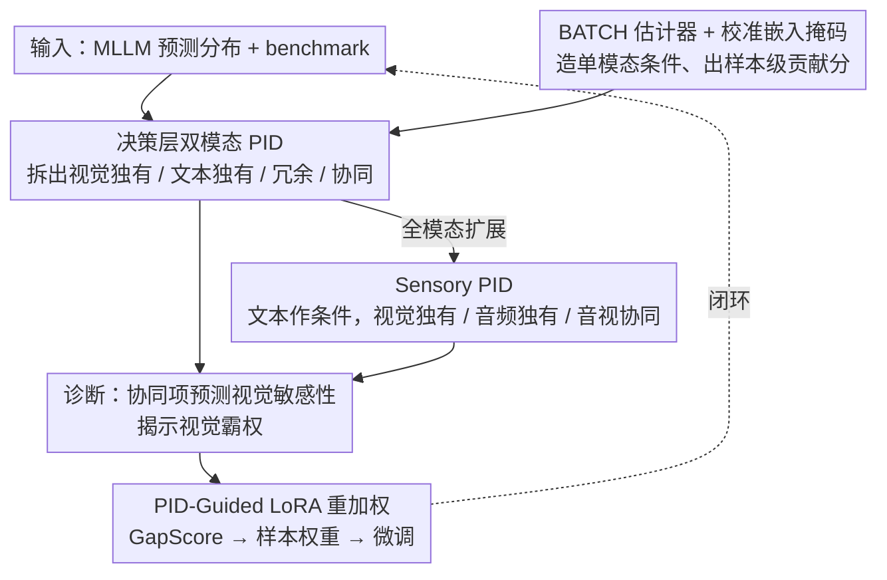

# Towards Understanding Modality Interaction in Multimodal Language Models via Partial Information Decomposition

**会议**: ICML 2026  
**arXiv**: [2606.00959](https://arxiv.org/abs/2606.00959)  
**代码**: 待确认  
**领域**: 多模态VLM / 可解释性 / 信息论分析  
**关键词**: PID, 模态协同, 全模态模型, 视觉主导, LoRA重加权

## 一句话总结
本文把多模态大模型的决策看成一次输入到输出的信息分解，借 Partial Information Decomposition (PID) 把 VL/全模态模型的预测互信息拆成"视觉独有 / 文本独有 / 冗余 / 协同"四项，发现协同项是预测视觉敏感性的最佳指标、全模态模型存在"视觉霸权"型协同瓶颈，并用 PID 得到的样本级分数指导 LoRA 重加权微调，在 MMStar/MMBench/POPE 上稳定提升 1–2 个百分点。

## 研究背景与动机

**领域现状**：MLLM 已经从感知系统迈向决策智能体（科学分析、医疗、具身交互），但目前的评测几乎只看"预测对不对"，即用准确率 + 模态消融来判断模型是否真的用到了视觉/音频。

**现有痛点**：表征对齐、注意力可视化、模态消融这三类分析能告诉我们"哪个模态被编码"和"去掉哪个模态后掉点多少"，但都无法回答**决策层**的问题：模型用到的信息究竟是某个模态独享的，还是两个模态共享的（冗余），还是只有同时看到两个模态才能得到的（协同）？三者在准确率层面会被一锅烩，不同的多模态融合模式被混为一谈。

**核心矛盾**：精度类指标 / 消融类指标都是**标量**，但模态使用是**多维**的（独有 vs 冗余 vs 协同）。把多维结构压成标量必然会丢掉"模型到底是真融合还是用语言先验抄近路"这种关键信号。

**本文目标**：拆成三件事 —— (a) 给每个模型–基准对建一个决策层的"模态使用画像"；(b) 验证这个画像能否预测干预敏感性（拿掉视觉/音频后掉多少）；(c) 把画像反过来指导训练，提升真正的跨模态融合。

**切入角度**：作者借用信息论里现成的 PID 框架 —— 它本来就是把 $I(Y;X_v,X_t)$ 拆成 $U_{\text{vis}} + U_{\text{txt}} + R_{\text{vl}} + S_{\text{vl}}$ 四个非负项。关键观察是：**PID 应该建在模型诱导的预测分布 $p_\theta(y|x_v,x_t)$ 上，而不是 latent 表征上**，这样得到的就是"模型怎么用模态"，不是"数据集自己长什么样"。

**核心 idea**：用决策层 PID 给 VL 模型做诊断，引入 Sensory PID（把文本作为条件控制变量）扩展到 video-audio-text 全模态模型，最后用样本级 PID 分数构造一个"上调欠协同样本、下调语言捷径样本"的 LoRA 重加权策略。

## 方法详解

### 整体框架

本文要解决的是"模型到底怎么用模态做决策"这个准确率指标答不出的问题，做法是把 MLLM 的预测分布 $p_\theta(y|x_v,x_t)$ 当成一次"输入信息到输出预测"的分解对象，套用信息论的 Partial Information Decomposition 把预测互信息拆成视觉独有、文本独有、冗余、协同四项。整套流程沿三条线展开：先给 VL 模型建双模态 PID 画像，再用 Sensory PID 把分析扩展到 video-audio-text 全模态模型，最后把同一套估计器顺带产出的样本级分数反过来当作 LoRA 微调的样本权重，形成"诊断 → 预测 → 干预"的闭环。

### 关键设计

**1. 决策层双模态 PID：把预测互信息拆成四个可比的原子**

对一个 VL 模型在某 benchmark 上的表现，作者把预测 $Y$（定义在多选题候选集 $\mathcal{C}$ 上的分布）与视觉源 $X_v$、文本源 $X_t$ 的联合互信息分解为 $I(Y;X_v,X_t) = U_{\text{vis}} + U_{\text{txt}} + R_{\text{vl}} + S_{\text{vl}}$ 四个非负项，分别是视觉独有、文本独有、两模态冗余、两模态协同信息。关键不在于公式本身，而在于这次分解建在**模型诱导的预测分布上而非 latent 表征上**——这样得到的是"模型怎么用模态去得出答案"，而不是"数据集里模态长什么样"。精度和消融类指标都是标量，会把"真融合"和"用语言先验抄近路"一锅烩；这四个原子把多维的模态使用结构显式拆开，于是才能问出"协同项 $S_{\text{vl}}$ 是不是预测视觉敏感性的最好指标"这种决策层问题。

**2. Sensory PID：把语言当作条件而不是第三个源**

直接把全模态的 video/audio/text 当三个源做完整 PID 会有两个麻烦：partial information atoms 数量随源数指数爆炸，既不可解释也估不准；而且语言在指令性场景里本质是"任务说明书"，硬塞进源里会让它的指令作用混进 $U_{\text{txt}}$。作者的处理是把文本 $T$ 固定为条件控制变量，只对感官源做双源分解：$I(Y;V,A|T) = U_{\text{vis}} + U_{\text{aud}} + R_{\text{sens}} + S_{\text{av}}$。条件分解仍满足各项之和等于 $I(Y;V,A|T)$，但参数维度从指数级降到 4 个原子。这一步把"任务规定要做什么"和"感官提供了什么证据"在数学上分开，"音频独有" $U_{\text{aud}}$、"视觉独有" $U_{\text{vis}}$、"音视协同" $S_{\text{av}}$ 才有了相互可比的物理意义——也正是这一步让"视觉霸权"现象（$S_{\text{av}}$ 远小于 $U_{\text{vis}}$）可被定量观察。

**3. BATCH + 校准嵌入掩码：从联合训练模型里造出单模态条件分布**

PID 估计需要 $p_\theta(y|x_v)$ 和 $p_\theta(y|x_t)$ 这样的单模态条件，但 MLLM 是联合训练的、没有独立的视觉头或文本头。作者用 BATCH 估计器（Liang et al., 2023）学一个 Sinkhorn 归一化的耦合 $\tilde{Q}$，让它保持 $X_v\text{–}Y$ 和 $X_t\text{–}Y$ 的边际匹配真实分布，协同项由真实联合 MI 与 $\min_{Q\in\Delta_P} I_Q$ 的间隙给出。难点是单模态条件怎么取——空字符串或全 0 掩码会把 backbone 推到训练分布之外、预测不可信。作者的做法是**校准嵌入掩码**：要算 $p_\theta(y|x_v)$，就把文本投影后的 token embedding 整体替换成高斯噪声 $\mathcal{N}(\mu_{m'}, \mathrm{diag}(\sigma_{m'}^2))$，其中 $\mu_{m'}, \sigma_{m'}$ 是该模态在 profiling 集上逐维统计出来的均值方差。这等价于"模糊掉这个模态但不破坏它的位置和分布形态"——既抹去了该实例的具体语义，又让 backbone 仍在它熟悉的分布里运作，是不重训模型时获取近似单模态条件最干净的做法。所有估计在 $K=50$ 次随机 batch 抽样上平均以降方差。

**4. PID-Guided LoRA 重加权：把诊断分数变成训练信号**

BATCH 在估计 PID 时会顺带产出每个样本 $i$ 的局部贡献 $s_i, u_{\text{vis},i}, u_{\text{txt},i}, r_i$，作者用它们做带方向的样本干预。先非负截断 $[\cdot]_+$ 得到样本信息质量 $I_i^+$，再算协同比 $\text{SR}_i = [s_i]_+/(I_i^+ + \epsilon)$（这个样本用了多少协同）和捷径分 $\text{SC}_i = [u_{\text{txt},i}]_+/(I_i^+ + \epsilon)$（这个样本多大程度靠语言抄近路）。再定义融合潜力 $\text{FP}_i = [\min\{H(p_v^{(i)}), H(p_t^{(i)})\} - H(p_{vt}^{(i)})]_+$，衡量联合预测比任一单模态预测更确定的程度。三者合成 $\text{GapScore}_i = (1-\text{SR}_i)(1-\text{SC}_i)\cdot \text{FP}_i$——这个乘法结构只在"还没用上协同、也没靠语言、但联合预测确实能更确定"三条件同时成立时才高，正好选出"该融合却没融合"的样本。最后 TopK 选出 shortcut 样本和 gap 样本，分别给权重 $w_i = 0.5$ 和 $w_i = 3.0$、其余 $w_i = 1.0$，在 LoRA 上做加权微调。相比按精度难度或模态消融选样，PID 直接在决策层把"难是因为缺知识"和"难是因为没融合"拆开，于是能做有方向的样本上调/下调——这正是把诊断工具变成训练工具的关键。

### 损失函数 / 训练策略

诊断阶段不训练，只用 BATCH 跑 PID 估计；训练阶段沿用 LoRA 标准目标，只是给每个样本的 loss 乘上前一步算出的 $w_i$。LoRA 适配器只装在最后 20% 的 transformer 层——这不是随手定的，而是 §4.3 的层级分析显示协同信息几乎全部在最后 20% 层涌现。置信门限 $\tau=0.3$、上调系数 $3.0$、下调系数 $0.5$ 为固定超参。

## 实验关键数据

### 主实验

评测覆盖 20 个 VL 模型（Qwen2.5/2/3-VL、InternVL3、LLaVA-OneVision、Cambrian-1、Gemma3，2B–78B）× 6 个 VL benchmark（MMBench/MMStar/POPE 为"协同驱动"，MMMU/PMC-VQA/Reefknot 为"先验驱动"），全模态再加 Qwen2.5-Omni、VITA-1.5 × MUSIC-AVQA（Audio/Visual/AV-Fusion 三子集）。

| 验证维度 | 关键指标 | 结果 | 含义 |
|---------|---------|------|------|
| PID 项与视觉移除敏感性 $\Delta_{\text{vision}}$ 的相关性（协同驱动任务） | Spearman $\rho(S_{\text{vl}}, \Delta_{\text{vision}})$ | MMBench 0.840 / MMStar 0.862 / POPE 0.798（$p<0.001$） | $S_{\text{vl}}$ 是预测视觉敏感性的最强单项 |
| 同上，$U_{\text{txt}}$ | $\rho(U_{\text{txt}}, \Delta_{\text{vision}})$ | $-0.582 / -0.548 / -0.502$ | 语言独有信息越强，视觉移除越无感 |
| 总互信息 $I(V,T;Y)$ 与 $\Delta_{\text{vision}}$ | $|\rho| \le 0.118$ | 几乎无关 | **总 MI 只跟准确率走，跟模态依赖无关** —— 证明 PID 分解带来了准确率本身给不出的信号 |
| AV-Fusion 子集上的感官协同 $S_{\text{av}}$ | 数值 | 全模型 $\le 0.32$，远小于 $U_{\text{vis}} \approx 1.25\text{–}1.42$ | 即使任务明确要求音视融合，模型仍由视觉独有信息主导 → "视觉霸权 + 协同瓶颈" |
| LoRA-PID vs LoRA-Uniform（Qwen2.5-VL-7B） | MMStar / MMBench / POPE | $64.3$ vs $62.0$ / $90.2$ vs $89.1$ / $88.5$ vs $87.2$ | +2.3 / +1.1 / +1.3 pp，全部在 3 个 seed 上稳定 |
| 微调后 PID 画像漂移 | Post-$S_{\text{vl}}$ / Post-$U_{\text{txt}}$ | $1.20\to 1.36$ / $0.56\to 0.46$，协同份额 $67.5\%\to 73.9\%$ | LoRA-PID 真的把模型推向"更协同、更少语言捷径" |

### 消融实验

| 配置 | MMStar | 说明 |
|------|-------|------|
| B: LoRA-Uniform | 62.0 | 均匀加权 baseline |
| C: LoRA-PID | **64.3** | 完整 PID 选样 + 重加权 |
| D: LoRA-Random（同样的 0.5/3.0 权重，但随机分配） | 61.5 | 权重分布不是关键，**分配到哪些样本才是关键** |
| E: LoRA-Acc（按精度难度挑样） | 62.5 | 难度 ≠ 融合需求，PID 比难度挖掘多 +1.8 |
| F: LoRA-Ablation（按模态消融敏感性挑样） | 63.0 | 消融敏感性能捕捉到部分融合需求，但仍弱 1.3 pp |
| 先验主导任务（MMMU/PMC-VQA） | $-0.5 / -0.3$ vs Uniform | LoRA-PID **有意**下调语言捷径样本，因此在纯语言先验任务上轻微让步 —— 这是设计取舍而不是 bug |

### 关键发现

- **协同项 $S_{\text{vl}}$ 是分水岭信号**：在所有协同驱动 benchmark 上同时拿下 $\rho(\cdot, \Delta_{\text{vision}}) \ge 0.798$ 和 $\rho(\cdot, \text{Acc}) \ge 0.718$，是单一最强的"模型到底用没用视觉"的预测器；而总 MI 只能预测准确率、对干预反应零相关。
- **三阶段层级动力学**：层级 PID 显示 VL 模型遵循 "Silent Encoding (0–20%) → Unimodal Accumulation (20–80%) → Late Fusion (80–100%)" 三阶段模式，协同信息几乎全部在最后 20% 层涌现 —— 这直接证成了 LoRA 只放最后 20% 层的工程决策。
- **视觉霸权的机制**：全模态模型在中间层就出现"视觉饱和"（$U_{\text{vis}}$ 快速升高并主导决策空间），导致后期即使想融合，决策面已经被视觉先验固定 —— 这是"视觉霸权 + 感官协同瓶颈"的共同根源。
- **语言是融合的门控**：把"小提琴是否在演奏高音"这类要求融合的指令替换成"哪个乐器在演奏"的无融合需求 paraphrase，后期 $S_{\text{av}}$ 显著衰减，但前中段单模态轨迹几乎不变 —— 说明文本指令在功能上是"是否打开融合"的控制信号。
- **POPE vs Reefknot 案例**：两者都标榜"幻觉评测"，但 PID 把 POPE 划到协同驱动、把 Reefknot 划到先验驱动 —— 提示用基准的字面标签做归类会掩盖真正的模态使用差异。

## 亮点与洞察

- **决策层 vs 表征层的分水岭**：以往做 MLLM 可解释性几乎都在 latent 表征上找信号（CKA、attention map、probing），本文把战场拉回 $p_\theta(y|x)$，PID 描述的是"模型怎么用模态去得出答案"而不是"模态怎么被编码"。这两件事在概念上一直没分清楚，本文用 BATCH + 校准掩码给了一个干净的工程解法。
- **PID 既是诊断、也是训练信号**：BATCH 顺带产出的**样本级**贡献分把同一套工具从"事后分析"升级成"事前选样"，使整套方法形成"诊断 → 预测 → 干预"的闭环。这种"诊断工具的副产物可以反哺训练"的设计哲学，理论上能迁移到任何能给出样本级分解的可解释性工具。
- **Sensory PID 是个被低估的小创新**：把全模态 3 源 PID 退化为"语言作条件 + 感官做双源"，看似只是简化，实际同时解决了"原子数指数爆炸"和"语言的指令作用被混进 $U_{\text{txt}}$"两个老问题，是个值得被复用的 framing。
- **GapScore 的乘法结构**：$(1-\text{SR})(1-\text{SC})\cdot \text{FP}$ 同时要求"还没用上协同"、"也没靠语言"、"但联合预测真的能更确定"，三者必须同时成立才会被选 —— 这种"三条件交集"的写法可以套到任何"想挑出可改善样本"的场景。

## 局限与展望

- **依赖 BATCH 的估计精度**：BATCH 本质是 Sinkhorn 优化，对高维连续表征做了池化（mean pooling），是否丢掉了关键 token 信息只在 Appendix G 做了敏感性分析，对长视频/多图场景的稳健性未知。
- **掩码近似的边界**：校准嵌入掩码假设 backbone 对"匹配统计的高斯噪声"和"真实模态缺失"反应一致，对像素/语音域确实成立，但对**结构化指令模板**（如代码、math）这类强先验输入可能失真。
- **PID 重加权的天花板**：相对 LoRA-Ablation 只多 +1.3 pp（MMStar），说明"模态敏感性"和"协同需求"高度重叠 —— PID 提供的边际信号没有想象中大，更适合作为现有挖掘策略的精细化补充而非替代。
- **音频侧未做对偶实验**：作者反复指出全模态模型"视觉霸权"，但没有跑"专门强化音频"的 LoRA 对照（比如对称地给 audio-unique 样本加权），无法判断"协同瓶颈"在多大程度上能靠重加权打破。
- **先验驱动任务上的代价**：LoRA-PID 在 MMMU/PMC-VQA 上有 0.3–0.5 pp 的下降。如果实际部署需要兼顾知识型任务，需要做"分基准混合权重"。

## 相关工作与启发

- **vs 表征对齐 / CKA / attention probing**：表征类方法说"模态被编码成什么"，本文说"模态被怎么用"。前者是 representational signature，后者是 functional signature，两者并不等价 —— 一个模型可能把视觉编码得很好但决策时根本不用。
- **vs 模态消融 (modality dropout)**：消融能告诉你 $\Delta_{\text{vision}}$，但拆不开"独有 vs 协同"。本文用 $S_{\text{vl}}$ 和 $U_{\text{txt}}$ 的对比直接显式地分离这两类依赖。
- **vs Liang et al. 2023 (BATCH)**：BATCH 本身是 PID 的估计器，过去主要用在监督学习的标量标签上。本文把 BATCH 搬到 MLLM 的预测分布上（候选集 $\mathcal{C}$ 上的 logits），并配上掩码近似单模态条件 —— 把 BATCH 工程化到生成式多模态场景这件事本身就是有价值的扩展。
- **vs 全 3 源 PID（Williams & Beer 原始公式）**：原始 PID 在 3 源以上原子数呈指数增长。Sensory PID 用条件化把维度降回 4，给出了一个**适用于全模态的实用公式**，是把 PID 从理论推向工程的关键一步。

## 评分
- 新颖性: ⭐⭐⭐⭐ 把 PID 从经典多模态学习搬到 MLLM 决策层、并提出 Sensory PID 条件分解，是干净且有原创性的 framing。
- 实验充分度: ⭐⭐⭐⭐⭐ 20 模型 × 6 VL benchmark + 3 omni 模型 × 3 子集，再加层级动力学、指令门控、LoRA 重加权 5 个独立维度的验证，对一篇分析型论文已经非常扎实。
- 写作质量: ⭐⭐⭐⭐ 9 条 Finding 把全文结构串得很清，但 PID 估计的技术细节（BATCH/掩码/Sinkhorn）几乎全压到 Appendix，主文读者需要预备信息论背景才容易跟上。
- 价值: ⭐⭐⭐⭐ "PID 既能诊断也能训练"这个闭环值得 MLLM 评测/微调社区参考；LoRA-PID 提升幅度不算颠覆性但稳定，作为可解释性 + 训练联动的范例有借鉴意义。

<!-- RELATED:START -->

## 相关论文

- [\[ACL 2026\] Closing the Modality Reasoning Gap for Speech Large Language Models](../../ACL2026/audio_speech/closing_the_modality_reasoning_gap_for_speech_large_language_models.md)
- [\[AAAI 2026\] Improving Multimodal Sentiment Analysis via Modality Optimization and Dynamic Primary Modality Selection](../../AAAI2026/audio_speech/improving_multimodal_sentiment_analysis_via_modality_optimization_and_dynamic_pr.md)
- [\[CVPR 2026\] Omni-MMSI: Toward Identity-Attributed Social Interaction Understanding](../../CVPR2026/audio_speech/omni-mmsi_toward_identity-attributed_social_interaction_understanding.md)
- [\[CVPR 2026\] Multi-speaker Attention Alignment for Multimodal Social Interaction](../../CVPR2026/audio_speech/multi-speaker_attention_alignment_for_multimodal_social_interaction.md)
- [\[ICML 2026\] Probing Cross-modal Information Hubs in Audio-Visual LLMs](probing_cross-modal_information_hubs_in_audio-visual_llms.md)

<!-- RELATED:END -->
