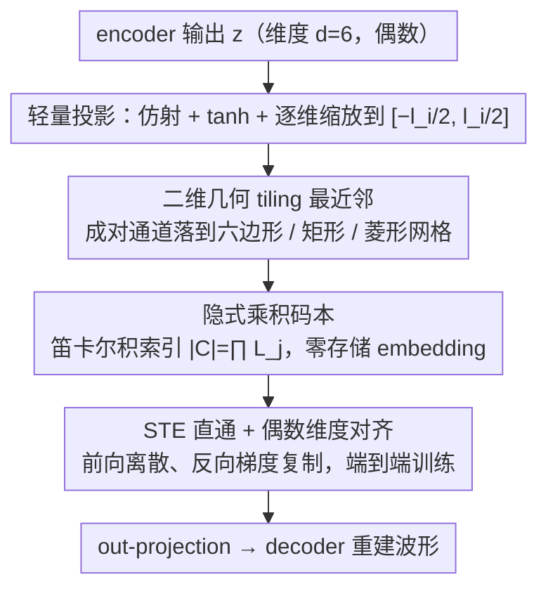

# Two-Dimensional Quantization for Geometry-Aware Audio Coding

**会议**: ICML 2026  
**arXiv**: [2512.01537](https://arxiv.org/abs/2512.01537)  
**代码**: https://github.com/tashQ/Q2D2 (有)  
**领域**: 神经音频编码 / 量化方法 / 语音表征  
**关键词**: 二维量化, 几何感知, 神经音频 codec, FSQ, 隐式码本

## 一句话总结
作者把神经音频 codec 中的标量量化器换成"成对通道 + 结构化二维网格"的几何量化器 Q2D2，用固定的六边形 / 矩形 / 菱形格点替代可学习码本，在单一 quantizer + 极低 token rate 下追平甚至超越 RVQ / VQ / FSQ 的语音重建质量。

## 研究背景与动机
**领域现状**：当前主流神经音频 codec（Encodec / DAC / WavTokenizer 等）都是「编码器 → 量化器 → 解码器」三段式结构，量化器普遍是 VQ-VAE、Residual VQ (RVQ) 或 Finite Scalar Quantization (FSQ) 三选一，输出离散 token 供下游音频 LLM 使用。

**现有痛点**：VQ / RVQ 训练不稳定，码本利用率随码本规模增大而急剧下降，需要 commitment loss、码本重启、随机扰动等一堆 trick；FSQ 用「逐通道独立标量量化」直接定义一个隐式乘积码本，回避了码本崩塌，但每个通道单独量化意味着完全忽略通道之间的相关性，表达能力被压缩到 1D 网格上。

**核心矛盾**：「码本利用率高」与「能建模通道相关性」似乎不可兼得 —— FSQ 选了前者牺牲后者，VQ 选了后者牺牲前者。

**本文目标**：(i) 保留 FSQ 的简洁性与高利用率；(ii) 在离散空间里重新引入通道间的几何结构；(iii) 在低 token rate 下追上甚至超过 SOTA 的语音重建质量。

**切入角度**：作者观察到 FSQ 的「1D 标量网格」其实可以自然推广到「2D 几何网格」—— 只要把通道两两配对，每对落到一个固定的二维 tiling 上，就同时获得了 (a) 隐式乘积码本带来的稳定性和 (b) 二维网格带来的通道相关性建模能力。

**核心 idea**：用「逐对通道 → 二维结构化网格上的最近邻量化」替代「逐通道独立标量量化」，把量化器从 1D scalar grid 升级为 2D geometric tiling，码本依然是隐式乘积码本，依然无需学习 embedding。

## 方法详解

### 整体框架
Q2D2 不动 codec 的整体骨架，只把 WavTokenizer 那条「encoder → 单 quantizer → decoder」流水线里的标量量化器，替换成一个把通道两两配对、再落到固定二维网格上做最近邻的几何量化器。它要回答的核心问题是：怎样在保留 FSQ「隐式乘积码本、无需学码本」的稳定性的同时，把被 FSQ 丢掉的通道间相关性重新捞回来。答案就是从「1D 标量网格」升级到「2D 几何 tiling」，码本依旧是隐式的，量化器本身几乎没有可学参数。

### 关键设计

**1. 二维几何 tiling：把成对通道的相关性写进离散网格**

FSQ 把每个通道单独压到一条 1D 标量线上，等于假设通道之间互不相关；Q2D2 的切入点是把维度 $d$（强制为偶数，文中最优 $d=6$）reshape 成 $P=d/2$ 个二维 pair，让每对 $z''_j=(z'_{2j-1}, z'_{2j})$ 整体落到一张预定义的二维网格 $\mathcal{G}_j$ 上，量化就是取最近邻 $\hat z''_j=\arg\min_{g\in\mathcal{G}_j}\lVert z''_j-g\rVert_2$。网格有三种形状——矩形（最朴素的正交格子）、六边形（二维平面的最优圆形密堆积，相邻点等距）、菱形（在矩形格点中间再补一层点，密度翻倍）。每种 tiling 都由 spread factor $e_i=(l_i-1)/2$ 控制扩展范围、由伪代码 Alg. 1/2/3 一次性离线算好后冻结，训练时完全不更新。

之所以「形状」会影响效果，是因为在固定点数下覆盖 $[-e,e]^2$ 越均匀，码本利用率就越高、量化误差越小。六边形是已知的最优 packing，理论上利用率最高；菱形则在 packing 效率和级数选择灵活性之间折中，实验里 rhombic 往往用略低的 level 数就能追平 hexagonal，而正交矩形因为忽略了对角方向的填充表现最差。这一步就是整篇文章的杠杆点：用「通道配对 + 二维 tiling」这个最小修改，把 1D 标量量化推广成几何感知量化。

**2. 隐式乘积码本 + 轻量投影：码本规模和 VQ 同级却零参数**

Q2D2 不显式存任何 embedding 码本，而是把码本定义成所有 pair 的二维网格的笛卡尔积：第 $j$ 对有 $L_j=l_{2j-1}\cdot l_{2j}$ 个格点，总码本大小 $|\mathcal{C}|=\prod_{j=1}^P L_j$，运行时只要把每对落到最近格点就能反推出离散索引。为了让 encoder/decoder 仍工作在熟悉的连续空间，量化前后各加一个线性投影：encoder 输出先仿射映到 $\mathbb{R}^d$、过 $\tanh$ 压到 $[-1,1]^d$，再逐维乘 $l_i/2$ 把第 $i$ 维 bound 到 $[-l_i/2, l_i/2]$（$l_i$ 即该维量化级数，实验稳定区间 $5\le l_i\le 11$），量化完再由一个轻量 out-projection 送回 decoder。

这样设计的回报是：VQ 的可学习码本显存随 $|\mathcal{C}|\cdot d$ 线性膨胀（4096 码本 × 512 维就吃掉约 2M 参数），而 Q2D2 的码本大小可以做到与 VQ 同量级，可学参数却只剩两个投影矩阵。更关键的是，码本是「写死的几何结构」而非「学出来的高维向量」，码本崩塌在数学上根本不存在，于是 commitment loss、entropy loss、EMA、码本重启这些 VQ 必备的 stabilization trick 全部可以删掉，训练目标变得很干净。

**3. STE 直通 + 偶数维度对齐：让离散量化能端到端训练**

二维最近邻里的 $\arg\min$ 是离散选择、不可导，Q2D2 用 Straight-Through Estimator 解决：前向照常做离散最近邻，反向时把 $\hat z''_j$ 的梯度直接复制给 $z''_j$，梯度就能穿过量化层回到 encoder，从而嵌进任意 codec 的端到端训练。维度 $d$ 必须是偶数才能干净地 reshape 成 pair，而实验里最优的 $d=6$（即 3 对通道）远小于 VQ 常用的几百维——这意味着不只量化器无参数，连 encoder 最后一层投影也跟着瘦了下来，整体推理 RTF 与 WavTokenizer 几乎持平（0.0039 vs 0.0032），显存稳定在约 820 MB。

### 一个完整示例
以一对通道走一遍：取 $d=6$ 中的第 1 对，量化级数 $l_1=l_2=9$，则 spread factor $e=(9-1)/2=4$。encoder 输出该对经 $\tanh$ 和逐维缩放后得到连续坐标，例如 $z''_1=(2.7, -1.3)$。若用矩形 tiling，最近整点是 $(3,-1)$；若用菱形 tiling，由于矩形格点中间多了半偏移的一层点，最近邻可能落到 $(2.5,-1.5)$ 这种中点，量化误差更小。该对的码本有 $9\times 9=81$ 个格点，3 对相乘得到隐式码本 $|\mathcal{C}|=81^3\approx 5.3\times 10^5$，全程没有任何存储的 embedding，只是把 $(3,-1)$ 这样的格点坐标编码成离散索引送给 decoder。

### 损失函数 / 训练策略
重建侧沿用 WavTokenizer 的对抗 + 多尺度谱重建损失，量化器侧 **完全不需要 commitment / entropy / 码本辅助损失**。优化器 AdamW，初始学习率 $8\text{e}{-5}$，cosine 衰减，batch=16，统一 24 kHz 采样，约 40 epoch；硬件 2× RTX 6000 48G 或 2× L40S 48G。

## 实验关键数据

### 主实验
两个对比设置：8K 小时 WavTokenizer 数据集，以及 150K 小时多语种 Emilia+MLS 数据集；评估指标 UTMOS（与人耳感知高度相关）、PESQ、STOI、V/UV F1，外加 MUSHRA 与 CMOS 主观打分。

| 数据集 | 模型 | Nq | token/s | UTMOS ↑ | PESQ ↑ | STOI ↑ |
|--------|------|----|---------|---------|--------|--------|
| LibriSpeech test-clean | GT | – | – | 4.09 | – | – |
| LibriSpeech test-clean | DAC | 12 | 600 | 4.00 | 4.15 | 0.95 |
| LibriSpeech test-clean | Encodec | 8 | 600 | 3.09 | 3.18 | 0.94 |
| LibriSpeech test-clean | **Q2D2 (rhombic)** | **1** | **333** | **4.07** | **3.79** | **0.96** |
| LibriSpeech test-clean | X-codec | 2 | 100 | 4.21 | 2.88 | 0.86 |
| LibriSpeech test-clean | Mimi | 8 | 100 | 3.56 | 2.80 | 0.91 |
| LibriSpeech test-clean | **Q2D2** | **1** | **166** | **4.07** | **3.36** | **0.95** |
| LibriSpeech test-clean | BigCodec | 1 | 80 | 4.11 | 3.27 | 0.93 |
| LibriSpeech test-clean | WavTokenizer | 1 | 75 | 3.79 | 2.63 | 0.90 |

关键观察：用 **单 quantizer + 333 token/s** 的 Q2D2 在 UTMOS 上追平 DAC 的 12 quantizer + 600 token/s 配置，STOI 反而更高；在 166 token/s 这一档全面碾压同 token 预算的 Mimi / Encodec / DAC。

### 消融实验
| 配置 | 关键观察 | 说明 |
|------|---------|------|
| Q2D2 (rhombic) | best PESQ / STOI / F1 | 菱形 tiling 在 ≤9 level 时 packing 最优 |
| Q2D2 (hexagonal) | 略低于 rhombic | 六边形需要更多 level 才能追上 |
| Q2D2 (rectangle) | 最差 | 正交格子忽略对角填充，浪费 2D 空间 |
| $d=6$ | 最优 | 太小欠表达，太大反而拖累训练 |
| $5\le l_i\le 11$ | 稳定区间 | 超出该范围利用率或重建质量下滑 |
| 无 commitment / 无 codebook reseed | 利用率仍接近 100% | 印证「隐式码本天然抗崩塌」 |

### 关键发现
- **几何形状真的有用**：菱形 > 六边形 > 矩形，差距主要来自 2D 平面 packing 效率，验证了「2D 几何结构 ≠ 1D 标量 × 2」的设计直觉。
- **token rate 可以打骨折**：Q2D2 用 166 token/s 单 quantizer 就追平了 DAC 600 token/s + 12 quantizer，对下游 audio LLM 是巨大的序列长度节省。
- **码本利用率近 100%**：不需要任何 commitment / entropy / reseed trick，纯靠隐式乘积码本结构。
- **几乎零额外参数**：Q2D2 唯一可学的就是两个线性投影层（与 $d$ 而非 $|\mathcal{C}|$ 成比例），相比 VQ 的 $|\mathcal{C}|\cdot d$ 学习码本能省到 2M+ 参数。

## 亮点与洞察
- **把 FSQ 推广到 $n$ 维网格**这一步极其自然，但作者第一次系统化地把它做到 2D 并且证明几何形状重要 —— 整篇文章的杠杆点就是「通道两两配对」这个最小修改。
- **隐式码本的真正威力**：当码本不是「学出来的高维 embedding」而是「写死的几何 tiling」时，码本崩塌问题在数学上根本就不存在 —— 这是 FSQ 系列方法相对 VQ 系列方法的根本优势，Q2D2 进一步证明了「几何结构本身可以编码相关性」。
- **可迁移性**：思路完全可以套到图像 tokenizer（替换 VQ-VAE codebook）、视频 codec、甚至 3D point cloud 量化；作者在 Appendix E 已经预告了 3D tiling 扩展。
- **降 quantizer 数量 = 给下游 LLM 减序列长度**，对 audio LLM / multimodal LLM 训练成本而言是直接的省钱手段。

## 局限与展望
- 只到 2D，理论上 3D / 高维结构化 tiling 可能更优，但文中只承诺为 future work（Appendix E）。
- 网格几何形状是离线手工选择的，没有自动搜索机制 —— 不同音频域（语音 / 音乐 / 通用音频）是否需要不同 tiling 仍未探索。
- spread factor $e_i$、level 数 $l_i$ 仍是超参，作者只在一个相对窄的窗口内做了网格搜索。
- 主要验证仍以语音为主（LibriTTS / LibriSpeech / LJSpeech），通用音频和音乐的对比表深度有限。

## 相关工作与启发
- **vs FSQ (Mentzer et al., 2023)**：FSQ 用 1D 标量乘积码本，Q2D2 升级到 2D 网格乘积码本，区别在于显式建模 pair 内通道相关性；劣势是必须配对（$d$ 必须偶数），优势是同 token 数下重建质量明显更高。
- **vs VQ / VQ-VAE**：VQ 学高维 embedding 码本，Q2D2 完全不学码本；Q2D2 输给 VQ 的是「码本完全自由」的灵活性，但赢回来的是稳定性、零码本参数、零辅助损失。
- **vs RVQ (Encodec / DAC)**：RVQ 用多层残差量化做高保真重建，但需要 8–12 个 quantizer 才能达到高质量；Q2D2 用 **单 quantizer** 就能匹敌，对下游序列长度更友好。
- **vs WavTokenizer (Ji et al., 2025b)**：WavTokenizer 已经把多层 RVQ 砍到单 VQ，但仍受 VQ 训练不稳定困扰；Q2D2 在同样 single-quantizer 框架下用隐式 2D 码本取代可学习 VQ 码本，得到更高的 PESQ / STOI / F1。

## 评分
- 新颖性: ⭐⭐⭐⭐ 把 FSQ 自然推广到 2D 几何 tiling，简洁优雅但创新粒度有限。
- 实验充分度: ⭐⭐⭐⭐ 覆盖 3 个域（语音 / 音乐 / 通用音频）+ 主客观 + 大规模 150K 小时多语种，但 3D 与图像迁移留作 future work。
- 写作质量: ⭐⭐⭐⭐ 算法伪代码、对比表、可视化图都齐全，方法部分公式与文字配合清晰。
- 价值: ⭐⭐⭐⭐ 单 quantizer + 166 token/s 的高质量 codec 对 audio LLM 时代极具实用价值。

<!-- RELATED:START -->

## 相关论文

- [\[ICML 2026\] Group Cognition Learning: Making Everything Better Through Governed Two-Stage Agents Collaboration](group_cognition_learning_making_everything_better_through_governed_two-stage_age.md)
- [\[ICLR 2026\] PrismAudio: Decomposed Chain-of-Thoughts and Multi-dimensional Rewards for Video-to-Audio Generation](../../ICLR2026/audio_speech/prismaudio_decomposed_chain-of-thoughts_and_multi-dimensional_rewards_for_video-.md)
- [\[ICML 2026\] Sparse Tokens Suffice: Jailbreaking Audio Language Models via Token-Aware Gradient Optimization](sparse_tokens_suffice_jailbreaking_audio_language_models_via_token-aware_gradien.md)
- [\[CVPR 2025\] Synchronized Video-to-Audio Generation via Mel Quantization-Continuum Decomposition](../../CVPR2025/audio_speech/synchronized_video-to-audio_generation_via_mel_quantization-continuum_decomposit.md)
- [\[CVPR 2026\] PAVAS: Physics-Aware Video-to-Audio Synthesis](../../CVPR2026/audio_speech/pavas_physics-aware_video-to-audio_synthesis.md)

<!-- RELATED:END -->
