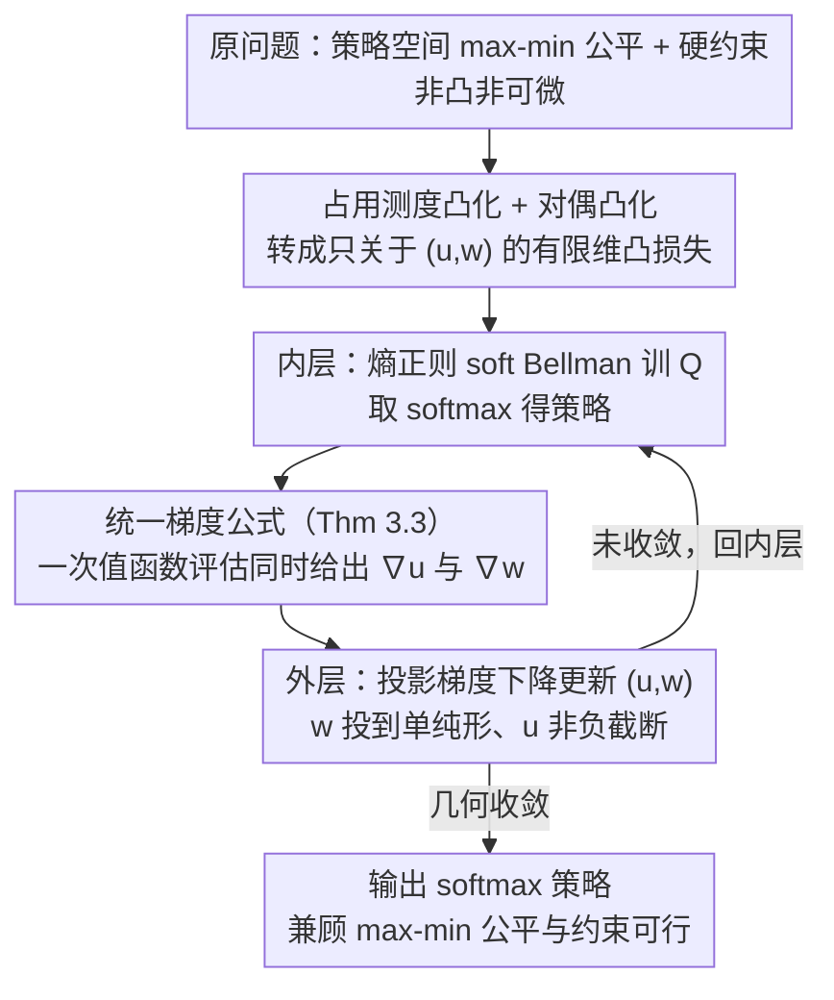

# Constrained Multi-Objective Reinforcement Learning with Max-Min Criterion

**会议**: ICML 2026  
**arXiv**: [2605.31388](https://arxiv.org/abs/2605.31388)  
**代码**: https://github.com/Giseung-Park/Constrained-Maxmin-MORL  
**领域**: 强化学习 / 多目标 RL / 约束优化  
**关键词**: max-min 公平性, 约束 MORL, 占用测度, 对偶凸优化, 投影梯度下降

## 一句话总结
本文把"max-min 多目标公平性"和"硬性约束满足"统一到同一个 MORL 框架中——通过占用测度 (occupancy measure) 重新表述为凸规划，再对偶出一个关于权重 $(u,w)$ 的凸优化问题，从而用一套投影梯度下降算法同时实现公平性和约束可行性，并给出几何收敛速率的理论保证。

## 研究背景与动机

**领域现状**：多目标强化学习 (MORL) 的主流做法是用标量化函数 $f(J_1(\pi),\ldots,J_K(\pi))$ 把多个回报合成一个标量再做单目标 RL。$f$ 线性时就是加权和 $\sum_k w_k J_k(\pi)$，简单但很难体现"公平"——比如某个十字路口，比起最小化所有方向的总等待时间，调度者其实更关心"最长等待时间最短"，这就是 max-min 公平 ($f=\min$)。

**现有痛点**：现有 max-min MORL 都假定无约束。但真实系统几乎都带硬性约束：调度器要在功耗预算内最大化吞吐量公平性，红绿灯要在温室气体排放上限内最小化最长等待时间。把约束塞进 max-min MORL 不是简单拼接——max-min MORL 算法本身要么只优化下界 (Fan 等 2023; Peng 等 2025) 不精确，要么靠高斯平滑得到有偏梯度 (Park 等 2024)；而成熟的约束 RL 方法 (CPO, RCPO, Lagrangian) 都是 $K=1$ 标量奖励，且面对 $f=\min$ 带来的不可微性束手无策。

**核心矛盾**：max-min 目标 $\min_k J_k(\pi)$ 在策略空间里是非凸非可微的，标准 Lagrangian 拉氏对偶分析失效；想加约束就必须找一个能同时驯服"非可微 max-min"和"不等式约束"的数学结构。

**本文目标**：建立一个能同时优化 $\min_k J_k(\pi)$ 和满足 $J_{K+l}(\pi)\ge C^{(l)}$ 的统一 MORL 框架，并配有可证收敛的算法。

**切入角度**：作者注意到，虽然 max-min 在策略空间是非凸的，但**在占用测度 $\rho(s,a)$ 空间却是凸的**——这是 Puterman 1994 的经典结论。把策略优化重写成关于 $\rho$ 的凸规划后，约束自然变成线性不等式，max-min 也变成 min-of-linear，整个问题成为标准凸规划，自然带 Lagrangian 对偶。

**核心 idea**：在占用测度上凸化原问题 → 求其熵正则化对偶 → 得到一个仅关于"约束乘子 $u$ + 目标权重 $w$"的凸优化问题 → 用投影梯度下降同时学这两组权重 → max-min 公平和约束满足在同一个迭代里被联合实现。

## 方法详解

### 整体框架

要解决的问题是：在一个 MOMDP $\langle\mathcal{S},\mathcal{A},T,\mu_0,r,\gamma\rangle$ 里，奖励 $r:\mathcal{S}\times\mathcal{A}\to\mathbb{R}^{K+L}$ 的前 $K$ 维要做"最差目标最优"的 max-min 公平、后 $L$ 维必须满足硬约束 $J\ge C$，最终输出一个 softmax 策略 $\pi(\cdot|s)=\mathrm{softmax}\{Q(s,\cdot)/\beta\}$。本文的转法是：先把策略空间里非凸非可微的原问题搬到占用测度空间凸化，再取它的熵正则对偶，把一切都浓缩成一个只关于"约束乘子 $u\in\mathbb{R}_+^L$ + 目标权重 $w\in\Delta^K$"的有限维凸优化。

落到算法上是一个内外双层迭代。内层固定 $(u,w)$，用 soft Bellman 迭代把 $Q$ 训到 $Q^*_{u,w}$，这等价于一个标量奖励为 $\sum_l u_l c^{(l)}+\sum_k w_k r^{(k)}$ 的熵正则单目标 RL 子问题；外层拿内层得到的 $\pi^*_{u,w}$ 估出梯度，对 $(u,w)$ 做一步投影梯度下降。两层共同求解的对偶损失是

$$\min_{u\in\mathbb{R}_+^L,\,w\in\Delta^K} \mathcal{L}(u,w) = \sum_s \mu_0(s)\,v^*_{u,w}(s) - \sum_{l=1}^L u_l C^{(l)}$$

其中 $v^*_{u,w}$ 是熵正则 Bellman 算子 $\mathcal{T}_{u,w}$ 的不动点。

### 关键设计

**1. 占用测度凸化 + 对偶凸化：把非可微 max-min 变成有限维凸优化**

痛点是 max-min 目标 $\min_k J_k(\pi)$ 在策略参数上既非凸又非可微，标准 Lagrangian 对偶分析直接失效，没法把约束干净地塞进来。本文的关键一步是不在策略 $\pi$ 上动手，而是换成占用测度 $\rho(s,a)$：此时原问题变成关于 $\rho$ 的凸规划——目标 $\max_\rho \min_k \sum_{s,a} r^{(k)}(s,a)\rho(s,a)$，约束是 Bellman flow 等式 (式 5) 加线性回报约束 (式 6)。再对这个凸规划取对偶，就得到只关于 $u$ 和 $w$ 的凸损失 $\mathcal{L}(u,w)$。之所以有效，是因为 $f=\min$ 的非可微性在对偶里自动被吸收掉了：max-min 等价于在单纯形 $\Delta^K$ 上对一族线性函数求 max，而单纯形约束的对偶恰好就是"学一组权重 $w$"。于是 max-min 公平和不等式约束被编码进同一个凸损失，既能用统一的梯度方法，又能直接套标准凸优化的收敛理论。

**2. 统一梯度公式（Theorem 3.3）：一次值函数评估同时给出 $\nabla_u$ 和 $\nabla_w$**

有了凸损失还需要能高效求梯度。作者证明 $\nabla_u v^*_{u,w}(s) = v_c^{\pi^*_{u,w}}(s)$、$\nabla_w v^*_{u,w}(s) = v_r^{\pi^*_{u,w}}(s)$，其中 $v_c,v_r$ 分别是用同一个熵正则策略 $\pi^*_{u,w}$ 评估约束奖励 $\{c^{(l)}\}$ 和目标奖励 $\{r^{(k)}\}$ 得到的多维值函数。也就是说在第 $m$ 轮里，先用当前 $(u^m,w^m)$ 拼出标量奖励 $[u^m;w^m]^\top[c;r]$ 训出 $Q$、取 softmax 得到 $\pi^m$，再拿 $\pi^m$ 分别评估约束侧和目标侧的值函数，$u$ 和 $w$ 的梯度方向就同时拿到了。这把"约束更新"和"max-min 权重更新"压成一次评估，省掉了两套梯度估计器和多份网络副本（对比 Park 等 2024 的高斯平滑需要维护多个网络）。两组梯度还各有清晰直觉：回报小的目标维度梯度也小、$w$ 更新后相对变大，自动放大短板，正好对应 max-min；违反约束的维度则把乘子 $u$ 推大，强制可行。

**3. 熵正则化 + 投影梯度下降：换来几何收敛速率**

要让上面的对偶问题既可解又稳定，作者在原始问题上加熵项 $\beta\sum_s\mathcal{H}_\rho(s)\rho(s)$。这一项身兼两职：理论上它让 $\pi^*_{u,w}(a|s)>0$ 处处严格为正，从而 Hessian $H[\mathcal{L}]$ 在 Slater 可行下正定、对偶变成强凸且 $\alpha$-光滑（$\alpha=\frac{1}{\beta(1-\gamma)}\sum_m (r_{\max}^{(m)}/(1-\gamma))^2$，Theorem 3.4），代价只是 $O(\beta\log|\mathcal{A}|/(1-\gamma))$ 的近似误差（Prop 3.1）；算法上它让内层 $Q$ 更新走闭式 soft Bellman 形式，免去 argmax 离散化。配 $l_w=1/\alpha$ 的步长，外层投影梯度下降给出几何收敛 $\|[u^m;w^m]-[u^*;w^*]\|_2 \le (1-\lambda/\alpha)^m \|[u^0;w^0]-[u^*;w^*]\|_2 + O(\epsilon)$（Theorem 3.6，$\epsilon$ 是 $Q$ 估计误差）。投影本身也简单：到 $\Delta^K$ 用 Wang & Carreira-Perpiñán 2013 的确定性 $O(K\log K)$ 算法，到 $\mathbb{R}_+^L$ 就是非负截断。相比 Lagrangian 拉氏法，投影梯度下降更稳——$u$ 不会发散到无穷，$w$ 始终落在单纯形上无需额外归一化。

### 损失函数 / 训练策略

外层目标是上面的凸损失 $\mathcal{L}(u,w) = \sum_s \mu_0(s) v^*_{u,w}(s) - \sum_l u_l C^{(l)}$；内层是熵正则 soft Bellman 更新 (式 13)：$Q(s,a) \leftarrow [u;w]^\top [c;r] + \gamma \sum_{s'} T(s'|s,a)\beta\log\sum_{a'}\exp(Q(s',a')/\beta)$。在连续状态空间扩展中（Building / MoAnt / Traffic 三个真实场景），作者用一个梯度网络 $g_\theta(s)\in\mathbb{R}^{L+K}$ 参数化估计 $\nabla v^*_{u,w}(s)$，配合 SAC 风格的 Q-网络做 deep 实现。关键超参 $\beta$ 在表 2 中扫了 $\{0.1, 0.03, 0.01, 0.003, 0.001\}$，$\beta=0.03$ 误差最低。

## 实验关键数据

### 主实验

作者在 tabular 设置和三个真实环境上做了验证。Tabular 用 LP 求最优值，直接看与最优值的误差。

| 设置 | 算法 | 指标 | 数值 | 对照 |
|------|------|------|------|------|
| Tabular MOMDP | **Constrained max-min (ours)** | 最优值误差 ↓ | **0.004** | unconstr. max-min: 0.325 / constr. max-avg: 0.657 / unconstr. max-avg: 1.008 |
| Building (建筑温控, $C_{th}=180$) | **Ours** | 功耗 / 最差组舒适度 ↑ | **178.7 / 639.8** | MA-SAC-L: 171.4 / 620.9（满足约束但短板低）；Max-min GS: 202.1 / 653.6（违约）；ARAM: 276.9 / 664.3（严重违约） |
| MoAnt-v5 ($C_{th}=50$) | **Ours** | 控制代价 / 最小回报 ↑ | **28.3 / 92.2** | MA-SAC-L: 47.8 / 83.0；MA-SAC: 275.3 / 98.8（违约）；ARAM: 620.7 / 101.3（严重违约） |
| Traffic 16-车道 ($C_{th}=70{,}000$) | **Ours** | CO₂ / 最差车道回报 ↑ | **69,147 / −25,229** | MA-CPGO: 67,887 / −27,830；Max-min GS: 73,162 / −21,527（违约）；ARAM: 88,748 / −19,700（严重违约） |

只有本文方法和"max-average + Lagrangian"两条线满足约束；而在所有满足约束的方法里，本文方法在三个真实场景的"最差组回报"都更高，证明 max-min 公平真的被实现了。

### 消融实验

| 配置 | 功耗 ($C_{th}=180$) | 最差组回报 | 说明 |
|------|-------------------|------------|------|
| Full model | 178.7 | 639.8 | 完整算法（联合 $(u,w)$ 更新） |
| w/o $w$ update | 178.1 | 626.7 | 不学 max-min 权重 → 最差组回报掉 13 |
| w/o $u$ update | 200.7 | 653.5 | 不学约束乘子 → 功耗违约 (>180) |
| w/o $(u,w)$ update | 222.0 | 646.9 | 两者都不学 → 既违约又不公平 |

### $\beta$ 敏感性扫描（tabular）

| $\beta$ | 0.1 | 0.03 | 0.01 | 0.003 | 0.001 |
|---------|-----|------|------|-------|-------|
| 最优值误差 | 0.061 | **0.004** | 0.009 | 0.020 | 0.021 |

### 关键发现

- **$u$ 和 $w$ 是互补的两条腿**：消融显示去掉 $w$ 更新短板就掉，去掉 $u$ 更新就违约；同步更新是必要的，这从经验上印证了 Theorem 3.3 把两个梯度统一处理的合理性。
- **$\beta$ 不能太大也不能太小**：$\beta=0.1$ 偏离原 max-min 太远（Prop 3.1 的近似误差 $O(\beta\log|\mathcal{A}|/(1-\gamma))$ 显著）；$\beta<0.01$ 又让外层收敛系数 $\lambda/\alpha$ 变小（$\alpha \propto 1/\beta$ 爆炸），最优值需要更多迭代。$\beta\in[0.01, 0.03]$ 是甜点。
- **现有 max-min MORL 方法都违约**：Max-min GS（Park 等 2024）和 ARAM（Byeon 等 2025）在三个真实场景全部违反约束——这恰好说明"约束 MORL"不是"max-min MORL + 拉氏惩罚"能简单拼出来的，必须从对偶结构入手统一处理。
- **MA-SAC-L 的劣势**：它只能在标量化后追求 max-average 同时满足约束，无法在多个目标之间做 max-min 公平，所以三个场景下"最差组回报"都被本文方法压一头。

## 亮点与洞察

- **占用测度凸化是 MORL 里被低估的工具**：策略空间里非凸的东西，到占用测度空间往往就凸了；这一观察让本文绕开了所有处理 $\min$ 次梯度的麻烦，把硬问题转成有限维凸规划。这个套路在带 max-min / max-of-min / 分位数等非可微目标的 MORL 里都可以复用。
- **统一梯度形式 (Theorem 3.3) 优雅得令人意外**：$\nabla_u \mathcal{L}$ 和 $\nabla_w \mathcal{L}$ 居然只是用同一个熵正则策略评估两个不同奖励通道得到的值函数，工程上意味着可以共享一套 critic 网络、只换通道，几乎零额外开销。
- **熵正则的"三合一"作用**：(1) 把 hard-min 软化以保唯一性；(2) 让 softmax 策略处处为正，保证对偶 Hessian 正定；(3) 让内层 Q 更新有闭式 soft Bellman 形式。这种"为了对偶可分析性而设计正则"的做法可以迁移到任何带 Lagrangian + 非凸 RL 目标的场景，例如分位数 RL、CVaR-RL。
- **可迁移设计**：把"目标维度权重 $w$"和"约束乘子 $u$"放进同一个单纯形 × 锥的投影梯度下降框架，对其他 fair-constrained 任务（fair federated learning、fair-RLHF）都有借鉴价值——它们也面临"多组体验公平 + 全局预算"的双重需求。

## 局限与展望

- **理论 only 在 tabular 且有限 $|\mathcal{S}|, |\mathcal{A}|$ 下成立**：Theorem 3.6 的几何收敛需要 Hessian 严格正定（依赖 Assumption），真实场景下用神经网络近似时 Assumption 是否成立没有理论保证，附录 F.4 只是补了"不满足 Assumption 时的兜底分析"。
- **$\beta$ 是超参且与收敛速率耦合**：$\alpha \propto 1/\beta$ 直接进入收敛系数 $\lambda/\alpha$，理论上 $\beta$ 应大到足以让 $\alpha$ 可控、又要小到逼近原 max-min，实际只能扫超参。能否做"自适应 $\beta$"是个开放问题。
- **$L \ge 2$ 多约束未做系统实验**：所有真实场景都只有 1 个约束 ($L=1$)，理论上框架支持多约束但实际表现未知；且多约束下 Slater 条件（严格可行）也更难满足。
- **$K$ 较大时 $\Delta^K$ 投影虽是 $O(K\log K)$，但梯度方差可能增大**：Traffic 场景 $K=16$ 已经是文中规模上限，更大 $K$（比如 $K=100$）下 $w$ 学习是否仍稳定需要进一步验证。
- **未与 multi-policy MORL 直接对比**：本文是 single-policy 路线（输出一个对应给定 $f=\min$ 的策略），没有与"学一整族 Pareto 前沿策略"的方法（如 PD-MORL、CAPQL）做正面比较，定位上有意区分但读者可能想知道两类方法的实际取舍。

## 相关工作与启发

- **vs Park 等 2024（高斯平滑 max-min MORL）**：他们用高斯平滑估梯度，需要维护多个网络副本，且因高斯平滑把凸函数变成凸上界使梯度有偏；本文用对偶 + Theorem 3.3 得到**精确**梯度，单一网络足够，且自然扩展到带约束设定。
- **vs Byeon 等 2025 (ARAM)**：他们把 max-min 当作两人零和博弈，靠 game-theoretic 思想求解但**不支持约束**；本文方法在三个真实场景里 ARAM 都严重违反约束，验证了"约束不能事后拼接"。
- **vs CPO / RCPO / Lagrangian 系列约束 RL**：这些都假定 $K=1$ 标量奖励，目标可微；面对 $f=\min$ 时它们要么不可应用要么需要 ad-hoc 改造。本文在对偶里同时容纳约束乘子 $u$ 和目标权重 $w$，结构上更干净。
- **vs Lee 等 2022（凸 occupancy 离线约束 RL）**：思路相近——都靠占用测度凸化，但 Lee 等只做 $K=1$ 标量奖励、离线设定，不涉及 max-min 公平也无收敛分析。
- **vs Huang 等 2021 / Kim 等 2025a（preference-conditioned constrained MORL）**：他们学一个以偏好向量为条件的策略族，需要事后选偏好；本文直接求解单策略约束 max-min 优化，避免了"如何选偏好才能对应 max-min 最优"这个 open question。

## 评分
- 新颖性: ⭐⭐⭐⭐⭐ 把约束硬塞进 max-min MORL 是真实痛点，且对偶凸化 + 统一梯度的解法在 MORL 文献里第一次出现。
- 实验充分度: ⭐⭐⭐⭐ tabular + 三个真实场景 + $\beta$ 扫描 + 消融齐全，但多约束 ($L\ge 2$) 和大 $K$ ($K>16$) 留白。
- 写作质量: ⭐⭐⭐⭐⭐ 理论推导和算法逻辑层层递进，每个 Proposition / Theorem 都服务于下一步算法设计，叙事干净。
- 价值: ⭐⭐⭐⭐⭐ 给约束公平 RL 提供了第一个有收敛保证的统一框架，对资源调度、流量控制、可持续 AI 等场景有直接应用价值。

<!-- RELATED:START -->

## 相关论文

- [\[CVPR 2026\] RLFTSim: Realistic and Controllable Multi-Agent Traffic Simulation via Reinforcement Learning Fine-Tuning](../../CVPR2026/autonomous_driving/rlftsim_realistic_and_controllable_multi-agent_traffic_simulation_via_reinforcem.md)
- [\[CVPR 2026\] ReMoT: Reinforcement Learning with Motion Contrast Triplets](../../CVPR2026/autonomous_driving/remot_reinforcement_learning_with_motion_contrast_triplets.md)
- [\[NeurIPS 2025\] BayesG: Bayesian Ego-Graph Inference for Networked Multi-Agent Reinforcement Learning](../../NeurIPS2025/autonomous_driving/bayesian_ego-graph_inference_for_networked_multi-agent_reinforcement_learning.md)
- [\[CVPR 2026\] W2W: Language-Model-Based Trajectory Prediction with Reinforcement Learning](../../CVPR2026/autonomous_driving/w2w_language-model-based_trajectory_prediction_with_reinforcement_learning.md)
- [\[ICML 2025\] R3DM: Enabling Role Discovery and Diversity Through Dynamics Models in Multi-agent Reinforcement Learning](../../ICML2025/autonomous_driving/r3dm_enabling_role_discovery_and_diversity_through_dynamics_models_in_multi-agen.md)

<!-- RELATED:END -->
