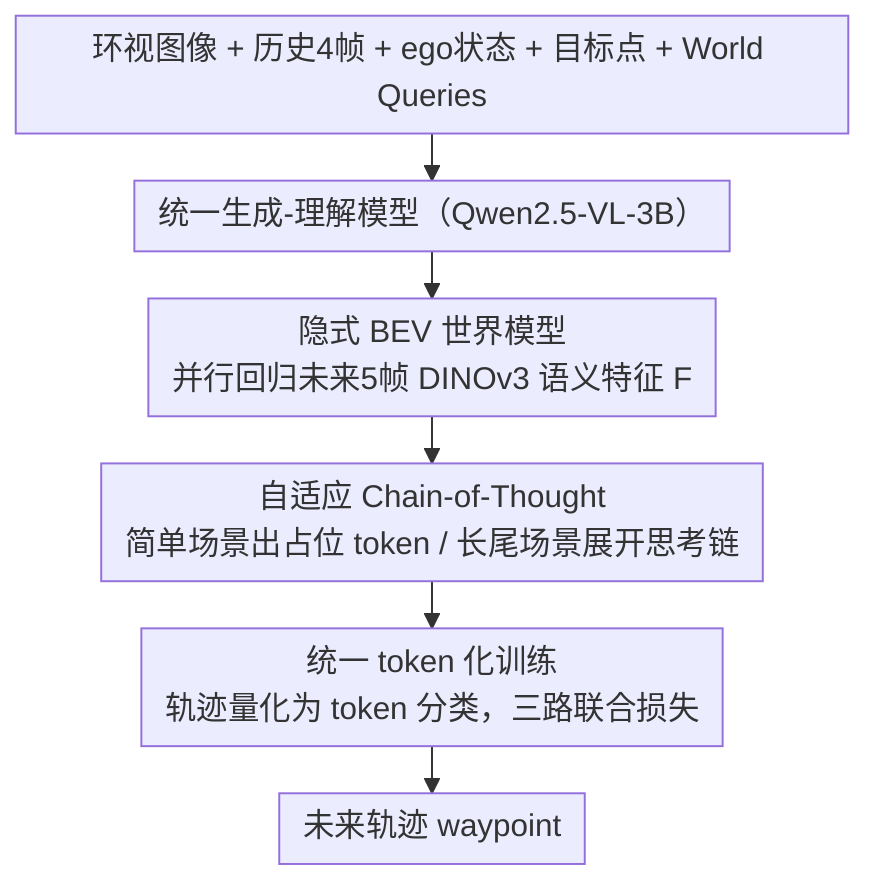

# DeepSight: Long-Horizon World Modeling via Latent States Prediction for End-to-End Autonomous Driving

**会议**: ICML 2026  
**arXiv**: [2605.10564](https://arxiv.org/abs/2605.10564)  
**代码**: https://github.com/hotdogcheesewhite/DeepSight  
**领域**: 自动驾驶 / VLM / 世界模型 / 端到端规划  
**关键词**: 端到端驾驶, 世界模型, 隐式语义特征, BEV 长时预测, 自适应 CoT

## 一句话总结
DeepSight 把"未来世界预测"从显式像素重建（codebook 单帧）换成在 BEV 空间对 DINOv3 语义特征做**多帧并行隐式预测**，再叠加一个按需触发的 Adaptive Chain-of-Thought，让 Qwen2.5-VL-3B 在 Bench2Drive 闭环上 Driving Score 86.23 (+7.39)、Success Rate 71.36% (+13.63)，且只多 ~4% 推理延迟。

## 研究背景与动机
**领域现状**：端到端自动驾驶最近大量接入 VLM/MLLM——拿预训练里的世界知识 + 语言推理来增强决策。一类方法（EMMA、SimLingo、ORION）走"文本 CoT"路线，把场景描述、推理过程显式写成自然语言；另一类（FSDrive、HERMES、ReasonPlan）走"统一生成-理解"，让 VLM 直接预测未来帧（像素或 LiDAR）当作世界模型。

**现有痛点**：作者指出三个具体问题。(1) 视觉表征形式不对：用 codebook 自回归预测未来帧偏重纹理却丢语义，对驾驶决策无效；(2) 时间跨度太短：现有 world model 大多只预测 0.5 秒未来，远不足以支撑安全轨迹规划；(3) 视角太窄：主流只看前视，没建模周围 agent，复杂交互场景容易出事故。

**核心矛盾**：理想的驾驶 world model 需要同时具备**精准语义理解 + 精确空间定位 + 长时运动建模 + 快速响应**四样能力，但现有方案各有取舍：显式像素重建慢且偏纹理、文本 CoT 慢且空间不准、前视输入丢失环视信息。

**本文目标**：(1) 用一种"重语义、轻纹理"的表征来当未来世界 ground truth；(2) 一次前向就能预测多帧未来；(3) 在 BEV 空间统一感知，并按需调用 CoT。

**切入角度**：作者观察到 DINOv3 这类自监督特征本身就富含语义，恰好可以当"未来 BEV 世界"的 GT；而预测**隐式特征**比预测**像素 token** 节省巨量算力，从而支持长时多帧并行预测；同时 CoT 应该是稀缺资源——只在长尾场景才触发，不该每帧都调用。

**核心 idea**：用一组可学习的 World Queries 一次性并行预测未来 5 帧的 DINOv3 BEV 语义特征作为 world modeling 目标，配上一个由模型自主决定是否激活的 Adaptive CoT，把"世界建模"和"语言推理"解耦但联动。

## 方法详解

### 整体框架
DeepSight 要解决的是"VLM 怎么当一个又快又准的驾驶世界模型"，做法是以 Qwen2.5-VL-3B 为底座构建统一生成-理解模型 $M_{\text{uni}}$，让它把对未来世界的"预测"从渲染像素帧改成回归 BEV 上的语义特征。模型一次前向就吃下当前 $N$ 路环视图像 $\mathbf{I}_t$、历史 4 帧 $\mathbf{I}_{t-\tau}$、ego 状态 $T_{\text{ego}}$、目标点 $T_{\text{target}}$ 和 5 个 World Queries $\mathbf{Q}_{\text{world}}=[q_0,\dots,q_4]$，同时吐出三样东西：未来 5 帧 BEV 隐式特征 $\mathbf{F}=[f_0,\dots,f_4]$（帧间隔 $\Delta t=0.5\text{s}$，覆盖未来 2 秒）、自适应 CoT 文本 $T_{\text{cot}}$、未来轨迹 token $\mathbf{P}_t$。三者按"先建模世界、再思考、后行动"的因果顺序联合分解为 $p(\mathbf{F}\mid\mathcal{X})\cdot p(T_{\text{cot}}\mid\mathcal{X},\mathbf{F})\cdot p(\mathbf{P}_t\mid\mathcal{X},\mathbf{F},T_{\text{cot}})$ 解码，物理上对齐人类司机"先看清局面再决策"的流程。

### 关键设计

**1. 隐式 BEV 世界模型：把"预测未来帧"换成"预测未来语义"**

世界建模这一步针对的是现有 VLM world model 的两个老毛病——用 codebook/VAE 自回归重建未来帧既慢又偏纹理、丢语义，而且大多只能看 0.5 秒的短未来。DeepSight 的做法是给模型注入 5 个 BEV 形状的可学习 World Queries $q_k\in\mathbb{R}^{h_{\text{bev}}\times w_{\text{bev}}\times d_{\text{bev}}}$，每个 query 绑定一个未来时刻 $t+k\Delta t$，通过 transformer 自注意力与历史/当前多视图特征交互，**一次性并行回归**出 5 帧隐式特征 $f_k$，而不是逐帧自回归滚动。监督信号来自 DINOv3：在 BEV 渲染图（或语义分割图）上提取 $f_i=\phi_{\text{dino}}(I_i^{bev})$ 当作 ground truth，用 $L_{\text{world}}=\mathrm{MSE}(\mathbf{F},\mathbf{F}^{\text{gt}})$ 做特征级蒸馏。

之所以有效，是因为 DINOv3 这类自监督特征天然 encode 物体、形状和语义关系，正好契合驾驶任务真正在意的"前面那辆车要不要让"，而不必把模型容量浪费在纹理细节上；同时预测一个语义浓缩的 latent 比预测像素 token 便宜得多，长时多帧预测才变得可行。Table 3 的对照很能说明问题：VAE 表示单帧只有 27.75 DS、扩到五帧反而崩到 14.66，而 DINOv3 单帧已达 74.79、五帧再涨到 86.57——只有"语义 + 长时"这对组合才真正起作用。

**2. 自适应 Chain-of-Thought：让模型自己决定要不要"想"**

CoT 推理虽强但慢，如果每帧都调 LLM 会直接拖垮实时性，所以 DeepSight 把它做成稀缺资源、按需触发。在预测完 $\mathbf{F}$ 之后，模型自回归生成 CoT 文本 $T_{\text{cot}}=M_{\text{uni}}(\mathbf{I}_t,\dots,\mathbf{Q}_{\text{world}}\mid\mathbf{F})$：若判断当前是普通跟车/直行这类简单场景，就只输出一个占位 token $T_{\text{cot}}^{\emptyset}$ 跳过推理；若遇到复杂红绿灯、施工区、紧急车辆让行这类长尾场景，才展开完整的结构化思考链。CoT 的训练数据由 Qwen3-VL-235B 通过三步自动标注 pipeline（场景复杂度评估 → 复杂度驱动的外部知识检索 → 行为决策）合成，共 1.3M 条 Bench2Drive 标注。

这种"按需 think"的元能力既保留了长尾场景下的社会常识与逻辑推理，又把额外延迟压在 4% 左右（Table 6）。Table 5 也印证了 CoT 的定位是补强而非主菜：单纯启用 CoT（无 world model）只有 69.87 DS，远不如单独 world model 的 84.52，二者结合才到 86.23。

**3. 统一 token 化训练：把轨迹、文本、特征三种异构输出装进同一框架**

三种输出形态各异（轨迹是坐标、CoT 是文本、世界状态是 dense 特征），若各配一个 head 会带来解耦优化的麻烦。DeepSight 的处理是把 BEV 网格离散成 $K$ 个 cell，每个 waypoint $p_i=(x_i,y_i)$ 量化成 token index $t_i\in\{1,\dots,K\}$，于是"轨迹预测"退化成 token 分类，能和 CoT 文本共用 VLM 的 token 训练范式、复用其预训练对齐能力；而 World Query 单独走特征回归路径（MSE）以保持 dense 表征精度。最终用一个加权混合损失把三条路径拧到一起：

$$L=\lambda_{\text{traj}}L_{\text{traj}}+\lambda_{\text{cot}}L_{\text{cot}}+\lambda_{\text{world}}L_{\text{world}}$$

其中 $L_{\text{traj}}$、$L_{\text{cot}}$ 是 CE，$L_{\text{world}}=\mathrm{MSE}(\mathbf{F},\mathbf{F}^{\text{gt}})$。这样"轨迹 = 一种特殊文本"的统一视角，让模型在同一 token 空间里联合学习世界建模、语言推理和轨迹规划，避开了多 head 各自为政的优化困难。

### 损失函数 / 训练策略
基座 Qwen2.5-VL-3B；64 张 H20-96GB；lr $2\times10^{-5}$，batch 128，Bench2Drive 训 2 epoch。轨迹覆盖未来 2 秒，每 0.5 秒一个 waypoint。CoT 文本通过 235B teacher 自动合成。

## 实验关键数据

### 主实验
Bench2Drive（CARLA V2 闭环，220 路线 × 44 场景）下与 SOTA 对比（同 Think2Drive expert 协议）：

| 方法 | Paradigm | DS↑ | SR(%)↑ | Efficiency↑ |
|------|----------|-----|--------|-------------|
| VAD | E2E | 42.35 | 15.00 | 157.94 |
| DriveTrans | E2E | 63.46 | 35.01 | 100.64 |
| ReasonPlan | VLM | 64.01 | 34.55 | 180.64 |
| ORION | VLM | 77.74 | 54.62 | 151.48 |
| AutoVLA (前 SOTA) | VLM | 78.84 | 57.73 | 146.93 |
| **DeepSight w/o CoT** | VLM | **84.52 (+5.68)** | **65.91 (+8.81)** | **198.80** |
| **DeepSight (full)** | VLM | **86.23 (+7.39)** | **71.36 (+13.63)** | **201.71** |

多能力子任务 (Table 2) 上 DeepSight 平均 70.20% (+15.48)，其中 overtaking 91.11%、emergency brake 78.33%、merging 60.00%，远超 ORION 的 54.72%。

### 消融实验

| 设置 | DS↑ | SR↑ | 说明 |
|------|-----|-----|------|
| Base (无 WM 无 CoT) | 58.16 | 28.18 | 纯轨迹解码 |
| + Adaptive CoT only | 69.87 | 42.27 | CoT 提升有限 |
| + World Model only | 84.52 | 65.91 | WM 是性能主力 |
| **+ WM + CoT (full)** | **86.23** | **71.36** | 互补叠加 |

世界模型表示形式与时长（Dev 10 路线）：

| 表示 | 帧数 | RC↑ | DS↑ |
|------|------|------|------|
| VAE | 1 | 47.56 | 27.75 |
| VAE | 5 | 27.02 | **14.66** (长时反而崩) |
| DINOv3 | 1 | 90.49 | 74.79 |
| DINOv3 | 5 | 95.95 | **86.57** (+11.78) |

视角对比：前视 DS=77.77 vs BEV DS=86.57，BEV 提升 8.8 DS。

### 关键发现
- **世界模型是性能主力**：去掉 WM 直接掉 26+ DS，去掉 CoT 只掉 1.71 DS——说明语义长时预测才是闭环驾驶能力的根本，CoT 是补强。
- **隐式特征 + 长时缺一不可**：VAE codebook 表示在 5 帧场景下反而比单帧更差（14.66 vs 27.75），暴露了像素级表征无法承担长时建模；DINOv3 反之单帧已经强、加帧数还能再涨——这是论文最有说服力的对照。
- **延迟开销极小**：相比原生 VLM，DeepSight 仅 +3.57% 延迟，加 CoT 总共 +7.69%；而显式 FSDrive 要 +60.71%——并行 latent 预测 + 按需 CoT 的设计实质性地把效率提了一个数量级。

## 亮点与洞察
- **从"预测像素"到"预测语义特征"是核心范式转变**：DINOv3 作为 GT 把 world model 的训练目标从"渲染未来帧"换成"对齐未来语义"，对决策任务来说这是更接近 oracle 的监督信号；这种"用自监督特征当 distillation target"的思路可以推广到任何不需要像素细节、只需要语义状态的下游任务（机器人操作、视频问答等）。
- **World Queries 实现一次性长时预测**：避免自回归式逐帧滚动累积误差和延迟，本质是把"时间维"从解码循环里拿出来变成"并行 query 维"——这一招在视频生成、轨迹规划、未来状态预测里都有潜力。
- **Adaptive CoT 的"按需触发"是工程上很务实的设计**：用模型自身的占位 token 机制控制 CoT 开关，省下绝大多数无意义推理；这种"模型自己决定要不要 think"的元能力可能是未来 agent 系统的标配。
- **多输出共训 + 联合分布分解**：把 $p(\mathbf{P}_t,T_{\text{cot}},\mathbf{F}\mid\mathcal{X})$ 因子化为可解释的因果顺序（先世界 → 再思考 → 再行动），物理上和人类司机决策流程对齐，也方便单独 ablate 每个组件。

## 局限与展望
- 实时性虽好但仍依赖 H20 集群训练，部署到车端 SoC 时 3B VLM 的推理仍是挑战；作者明确说未来要做更轻量的 world model。
- 只在 Bench2Drive 闭环和 nuScenes 开环上验证，没在真实路测、雨雪夜等极端条件下做评估；DINOv3 在罕见天气下的特征质量本身就是开放问题。
- Adaptive CoT 的触发逻辑由模型自学，缺乏可解释/可控的开关——一旦在长尾场景误判为"无需 CoT"，安全性会被影响；可考虑加保守 fallback 机制。
- World Queries 数量 5、覆盖 2 秒是经验值，没扫描更长时间窗（4 秒、8 秒）的效果；更长的 horizon 可能因为不确定性爆炸而不再受益。
- 与 PDM-Lite 路线（如 SimLingo DS=85.94）相比 DeepSight 用更弱的 Think2Drive expert 仍能持平甚至超过，但 cross-expert 公平比较没充分展开。

## 相关工作与启发
- **vs FSDrive**：FSDrive 也用 VLM 当 world model，但显式预测下一帧图像（codebook 自回归），延迟 +60.71% 且只看单步未来；DeepSight 用隐式特征 + 5 帧并行，把延迟压到 +3.57% 且能 long-horizon。
- **vs ORION**：ORION 把 VQA 任务整合到轨迹规划，靠 VLM 做语义推理，没有显式 world modeling；DeepSight 在 Bench2Drive 多能力指标上比 ORION 高 15.48%，说明只有 reasoning、缺空间-时间预测，在闭环场景还是不够。
- **vs EMMA / SimLingo**：纯文本 CoT 路线把所有信息编码进语言再让 LLM 推理，效率低且空间不准；DeepSight 把 spatial reasoning 留给 BEV 特征预测，把 commonsense reasoning 留给 adaptive CoT，各司其职。
- **vs HERMES**：HERMES 让 LLM 同时预测 LiDAR 点云和场景理解，关注点云生成质量；DeepSight 不依赖 LiDAR、只用环视图像，且把生成目标从原始模态换成压缩后的语义 latent。

## 评分
- 新颖性: ⭐⭐⭐⭐ "隐式语义特征 + 并行多帧 World Query + 按需 CoT" 的组合在端到端驾驶里是新颖的范式，单看每个组件源自已有工作但组装巧妙。
- 实验充分度: ⭐⭐⭐⭐⭐ Bench2Drive 220 路线闭环 + nuScenes 开环 + 多能力子任务 + 三类 ablation（表示形式、视角、CoT）+ 延迟分析全覆盖。
- 写作质量: ⭐⭐⭐⭐ 动机 → 方法 → 实验链条紧凑，Fig. 1 一眼说明 paradigm 差异；公式偏少但结构清晰。
- 价值: ⭐⭐⭐⭐⭐ Bench2Drive DS/SR 双榜均刷新 SOTA、延迟开销极小、代码开源，对工业 E2E 驾驶 stack 有直接参考价值。

<!-- RELATED:START -->

## 相关论文

- [\[ICLR 2026\] ResWorld: Temporal Residual World Model for End-to-End Autonomous Driving](../../ICLR2026/autonomous_driving/resworld_temporal_residual_world_model_for_end-to-end_autonomous_driving.md)
- [\[ICCV 2025\] World4Drive: End-to-End Autonomous Driving via Intention-aware Physical Latent World Model](../../ICCV2025/autonomous_driving/world4drive_end-to-end_autonomous_driving_via_intention-aware_physical_latent_wo.md)
- [\[CVPR 2026\] ResAD: Normalized Residual Trajectory Modeling for End-to-End Autonomous Driving](../../CVPR2026/autonomous_driving/resad_normalized_residual_trajectory_modeling_for_end-to-end_autonomous_driving.md)
- [\[CVPR 2026\] WOD-E2E: Waymo Open Dataset for End-to-End Driving in Challenging Long-tail Scenarios](../../CVPR2026/autonomous_driving/wod-e2e_waymo_open_dataset_for_end-to-end_driving_in_challenging_long-tail_scena.md)
- [\[NeurIPS 2025\] Prioritizing Perception-Guided Self-Supervision: A New Paradigm for Causal Modeling in End-to-End Autonomous Driving](../../NeurIPS2025/autonomous_driving/prioritizing_perception-guided_self-supervision_a_new_paradigm_for_causal_modeli.md)

<!-- RELATED:END -->
