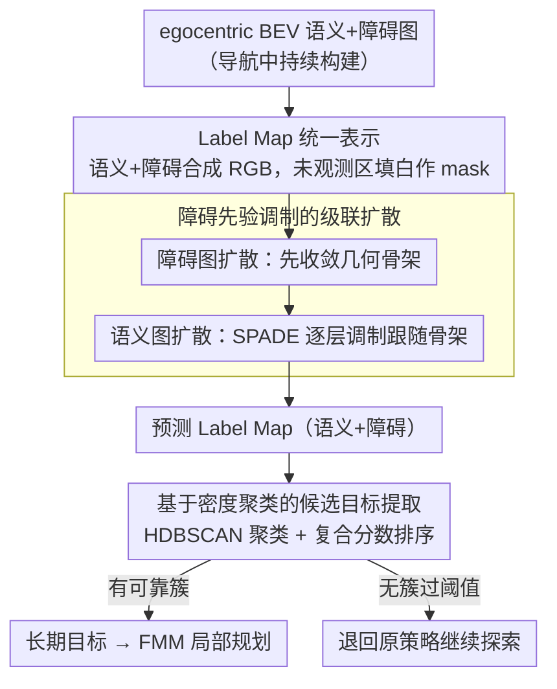

# Plug-and-Play Label Map Diffusion for Universal Goal-Oriented Navigation

**会议**: ICML 2026  
**arXiv**: [2605.05960](https://arxiv.org/abs/2605.05960)  
**代码**: 未公开  
**领域**: 具身导航 / BEV 地图补全 / 扩散模型  
**关键词**: 目标导向导航、Label Map、DDPM、SPADE 调制、HM3D、MP3D

## 一句话总结
本文提出 PLMD：把 BEV 语义图与障碍图合并成 Label Map，用 DDPM 在障碍先验调制下补全未探索区域的语义+障碍标签，作为即插即用模块挂在任意 GON 策略上，在 ON / IIN / MRON 三类任务的 HM3D/MP3D 上一致刷新 SOTA。

## 研究背景与动机
**领域现状**：目标导向导航（GON）含三大子任务：物体类别导航 ObjectNav、实例图像导航 IIN、多机器人 ObjectNav (MRON)。主流模块化方法构建 egocentric 语义 BEV 地图，再用 RL/LLM 在地图上规划长期目标点（SemExp、IEVE、3D-Mem、Co-NavGPT 等）。

**现有痛点**：模块化方法的命门是「只有观察到的区域有语义」——机器人需要走遍整个房间才能定位目标，效率极差。已有工作（Ji et al. 2024、Li et al. 2025）尝试用扩散模型在语义 BEV 上补全未知区域，但只学「语义之间的统计相关」（如桌椅常共现），忽略了「障碍布局」这个更刚性的结构先验，结果在未观测区域出现房间边界漂移、墙壁穿模、物体长在墙上等语义幻觉。

**核心矛盾**：BEV 与自然图像不同——大片是 free space，物体像素稀疏；纯语义扩散得不到稳定的几何骨架。但「障碍/墙壁的几何结构」在房屋内部具有非常强的可学统计规律（墙必须封闭、门口连通），如果先把障碍补全再用障碍调制语义，就能避免「想象出穿墙物体」。

**本文目标**：(1) 在不重新训练任何 GON 策略的前提下，提供未观测区域的合理语义+障碍预测；(2) 显式利用障碍先验解决语义幻觉；(3) 兼容 RL/SSL/LLM 三种导航范式。

**切入角度**：把语义图与障碍图合并成 Label Map 用统一调色板可视化，分两个串行扩散网络——障碍图先验稳定 → 通过 SPADE 残差调制语义图扩散，让语义生成在每个去噪步都被几何骨架约束。

**核心 idea**：「障碍先生 + 语义跟随」的级联扩散补全，配合 HDBSCAN 聚类从预测 Label Map 中提取候选目标，整个模块完全 plug-and-play。

## 方法详解

### 整体框架
PLMD 要解决的是模块化导航的「只有走过才有语义」难题：在不动任何导航策略的前提下，把已观测的 BEV 语义图与障碍图合并成一张可视化 Label Map，再用级联扩散把未观测区域的语义和障碍一起补全，让策略提前「看到」目标可能在哪。机器人正常导航时持续构建 egocentric 语义+障碍 BEV $M_t\in\mathbb R^{(n+4)\times H\times W}$（$n$ 个语义通道 + 占用/自由空间/位置），把它渲染成 Label Map 并对未观测区域打 mask；扩散模块先补障碍图再补语义图，得到预测 Label Map $L_t^P=[S_t^P,C_t^P]$；最后在补全图上用密度聚类找出目标类别的可靠落点作为长期目标，交给 FMM 局部规划，找不到可靠簇就退回原策略继续探索。整个过程从导航第 100 步起每 50 步刷新一次。

### 关键设计

**1. Label Map 统一表示：让扩散直接复用图像 inpainting 工具链**

直接对 $n+4$ 个通道做扩散需要从零设计 backbone，工程成本高。PLMD 改用一张三通道彩色图统一承载语义与障碍：用固定调色板把 $n+2$ 类标签映射成不同 RGB，未观测区域填白色当作 inpainting 的 mask，于是成熟的 DDPM/U-Net 图像补全经验可以原样套用。输出端再按同一调色板反查，得到预测语义 vector $S_t^P\in\mathbb R^{n\times H\times W}$ 与障碍 vector $C_t^P\in\mathbb R^{2\times H\times W}$，拼成 $L_t^P=[S_t^P,C_t^P]$。调色板本身把语义类别离散化，也顺带降低了相邻类别的混淆。

**2. 障碍先验调制的级联扩散：解决语义在未观测区漂移穿墙的幻觉**

PLMD 的核心痛点是 BEV 上语义像素稀疏、大片是 free space，纯语义扩散在去噪早期缺乏几何骨架就会四处乱画，导致房间边界漂移、物体长在墙上。本文的做法是把生成拆成「先画结构、再填物品」两级：障碍图 $c_\tau$ 沿 SDE $\mathrm dc=\theta_\tau(\mu_c-c)\mathrm d\tau+\delta_\tau\mathrm dw$ 演化，由条件网络 $\mathcal G_\phi(c_\tau,\mu_c,\tau)$ 做反向去噪，目标是最小化 $\mathcal L_\alpha=\sum_\tau\alpha_\tau\mathbb E[\|c_\tau-(\mathrm dc_\tau)_{\mathcal G_\phi}-c_{\tau-1}^*\|_p]$；因为墙线、门口这类障碍结构在房屋内部统计上更密、更刚性，所以障碍图能先稳定地收敛成几何骨架。

随后语义网络 $\tilde{\mathcal G}_\phi(s_\tau,c_{\tau-1},\tau)$ 在每个去噪步都被这副骨架约束——在第 $k$ 层特征 $f_\tau^k$ 上做 SPADE 残差调制 $\hat f_\tau^k=\mathbf W_\gamma^{(k)}(c_{\tau-1})f_\tau^k+\mathbf b_\beta^{(k)}(c_{\tau-1})$，由当前障碍状态 $c_{\tau-1}$ 决定每层的 scale 与 bias，相当于让障碍布局逐层「驱动」语义生成。这正是 GauGAN 里「用 layout 调制语义」机制的迁移。训练上先单独预训练 $\mathcal G_\phi$，再冻结它去训 $\tilde{\mathcal G}_\phi$，保证语义始终跟随一个已经画对的房间格局，从根上避免穿墙物体。

**3. 基于密度聚类的候选目标提取：把含噪声的补全图变成可靠 goal**

扩散补全难免散布孤立噪点，若直接取目标颜色概率最大的单点作 goal 极易踩坑。PLMD 收集所有目标颜色的像素坐标 $X=\{x_1,\dots,x_n\}$，用 HDBSCAN 提取簇 $Z=\text{HDBSCAN}(X,N)$（$N=5$）——HDBSCAN 天然剔除噪声且不需预设簇数，正好对付散点。再按「密度 50% + 簇大小 40% + 距起点 10%」的复合分数排序，取最高分簇核心作长期目标交给 FMM 规划；密度和簇大小保证目标可信度，距起点项偏向近处以提升探索效率，若没有任何簇过阈值则继续按原策略走。

### 损失函数 / 训练策略
两阶段训练：(1) 障碍网络 $\mathcal G_\phi$ 用 $\mathcal L_\alpha$ 单独训练；(2) 冻结 $\mathcal G_\phi$，再训语义网络 $\tilde{\mathcal G}_\phi$，损失为 $\mathcal L_\zeta(\phi)=\sum_\tau\zeta_\tau\mathbb E[\|s_\tau-(\mathrm ds_\tau)_{\tilde{\mathcal G}_\phi}s_{\tau-1}-s_{\tau-1}^*\|_p]$。数据上用 FBE 策略在 HM3D_v0.1 + MP3D 的 $\mathcal N=2000$ 个 episode 上采集，每 25 步存一对 mask，配合最终完整图作 GT；语义分割用 RedNet（$n=40$ 类），图像分辨率 $480\times 480$ 缩到模型输入 $256\times 256$。优化器 Adam（$\beta_1=0.9,\beta_2=0.99$），去噪 $T=100$ 步。

## 实验关键数据

### 主实验
三个任务 × 多数据集（HM3D_v0.1/v0.2、MP3D）。PLMD 配合 OpenFMNav（ON）、FBE/IEVE（IIN）、MCoCoNav（MRON）：

| 任务 | 数据集 | 前 SOTA | PLMD (Ours) | 提升 |
|------|--------|---------|-------------|------|
| ON | HM3D_v0.1 | SGM 0.602 / 0.308 | **0.656 / 0.333** | +5.4% / +2.5% SR/SPL |
| ON | MP3D | UniGoal 0.410 / 0.164 | **0.426 / 0.164** | +1.6% SR |
| IIN | HM3D_v0.2 | IEVE 0.702 / 0.252 | **0.776 / 0.283** | +7.4% / +3.1% |
| MRON | HM3D_v0.2 | MCoCoNav 0.716 / 0.387 | **0.762 / 0.406** | +4.6% / +1.9% |
| MRON | MP3D | MCoCoNav 0.568 / 0.334 | **0.591 / 0.382** | +2.3% / +4.8% |

IIN 提升最大（+7.4% SR），因为 IIN 高度依赖完整语义图做实例匹配，地图补全的收益最大。

### 消融实验
**与其他扩散补全方法对比（MRON HM3D_v0.2）：**

| 方法 | SR | SPL | PSNR |
|------|------|------|------|
| IR-SDE | 0.698 | 0.370 | 29.895 |
| StrDiffusion | 0.729 | 0.374 | 31.486 |
| **PLMD** | **0.762** | **0.406** | **34.284** |

**关键组件消融（HM3D_v0.2）：**

| 配置 | ON SR | IIN SR | MRON SR | PSNR |
|------|-------|--------|---------|------|
| Full | 0.665 | 0.776 | 0.762 | 34.284 |
| w/o $\mathcal G_\phi$（不用障碍先验） | 0.636 | 0.730 | 0.714 | 30.437 |
| w/o 障碍图 | 0.626 | 0.727 | 0.717 | 34.284 |
| w/o HDBSCAN 聚类 | 0.657 | 0.757 | 0.748 | 34.284 |
| 用预测图替换观测图（极端） | 0.640 | – | 0.731 | 34.284 |

障碍先验 $\mathcal G_\phi$ 拿掉后 PSNR 直降 3.85，IIN SR 掉 4.6%；聚类对 IIN 影响最大（−1.9%），因为长期目标更依赖单一可靠位置。

### 关键发现
- 障碍图先验是质量天花板：单看 PSNR 就证明几何骨架对扩散生成质量的决定性作用；这一点对所有 BEV/layout 类生成任务都成立。
- 执行频率「100 步起每 50 步刷新」是普适设置：起步太早地图信息不足（输入噪声多），刷新太频拉慢推理；不需要任务级动态调度。
- 开放词汇泛化：换用 Grounded SAM 做语义分割（PLMD†），在未见类别（lamp、toy car、microwave）上 SR=0.354 优于 MCoCoNav 0.327，证明 PLMD 学到的是「与具体类别无关的几何-语义关联」。
- 与 GT label map 的差距：GT Label Map 喂 OpenFMNav 上 SR 0.742 vs PLMD 0.665——还有 8% 的差距留给未来改进。

## 亮点与洞察
- **「先画结构再填语义」级联**：障碍图作为几何骨架在每层 SPADE 调制语义，是把 SPADE GauGAN 思路漂亮迁移到 BEV inpainting 的案例，值得在自动驾驶 OccNet/HD-Map 补全里直接复用。
- **真正 plug-and-play**：完全不动 RL/LLM 导航策略，只补地图就拿到一致提升——给「补全模块」这种 orthogonal 工具的部署价值做了好范例。
- **HDBSCAN + 复合分数选 goal**：解决了「扩散有噪点」的实际工程问题，是从研究到部署的关键一步。
- **统一 Label Map 表示**：把多通道压成 RGB 让 DDPM backbone 直接复用，看似工程取巧实则解锁了 image inpainting 全部 SOTA 工具链。

## 局限与展望
- 训练数据来自 FBE 策略采集，可能引入探索偏差（未到达区域分布与真实部署不一致），泛化到陌生家具布局时无量化分析。
- 障碍预测错误会级联放大语义错误（SPADE 调制是单向的），文中未讨论失败案例。
- 100 步 DDPM 加上 ON/MRON 每 50 步触发一次，对实时机器人是不小延迟（开放词汇版 Grounded SAM PLMD† 单次 1500 多秒），需要 latent / consistency 加速。
- 三通道彩色化用固定调色板，类别数 $n$ 增大时颜色拥挤会带来类别混淆；可考虑学习式 token embedding。
- 多机器人间地图融合仍是各自独立预测，未利用共享 latent 加速一致性。

## 相关工作与启发
- **vs SGM (zhang2024) / T-Diff (yu2024)**：纯语义关联补全，没用障碍骨架；PLMD 在 ON HM3D_v0.1 +5.4% SR。
- **vs StrDiffusion (liu2024)**：用结构稀疏性减幻觉，但仍在语义层；PLMD 显式建模障碍 → SPADE 调制语义，PSNR 高 2.8。
- **vs IEVE (lei2024)**：IIN SOTA，PLMD 加在其上仍 +7.4% SR，证明 PLMD 与已有 IIN 强策略正交。
- **vs 自动驾驶 BEV 占用预测（OccWorld、SurroundOcc）**：都是补全未观测占用，但 PLMD 把 free/occupied/semantic 联合处理，更贴具身导航语义。
- **启发**：障碍 → 语义级联调制可以套到自动驾驶 OccNet + HDMap 联合预测、室内 SLAM 后处理等场景。

## 评分
- 新颖性: ⭐⭐⭐⭐ 障碍先验调制语义扩散是清晰的新增量，但 SPADE 思想本身是借鉴
- 实验充分度: ⭐⭐⭐⭐⭐ 3 任务 × 多数据集 × 多 backbone + 频率扫描 + 开放词汇 + 完整消融
- 写作质量: ⭐⭐⭐⭐ 故事清晰，公式严谨，附录细节充分
- 价值: ⭐⭐⭐⭐ 即插即用的 BEV 补全模块，工业落地价值高，对自动驾驶 BEV 任务也有外溢启发

<!-- RELATED:START -->

## 相关论文

- [\[AAAI 2026\] FastDriveVLA: Efficient End-to-End Driving via Plug-and-Play Reconstruction-based Token Pruning](../../AAAI2026/autonomous_driving/fastdrivevla_efficient_end-to-end_driving_via_plug-and-play_.md)
- [\[ICCV 2025\] IGL-Nav: Incremental 3D Gaussian Localization for Image-goal Navigation](../../ICCV2025/autonomous_driving/igl-nav_incremental_3d_gaussian_localization_for_image-goal_navigation.md)
- [\[ICML 2026\] Mitigating Error Accumulation in Continuous Navigation via Memory-Augmented Kalman Filtering](mitigating_error_accumulation_in_continuous_navigation_via_memory-augmented_kalm.md)
- [\[NeurIPS 2025\] SDTagNet: Leveraging Text-Annotated Navigation Maps for Online HD Map Construction](../../NeurIPS2025/autonomous_driving/sdtagnet_leveraging_text-annotated_navigation_maps_for_online_hd_map_constructio.md)
- [\[ICLR 2026\] SPACeR: Self-Play Anchoring with Centralized Reference Models](../../ICLR2026/autonomous_driving/spacer_self-play_anchoring_with_centralized_reference_models.md)

<!-- RELATED:END -->
