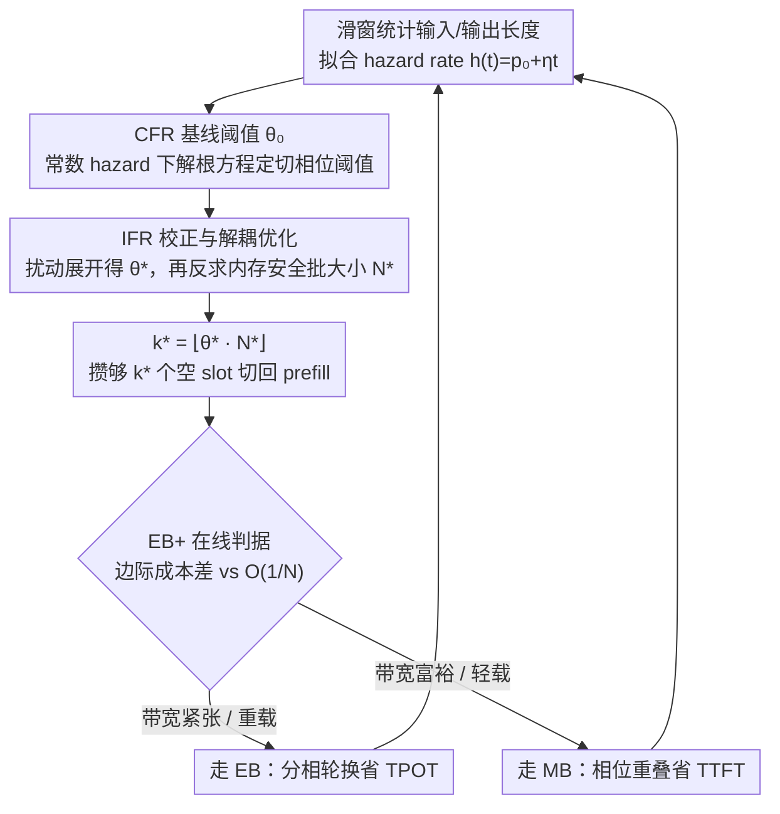

# Threshold-Based Exclusive Batching for LLM Inference

**会议**: ICML 2026  
**arXiv**: [2606.00516](https://arxiv.org/abs/2606.00516)  
**代码**: https://github.com/weifang231/eb-vllm  
**领域**: LLM 效率 / 推理调度  
**关键词**: LLM 推理, batching 调度, exclusive batching, mixed batching, 内存带宽

## 一句话总结
本文系统刻画了 LLM 推理中 mixed batching (MB) 与 exclusive batching (EB) 的性能交叉条件，证明带宽受限 GPU 上 prefill–decode 同批会因带宽争抢拖慢 Attention，进而推导出基于 hazard rate 的最优相位切换阈值 $\theta^*$ 和内存安全的批大小，并设计在线自适应调度器 EB+，在带宽受限硬件上吞吐最多提升 41.9%，非平稳流量下相对 MB 最多提升 36.4%。

## 研究背景与动机
**领域现状**：LLM 推理由 prefill (compute-bound) 与 decode (memory-bandwidth-bound) 两个截然不同的阶段组成。主流推理引擎 (vLLM v1, SGLang, TGI, TensorRT-LLM) 默认使用 mixed batching，把 prefill 与 decode token 拼进同一个 forward pass，期望同时利用算力和带宽。少数中国生产系统仍偏好 exclusive batching，即 prefill 与 decode 分批轮换执行。

**现有痛点**：MB 被默认采用的合理性从未被严格质疑。作者通过受控实验发现：在高带宽 H200 (4.8 TB/s) 上，只有当 decode token 比例 $r$ 超过 80% 时 MB 的边际成本才会超过纯 decode；而在带宽受限的 RTX PRO 6000 (1.792 TB/s) 上，这个临界点骤降到 20%。这意味着 MB 并非普适最优，但已有工作既没有给出可解析的判据，也没有自适应调度策略。

**核心矛盾**：decode Attention 需要逐 token 流式读取整段 KV-cache，本质受限于显存带宽。把 prefill 塞进同一批会与 decode 抢带宽，把 decode Attention 的延迟拉得很高；高带宽 GPU 上这种干扰被吸收，低带宽 GPU 上则被放大。当前 FlashAttention kernel 并未针对带宽受限场景下的 mixed batch 做特化，使得"统一 MB"的工程范式在很多硬件上反而是次优的。

**本文目标**：(1) 给出 EB vs MB 性能交叉的闭式判据；(2) 在 EB 模式下推导最优相位切换阈值 $k^*$ 和内存安全批大小 $N^*$；(3) 设计能在线适配工作负载与硬件的混合调度器。

**切入角度**：作者把单步迭代时间建模为线性形式 $T_{\text{iter}} = \alpha + \beta \cdot n_{\text{tok}}$，并把 batch 用 decode 比例 $r = n_{\text{decode}} / n_{\text{tok}}$ 刻画。固定 $\alpha, \beta$ 都会同时依赖硬件 (带宽) 和 batch 组成 ($r$)。再借助 saturated 假设和 fluid approximation，把吞吐优化变成一个仅依赖少量易测参数的标量优化。

**核心 idea**：用 *输出长度分布的 hazard rate* 决定何时切换 prefill/decode 相位，并用边际成本差 $\beta_{\mathrm{MB}}^e - \beta_{\mathrm{EB}}^w$ 在线判断走 EB 还是 MB。

## 方法详解

### 整体框架
本文要解决的问题是：在 exclusive batching 里，prefill 与 decode 轮流执行，到底攒够几个空 slot 再切回 prefill、整批开多大、以及什么时候干脆退回 mixed batching，才能让带宽受限 GPU 的吞吐最高。作者把单步迭代时间建成线性的 $T_{\text{iter}} = \alpha + \beta\, n_{\text{tok}}$，借 saturated 假设和 fluid approximation 把这三个工程决策化成几个仅依赖少量可测参数的标量方程，先离线解出最优阈值与批大小的闭式表达，再用滑窗统计在线估计这些参数、逐周期重算并自动决定走 EB 还是 MB。

系统维护 $N$ 个 slot (最大并发数)：decode 相位每完成一个请求腾出一个 slot，空闲 slot 攒到阈值 $k$ 时切进 prefill 相位、把 $k$ 条新请求并行灌进腾出的位置，prefill 完再回到 decode，如此循环。围绕"$k$ 取多少 / $N$ 开多大 / EB 还是 MB"这三件事，下面三个设计依次给出闭式答案与在线落地方式。

### 关键设计

**1. CFR 基线阈值 $\theta_0$：在常数 hazard rate 下定下"攒几个再切"**

工程上切相位阈值 $k$ 一直靠经验拍 (如 vLLM v0 取 $k=1$"一空就切")，而 $\alpha_p$ 较大时这种贪心会让 prefill 固定开销被反复摊不开。本文先假设输出长度服从 geometric 分布、hazard rate 恒为 $h(t)=p_0$，把 decode 相位的平均时长写成闭式 $\mathbb{E}[T_d(k;N)] = [\beta_d N\theta - \alpha_d \ln(1-\theta)]/p_0$，代入 saturated 吞吐 $\mathrm{TP}_{\mathrm{EB}}$ 后对 $k$ 求导，得到归一化阈值 $\theta_0 = \lim_{N\to\infty} k^*/N$ 满足

$$\frac{\theta_0}{1-\theta_0} + \ln(1-\theta_0) = p_0\,\frac{\alpha_p}{\alpha_d}.$$

关键之处在于这个根方程只依赖单一比值 $p_0\alpha_p/\alpha_d$，与 $N$、$\mu_L$、per-token 成本 $\beta_p,\beta_d$ 都无关——也就是说工程上一次离线测出 $(\alpha_p,\alpha_d,p_0)$ 就能解出阈值，把原本"每种硬件/模型穷举搜索"的标定，换成了一个可解释、可移植、可在线估计的标量方程。

**2. IFR 校正与解耦优化：把阈值推广到真实负载、再反求最大批大小**

真实 LLM 工作负载几乎都是 increasing-failure-rate (生成越往后越容易 EOS)，恒定 hazard rate 并不成立，而直接联合优化 $(k,N)$ 又无解析解。作者的做法是先在 $\eta$ 上做扰动展开，把 hazard rate 写成 $h(t)=p_0+\eta t$，得到 $\theta^* = \theta_0 + \Delta\theta + O(\eta^2)$，其中

$$\Delta\theta = \frac{\eta(1-\theta_0)^2}{p_0^2 \theta_0}\Big[\zeta\big(\tfrac{\theta_0}{1-\theta_0} - \tfrac{\zeta}{2}\big) + \tfrac{\beta_d N}{\alpha_d}(\zeta - \theta_0)\Big],\quad \zeta = -\ln(1-\theta_0).$$

校正项 $\Delta\theta$ 恒为正，含义是 IFR 让后续完成事件更密集、可以"再多等一会儿"再切相位。定下阈值后，再以这个 $\theta$ 在 OOM 概率 $\le\epsilon$ 约束下反求最大可行批大小

$$N^* = \Big\lfloor \big(C - \tfrac{\ln(1/\epsilon)}{p_0^2\mu_L}\big)\big/\big(\mu_L + \tfrac{1-\theta_0}{\theta_0 p_0}\ln\tfrac{1}{1-\theta_0}\big)\Big\rfloor.$$

这种"先在 $N\to\infty$ 极限下定 $\theta$、再以此 $\theta$ 反求 $N$"的解耦，绕开了联合优化的不可解，同时保留闭式解、把误差压在 $O(1/N)$ 量级，便于在线落地。

**3. EB+ 在线判据：一个不等式同时管"切相位"和"切模式"**

光会在 EB 内调阈值还不够——带宽富裕或负载很轻时 MB 反而更优，需要一个能在线判断"该不该退回 MB"的判据。作者先把 MB 的 steady-state 吞吐写成 $\mathrm{TP}_{\mathrm{MB}}(N) = [\alpha_{\mathrm{MB}}(1+\mu_O)N^{-1} + \beta_{\mathrm{MB}}^e(\mu_L + \mu_O)]^{-1}$，与 EB 吞吐对比得到 Proposition 3.4：当

$$\beta_{\mathrm{MB}}^e - \beta_{\mathrm{EB}}^w < \frac{1}{\mu_L + \mu_O}\Big[\frac{\alpha_p + \alpha_d \zeta \mu_O}{k_0^*} - \frac{\alpha_{\mathrm{MB}}(1+\mu_O)}{N}\Big]$$

成立时 MB 胜出、否则走 EB。这个不等式的妙处在于左边是"prefill–decode 同批引入的边际成本差"、由硬件带宽决定，右边是"MB 因更少 kernel launch 摊下来的固定成本优势"、量级为 $O(1/N)$ 在饱和时自动消失。落到线上时，把右侧 $N$ 换成 EMA 平滑的活跃占用 $N_{\text{obs}}$，$\beta_{\mathrm{MB}}^e(\hat r)$ 按 decode 比例 $\hat r = \hat\mu_O/(\hat\mu_L+\hat\mu_O)$ 从一次性的硬件 kernel profile 查表，再加一个可调优先级裕度 $\delta$ ($\delta>0$ 偏好 TTFT、$\delta<0$ 偏好吞吐) 得到落地的 (8) 式。最终效果是调度器在轻载时自动倾向 MB 省 TTFT、在重载且带宽紧张时倾向 EB 省 TPOT，无须手动调参或重训。

### 损失函数 / 训练策略
本工作无训练目标，全部优化在调度层进行。在线控制器维护两个滑窗：输出长度 $\mathcal{W}_O$ 与输入长度 $\mathcal{W}_L$。从 $\mathcal{W}_O$ 估计经验 hazard rate $\hat h(t) = \#\{O\in\mathcal{W}_O: O=t\} / \#\{O\in\mathcal{W}_O: O\ge t\}$，在 $t \in [1, t_{95}]$ 上用加权最小二乘拟合 $\hat h(t) = \hat p_0 + \hat\eta t$；$\hat\mu_L$ 取样本均值。每个调度周期先解 (3) 得 $\hat\theta_0$，叠加 (5) 得 $\hat\theta^*$ (clip 到 $[\theta_{\min}, \theta_{\max}]$)，再用 Proposition 3.3 算 $\hat N^*$，最后 $\hat k^* = \lfloor \hat\theta^* \hat N^* \rfloor$。$\Delta\theta$ 依赖 $N$，作者用上一周期 $\hat N^*$ 形成单步 fixed-point 更新，几个周期内收敛。

## 实验关键数据

### 主实验
评测覆盖 4 张 GPU (B300 8.0 TB/s, H200 4.8 TB/s, RTX PRO 6000 1.792 TB/s, L40S 0.864 TB/s)，主对比在 RTX PRO 6000 与 H200 上跑 Qwen3-8B 与 Qwen3-30B-A3B (MoE)，对比 v0 (EB $k=1$)、v1 (MB) 与 EB($\hat k^*$)。Workload 包含合成 (decode-heavy / balanced / prefill-heavy) 与真实 (ShareGPT, LongBench, WildChat, NuminaMath)。

| GPU / 模型 | Workload | v1 (MB) | EB($\hat k^*$) | 相对 v1 |
|---|---|---|---|---|
| RTX 6000 / Qwen3-8B | ShareGPT | 17.07 RPS | 19.68 RPS | **+15.3%** |
| RTX 6000 / Qwen3-8B | WildChat | 12.75 RPS | 14.19 RPS | **+11.3%** |
| RTX 6000 / Qwen3-8B | LongBench | 8.35 RPS | 8.66 RPS | +3.7% |
| RTX 6000 / Qwen3-8B | NuminaMath | 0.73 RPS | 0.74 RPS | +1.4% |
| RTX 6000 / Qwen3-8B | **平均** | — | — | **+7.9%** |
| RTX 6000 / Qwen3-30B | **平均** | — | — | +1.4% |
| H200 / Qwen3-8B | **平均** | — | — | +1.5% |
| H200 / Qwen3-30B | **平均** | — | — | −2.9% |

在带宽受限 GPU 上 EB($\hat k^*$) 对 v1 最高吞吐增益 41.9%；H200 上 v1 在大模型场景反超，与理论预测一致。

### 消融与自适应实验

| 配置 (RTX 6000, $c=2048$, $\mu_L=512, \mu_O=256$) | Throughput (tok/s) | TTFT (s) | TPOT (ms) |
|---|---|---|---|
| v1 (MB) | 8,830 | 83.8 | 207.3 |
| EB($\hat k^*$) | 13,179 | 70.8 | 82.7 |
| **EB+ (本文)** | **13,214** | 68.2 | 101.6 |
| EB+ $c=32$ | 4,930 | 0.061 | 19.5 (与 v1 持平) |
| EB+ 分布漂移 | 9,582 (+36.4% vs v1) | — | — |
| EB+ 并发漂移 | 10,350 (+22.6% vs v1) | — | — |

EB+ 在低并发自动落到 MB 把 TTFT 拉回 v1 水平 (0.061 s)，在高并发自动落到 EB 拿到吞吐；非平稳流量下与"事后最优单一策略"差距均在 1% 以内。

### 关键发现
- **带宽决定一切**：MB 的边际成本超过纯 decode 的临界 $r$ 在 H200 上是 80%，在 RTX PRO 6000 上骤降到 20%；kernel 拆解显示根源在 Attention 而非 GEMM，与"decode Attention 受 KV-cache 流式读取带宽限制"的 roofline 解释完全吻合。
- **闭式 $\theta_0$ 已足够好**：在 H200 上对 $k$ 做穷举扫描，闭式 EB($\hat k^*$) 在 decode-heavy / balanced / prefill-heavy 上分别比最佳定 $k$ 高 8.0% / 3.6% / 0.6%，证明解耦近似几乎没有损失，并因为能同步调 $N$ 而更优。
- **模型越大 EB 收益越小**：从 Qwen3-8B 换到 Qwen3-30B-A3B，EB 在 RTX 6000 上相对 v1 平均增益从 +7.9% 降到 +1.4%，在 H200 上从 +1.5% 翻到 −2.9%，与 (7) 中 $\alpha$ 项 ($\alpha_p, \alpha_d, \alpha_{\mathrm{MB}}$) 随模型规模放大、RHS 抬升而 MB 更具竞争力的预测一致。
- **甜点 decode 比例**：EB 增益在中等 $r \approx 0.5\text{-}0.7$ 的 ShareGPT / WildChat 上达到 +11% 以上，在极端 ($r \to 0$ 的 LongBench 与 $r > 0.85$ 的 NuminaMath) 趋小，符合附录的凸性分析。
- **TTFT vs TPOT 是结构性 trade-off**：v1 通过相位重叠拿 TTFT，EB 通过避免带宽争抢拿 TPOT (ShareGPT 上 TPOT 从 268.97 ms 降到 93.68 ms，−65%)，EB+ 用 $\delta$ 让运营商按 SLO 偏好就地调。

## 亮点与洞察
- **第一篇把 EB vs MB 写成闭式判据的工作**。过去的"vLLM v0 vs v1 谁更好"基本靠工程直觉和大表对比，本文用 $\beta_{\mathrm{MB}}^e - \beta_{\mathrm{EB}}^w$ vs $O(1/N)$ 的不等式把它压缩成一个可测量、可在线评估的标量比较；这种把硬件 (LHS) 与负载 (RHS) 干净分离的形式特别便于运营商按 SKU 做决策。
- **hazard rate 是被低估的调度信号**。把 LLM 输出长度看作生存分布、用 $h(t)$ 反推何时切相位，比"看队列长度"或"看显存余量"更早地预测未来完成节奏，是把排队论里的 NBU/IFR 概念引入 LLM serving 的漂亮迁移，可以推广到 speculative decoding 的 verify 长度选择、KV eviction 时机等任务。
- **解耦近似的工程价值**。承认联合 $(k, N)$ 无解、退而把 $\theta$ 在 $N \to \infty$ 下定下来再反求 $N$，让闭式解和在线估计同时落地；这种"先求结构、再补容量"的拆解模式可以复刻到很多 serving 调度问题 (例如 disaggregated P/D 的 pool 比例选择)。

## 局限与展望
- **fluid approximation 的有效性依赖 saturated 假设**：在轻载/突发 burst 下 batch 不再恒满，闭式吞吐与真实吞吐会出现偏差，作者只能靠 $N_{\text{obs}}$ 平滑和 KV-aware gate 兜底，对极不平稳的小流量场景还没系统化验证。
- **iteration time 线性模型简化了 kernel 行为**：$T_{\text{iter}} = \alpha + \beta n_{\text{tok}}$ 把不同 attention 实现 (FlashAttention 2/3, paged vs contiguous) 的非线性折叠成两个标量，离 H100/B300 上极端长上下文或 MoE 路由抖动场景的真实开销仍有差距。
- **只考虑单 GPU 单池**：未与 disaggregated serving (DistServe / Splitwise) 在多卡 NVLink 拓扑下的 P/D pool 自适应做对比，工业部署多卡时 EB+ 的优势可能被 KV 传输和静态分池稀释。
- **profile 表项是硬件离线测的**：$\beta_{\mathrm{MB}}^e(\hat r)$ 来自一次性 kernel timing，对 driver/CUDA 升级、kernel 替换敏感，缺少在线再校准机制。
- **改进方向**：把 hazard rate 估计扩展到非线性 (Weibull 等) 模型，给 disaggregated 与单池统一一套交叉条件，并把 EB+ 与 speculative decoding / chunked prefill 的预算共享做联合优化。

## 相关工作与启发
- **vs vLLM v0 (Kwon et al., 2023)**：v0 是 $k=1$ 的退化 EB，"一空就切"在 prefill 固定开销 $\alpha_p$ 较大时严重亏，本文给出在 saturated 极限下应有 $k = \lfloor \theta_0 N \rfloor$，等价于把 v0 的隐式策略显式化并外推。
- **vs Sarathi / DeepSpeed-FastGen / vLLM v1 (Agrawal et al., 2023, 2024; Holmes et al., 2024)**：MB + chunked prefill 在高带宽 GPU 上确实是最优，但本文证明这不是普适最优；EB+ 在 H200 上和 v1 几乎打平，在 RTX 6000 等带宽受限平台上反超，给"全行业默认 MB"的趋势打了个补丁。
- **vs DistServe / Splitwise / Mooncake (Zhong et al., 2024; Patel et al., 2024; Qin et al., 2025)**：disaggregated serving 用专用 P/D pool 消除干扰，代价是 KV-cache 传输 + GPU 数翻倍，且 P:D 静态拆分难适配漂移；本文 EB+ 在单池里就能拿到接近 PD-disaggregation 的吞吐，部署成本更低。
- **vs Lagrangian EB 调度 (Pang et al., 2025)**：同样是优化 EB 的插入决策，但用拉格朗日方法不便给闭式 $\theta^*$ 也不便扩展到 MB；本文的 hazard rate + fluid 框架更直接，能同时驱动 EB 内阈值和 EB↔MB 切换。
- **启发**：(1) "硬件 vs 负载"的判据分离可以套到 KV-cache eviction 与 speculative decoding 调度上；(2) hazard rate 作为生存信号是 LLM serving 里被普遍忽略但极便宜的量；(3) "解耦 + 闭式 + 在线 fixed-point"的三段式应对了 LLM 推理调度里几乎所有"联合不可解"的优化问题。

## 评分
- 新颖性: ⭐⭐⭐⭐ 把 EB vs MB 从工程偏好升级为可解析判据，hazard rate 视角是新颖的概念迁移。
- 实验充分度: ⭐⭐⭐⭐ 覆盖 4 张 GPU × 2 模型 × 4 真实 + 3 合成 workload + 非平稳流量，且每个理论命题都有对应验证。
- 写作质量: ⭐⭐⭐⭐ 命题与定理给得清楚，硬件/负载/调度三者的故事线一气呵成，附录补完了凸性与内存分析。
- 价值: ⭐⭐⭐⭐⭐ 直接落到 vLLM 上、对带宽受限硬件 (含国内 GPU 与 L40S 类卡) 是吞吐 +40% 量级的实用改进，开源可复现。

<!-- RELATED:START -->

## 相关论文

- [\[AAAI 2026\] TimeBill: Time-Budgeted Inference for Large Language Models](../../AAAI2026/autonomous_driving/timebill_time-budgeted_inference_for_large_language_models.md)
- [\[ICML 2025\] SPHINX: Structural Prediction using Hypergraph Inference Network](../../ICML2025/autonomous_driving/sphinx_structural_prediction_using_hypergraph_inference_network.md)
- [\[ICCV 2025\] CoLMDriver: LLM-based Negotiation Benefits Cooperative Autonomous Driving](../../ICCV2025/autonomous_driving/colmdriver_llm-based_negotiation_benefits_cooperative_autonomous_driving.md)
- [\[CVPR 2026\] Open-Ended Instruction Realization with LLM-Enabled Multi-Planner Scheduling in Autonomous Vehicles](../../CVPR2026/autonomous_driving/open-ended_instruction_realization_with_llm-enabled_multi-planner_scheduling_in_.md)
- [\[NeurIPS 2025\] BayesG: Bayesian Ego-Graph Inference for Networked Multi-Agent Reinforcement Learning](../../NeurIPS2025/autonomous_driving/bayesian_ego-graph_inference_for_networked_multi-agent_reinforcement_learning.md)

<!-- RELATED:END -->
